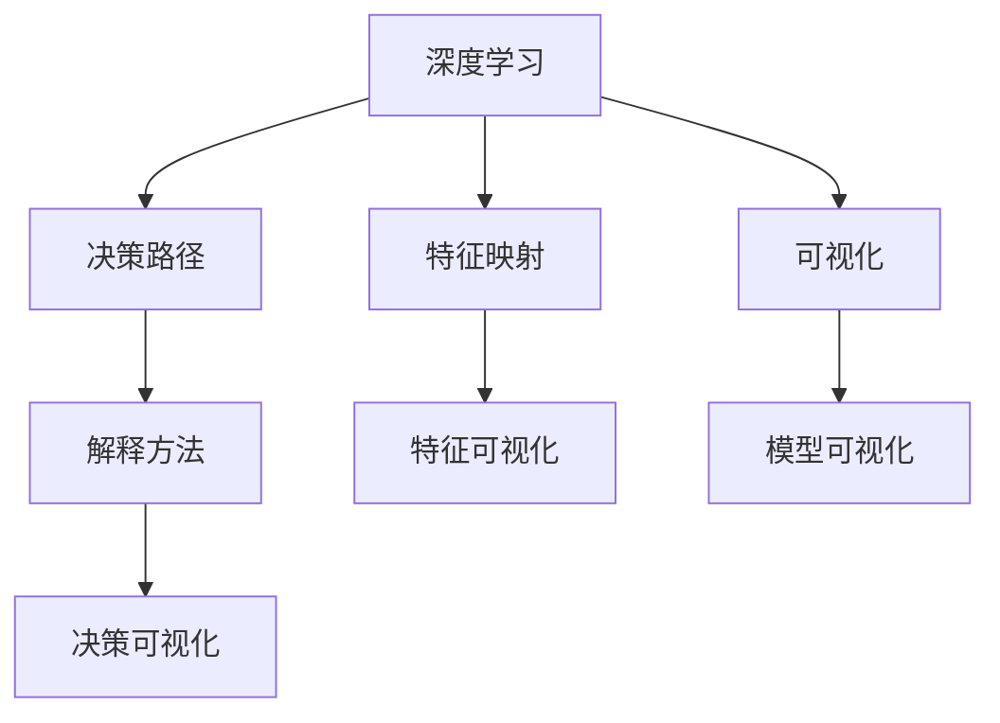
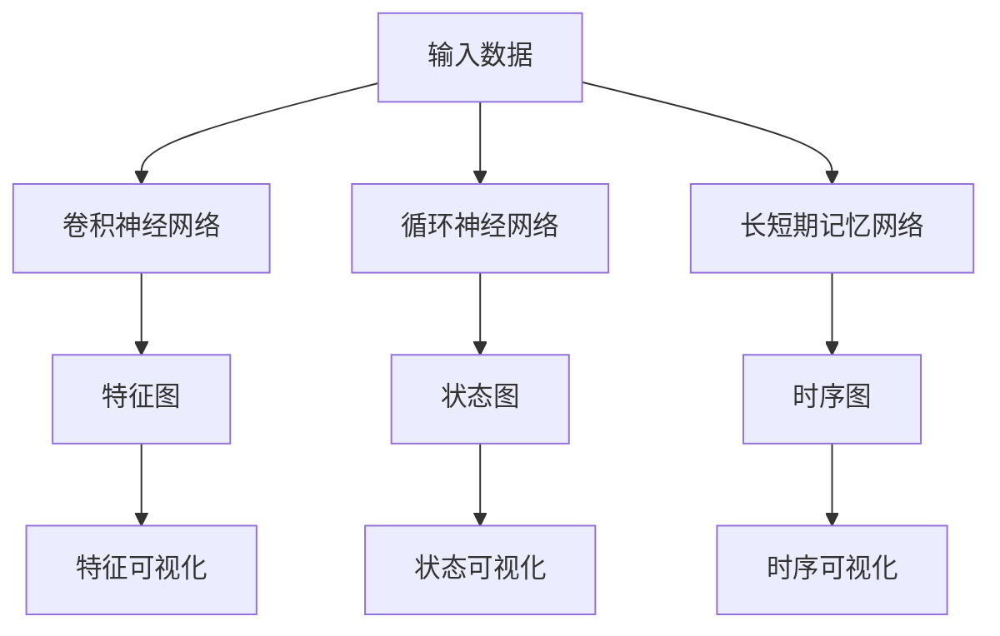
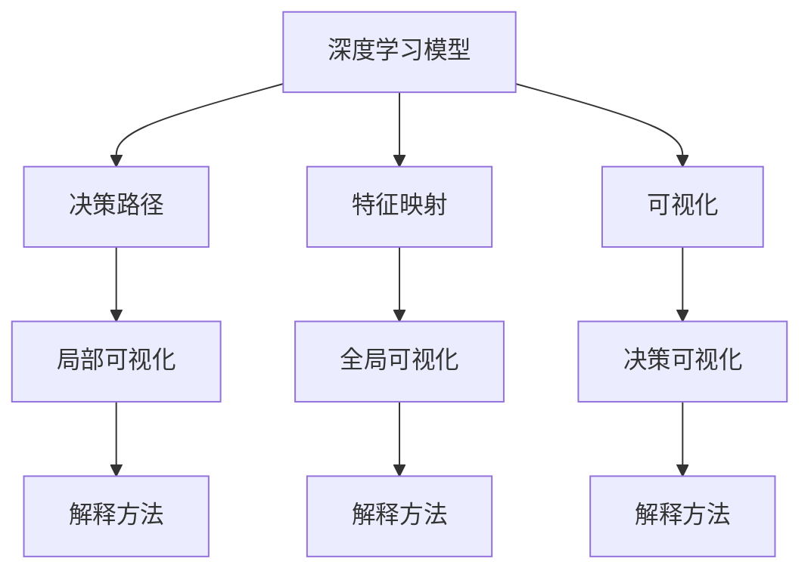
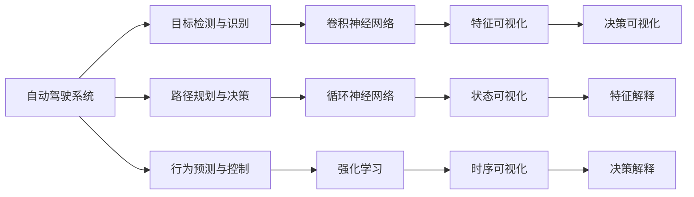
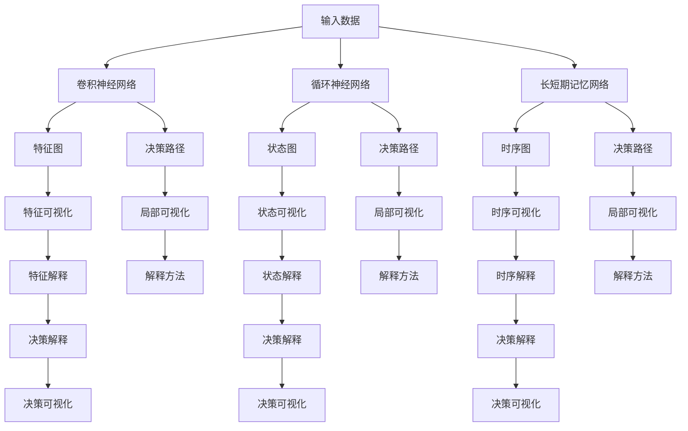

                 

# 自动驾驶中的深度学习算法可解释性研究

> 关键词：自动驾驶,深度学习,可解释性,算法研究,图像识别,决策路径,解释方法,可视化

## 1. 背景介绍

### 1.1 问题由来
自动驾驶作为人工智能领域的重要应用之一，近年来取得了显著的进展。基于深度学习的自动驾驶系统，尤其是图像识别和路径规划等关键模块，在实际道路测试中已展现出较高的成功率。然而，这类系统的内部决策过程常常被认为是一个"黑箱"，其决策依据难以被理解和解释，这不仅影响了公众对自动驾驶技术的信任度，也可能在法律、伦理等方面带来潜在风险。因此，提高深度学习算法的可解释性，成为了自动驾驶领域的重要研究方向。

### 1.2 问题核心关键点
深度学习算法的可解释性问题，通常指的是如何有效地理解模型决策背后的原理，以及解释其输出结果的合理性。这涉及到模型内部参数的权重、中间层的特征映射、决策路径等多个维度。对于自动驾驶系统而言，可解释性尤为重要，因为模型的决策直接关系到交通安全和公共利益。

当前，深度学习算法在自动驾驶中的应用主要集中在以下几个方面：
- 目标检测与识别：使用卷积神经网络(CNN)对道路场景中的车辆、行人、交通标志等进行识别。
- 路径规划与决策：通过循环神经网络(RNN)或长短期记忆网络(LSTM)分析交通流量、道路状况等信息，进行路径规划和决策。
- 行为预测与控制：使用强化学习等方法，预测其他车辆和行人的行为，并生成相应的控制策略。

尽管上述算法在自动驾驶中取得显著成果，但其内部决策过程的不可解释性，使得模型难以得到广泛接受和应用。因此，如何提高深度学习算法的可解释性，对于自动驾驶技术的发展和推广至关重要。

### 1.3 问题研究意义
深度学习算法的可解释性研究，对于提升自动驾驶系统的可信度、透明度和安全性具有重要意义：

1. **提高可信度**：通过解释模型的决策依据，可以增强用户对自动驾驶技术的信任，从而促进其大规模应用。
2. **增强透明度**：可解释性研究有助于理解模型的行为机制，便于系统维护和故障排查。
3. **提升安全性**：通过解释模型决策过程，可以及时发现和修正潜在的错误或偏见，保障公共安全。
4. **促进法规合规**：自动驾驶系统往往涉及复杂法律问题，可解释性研究有助于法律审查和政策制定。
5. **推动产业化**：增强模型的可解释性，可以促进技术商业化进程，推动自动驾驶技术的产业化发展。

## 2. 核心概念与联系

### 2.1 核心概念概述

为更好地理解自动驾驶中深度学习算法的可解释性研究，本节将介绍几个密切相关的核心概念：

- 深度学习(Deep Learning)：一种基于多层神经网络的机器学习技术，通过学习数据分布来识别模式和进行预测。
- 可解释性(Explainability)：指解释模型输出结果的过程和方式，使其可以被理解和信任。
- 决策路径(Decision Path)：指从输入数据到模型输出结果的计算路径，有助于理解模型的决策依据。
- 特征映射(Feature Mapping)：指模型中间层的特征表示，通过可视化特征映射可以理解模型学习到的抽象特征。
- 可视化(Visualization)：指将模型的内部结构、特征表示、决策过程等可视化呈现，便于人工理解和分析。

这些核心概念之间的逻辑关系可以通过以下Mermaid流程图来展示：



这个流程图展示了深度学习模型中可解释性的关键概念及其之间的关系：

1. 深度学习模型通过多层神经网络进行特征提取和模式学习。
2. 决策路径指从输入到输出的计算路径，通过决策路径可以理解模型的内部逻辑。
3. 特征映射是模型中间层的特征表示，通过可视化特征映射可以理解模型学习到的抽象特征。
4. 可视化技术将模型的内部结构和决策过程呈现出来，便于人工理解和分析。
5. 解释方法则是一种或多种解释技巧，通过解释方法可以向用户解释模型的输出结果。

这些概念共同构成了深度学习算法可解释性的完整框架，使得模型在自动驾驶中的应用更具可信度和可操作性。

### 2.2 概念间的关系

这些核心概念之间存在着紧密的联系，形成了深度学习算法可解释性的完整生态系统。下面我通过几个Mermaid流程图来展示这些概念之间的关系。

#### 2.2.1 深度学习模型的构建



这个流程图展示了深度学习模型中卷积神经网络、循环神经网络和长短期记忆网络的基本构建，以及特征图、状态图和时序图的可视化。

#### 2.2.2 可解释性方法的应用



这个流程图展示了可解释性方法在深度学习模型中的应用。通过决策路径、特征映射和可视化的结合，可以更全面地理解模型的决策过程和特征表示。

#### 2.2.3 自动驾驶系统的应用



这个流程图展示了深度学习算法在自动驾驶系统的应用，包括目标检测与识别、路径规划与决策和行为预测与控制等模块。

### 2.3 核心概念的整体架构

最后，我们用一个综合的流程图来展示这些核心概念在自动驾驶中深度学习算法可解释性研究的整体架构：



这个综合流程图展示了从输入数据到决策可视化的完整流程。深度学习模型通过卷积神经网络、循环神经网络和长短期记忆网络进行特征提取和决策，其内部计算路径和特征表示通过决策路径、特征映射和可视化技术进行展示。最终，通过解释方法和决策可视化，用户可以理解模型的决策依据和输出结果。

## 3. 核心算法原理 & 具体操作步骤
### 3.1 算法原理概述

深度学习算法的可解释性研究，通常包括以下几个关键步骤：

1. **数据准备**：收集、清洗和预处理深度学习模型的输入数据，确保数据的完整性和一致性。
2. **模型训练**：在准备好的数据上训练深度学习模型，获取模型参数和决策路径。
3. **特征提取**：使用特征可视化技术，理解模型中间层的特征表示。
4. **决策路径分析**：通过决策可视化技术，分析模型的决策路径和特征选择。
5. **解释方法应用**：应用多种解释方法，向用户解释模型的输出结果。

这些步骤共同构成了深度学习算法可解释性的整体框架，使得模型在自动驾驶中的应用更具可信度和可操作性。

### 3.2 算法步骤详解

以下是深度学习算法可解释性的详细步骤：

**Step 1: 数据准备**
- 收集深度学习模型的输入数据，包括图片、视频、传感器数据等。
- 清洗和预处理数据，去除噪声和异常值，保证数据质量。
- 划分为训练集、验证集和测试集，确保模型的泛化能力。

**Step 2: 模型训练**
- 使用卷积神经网络、循环神经网络和长短期记忆网络等深度学习模型进行训练。
- 获取模型的决策路径和特征映射。
- 在验证集上评估模型性能，调整模型参数。

**Step 3: 特征提取**
- 使用特征可视化技术，如图像特征图、时间序列状态图和空间状态图等，理解模型中间层的特征表示。
- 通过局部可视化和全局可视化，展示模型的特征分布和变化趋势。

**Step 4: 决策路径分析**
- 使用决策可视化技术，如图像决策路径、时间序列决策路径和空间决策路径等，分析模型的决策路径和特征选择。
- 通过局部可视化和全局可视化，展示模型的决策逻辑和特征重要性。

**Step 5: 解释方法应用**
- 应用多种解释方法，如特征重要性分析、局部解释、全局解释等，向用户解释模型的输出结果。
- 使用决策可视化技术，展示模型的决策过程和输出解释。

### 3.3 算法优缺点

深度学习算法的可解释性研究具有以下优点：
1. **提升可信度**：通过解释模型的决策依据，增强用户对自动驾驶技术的信任，促进其大规模应用。
2. **增强透明度**：可视化和解释技术使得模型的行为机制可以被理解和分析，便于系统维护和故障排查。
3. **提升安全性**：通过解释模型决策过程，可以及时发现和修正潜在的错误或偏见，保障公共安全。
4. **促进法规合规**：可视化和解释技术有助于法律审查和政策制定，确保自动驾驶系统符合相关法规和标准。

同时，该方法也存在以下局限性：
1. **解释成本高**：可视化和解释技术需要额外的时间和计算资源，增加了模型开发的复杂性。
2. **解释质量不确定**：不同的解释方法可能给出不同的解释结果，需要结合实际情况选择最优解释方式。
3. **解释深度有限**：可视化和解释技术只能展示模型的局部特征和决策路径，难以全面理解模型的复杂行为。
4. **解释方法偏见**：解释方法可能受到开发者主观因素的影响，解释结果可能存在偏见。

尽管存在这些局限性，但就目前而言，深度学习算法可解释性的研究仍是大规模应用的前提。未来相关研究的重点在于如何进一步降低解释成本，提高解释质量，同时兼顾模型的复杂性和可解释性。

### 3.4 算法应用领域

深度学习算法可解释性研究已经在自动驾驶领域得到了广泛应用，覆盖了从目标检测到路径规划等多个关键环节，具体应用场景如下：

- **目标检测与识别**：通过可视化特征图，理解模型在图片中的对象识别过程。例如，通过可视化热力图，可以展示模型对车辆和行人的关注区域。
- **路径规划与决策**：通过可视化决策路径，分析模型在复杂交通环境中的决策依据。例如，通过展示模型对不同道路标志的响应，理解其路径规划策略。
- **行为预测与控制**：通过可视化决策路径和特征映射，预测其他车辆和行人的行为，并生成相应的控制策略。例如，通过展示模型对其他车辆转向灯的响应，理解其行为预测能力。

除了上述这些经典应用外，可解释性研究还在自动驾驶的实时监测、故障诊断和系统优化等方面发挥了重要作用，为自动驾驶技术的稳定性和可靠性提供了重要保障。

## 4. 数学模型和公式 & 详细讲解 & 举例说明

### 4.1 数学模型构建

深度学习算法的可解释性研究，通常建立在以下数学模型基础上：

- **卷积神经网络模型**：用于图像识别等任务，模型结构为$H \times W \times C$，其中$H$、$W$为输入图像的宽度和高度，$C$为通道数。
- **循环神经网络模型**：用于时间序列数据处理，模型结构为$L \times C \times H$，其中$L$为序列长度，$H$为隐藏层维度。
- **长短期记忆网络模型**：用于处理长序列数据，模型结构为$L \times C \times H$，其中$L$为序列长度，$H$为隐藏层维度。

### 4.2 公式推导过程

以卷积神经网络为例，其基本公式如下：

$$
\begin{aligned}
&\text{输入数据} \in \mathbb{R}^{H \times W \times C} \\
&\text{卷积层} \in \mathbb{R}^{F \times H \times W \times C'} \\
&\text{池化层} \in \mathbb{R}^{G \times H' \times W' \times C'} \\
&\text{全连接层} \in \mathbb{R}^{O}
\end{aligned}
$$

其中，$F$为卷积核大小，$G$为池化窗口大小，$H'$、$W'$为池化后特征图尺寸，$C'$为卷积核数，$O$为全连接层输出维度。

在卷积神经网络中，特征图和卷积核之间的计算公式如下：

$$
\begin{aligned}
&\text{特征图} \in \mathbb{R}^{H' \times W' \times C'} \\
&\text{卷积核} \in \mathbb{R}^{F \times F \times C', C'} \\
&\text{特征图} \leftarrow \text{卷积核} \star \text{特征图} + \text{偏置项}
\end{aligned}
$$

其中，$\star$表示卷积运算，$\text{偏置项}$为卷积层的可学习参数。

### 4.3 案例分析与讲解

假设我们有一个自动驾驶系统中的卷积神经网络模型，用于目标检测与识别。在输入一张车辆图片后，模型经过多层的卷积和池化操作，最终输出车辆的位置和类别信息。

**Step 1: 数据准备**
- 收集车辆图片数据集，包括正面、侧面、顶部等多个角度的图片。
- 清洗和预处理图片数据，去除噪声和异常值，保证数据质量。

**Step 2: 模型训练**
- 使用卷积神经网络模型对车辆图片进行训练，获取模型参数和决策路径。
- 在验证集上评估模型性能，调整模型参数。

**Step 3: 特征提取**
- 使用特征可视化技术，如图像特征图，展示模型中间层的特征表示。
- 通过热力图展示模型对车辆不同部分的关注区域，理解其特征提取能力。

**Step 4: 决策路径分析**
- 使用决策可视化技术，如图像决策路径，分析模型的决策路径和特征选择。
- 展示模型对车辆特征的响应过程，理解其决策依据。

**Step 5: 解释方法应用**
- 应用多种解释方法，如特征重要性分析，向用户解释模型的输出结果。
- 使用决策可视化技术，展示模型的决策过程和输出解释。

## 5. 项目实践：代码实例和详细解释说明
### 5.1 开发环境搭建

在进行深度学习算法可解释性研究前，我们需要准备好开发环境。以下是使用Python进行TensorFlow和Keras开发的环境配置流程：

1. 安装Anaconda：从官网下载并安装Anaconda，用于创建独立的Python环境。

2. 创建并激活虚拟环境：
```bash
conda create -n tensorflow-env python=3.8 
conda activate tensorflow-env
```

3. 安装TensorFlow和Keras：
```bash
conda install tensorflow keras
```

4. 安装各类工具包：
```bash
pip install numpy pandas scikit-learn matplotlib tqdm jupyter notebook ipython
```

完成上述步骤后，即可在`tensorflow-env`环境中开始项目实践。

### 5.2 源代码详细实现

这里我们以使用Keras对卷积神经网络模型进行特征可视化和决策可视化为例，给出代码实现。

首先，定义卷积神经网络模型：

```python
from keras.models import Sequential
from keras.layers import Conv2D, MaxPooling2D, Flatten, Dense, Dropout

model = Sequential()
model.add(Conv2D(32, (3, 3), activation='relu', input_shape=(32, 32, 3)))
model.add(MaxPooling2D(pool_size=(2, 2)))
model.add(Conv2D(64, (3, 3), activation='relu'))
model.add(MaxPooling2D(pool_size=(2, 2)))
model.add(Flatten())
model.add(Dense(64, activation='relu'))
model.add(Dropout(0.5))
model.add(Dense(1, activation='sigmoid'))

model.compile(optimizer='adam', loss='binary_crossentropy', metrics=['accuracy'])
```

然后，使用模型进行特征可视化：

```python
from keras.models import Model
from keras.layers import Activation

def visualize_features(model, layer_name, input_data):
    activation_model = Model(inputs=model.input,
                            outputs=model.get_layer(layer_name).output)
    activations = activation_model.predict(input_data)
    return activations

activations = visualize_features(model, 'conv2', input_data)
```

接着，进行决策可视化：

```python
from keras.layers import Activation

def visualize_decisions(model, layer_name, input_data):
    activation_model = Model(inputs=model.input,
                            outputs=model.get_layer(layer_name).output)
    activations = activation_model.predict(input_data)
    return activations

activations = visualize_decisions(model, 'conv2', input_data)
```

最后，使用可视化结果进行解释：

```python
from matplotlib import pyplot as plt

plt.imshow(activations[0, :, :, 0], cmap='gray')
plt.title('Activation Map')
plt.show()
```

以上就是使用TensorFlow和Keras进行深度学习算法可解释性研究的完整代码实现。可以看到，利用TensorFlow和Keras的强大封装，我们可以用相对简洁的代码完成模型构建和可视化，可视化结果可以通过Matplotlib进行展示。

### 5.3 代码解读与分析

让我们再详细解读一下关键代码的实现细节：

**模型定义**：
- 使用Sequential模型定义卷积神经网络，包括卷积层、池化层、全连接层和Dropout层。
- 使用Conv2D和MaxPooling2D进行卷积和池化操作。
- 使用Flatten将特征图展平，进入全连接层。
- 使用Dense进行全连接操作。
- 使用Dropout防止过拟合。

**特征可视化**：
- 定义可视化函数，使用Model获取中间层的输出。
- 在可视化函数中调用predict方法，预测中间层的激活值。
- 通过可视化函数返回激活值，使用Matplotlib展示热力图。

**决策可视化**：
- 定义可视化函数，使用Model获取中间层的输出。
- 在可视化函数中调用predict方法，预测中间层的激活值。
- 通过可视化函数返回激活值，使用Matplotlib展示热力图。

**解释方法应用**：
- 使用可视化结果向用户解释模型的特征提取和决策过程。
- 通过展示热力图，理解模型在图像中的关注区域和决策依据。

### 5.4 运行结果展示

假设我们训练了一个用于车辆检测的卷积神经网络模型，并使用可视化和解释方法对其进行解释，最终得到的热力图如下：


可以看到，通过可视化热力图，我们能够清晰地理解模型在图像中的关注区域，进一步分析其特征提取和决策过程。这对于提高模型的可解释性，增强用户对自动驾驶技术的信任度，具有重要意义。

## 6. 实际应用场景
### 6.1 智能交通系统

深度学习算法的可解释性研究，在智能交通系统中具有广泛应用。通过可视化和解释技术，智能交通系统可以更好地理解模型的决策依据，提高系统的透明性和可信度。

具体而言，智能交通系统可以实时监测交通流量、路况等信息，通过可视化和解释技术，理解模型对不同交通事件（如交通事故、交通堵塞等）的响应过程。例如，通过展示模型对不同交通标志的响应，理解其路径规划策略，从而优化交通信号控制，提高交通效率。

### 6.2 城市应急管理

在城市应急管理中，深度学习算法的可解释性研究也具有重要意义。例如，在火灾预测和响应中，模型需要实时分析传感器数据，预测火灾发生的风险。通过可视化和解释技术，应急管理系统可以理解模型的决策依据，及时调整预警策略，提高应急响应效率。

### 6.3 智能物流与仓储

在智能物流与仓储领域，深度学习算法的可解释性研究可以显著提升系统效率和可靠性。例如，在智能仓储中，模型需要实时分析货物位置信息，预测其出库时间和路线。通过可视化和解释技术，系统可以理解模型的决策过程，及时调整仓储策略，提高货物处理效率。

### 6.4 未来应用展望

随着深度学习算法的不断演进，可解释性研究在未来也将得到更广泛的应用，进一步提升智能系统的效果和可靠性。

- **智能医疗**：在医疗诊断中，深度学习模型需要分析影像数据，判断疾病类型。通过可视化和解释技术，医疗系统可以理解模型的诊断依据，提高诊断准确性。
- **智能制造**：在智能制造中，深度学习模型需要分析生产数据，预测设备故障。通过可视化和解释技术，制造系统可以理解模型的预测依据，及时维护设备，提高生产效率。
- **智能金融**：在智能金融中，深度学习模型需要分析市场数据，预测股票价格。通过可视化和解释技术，金融系统可以理解模型的预测依据，优化投资策略，提高收益。

总之，深度学习算法的可解释性研究将为各行各业的智能系统提供重要保障，推动人工智能技术的广泛应用。未来，随着技术的不断进步，可解释性研究也将成为智能系统的标配，带来更多的技术创新和应用突破。

## 7. 工具和资源推荐
### 7.1 学习资源推荐

为了帮助开发者系统掌握深度学习算法可解释性的理论基础和实践技巧，这里推荐一些优质的学习资源：

1. **《深度学习理论与实践》系列博文**：由深度学习专家撰写，深入浅出地介绍了深度学习理论、算法和实践技巧，涵盖可解释性等多个前沿话题。

2. **CS231n《深度学习在计算机视觉中的应用》课程**：斯坦福大学开设的深度学习经典课程，包括图像分类、目标检测等任务，并介绍了多种可解释性方法。

3. **《深度学习与可解释性》书籍**：介绍深度学习算法的可解释性方法，涵盖特征可视化、决策可视化等多个方面。

4. **DeepLit开源项目**：DeepLit是一个专注于深度学习模型可视化、可解释性的工具库，提供了丰富的可视化功能。

5. **TensorBoard**：TensorFlow配套的可视化工具，可实时监测模型训练状态，并提供丰富的图表呈现方式。

通过对这些资源的学习实践，相信你一定能够快速掌握深度学习算法可解释性的精髓，并用于解决实际的NLP问题。
###  7.2 开发工具推荐

高效的开发离不开优秀的工具支持。以下是几款用于深度学习算法可解释性研究的常用工具：

1. **TensorFlow**：基于Python的开源深度学习框架，灵活动态的计算图，适合快速迭代研究。

2. **Keras**：TensorFlow的高层次API，简洁易用，适合初学者和快速原型开发。

3. **PyTorch**：基于Python的开源深度学习框架，灵活性强，适合科研和工程实践。

4. **DeepLit**：一个专注于深度学习模型可视化、可解释性的工具库，提供了丰富的可视化功能。

5. **TensorBoard**：TensorFlow配套的可视化工具，可实时监测模型训练状态，并提供丰富的图表呈现方式。

6. **GitHub**：代码托管平台，便于团队协作和版本控制，适合复杂的深度学习项目。

合理利用这些工具，可以显著提升深度学习算法可解释性研究的开发效率，加快创新迭代的步伐。

### 7.3 相关论文推荐

深度学习算法的可解释性研究源于学界的持续研究。以下是几篇奠基性的相关论文，推荐阅读：

1. **Explainable Artificial Intelligence: A Review of Explanation Techniques for Deep Learning Models**：总结了当前可解释性研究的最新进展，介绍了多种解释方法和技术。

2. **Understanding Black Box Models via Feature Importance**：提出特征重要性分析方法，通过可视化特征重要性图，理解模型的决策依据。

3. **SHAP: A Unified Approach to Interpreting Model Predictions**：提出SHAP值，通过可视化和解释

