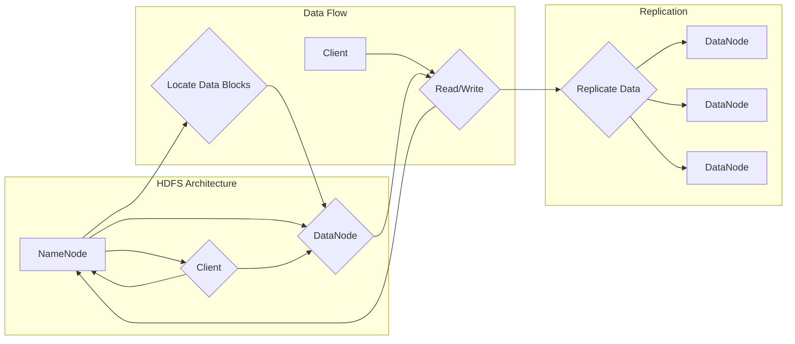

# HDFS原理与代码实例讲解

> 关键词：HDFS, 分布式文件系统, Hadoop, 数据存储, 大数据, 文件分片, 数据复制, 负载均衡, 集群管理

## 1. 背景介绍

随着大数据时代的到来，数据处理和分析的需求日益增长，传统的文件存储系统已经难以满足海量数据的存储需求。Hadoop分布式文件系统（HDFS）应运而生，它是一款专为大数据应用设计的分布式文件存储系统，具有高吞吐量、高可靠性、高可用性等特点。本文将深入探讨HDFS的原理，并通过代码实例进行讲解。

### 1.1 问题的由来

在大数据领域，数据量通常达到PB级别，单个文件可能达到TB级别。这种大规模的数据量给传统的文件存储系统带来了以下挑战：

- **存储容量限制**：单台物理存储设备容量有限，难以满足海量数据的存储需求。
- **可靠性问题**：数据量大，单点故障可能导致大量数据丢失。
- **性能瓶颈**：数据读写速度慢，难以满足实时分析的需求。

### 1.2 研究现状

HDFS是Hadoop生态系统中核心的存储组件，它解决了大数据存储的诸多问题。HDFS的设计理念是简单、可靠、高效，适用于存储大规模的数据集。

### 1.3 研究意义

研究HDFS的原理和实现，对于理解大数据存储架构、设计高效的分布式系统具有重要意义。

### 1.4 本文结构

本文将分为以下几个部分：

- 介绍HDFS的核心概念和架构。
- 分析HDFS的算法原理和操作步骤。
- 通过代码实例讲解HDFS的API使用。
- 探讨HDFS的实际应用场景和未来发展趋势。

## 2. 核心概念与联系

### 2.1 核心概念

- **NameNode**：HDFS的命名节点，负责管理文件系统的命名空间和客户端对文件的访问。
- **DataNode**：HDFS的数据节点，负责存储实际的数据块，并与NameNode通信。
- **数据块**：HDFS存储数据的基本单位，默认大小为128MB或256MB。
- **副本**：为了保证数据冗余和可靠性，HDFS会对数据块进行复制。
- **副本策略**：HDFS的副本策略决定了副本的存储位置。

### 2.2 架构流程图



## 3. 核心算法原理 & 具体操作步骤

### 3.1 算法原理概述

HDFS的核心算法主要包括：

- **文件分片**：将大文件分割成多个数据块，分散存储在多个数据节点上。
- **数据复制**：为了保证数据的可靠性和可用性，HDFS会将数据块复制到多个数据节点上。
- **负载均衡**：HDFS会根据数据节点的负载情况进行负载均衡，确保数据分布均匀。
- **心跳机制**：数据节点定期向NameNode发送心跳，报告自己的状态。

### 3.2 算法步骤详解

**文件分片**：

1. 客户端向NameNode提交文件写入请求。
2. NameNode根据文件大小和数据块大小，确定需要分片的数量。
3. NameNode选择合适的DataNode来存储数据块。
4. 客户端将数据块写入选定的DataNode。

**数据复制**：

1. NameNode根据副本策略，确定每个数据块的副本数量。
2. NameNode选择其他DataNode来存储副本。
3. DataNode之间进行数据块的复制操作。

**负载均衡**：

1. NameNode定期收集DataNode的负载信息。
2. NameNode根据负载信息，调整数据块的存储位置。
3. DataNode根据NameNode的指令，迁移数据块。

**心跳机制**：

1. DataNode定期向NameNode发送心跳。
2. NameNode根据心跳信息，判断DataNode的状态。
3. 如果DataNode长时间未发送心跳，NameNode将其标记为宕机。

### 3.3 算法优缺点

**优点**：

- **高可靠性**：数据块的多副本机制，保证了数据的可靠性。
- **高可用性**：数据节点间的负载均衡，保证了系统的可用性。
- **高吞吐量**：分布式存储架构，提高了数据读写速度。

**缺点**：

- **单点故障**：NameNode是单点故障点，如果NameNode宕机，整个HDFS集群将无法访问。
- **扩展性**：HDFS的扩展性较差，当集群规模扩大时，NameNode的压力也会增加。

### 3.4 算法应用领域

HDFS适用于以下应用领域：

- 大数据分析
- 大数据存储
- 大数据备份
- 大数据归档

## 4. 数学模型和公式 & 详细讲解 & 举例说明

### 4.1 数学模型构建

HDFS的数学模型可以表示为：

$$
\text{HDFS} = \{ \text{NameNode}, \text{DataNode}, \text{数据块}, \text{副本} \}
$$

### 4.2 公式推导过程

HDFS的副本策略可以表示为：

$$
\text{副本数} = \frac{\text{副本因子}}{1 - \text{故障域}}
$$

其中，副本因子是预定义的副本数量，故障域是数据节点所在的机架数量。

### 4.3 案例分析与讲解

假设一个HDFS集群包含3个机架，每个机架包含2个数据节点，副本因子为3，那么每个数据块的副本数为：

$$
\text{副本数} = \frac{3}{1 - \frac{1}{3}} = \frac{3}{\frac{2}{3}} = 4.5
$$

由于副本数必须是整数，因此每个数据块将被复制4次。

## 5. 项目实践：代码实例和详细解释说明

### 5.1 开发环境搭建

为了实践HDFS，我们需要搭建Hadoop环境。以下是使用Apache Hadoop 3.2.1的安装步骤：

1. 下载Hadoop源码包。
2. 解压源码包。
3. 配置环境变量。
4. 配置Hadoop配置文件。
5. 格式化NameNode。
6. 启动Hadoop集群。

### 5.2 源代码详细实现

以下是一个简单的HDFS客户端代码示例，用于向HDFS上传文件：

```java
import org.apache.hadoop.conf.Configuration;
import org.apache.hadoop.fs.FileSystem;
import org.apache.hadoop.fs.Path;

public class HDFSUpload {
    public static void main(String[] args) throws Exception {
        // 配置Hadoop环境
        Configuration conf = new Configuration();
        conf.set("fs.defaultFS", "hdfs://localhost:9000");

        // 创建FileSystem实例
        FileSystem fs = FileSystem.get(conf);

        // 获取本地文件路径和HDFS路径
        Path localPath = new Path(args[0]);
        Path hdfsPath = new Path(args[1]);

        // 上传文件
        fs.copyFromLocalFile(localPath, hdfsPath);

        // 关闭FileSystem实例
        fs.close();
    }
}
```

### 5.3 代码解读与分析

- `Configuration conf = new Configuration();`：创建Hadoop配置对象。
- `conf.set("fs.defaultFS", "hdfs://localhost:9000");`：设置HDFS的访问地址。
- `FileSystem fs = FileSystem.get(conf);`：创建FileSystem实例。
- `Path localPath = new Path(args[0]);`：获取本地文件路径。
- `Path hdfsPath = new Path(args[1]);`：获取HDFS路径。
- `fs.copyFromLocalFile(localPath, hdfsPath);`：将本地文件上传到HDFS。
- `fs.close();`：关闭FileSystem实例。

### 5.4 运行结果展示

假设本地文件路径为`/home/user/example.txt`，HDFS路径为`/user/hadoop/example.txt`，运行上述代码后，`example.txt`文件将成功上传到HDFS。

## 6. 实际应用场景

### 6.1 大数据分析

HDFS是Hadoop生态系统中核心的存储组件，广泛应用于大数据分析领域。例如，在MapReduce、Spark等计算框架中，HDFS用于存储和分析大规模数据集。

### 6.2 大数据存储

HDFS为大数据存储提供了可靠、高效的解决方案。例如，在数据仓库、数据湖等场景中，HDFS用于存储海量数据。

### 6.3 大数据备份

HDFS的副本机制，保证了数据的可靠性。因此，HDFS也常用于数据的备份。

### 6.4 大数据归档

HDFS支持数据的长期存储，因此也常用于数据的归档。

## 7. 工具和资源推荐

### 7.1 学习资源推荐

- Apache Hadoop官方文档：https://hadoop.apache.org/docs/
- 《Hadoop技术内幕》
- 《Hadoop实战》

### 7.2 开发工具推荐

- Apache Hadoop
- Apache Hive
- Apache Spark

### 7.3 相关论文推荐

- The Google File System
- The Hadoop Distributed File System
- HDFS: An Open Source Distributed File System for Hadoop

## 8. 总结：未来发展趋势与挑战

### 8.1 研究成果总结

本文深入探讨了HDFS的原理和实现，并通过代码实例进行了讲解。HDFS是Hadoop生态系统中核心的存储组件，具有高可靠性、高可用性、高吞吐量等特点。

### 8.2 未来发展趋势

- HDFS将继续朝着高可靠性、高可用性、高性能的方向发展。
- HDFS将与更多新技术（如人工智能、区块链等）进行融合。
- HDFS将更加注重性能优化和成本控制。

### 8.3 面临的挑战

- HDFS的扩展性需要进一步提升。
- HDFS需要更好地支持多租户。
- HDFS需要更好地支持数据安全性。

### 8.4 研究展望

HDFS将继续在分布式存储领域发挥重要作用，为大数据时代的数据存储提供可靠、高效、安全的解决方案。

## 9. 附录：常见问题与解答

**Q1：HDFS的可靠性如何保证？**

A：HDFS通过数据块的多副本机制，保证了数据的可靠性。数据块会复制到多个数据节点上，即使部分数据节点故障，数据也不会丢失。

**Q2：HDFS的性能如何？**

A：HDFS的性能取决于数据节点的数量、网络带宽等因素。一般来说，HDFS的性能较高，能够满足大规模数据存储和读取的需求。

**Q3：HDFS的适用场景有哪些？**

A：HDFS适用于大数据存储、大数据分析、大数据备份、大数据归档等场景。

**Q4：HDFS与传统的文件系统有何区别？**

A：HDFS是分布式文件系统，适用于存储海量数据。而传统的文件系统适用于存储小规模数据。

**Q5：HDFS如何处理数据冗余？**

A：HDFS通过数据块的多副本机制，将数据块复制到多个数据节点上，从而实现数据冗余。

作者：禅与计算机程序设计艺术 / Zen and the Art of Computer Programming