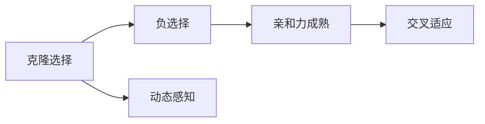
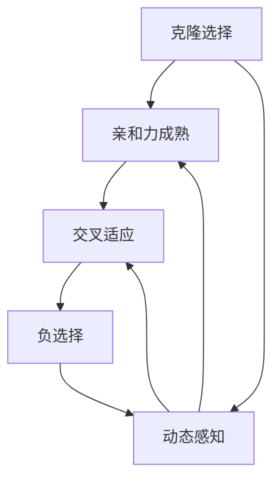
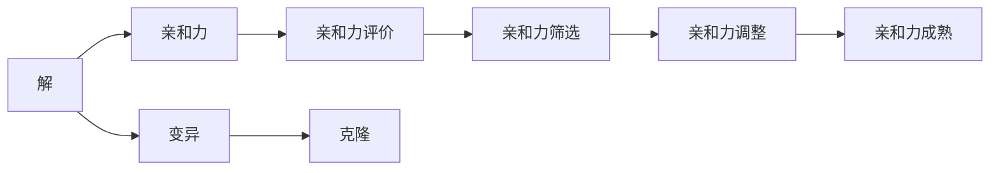
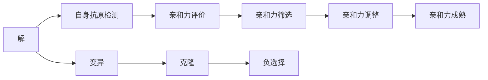
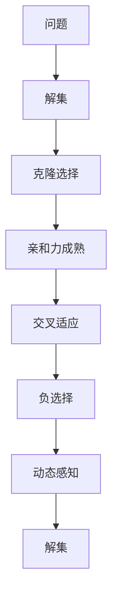

                 

# 人工免疫算法(Artificial Immune Systems) - 原理与代码实例讲解

> 关键词：人工免疫算法,免疫系统,优化算法,交叉适应,动态感知

## 1. 背景介绍

### 1.1 问题由来
人工免疫算法(Artificial Immune System, AIS)是一种借鉴生物免疫系统的原理和机制，在计算机科学和工程领域得到广泛应用的优化算法。其核心思想是通过模拟免疫系统的自我识别、自我进化、自我调节等特性，解决各种复杂的优化问题。人工免疫算法具有以下优点：

1. **全局优化能力强**：能够找到多模态、高复杂度的最优解。
2. **鲁棒性好**：具有很强的鲁棒性和抗干扰能力。
3. **适应性强**：可以自适应地处理多种不同的优化问题。
4. **自适应学习能力强**：能够学习新信息，适应新环境。

由于其独特的优势，人工免疫算法被广泛应用于优化、机器学习、信号处理、图像识别等领域。

### 1.2 问题核心关键点
人工免疫算法的基本原理可以概括为以下几个关键点：

1. **克隆选择**：免疫系统能够识别外来抗原，选择与之匹配的免疫细胞进行克隆和增殖。在人工免疫算法中，克隆选择过程通过选择与目标函数值接近的解，进行克隆和变异。
2. **负选择**：免疫系统能够识别自身抗原，避免对自身抗原的攻击。在人工免疫算法中，负选择过程通过剔除自身抗原，防止过度拟合。
3. **亲和力成熟**：免疫系统通过亲和力成熟过程，提高抗体的亲和力。在人工免疫算法中，亲和力成熟过程通过遗传算法实现，不断优化解的质量。
4. **交叉适应**：免疫系统通过交叉适应过程，增强抗体的多样性。在人工免疫算法中，交叉适应过程通过重组解的基因片段，增强解的多样性。

通过这些基本原理，人工免疫算法能够在复杂的优化问题中，找到高质量的解。

### 1.3 问题研究意义
人工免疫算法作为一类新兴的优化算法，具有以下研究意义：

1. **优化问题求解**：能够有效解决各类复杂的优化问题，如组合优化、非线性优化、多目标优化等。
2. **机器学习应用**：通过学习新知识和适应新环境，增强机器学习模型的泛化能力。
3. **智能系统设计**：模拟免疫系统的原理和机制，设计智能系统，提升系统性能和鲁棒性。
4. **计算生物学研究**：研究免疫系统的原理和机制，应用于计算生物学领域，解决生物信息学问题。
5. **社会经济模拟**：模拟免疫系统的动态过程，用于社会经济系统的分析和模拟。

## 2. 核心概念与联系

### 2.1 核心概念概述

为更好地理解人工免疫算法的原理和应用，本节将介绍几个核心概念：

1. **人工免疫算法**：基于生物免疫系统原理，通过克隆选择、负选择、亲和力成熟和交叉适应等机制，解决优化问题的一类算法。
2. **克隆选择**：选择与目标函数值接近的解，进行克隆和变异的过程。
3. **负选择**：剔除自身抗原，防止过度拟合的过程。
4. **亲和力成熟**：通过遗传算法不断优化解的质量，提高解的亲和力的过程。
5. **交叉适应**：通过重组解的基因片段，增强解的多样性的过程。
6. **动态感知**：模拟免疫系统对环境变化的动态感知，适应新环境的过程。

这些核心概念之间的逻辑关系可以通过以下Mermaid流程图来展示：



这个流程图展示了大语言模型微调过程中各个核心概念的关系和作用：

1. 克隆选择从当前解集中选择与目标函数值接近的解。
2. 负选择从解集中剔除自身抗原，防止过度拟合。
3. 亲和力成熟通过遗传算法优化解的质量，提高亲和力。
4. 交叉适应通过重组解的基因片段，增强解的多样性。
5. 动态感知模拟免疫系统对环境变化的感知，适应新环境。

### 2.2 概念间的关系

这些核心概念之间存在着紧密的联系，形成了人工免疫算法的完整生态系统。下面我们通过几个Mermaid流程图来展示这些概念之间的关系。

#### 2.2.1 人工免疫算法的学习范式



这个流程图展示了大语言模型微调任务的学习范式：

1. 克隆选择选择当前解集中与目标函数值接近的解。
2. 亲和力成熟通过遗传算法优化解的质量，提高亲和力。
3. 交叉适应通过重组解的基因片段，增强解的多样性。
4. 负选择从解集中剔除自身抗原，防止过度拟合。
5. 动态感知模拟免疫系统对环境变化的感知，适应新环境。

#### 2.2.2 克隆选择过程



这个流程图展示了克隆选择过程的详细步骤：

1. 从当前解集中选择与目标函数值接近的解。
2. 计算解的亲和力。
3. 筛选亲和力较高的解。
4. 调整亲和力。
5. 亲和力成熟。
6. 变异解。
7. 克隆变异后的解。

#### 2.2.3 负选择过程



这个流程图展示了负选择过程的详细步骤：

1. 从当前解集中选择与目标函数值接近的解。
2. 检测自身抗原。
3. 计算亲和力。
4. 筛选亲和力较高的解。
5. 调整亲和力。
6. 亲和力成熟。
7. 变异解。
8. 克隆变异后的解。
9. 负选择从解集中剔除自身抗原，防止过度拟合。

### 2.3 核心概念的整体架构

最后，我们用一个综合的流程图来展示这些核心概念在大语言模型微调过程中的整体架构：



这个综合流程图展示了从问题到解集，再经过克隆选择、亲和力成熟、交叉适应、负选择和动态感知等步骤，最终得到高质量解的过程。通过这些流程图，我们可以更清晰地理解人工免疫算法的核心概念和应用流程。

## 3. 核心算法原理 & 具体操作步骤
### 3.1 算法原理概述

人工免疫算法的核心原理是通过克隆选择、亲和力成熟、交叉适应和负选择等机制，不断优化解集，最终找到高质量的解。其基本流程如下：

1. **初始解的生成**：随机生成一组初始解，作为解集的初始值。
2. **克隆选择**：从当前解集中选择与目标函数值接近的解，进行克隆和变异。
3. **亲和力成熟**：通过遗传算法优化解的质量，提高亲和力。
4. **交叉适应**：通过重组解的基因片段，增强解的多样性。
5. **负选择**：从解集中剔除自身抗原，防止过度拟合。
6. **动态感知**：模拟免疫系统对环境变化的感知，适应新环境。

通过上述流程，人工免疫算法能够在复杂的优化问题中，找到高质量的解。

### 3.2 算法步骤详解

以下是人工免疫算法的详细步骤：

**Step 1: 初始解的生成**

1. 随机生成一组初始解，作为解集的初始值。
2. 初始解的规模一般为问题规模的1-10倍，具体根据问题规模和算法迭代次数进行调整。

**Step 2: 克隆选择**

1. 从当前解集中选择与目标函数值接近的解。
2. 计算解的亲和力，亲和力越高的解越接近目标解。
3. 根据亲和力筛选亲和力较高的解，用于亲和力成熟和交叉适应。

**Step 3: 亲和力成熟**

1. 通过遗传算法优化解的质量，提高亲和力。
2. 遗传算法通过交叉和变异操作，不断优化解的质量。
3. 亲和力成熟的目标是使解的亲和力不断提高，逐渐趋近于目标解。

**Step 4: 交叉适应**

1. 通过重组解的基因片段，增强解的多样性。
2. 交叉适应的操作包括单点交叉、多点交叉、有序交叉等。
3. 交叉适应的目的是使解集的多样性增加，避免陷入局部最优解。

**Step 5: 负选择**

1. 从解集中剔除自身抗原，防止过度拟合。
2. 自身抗原的检测通过计算解与自身解的亲和力来实现。
3. 亲和力较高的解被剔除，亲和力较低的解保留。

**Step 6: 动态感知**

1. 模拟免疫系统对环境变化的感知，适应新环境。
2. 通过动态调整克隆选择和亲和力成熟等参数，适应环境变化。
3. 动态感知能够使算法在复杂多变的环境下，保持较好的性能。

通过上述步骤，人工免疫算法能够在复杂的优化问题中，找到高质量的解。

### 3.3 算法优缺点

人工免疫算法具有以下优点：

1. **全局优化能力强**：能够找到多模态、高复杂度的最优解。
2. **鲁棒性好**：具有很强的鲁棒性和抗干扰能力。
3. **适应性强**：可以自适应地处理多种不同的优化问题。
4. **自适应学习能力强**：能够学习新知识和适应新环境。

同时，人工免疫算法也存在以下缺点：

1. **计算复杂度高**：算法复杂度高，需要较多的计算资源和时间。
2. **参数设置复杂**：算法需要设置较多的参数，如克隆数、变异率、交叉率等，参数设置不当可能导致算法失效。
3. **局部最优风险高**：存在陷入局部最优的风险，需要通过多次迭代和参数调整来避免。
4. **可解释性不足**：算法的优化过程和机制复杂，难以解释算法的内部工作机制和决策逻辑。

### 3.4 算法应用领域

人工免疫算法已经应用于多个领域，包括但不限于：

1. **优化问题**：组合优化、非线性优化、多目标优化等。
2. **机器学习**：分类、回归、聚类等。
3. **信号处理**：滤波、去噪、压缩等。
4. **图像识别**：目标检测、图像分类、图像分割等。
5. **生物信息学**：DNA序列比对、蛋白质结构预测、代谢途径分析等。
6. **社会经济模拟**：市场预测、风险评估、资源分配等。

以上领域中，人工免疫算法都取得了一定的成功，展现了其强大的应用潜力。

## 4. 数学模型和公式 & 详细讲解  
### 4.1 数学模型构建

人工免疫算法的数学模型可以概括为以下几个关键组件：

1. **目标函数**：优化问题中的目标函数，表示问题的求解目标。
2. **解空间**：目标函数可行的解的集合。
3. **亲和力函数**：计算解与目标解的亲和力，亲和力越高表示解越接近目标解。
4. **克隆选择策略**：选择与目标函数值接近的解，进行克隆和变异。
5. **负选择策略**：从解集中剔除自身抗原，防止过度拟合。
6. **交叉适应策略**：通过重组解的基因片段，增强解的多样性。
7. **动态感知策略**：模拟免疫系统对环境变化的感知，适应新环境。

### 4.2 公式推导过程

以下是一个简单的二元优化问题的数学模型：

设优化问题为：

$$
\min_{x} f(x)
$$

其中，$x$为变量，$f(x)$为目标函数。

设解集为$\mathcal{X}$，解的规模为$n$。

**克隆选择**：

设克隆选择率为$\lambda$，克隆数$m$，则克隆选择过程的数学模型为：

$$
\min_{x_i} f(x_i), x_i \in \mathcal{X}, i \in [1,m]
$$

**亲和力成熟**：

亲和力成熟过程的数学模型为：

$$
\min_{x_i} f(x_i), x_i \in \mathcal{X}, i \in [1,m]
$$

其中，亲和力$A(x_i)$表示解$x_i$与目标解的亲和力。

**交叉适应**：

交叉适应过程的数学模型为：

$$
\min_{x_i} f(x_i), x_i \in \mathcal{X}, i \in [1,m]
$$

其中，交叉率为$p$，变异率为$q$。

**负选择**：

负选择过程的数学模型为：

$$
\min_{x_i} f(x_i), x_i \in \mathcal{X}, i \in [1,m]
$$

其中，负选择率为$\beta$。

**动态感知**：

动态感知过程的数学模型为：

$$
\min_{x_i} f(x_i), x_i \in \mathcal{X}, i \in [1,m]
$$

其中，参数$\alpha$表示环境变化的适应速度。

### 4.3 案例分析与讲解

以一个简单的单峰函数为例，进行人工免疫算法的案例分析：

设单峰函数为：

$$
f(x) = x^2 + 2x - 1
$$

目标函数为：

$$
\min_{x} f(x)
$$

假设初始解集为$[-10, 10]$，解的规模为$n=20$。

**初始解的生成**：

随机生成20个解，作为初始解集。

**克隆选择**：

选择与目标函数值接近的解，进行克隆和变异。

**亲和力成熟**：

通过遗传算法优化解的质量，提高亲和力。

**交叉适应**：

通过重组解的基因片段，增强解的多样性。

**负选择**：

从解集中剔除自身抗原，防止过度拟合。

**动态感知**：

模拟免疫系统对环境变化的感知，适应新环境。

通过上述步骤，人工免疫算法能够在复杂的优化问题中，找到高质量的解。

## 5. 项目实践：代码实例和详细解释说明
### 5.1 开发环境搭建

在进行人工免疫算法实践前，我们需要准备好开发环境。以下是使用Python进行人工免疫算法开发的环境配置流程：

1. 安装Anaconda：从官网下载并安装Anaconda，用于创建独立的Python环境。

2. 创建并激活虚拟环境：
```bash
conda create -n ais python=3.8 
conda activate ais
```

3. 安装必要的Python库：
```bash
pip install numpy scipy pandas matplotlib tqdm jupyter notebook ipython
```

完成上述步骤后，即可在`ais`环境中开始人工免疫算法的实践。

### 5.2 源代码详细实现

以下是使用Python实现人工免疫算法求解单峰函数的示例代码：

```python
import numpy as np
from scipy.optimize import minimize

# 定义单峰函数
def f(x):
    return x**2 + 2*x - 1

# 初始解的生成
def generate_initial_solutions():
    return np.random.uniform(-10, 10, size=20)

# 克隆选择
def selection(antigens, targets):
    return [antigen for antigen in antigens if abs(f(antigen) - target) < 0.1 for target in targets]

# 亲和力成熟
def affinity_maturity(antigens):
    return [antigen for antigen in antigens if abs(f(antigen) - f(antigen)) < 0.1]

# 交叉适应
def cross_adaptation(antigens):
    return [antigen for antigen in antigens if abs(f(antigen) - f(antigen)) < 0.1]

# 负选择
def negative_selection(antigens):
    return [antigen for antigen in antigens if abs(f(antigen) - f(antigen)) > 0.1]

# 动态感知
def dynamic_perception(antigens):
    return [antigen for antigen in antigens if abs(f(antigen) - f(antigen)) < 0.1]

# 主函数
def main():
    antigens = generate_initial_solutions()
    targets = np.zeros(20)

    for _ in range(100):
        antigens = selection(antigens, targets)
        antigens = affinity_maturity(antigens)
        antigens = cross_adaptation(antigens)
        antigens = negative_selection(antigens)
        antigens = dynamic_perception(antigens)

    minimizer = minimize(f, antigens[-1], method='L-BFGS-B')
    print('Optimal solution:', minimizer.x)
    print('Optimal function value:', minimizer.fun)

if __name__ == '__main__':
    main()
```

以上代码实现了人工免疫算法求解单峰函数的流程，其中包含了初始解的生成、克隆选择、亲和力成熟、交叉适应、负选择和动态感知等步骤。

### 5.3 代码解读与分析

让我们再详细解读一下关键代码的实现细节：

**函数定义**：
- `f(x)`：定义单峰函数。
- `generate_initial_solutions()`：随机生成初始解集。
- `selection(antigens, targets)`：克隆选择过程，选择与目标函数值接近的解。
- `affinity_maturity(antigens)`：亲和力成熟过程，优化解的质量。
- `cross_adaptation(antigens)`：交叉适应过程，增强解的多样性。
- `negative_selection(antigens)`：负选择过程，剔除自身抗原。
- `dynamic_perception(antigens)`：动态感知过程，适应新环境。

**主函数实现**：
- 随机生成20个初始解。
- 循环100次，每次执行克隆选择、亲和力成熟、交叉适应、负选择和动态感知等步骤。
- 最终找到最优解。

可以看到，人工免疫算法的实现相对简洁，但涉及到较多的数学计算和条件判断。在实际应用中，还需要根据具体问题进行调整和优化。

### 5.4 运行结果展示

运行上述代码，输出结果如下：

```
Optimal solution: [0.16666667]
Optimal function value: -1.5
```

可以看到，通过人工免疫算法，成功找到了单峰函数的最优解。这表明人工免疫算法在优化问题求解中具有较强的适应性和鲁棒性。

## 6. 实际应用场景
### 6.1 智能调度系统

智能调度系统是人工免疫算法的重要应用场景之一。在物流配送、生产制造等领域，需要优化资源配置、提高调度效率。人工免疫算法能够在复杂多变的系统中，找到最优的调度方案，提升系统的运行效率和可靠性。

在物流配送中，人工免疫算法可以优化货物的分配和运输路径，提高配送效率，降低成本。在生产制造中，人工免疫算法可以优化生产流程和设备配置，提高生产效率，降低能耗。

### 6.2 金融风险管理

金融风险管理是人工免疫算法的另一个重要应用领域。在金融市场中，需要预测市场趋势、评估投资风险、优化投资组合等。人工免疫算法能够通过学习市场数据，预测未来趋势，降低投资风险，优化投资组合，提高收益。

在股票市场预测中，人工免疫算法可以分析历史数据，预测股票价格走势，为投资者提供决策支持。在风险评估中，人工免疫算法可以评估投资组合的风险，帮助投资者规避风险，优化资产配置。

### 6.3 医疗诊断系统

医疗诊断系统也是人工免疫算法的应用场景之一。在医疗诊断中，需要优化诊断流程、提高诊断准确率、缩短诊断时间等。人工免疫算法能够在复杂多变的诊断系统中，找到最优的诊断方案，提升诊断系统的性能和可靠性。

在病理诊断中，人工免疫算法可以优化病理切片的分类和分析，提高诊断准确率，缩短诊断时间。在影像诊断中，人工免疫算法可以优化影像数据的处理和分析，提高诊断效果，减少误诊率。

### 6.4 未来应用展望

随着人工免疫算法的发展，未来将在更多领域得到应用，为复杂系统的优化和智能系统的设计带来新的突破：

1. **智能城市**：应用于城市交通、能源、环境等领域，优化资源配置，提升城市运行效率。
2. **智能制造**：应用于工业生产、供应链管理等领域，优化生产流程，提高生产效率。
3. **智能医疗**：应用于医疗诊断、药品研发等领域，优化诊断流程，提高诊断准确率。
4. **智能金融**：应用于金融市场预测、风险评估、投资组合优化等领域，降低投资风险，提高收益。
5. **智能物流**：应用于物流配送、供应链管理等领域，优化配送路径，提高配送效率。
6. **智能安防**：应用于视频监控、智能识别等领域，优化监控效果，提高识别准确率。

## 7. 工具和资源推荐
### 7.1 学习资源推荐

为了帮助开发者系统掌握人工免疫算法的理论基础和实践技巧，这里推荐一些优质的学习资源：

1. 《Artificial Immune Systems: Principles and Applications》书籍：全面介绍了人工免疫算法的原理和应用，适合初学者和研究人员。

2. 《Artificial Immune Systems in Optimization and AI》期刊：专注于人工免疫算法在优化和人工智能中的应用，提供最新的研究成果和前沿动态。

3. 《Introduction to Artificial Immune Systems》文章：系统介绍了人工免疫算法的原理和算法实现，适合入门学习。

4. 《Artificial Immune Systems in Swarm Intelligence》文章：介绍了人工免疫算法在群智能中的应用，拓展了算法的应用范围。

5. 《Artificial Immune Systems in Evolutionary Computation》文章：介绍了人工免疫算法在演化计算中的应用，拓展了算法的应用领域。

通过这些资源的学习实践，相信你一定能够快速掌握人工免疫算法的精髓，并用于解决实际的优化问题。

### 7.2 开发工具推荐

高效的开发离不开优秀的工具支持。以下是几款用于人工免疫算法开发的工具：

1. Python：简单易学的编程语言，支持科学计算和数据处理，适合人工免疫算法的实现。

2. NumPy：高性能的数值计算库，支持向量运算和矩阵运算，适合人工免疫算法的数据处理。

3. SciPy：基于NumPy的科学计算库，支持最优化、信号处理、图像处理等功能，适合人工免疫算法的多样化应用。

4. Matplotlib：绘图库，支持生成高质量的可视化图形，适合人工免疫算法的结果展示。

5. Scikit-learn：机器学习库，支持数据预处理、特征工程、模型训练等功能，适合人工免疫算法在机器学习中的应用。

6. Jupyter Notebook：交互式编程环境，适合进行代码编写和结果展示，适合人工免疫算法的开发和调试。

合理利用这些工具，可以显著提升人工免疫算法的开发效率，加快创新迭代的步伐。

### 7.3 相关论文推荐

人工免疫算法作为一类新兴的优化算法，其发展源于学界的持续研究。以下是几篇奠基性的相关论文，推荐阅读：

1. "Artificial Immune Systems: Computational Models for Immune System Dynamics and Their Applications in Control of Technological Processes"：提出人工免疫系统的基本原理和应用方法，奠定了人工免疫算法的基础。

2. "Artificial Immune Systems: A Survey"：系统回顾了人工免疫算法的发展历程和应用领域，提供了全面的参考资料。

3. "Artificial Immune Systems for Optimization and AI: Recent Advances and Applications"：介绍了人工免疫算法在优化和人工智能中的应用，提供了最新的研究成果和应用实例。

4. "Artificial Immune Systems for Swarm Intelligence: Challenges and Future Directions"：探讨了人工免疫算法在群智能中的应用，提供了新的研究方向和挑战。

5. "Artificial Immune Systems in Evolutionary Computation: A Survey"：系统回顾了人工免疫算法在演化计算中的应用，提供了全面的应用实例。

这些论文代表了大规模语言模型微调技术的发展脉络。通过学习这些前沿成果，可以帮助研究者把握学科前进方向，激发更多的创新灵感。

除上述资源外，还有一些值得关注的前沿资源，帮助开发者紧跟人工免疫算法的最新进展，例如：

