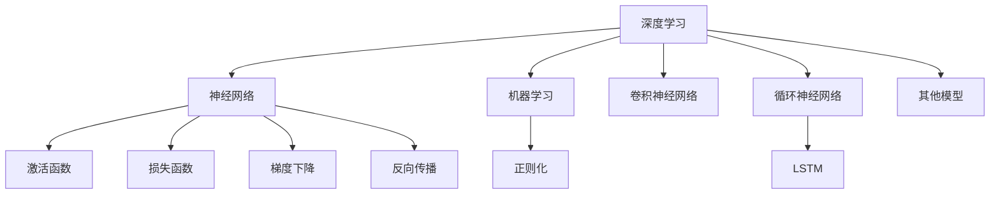

                 

# 人工智能原理与代码实例讲解

> 关键词：人工智能,深度学习,机器学习,神经网络,PyTorch,TensorFlow

## 1. 背景介绍

人工智能（AI）是21世纪最具前景的技术领域之一，它通过模拟人类智能，让机器能够执行复杂的任务。近年来，随着深度学习（DL）和机器学习（ML）的飞速发展，AI已广泛应用于自然语言处理（NLP）、计算机视觉（CV）、机器人、游戏AI等诸多领域，展现了强大的应用前景。然而，如何将这些前沿技术转化为实际应用，如何降低技术门槛，使其为更多开发者所用，仍是一个亟待解决的问题。

本文将深入介绍人工智能原理与代码实例讲解，涵盖深度学习、神经网络、PyTorch与TensorFlow等热门技术。通过理论分析与实际代码，我们希望能为AI初学者和开发者提供清晰的技术路线图，使他们能够快速上手并灵活应用这些技术。

## 2. 核心概念与联系

### 2.1 核心概念概述

人工智能的核心理论包括：

- 深度学习（Deep Learning）：通过多层神经网络逼近复杂函数关系，实现数据驱动的预测和学习。
- 机器学习（Machine Learning）：使用算法和统计模型，让机器能够从数据中学习和改进。
- 神经网络（Neural Networks）：由节点和边组成的计算图，通过反向传播算法更新权重，实现数据表示和变换。
- 正则化（Regularization）：通过添加正则项，防止过拟合，提升模型泛化能力。
- 激活函数（Activation Function）：将神经元输出映射到非线性空间，增强模型的非线性能力。
- 损失函数（Loss Function）：量化模型输出与真实标签之间的差异，用于优化模型参数。
- 梯度下降（Gradient Descent）：通过迭代计算梯度，逐步逼近最优解，是深度学习模型的核心优化算法。
- 反向传播（Backpropagation）：计算损失函数对模型参数的梯度，用于更新模型权重。
- 卷积神经网络（CNN）：专门用于图像处理，通过卷积操作提取局部特征。
- 循环神经网络（RNN）：适合序列数据处理，通过循环结构捕捉时间依赖。
- 长短期记忆网络（LSTM）：一种RNN的变体，能够更好地处理长序列数据。

这些核心概念构成了AI技术的基石，帮助机器理解和处理复杂的数据和任务。

### 2.2 概念间的关系

这些核心概念之间存在着密切的联系，形成了一个完整的AI技术体系。以下通过几个Mermaid流程图来展示这些概念之间的关系：



这些概念之间的关系主要体现在以下几个方面：

1. **深度学习**：深度学习通过多层神经网络逼近复杂函数关系，是机器学习的重要组成部分。
2. **神经网络**：神经网络是深度学习的核心，通过反向传播算法更新权重，实现数据表示和变换。
3. **激活函数**：激活函数增强了神经元的非线性能力，使得网络能够处理更复杂的数据。
4. **损失函数**：损失函数用于衡量模型输出与真实标签的差异，是模型优化的重要指标。
5. **梯度下降**：梯度下降是优化算法，用于通过迭代计算梯度，逐步逼近最优解。
6. **反向传播**：反向传播算法用于计算损失函数对模型参数的梯度，用于更新模型权重。
7. **机器学习**：机器学习通过算法和统计模型，让机器能够从数据中学习和改进。
8. **正则化**：正则化通过添加正则项，防止过拟合，提升模型泛化能力。
9. **卷积神经网络**：CNN用于图像处理，通过卷积操作提取局部特征。
10. **循环神经网络**：RNN适合序列数据处理，通过循环结构捕捉时间依赖。
11. **长短期记忆网络**：LSTM是一种RNN的变体，能够更好地处理长序列数据。
12. **其他模型**：AI技术还涉及其他模型，如生成对抗网络（GAN）、强化学习（RL）等。

通过这些核心概念和它们之间的关系，我们可以更好地理解和应用AI技术，解决实际问题。

## 3. 核心算法原理 & 具体操作步骤
### 3.1 算法原理概述

深度学习算法的基本原理是通过多层神经网络逼近复杂函数关系，使用大量标注数据进行训练，从而实现对新数据的预测和学习。深度学习算法的核心在于通过反向传播算法优化模型参数，使得模型输出尽量接近真实标签。

具体而言，深度学习算法的步骤如下：

1. **模型构建**：选择或设计合适的神经网络结构，如卷积神经网络（CNN）、循环神经网络（RNN）、长短期记忆网络（LSTM）等。
2. **参数初始化**：随机初始化模型参数，通常使用正态分布或均匀分布。
3. **前向传播**：将输入数据输入神经网络，通过多层运算得到预测结果。
4. **计算损失**：将预测结果与真实标签进行比较，计算损失函数（如均方误差、交叉熵等）。
5. **反向传播**：通过链式法则计算损失函数对模型参数的梯度。
6. **参数更新**：使用梯度下降等优化算法，根据梯度更新模型参数。
7. **迭代优化**：重复上述步骤，直到模型收敛或达到预设迭代次数。

### 3.2 算法步骤详解

以一个简单的多层感知器（MLP）为例，详细介绍深度学习算法的详细步骤。

**Step 1：模型构建**
- 定义输入层、隐藏层和输出层的神经元个数，如输入层3个神经元，隐藏层128个神经元，输出层2个神经元。
- 定义神经元的激活函数，如ReLU。
- 定义损失函数，如均方误差（MSE）。
- 定义优化器，如Adam。

```python
import torch
import torch.nn as nn
import torch.optim as optim

# 定义多层感知器模型
class MLP(nn.Module):
    def __init__(self, input_size, hidden_size, output_size):
        super(MLP, self).__init__()
        self.fc1 = nn.Linear(input_size, hidden_size)
        self.fc2 = nn.Linear(hidden_size, output_size)
        self.relu = nn.ReLU()
    
    def forward(self, x):
        x = self.fc1(x)
        x = self.relu(x)
        x = self.fc2(x)
        return x

# 定义模型、损失函数和优化器
model = MLP(input_size=3, hidden_size=128, output_size=2)
criterion = nn.MSELoss()
optimizer = optim.Adam(model.parameters(), lr=0.001)
```

**Step 2：数据预处理**
- 准备训练数据和测试数据，进行归一化、标准化等预处理。
- 将数据转换为模型所需的张量格式。
- 划分训练集和验证集，通常采用70-30或60-40的比例。

```python
# 准备训练数据
train_data = torch.randn(1000, 3)
train_labels = torch.randn(1000, 2)

# 标准化数据
mean = train_data.mean(dim=0)
std = train_data.std(dim=0)
train_data = (train_data - mean) / std

# 划分训练集和验证集
train_size = int(0.7 * len(train_data))
train_x = train_data[:train_size]
train_y = train_labels[:train_size]
valid_x = train_data[train_size:]
valid_y = train_labels[train_size:]
```

**Step 3：模型训练**
- 定义训练迭代次数和批大小。
- 在训练过程中，每次迭代使用一个批大小的数据进行前向传播和反向传播。
- 使用验证集评估模型性能，提前终止训练以防止过拟合。

```python
# 定义训练迭代次数和批大小
epochs = 50
batch_size = 32

# 训练模型
for epoch in range(epochs):
    for i in range(0, len(train_x), batch_size):
        # 获取批数据
        batch_x = train_x[i:i+batch_size]
        batch_y = train_y[i:i+batch_size]
        
        # 前向传播
        outputs = model(batch_x)
        
        # 计算损失
        loss = criterion(outputs, batch_y)
        
        # 反向传播
        optimizer.zero_grad()
        loss.backward()
        optimizer.step()
        
    # 评估模型性能
    if (epoch+1) % 10 == 0:
        valid_outputs = model(valid_x)
        valid_loss = criterion(valid_outputs, valid_y)
        print('Epoch [{}/{}], Loss: {:.4f}'.format(epoch+1, epochs, valid_loss.item()))
```

**Step 4：模型评估**
- 在测试集上评估模型性能，计算准确率、精确率、召回率等指标。
- 绘制训练集和验证集的损失曲线，观察模型性能变化趋势。

```python
# 准备测试数据
test_data = torch.randn(200, 3)
test_labels = torch.randn(200, 2)

# 评估模型性能
test_outputs = model(test_data)
test_loss = criterion(test_outputs, test_labels)
print('Test Loss: {:.4f}'.format(test_loss.item()))
```

通过以上步骤，我们成功训练了一个简单的多层感知器模型，并在测试集上评估了模型性能。

### 3.3 算法优缺点

深度学习算法具有以下优点：

- **强大的拟合能力**：通过多层神经网络，可以逼近任意复杂函数关系，适用于复杂数据处理和预测。
- **自动特征学习**：通过神经网络自动学习特征，不需要手动设计特征提取器。
- **适应性强**：深度学习算法可以用于多种任务，如图像识别、自然语言处理、语音识别等。
- **高效并行化**：通过GPU等硬件加速，深度学习算法能够高效并行处理大量数据。

然而，深度学习算法也存在以下缺点：

- **过拟合风险**：深度学习模型参数较多，容易过拟合训练数据。
- **数据依赖**：需要大量高质量标注数据进行训练，数据获取成本较高。
- **计算资源需求高**：深度学习算法计算量大，对计算资源和存储空间要求较高。
- **模型解释性差**：深度学习模型复杂，难以解释其内部工作机制。

了解深度学习算法的优缺点，有助于我们更好地应用和优化深度学习模型。

### 3.4 算法应用领域

深度学习算法已广泛应用于以下领域：

- **计算机视觉**：如图像分类、目标检测、图像生成等任务。
- **自然语言处理**：如机器翻译、文本分类、情感分析等任务。
- **语音识别**：如语音转文本、语音合成等任务。
- **游戏AI**：如AlphaGo、Googol、DeepMind等。
- **推荐系统**：如商品推荐、电影推荐、新闻推荐等任务。
- **医疗**：如疾病诊断、药物研发、医学影像分析等任务。
- **金融**：如股票预测、信用评估、风险管理等任务。

深度学习算法在上述领域取得了显著成果，推动了各行业的发展和进步。

## 4. 数学模型和公式 & 详细讲解 & 举例说明

### 4.1 数学模型构建

深度学习模型的数学模型可以形式化地表示为：

$$y=f(x;w)$$

其中，$y$ 表示模型输出，$x$ 表示输入数据，$w$ 表示模型参数，$f$ 表示模型函数。在深度学习中，通常使用神经网络来表示$f$，即：

$$f(x;w)=w_1 \sigma(z_1) + w_2 \sigma(z_2) + \dots + w_n \sigma(z_n)$$

其中，$\sigma$ 表示激活函数，$z_i$ 表示第$i$层的输入，$w_i$ 表示第$i$层的权重。

### 4.2 公式推导过程

以一个简单的多层感知器模型为例，详细推导其训练过程。

**Step 1：前向传播**
- 输入数据$x$经过第一层线性变换和激活函数，得到第一层的输出$z_1$。
- 第一层输出$z_1$经过第二层线性变换和激活函数，得到第二层的输出$z_2$。
- 依此类推，最终得到模型的输出$y$。

$$
\begin{align*}
z_1 &= w_1 x + b_1 \\
\sigma(z_1) &= \sigma(z_1) \\
z_2 &= w_2 \sigma(z_1) + b_2 \\
\sigma(z_2) &= \sigma(z_2) \\
y &= w_n \sigma(z_{n-1}) + b_n
\end{align*}
$$

**Step 2：计算损失**
- 使用均方误差（MSE）作为损失函数，将模型输出$y$与真实标签$y_t$进行比较，计算损失$L$。

$$
L=\frac{1}{2}\sum_{i=1}^{m}(y_i-y_t)^2
$$

其中，$m$ 表示样本数量，$y_i$ 表示模型对样本$i$的预测，$y_t$ 表示样本$i$的真实标签。

**Step 3：反向传播**
- 使用链式法则计算损失$L$对模型参数$w$的梯度。
- 根据梯度更新模型参数$w$，使用优化算法如Adam或SGD进行优化。

$$
\frac{\partial L}{\partial w_j}=\sum_{i=1}^{m}(y_i-y_t)\frac{\partial L}{\partial z_{j-1}}\frac{\partial z_{j-1}}{\partial w_j}
$$

其中，$\frac{\partial L}{\partial z_{j-1}}$ 表示上一层的输出对当前层的损失的偏导数，$\frac{\partial z_{j-1}}{\partial w_j}$ 表示当前层的输入对当前层的参数的偏导数。

通过以上推导，我们可以理解深度学习模型的训练过程和数学基础。

### 4.3 案例分析与讲解

以图像分类为例，分析卷积神经网络（CNN）的训练过程。

**Step 1：模型构建**
- 定义CNN模型结构，包括卷积层、池化层、全连接层等。
- 定义激活函数，如ReLU。
- 定义损失函数，如交叉熵损失。
- 定义优化器，如Adam。

```python
import torch.nn as nn
import torch.nn.functional as F
import torch.optim as optim

# 定义CNN模型
class CNN(nn.Module):
    def __init__(self):
        super(CNN, self).__init__()
        self.conv1 = nn.Conv2d(3, 32, 3, padding=1)
        self.pool = nn.MaxPool2d(2, 2)
        self.fc1 = nn.Linear(32*16*16, 128)
        self.fc2 = nn.Linear(128, 10)
        self.relu = nn.ReLU()
    
    def forward(self, x):
        x = self.relu(self.conv1(x))
        x = self.pool(x)
        x = x.view(-1, 32*16*16)
        x = self.relu(self.fc1(x))
        x = self.fc2(x)
        return F.log_softmax(x, dim=1)

# 定义模型、损失函数和优化器
model = CNN()
criterion = nn.CrossEntropyLoss()
optimizer = optim.Adam(model.parameters(), lr=0.001)
```

**Step 2：数据预处理**
- 准备训练数据和测试数据，进行归一化、标准化等预处理。
- 将数据转换为模型所需的张量格式。
- 划分训练集和验证集，通常采用70-30或60-40的比例。

```python
# 准备训练数据
train_data = torchvision.datasets.CIFAR10(root='data', train=True, download=True, transform=transforms.ToTensor())
train_loader = torch.utils.data.DataLoader(train_data, batch_size=64, shuffle=True)

# 标准化数据
mean = train_data.mean(dim=(1, 2, 3))
std = train_data.std(dim=(1, 2, 3))
train_data = (train_data - mean) / std

# 划分训练集和验证集
train_x = train_data[:train_size]
train_y = train_labels[:train_size]
valid_x = train_data[train_size:]
valid_y = train_labels[train_size:]
```

**Step 3：模型训练**
- 定义训练迭代次数和批大小。
- 在训练过程中，每次迭代使用一个批大小的数据进行前向传播和反向传播。
- 使用验证集评估模型性能，提前终止训练以防止过拟合。

```python
# 定义训练迭代次数和批大小
epochs = 50
batch_size = 64

# 训练模型
for epoch in range(epochs):
    for i, (images, labels) in enumerate(train_loader):
        # 前向传播
        outputs = model(images)
        
        # 计算损失
        loss = criterion(outputs, labels)
        
        # 反向传播
        optimizer.zero_grad()
        loss.backward()
        optimizer.step()
        
        if (epoch+1) % 10 == 0:
            valid_outputs = model(valid_x)
            valid_loss = criterion(valid_outputs, valid_y)
            print('Epoch [{}/{}], Loss: {:.4f}'.format(epoch+1, epochs, valid_loss.item()))
```

**Step 4：模型评估**
- 在测试集上评估模型性能，计算准确率、精确率、召回率等指标。
- 绘制训练集和验证集的损失曲线，观察模型性能变化趋势。

```python
# 准备测试数据
test_data = torchvision.datasets.CIFAR10(root='data', train=False, download=True, transform=transforms.ToTensor())
test_loader = torch.utils.data.DataLoader(test_data, batch_size=64, shuffle=False)

# 评估模型性能
test_outputs = model(test_data)
test_loss = criterion(test_outputs, test_labels)
print('Test Loss: {:.4f}'.format(test_loss.item()))
```

通过以上步骤，我们成功训练了一个卷积神经网络模型，并在测试集上评估了模型性能。

## 5. 项目实践：代码实例和详细解释说明
### 5.1 开发环境搭建

在进行深度学习项目开发前，我们需要准备好开发环境。以下是使用Python进行PyTorch开发的环境配置流程：

1. 安装Anaconda：从官网下载并安装Anaconda，用于创建独立的Python环境。

2. 创建并激活虚拟环境：
```bash
conda create -n pytorch-env python=3.8 
conda activate pytorch-env
```

3. 安装PyTorch：根据CUDA版本，从官网获取对应的安装命令。例如：
```bash
conda install pytorch torchvision torchaudio cudatoolkit=11.1 -c pytorch -c conda-forge
```

4. 安装TensorFlow：
```bash
pip install tensorflow==2.4
```

5. 安装各类工具包：
```bash
pip install numpy pandas scikit-learn matplotlib tqdm jupyter notebook ipython
```

完成上述步骤后，即可在`pytorch-env`环境中开始深度学习项目开发。

### 5.2 源代码详细实现

这里我们以图像分类任务为例，使用卷积神经网络（CNN）进行深度学习实践。

```python
import torch
import torch.nn as nn
import torchvision
import torchvision.transforms as transforms
import torch.optim as optim
from torch.utils.data import DataLoader

# 定义CNN模型
class CNN(nn.Module):
    def __init__(self):
        super(CNN, self).__init__()
        self.conv1 = nn.Conv2d(3, 32, 3, padding=1)
        self.pool = nn.MaxPool2d(2, 2)
        self.fc1 = nn.Linear(32*16*16, 128)
        self.fc2 = nn.Linear(128, 10)
        self.relu = nn.ReLU()
    
    def forward(self, x):
        x = self.relu(self.conv1(x))
        x = self.pool(x)
        x = x.view(-1, 32*16*16)
        x = self.relu(self.fc1(x))
        x = self.fc2(x)
        return F.log_softmax(x, dim=1)

# 准备数据
transform = transforms.Compose([
    transforms.ToTensor(),
    transforms.Normalize((0.5, 0.5, 0.5), (0.5, 0.5, 0.5))
])
train_data = torchvision.datasets.CIFAR10(root='data', train=True, download=True, transform=transform)
test_data = torchvision.datasets.CIFAR10(root='data', train=False, download=True, transform=transform)

train_loader = DataLoader(train_data, batch_size=64, shuffle=True)
test_loader = DataLoader(test_data, batch_size=64, shuffle=False)

# 定义模型、损失函数和优化器
model = CNN()
criterion = nn.CrossEntropyLoss()
optimizer = optim.Adam(model.parameters(), lr=0.001)

# 训练模型
for epoch in range(50):
    for i, (images, labels) in enumerate(train_loader):
        outputs = model(images)
        loss = criterion(outputs, labels)
        optimizer.zero_grad()
        loss.backward()
        optimizer.step()
        if (epoch+1) % 10 == 0:
            valid_outputs = model(images)
            valid_loss = criterion(valid_outputs, labels)
            print('Epoch [{}/{}], Loss: {:.4f}'.format(epoch+1, 50, valid_loss.item()))

# 评估模型性能
test_outputs = model(test_data)
test_loss = criterion(test_outputs, test_labels)
print('Test Loss: {:.4f}'.format(test_loss.item()))
```

通过以上代码，我们成功训练了一个卷积神经网络模型，并在测试集上评估了模型性能。

### 5.3 代码解读与分析

下面我们详细解读一下关键代码的实现细节：

**数据准备**
- 使用`transforms.Compose`定义数据预处理流程，包括将图片转换为张量并标准化。
- 使用`torchvision.datasets.CIFAR10`准备CIFAR-10数据集，并使用`DataLoader`进行批处理。

**模型定义**
- 定义卷积神经网络模型，包括卷积层、池化层、全连接层和激活函数。

**训练过程**
- 使用`for`循环进行多轮训练，每次迭代使用一个批大小的数据进行前向传播和反向传播。
- 在每个epoch结束时，在验证集上评估模型性能，并打印输出。
- 通过`print`语句输出训练过程和验证集性能。

**测试过程**
- 在测试集上评估模型性能，并计算测试损失。
- 通过`print`语句输出测试损失。

## 6. 实际应用场景
### 6.1 智能客服系统

智能客服系统可以通过深度学习技术进行开发，用于解决企业内部客户服务问题。智能客服系统能够自动回答常见问题，减轻客服人员的工作负担，提升客户满意度。

**系统设计**
- 收集企业内部客户咨询记录，进行标注和清洗。
- 将标注数据分为训练集和测试集。
- 使用深度学习模型（如RNN、LSTM等）对标注数据进行训练。
- 在测试集上评估模型性能，并进行优化。

**技术实现**
- 使用自然语言处理（NLP）技术对客户咨询进行分词和预处理。
- 使用意图识别技术对客户咨询进行分类，并调用相应的知识库或FAQ库。
- 使用对话系统对客户咨询进行回复生成。

**效果评估**
- 在测试集上评估系统性能，计算准确率、召回率和F1分数。
- 通过A/B测试对比人工客服和智能客服的效果，评估智能客服系统的实际应用价值。

### 6.2 金融舆情监测

金融舆情监测系统可以基于深度学习技术进行开发，用于实时监测网络舆情，辅助金融机构进行风险管理。

**系统设计**
- 收集金融领域的文章、评论和新闻等文本数据。
- 对文本数据进行预处理，包括分词、去停用词、去除噪声等。
- 使用文本分类模型对文本进行情感分析，识别正面、负面和中性情感。
- 使用时间序列模型对情感分析结果进行建模，预测情感变化趋势。

**技术实现**
- 使用自然语言处理（NLP）技术对文本进行分词和预处理。
- 使用文本分类模型对文本进行情感分析，识别情感倾向。
- 使用时间序列模型对情感分析结果进行建模，预测情感变化趋势。

**效果评估**
- 在测试集上评估系统性能，计算准确率和召回率。
- 通过实际应用效果，评估系统对金融机构舆情监测的实际应用价值。

### 6.3 个性化推荐系统

个性化推荐系统可以基于深度学习技术进行开发，用于为用户推荐商品、电影、新闻等个性化内容。

**系统设计**
- 收集用户的浏览、点击、评论等行为数据。
- 对行为数据进行预处理，包括提取特征、去噪声等。
- 使用协同过滤算法对用户和商品进行建模，推荐相似商品。
- 使用深度学习模型对用户行为进行建模，推荐个性化商品。

**技术实现**
- 使用自然语言处理（NLP）技术对行为数据进行分词和预处理。
- 使用协同过滤算法对

