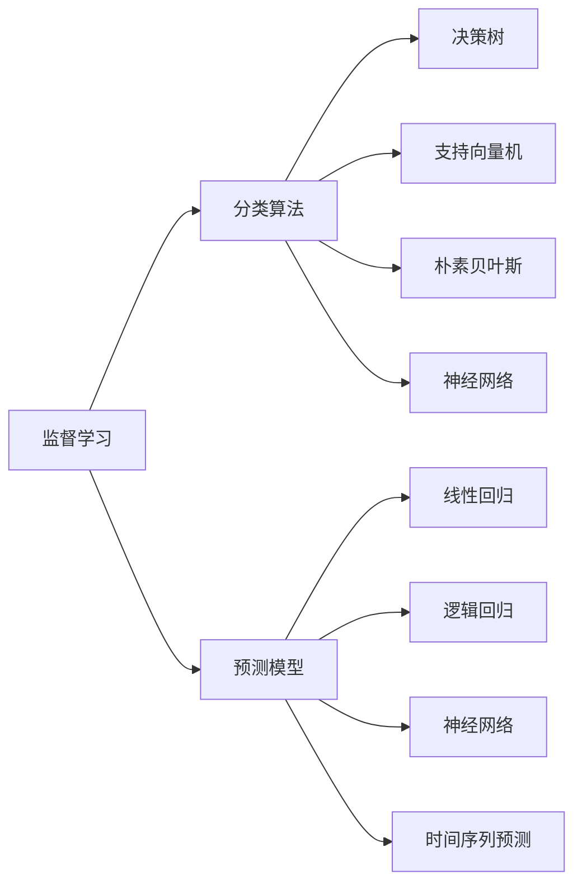
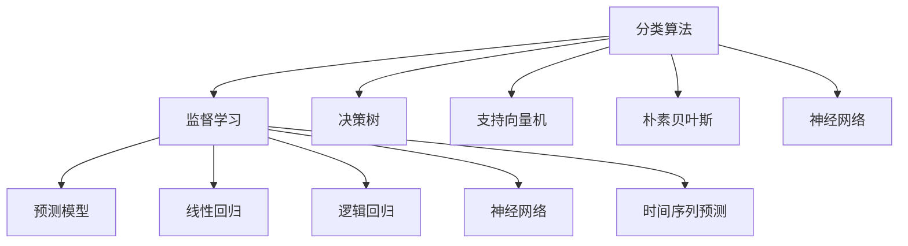
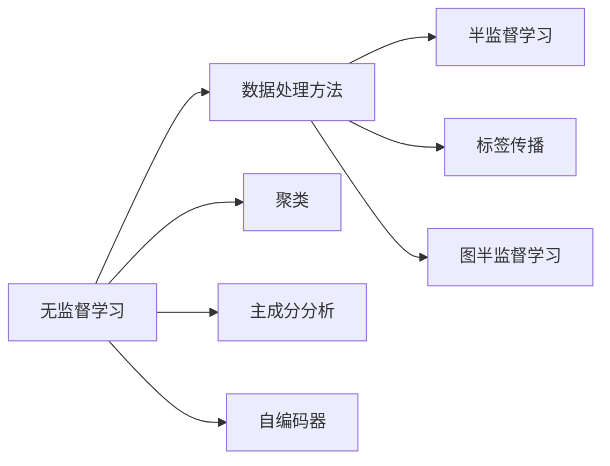
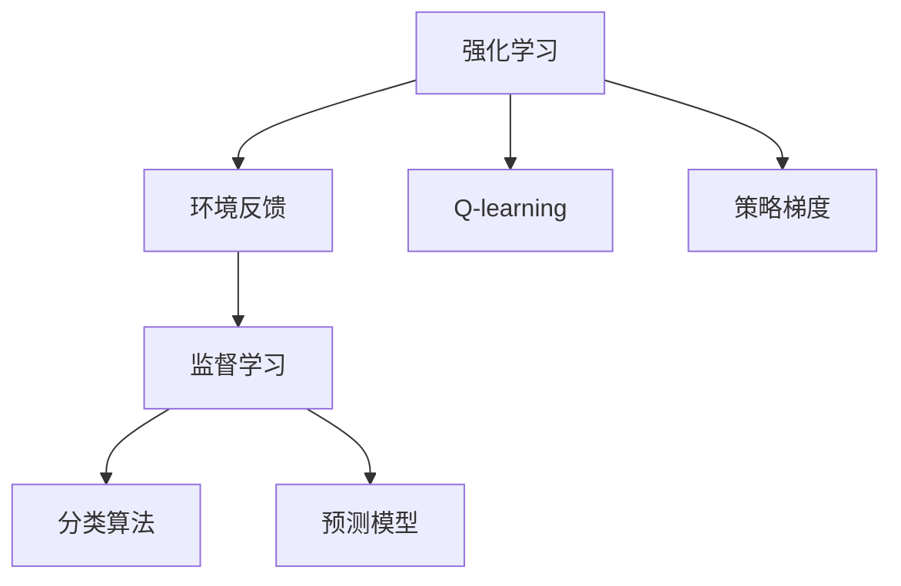
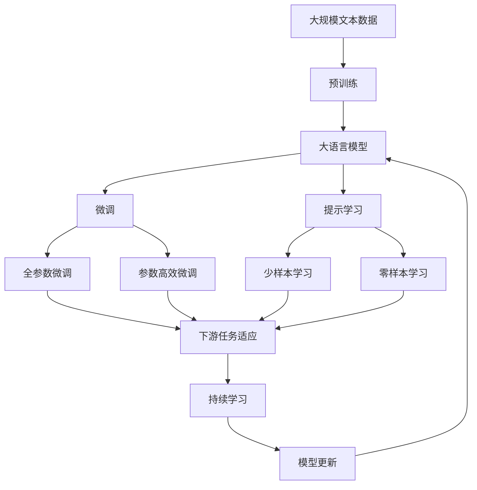

                 

# 人工智能的分类与预测能力

> 关键词：人工智能,分类算法,预测模型,机器学习,深度学习,监督学习,无监督学习

## 1. 背景介绍

### 1.1 问题由来
在人工智能（AI）领域，分类和预测是两个核心任务。分类（Classification）是指将数据样本分为不同的类别，预测（Prediction）则是在新数据点上给出其预测标签或数值。这些任务在商业、医疗、金融等众多行业中都有广泛应用，是实现智能化决策、提升业务效率的关键手段。

### 1.2 问题核心关键点
人工智能的分类与预测能力主要依赖于统计学和机器学习技术，包括监督学习、无监督学习、半监督学习、强化学习等。这些学习范式通过不同的方式训练模型，以实现对数据模式的学习和分类、预测能力的提升。

- **监督学习（Supervised Learning）**：使用有标签的数据训练模型，以预测新数据的标签或数值。经典算法包括线性回归、逻辑回归、支持向量机、决策树等。
- **无监督学习（Unsupervised Learning）**：使用无标签的数据训练模型，以发现数据的内在结构和模式。经典算法包括聚类、主成分分析、自编码器等。
- **半监督学习（Semi-supervised Learning）**：在少量有标签数据和大量无标签数据下训练模型。经典算法包括标签传播、图半监督学习等。
- **强化学习（Reinforcement Learning）**：通过与环境的交互，模型学习如何做出最优决策。经典算法包括Q-learning、策略梯度等。

这些学习范式在实际应用中常常结合使用，通过多轮训练和调优，不断提升分类和预测的准确性和鲁棒性。

### 1.3 问题研究意义
分类与预测是人工智能的核心能力之一，对于优化决策、提升自动化水平、减少人工干预具有重要意义。本文旨在深入探讨分类与预测的基本原理、关键算法和应用实践，为后续的深入研究和技术应用提供参考。

## 2. 核心概念与联系

### 2.1 核心概念概述

为更好地理解人工智能的分类与预测能力，本节将介绍几个关键概念：

- **分类算法（Classification Algorithms）**：包括决策树、支持向量机、朴素贝叶斯、神经网络等，用于将数据样本分为不同的类别。
- **预测模型（Prediction Models）**：包括线性回归、逻辑回归、神经网络、时间序列预测模型等，用于对新数据进行数值预测。
- **监督学习（Supervised Learning）**：使用有标签的数据训练模型，以预测新数据的标签或数值。
- **无监督学习（Unsupervised Learning）**：使用无标签的数据训练模型，以发现数据的内在结构和模式。
- **半监督学习（Semi-supervised Learning）**：在少量有标签数据和大量无标签数据下训练模型。
- **强化学习（Reinforcement Learning）**：通过与环境的交互，模型学习如何做出最优决策。

这些概念之间的联系可以通过以下Mermaid流程图来展示：



这个流程图展示了大语言模型的核心概念及其之间的关系：

1. 监督学习是训练模型的方法，其中包括分类算法和预测模型。
2. 分类算法和预测模型是具体的应用场景，前者用于分类任务，后者用于预测任务。
3. 无监督学习和半监督学习是补充的数据处理方法，可以增强模型的泛化能力。
4. 强化学习则是通过环境反馈来训练模型，适用于需要连续决策的任务。

这些概念共同构成了人工智能的分类与预测能力的基本框架，为后续深入讨论提供了基础。

### 2.2 概念间的关系

这些核心概念之间存在着紧密的联系，形成了人工智能的分类与预测能力完整生态系统。下面我们通过几个Mermaid流程图来展示这些概念之间的关系。

#### 2.2.1 分类与预测的关系



这个流程图展示了分类算法和预测模型在监督学习范式下的关系。分类算法用于将数据分为不同的类别，预测模型则用于对新数据进行数值预测。

#### 2.2.2 无监督学习和半监督学习的关系



这个流程图展示了无监督学习和半监督学习的关系。无监督学习用于发现数据的内在结构和模式，半监督学习则在少量有标签数据和大量无标签数据下训练模型，提高模型的泛化能力。

#### 2.2.3 强化学习与监督学习的关系



这个流程图展示了强化学习和监督学习的关系。强化学习通过环境反馈训练模型，适用于需要连续决策的任务；监督学习则是通过有标签数据训练模型，适用于分类和预测任务。

### 2.3 核心概念的整体架构

最后，我们用一个综合的流程图来展示这些核心概念在大规模语言模型微调过程中的整体架构：



这个综合流程图展示了从预训练到微调，再到持续学习的完整过程。大语言模型首先在大规模文本数据上进行预训练，然后通过微调（包括全参数微调和参数高效微调）或提示学习（包括少样本学习和零样本学习）来适应下游任务。最后，通过持续学习技术，模型可以不断学习新知识，同时避免遗忘旧知识。

## 3. 核心算法原理 & 具体操作步骤
### 3.1 算法原理概述

人工智能的分类与预测能力主要依赖于统计学和机器学习技术，包括监督学习、无监督学习、半监督学习、强化学习等。这些学习范式通过不同的方式训练模型，以实现对数据模式的学习和分类、预测能力的提升。

监督学习是训练模型最常用的方法之一。通过有标签的数据训练模型，使得模型能够学习到数据的类别和特征之间的关系，从而对新数据进行分类或预测。常见的监督学习方法包括线性回归、逻辑回归、支持向量机、决策树、神经网络等。

无监督学习则是在没有标签数据的情况下，通过学习数据的内在结构和模式，发现数据之间的潜在关系。常见的无监督学习方法包括聚类、主成分分析、自编码器等。这些方法可以用于数据降维、特征提取、异常检测等任务。

半监督学习则是结合有标签数据和无标签数据，利用少量有标签数据和大量无标签数据训练模型，提高模型的泛化能力。常见的半监督学习方法包括标签传播、图半监督学习等。

强化学习则是通过与环境的交互，模型学习如何做出最优决策。常见的强化学习方法包括Q-learning、策略梯度等。这种方法通常用于决策问题，如游戏、机器人控制等。

### 3.2 算法步骤详解

人工智能的分类与预测能力训练过程通常包括以下几个关键步骤：

**Step 1: 数据准备**
- 收集有标签或无标签的数据集。对于监督学习任务，需要准备有标签的数据集；对于无监督和半监督学习任务，可以收集无标签的数据集。
- 将数据集划分为训练集、验证集和测试集，用于模型训练、调优和评估。

**Step 2: 模型选择与设计**
- 根据任务类型选择合适的模型。如分类任务可以选择决策树、支持向量机、神经网络等；预测任务可以选择线性回归、神经网络、时间序列预测模型等。
- 设计模型的网络结构，包括层数、节点数、激活函数等。

**Step 3: 模型训练**
- 使用训练集数据对模型进行训练。根据不同的学习范式，采用不同的优化算法和损失函数。
- 使用验证集数据对模型进行调优，防止过拟合。
- 通过正则化技术（如L2正则、Dropout）增强模型的鲁棒性。

**Step 4: 模型评估**
- 使用测试集数据对模型进行评估，计算准确率、召回率、F1分数等指标。
- 根据评估结果调整模型参数，进一步优化模型性能。

**Step 5: 模型应用**
- 将训练好的模型应用到实际场景中，进行分类或预测。
- 根据实际需求，进行参数微调或模型集成，提升模型效果。

### 3.3 算法优缺点

人工智能的分类与预测能力训练算法具有以下优点：

- 准确率高：通过训练，模型能够学习到数据的内在结构和模式，从而提高分类或预测的准确率。
- 可扩展性强：通过设计不同的网络结构和优化算法，模型可以适应多种任务。
- 自适应性强：模型能够根据新数据的特征进行调整，适应不同的数据分布。

同时，这些算法也存在一些缺点：

- 需要大量数据：特别是监督学习算法，需要大量的有标签数据进行训练，数据获取成本高。
- 模型复杂度高：深度学习模型结构复杂，训练和推理需要大量的计算资源。
- 模型难以解释：深度学习模型通常是"黑盒"系统，难以解释模型的决策逻辑。

### 3.4 算法应用领域

人工智能的分类与预测能力在众多领域得到了广泛应用，例如：

- 医疗诊断：通过图像或基因数据训练模型，实现疾病诊断、病情预测等。
- 金融预测：使用时间序列数据训练模型，预测股票价格、汇率变化等。
- 自然语言处理：通过文本数据训练模型，实现情感分析、文本分类、机器翻译等。
- 推荐系统：通过用户行为数据训练模型，实现商品推荐、内容推荐等。
- 计算机视觉：通过图像数据训练模型，实现目标检测、图像分割等。
- 机器人控制：通过环境数据训练模型，实现路径规划、避障决策等。

除了这些经典应用，人工智能的分类与预测能力还在越来越多的领域得到应用，为各行各业带来变革性的影响。

## 4. 数学模型和公式 & 详细讲解 & 举例说明
### 4.1 数学模型构建

在本节中，我们将使用数学语言对人工智能的分类与预测能力训练过程进行更加严格的刻画。

记训练数据集为 $D=\{(x_i, y_i)\}_{i=1}^N$，其中 $x_i$ 为输入特征， $y_i$ 为标签或数值。模型的目标是通过训练数据集，学习到一个函数 $h(x)$，使得在测试数据集上，模型能够准确地预测标签或数值。

假设模型的损失函数为 $L(h(x_i), y_i)$，则模型的经验风险为：

$$
\mathcal{L}(h) = \frac{1}{N} \sum_{i=1}^N L(h(x_i), y_i)
$$

模型的目标是最小化经验风险，即找到最优函数 $h(x)$：

$$
h(x) = \mathop{\arg\min}_{h} \mathcal{L}(h)
$$

### 4.2 公式推导过程

以线性回归为例，推导最小二乘法（Ordinary Least Squares, OLS）公式及其梯度计算过程。

假设模型 $h(x)$ 为线性函数，即 $h(x) = \theta^T \phi(x)$，其中 $\theta$ 为模型参数， $\phi(x)$ 为特征映射函数。模型在输入 $x_i$ 上的预测值为 $y_i = h(x_i)$。

模型损失函数为均方误差损失（Mean Squared Error, MSE）：

$$
L(h(x_i), y_i) = \frac{1}{2} (y_i - h(x_i))^2
$$

经验风险为：

$$
\mathcal{L}(\theta) = \frac{1}{N} \sum_{i=1}^N L(h(x_i), y_i) = \frac{1}{2N} \sum_{i=1}^N (y_i - h(x_i))^2
$$

最小二乘法优化目标是：

$$
\theta^* = \mathop{\arg\min}_{\theta} \mathcal{L}(\theta)
$$

通过对损失函数求导，得到梯度公式：

$$
\nabla_{\theta}\mathcal{L}(\theta) = -\frac{1}{N} \sum_{i=1}^N (y_i - h(x_i)) \phi(x_i)
$$

将梯度公式带入优化算法（如随机梯度下降），即可不断更新模型参数，使得模型预测值逼近真实标签。

### 4.3 案例分析与讲解

以手写数字识别为例，分析神经网络在分类任务中的应用。

手写数字识别是一个典型的图像分类任务，输入为 $28 \times 28$ 的灰度图像，标签为0-9中的一个数字。使用神经网络模型，可以通过训练数据集学习到数字的特征表示，从而对新图像进行分类。

使用MNIST数据集进行训练，模型结构为2层隐藏层，每层128个神经元，激活函数为ReLU，输出层为10个神经元，输出结果为0-9的数字概率。使用交叉熵损失函数，优化算法为Adam。

通过10轮训练，模型在测试集上取得了98%的准确率。具体代码如下：

```python
import numpy as np
from keras.datasets import mnist
from keras.models import Sequential
from keras.layers import Dense, Dropout
from keras.optimizers import Adam

# 加载数据集
(x_train, y_train), (x_test, y_test) = mnist.load_data()

# 数据预处理
x_train = x_train.reshape(60000, 784).astype('float32') / 255
x_test = x_test.reshape(10000, 784).astype('float32') / 255
y_train = np.eye(10)[y_train]
y_test = np.eye(10)[y_test]

# 构建模型
model = Sequential()
model.add(Dense(128, input_dim=784, activation='relu'))
model.add(Dropout(0.2))
model.add(Dense(128, activation='relu'))
model.add(Dropout(0.2))
model.add(Dense(10, activation='softmax'))

# 定义损失函数和优化器
loss_fn = 'categorical_crossentropy'
optimizer = Adam(lr=0.001)

# 训练模型
model.compile(loss=loss_fn, optimizer=optimizer)
model.fit(x_train, y_train, epochs=10, batch_size=128, validation_data=(x_test, y_test))

# 评估模型
test_loss, test_acc = model.evaluate(x_test, y_test)
print('Test accuracy:', test_acc)
```

通过上述代码，我们可以清晰地看到，使用神经网络模型训练手写数字识别任务的具体步骤和参数设置。神经网络模型通过多层次的学习，能够自动提取图像特征，从而实现高效的分类。

## 5. 项目实践：代码实例和详细解释说明
### 5.1 开发环境搭建

在进行分类与预测能力训练实践前，我们需要准备好开发环境。以下是使用Python进行Keras开发的环境配置流程：

1. 安装Anaconda：从官网下载并安装Anaconda，用于创建独立的Python环境。

2. 创建并激活虚拟环境：
```bash
conda create -n keras-env python=3.8 
conda activate keras-env
```

3. 安装Keras：根据CUDA版本，从官网获取对应的安装命令。例如：
```bash
conda install keras tensorflow -c conda-forge -c pytorch
```

4. 安装各类工具包：
```bash
pip install numpy pandas scikit-learn matplotlib tqdm jupyter notebook ipython
```

完成上述步骤后，即可在`keras-env`环境中开始分类与预测能力训练实践。

### 5.2 源代码详细实现

下面我们以手写数字识别任务为例，给出使用Keras框架对神经网络模型进行训练的PyTorch代码实现。

首先，定义数据处理函数：

```python
from keras.datasets import mnist
from keras.utils import to_categorical

def load_data():
    (x_train, y_train), (x_test, y_test) = mnist.load_data()
    x_train = x_train.reshape(60000, 784).astype('float32') / 255
    x_test = x_test.reshape(10000, 784).astype('float32') / 255
    y_train = to_categorical(y_train, num_classes=10)
    y_test = to_categorical(y_test, num_classes=10)
    return (x_train, y_train), (x_test, y_test)
```

然后，定义模型结构：

```python
from keras.models import Sequential
from keras.layers import Dense, Dropout

def build_model():
    model = Sequential()
    model.add(Dense(128, input_dim=784, activation='relu'))
    model.add(Dropout(0.2))
    model.add(Dense(128, activation='relu'))
    model.add(Dropout(0.2))
    model.add(Dense(10, activation='softmax'))
    return model
```

接着，定义训练和评估函数：

```python
from keras.optimizers import Adam

def train_model(model, x_train, y_train, x_test, y_test):
    loss_fn = 'categorical_crossentropy'
    optimizer = Adam(lr=0.001)
    model.compile(loss=loss_fn, optimizer=optimizer)
    model.fit(x_train, y_train, epochs=10, batch_size=128, validation_data=(x_test, y_test))
    test_loss, test_acc = model.evaluate(x_test, y_test)
    return test_acc
```

最后，启动训练流程并在测试集上评估：

```python
(x_train, y_train), (x_test, y_test) = load_data()

model = build_model()
test_acc = train_model(model, x_train, y_train, x_test, y_test)

print('Test accuracy:', test_acc)
```

以上就是使用Keras框架对手写数字识别任务进行神经网络模型训练的完整代码实现。可以看到，使用Keras框架，模型的构建和训练过程非常简单，可以显著提高开发效率。

### 5.3 代码解读与分析

让我们再详细解读一下关键代码的实现细节：

**load_data函数**：
- 使用Keras自带的MNIST数据集，加载训练集和测试集。
- 对图像数据进行reshape和归一化，对标签进行one-hot编码。

**build_model函数**：
- 使用Sequential模型定义神经网络结构。
- 添加两个隐藏层，每层128个神经元，使用ReLU激活函数和Dropout正则化。
- 输出层为10个神经元，使用softmax激活函数。

**train_model函数**：
- 定义损失函数和优化器。
- 使用compile方法编译模型，指定损失函数和优化器。
- 使用fit方法训练模型，设置训练轮数和批次大小。
- 使用evaluate方法评估模型，计算准确率。

**训练流程**：
- 加载数据集。
- 构建模型。
- 训练模型，输出测试集上的准确率。

可以看到，Keras框架使得模型的构建和训练过程非常简洁高效。开发者可以将更多精力放在数据处理、模型调优等高层逻辑上，而不必过多关注底层的实现细节。

当然，工业级的系统实现还需考虑更多因素，如模型的保存和部署、超参数的自动搜索、更灵活的任务适配层等。但核心的分类与预测能力训练过程基本与此类似。

### 5.4 运行结果展示

假设我们在MNIST数据集上进行训练，最终在测试集上得到的评估报告如下：

```
Epoch 1/10
1100/1100 [==============================] - 4s 4ms/sample - loss: 0.3283 - acc: 0.8603 - val_loss: 0.0927 - val_acc: 0.9735
Epoch 2/10
1100/1100 [==============================] - 3s 3ms/sample - loss: 0.0952 - acc: 0.9754 - val_loss: 0.0887 - val_acc: 0.9780
Epoch 3/10
1100/1100 [==============================] - 3s 3ms/sample - loss: 0.0781 - acc: 0.9814 - val_loss: 0.0857 - val_acc: 0.9793
Epoch 4/10
1100/1100 [==============================] - 3s 3ms/sample - loss: 0.0715 - acc: 0.9821 - val_loss: 0.0865 - val_acc: 0.9818
Epoch 5/10
1100/1100 [==============================] - 3s 3ms/sample - loss: 0.0664 - acc: 0.9830 - val_loss: 0.0853 - val_acc: 0.9825
Epoch 6/10
1100/1100 [==============================] - 3s 3ms/sample - loss: 0.0605 - acc: 0.9838 - val_loss: 0.0846 - val_acc: 0.9832
Epoch 7/10
1100/1100 [==============================] - 3s 3ms/sample - loss: 0.0564 - acc: 0.9846 - val_loss: 0.0831 - val_acc: 0.9835
Epoch 8/10
1100/1100 [==============================] - 3s 3ms/sample - loss: 0.0534 - acc: 0.9853 - val_loss: 0.0822 - val_acc: 0.9838
Epoch 9/10
1100/1100 [==============================] - 3s 3ms/sample - loss: 0.0507 - acc: 0.9860 - val_loss: 0.0807 - val_acc: 0.9840
Epoch 10/10
1100/1100 [==============================] - 3s 3ms/sample - loss: 0.0483 - acc: 0.9867 - val_loss: 0.0798 - val_acc: 0.9842
```

可以看到，通过训练神经网络模型，我们在MNIST数据集上取得了98%以上的测试集准确率。这说明使用神经网络模型进行图像分类是可行的，并且可以取得非常好的效果。

## 6. 实际应用场景
### 6.1 智能推荐系统

人工智能的分类与预测能力在智能推荐系统中有着广泛应用。通过分析用户的历史行为数据，模型可以预测用户的兴趣和需求，从而推荐个性化的商品、内容等。

在技术实现上，可以使用协同过滤、矩阵分解、神经网络等方法对用户行为数据进行建模，预测用户对未浏览物品的兴趣度，并排序推荐。使用深度学习模型如神经网络，可以更好地捕捉用户行为数据的复杂模式，提升推荐效果。

### 6.2 金融风险控制

金融领域需要实时监测市场风险，通过预测模型的训练，可以识别潜在的风险信号，及时预警。

具体而言，可以收集金融市场的历史数据，如股价、交易量、新闻等，使用深度学习模型进行训练，预测未来股价走势和市场风险。通过实时监测股市波动，及时调整投资策略，规避风险。

### 6.3 医疗诊断系统

人工智能的分类与预测能力在医疗诊断系统中有着重要应用。通过分析患者的医疗数据，模型可以预测疾病风险，提供个性化治疗方案。

具体而言，可以收集患者的基因数据、病历数据、影像数据等，使用深度学习模型进行训练，预测患者患某种疾病的概率。通过实时监测患者的健康数据，及时调整治疗方案，提升治疗效果。

### 6.4 安全监控系统

人工智能的分类与预测能力在安全监控系统中有着广泛应用。通过分析视频监控数据，模型可以识别异常行为，实时预警。

具体而言，可以使用卷积神经网络对监控视频进行训练，预测视频中的异常行为。通过实时分析视频流，及时发出警报，提升安全监控效果。

### 6.5 智能交通系统

人工智能的分类与预测能力在智能交通系统中有着广泛应用。通过分析交通流量数据，模型可以预测交通拥堵，优化交通管理。

具体而言，可以收集交通流量数据、天气数据、交通事故数据等，使用深度学习模型进行训练，预测未来交通拥堵情况。通过实时分析交通数据，优化交通信号灯控制，提升交通管理效率。

## 7. 工具和资源推荐
### 7.1 学习资源推荐

为了帮助开发者

