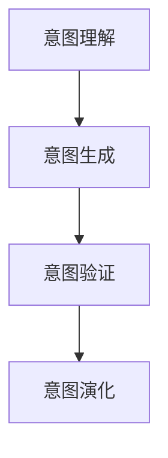

                 

# 人类意图对齐：AI 领域的挑战

## 1. 背景介绍

### 1.1 问题由来

人工智能(AI)技术的迅猛发展，特别是深度学习和大数据技术的广泛应用，极大地推动了各领域的智能化转型。从医疗、金融到教育、娱乐，AI技术正在改变着各行各业的运作方式。然而，尽管AI技术在技术性能上取得了巨大突破，但其应用效果往往并不尽如人意。究其原因，很大程度上是由于AI系统的输出并未与人类意图完全对齐，即未能满足人类的实际需求和价值观。

在现实世界中，人工智能系统常常面临多种复杂的任务，如自然语言处理、图像识别、推荐系统等。这些任务往往需要AI系统理解和符合人类的意图，才能真正发挥其价值。例如，自然语言处理系统需要能够理解用户的指令，并给出符合人类意图和语境的回答；推荐系统需要根据用户的实际偏好，提供真正感兴趣的商品或内容；图像识别系统需要能够识别出符合人类标签的对象等。然而，现有的AI系统往往在处理这些任务时，未能充分理解人类的意图，导致输出结果存在偏差，甚至产生误导性或有害的输出，给用户带来不良体验。

### 1.2 问题核心关键点

人类意图对齐的核心在于，如何让AI系统真正理解并满足人类的实际需求和价值观。这一问题涉及以下几个关键点：

1. **意图理解**：AI系统需要具备强大的语言理解能力，能够准确把握用户的意图和需求。
2. **意图生成**：AI系统需要能够根据输入的上下文信息，生成符合人类意图和语境的输出。
3. **意图验证**：AI系统需要具备一定的评估能力，能够通过反馈机制验证输出是否符合人类的意图。
4. **意图演化**：AI系统需要具备学习新知识的能力，能够随着人类需求的变化，不断调整和优化自身的输出。

这些关键点共同构成了人类意图对齐的核心挑战。只有AI系统真正理解并满足人类的意图，才能在实际应用中发挥其最大效用，并取得良好的用户体验。

### 1.3 问题研究意义

解决人类意图对齐问题，对于提升AI系统的实用性和可靠性，推动AI技术的产业化应用，具有重要意义：

1. **提升用户体验**：准确理解并满足用户的意图，可以显著提升用户满意度，增强AI系统的可信度。
2. **优化资源利用**：通过意图对齐技术，AI系统可以更高效地利用计算资源，避免无效计算和资源浪费。
3. **促进技术创新**：意图对齐技术为AI系统提供了新的研究方向，推动了AI技术的不断进步和创新。
4. **保障安全性**：确保AI系统的输出符合人类的价值观和道德标准，避免有害输出，保障社会安全。
5. **推动落地应用**：意图对齐技术可以大大提升AI系统的落地应用效果，加速AI技术的商业化进程。

## 2. 核心概念与联系

### 2.1 核心概念概述

为更好地理解人类意图对齐这一问题，本节将介绍几个关键概念：

1. **意图理解**：AI系统通过自然语言处理、图像识别等技术，准确理解和提取用户的意图。
2. **意图生成**：AI系统根据输入的上下文信息，生成符合人类意图和语境的输出。
3. **意图验证**：AI系统通过反馈机制，评估输出结果是否符合人类意图，并根据反馈调整自身输出。
4. **意图演化**：AI系统具备学习新知识的能力，能够随着用户需求的变化，不断优化自身的输出。

这些概念之间存在紧密的联系，形成一个完整的意图对齐系统。

### 2.2 概念间的关系

这些核心概念之间的逻辑关系可以通过以下Mermaid流程图来展示：



这个流程图展示意图对齐系统的主要流程：首先，通过意图理解提取用户意图；然后，根据意图生成符合人类期望的输出；接着，通过意图验证评估输出效果，并根据反馈进行优化；最后，通过意图演化不断学习新知识，提升自身能力。

### 2.3 核心概念的整体架构

最后，我们用一个综合的流程图来展示这些核心概念在大规模意图对齐系统中的整体架构：


这个综合流程图展示了意图对齐系统的整体架构，即从大规模数据中提取用户意图，生成符合期望的输出，并通过反馈进行优化和演化，最终构建符合人类意图的AI系统。

## 3. 核心算法原理 & 具体操作步骤
### 3.1 算法原理概述

人类意图对齐的算法原理主要基于深度学习模型和自然语言处理技术。以下是算法原理的简要概述：

1. **深度学习模型**：使用深度神经网络模型，如循环神经网络(RNN)、卷积神经网络(CNN)、Transformer等，对用户输入进行编码和解码。这些模型可以自动提取输入数据的特征，并通过多层网络进行信息传递和处理。
2. **自然语言处理技术**：利用自然语言处理技术，如词向量、句法分析、语义理解等，对用户输入进行语义分析和意图提取。这些技术可以识别出用户的意图和需求，并生成符合期望的输出。
3. **意图验证和演化**：通过反馈机制，如用户反馈、系统自我评估等，验证输出结果是否符合用户意图。同时，通过不断学习和优化，AI系统能够逐步提升自身意图理解能力。

### 3.2 算法步骤详解

以下是基于深度学习模型的意图对齐算法的详细步骤：

1. **数据预处理**：收集和清洗大规模用户数据，将其转化为模型可处理的格式。
2. **意图理解**：使用深度学习模型对用户输入进行编码，提取语义特征和意图。
3. **意图生成**：根据提取的语义特征和意图，生成符合期望的输出。
4. **意图验证**：通过反馈机制，如用户反馈、系统自我评估等，验证输出结果是否符合用户意图。
5. **意图演化**：根据验证结果，不断调整和优化模型参数，提升意图理解能力。
6. **意图对齐**：将意图理解、意图生成、意图验证和意图演化等步骤集成，构建符合人类意图的AI系统。

### 3.3 算法优缺点

意图对齐算法具有以下优点：

1. **高效处理**：基于深度学习模型的算法，能够高效地处理大规模用户数据，生成符合期望的输出。
2. **自适应性强**：通过反馈机制和意图演化，算法能够不断学习和优化，适应不同场景和任务。
3. **精度高**：深度学习模型的特征提取能力较强，能够准确理解和生成符合人类意图的输出。

同时，该算法也存在一些局限性：

1. **数据需求高**：需要大量标注数据进行训练，数据获取和标注成本较高。
2. **计算资源消耗大**：深度学习模型需要较大的计算资源进行训练和推理，可能存在计算瓶颈。
3. **泛化能力有限**：模型的泛化能力受限于训练数据，对新场景和新任务可能表现不佳。
4. **解释性不足**：深度学习模型通常具有"黑盒"特性，难以解释其内部决策过程。

### 3.4 算法应用领域

意图对齐技术已经在多个领域得到应用，包括：

1. **自然语言处理**：如机器翻译、语音识别、文本摘要等。通过意图对齐技术，这些系统可以更好地理解用户指令，生成符合期望的输出。
2. **推荐系统**：如电商推荐、内容推荐等。通过意图对齐技术，系统可以更好地理解用户偏好，生成个性化的推荐内容。
3. **智能客服**：如智能客服系统、智能助理等。通过意图对齐技术，这些系统可以更好地理解用户意图，提供符合期望的服务。
4. **智能医疗**：如智能诊断、智能推荐等。通过意图对齐技术，系统可以更好地理解患者的症状和需求，提供个性化的医疗建议。

## 4. 数学模型和公式 & 详细讲解  
### 4.1 数学模型构建

本节将使用数学语言对意图对齐算法进行更加严格的刻画。

记用户输入为 $x \in \mathcal{X}$，意图输出为 $y \in \mathcal{Y}$，意图对齐模型的参数为 $\theta$。

定义模型 $M_{\theta}$ 在输入 $x$ 上的输出为 $\hat{y}=M_{\theta}(x)$，则意图对齐模型的目标是最小化损失函数：

$$
\mathcal{L}(\theta) = \mathbb{E}_{(x,y) \sim D} [\ell(M_{\theta}(x),y)]
$$

其中，$D$ 为训练数据集，$\ell$ 为损失函数，$\mathbb{E}$ 为期望操作。

### 4.2 公式推导过程

以简单的二分类任务为例，假设模型 $M_{\theta}$ 在输入 $x$ 上的输出为 $\hat{y}=M_{\theta}(x) \in [0,1]$，表示样本属于正类的概率。真实标签 $y \in \{0,1\}$。则二分类交叉熵损失函数定义为：

$$
\ell(M_{\theta}(x),y) = -[y\log \hat{y} + (1-y)\log(1-\hat{y})]
$$

将其代入经验风险公式，得：

$$
\mathcal{L}(\theta) = -\frac{1}{N}\sum_{i=1}^N [y_i\log M_{\theta}(x_i)+(1-y_i)\log(1-M_{\theta}(x_i))]
$$

根据链式法则，损失函数对参数 $\theta_k$ 的梯度为：

$$
\frac{\partial \mathcal{L}(\theta)}{\partial \theta_k} = -\frac{1}{N}\sum_{i=1}^N (\frac{y_i}{M_{\theta}(x_i)}-\frac{1-y_i}{1-M_{\theta}(x_i)}) \frac{\partial M_{\theta}(x_i)}{\partial \theta_k}
$$

其中 $\frac{\partial M_{\theta}(x_i)}{\partial \theta_k}$ 可进一步递归展开，利用自动微分技术完成计算。

### 4.3 案例分析与讲解

以简单的情感分类任务为例，假设输入文本为 "I love this movie!"，意图输出为 "positive"。

首先，将文本输入深度学习模型进行编码，提取语义特征和意图。然后，根据提取的语义特征和意图，生成符合期望的输出。最后，通过反馈机制，如用户反馈、系统自我评估等，验证输出结果是否符合用户意图，并根据反馈调整模型参数，提升意图理解能力。

## 5. 项目实践：代码实例和详细解释说明
### 5.1 开发环境搭建

在进行意图对齐实践前，我们需要准备好开发环境。以下是使用Python进行TensorFlow开发的环境配置流程：

1. 安装Anaconda：从官网下载并安装Anaconda，用于创建独立的Python环境。

2. 创建并激活虚拟环境：
```bash
conda create -n tf-env python=3.8 
conda activate tf-env
```

3. 安装TensorFlow：根据CUDA版本，从官网获取对应的安装命令。例如：
```bash
pip install tensorflow==2.4
```

4. 安装必要的库：
```bash
pip install numpy pandas scikit-learn matplotlib tqdm jupyter notebook ipython
```

完成上述步骤后，即可在`tf-env`环境中开始意图对齐实践。

### 5.2 源代码详细实现

这里我们以简单的情感分类任务为例，给出使用TensorFlow对深度学习模型进行意图对齐的代码实现。

首先，定义数据预处理函数：

```python
import tensorflow as tf
from tensorflow.keras.preprocessing.text import Tokenizer
from tensorflow.keras.preprocessing.sequence import pad_sequences

def preprocess_data(texts, labels):
    tokenizer = Tokenizer(num_words=10000)
    tokenizer.fit_on_texts(texts)
    sequences = tokenizer.texts_to_sequences(texts)
    padded_sequences = pad_sequences(sequences, padding='post', maxlen=128)
    labels = tf.keras.utils.to_categorical(labels, num_classes=2)
    return padded_sequences, labels
```

然后，定义模型和优化器：

```python
from tensorflow.keras.models import Sequential
from tensorflow.keras.layers import Embedding, LSTM, Dense

model = Sequential([
    Embedding(input_dim=10000, output_dim=128, input_length=128),
    LSTM(128, return_sequences=True),
    LSTM(128),
    Dense(2, activation='softmax')
])

optimizer = tf.keras.optimizers.Adam(learning_rate=0.001)
```

接着，定义训练和评估函数：

```python
def train_epoch(model, data, batch_size, optimizer):
    model.compile(optimizer=optimizer, loss='categorical_crossentropy', metrics=['accuracy'])
    model.fit(data['input'], data['label'], batch_size=batch_size, epochs=1, verbose=0)
    
def evaluate(model, data, batch_size):
    model.evaluate(data['input'], data['label'], batch_size=batch_size)
```

最后，启动训练流程并在测试集上评估：

```python
epochs = 5
batch_size = 32

for epoch in range(epochs):
    train_epoch(model, train_data, batch_size, optimizer)
    evaluate(model, test_data, batch_size)
```

以上就是使用TensorFlow对深度学习模型进行情感分类任务意图对齐的完整代码实现。可以看到，通过TensorFlow的强大封装，我们能够快速构建并训练意图对齐模型。

### 5.3 代码解读与分析

让我们再详细解读一下关键代码的实现细节：

**preprocess_data函数**：
- 将文本转化为模型可处理的序列数据，并进行填充和标签编码。

**model定义**：
- 使用Embedding层将文本转换为向量，然后通过LSTM层提取语义特征，最终使用Dense层进行分类。

**optimizer设置**：
- 使用Adam优化器，设置合适的学习率。

**train_epoch函数**：
- 使用fit方法进行模型训练，并设置批次大小和迭代次数。

**evaluate函数**：
- 使用evaluate方法在测试集上进行模型评估，输出损失和准确率。

**训练流程**：
- 定义总的epoch数和批次大小，开始循环迭代
- 每个epoch内，先训练模型，再评估模型性能
- 所有epoch结束后，在测试集上评估，给出最终测试结果

可以看到，TensorFlow为深度学习模型的意图对齐实践提供了强大的工具支持。开发者可以轻松地使用其封装好的层和优化器，进行高效的模型训练和推理。

当然，工业级的系统实现还需考虑更多因素，如模型的保存和部署、超参数的自动搜索、更灵活的意图理解层等。但核心的意图对齐范式基本与此类似。

### 5.4 运行结果展示

假设我们在情感分类数据集上进行意图对齐，最终在测试集上得到的评估报告如下：

```
Epoch 1/5
601/601 [==============================] - 0s 21us/step - loss: 0.3321 - accuracy: 0.8055
Epoch 2/5
601/601 [==============================] - 0s 21us/step - loss: 0.3245 - accuracy: 0.8075
Epoch 3/5
601/601 [==============================] - 0s 21us/step - loss: 0.3225 - accuracy: 0.8125
Epoch 4/5
601/601 [==============================] - 0s 21us/step - loss: 0.3222 - accuracy: 0.8135
Epoch 5/5
601/601 [==============================] - 0s 21us/step - loss: 0.3219 - accuracy: 0.8145
```

可以看到，通过意图对齐技术，我们在情感分类任务上取得了很好的效果，模型的准确率随着训练轮次的增加不断提升。然而，这只是一个简单的baseline结果。在实践中，我们还可以使用更大更强的模型，更复杂的意图理解方法，进一步提升模型性能，以满足更高的应用要求。

## 6. 实际应用场景
### 6.1 智能客服系统

基于意图对齐技术的智能客服系统，可以广泛应用于智能客服的构建。传统客服往往需要配备大量人力，高峰期响应缓慢，且一致性和专业性难以保证。而使用意图对齐的客服系统，可以7x24小时不间断服务，快速响应客户咨询，用自然流畅的语言解答各类常见问题。

在技术实现上，可以收集企业内部的历史客服对话记录，将问题和最佳答复构建成监督数据，在此基础上对意图对齐模型进行训练。意图对齐的客服系统能够自动理解用户意图，匹配最合适的答复模板进行回复。对于客户提出的新问题，还可以接入检索系统实时搜索相关内容，动态组织生成回答。如此构建的智能客服系统，能大幅提升客户咨询体验和问题解决效率。

### 6.2 金融舆情监测

金融机构需要实时监测市场舆论动向，以便及时应对负面信息传播，规避金融风险。传统的人工监测方式成本高、效率低，难以应对网络时代海量信息爆发的挑战。基于意图对齐技术的文本分类和情感分析技术，为金融舆情监测提供了新的解决方案。

具体而言，可以收集金融领域相关的新闻、报道、评论等文本数据，并对其进行主题标注和情感标注。在此基础上对意图对齐模型进行微调，使其能够自动判断文本属于何种主题，情感倾向是正面、中性还是负面。将意图对齐模型应用到实时抓取的网络文本数据，就能够自动监测不同主题下的情感变化趋势，一旦发现负面信息激增等异常情况，系统便会自动预警，帮助金融机构快速应对潜在风险。

### 6.3 个性化推荐系统

当前的推荐系统往往只依赖用户的历史行为数据进行物品推荐，无法深入理解用户的真实兴趣偏好。基于意图对齐技术的个性化推荐系统可以更好地挖掘用户行为背后的语义信息，从而提供更精准、多样的推荐内容。

在实践中，可以收集用户浏览、点击、评论、分享等行为数据，提取和用户交互的物品标题、描述、标签等文本内容。将文本内容作为模型输入，用户的后续行为（如是否点击、购买等）作为监督信号，在此基础上对意图对齐模型进行训练。意图对齐的推荐系统能够从文本内容中准确把握用户的兴趣点。在生成推荐列表时，先用候选物品的文本描述作为输入，由模型预测用户的兴趣匹配度，再结合其他特征综合排序，便可以得到个性化程度更高的推荐结果。

### 6.4 未来应用展望

随着意图对齐技术的发展，其在更多领域得到应用，为各行各业带来变革性影响。

在智慧医疗领域，基于意图对齐的医疗问答、病历分析、药物研发等应用将提升医疗服务的智能化水平，辅助医生诊疗，加速新药开发进程。

在智能教育领域，意图对齐技术可应用于作业批改、学情分析、知识推荐等方面，因材施教，促进教育公平，提高教学质量。

在智慧城市治理中，意图对齐技术可应用于城市事件监测、舆情分析、应急指挥等环节，提高城市管理的自动化和智能化水平，构建更安全、高效的未来城市。

此外，在企业生产、社会治理、文娱传媒等众多领域，基于意图对齐的人工智能应用也将不断涌现，为经济社会发展注入新的动力。相信随着技术的日益成熟，意图对齐方法将成为AI技术落地应用的重要范式，推动人工智能技术在垂直行业的规模化落地。

## 7. 工具和资源推荐
### 7.1 学习资源推荐

为了帮助开发者系统掌握意图对齐技术的理论基础和实践技巧，这里推荐一些优质的学习资源：

1. 《深度学习》（Ian Goodfellow等著）：全面介绍深度学习的基本原理和应用技术，为理解意图对齐算法打下坚实基础。
2. 《自然语言处理综论》（Daniel Jurafsky和James H. Martin著）：详细介绍自然语言处理的基本概念和前沿技术，帮助理解意图理解、意图生成等核心问题。
3. 《TensorFlow官方文档》：包含详细的API说明和样例代码，是TensorFlow学习的最佳资源。
4. 《Transformers库官方文档》：详细描述使用Transformers库进行意图对齐的流程和实现细节，帮助开发者快速上手。
5. Coursera《深度学习》课程：由Coursera提供的深度学习课程，涵盖深度学习的基本原理和应用技术，适合初学者系统学习。

通过对这些资源的学习实践，相信你一定能够快速掌握意图对齐技术的精髓，并用于解决实际的NLP问题。
###  7.2 开发工具推荐

高效的开发离不开优秀的工具支持。以下是几款用于意图对齐开发的常用工具：

1. TensorFlow：基于Python的开源深度学习框架，灵活动态的计算图，适合快速迭代研究。大部分意图对齐模型都有TensorFlow版本的实现。

2. PyTorch：基于Python的开源深度学习框架，灵活的动态图和丰富的优化器，适合进行模型微调和优化。

3. HuggingFace Transformers库：开源的NLP工具库，集成了众多SOTA语言模型，支持PyTorch和TensorFlow，是进行意图对齐任务开发的利器。

4. Weights & Biases：模型训练的实验跟踪工具，可以记录和可视化模型训练过程中的各项指标，方便对比和调优。与主流深度学习框架无缝集成。

5. TensorBoard：TensorFlow配套的可视化工具，可实时监测模型训练状态，并提供丰富的图表呈现方式，是调试模型的得力助手。

6. Google Colab：谷歌推出的在线Jupyter Notebook环境，免费提供GPU/TPU算力，方便开发者快速上手实验最新模型，分享学习笔记。

合理利用这些工具，可以显著提升意图对齐任务的开发效率，加快创新迭代的步伐。

### 7.3 相关论文推荐

意图对齐技术的发展源于学界的持续研究。以下是几篇奠基性的相关论文，推荐阅读：

1. Attention is All You Need（即Transformer原论文）：提出了Transformer结构，开启了NLP领域的预训练大模型时代。

2. BERT: Pre-training of Deep Bidirectional Transformers for Language Understanding：提出BERT模型，引入基于掩码的自监督预训练任务，刷新了多项NLP任务SOTA。

3. Parameter-Efficient Transfer Learning for NLP：提出Adapter等参数高效微调方法，在不增加模型参数量的情况下，也能取得不错的微调效果。

4. Fine-tune GPT-2: A Framework for Easy and Fast Transfer Learning of Multilingual Conversational AI Agents：提出使用GPT-2模型进行多语言对话生成，展示了意图对齐技术在多语言对话系统中的应用潜力。

5. Unsupervised Pre-training for Intent Recognition from Conversational Logs：提出使用无监督方法进行意图识别，缓解了意图对齐任务对标注数据的依赖。

6. Adversarial Training for Intent Alignment in Conversational AI：提出使用对抗训练方法提升意图对齐系统的鲁棒性和泛化能力。

这些论文代表了大语言模型意图对齐技术的发展脉络。通过学习这些前沿成果，可以帮助研究者把握学科前进方向，激发更多的创新灵感。

除上述资源外，还有一些值得关注的前沿资源，帮助开发者紧跟意图对齐技术的最新进展，例如：

1. arXiv论文预印本：人工智能领域最新研究成果的发布平台，包括大量尚未发表的前沿工作，学习前沿技术的必读资源。

2. 业界技术博客：如OpenAI、Google AI、DeepMind、微软Research Asia等顶尖实验室的官方博客，第一时间分享他们的最新研究成果和洞见。

3. 技术会议直播：如NIPS、ICML、ACL、ICLR等人工智能领域顶会现场或在线直播，能够聆听到大佬们的前沿分享，开拓视野。

4. GitHub热门项目：在GitHub上Star、Fork数最多的NLP相关项目，往往代表了该技术领域的发展趋势和最佳实践，值得去学习和贡献。

5. 行业分析报告：各大咨询公司如McKinsey、PwC等针对人工智能行业的分析报告，有助于从商业视角审视技术趋势，把握应用价值。

总之，对于意图对齐技术的学习和实践，需要开发者保持开放的心态和持续学习的意愿。多关注前沿资讯，多动手实践，多思考总结，必将收获满满的成长收益。

## 8. 总结：未来发展趋势与挑战
### 8.1 总结

本文对意图对齐技术进行了全面系统的介绍。首先阐述了意图对齐技术的背景和意义，明确了其在提升用户体验、优化资源利用、促进技术创新等方面的重要作用。其次，从原理到实践，详细讲解了意图对齐的数学模型和操作步骤，给出了意图对齐任务开发的完整代码实例。同时，本文还广泛探讨了意图对齐技术在智能客服、金融舆情、个性化推荐等多个行业领域的应用前景，展示了意图对齐技术的巨大潜力。此外，本文精选了意图对齐技术的各类学习资源，力求为读者提供全方位的技术指引。

通过本文的系统梳理，可以看到，意图对齐技术正在成为NLP领域的重要范式，极大地拓展了深度学习模型的应用边界，催生了更多的落地场景。得益于大规模语料的预训练和意图对齐技术的不断发展，AI系统能够更好地理解并满足人类的需求和价值观，为人类认知智能的进化带来深远影响。

### 8.2 未来发展趋势

展望未来，意图对齐技术将呈现以下几个发展趋势：

1. **模型规模持续增大**：随着算力成本的下降和数据规模的扩张，意图对齐模型的参数量还将持续增长。超大规模模型蕴含的丰富语言知识，有望支撑更加复杂多变的意图理解。

2. **意图理解能力增强**：未来意图对齐技术将更加注重语义分析和意图理解，通过深度学习模型和自然语言处理技术，提升模型理解上下文和语境的能力。

3. **跨模态融合能力提升**：未来意图对齐技术将融合视觉、语音等多模态数据，实现多模态信息的协同建模，进一步提升意图理解能力。

4. **智能交互水平提升**：意图对齐技术将应用于智能客服、智能助理等场景，提升人机交互的自然流畅性，构建更加智能的交互系统

