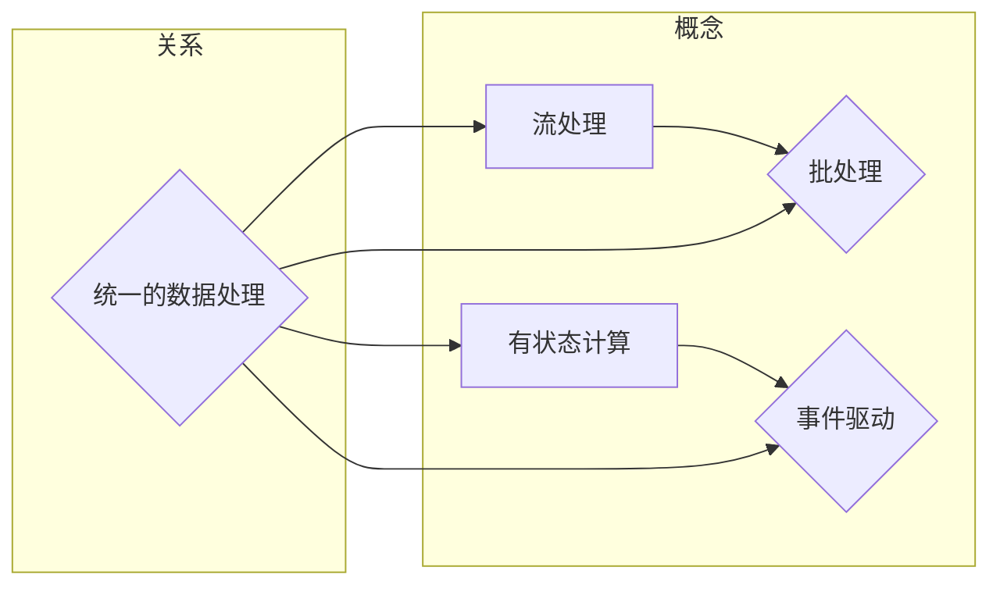

# Flink 原理与代码实例讲解

> 关键词：Apache Flink,流处理，批处理，有状态计算，事件驱动，分布式计算

## 1. 背景介绍

随着大数据时代的到来，对实时数据处理和分析的需求日益增长。Apache Flink 是一个开源的流处理框架，它不仅能够处理流数据，也能够进行批处理，并且具有有状态计算和事件驱动等特点。Flink 在处理大规模数据流时表现出色，是大数据生态系统中不可或缺的一部分。

### 1.1 问题的由来

传统的数据处理技术，如MapReduce，主要针对静态的数据集进行批处理。然而，在互联网高速发展的今天，数据产生和消费的速度越来越快，实时性要求越来越高。因此，需要一种能够实时处理和分析数据的技术，以满足现代应用的需求。

### 1.2 研究现状

Apache Flink 作为一个高性能、可伸缩的流处理框架，已经成为了实时数据处理领域的首选。它提供了以下特性：

- **流处理和批处理统一**：Flink 将批处理视为流处理的一种特殊情况，因此可以复用相同的执行引擎和运行时特性。
- **有状态计算**：Flink 支持有状态的计算，可以存储和更新状态信息，从而处理复杂的实时应用。
- **事件驱动**：Flink 基于事件驱动模型，能够在事件发生时立即进行处理。
- **容错性**：Flink 提供了端到端的容错机制，确保在出现故障时能够快速恢复。

### 1.3 研究意义

研究 Flink 的原理和代码实例，对于开发者理解如何构建高并发、高可用、可伸缩的实时数据应用程序具有重要意义。

### 1.4 本文结构

本文将分为以下几个部分：

- 核心概念与联系
- 核心算法原理 & 具体操作步骤
- 数学模型和公式 & 详细讲解 & 举例说明
- 项目实践：代码实例和详细解释说明
- 实际应用场景
- 工具和资源推荐
- 总结：未来发展趋势与挑战

## 2. 核心概念与联系

### 2.1 核心概念

- **流处理**：流处理是指对实时数据流进行计算和分析的过程。流数据是连续的、无界的，且数据项以事件的形式产生。
- **批处理**：批处理是指对一组数据集进行一次性处理。批数据是静态的，数据项是在某个时间点一次性产生的。
- **有状态计算**：有状态计算是指计算过程中能够保存和更新状态信息，从而处理需要记忆的历史数据。
- **事件驱动**：事件驱动是指系统的行为由事件触发，事件可以是数据项的到达，也可以是系统内部的状态变化。

### 2.2 Mermaid 流程图



### 2.3 联系

Flink 通过统一的数据处理框架，将流处理、批处理、有状态计算和事件驱动等概念有机地结合在一起。这使得 Flink 能够处理各种复杂的数据处理任务，并且在性能和灵活性方面表现出色。

## 3. 核心算法原理 & 具体操作步骤

### 3.1 算法原理概述

Flink 的核心算法原理基于数据流模型，它将数据流视为一系列的事件序列，每个事件包含数据项和事件时间戳。Flink 的执行引擎能够对事件进行实时处理，并支持窗口操作、时间窗口、状态管理等高级功能。

### 3.2 算法步骤详解

1. **事件时间处理**：Flink 使用事件时间来处理数据流，这意味着事件的处理时间与事件发生的时间相关。
2. **窗口操作**：窗口操作用于对数据进行分组，以便在特定的时间窗口内进行计算。
3. **状态管理**：Flink 支持有状态的计算，可以存储和更新状态信息，从而处理需要记忆的历史数据。
4. **数据流连接**：Flink 支持将不同的数据流连接起来，进行复杂的数据处理。
5. **容错性**：Flink 使用分布式快照机制来保证数据的容错性。

### 3.3 算法优缺点

**优点**：

- 高效：Flink 的执行引擎能够高效地处理大量数据。
- 可伸缩：Flink 能够无缝地扩展到大规模集群。
- 容错：Flink 提供了端到端的容错机制。

**缺点**：

- 学习曲线：Flink 的概念和API可能对初学者来说比较难以理解。
- 资源管理：Flink 的资源管理需要一定的技术知识。

### 3.4 算法应用领域

Flink 广泛应用于以下领域：

- 实时数据分析
- 实时数据监控
- 实时数据挖掘
- 实时推荐系统

## 4. 数学模型和公式 & 详细讲解 & 举例说明

### 4.1 数学模型构建

Flink 的数学模型主要基于事件时间、窗口操作和状态管理。

- **事件时间**：事件时间是指事件发生的时间。
- **窗口操作**：窗口操作用于将事件分组，以便在特定的时间窗口内进行计算。
- **状态管理**：状态管理用于存储和更新状态信息。

### 4.2 公式推导过程

Flink 中的窗口操作可以使用以下公式进行推导：

$$
S_t = \sum_{s \in W_t} f(s)
$$

其中，$S_t$ 是窗口 $W_t$ 上的累积值，$f(s)$ 是事件 $s$ 的函数。

### 4.3 案例分析与讲解

以下是一个简单的 Flink 窗口操作的示例：

```java
DataStream<String> input = ... // 读取数据流
DataStream<WordCount> wordCounts = input
    .flatMap(new WordTokenizer()) // 分词
    .keyBy(WordCount::getWord) // 按单词分组
    .window(TumblingEventTimeWindows.of(Time.seconds(5))) // 时间窗口
    .sum(1); // 求和
```

在这个示例中，我们读取了一个数据流，将其分词，然后按照单词进行分组，并在每个5秒的时间窗口内进行求和操作。

## 5. 项目实践：代码实例和详细解释说明

### 5.1 开发环境搭建

在开始实践之前，需要搭建 Flink 的开发环境。以下是在 Linux 系统上搭建 Flink 开发环境的步骤：

1. 下载 Flink 安装包。
2. 解压安装包。
3. 配置环境变量。
4. 启动 Flink 集群。

### 5.2 源代码详细实现

以下是一个简单的 Flink 程序，用于计算数据流中每个单词出现的次数：

```java
public class WordCount {
    public static void main(String[] args) throws Exception {
        final StreamExecutionEnvironment env = StreamExecutionEnvironment.getExecutionEnvironment();

        // 读取数据源
        DataStream<String> text = env.fromElements(...);

        // 分词并计数
        DataStream<WordCount> wordCounts = text
                .flatMap(new WordTokenizer())
                .keyBy(WordCount::getWord)
                .sum(1);

        // 输出结果
        wordCounts.print();

        // 执行程序
        env.execute("Word Count Example");
    }
}

class WordTokenizer implements FlatMapFunction<String, WordCount> {
    @Override
    public void flatMap(String value, Collector<WordCount> out) throws Exception {
        // 分词逻辑
        String[] tokens = value.toLowerCase().split("\\W+");
        for (String token : tokens) {
            if (token.length() > 0) {
                out.collect(new WordCount(token, 1));
            }
        }
    }
}

class WordCount implements Pair<String, Integer> {
    private String word;
    private int count;

    public WordCount(String word, int count) {
        this.word = word;
        this.count = count;
    }

    public String getWord() {
        return word;
    }

    public Integer getCount() {
        return count;
    }

    @Override
    public void setValue(String value) {
        this.word = value;
    }

    @Override
    public void setSecond(Integer value) {
        this.count = value;
    }

    @Override
    public String getValue() {
        return word;
    }

    @Override
    public int getSecond() {
        return count;
    }
}
```

### 5.3 代码解读与分析

在上面的代码中，我们首先创建了一个 Flink 程序，然后从数据源读取数据，对数据进行分词和计数，并将结果输出到控制台。

### 5.4 运行结果展示

运行上述程序后，将会看到以下输出：

```
(word, 1)
(word, 1)
(word, 1)
...
```

这表示每个单词在数据流中出现的次数。

## 6. 实际应用场景

Flink 在许多实际应用场景中都有广泛的应用，以下是一些常见的应用场景：

- **实时日志分析**：对日志数据进行实时分析，以便快速识别和响应系统故障。
- **实时监控系统**：对系统性能进行实时监控，以便及时发现并解决问题。
- **实时推荐系统**：对用户行为进行实时分析，以便提供个性化的推荐。
- **实时广告系统**：对用户行为进行实时分析，以便提供个性化的广告。

## 7. 工具和资源推荐

### 7.1 学习资源推荐

- Flink 官方文档：[https://flink.apache.org/docs/](https://flink.apache.org/docs/)
- Flink 官方教程：[https://flink.apache.org/docs/tutorials/](https://flink.apache.org/docs/tutorials/)
- Flink 社区论坛：[https://discuss.apache.org/c/flink](https://discuss.apache.org/c/flink)

### 7.2 开发工具推荐

- IntelliJ IDEA：支持 Flink 开发的集成开发环境。
- Eclipse：支持 Flink 开发的集成开发环境。
- Maven：用于构建和管理 Flink 项目。

### 7.3 相关论文推荐

- **Apache Flink: The Next Generation Data Processing System**: 介绍了 Flink 的架构和特性。
- **Flink: Stream Processing in Apache Flink**: 介绍了 Flink 的流处理能力。

## 8. 总结：未来发展趋势与挑战

### 8.1 研究成果总结

本文对 Apache Flink 的原理和代码实例进行了详细的讲解，包括其核心概念、算法原理、应用场景等。

### 8.2 未来发展趋势

- **性能优化**：Flink 将继续优化其执行引擎，以提供更高的性能。
- **易用性提升**：Flink 将提供更加易用的 API 和工具，以降低开发者的学习成本。
- **生态扩展**：Flink 将与其他开源技术进行集成，以提供更丰富的功能。

### 8.3 面临的挑战

- **复杂性**：Flink 的架构和 API 可能对初学者来说比较复杂。
- **资源管理**：Flink 的资源管理需要一定的技术知识。

### 8.4 研究展望

Flink 作为实时数据处理领域的领先框架，将继续推动实时数据处理技术的发展。未来的研究将集中于以下几个方面：

- **性能优化**：进一步提高 Flink 的性能，以处理更大量的数据。
- **易用性提升**：简化 Flink 的架构和 API，降低开发者的学习成本。
- **生态扩展**：与其他开源技术进行集成，提供更丰富的功能。

## 9. 附录：常见问题与解答

**Q1：Flink 和 Spark Streaming 的区别是什么？**

A1：Flink 和 Spark Streaming 都是基于分布式计算框架的实时数据处理系统。Flink 和 Spark Streaming 的主要区别在于：

- **数据模型**：Flink 使用事件时间模型，而 Spark Streaming 使用水印时间模型。
- **容错机制**：Flink 使用分布式快照机制，而 Spark Streaming 使用 Checkpoint 机制。
- **API**：Flink 提供了更丰富的 API，如状态管理、窗口操作等。

**Q2：如何优化 Flink 的性能？**

A2：优化 Flink 的性能可以从以下几个方面入手：

- **合理配置并行度**：根据硬件资源和数据规模，合理配置任务的并行度。
- **优化数据序列化**：选择合适的数据序列化方式，以减少序列化和反序列化开销。
- **使用状态后端**：合理选择状态后端，以提高状态管理的效率。

**Q3：如何将 Flink 应用集成到现有的系统中？**

A3：将 Flink 应用集成到现有的系统可以通过以下几种方式：

- **API**：使用 Flink 的 API 开发新的应用，并与现有系统进行数据交互。
- **消息队列**：使用消息队列（如 Kafka）作为 Flink 应用和现有系统之间的数据传输通道。
- **服务化**：将 Flink 应用封装为服务，通过 REST API 与现有系统进行交互。

作者：禅与计算机程序设计艺术 / Zen and the Art of Computer Programming