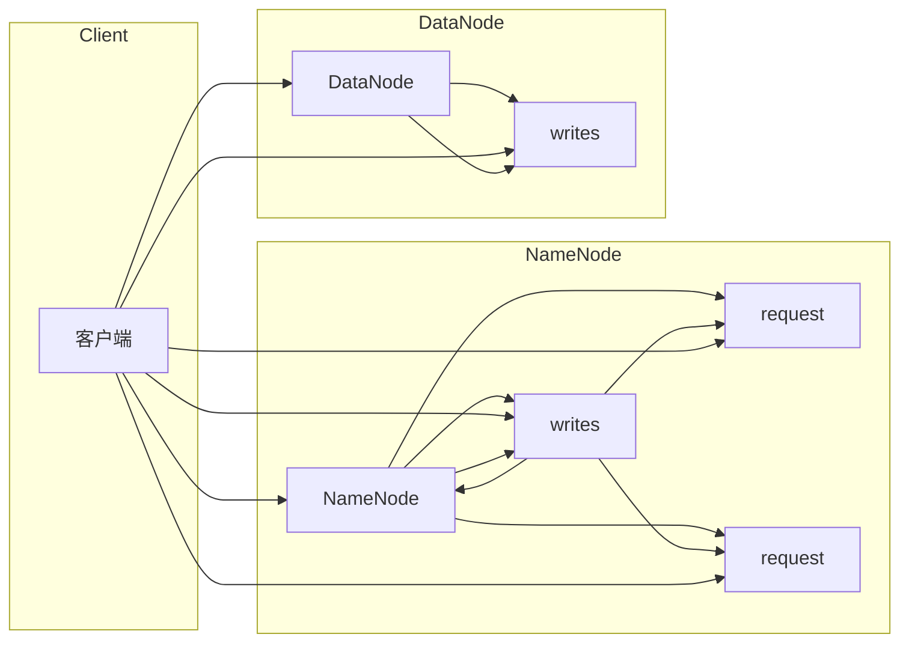

# HDFS 原理与代码实例讲解

> 关键词：HDFS, 分布式文件系统, Hadoop, 大数据, 容错性, 性能优化, Java API, 代码实例

## 1. 背景介绍

随着互联网和物联网的快速发展，数据量呈指数级增长。大数据处理成为现代企业和科研机构的重要需求。Hadoop生态系统中的分布式文件系统（HDFS）因其高可靠性、高容错性以及高扩展性，成为了大数据存储的基石。本文将深入浅出地讲解HDFS的原理，并通过代码实例展示如何使用Java API操作HDFS。

### 1.1 问题的由来

传统的集中式文件系统在处理海量数据时面临着扩展性、可靠性、性能等方面的挑战。为了解决这些问题，Hadoop项目应运而生，其中HDFS作为核心组件之一，承担着大数据存储的重任。

### 1.2 研究现状

HDFS自2006年开源以来，已经经过了多年的发展，成为了大数据生态系统的重要组成部分。目前，HDFS已经广泛应用于金融、医疗、互联网、科研等众多领域。

### 1.3 研究意义

了解HDFS的原理对于开发大数据应用具有重要意义：
- 提升对大数据存储架构的理解
- 帮助开发者更好地利用HDFS进行数据存储和处理
- 促进大数据技术的学习和应用

### 1.4 本文结构

本文将按照以下结构进行阐述：
- 第二部分：介绍HDFS的核心概念和架构
- 第三部分：讲解HDFS的原理和操作步骤
- 第四部分：通过代码实例展示如何使用Java API操作HDFS
- 第五部分：探讨HDFS的实际应用场景
- 第六部分：展望HDFS的未来发展趋势与挑战
- 第七部分：推荐学习资源、开发工具和参考文献
- 第八部分：总结全文

## 2. 核心概念与联系

HDFS的核心概念包括：
- **文件**：HDFS中的数据存储单位是文件，文件通过目录结构进行组织。
- **块（Block）**：HDFS中每个文件被分割成固定大小的数据块，默认为128MB。
- **命名节点（NameNode）**：HDFS集群中的主节点，负责管理文件的元数据，如文件名、目录结构、块映射等。
- **数据节点（DataNode）**：HDFS集群中的从节点，负责存储实际的数据块，并响应命名节点的读写请求。
- **数据副本（Replication）**：为了保证数据的高可靠性，HDFS中每个数据块都会在集群中存储多个副本。

HDFS的架构流程图如下：



客户端通过NameNode获取文件的元数据信息，并直接与数据节点进行数据交换。NameNode负责维护文件系统的命名空间和客户端对数据块的访问权限，而数据节点负责数据的存储和检索。

## 3. 核心算法原理 & 具体操作步骤

### 3.1 算法原理概述

HDFS的核心算法原理包括：
- **文件分割**：将大文件分割成固定大小的数据块。
- **数据复制**：为每个数据块分配多个副本，提高数据的可靠性。
- **数据定位**：客户端通过NameNode定位数据块在数据节点上的存储位置。
- **数据读写**：客户端通过数据节点进行数据的读取和写入操作。

### 3.2 算法步骤详解

1. **文件分割**：当客户端上传文件时，HDFS会将文件分割成128MB的数据块。
2. **数据复制**：HDFS默认将数据块的副本存储在3个数据节点上，副本的存储位置由副本策略决定。
3. **数据定位**：客户端通过NameNode获取文件块的副本信息，并通过数据节点获取数据块。
4. **数据读写**：客户端通过数据节点进行数据的读取和写入操作。

### 3.3 算法优缺点

**优点**：
- **高可靠性**：数据块的多副本机制，保证了数据的安全性。
- **高扩展性**：HDFS可以无缝地添加新的数据节点，提高存储容量。
- **高吞吐量**：HDFS支持高并发读写，适合大数据处理。

**缺点**：
- **单点故障**：NameNode作为单点故障点，需要额外的保护措施。
- **读写性能**：HDFS的读写性能受限于网络带宽。

### 3.4 算法应用领域

HDFS广泛应用于以下领域：
- 大数据分析
- 大数据存储
- 分布式计算
- 物联网

## 4. 数学模型和公式 & 详细讲解 & 举例说明

### 4.1 数学模型构建

HDFS中的数据块大小和副本数量可以通过以下公式进行计算：

$$
块大小 = \text{文件大小} / \text{副本数量}
$$

### 4.2 公式推导过程

假设文件大小为 $F$，副本数量为 $R$，则每个数据块的大小为 $B = F / R$。

### 4.3 案例分析与讲解

假设一个文件大小为1GB，副本数量为3，则每个数据块的大小为：

$$
B = \frac{1GB}{3} = 333MB
$$

## 5. 项目实践：代码实例和详细解释说明

### 5.1 开发环境搭建

开发HDFS应用程序需要以下环境：
- Java开发环境
- Hadoop环境
- 客户端工具（如Hadoop命令行工具）

### 5.2 源代码详细实现

以下是一个简单的Java代码示例，展示了如何使用Hadoop客户端API上传文件到HDFS：

```java
import org.apache.hadoop.conf.Configuration;
import org.apache.hadoop.fs.FileSystem;
import org.apache.hadoop.fs.Path;

public class HDFSClient {
    public static void main(String[] args) throws Exception {
        // 创建Hadoop配置对象
        Configuration conf = new Configuration();
        conf.set("fs.defaultFS", "hdfs://hadoop-master:9000");
        
        // 创建FileSystem对象
        FileSystem fs = FileSystem.get(conf);
        
        // 上传文件
        fs.copyFromLocalFile(new Path("local/path/to/file"), new Path("/hdfs/path/to/file"));
        
        // 关闭FileSystem对象
        fs.close();
    }
}
```

### 5.3 代码解读与分析

- 首先，创建一个Hadoop配置对象，并设置HDFS的默认文件系统。
- 然后，创建一个FileSystem对象，用于与HDFS交互。
- 接着，使用`copyFromLocalFile`方法将本地文件上传到HDFS。
- 最后，关闭FileSystem对象。

### 5.4 运行结果展示

在Hadoop集群上运行上述代码，可以看到本地文件已经成功上传到HDFS指定的路径。

## 6. 实际应用场景

HDFS在实际应用中有着广泛的应用场景，以下列举几个例子：

- **日志存储**：将应用程序的日志数据存储在HDFS中，便于后续分析。
- **数据仓库**：将企业数据存储在HDFS中，为数据仓库提供底层存储支持。
- **大数据分析**：使用HDFS存储大规模数据集，便于进行数据挖掘和分析。

## 7. 工具和资源推荐

### 7.1 学习资源推荐

- 《Hadoop权威指南》
- 《Hadoop技术内幕》
- Hadoop官网文档

### 7.2 开发工具推荐

- Hadoop命令行工具
- Hadoop客户端API

### 7.3 相关论文推荐

- Hadoop: The Definitive Guide
- The Hadoop Distributed File System

## 8. 总结：未来发展趋势与挑战

### 8.1 研究成果总结

HDFS作为一种分布式文件系统，在大数据领域发挥着重要作用。本文从HDFS的原理、操作步骤、代码实例等方面进行了详细介绍，为开发者提供了参考。

### 8.2 未来发展趋势

- **性能优化**：进一步提升HDFS的读写性能，降低延迟。
- **存储优化**：探索新的存储技术，提高存储效率。
- **安全性**：加强数据安全性，防止数据泄露。

### 8.3 面临的挑战

- **单点故障**：NameNode作为单点故障点，需要加强保护。
- **性能瓶颈**：HDFS的读写性能受限于网络带宽。
- **数据一致性**：保证数据在多个副本之间的一致性。

### 8.4 研究展望

HDFS作为大数据存储的基石，将继续在未来的大数据领域发挥重要作用。通过不断优化性能、提高安全性，HDFS将更好地满足大数据存储的需求。

## 9. 附录：常见问题与解答

**Q1：HDFS如何保证数据可靠性？**

A：HDFS通过数据块的多副本机制来保证数据可靠性。每个数据块在集群中存储多个副本，当某个副本损坏时，其他副本可以保证数据的安全。

**Q2：HDFS的读写性能如何提升？**

A：可以通过以下方式提升HDFS的读写性能：
- 增加数据节点数量，提高并行处理能力。
- 优化数据块大小，减少网络传输开销。
- 使用更快的存储设备。

**Q3：HDFS如何处理单点故障？**

A：HDFS可以通过以下方式处理单点故障：
- 部署备份NameNode，当主NameNode故障时，可以切换到备份节点。
- 使用分布式NameNode，消除单点故障。

**Q4：HDFS适合存储哪些类型的数据？**

A：HDFS适合存储大规模的、非结构化数据，如日志数据、网页数据、社交媒体数据等。

作者：禅与计算机程序设计艺术 / Zen and the Art of Computer Programming