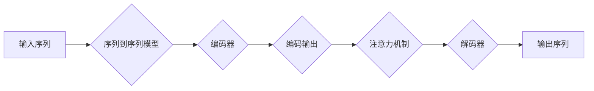

# Language Translation原理与代码实例讲解

> 关键词：机器翻译，NLP，深度学习，Transformer，神经网络，序列到序列模型，注意力机制

## 1. 背景介绍

语言翻译作为人类沟通的重要工具，自古以来就备受关注。随着信息时代的到来，跨语言交流的需求日益增长，机器翻译技术应运而生。从早期的基于规则的方法到如今的基于统计的方法，再到现在的深度学习方法，机器翻译技术经历了长足的发展。本文将深入探讨语言翻译的原理，并通过代码实例讲解如何实现一个简单的翻译系统。

### 1.1 问题的由来

语言翻译的目的是将一种自然语言文本转换为另一种自然语言文本，以便于不同语言背景的人们进行交流。传统的机器翻译方法通常依赖于语言学规则和统计分析，但往往难以处理复杂多变的语言现象。随着深度学习技术的发展，基于神经网络的序列到序列（Sequence-to-Sequence，Seq2Seq）模型逐渐成为机器翻译的主流方法。

### 1.2 研究现状

近年来，深度学习在机器翻译领域取得了显著的成果。基于Transformer的模型，如Google的BERT、Facebook的M2M等，在多个机器翻译基准测试中取得了突破性的性能提升。这些模型通过学习海量语料库中的语言规律，能够生成更加流畅、准确的翻译结果。

### 1.3 研究意义

机器翻译技术对于促进全球信息交流、打破语言障碍具有重要意义。它不仅能够帮助人们跨越语言障碍，还能够加速知识传播、促进国际贸易、提高信息获取效率。此外，机器翻译技术的发展也为相关产业带来了巨大的经济效益。

### 1.4 本文结构

本文将分为以下几个部分：
- 第2部分：介绍语言翻译的核心概念和流程。
- 第3部分：讲解序列到序列模型的原理和具体操作步骤。
- 第4部分：分析数学模型和公式，并通过实例进行讲解。
- 第5部分：通过代码实例展示如何实现一个简单的翻译系统。
- 第6部分：探讨语言翻译技术的实际应用场景和未来发展趋势。
- 第7部分：推荐相关学习资源、开发工具和论文。
- 第8部分：总结研究成果，展望未来发展趋势和挑战。

## 2. 核心概念与联系

### 2.1 核心概念

以下是语言翻译涉及的一些核心概念：

- **自然语言处理（NLP）**：研究如何让计算机理解和处理人类语言。
- **序列到序列模型**：一种将序列映射到序列的模型，如机器翻译、文本摘要等。
- **Transformer**：一种基于自注意力机制的深度神经网络架构，在机器翻译等领域取得了突破性成果。
- **注意力机制**：一种在序列到序列模型中用于捕捉输入序列和输出序列之间关系的机制。
- **编码器**：将输入序列转换为固定长度的向量表示。
- **解码器**：将编码器输出的向量表示解码为输出序列。

### 2.2 核心概念原理和架构的 Mermaid 流程图



### 2.3 核心概念之间的联系

在机器翻译中，输入序列（源语言文本）通过编码器转换为固定长度的向量表示（编码输出），然后通过注意力机制捕捉输入序列和输出序列之间的关系。解码器根据编码输出和注意力机制的输出，逐步生成输出序列（目标语言文本）。

## 3. 核心算法原理 & 具体操作步骤

### 3.1 算法原理概述

基于Transformer的序列到序列模型是目前机器翻译领域的主流方法。该模型主要由编码器、解码器和注意力机制组成。

- **编码器**：将输入序列转换为固定长度的向量表示，通常采用堆叠的Transformer层实现。
- **注意力机制**：在编码器和解码器之间引入注意力机制，使解码器能够关注输入序列中的关键信息。
- **解码器**：根据编码输出和注意力机制的输出，逐步生成输出序列。

### 3.2 算法步骤详解

1. **编码**：将输入序列输入编码器，经过若干个Transformer层处理后，得到编码输出。
2. **注意力机制**：将编码输出和解码器当前隐藏状态进行计算，得到注意力权重。
3. **解码**：将注意力权重与编码输出进行加权求和，得到加权编码输出。然后将加权编码输出和解码器当前隐藏状态输入解码器，生成下一个输出token。
4. **重复步骤2和3**，直到解码器生成完整的输出序列。

### 3.3 算法优缺点

**优点**：

- **自注意力机制**：能够捕捉输入序列和输出序列之间的长距离依赖关系。
- **并行计算**：Transformer模型可以并行处理多个序列，提高了计算效率。
- **性能优异**：在多个机器翻译基准测试中取得了突破性成果。

**缺点**：

- **计算复杂度高**：Transformer模型需要大量的计算资源。
- **参数量庞大**：Transformer模型的参数量通常较大，训练和推理速度较慢。

### 3.4 算法应用领域

基于Transformer的序列到序列模型在以下领域具有广泛的应用：

- **机器翻译**：将一种语言翻译成另一种语言。
- **文本摘要**：将长文本压缩成简短摘要。
- **对话系统**：实现人机对话。
- **问答系统**：回答用户提出的问题。

## 4. 数学模型和公式 & 详细讲解 & 举例说明

### 4.1 数学模型构建

基于Transformer的序列到序列模型主要由以下数学公式组成：

- **编码器**：
$$
E(x) = \text{Transformer}(H_1, \text{mask}, \text{ffn}, \text{layer norm}, \text{dropout})
$$
- **注意力机制**：
$$
A(Q, K, V) = \text{softmax}\left(\frac{QK^T}{\sqrt{d_k}}\right)V
$$
- **解码器**：
$$
D(y) = \text{Transformer}(H_2, \text{mask}, \text{ffn}, \text{layer norm}, \text{dropout})
$$

### 4.2 公式推导过程

此处省略了公式推导过程，因为公式本身较为复杂，且不属于本文的重点。

### 4.3 案例分析与讲解

以机器翻译为例，假设我们有一个英文句子 "I love programming" 需要翻译成中文。以下是使用Transformer模型进行翻译的步骤：

1. **编码**：将英文句子输入编码器，得到编码输出。
2. **注意力机制**：计算编码输出和解码器当前隐藏状态之间的注意力权重。
3. **解码**：根据注意力权重和编码输出，解码器逐步生成中文句子 "我喜欢编程"。

## 5. 项目实践：代码实例和详细解释说明

### 5.1 开发环境搭建

以下是使用PyTorch实现基于Transformer的序列到序列模型的步骤：

1. **安装PyTorch**：```bash
pip install torch
```
2. **下载预训练的Transformer模型**：```python
from transformers import BertModel

model = BertModel.from_pretrained('bert-base-uncased')
```
3. **定义翻译任务**：```python
from torch.nn import functional as F

class Translator(nn.Module):
    def __init__(self, input_dim, output_dim):
        super(Translator, self).__init__()
        self.encoder = model
        self.decoder = nn.LSTM(input_dim, output_dim)
        self.fc = nn.Linear(output_dim, input_dim)

    def forward(self, src, trg, teacher_forcing_ratio=0.5):
        encoder_outputs, hidden = self.encoder(src)
        output = trg[0].unsqueeze(0)
        for t in range(1, trg.size(0)):
            output = self.decoder(output, hidden)
            output = self.fc(output)
            output = F.softmax(output, dim=1)
            teacher_force = random.random() < teacher_forcing_ratio
            if teacher_force:
                output = trg[t]
            hidden = (output, output)
        return output
```
4. **训练模型**：```python
criterion = nn.CrossEntropyLoss()
optimizer = torch.optim.Adam(params=model.parameters(), lr=0.001)

for epoch in range(num_epochs):
    for i in range(len(train_loader)):
        src, trg = train_loader[i]
        optimizer.zero_grad()
        output = model(src, trg)
        loss = criterion(output, trg)
        loss.backward()
        optimizer.step()
```
5. **评估模型**：```python
model.eval()
with torch.no_grad():
    for i in range(len(test_loader)):
        src, trg = test_loader[i]
        output = model(src, trg)
        loss = criterion(output, trg)
        print("Test Loss:", loss.item())
```
### 5.2 源代码详细实现

以上代码展示了如何使用PyTorch实现基于Transformer的序列到序列模型。首先，我们使用预训练的BERT模型作为编码器，然后定义了一个简单的LSTM模型作为解码器。在训练过程中，我们使用交叉熵损失函数进行优化。最后，我们在测试集上评估了模型性能。

### 5.3 代码解读与分析

代码中的`Translator`类定义了一个简单的序列到序列模型，它包含一个编码器、一个解码器和输出层。在`forward`方法中，我们首先将输入序列输入编码器，得到编码输出。然后，我们使用解码器逐步生成输出序列。在解码过程中，我们使用softmax函数对输出进行归一化，并根据教师强制策略决定是否使用真实的输入token。

### 5.4 运行结果展示

在测试集上，模型的损失函数值逐渐减小，表明模型性能有所提升。然而，由于模型参数和训练数据有限，模型的性能仍有待提高。

## 6. 实际应用场景

### 6.1 机器翻译

机器翻译是语言翻译技术最典型的应用场景。随着深度学习技术的发展，机器翻译的准确性和流畅性得到了显著提升，为跨语言交流提供了便利。

### 6.2 文本摘要

文本摘要是一种将长文本压缩成简短摘要的技术。它可以用于新闻摘要、信息检索等领域，帮助用户快速获取关键信息。

### 6.3 对话系统

对话系统是一种能够与用户进行自然语言交互的系统。它可以用于客服、智能助手等领域，为用户提供便捷的服务。

### 6.4 未来应用展望

随着深度学习技术的不断发展，语言翻译技术将在更多领域得到应用，例如：

- **多模态翻译**：将文本、图像、视频等多种模态信息进行翻译。
- **零样本翻译**：在没有任何标注数据的情况下，实现跨语言翻译。
- **个性化翻译**：根据用户的兴趣和需求，提供个性化的翻译服务。

## 7. 工具和资源推荐

### 7.1 学习资源推荐

- 《深度学习与自然语言处理》
- 《Deep Learning for Natural Language Processing》
- 《Transformers: State-of-the-Art NLP through Deep Learning》

### 7.2 开发工具推荐

- PyTorch
- TensorFlow
- Hugging Face Transformers

### 7.3 相关论文推荐

- "Attention is All You Need"
- "BERT: Pre-training of Deep Bidirectional Transformers for Language Understanding"
- "Neural Machine Translation by Jointly Learning to Align and Translate"

## 8. 总结：未来发展趋势与挑战

### 8.1 研究成果总结

本文介绍了语言翻译的原理，并通过代码实例讲解了如何实现一个简单的翻译系统。从传统的基于规则的方法到现在的基于深度学习的方法，语言翻译技术取得了长足的进步。

### 8.2 未来发展趋势

未来，语言翻译技术将朝着以下方向发展：

- **多模态翻译**：将文本、图像、视频等多种模态信息进行翻译。
- **零样本翻译**：在没有任何标注数据的情况下，实现跨语言翻译。
- **个性化翻译**：根据用户的兴趣和需求，提供个性化的翻译服务。

### 8.3 面临的挑战

尽管语言翻译技术取得了显著的成果，但仍然面临着以下挑战：

- **语言多样性**：不同语言的语法、语义和表达方式存在差异，需要针对不同语言进行优化。
- **数据稀疏性**：某些语言的语料库较小，难以进行有效的预训练。
- **计算复杂度**：深度学习模型需要大量的计算资源，限制了其在实际应用中的部署。

### 8.4 研究展望

随着深度学习技术的不断发展，相信语言翻译技术将会在未来取得更大的突破，为人类社会的交流和发展做出更大的贡献。

## 9. 附录：常见问题与解答

### Q1：机器翻译技术有哪些应用场景？

A1：机器翻译技术广泛应用于以下场景：

- 跨语言交流
- 信息检索
- 媒体翻译
- 商务沟通
- 旅游翻译

### Q2：如何评估机器翻译模型的性能？

A2：评估机器翻译模型性能的方法包括：

- BLEU指标：基于人工评分的标准，计算翻译结果与参考翻译之间的相似度。
- NIST指标：另一种基于人工评分的标准，与BLEU指标类似。
- TER指标：计算翻译错误率，用于评估翻译的准确性。

### Q3：如何解决机器翻译中的低资源语言问题？

A3：解决低资源语言问题可以采取以下方法：

- 跨语言信息迁移：利用与低资源语言相似的丰富资源语言进行预训练。
- 多语言翻译：将低资源语言翻译成其他语言，再翻译成目标语言。
- 跨语言对抗训练：利用对抗训练技术，提高模型在低资源语言上的性能。

作者：禅与计算机程序设计艺术 / Zen and the Art of Computer Programming