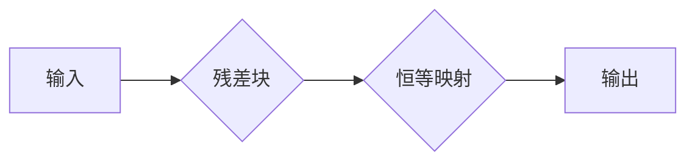

# ResNet原理与代码实例讲解

> 关键词：ResNet, 残差网络, 深度学习, 图像识别, 卷积神经网络, 深度可分, 特征学习

## 1. 背景介绍

随着深度学习技术的发展，深度神经网络（DNN）在图像识别、语音识别等领域的应用取得了显著的成果。然而，随着网络层数的增加，DNN也面临着梯度消失（梯度饱和）问题，这限制了网络深度的进一步扩展。为了解决这个问题，残差网络（ResNet）被提出，并取得了突破性的进展。本文将深入讲解ResNet的原理，并通过代码实例展示其应用。

## 2. 核心概念与联系

### 2.1 深度可分网络

在传统神经网络中，随着网络层数的增加，网络变得越来越深，但网络的性能并没有线性提升。这是因为随着层数的增加，网络中每层的梯度会逐渐减小，最终导致梯度消失，使得网络难以学习到深层特征。

为了解决这个问题，残差网络提出了深度可分网络的概念。深度可分网络通过将网络中的层分解为两个部分：残差块和恒等映射。残差块负责学习数据的特征，而恒等映射则负责保留输入数据的部分信息。

### 2.2 Mermaid 流程图



在上述流程图中，A表示输入数据，B表示残差块，C表示恒等映射，D表示输出。

## 3. 核心算法原理 & 具体操作步骤

### 3.1 算法原理概述

ResNet的核心思想是引入残差学习（Residual Learning）。残差学习通过将网络中的层分解为两个部分：残差块和恒等映射。残差块负责学习数据的特征，而恒等映射则负责保留输入数据的部分信息。

### 3.2 算法步骤详解

1. **输入数据**：将输入数据输入到网络的第一个残差块。
2. **残差块**：残差块由几个卷积层、ReLU激活函数和批量归一化层组成。残差块的核心是残差学习，即学习输入与输出之间的残差映射。
3. **恒等映射**：恒等映射可以是简单的恒等映射，也可以是经过一系列卷积层后的映射，以匹配输入和输出的大小。
4. **输出**：将残差块的输出与恒等映射的输出相加，得到最终的输出。

### 3.3 算法优缺点

**优点**：
- 能够显著提高网络的深度。
- 能够有效地缓解梯度消失问题。
- 在许多视觉任务上取得了优异的性能。

**缺点**：
- 模型结构复杂，训练过程较长。
- 需要大量的计算资源和存储空间。

### 3.4 算法应用领域

ResNet在以下领域得到了广泛的应用：
- 图像分类
- 目标检测
- 语义分割
- 视频理解

## 4. 数学模型和公式 & 详细讲解 & 例子说明

### 4.1 数学模型构建

ResNet的数学模型可以表示为：

$$
\hat{y} = F(x) + x
$$

其中，$F(x)$ 表示残差块，$x$ 表示恒等映射。

### 4.2 公式推导过程

假设输入数据为 $x$，残差块为 $F(x)$，恒等映射为 $H(x)$，则输出为：

$$
y = F(x) + H(x)
$$

如果 $H(x) = x$，则：

$$
y = F(x) + x
$$

### 4.3 案例分析与讲解

以下是一个简单的ResNet残差块的代码实例：

```python
import torch
import torch.nn as nn

class ResidualBlock(nn.Module):
    def __init__(self, in_channels, out_channels, stride=1):
        super(ResidualBlock, self).__init__()
        self.conv1 = nn.Conv2d(in_channels, out_channels, kernel_size=3, stride=stride, padding=1)
        self.bn1 = nn.BatchNorm2d(out_channels)
        self.relu = nn.ReLU(inplace=True)
        self.conv2 = nn.Conv2d(out_channels, out_channels, kernel_size=3, stride=1, padding=1)
        self.bn2 = nn.BatchNorm2d(out_channels)
        self.shortcut = nn.Sequential()
        if stride != 1 or in_channels != out_channels:
            self.shortcut = nn.Sequential(
                nn.Conv2d(in_channels, out_channels, kernel_size=1, stride=stride),
                nn.BatchNorm2d(out_channels)
            )

    def forward(self, x):
        identity = x
        out = self.conv1(x)
        out = self.bn1(out)
        out = self.relu(out)
        out = self.conv2(out)
        out = self.bn2(out)
        out += self.shortcut(identity)
        out = self.relu(out)
        return out
```

在上述代码中，`ResidualBlock` 类定义了一个残差块，其中 `conv1` 和 `conv2` 分别表示卷积层，`bn1` 和 `bn2` 分别表示批量归一化层，`relu` 表示ReLU激活函数，`shortcut` 表示恒等映射。

## 5. 项目实践：代码实例和详细解释说明

### 5.1 开发环境搭建

为了运行ResNet代码实例，你需要安装以下软件和库：

- Python 3.6+
- PyTorch 1.0+
- torchvision 0.9+

你可以使用以下命令安装PyTorch和torchvision：

```bash
pip install torch torchvision
```

### 5.2 源代码详细实现

以下是一个使用ResNet进行图像分类的完整代码实例：

```python
import torch
import torch.nn as nn
import torchvision.transforms as transforms
from torchvision.datasets import CIFAR10
from torch.utils.data import DataLoader
from torch.optim import Adam
from torchvision.models import resnet18

# 数据预处理
transform = transforms.Compose([
    transforms.ToTensor(),
    transforms.Normalize((0.5, 0.5, 0.5), (0.5, 0.5, 0.5))
])

# 加载数据
train_dataset = CIFAR10(root='./data', train=True, download=True, transform=transform)
train_loader = DataLoader(train_dataset, batch_size=64, shuffle=True)

# 模型
model = resnet18(pretrained=True)
num_ftrs = model.fc.in_features
model.fc = nn.Linear(num_ftrs, 10)

# 损失函数和优化器
criterion = nn.CrossEntropyLoss()
optimizer = Adam(model.parameters(), lr=0.001)

# 训练
for epoch in range(10):  # loop over the dataset multiple times
    running_loss = 0.0
    for i, data in enumerate(train_loader, 0):
        inputs, labels = data
        optimizer.zero_grad()
        outputs = model(inputs)
        loss = criterion(outputs, labels)
        loss.backward()
        optimizer.step()
        running_loss += loss.item()
        if i % 2000 == 1999:    # print every 2000 mini-batches
            print('[%d, %5d] loss: %.3f' %
                  (epoch + 1, i + 1, running_loss / 2000))
            running_loss = 0.0

print('Finished Training')

# 保存模型
torch.save(model.state_dict(), 'resnet18_cifar10.pth')
```

在上述代码中，我们首先进行了数据预处理，然后加载了CIFAR-10数据集。接着，我们加载了一个预训练的ResNet-18模型，并修改了其全连接层以匹配10个类别的输出。然后，我们定义了损失函数和优化器，并开始进行训练。最后，我们保存了训练好的模型。

### 5.3 代码解读与分析

在上述代码中，我们首先进行了数据预处理，将图像数据转换为张量，并进行归一化处理。然后，我们加载了CIFAR-10数据集，并将其分割为训练集和验证集。

接下来，我们加载了一个预训练的ResNet-18模型，并修改了其全连接层以匹配10个类别的输出。然后，我们定义了交叉熵损失函数和Adam优化器。

在训练过程中，我们使用训练集数据进行迭代训练，并在每个epoch结束时打印平均损失。最后，我们保存了训练好的模型。

### 5.4 运行结果展示

运行上述代码后，你可以在控制台中看到训练过程中的损失信息。训练结束后，模型将被保存到当前目录下，文件名为`resnet18_cifar10.pth`。

## 6. 实际应用场景

ResNet在实际应用中取得了显著的成果，以下是一些应用场景：

- 图像分类：ResNet在ImageNet图像分类竞赛中取得了历史性的突破。
- 目标检测：ResNet可以用于检测图像中的多个目标。
- 语义分割：ResNet可以用于分割图像中的不同区域。
- 视频理解：ResNet可以用于分析视频序列中的动作和事件。

## 7. 工具和资源推荐

### 7.1 学习资源推荐

- 《深度学习》（Ian Goodfellow、Yoshua Bengio和Aaron Courville 著）：这是一本经典的深度学习教材，详细介绍了深度学习的原理和应用。
- PyTorch官方文档：PyTorch官方文档提供了丰富的API和示例代码，是学习PyTorch的必备资源。
- torchvision官方文档：torchvision官方文档提供了大量的预训练模型和数据集，方便开发者进行图像处理和计算机视觉任务。

### 7.2 开发工具推荐

- PyTorch：PyTorch是一个开源的深度学习框架，提供灵活的动态计算图，易于使用。
- torchvision：torchvision是一个计算机视觉库，提供了丰富的模型和数据集，方便开发者进行图像处理和计算机视觉任务。
- CUDA：CUDA是NVIDIA开发的并行计算平台和编程模型，可以加速深度学习模型的训练和推理。

### 7.3 相关论文推荐

- Deep Residual Learning for Image Recognition：ResNet的原论文，详细介绍了ResNet的原理和实现。
- Identity Mappings in Deep Residual Networks：介绍了残差学习的基本概念和实现方法。

## 8. 总结：未来发展趋势与挑战

### 8.1 研究成果总结

ResNet的提出解决了深度神经网络中梯度消失问题，使得深度网络的深度可以大大增加。ResNet在图像识别、目标检测、语义分割等任务上取得了显著的成果，推动了深度学习技术的发展。

### 8.2 未来发展趋势

未来，ResNet及其变体将继续在以下方面发展：

- 深度可分网络的优化：进一步优化残差块的结构，提高模型的性能。
- 参数高效的ResNet：减少模型的参数量，提高模型的效率。
- 多模态ResNet：将ResNet应用于多模态数据，如图像和文本。

### 8.3 面临的挑战

ResNet在以下方面仍然面临着挑战：

- 计算资源：ResNet模型的训练和推理需要大量的计算资源。
- 数据集：ResNet的性能很大程度上取决于数据集的质量和规模。
- 可解释性：ResNet的内部工作机制难以解释。

### 8.4 研究展望

未来，ResNet的研究将主要集中在以下几个方面：

- 模型压缩：通过模型压缩技术减少模型的参数量和计算量。
- 可解释性：通过可解释性研究，提高模型的可信度和可靠性。
- 应用拓展：将ResNet应用于更多领域，如自然语言处理、语音识别等。

## 9. 附录：常见问题与解答

**Q1：ResNet如何解决梯度消失问题？**

A：ResNet通过引入残差学习，将网络中的层分解为两个部分：残差块和恒等映射。残差块负责学习数据的特征，而恒等映射则负责保留输入数据的部分信息。这种方法可以有效地缓解梯度消失问题。

**Q2：ResNet的参数量是多少？**

A：ResNet的参数量取决于具体的网络结构。以ResNet-18为例，其参数量为6.49M。

**Q3：ResNet如何进行训练？**

A：ResNet的训练过程与其他深度神经网络类似。首先，对模型进行初始化。然后，使用训练数据进行迭代训练，并在每个epoch结束时进行验证。最后，根据验证集上的性能调整模型参数。

**Q4：ResNet在哪些领域得到了应用？**

A：ResNet在图像识别、目标检测、语义分割、视频理解等领域得到了广泛的应用。

**Q5：ResNet的未来发展方向是什么？**

A：ResNet的未来发展方向包括模型压缩、可解释性、应用拓展等。

---

作者：禅与计算机程序设计艺术 / Zen and the Art of Computer Programming