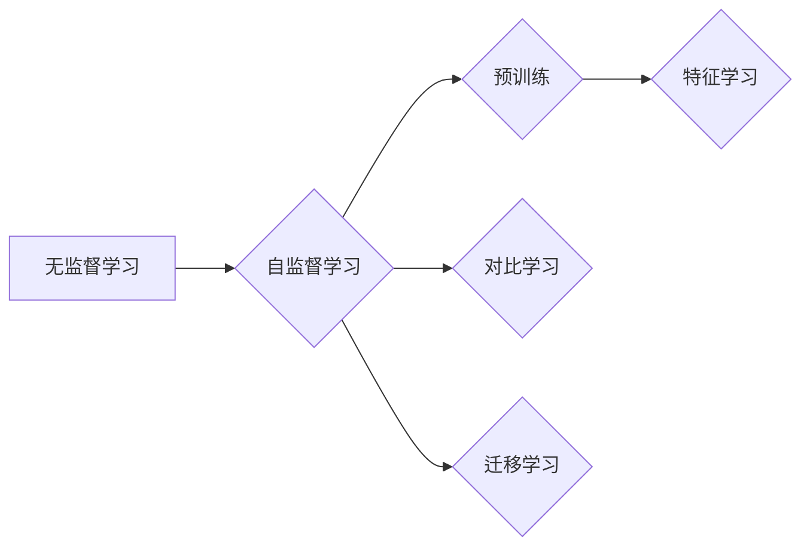

# Self-Supervised Learning原理与代码实例讲解

> 关键词：自监督学习，无监督学习，预训练，特征学习，对比学习，迁移学习，BERT，视觉识别，语言理解

## 1. 背景介绍

自监督学习（Self-Supervised Learning）是一种无监督学习技术，它通过设计特定的任务来利用无标签数据进行学习。与传统的无监督学习方法不同，自监督学习不依赖于标签信息，而是通过构建监督信号来指导学习过程。近年来，随着深度学习技术的快速发展，自监督学习在图像识别、自然语言处理等领域取得了显著成果，成为了机器学习领域的一个重要研究方向。

### 1.1 问题的由来

在传统的机器学习任务中，标注数据的获取往往成本高昂且耗时，限制了模型在实际应用中的推广。自监督学习通过设计无需人工标注的任务，使得模型能够在大量无标签数据上进行训练，从而降低了对标注数据的依赖，提高了模型的泛化能力。

### 1.2 研究现状

自监督学习的研究始于20世纪50年代，但近年来随着深度学习技术的兴起而得到快速发展。目前，自监督学习已在图像识别、自然语言处理、语音识别等领域取得了显著成果，并涌现出了许多经典的模型和算法。

### 1.3 研究意义

自监督学习具有重要的理论意义和应用价值：

- **降低数据标注成本**：自监督学习无需大量标注数据，可以显著降低模型训练的成本。
- **提高模型泛化能力**：通过在无标签数据上进行训练，模型能够学习到更通用的特征表示，从而提高模型的泛化能力。
- **促进新领域研究**：自监督学习为探索新的研究领域提供了新的思路和方法。

### 1.4 本文结构

本文将系统介绍自监督学习的原理、算法、应用实例和未来发展趋势。文章结构如下：

- **第2章**：介绍自监督学习的核心概念与联系。
- **第3章**：详细阐述自监督学习的算法原理和具体操作步骤。
- **第4章**：介绍自监督学习的数学模型和公式，并进行案例分析。
- **第5章**：通过代码实例讲解自监督学习的应用。
- **第6章**：探讨自监督学习在实际应用场景中的应用和未来展望。
- **第7章**：推荐自监督学习的相关学习资源和开发工具。
- **第8章**：总结自监督学习的研究成果、发展趋势和挑战。
- **第9章**：提供自监督学习的常见问题解答。

## 2. 核心概念与联系

### 2.1 核心概念

- **无监督学习**：指从无标签数据中学习模式或结构的方法。
- **自监督学习**：一种无监督学习范式，通过设计特定的任务，使模型能够从无标签数据中学习到有用的信息。
- **预训练**：在特定数据集上进行训练，以学习通用的特征表示。
- **特征学习**：学习数据中潜在的有用特征的方法。
- **对比学习**：一种无监督学习技术，通过拉近相似样本之间的距离，推远不相似样本之间的距离，学习到有用的特征表示。
- **迁移学习**：将一个领域学习到的知识迁移到另一个相关领域。

### 2.2 核心概念原理和架构的 Mermaid 流程图



### 2.3 核心概念联系

自监督学习是介于无监督学习和有监督学习之间的一种学习范式。它通过设计特定的任务，使模型能够从无标签数据中学习到有用的信息。预训练是一种常用的自监督学习方法，通过在特定数据集上进行训练，学习到通用的特征表示。对比学习是一种有效的特征学习方法，通过拉近相似样本之间的距离，推远不相似样本之间的距离，学习到有用的特征表示。迁移学习则可以将预训练的知识迁移到其他领域，提高模型的泛化能力。

## 3. 核心算法原理 & 具体操作步骤

### 3.1 算法原理概述

自监督学习算法的核心思想是设计一个任务，使得模型能够从无标签数据中学习到有用的信息。该任务通常需要两个样本，一个是正样本，另一个是负样本。模型的目标是预测这两个样本之间的相似性或差异性。

### 3.2 算法步骤详解

自监督学习算法的一般步骤如下：

1. **数据预处理**：对无标签数据进行预处理，例如数据增强、归一化等。
2. **设计任务**：根据数据的特点，设计一个合适的自监督学习任务。
3. **训练模型**：使用无标签数据训练模型，使得模型能够预测样本之间的相似性或差异性。
4. **评估模型**：使用无标签数据或少量标注数据评估模型的性能。

### 3.3 算法优缺点

#### 优点

- **降低数据标注成本**：自监督学习无需大量标注数据，可以显著降低模型训练的成本。
- **提高模型泛化能力**：通过在无标签数据上进行训练，模型能够学习到更通用的特征表示，从而提高模型的泛化能力。

#### 缺点

- **学习到的特征表示可能与真实标签不相关**：自监督学习任务设计的初衷是学习通用的特征表示，因此学习到的特征表示可能与真实标签不相关。
- **模型性能可能受任务设计影响**：自监督学习任务的设计对模型的性能有重要影响，设计不当可能导致模型性能下降。

### 3.4 算法应用领域

自监督学习在图像识别、自然语言处理、语音识别等领域都有广泛的应用，以下是一些典型的应用实例：

- **图像识别**：例如，ImageNet ImageNet Challenge是一个著名的图像识别比赛，参赛者需要使用自监督学习算法在ImageNet数据集上进行训练，以提高模型的泛化能力。
- **自然语言处理**：例如，BERT模型使用自监督学习算法在大量无标签文本语料上进行预训练，从而提高了模型在自然语言处理任务中的性能。
- **语音识别**：例如，Wav2Vec 2.0模型使用自监督学习算法在大量无标签音频语料上进行预训练，从而提高了模型的语音识别性能。

## 4. 数学模型和公式 & 详细讲解 & 举例说明

### 4.1 数学模型构建

自监督学习算法的数学模型通常包括以下部分：

- **数据集**：无标签数据集 $\mathcal{D} = \{x_1, x_2, \dots, x_n\}$。
- **模型**：函数 $f: \mathcal{X} \rightarrow \mathcal{Y}$，其中 $\mathcal{X}$ 为输入空间，$\mathcal{Y}$ 为输出空间。
- **损失函数**：用于衡量模型预测结果与真实标签之间的差异。

### 4.2 公式推导过程

假设模型 $f$ 在输入 $x$ 上的预测输出为 $y = f(x)$，真实标签为 $y^*$。则损失函数可以表示为：

$$
L(f, x, y^*) = \frac{1}{2} \left( f(x) - y^* \right)^2
$$

其中，$L$ 表示损失函数，$f$ 表示模型，$x$ 表示输入，$y^*$ 表示真实标签。

### 4.3 案例分析与讲解

以下是一个简单的自监督学习算法示例，即对比学习。

#### 对比学习

对比学习是一种常用的自监督学习方法，其核心思想是拉近相似样本之间的距离，推远不相似样本之间的距离。

假设数据集 $\mathcal{D} = \{x_1, x_2, \dots, x_n\}$，其中每个样本 $x_i$ 都有一个对应的标签 $y_i$。对比学习的目标是学习一个函数 $f: \mathcal{X} \rightarrow \mathcal{Y}$，使得：

$$
\left| f(x_i) - f(x_j) \right| > \delta
$$

其中，$x_i$ 和 $x_j$ 是相似样本，$\delta$ 是一个小的正数。

### 5. 项目实践：代码实例和详细解释说明

### 5.1 开发环境搭建

在进行自监督学习实践之前，我们需要搭建一个合适的开发环境。以下是使用Python进行自监督学习项目的基本步骤：

1. 安装Python环境：下载并安装Python，建议使用Anaconda进行环境管理。
2. 安装深度学习框架：安装PyTorch或TensorFlow等深度学习框架。
3. 安装其他库：安装NumPy、Pandas、Scikit-learn等常用库。

### 5.2 源代码详细实现

以下是一个使用PyTorch实现对比学习的简单代码示例：

```python
import torch
import torch.nn as nn
import torch.optim as optim
from torch.utils.data import DataLoader
from torchvision import datasets, transforms

# 定义对比学习模型
class ContrastiveLearningModel(nn.Module):
    def __init__(self):
        super(ContrastiveLearningModel, self).__init__()
        self.encoder = nn.Sequential(
            nn.Conv2d(3, 64, kernel_size=3, padding=1),
            nn.ReLU(),
            nn.MaxPool2d(2),
            nn.Conv2d(64, 128, kernel_size=3, padding=1),
            nn.ReLU(),
            nn.MaxPool2d(2),
            nn.Flatten()
        )
        self.fc = nn.Linear(128, 64)

    def forward(self, x):
        x = self.encoder(x)
        x = self.fc(x)
        return x

# 加载数据集
transform = transforms.Compose([
    transforms.ToTensor(),
    transforms.Normalize((0.5, 0.5, 0.5), (0.5, 0.5, 0.5))
])
train_dataset = datasets.CIFAR10(root='./data', train=True, download=True, transform=transform)
train_loader = DataLoader(train_dataset, batch_size=32, shuffle=True)

# 初始化模型、优化器和损失函数
model = ContrastiveLearningModel().to(device)
optimizer = optim.SGD(model.parameters(), lr=0.01)
criterion = nn.CosineSimilarity()

# 训练模型
for epoch in range(10):
    for data, _ in train_loader:
        data = data.to(device)
        optimizer.zero_grad()
        z1 = model(data)
        z2 = model(torch.flip(data, [0]))  # 翻转图像
        loss = criterion(z1, z2)
        loss.backward()
        optimizer.step()
    print(f'Epoch {epoch+1}, Loss: {loss.item()}')
```

### 5.3 代码解读与分析

上述代码展示了使用PyTorch实现对比学习的基本步骤：

1. 定义对比学习模型：模型包含一个卷积神经网络和一个全连接层。
2. 加载数据集：使用CIFAR-10数据集进行训练。
3. 初始化模型、优化器和损失函数：初始化模型、优化器（SGD）和损失函数（余弦相似度）。
4. 训练模型：对数据集进行迭代，计算损失并更新模型参数。

### 5.4 运行结果展示

运行上述代码后，可以在控制台看到训练过程中的loss信息。随着训练的进行，loss值应该逐渐减小，表示模型性能逐渐提高。

## 6. 实际应用场景

### 6.1 图像识别

自监督学习在图像识别领域有广泛的应用，以下是一些典型的应用实例：

- **ImageNet ImageNet Challenge**：使用自监督学习算法在ImageNet数据集上进行训练，以提高模型的泛化能力。
- **VGGFace2**：使用自监督学习算法在VGGFace2数据集上进行训练，用于人脸识别任务。

### 6.2 自然语言处理

自监督学习在自然语言处理领域也有广泛的应用，以下是一些典型的应用实例：

- **BERT**：使用自监督学习算法在大量无标签文本语料上进行预训练，从而提高了模型在自然语言处理任务中的性能。
- **RoBERTa**：在BERT模型的基础上，进一步优化了自监督学习任务，提高了模型性能。

### 6.3 语音识别

自监督学习在语音识别领域也有一定的应用，以下是一些典型的应用实例：

- **Wav2Vec 2.0**：使用自监督学习算法在大量无标签音频语料上进行预训练，从而提高了模型的语音识别性能。

## 7. 工具和资源推荐

### 7.1 学习资源推荐

- **《Unsupervised Learning》**：这本书全面介绍了无监督学习的各种算法和理论。
- **《Deep Learning》**：这本书详细介绍了深度学习的基本原理和应用。
- **《Self-Supervised Learning with PyTorch》**：这本书介绍了如何使用PyTorch实现自监督学习。

### 7.2 开发工具推荐

- **PyTorch**：一个流行的深度学习框架。
- **TensorFlow**：另一个流行的深度学习框架。
- **Hugging Face**：一个开源的NLP工具库。

### 7.3 相关论文推荐

- **“Unsupervised Representation Learning with Deep Convolutional Generative Adversarial Networks”**：这篇论文介绍了使用自监督学习算法进行图像生成。
- **“BERT: Pre-training of Deep Bidirectional Transformers for Language Understanding”**：这篇论文介绍了BERT模型，并展示了其在自然语言处理任务中的应用。
- **“Wav2Vec 2.0: Unsupervised Pre-training for Audio-Visual Speech Recognition”**：这篇论文介绍了Wav2Vec 2.0模型，并展示了其在语音识别任务中的应用。

## 8. 总结：未来发展趋势与挑战

### 8.1 研究成果总结

自监督学习作为机器学习领域的一个重要研究方向，已经在图像识别、自然语言处理、语音识别等领域取得了显著成果。通过在无标签数据上进行训练，自监督学习降低了模型训练的成本，提高了模型的泛化能力。

### 8.2 未来发展趋势

- **多模态自监督学习**：结合多种模态数据，例如图像、文本、音频等，进行自监督学习。
- **更有效的自监督学习任务**：设计更有效的自监督学习任务，提高模型性能。
- **更轻量级自监督学习模型**：设计更轻量级的自监督学习模型，提高模型的可部署性。

### 8.3 面临的挑战

- **数据质量问题**：无标签数据可能存在噪声和偏差，需要设计有效的数据清洗和预处理方法。
- **模型性能瓶颈**：自监督学习模型的性能可能受到模型结构和训练方法的影响。
- **计算资源消耗**：自监督学习模型通常需要大量的计算资源。

### 8.4 研究展望

自监督学习在未来有望在更多领域得到应用，并推动机器学习技术的发展。通过不断探索新的方法和技术，自监督学习将为人工智能领域带来更多创新和突破。

## 9. 附录：常见问题与解答

### 9.1 常见问题

- **Q1：自监督学习与无监督学习有什么区别**？
  A1：自监督学习是一种无监督学习范式，它通过设计特定的任务来利用无标签数据进行学习。无监督学习是指从无标签数据中学习模式或结构的方法。

- **Q2：自监督学习的应用领域有哪些**？
  A2：自监督学习在图像识别、自然语言处理、语音识别等领域都有广泛的应用。

- **Q3：如何设计有效的自监督学习任务**？
  A3：设计有效的自监督学习任务需要考虑数据的特点和任务的需求。

- **Q4：如何提高自监督学习模型的性能**？
  A4：提高自监督学习模型的性能需要考虑数据质量、模型结构和训练方法。

### 9.2 解答

本文对自监督学习的原理、算法、应用实例和未来发展趋势进行了全面系统的介绍。通过学习本文，读者可以了解到自监督学习的基本概念、原理和实现方法，并能够在实际项目中应用自监督学习技术。

作者：禅与计算机程序设计艺术 / Zen and the Art of Computer Programming