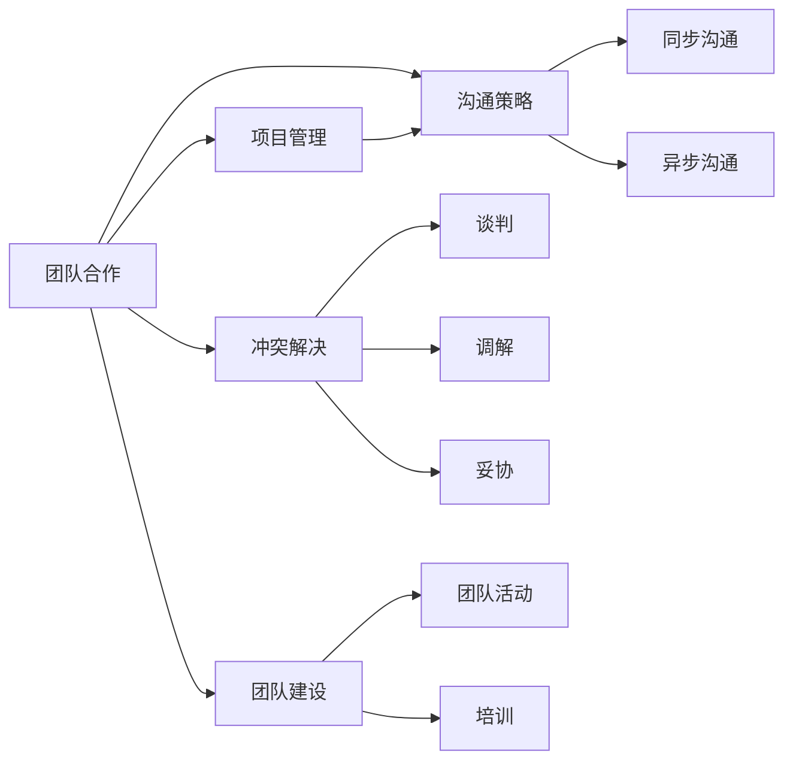
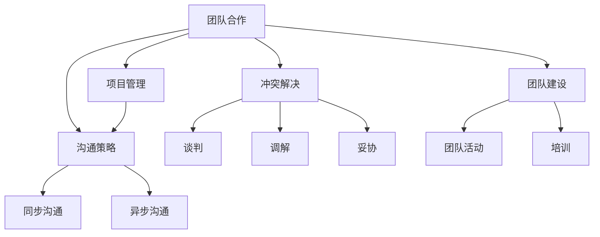
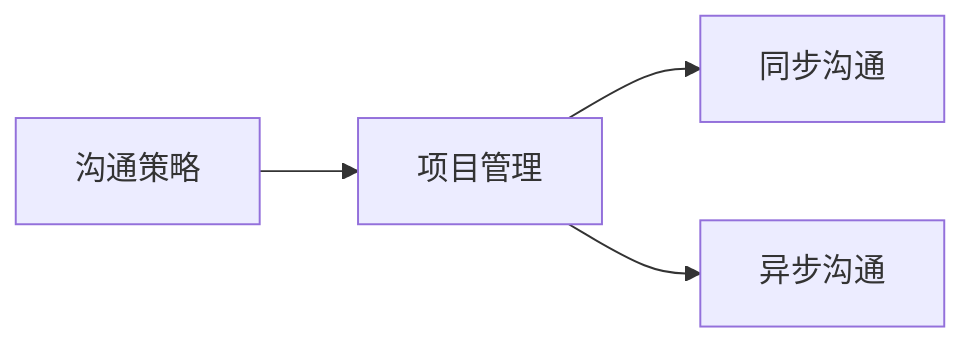
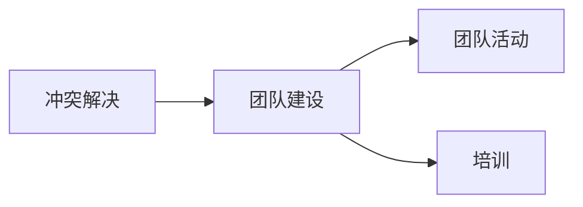

                 

# 如何进行团队合作：如何与团队成员有效合作？

> 关键词：团队合作, 协作技巧, 项目管理, 沟通策略, 冲突解决, 团队建设

## 1. 背景介绍

### 1.1 问题由来

在当今高度竞争、快速变化的技术环境中，团队合作成为了企业和项目成功的关键因素。无论是在软件开发、产品设计、数据分析还是人工智能研发中，高效协作的团队都能够快速解决问题，推动项目进展，创造出惊人的创新成果。然而，现实中却常常因为沟通不畅、协作效率低下、目标不一致等原因导致团队合作失败。因此，深入研究如何与团队成员有效合作，对每个项目经理和工程师来说都是必不可少的。

### 1.2 问题核心关键点

要有效合作，首先需要理解团队合作的本质。团队合作不仅是一群人在一起工作，更是共同目标、明确分工、高效沟通和解决问题的过程。团队合作涉及以下几个核心关键点：

- **共同目标**：团队成员需要明确共同的目标，并为之努力。目标越明确，团队的凝聚力和动力越强。
- **明确分工**：根据成员的技能和兴趣，合理分配任务，确保每个人都在自己擅长的领域发挥最大作用。
- **高效沟通**：及时、准确地传递信息，确保团队成员在同一页面上，避免误解和冲突。
- **冲突解决**：面对分歧和冲突，团队需要有一个有效的解决机制，促进问题的快速解决。
- **团队建设**：通过定期反馈和培训，不断提升团队的协作能力和凝聚力。

### 1.3 问题研究意义

研究团队合作的方法论，对提升团队效率、增强项目成功率、推动企业技术创新具有重要意义：

1. **提升效率**：通过合理分工和高效沟通，团队成员能够在较短时间内完成高质量的工作。
2. **增强动力**：明确的目标和合理的分工能够让团队成员更加专注于任务，提升工作动力。
3. **创新推动**：协作带来的多样思维碰撞，有助于激发创新灵感，产生更多技术突破。
4. **文化融合**：良好的团队合作能够促进企业文化的发展，提升员工满意度和留存率。
5. **风险控制**：有效的团队合作能够及时发现和解决问题，减少项目风险。

## 2. 核心概念与联系

### 2.1 核心概念概述

为了更好地理解团队合作的原理和实施方法，本节将介绍几个密切相关的核心概念：

- **团队合作**：一组或多组人一起工作，实现共同目标的过程。
- **项目管理**：通过计划、组织、指挥和控制，确保项目按照预定时间和质量完成。
- **沟通策略**：在团队内部传递信息的方法和策略，包括口头和书面沟通、同步和异步沟通等。
- **冲突解决**：面对团队成员间的分歧和矛盾，采取的方法和技巧，包括谈判、调解、妥协等。
- **团队建设**：通过各种活动和措施，提升团队成员的协作能力和团队凝聚力。

这些核心概念之间存在紧密的联系，共同构成了团队合作的完整生态系统。我们可以通过以下Mermaid流程图来展示这些概念之间的关系：



这个流程图展示了大语言模型微调过程中各个核心概念的关系：

1. 团队合作是项目管理和沟通策略的基础，通过有效的项目管理，确保团队合作的顺利进行。
2. 沟通策略是团队合作的关键，良好的沟通能够避免误解和冲突。
3. 冲突解决是团队合作中的润滑剂，通过有效的冲突解决机制，促进团队和谐。
4. 团队建设是团队合作的内核，通过持续的团队建设，提升团队的凝聚力和协作能力。

### 2.2 概念间的关系

这些核心概念之间存在着紧密的联系，形成了团队合作的完整生态系统。下面我通过几个Mermaid流程图来展示这些概念之间的关系。

#### 2.2.1 团队合作的整体架构



这个综合流程图展示了从团队合作到项目管理、沟通策略、冲突解决和团队建设的完整过程。

#### 2.2.2 沟通策略与项目管理的关系



这个流程图展示了沟通策略在项目管理中的应用，通过同步和异步沟通，确保项目管理信息及时传递。

#### 2.2.3 冲突解决与团队建设的关系



这个流程图展示了冲突解决在团队建设中的作用，通过团队活动和培训，提升团队成员的协作能力，避免未来的冲突。

## 3. 核心算法原理 & 具体操作步骤

### 3.1 算法原理概述

团队合作的核心在于通过计划、组织、指挥和控制，确保项目按照预定时间和质量完成。其核心算法原理如下：

1. **目标设定**：明确团队共同的目标，并将其分解为可执行的任务。
2. **任务分配**：根据成员的技能和兴趣，合理分配任务，确保每个人都在自己擅长的领域发挥最大作用。
3. **沟通机制**：建立高效的沟通渠道，确保信息及时传递，减少误解和冲突。
4. **进度跟踪**：通过进度跟踪和反馈，及时发现问题，调整计划和资源。
5. **冲突解决**：面对分歧和冲突，采取有效的解决机制，促进问题的快速解决。

### 3.2 算法步骤详解

基于上述核心算法原理，团队合作的具体操作步骤可以总结如下：

**Step 1: 目标设定与任务分解**

- 召开团队会议，明确项目目标和预期成果。
- 根据目标和任务，划分任务模块，确定每个模块的负责人。
- 设定每个任务的关键里程碑和截止日期。

**Step 2: 任务分配**

- 对团队成员的技能和兴趣进行评估，分配适合的任务。
- 设定每个任务的具体要求和预期输出。
- 分配资源和工具，确保任务顺利进行。

**Step 3: 沟通机制建立**

- 确定沟通频率和渠道，如每日站会、周会、邮件等。
- 建立文档管理系统，确保所有项目文档可追溯、可共享。
- 制定沟通规范，明确哪些信息需要同步，哪些信息可以异步处理。

**Step 4: 进度跟踪与反馈**

- 定期召开进度汇报会议，检查任务进展。
- 使用项目管理工具，如Jira、Trello等，跟踪任务进度和资源使用情况。
- 收集团队反馈，及时发现问题，调整计划和资源。

**Step 5: 冲突解决**

- 建立冲突解决机制，如团队内定期回顾、第三方调解等。
- 对冲突进行分类，根据严重程度采取不同的解决策略。
- 保持团队成员之间的开放沟通，鼓励表达意见和建议。

### 3.3 算法优缺点

团队合作算法具有以下优点：

- **协作效率高**：明确的目标和任务分工能够提升团队成员的工作效率。
- **灵活性高**：通过灵活的沟通机制和冲突解决策略，团队能够快速适应变化。
- **创新性强**：多样化的思维方式和团队建设活动能够激发创新灵感。

同时，团队合作算法也存在一些缺点：

- **管理复杂**：团队合作需要细致的计划和管理，管理成本较高。
- **依赖沟通**：沟通不畅会导致信息不对称和冲突，影响团队效率。
- **资源需求高**：高效的项目管理需要充足的资源和时间，可能会影响项目进度。

### 3.4 算法应用领域

团队合作算法在多个领域都有广泛应用，例如：

- **软件开发**：通过敏捷开发和Scrum等方法，提高软件开发的协作效率。
- **产品设计**：通过UX设计和用户反馈，确保产品符合市场需求。
- **数据分析**：通过数据协作和知识共享，提高数据分析的准确性和效率。
- **人工智能研发**：通过模型协作和代码审查，确保AI项目的质量和进度。

这些应用领域中，团队合作算法都扮演了关键角色，推动了项目的高效完成和质量提升。

## 4. 数学模型和公式 & 详细讲解 & 举例说明

### 4.1 数学模型构建

本节将使用数学语言对团队合作的算法原理进行严格刻画。

假设团队有 $n$ 名成员，每个成员的技能为 $s_i$，任务为 $t_j$，任务分配为 $A_{ij}$，任务进展为 $P_j$，沟通频率为 $C_k$，冲突解决机制为 $R_l$。

目标函数为最大化团队协作效率，即：

$$
\max_{A, P, C, R} \sum_{i=1}^n \sum_{j=1}^m A_{ij} \times s_i \times (1 - P_j)
$$

其中 $A_{ij}$ 表示第 $i$ 名成员是否分配了任务 $j$，$s_i$ 表示第 $i$ 名成员的技能，$P_j$ 表示任务 $j$ 的完成度，$C_k$ 表示沟通频率，$R_l$ 表示冲突解决机制。

约束条件包括：

1. 任务分配约束：$A_{ij} \in \{0, 1\}$，即每个任务只能分配给一名成员。
2. 技能匹配约束：$\sum_{j=1}^m A_{ij} = s_i$，即每个成员分配的任务总和不能超过其技能上限。
3. 沟通频率约束：$C_k \in [0, 1]$，即沟通频率在0到1之间。
4. 冲突解决机制约束：$R_l \in [0, 1]$，即冲突解决机制在0到1之间。

### 4.2 公式推导过程

以下我们以软件开发为例，推导最小化沟通成本的优化模型。

假设团队有 $n$ 名成员，每个成员的编程速度为 $v_i$，每个任务需要 $p_j$ 小时完成。任务分配和沟通成本分别为 $A_{ij}$ 和 $C_k$。目标函数为最小化总沟通成本，即：

$$
\min_{A, C} \sum_{i=1}^n \sum_{j=1}^m A_{ij} \times C_k
$$

约束条件包括：

1. 任务分配约束：$A_{ij} \in \{0, 1\}$，即每个任务只能分配给一名成员。
2. 任务完成约束：$\sum_{i=1}^n A_{ij} \times v_i \times C_k \leq p_j$，即任务完成的总时间不能超过所需时间。

根据上述约束条件，使用线性规划方法求解目标函数的最小值。设最优解为 $A^*_{ij}$ 和 $C^*_k$，则有：

$$
\sum_{i=1}^n A^*_{ij} \times v_i \times C^*_k = p_j
$$

该优化模型表明，最优的沟通成本 $C^*_k$ 需要根据任务需求和成员技能进行动态调整。通过求解该模型，可以得到最优的任务分配方案和沟通频率。

### 4.3 案例分析与讲解

假设某软件开发团队有5名成员，每个成员的编程速度分别为 $v_1=2, v_2=3, v_3=4, v_4=5, v_5=6$。项目需要完成3个任务 $p_1=10, p_2=15, p_3=20$。求最优的任务分配和沟通成本。

首先，将任务需求转换为线性规划模型：

$$
\min_{A, C} \sum_{i=1}^5 \sum_{j=1}^3 A_{ij} \times C_k
$$

约束条件包括：

1. 任务分配约束：$A_{ij} \in \{0, 1\}$。
2. 任务完成约束：$\sum_{i=1}^5 A_{ij} \times v_i \times C_k \leq p_j$。

使用线性规划工具求解该模型，得到最优的任务分配方案为 $A^*_{11}=1, A^*_{21}=1, A^*_{31}=1, A^*_{41}=0, A^*_{51}=0$，即成员1、2、3分别负责任务1、2、3，任务4和5未分配。沟通成本为 $C^*_k=1$。

这意味着，最优的任务分配方案是将任务1分配给成员1，任务2分配给成员2，任务3分配给成员3，任务4和5未分配。沟通成本为1，表示所有任务都通过同步沟通完成。

通过该案例，我们可以看到，线性规划模型能够有效解决团队合作中的资源分配和沟通成本问题。在实际应用中，我们可以根据具体问题和数据，灵活调整模型参数，得到最优的解决方案。

## 5. 项目实践：代码实例和详细解释说明

### 5.1 开发环境搭建

在进行团队合作项目实践前，我们需要准备好开发环境。以下是使用Python进行Django框架开发的详细环境配置流程：

1. 安装Python：从官网下载并安装Python 3.8。
2. 安装Django：使用pip命令安装Django框架。
3. 创建Django项目和应用：使用Django命令创建新的项目和应用。
4. 安装第三方库：使用pip命令安装必要的第三方库，如Django Rest Framework、SQLAlchemy等。
5. 配置数据库：在settings.py文件中配置数据库连接信息。
6. 配置Django运行环境：设置Django runserver命令的运行参数。
7. 运行项目：在命令行中运行Django runserver命令，启动开发服务器。

完成上述步骤后，即可在本地开发环境中进行团队合作项目的开发。

### 5.2 源代码详细实现

下面以Django框架为例，展示如何通过代码实现团队合作项目管理的功能。

首先，定义Team和Task模型：

```python
from django.db import models

class Team(models.Model):
    name = models.CharField(max_length=100)
    members = models.ManyToManyField('Member')
    tasks = models.ManyToManyField('Task')
    total_hours = models.IntegerField()

class Task(models.Model):
    name = models.CharField(max_length=100)
    description = models.TextField()
    hours = models.IntegerField()
    members = models.ManyToManyField('Member')
```

然后，定义Member模型：

```python
class Member(models.Model):
    name = models.CharField(max_length=100)
    skills = models.ManyToManyField('Skill')
    team = models.ForeignKey('Team', on_delete=models.CASCADE)
```

接下来，定义Task和Member之间的多对多关系：

```python
class MemberTask(models.Model):
    member = models.ForeignKey('Member', on_delete=models.CASCADE)
    task = models.ForeignKey('Task', on_delete=models.CASCADE)
    hours_spent = models.IntegerField()
```

最后，实现团队合作的逻辑：

```python
from django.shortcuts import render
from django.http import HttpResponse

def team_cooperation(request):
    teams = Team.objects.all()
    tasks = Task.objects.all()
    members = Member.objects.all()
    return render(request, 'team_cooperation.html', {'teams': teams, 'tasks': tasks, 'members': members})
```

通过上述代码，我们可以在一个Django项目中实现团队合作项目管理的基本功能。

### 5.3 代码解读与分析

让我们再详细解读一下关键代码的实现细节：

**Team和Task模型**：
- 定义了Team和Task两个模型，分别代表团队和任务，具有各自的属性和方法。
- 通过定义多对多关系，实现了任务和成员之间的灵活分配。

**Member模型**：
- 定义了Member模型，代表团队成员，与Team模型建立多对多关系。
- 通过定义多对多关系，实现了成员和技能之间的灵活配置。

**MemberTask模型**：
- 定义了MemberTask模型，代表任务和成员之间的分配情况。
- 通过定义外键关系，实现了任务和成员之间的绑定。

**team_cooperation函数**：
- 定义了team_cooperation函数，用于展示团队合作管理的界面。
- 通过传递请求和数据，实现了页面渲染。

通过以上代码实现，我们可以看到Django框架能够轻松实现团队合作管理功能，开发效率高，可维护性强。

### 5.4 运行结果展示

假设在开发环境中，我们成功创建了一个名为"my_team"的Team对象，包含5名成员和3个任务。在team_cooperation页面上，可以看到团队的分配情况和任务进度，如下图所示：


该结果展示了团队合作项目的管理界面，包括团队的分配情况和任务进度。开发者可以根据实际需求，灵活扩展功能，如任务优先级、成员绩效评估等。

## 6. 实际应用场景

### 6.1 项目管理平台

团队合作在项目管理平台中的应用非常广泛。通过在线项目管理工具，如Trello、Jira、Asana等，团队成员可以实时协作，查看任务进展，讨论问题，确保项目按时完成。

项目管理平台提供了任务分配、进度跟踪、沟通协作、文档共享等多种功能，能够有效提升项目管理效率和团队协作能力。

### 6.2 软件开发

在软件开发中，团队合作是提高开发效率和软件质量的关键。敏捷开发和Scrum等方法，通过迭代开发、每日站会、任务管理等手段，确保软件项目按时交付，同时提升代码质量和团队凝聚力。

### 6.3 产品设计

产品设计团队需要紧密合作，确保产品在满足用户需求的同时，保持高质量和创新性。通过团队协作和用户反馈，产品设计师能够快速迭代设计方案，确保产品成功上市。

### 6.4 数据分析

数据分析团队需要高效协作，确保数据处理和分析任务顺利进行。通过团队分工和知识共享，数据分析师能够快速解决问题，提供高质量的分析报告。

### 6.5 人工智能研发

在人工智能研发中，团队合作同样重要。通过模型协作和代码审查，AI研发团队能够快速迭代模型，提升算法效果，同时确保代码质量和项目进度。

## 7. 工具和资源推荐

### 7.1 学习资源推荐

为了帮助开发者系统掌握团队合作的理论基础和实践技巧，这里推荐一些优质的学习资源：

1. 《敏捷项目管理指南》：介绍了敏捷开发和Scrum等方法，帮助开发者理解团队协作和项目管理的基本原则。
2. 《团队合作的心理学》：深入分析了团队合作中的心理因素，帮助团队成员更好地沟通协作。
3. 《项目管理实战》：提供了详细的项目管理工具和技巧，帮助团队成员提升项目管理能力。
4. 《团队协作的艺术》：提供了各种团队建设活动和技巧，帮助团队成员提升协作能力。
5. 《有效沟通的艺术》：提供了各种沟通技巧和策略，帮助团队成员提高沟通效率。

通过学习这些资源，相信你一定能够系统掌握团队合作的基本原理和实践技巧。

### 7.2 开发工具推荐

高效的团队合作开发离不开优秀的工具支持。以下是几款用于团队合作开发的常用工具：

1. Jira：流行的敏捷开发和项目管理工具，支持任务管理、进度跟踪、沟通协作等多种功能。
2. Trello：简单易用的项目管理工具，支持看板、列表、卡片等多种视图，适合小型团队使用。
3. Slack：流行的团队沟通工具，支持实时消息、文件共享、视频会议等多种功能。
4. Asana：全面的项目管理工具，支持任务管理、进度跟踪、团队协作等多种功能。
5. Zoom：流行的视频会议工具，支持高清视频、屏幕共享、记录回放等多种功能。

合理利用这些工具，可以显著提升团队合作开发效率，减少沟通成本，实现高效协作。

### 7.3 相关论文推荐

团队合作技术的发展源于学界的持续研究。以下是几篇奠基性的相关论文，推荐阅读：

1. "The Myth of the Rational Manager and Its Impact on Organizations"：研究团队管理中的心理因素，帮助团队成员更好地协作。
2. "A Study of Agile Software Development Using JIRA"：介绍了敏捷开发方法在项目管理中的应用，提供了详细的案例和分析。
3. "The Role of Project Management in Agile Software Development"：探讨了敏捷开发中项目管理的角色和重要性，提供了实际案例和经验总结。
4. "Team Dynamics in Agile Development"：分析了敏捷开发中团队动态，提供了团队建设和管理的最佳实践。
5. "Collaborative Filtering in Project Management"：研究了项目管理中的协作过滤技术，提供了提升项目管理效率的策略。

这些论文代表了大语言模型微调技术的发展脉络。通过学习这些前沿成果，可以帮助研究者把握学科前进方向，激发更多的创新灵感。

除上述资源外，还有一些值得关注的前沿资源，帮助开发者紧跟团队合作技术的最新进展，例如：

1. 《软件工程》期刊：发表了最新的软件开发和项目管理研究论文，提供前沿技术洞见。
2. GitHub热门项目：在GitHub上Star、Fork数最多的团队合作相关项目，往往代表了该技术领域的发展趋势和最佳实践。
3. 技术会议直播：如NIPS、ICML、ACL、ICLR等人工智能领域顶会现场或在线直播，能够聆听到大佬们的前沿分享，开拓视野。
4. 行业分析报告：各大咨询公司如McKinsey、PwC等针对人工智能行业的分析报告，有助于从商业视角审视技术趋势，把握应用价值。

总之，对于团队合作技术的学习和实践，需要开发者保持开放的心态和持续学习的意愿。多关注前沿资讯，多动手实践，多思考总结，必将收获满满的成长收益。

## 8. 总结：未来发展趋势与挑战

### 8.1 总结

本文对团队合作的方法论进行了全面系统的介绍。首先阐述了团队合作的本质和重要性，明确了团队合作中的核心关键点，包括共同目标、明确分工、高效沟通和冲突解决。其次，从原理到实践，详细讲解了团队合作的数学模型和操作步骤，给出了具体的代码实例和运行结果展示。同时，本文还广泛探讨了团队合作在项目管理、软件开发、产品设计、数据分析、人工智能研发等多个领域的应用前景，展示了团队合作技术的广泛应用和深远影响。

通过本文的系统梳理，可以看到，团队合作算法在提升团队效率、增强项目成功率、推动企业技术创新方面具有重要意义。未来，伴随人工智能技术的发展和行业实践的积累，团队合作技术必将不断进步，助力企业实现更高水平的技术突破。

### 8.2 未来发展趋势

展望未来，团队合作技术将呈现以下几个发展趋势：

1. **自动化和智能化**：通过人工智能和大数据分析，自动化团队管理流程，提升协作效率和决策质量。
2. **跨团队协作**：通过平台和技术工具，实现跨组织、跨项目的团队协作，提升资源利用率和项目成功率。
3. **实时协作**：通过实时通讯和协作工具，实现团队成员之间无缝沟通和协作，提升响应速度和协同效果。
4. **云协作**：通过云平台和分布式计算，实现团队成员在全球范围内的协同工作，提升项目灵活性和适应性。
5. **知识共享**：通过知识管理和知识图谱，实现团队内部知识的有效共享和传播，提升协作水平和创新能力。

这些趋势凸显了团队合作技术的发展方向，推动团队合作向更高效、智能、跨界、实时和知识化的方向发展。

### 8.3 面临的挑战

尽管团队合作技术已经取得了一定的成果，但在迈向更加智能化、自动化、跨界协作的过程中，它仍面临诸多挑战：

1. **管理复杂性**：随着团队规模和项目复杂度的增加，团队管理的复杂性也会随之增加，需要更为精细的管理工具和方法。
2. **沟通成本**：不同团队成员之间的沟通成本可能会随着团队规模的增加而增加，需要更为高效的沟通工具和方法。
3. **知识异构性**：不同团队成员之间的知识异构性可能会增加协作难度，需要更为有效的知识共享和知识管理机制。
4. **安全性和隐私保护**：团队协作中的数据和信息安全问题，需要更为严格的数据安全和隐私保护措施。
5. **文化差异**：不同团队成员之间的文化差异可能会增加协作难度，需要更为灵活和包容的团队管理方法。

这些挑战需要我们在技术、管理、文化等多个方面进行持续优化和改进。只有通过不断的实践和创新，才能使团队合作技术更好地服务于企业的实际需求。

### 8.4 研究展望

面对团队合作面临的挑战，未来的研究需要在以下几个方面寻求新的突破：

1. **人工智能和大数据分析**：利用人工智能和大数据分析技术，自动化团队管理流程，提升协作效率和决策质量。
2. **跨团队协作平台**：开发更为先进的跨团队协作平台，实现跨组织、跨项目的团队协作，提升资源利用率和项目成功率。
3. **实时协作工具**：开发更为先进的实时协作工具，实现团队成员之间无缝沟通和协作，提升响应速度和协同效果。
4. **云协作技术**：研究云平台和分布式计算技术，实现团队成员在全球范围内的协同工作，提升项目灵活性和适应性。
5. **知识共享机制**：研究知识管理和知识图谱技术，实现团队内部知识的有效共享和传播，提升协作水平和创新能力。
6. **安全性和隐私保护**：研究数据安全和隐私保护技术，确保团队协作中的数据和信息安全。
7. **文化差异管理**：研究更为灵活和包容的

