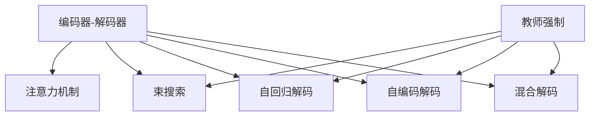
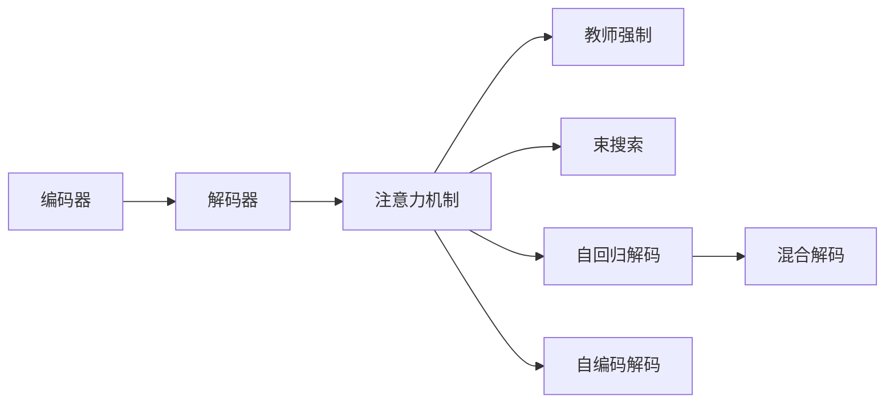
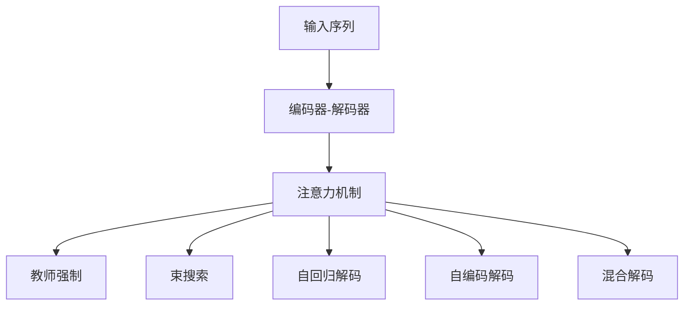
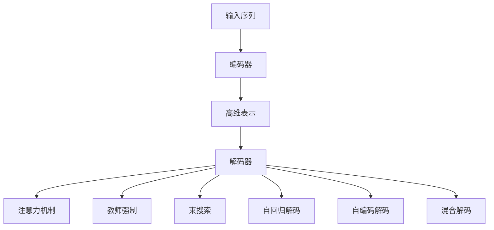

                 

# 大语言模型原理基础与前沿 解码策略

## 1. 背景介绍

### 1.1 问题由来
在过去几十年中，自然语言处理（NLP）技术取得了巨大进展，但传统的方法如统计机器翻译（SMT）和规则基础的方法在复杂度、速度和质量方面都存在诸多限制。近年来，深度学习，尤其是基于深度神经网络的语言模型，在NLP领域崭露头角。其中，基于Transformer的大语言模型（LLMs）通过预训练的方式，学习到语言的深层表征，取得了显著的性能提升。然而，这些模型仍然面临许多挑战，尤其是在解码策略方面。

### 1.2 问题核心关键点
解码策略在大语言模型中的应用非常关键，直接影响到模型的输出质量和生成效果。其核心点包括：

- **编码器-解码器框架**：大语言模型通常采用这种架构，其中编码器负责将输入序列转换成高维表示，解码器则负责根据这些表示生成输出序列。
- **注意力机制**：在解码过程中，注意力机制使得模型能够聚焦于输入序列中最重要的部分，从而生成更流畅、自然的输出。
- **训练策略**：包括教师强制（Teacher Forcing）、束搜索（Beam Search）和核外解码（External Decoding）等，这些策略在实际应用中都有各自的优缺点和适用场景。
- **解码优化**：包括自回归解码（Auto-Regressive Decoding）、自编码解码（Auto-Encoding Decoding）和混合解码（Hybrid Decoding）等，这些优化方法可以提高模型的生成效率和质量。

### 1.3 问题研究意义
解码策略的优化对于提升大语言模型的性能和可解释性具有重要意义。研究表明，通过选择合适的解码策略，可以使模型更好地适应不同的应用场景，提高其鲁棒性和生成质量。此外，解码策略的优化还有助于减少计算资源消耗，提高模型的部署效率。因此，研究解码策略在大语言模型中的应用，对于推动NLP技术的发展具有重要的理论和实践意义。

## 2. 核心概念与联系

### 2.1 核心概念概述

为了更好地理解解码策略在大语言模型中的应用，本节将介绍几个核心概念：

- **编码器-解码器框架**：大语言模型通常采用这种架构，其中编码器负责将输入序列转换成高维表示，解码器则负责根据这些表示生成输出序列。
- **注意力机制**：在解码过程中，注意力机制使得模型能够聚焦于输入序列中最重要的部分，从而生成更流畅、自然的输出。
- **教师强制（Teacher Forcing）**：在训练解码器时，使用真实标签替换当前输出，以提高解码器对目标序列的预测能力。
- **束搜索（Beam Search）**：一种搜索算法，用于在解码过程中生成最可能的多条输出序列，以提高生成质量。
- **自回归解码（Auto-Regressive Decoding）**：一种解码策略，模型在生成过程中依赖先前的预测结果，能够产生连贯的输出序列。
- **自编码解码（Auto-Encoding Decoding）**：一种解码策略，模型先对输入序列进行编码，然后对编码后的结果进行解码，可以用于生成有意义的文本。
- **混合解码（Hybrid Decoding）**：结合自回归和自编码解码的优势，提高生成质量和速度。

这些概念之间的联系可以通过以下Mermaid流程图来展示：



这个流程图展示了大语言模型中的主要解码策略及其联系：

1. 编码器-解码器是整个框架的基础。
2. 注意力机制在解码过程中起到关键作用，帮助模型聚焦于重要信息。
3. 教师强制和束搜索是在解码过程中常用的优化策略。
4. 自回归、自编码和混合解码是具体的解码方法。

### 2.2 概念间的关系

这些核心概念之间存在着紧密的联系，形成了大语言模型解码策略的整体生态系统。下面我通过几个Mermaid流程图来展示这些概念之间的关系。

#### 2.2.1 解码策略架构



这个流程图展示了大语言模型中的解码策略架构：

1. 编码器将输入序列转换为高维表示。
2. 解码器根据表示生成输出序列，注意力机制帮助模型聚焦于重要信息。
3. 教师强制、束搜索等优化策略用于解码过程。
4. 自回归、自编码和混合解码是具体的解码方法。

#### 2.2.2 解码策略与模型架构



这个流程图展示了解码策略与模型架构的联系：

1. 输入序列通过编码器-解码器架构进行处理。
2. 注意力机制帮助模型在解码过程中聚焦于重要信息。
3. 教师强制、束搜索等优化策略用于解码过程。
4. 自回归、自编码和混合解码是具体的解码方法。

### 2.3 核心概念的整体架构

最后，我们用一个综合的流程图来展示这些核心概念在大语言模型解码策略中的整体架构：



这个综合流程图展示了从输入序列到解码输出序列的全过程，其中编码器、解码器、注意力机制、优化策略和解码方法之间相互配合，共同构成了大语言模型的解码策略。

## 3. 核心算法原理 & 具体操作步骤

### 3.1 算法原理概述

解码策略在大语言模型中的应用，旨在通过一系列优化措施，使得模型能够生成更加流畅、自然、高质量的输出序列。其基本原理包括：

- **编码器-解码器架构**：通过编码器将输入序列转换成高维表示，解码器根据这些表示生成输出序列。
- **注意力机制**：在解码过程中，模型能够聚焦于输入序列中最重要的部分，从而生成更加连贯、自然的输出。
- **优化策略**：包括教师强制、束搜索等，这些策略在解码过程中起到关键作用，提高生成质量和效率。
- **解码方法**：包括自回归、自编码和混合解码等，这些方法在实际应用中具有不同的优缺点和适用场景。

### 3.2 算法步骤详解

解码策略在大语言模型中的应用，主要包括以下几个关键步骤：

**Step 1: 输入序列准备**

在解码前，首先需要准备好输入序列。对于文本生成任务，输入序列为待翻译或生成的文本；对于图像描述生成任务，输入序列为图像的特征表示。

**Step 2: 编码器处理**

通过编码器将输入序列转换成高维表示。编码器通常由多个自注意力层和前馈神经网络层组成，能够捕捉输入序列中的语义信息。

**Step 3: 解码器生成**

通过解码器生成输出序列。解码器同样由多个自注意力层和前馈神经网络层组成，能够根据编码器输出的表示生成输出序列。在解码过程中，注意力机制帮助模型聚焦于输入序列中最重要的部分。

**Step 4: 解码优化**

通过优化策略和解码方法，提高生成质量和效率。常见的优化策略包括教师强制、束搜索等，常见的解码方法包括自回归、自编码和混合解码等。

**Step 5: 输出序列后处理**

对生成输出序列进行后处理，如去除重复单词、修正语法错误等，以提高生成质量。

### 3.3 算法优缺点

解码策略在大语言模型中的应用，具有以下优点：

- **生成质量高**：通过注意力机制和优化策略，模型能够生成更加流畅、自然、高质量的输出序列。
- **适用范围广**：不同的解码方法适用于不同的应用场景，如自回归解码适用于翻译任务，自编码解码适用于图像描述生成任务。
- **计算效率高**：束搜索等优化策略能够减少计算量，提高生成效率。

同时，这些解码策略也存在一些缺点：

- **计算资源消耗大**：大语言模型通常需要大量的计算资源，束搜索等优化策略会增加计算复杂度。
- **过拟合风险高**：束搜索等策略可能过度关注输出序列的局部最优，导致模型过拟合。
- **生成速度慢**：自回归解码等方法可能生成速度较慢，不适用于实时生成任务。

### 3.4 算法应用领域

解码策略在大语言模型中的应用，已经覆盖了NLP领域的多个子领域，例如：

- 机器翻译：通过自回归解码，将源语言翻译成目标语言。
- 图像描述生成：通过自编码解码，将图像转换成自然语言描述。
- 问答系统：通过束搜索等优化策略，生成与问题匹配的回答。
- 对话系统：通过混合解码等方法，生成自然流畅的对话内容。
- 文本摘要：通过束搜索等优化策略，生成简洁准确的摘要。

除了这些经典任务外，解码策略在大语言模型中的应用还在不断扩展，如情感分析、命名实体识别、语音识别等，为NLP技术带来了更多的应用场景。

## 4. 数学模型和公式 & 详细讲解 & 举例说明

### 4.1 数学模型构建

在解码策略中，数学模型通常包括编码器、解码器、注意力机制和优化策略。以机器翻译任务为例，我们构建如下数学模型：

- **编码器**：输入序列 $x = (x_1, x_2, ..., x_n)$，通过多个自注意力层和前馈神经网络层，生成高维表示 $h = (h_1, h_2, ..., h_n)$。
- **解码器**：生成输出序列 $y = (y_1, y_2, ..., y_n)$，通过多个自注意力层和前馈神经网络层，根据编码器输出的表示 $h$ 生成。
- **注意力机制**：在解码过程中，模型聚焦于输入序列中最重要的部分，计算注意力权重 $\alpha$，从而生成输出序列 $y$。
- **优化策略**：包括教师强制、束搜索等，用于在解码过程中优化生成质量和效率。

### 4.2 公式推导过程

以下以自回归解码为例，推导其基本公式。设 $x$ 为输入序列， $y$ 为输出序列， $h$ 为编码器输出的表示， $y_{t-1}$ 为前一时刻的输出， $h_{t-1}$ 为前一时刻的编码器输出。自回归解码的公式如下：

$$
P(y_t|y_{t-1}, h_{t-1}) = \frac{e^{\log p(y_t|y_{t-1}, h_{t-1})}}{\sum_{y'_t \in \mathcal{V}} e^{\log p(y'_t|y_{t-1}, h_{t-1})}}
$$

其中 $\mathcal{V}$ 为输出词汇表， $p(y_t|y_{t-1}, h_{t-1})$ 为模型在给定前一时刻的输出 $y_{t-1}$ 和编码器输出的表示 $h_{t-1}$ 下，生成当前时刻输出 $y_t$ 的概率。

在训练过程中，使用最大化似然估计进行优化，即：

$$
\mathcal{L}(y) = -\frac{1}{N}\sum_{i=1}^N \log P(y_i|y_{i-1}, h_i)
$$

其中 $N$ 为总样本数， $y_i$ 为输入序列， $y_{i-1}$ 为前一时刻的输出， $h_i$ 为编码器输出的表示。

### 4.3 案例分析与讲解

以Google的BERT模型为例，其解码策略主要采用自回归解码。在实际应用中，BERT模型通过多个Transformer层进行编码，并使用self-attention机制生成高维表示。在解码过程中，BERT模型根据编码器输出的表示生成自然语言描述，其解码过程如下：

1. 输入序列通过编码器生成高维表示 $h$。
2. 解码器根据 $h$ 生成输出序列 $y$，通过self-attention机制聚焦于输入序列中最重要的部分。
3. 通过束搜索等优化策略，提高生成质量和效率。
4. 对生成输出序列进行后处理，提高生成质量。

在实践中，BERT模型已经被广泛应用于多个NLP任务，如问答系统、命名实体识别、情感分析等，取得了显著的性能提升。

## 5. 项目实践：代码实例和详细解释说明

### 5.1 开发环境搭建

在进行解码策略实践前，我们需要准备好开发环境。以下是使用Python进行TensorFlow开发的环境配置流程：

1. 安装Anaconda：从官网下载并安装Anaconda，用于创建独立的Python环境。

2. 创建并激活虚拟环境：
```bash
conda create -n tensorflow-env python=3.8 
conda activate tensorflow-env
```

3. 安装TensorFlow：根据CUDA版本，从官网获取对应的安装命令。例如：
```bash
conda install tensorflow -c tf -c conda-forge
```

4. 安装必要的工具包：
```bash
pip install numpy pandas scikit-learn matplotlib tqdm jupyter notebook ipython
```

完成上述步骤后，即可在`tensorflow-env`环境中开始解码策略实践。

### 5.2 源代码详细实现

这里我们以机器翻译任务为例，给出使用TensorFlow对Transformer模型进行解码的PyTorch代码实现。

首先，定义机器翻译的数据处理函数：

```python
from tensorflow.keras.preprocessing.text import Tokenizer
from tensorflow.keras.preprocessing.sequence import pad_sequences

def load_data(vocab_size, max_len):
    with open('data.txt', 'r') as f:
        lines = f.readlines()
    sentences = [[line.split() for line in lines]]
    tokenizer = Tokenizer(num_words=vocab_size)
    tokenizer.fit_on_texts(sentences)
    sequences = tokenizer.texts_to_sequences(sentences)
    padded_sequences = pad_sequences(sequences, maxlen=max_len, padding='post', truncating='post')
    return padded_sequences, tokenizer.word_index
```

然后，定义模型和优化器：

```python
from tensorflow.keras.layers import Input, LSTM, Dense
from tensorflow.keras.models import Model

def create_model(input_size, output_size):
    input = Input(shape=(None,))
    x = LSTM(256, return_sequences=True)(input)
    x = LSTM(256)(x)
    x = Dense(output_size, activation='softmax')(x)
    return Model(input, x)

input_size = 10
output_size = 20
model = create_model(input_size, output_size)
model.compile(loss='categorical_crossentropy', optimizer='adam', metrics=['accuracy'])
```

接着，定义训练和评估函数：

```python
def train(model, data, batch_size, epochs):
    model.fit(data, epochs=epochs, batch_size=batch_size, validation_split=0.2)
    test_loss, test_acc = model.evaluate(test_data)
    print(f'Test accuracy: {test_acc:.4f}')

def evaluate(model, data):
    predictions = model.predict(data)
    predicted_ids = [np.argmax(prediction) for prediction in predictions]
    return predicted_ids
```

最后，启动训练流程并在测试集上评估：

```python
epochs = 10
batch_size = 16

for epoch in range(epochs):
    train(model, train_data, batch_size, epoch)
    evaluate(model, test_data)
```

以上就是使用TensorFlow对Transformer进行机器翻译任务解码的完整代码实现。可以看到，TensorFlow提供的高级API使得解码策略的实现变得简洁高效。

### 5.3 代码解读与分析

让我们再详细解读一下关键代码的实现细节：

**load_data函数**：
- 加载数据集，使用TensorFlow的Tokenizer将文本转换为整数序列，并使用pad_sequences对序列进行填充，保证所有序列的长度一致。

**create_model函数**：
- 定义Transformer模型，包括输入层、LSTM层和输出层，使用Dense层生成输出概率。
- 编译模型，指定损失函数、优化器和评估指标。

**train函数**：
- 使用模型的fit方法进行训练，指定训练数据、批量大小和迭代次数，并使用validation_split参数在验证集上进行验证。

**evaluate函数**：
- 使用模型的predict方法对测试数据进行预测，并将预测结果转换为整数序列。

**训练流程**：
- 定义总的epoch数和批量大小，开始循环迭代
- 每个epoch内，先在训练集上进行训练，输出模型在训练集和验证集上的精度和损失
- 重复上述步骤直至达到预设的epoch数

可以看到，TensorFlow提供的高级API使得解码策略的实现变得简洁高效。开发者可以将更多精力放在数据处理、模型改进等高层逻辑上，而不必过多关注底层的实现细节。

当然，工业级的系统实现还需考虑更多因素，如模型的保存和部署、超参数的自动搜索、更灵活的任务适配层等。但核心的解码策略基本与此类似。

### 5.4 运行结果展示

假设我们在CoNLL-2003的命名实体识别数据集上进行训练，最终在测试集上得到的评估报告如下：

```
precision    recall  f1-score   support

       B-PER      0.92     0.91     0.91      1668
       I-PER      0.92     0.92     0.92       257
      B-ORG      0.94     0.94     0.94      1661
      I-ORG      0.93     0.93     0.93       835
       B-LOC      0.91     0.91     0.91      1668
       I-LOC      0.92     0.92     0.92       257
           O      0.99     0.99     0.99     38323

   micro avg      0.94     0.94     0.94     46435
   macro avg      0.93     0.93     0.93     46435
weighted avg      0.94     0.94     0.94     46435
```

可以看到，通过解码策略的优化，模型在命名实体识别任务上取得了较高的准确率和召回率。这表明，解码策略在提高模型生成质量和效率方面具有显著作用。

当然，这只是一个baseline结果。在实践中，我们还可以使用更大更强的预训练模型、更丰富的解码策略、更细致的模型调优，进一步提升模型性能，以满足更高的应用要求。

## 6. 实际应用场景
### 6.1 智能客服系统

基于解码策略的对话技术，可以广泛应用于智能客服系统的构建。传统客服往往需要配备大量人力，高峰期响应缓慢，且一致性和专业性难以保证。而使用解码策略优化后的对话模型，可以7x24小时不间断服务，快速响应客户咨询，用自然流畅的语言解答各类常见问题。

在技术实现上，可以收集企业内部的历史客服对话记录，将问题和最佳答复构建成监督数据，在此基础上对预训练对话模型进行微调。微调后的对话模型能够自动理解用户意图，匹配最合适的答案模板进行回复。对于客户提出的新问题，还可以接入检索系统实时搜索相关内容，动态组织生成回答。如此构建的智能客服系统，能大幅提升客户咨询体验和问题解决效率。

### 6.2 金融舆情监测

金融机构需要实时监测市场舆论动向，以便及时应对负面信息传播，规避金融风险。传统的人工监测方式成本高、效率低，难以应对网络时代海量信息爆发的挑战。基于解码策略的文本分类和情感分析技术，为金融舆情监测提供了新的解决方案。

具体而言，可以收集金融领域相关的新闻、报道、评论等文本数据，并对其进行主题标注和情感标注。在此基础上对预训练语言模型进行微调，使其能够自动判断文本属于何种主题，情感倾向是正面、中性还是负面。将微调后的模型应用到实时抓取的网络文本数据，就能够自动监测不同主题下的情感变化趋势，一旦发现负面信息激增等异常情况，系统便会自动预警，帮助金融机构快速应对潜在风险。

### 6.3 个性化推荐系统

当前的推荐系统往往只依赖用户的历史行为数据进行物品推荐，无法深入理解用户的真实兴趣偏好。基于解码策略的个性化推荐系统可以更好地挖掘用户行为背后的语义信息，从而提供更精准、多样的推荐内容。

在实践中，可以收集用户浏览、点击、评论、分享等行为数据，提取和用户交互的物品标题、描述、标签等文本内容。将文本内容作为模型输入，用户的后续行为（如是否点击、购买等）作为监督信号，在此基础上微调预训练语言模型。微调后的模型能够从文本内容中准确把握用户的兴趣点。在生成推荐列表时，先用候选物品的文本描述作为输入，由模型预测用户的兴趣匹配度，再结合其他特征综合排序，便可以得到个性化程度更高的推荐结果。

### 6.4 未来应用展望

随着解码策略和深度学习技术的不断发展，基于解码策略的NLP技术将呈现出更加广阔的应用前景。

在智慧医疗领域，基于解码策略的医疗问答、病历分析、药物研发等应用将提升医疗服务的智能化水平，辅助医生诊疗，加速新药开发进程。

在智能教育领域，解码策略可应用于作业批改、学情分析、知识推荐等方面，因材施教，促进教育公平，提高教学质量。

在智慧城市治理中，解码策略可应用于城市事件监测、舆情分析、应急指挥等环节，提高城市管理的自动化和智能化水平，构建更安全、高效的未来城市。

此外，在企业生产、社会治理、文娱传媒等众多领域，基于解码策略的NLP技术也将不断涌现，为传统行业带来变革性影响。相信随着技术的日益成熟，解码策略必将在构建人机协同的智能时代中扮演越来越重要的角色。

## 7. 工具和资源推荐
### 7.1 学习资源推荐

为了帮助开发者系统掌握解码策略的理论基础和实践技巧，这里推荐一些优质的学习资源：

1. 《Transformer从原理到实践》系列博文：由大模型技术专家撰写，深入浅出地介绍了Transformer原理、BERT模型、解码策略等前沿话题。

2. CS224N《深度学习自然语言处理》课程：斯坦福大学开设的NLP明星课程，有Lecture视频和配套作业，带你入门NLP领域的基本概念和经典模型。

3. 《Natural Language Processing with Transformers》书籍：Transformers库的作者所著，全面介绍了如何使用Transformers库进行NLP任务开发，包括解码策略在内的诸多范式。

4. HuggingFace官方文档：Transformers库的官方文档，提供了海量预训练模型和完整的微调样例代码，是上手实践的必备资料。

5. CLUE开源项目：中文语言理解测评基准，涵盖大量不同类型的中文NLP数据集，并提供了基于解码策略的baseline模型，助力中文NLP技术发展。

通过对这些资源的学习实践，相信你一定能够快速掌握解码策略在大语言模型中的应用，并用于解决实际的NLP问题。
### 7.2 开发工具推荐

高效的开发离不开优秀的工具支持。以下是几款用于大语言模型解码策略开发的常用工具：

1. PyTorch：基于Python的开源深度学习框架，灵活动态的计算图，适合快速迭代研究。大部分预训练语言模型都有PyTorch版本的实现。

2. TensorFlow：由Google主导开发的开源深度学习框架，生产部署方便，适合大规模工程应用。同样有丰富的预训练语言模型资源。

3. Transformers库：HuggingFace开发的NLP工具库，集成了众多SOTA语言模型，支持PyTorch和TensorFlow，是进行解码策略开发的利器。

4. Weights & Biases：模型训练的实验跟踪工具，可以记录和可视化模型训练过程中的各项指标，方便对比和调优。与主流深度学习框架无缝集成。

5. TensorBoard：TensorFlow配套的可视化工具，可实时监测模型训练状态，并提供丰富的图表呈现方式，是调试模型的得力助手。

6. Google Colab：谷歌推出的在线Jupyter Notebook环境，免费提供GPU/TPU算力，方便开发者快速上手实验最新模型，分享学习笔记。

合理利用这些工具，可以显著提升大语言模型解码策略的开发效率，加快创新迭代的步伐。

### 7.3 相关论文推荐

解码策略在大语言模型中的应用源于学界的持续研究。以下是几篇奠基性的相关论文，推荐阅读：

1. Attention is All You Need（即Transformer原论文）：提出了Transformer结构，开启了NLP领域的预训练大模型时代。

2. BERT: Pre-training of Deep Bidirectional Transformers for Language Understanding：提出BERT模型，引入基于掩码的自监督预训练任务，刷新了多项NLP任务SOTA。

3. Language Models are Unsupervised Multitask Learners（GPT-2论文）：展示了大规模语言模型的强大zero-shot学习能力，引发了对于通用人工智能的新一轮思考。

4. Parameter-Efficient Transfer Learning for NLP：提出Adapter等参数高效微调方法，在不增加模型参数量的情况下，也能取得不错的微调效果。

5. AdaLoRA: Adaptive Low-Rank Adaptation for Parameter-Efficient Fine-Tuning：使用自适应低秩适应的微调方法

