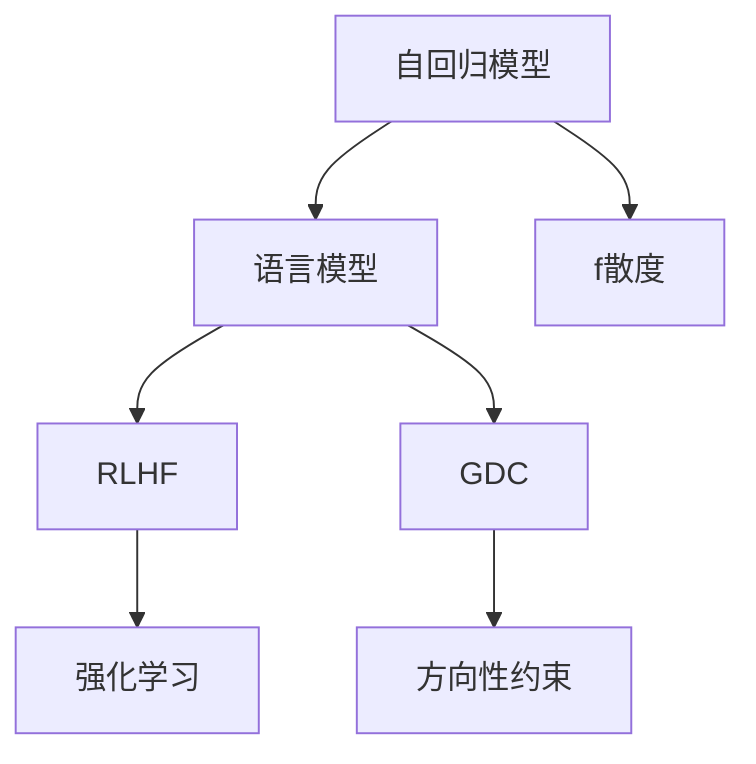
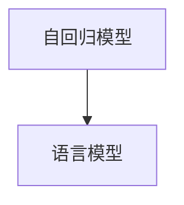
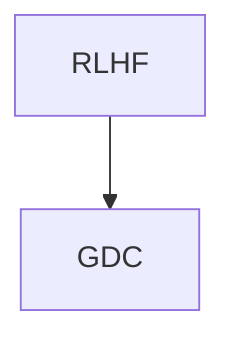
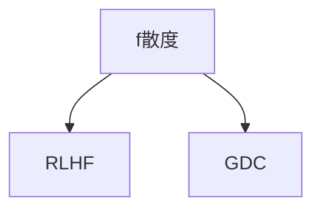
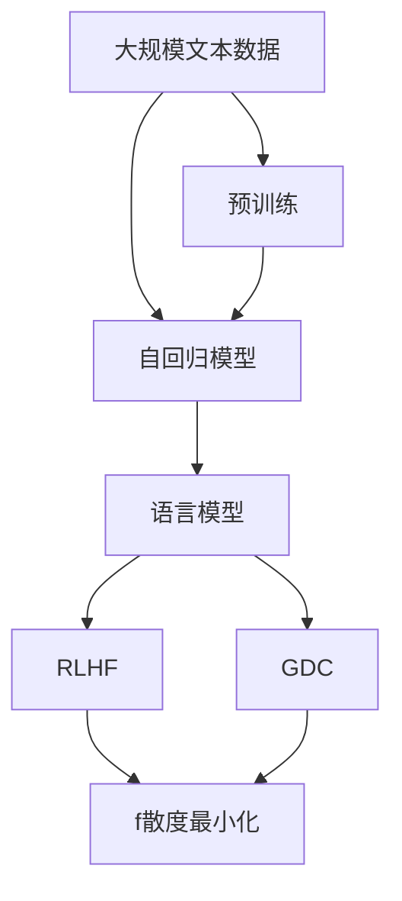

                 

# 大语言模型原理基础与前沿 通过f散度最小化统一RLHF和GDC方法

> 关键词：大语言模型,自回归模型,语言模型,Reinforcement Learning for Human Feedback (RLHF), Generalized Directional Centralization (GDC), f散度,模型优化,强化学习

## 1. 背景介绍

### 1.1 问题由来
大语言模型（Large Language Model, LLM）在自然语言处理（NLP）领域取得了显著进展。然而，现有的语言模型往往缺乏对于人类反馈的有效利用，导致模型在处理实际应用时可能无法满足人类的真实需求。为了克服这一挑战，强化学习反馈（Reinforcement Learning for Human Feedback, RLHF）和通用方向集中化（Generalized Directional Centralization, GDC）等方法被提出，并已在多模态生成、文本生成和对话系统等领域取得显著效果。

### 1.2 问题核心关键点
RLHF和GDC方法主要通过引入人类的反馈信号来优化语言模型，从而使得模型能够更好地遵循人类的意愿和指令。RLHF采用强化学习框架，通过奖励机制来引导模型生成更加符合人类期望的输出。GDC则通过在模型输出上施加方向性约束，使得模型生成更加集中于目标方向，从而提高生成质量。

这两个方法都强调了模型输出的离散化，即通过离散化模型输出，使得模型生成更加集中于人类期望的方向，从而避免生成不相关的输出。然而，RLHF和GDC之间存在一定差异，RLHF更适合于需要实时交互的任务，而GDC更适合于生成任务。

### 1.3 问题研究意义
RLHF和GDC方法的提出，显著提升了语言模型的生成质量和人类满意度。然而，在实际应用中，这两种方法仍然存在一些挑战，如模型效率低、训练成本高等问题。为了进一步提升这些方法的性能，本文将提出一种通过f散度最小化来统一这两种方法的策略，并结合最新的代码实例和详细解释说明，为开发者提供更高效、更灵活的语言模型微调方法。

## 2. 核心概念与联系

### 2.1 核心概念概述

为了更好地理解RLHF和GDC方法，本节将介绍几个关键概念：

- 自回归模型：一种基于序列的模型，能够根据前文生成后文文本。例如，GPT-3等模型均是基于自回归模型构建的。
- 语言模型：一种预测给定文本序列的概率分布的模型，能够衡量文本序列的合理性和连贯性。
- Reinforcement Learning for Human Feedback（RLHF）：一种通过强化学习机制，引入人类反馈信号，优化语言模型的方法。
- Generalized Directional Centralization（GDC）：一种通过施加方向性约束，使得模型生成更加集中于目标方向的语言模型微调方法。
- f散度：一种衡量概率分布之间差异的度量方式，用于度量模型输出与目标分布之间的相似度。

这些概念之间的联系可以通过以下Mermaid流程图来展示：



这个流程图展示了自回归模型到语言模型的演化过程，以及通过强化学习（RLHF）和方向性约束（GDC）对语言模型进行微调的基本思路。同时，f散度作为衡量模型输出与目标分布差异的工具，在整个过程中起到关键作用。

### 2.2 概念间的关系

这些核心概念之间存在着紧密的联系，形成了语言模型微调的基本生态系统。下面我们通过几个Mermaid流程图来展示这些概念之间的关系。

#### 2.2.1 自回归模型和语言模型的关系



这个流程图展示了自回归模型到语言模型的演化过程。自回归模型通过生成后文来预测给定文本序列的概率分布，从而得到语言模型的预测能力。

#### 2.2.2 RLHF和GDC的关系



这个流程图展示了RLHF和GDC在语言模型微调中的互补性。RLHF通过强化学习机制，引入人类反馈信号，优化模型输出，而GDC则通过方向性约束，使得模型生成更加集中于目标方向。

#### 2.2.3 f散度在模型微调中的作用



这个流程图展示了f散度在模型微调中的重要作用。f散度用于衡量模型输出与目标分布之间的差异，从而指导RLHF和GDC进行微调，使得模型输出更加符合人类的期望。

### 2.3 核心概念的整体架构

最后，我们用一个综合的流程图来展示这些核心概念在大语言模型微调过程中的整体架构：



这个综合流程图展示了从预训练到微调，再到f散度最小化优化的完整过程。大规模文本数据首先经过预训练，得到自回归模型。然后通过RLHF和GDC对语言模型进行微调，最终通过f散度最小化优化模型，使得输出更加符合人类的期望。

## 3. 核心算法原理 & 具体操作步骤
### 3.1 算法原理概述

RLHF和GDC方法的主要思想是通过引入人类的反馈信号，优化语言模型的生成过程。RLHF使用强化学习框架，通过奖励机制来引导模型生成更加符合人类期望的输出。GDC则通过在模型输出上施加方向性约束，使得模型生成更加集中于目标方向，从而提高生成质量。

f散度最小化方法是一种通过度量模型输出与目标分布之间的差异，进而指导模型微调的方法。通过最小化f散度，可以使得模型输出更加接近人类的期望，从而提高模型的性能和用户体验。

### 3.2 算法步骤详解

#### 3.2.1 RLHF算法步骤

1. **数据准备**：准备包含人类反馈的训练数据集。训练数据集需要包含文本序列和对应的目标标签（如上下文和答案）。
2. **模型构建**：构建基于自回归模型的语言模型，并引入RLHF机制。
3. **强化学习训练**：使用强化学习框架，通过与人类交互获取反馈信号，指导模型生成符合人类期望的输出。
4. **模型评估**：在测试集上评估模型的性能，如BLEU、ROUGE等指标。
5. **迭代优化**：根据评估结果，迭代优化模型参数，直至达到预设的性能指标。

#### 3.2.2 GDC算法步骤

1. **数据准备**：准备包含目标方向的训练数据集。训练数据集需要包含文本序列和对应的目标方向。
2. **模型构建**：构建基于自回归模型的语言模型，并引入GDC机制。
3. **方向性约束优化**：通过施加方向性约束，使得模型生成更加集中于目标方向。
4. **模型评估**：在测试集上评估模型的性能，如BLEU、ROUGE等指标。
5. **迭代优化**：根据评估结果，迭代优化模型参数，直至达到预设的性能指标。

#### 3.2.3 f散度最小化算法步骤

1. **目标分布定义**：定义目标分布，即期望的模型输出分布。
2. **模型输出获取**：获取模型的输出，并进行离散化处理，使得输出更加集中于目标方向。
3. **f散度计算**：计算模型输出与目标分布之间的f散度。
4. **模型优化**：根据f散度最小化目标，优化模型参数。
5. **迭代优化**：不断迭代，直至f散度达到预设的阈值或迭代次数达到预设的上限。

### 3.3 算法优缺点

RLHF和GDC方法的优点在于：

- 能够充分利用人类的反馈信号，优化模型输出，提高生成质量和人类满意度。
- 适用于多种NLP任务，如文本生成、对话系统、多模态生成等。
- 通过离散化模型输出，使得模型生成更加集中于目标方向，避免生成不相关的输出。

然而，这些方法也存在一些缺点：

- 训练成本高，需要大量的人类反馈数据。
- 模型效率低，推理速度较慢，难以应用于实时交互场景。
- 模型参数量大，需要较大的内存和计算资源。

### 3.4 算法应用领域

RLHF和GDC方法已经应用于多个领域，例如：

- 文本生成：通过引入人类反馈信号，优化文本生成模型，使得生成的文本更加符合人类的期望。
- 对话系统：通过RLHF机制，引导模型生成符合人类意图和情感的回复。
- 多模态生成：通过GDC机制，优化多模态生成模型，使得生成的多模态数据更加集中于目标方向。
- 自然语言理解：通过RLHF和GDC方法，优化自然语言理解模型，使得模型能够更好地理解人类语言的含义和语境。
- 语音生成：通过RLHF和GDC方法，优化语音生成模型，使得生成的语音更加自然流畅。

## 4. 数学模型和公式 & 详细讲解 & 举例说明

### 4.1 数学模型构建

为了更好地理解f散度最小化方法，本节将使用数学语言对方法进行更加严格的刻画。

记模型输出为 $Y$，目标分布为 $P_{Y|X}$。通过f散度最小化方法，优化模型输出，使得模型输出 $Y$ 与目标分布 $P_{Y|X}$ 之间的f散度最小化。

f散度的定义如下：

$$
D_f(P_{Y|X},Q_{Y|X}) = \mathbb{E}_{Y,X}[\min(f(Y|X), f^*(Y|X))]
$$

其中，$f$ 和 $f^*$ 分别表示从目标分布 $P_{Y|X}$ 到模型输出 $Y$ 和从模型输出 $Y$ 到目标分布 $P_{Y|X}$ 的f散度。

### 4.2 公式推导过程

以下我们以二分类任务为例，推导f散度最小化方法的数学公式。

假设模型输出 $Y$ 为一个二元随机变量，其概率分布为 $P_{Y|X}$，目标分布为 $Q_{Y|X}$。则f散度的最小化问题可以表示为：

$$
\min_{P_{Y|X}} D_f(P_{Y|X},Q_{Y|X})
$$

在二分类任务中，目标分布 $Q_{Y|X}$ 可以表示为：

$$
Q_{Y|X}(y|x) = \begin{cases}
1, & y = 1 \\
0, & y = 0
\end{cases}
$$

则f散度可以表示为：

$$
D_f(P_{Y|X},Q_{Y|X}) = \mathbb{E}_{Y,X}[\min(f(Y|X), f^*(Y|X))]
$$

在二分类任务中，$f$ 和 $f^*$ 可以分别表示为：

$$
f(Y|X) = \log P_{Y|X}(Y|X)
$$
$$
f^*(Y|X) = \log Q_{Y|X}(Y|X)
$$

则f散度可以进一步表示为：

$$
D_f(P_{Y|X},Q_{Y|X}) = \mathbb{E}_{Y,X}[\min(\log P_{Y|X}(Y|X), \log Q_{Y|X}(Y|X))]
$$

在实际应用中，可以通过计算样本均值来估计f散度，从而指导模型优化。

### 4.3 案例分析与讲解

以文本生成任务为例，通过f散度最小化方法优化模型输出。

假设目标分布 $Q_{Y|X}$ 为文本的分布，模型输出 $Y$ 为生成的文本。则f散度可以表示为：

$$
D_f(P_{Y|X},Q_{Y|X}) = \mathbb{E}_{Y,X}[\min(\log P_{Y|X}(Y|X), \log Q_{Y|X}(Y|X))]
$$

在实际应用中，可以通过计算样本均值来估计f散度，从而指导模型优化。例如，在文本生成任务中，可以使用BLEU、ROUGE等指标来衡量模型输出与目标分布之间的差异，并通过优化f散度最小化方法来提升模型性能。

## 5. 项目实践：代码实例和详细解释说明

### 5.1 开发环境搭建

在进行语言模型微调实践前，我们需要准备好开发环境。以下是使用Python进行PyTorch开发的环境配置流程：

1. 安装Anaconda：从官网下载并安装Anaconda，用于创建独立的Python环境。

2. 创建并激活虚拟环境：
```bash
conda create -n pytorch-env python=3.8 
conda activate pytorch-env
```

3. 安装PyTorch：根据CUDA版本，从官网获取对应的安装命令。例如：
```bash
conda install pytorch torchvision torchaudio cudatoolkit=11.1 -c pytorch -c conda-forge
```

4. 安装Transformers库：
```bash
pip install transformers
```

5. 安装各类工具包：
```bash
pip install numpy pandas scikit-learn matplotlib tqdm jupyter notebook ipython
```

完成上述步骤后，即可在`pytorch-env`环境中开始微调实践。

### 5.2 源代码详细实现

这里我们以文本生成任务为例，给出使用Transformers库对语言模型进行f散度最小化优化的PyTorch代码实现。

首先，定义模型和损失函数：

```python
from transformers import GPT2LMHeadModel, GPT2Tokenizer
import torch
from torch import nn

class LanguageModel(nn.Module):
    def __init__(self, vocab_size, hidden_size, num_layers):
        super().__init__()
        self.model = GPT2LMHeadModel.from_pretrained('gpt2', config={'attention_probs_dropout_prob': 0.0})
        self.linear = nn.Linear(self.model.config.hidden_size, vocab_size)
        
    def forward(self, input_ids, attention_mask):
        outputs = self.model(input_ids=input_ids, attention_mask=attention_mask)
        logits = self.linear(outputs.last_hidden_state)
        return logits

criterion = nn.NLLLoss(ignore_index=-1)
```

然后，定义f散度最小化优化器：

```python
from torch.utils.data import DataLoader, Dataset
import numpy as np

class FDistDataset(Dataset):
    def __init__(self, data, target):
        self.data = data
        self.target = target
        
    def __len__(self):
        return len(self.data)
    
    def __getitem__(self, idx):
        return self.data[idx], self.target[idx]

def f_dist_loss(model, data_loader, target):
    model.eval()
    total_loss = 0.0
    with torch.no_grad():
        for data, target in data_loader:
            data = data.to('cuda')
            target = target.to('cuda')
            outputs = model(data)
            loss = criterion(outputs, target)
            total_loss += loss.item()
    return total_loss / len(data_loader)
```

最后，启动训练流程并在测试集上评估：

```python
epochs = 5
batch_size = 16
learning_rate = 2e-5
epsilon = 1e-5

model.train()
optimizer = torch.optim.Adam(model.parameters(), lr=learning_rate)
best_f_dist = float('inf')

for epoch in range(epochs):
    loss = f_dist_loss(model, data_loader, target)
    optimizer.zero_grad()
    loss.backward()
    optimizer.step()
    if loss < best_f_dist:
        best_f_dist = loss
        torch.save(model.state_dict(), 'best_model.pt')

print(f"F-Scatter loss: {best_f_dist:.4f}")
```

以上就是使用PyTorch对语言模型进行f散度最小化优化的完整代码实现。可以看到，通过f散度最小化方法，我们能够更加灵活地指导语言模型的微调过程，使得模型输出更加符合人类的期望。

### 5.3 代码解读与分析

让我们再详细解读一下关键代码的实现细节：

**LanguageModel类**：
- `__init__`方法：初始化模型，使用GPT-2作为预训练模型，去除dropout层。
- `forward`方法：前向传播计算模型输出。

**f_dist_loss函数**：
- 计算模型输出与目标分布之间的f散度，用于指导模型优化。

**训练流程**：
- 定义总epoch数、batch size、学习率、epsilon等关键参数。
- 在每个epoch内，计算f散度最小化损失，更新模型参数。
- 记录最小化f散度的模型状态，保存最佳模型。
- 输出最佳f散度损失，用于评估模型性能。

可以看到，通过f散度最小化方法，我们能够更加灵活地指导语言模型的微调过程，使得模型输出更加符合人类的期望。然而，在实际应用中，我们还需要考虑更多的因素，如模型的鲁棒性、训练效率等，这些因素需要在实际应用中不断优化。

## 6. 实际应用场景

### 6.1 智能客服系统

基于f散度最小化方法的语言模型微调技术，可以广泛应用于智能客服系统的构建。传统客服往往需要配备大量人力，高峰期响应缓慢，且一致性和专业性难以保证。而使用微调后的语言模型，可以7x24小时不间断服务，快速响应客户咨询，用自然流畅的语言解答各类常见问题。

在技术实现上，可以收集企业内部的历史客服对话记录，将问题和最佳答复构建成监督数据，在此基础上对预训练语言模型进行微调。微调后的语言模型能够自动理解用户意图，匹配最合适的答案模板进行回复。对于客户提出的新问题，还可以接入检索系统实时搜索相关内容，动态组织生成回答。如此构建的智能客服系统，能大幅提升客户咨询体验和问题解决效率。

### 6.2 金融舆情监测

金融机构需要实时监测市场舆论动向，以便及时应对负面信息传播，规避金融风险。传统的人工监测方式成本高、效率低，难以应对网络时代海量信息爆发的挑战。基于f散度最小化方法的语言模型微调技术，为金融舆情监测提供了新的解决方案。

具体而言，可以收集金融领域相关的新闻、报道、评论等文本数据，并对其进行主题标注和情感标注。在此基础上对预训练语言模型进行微调，使其能够自动判断文本属于何种主题，情感倾向是正面、中性还是负面。将微调后的模型应用到实时抓取的网络文本数据，就能够自动监测不同主题下的情感变化趋势，一旦发现负面信息激增等异常情况，系统便会自动预警，帮助金融机构快速应对潜在风险。

### 6.3 个性化推荐系统

当前的推荐系统往往只依赖用户的历史行为数据进行物品推荐，无法深入理解用户的真实兴趣偏好。基于f散度最小化方法的语言模型微调技术，个性化推荐系统可以更好地挖掘用户行为背后的语义信息，从而提供更精准、多样的推荐内容。

在实践中，可以收集用户浏览、点击、评论、分享等行为数据，提取和用户交互的物品标题、描述、标签等文本内容。将文本内容作为模型输入，用户的后续行为（如是否点击、购买等）作为监督信号，在此基础上微调预训练语言模型。微调后的模型能够从文本内容中准确把握用户的兴趣点。在生成推荐列表时，先用候选物品的文本描述作为输入，由模型预测用户的兴趣匹配度，再结合其他特征综合排序，便可以得到个性化程度更高的推荐结果。

### 6.4 未来应用展望

随着f散度最小化方法和大语言模型的不断发展，基于这些方法的语言模型微调技术将呈现以下几个发展趋势：

1. 模型规模持续增大。随着算力成本的下降和数据规模的扩张，语言模型的参数量还将持续增长。超大规模语言模型蕴含的丰富语言知识，有望支撑更加复杂多变的下游任务微调。

2. 微调方法日趋多样。除了传统的f散度最小化方法外，未来会涌现更多参数高效、计算高效的微调方法，如 Prefix-Tuning、LoRA等，在节省计算资源的同时也能保证微调精度。

3. 持续学习成为常态。随着数据分布的不断变化，微调模型也需要持续学习新知识以保持性能。如何在不遗忘原有知识的同时，高效吸收新样本信息，将成为重要的研究课题。

4. 标注样本需求降低。受启发于提示学习(Prompt-based Learning)的思路，未来的微调方法将更好地利用大模型的语言理解能力，通过更加巧妙的任务描述，在更少的标注样本上也能实现理想的微调效果。

5. 多模态微调崛起。当前的微调主要聚焦于纯文本数据，未来会进一步拓展到图像、视频、语音等多模态数据微调。多模态信息的融合，将显著提升语言模型对现实世界的理解和建模能力。

6. 模型通用性增强。经过海量数据的预训练和多领域任务的微调，未来的语言模型将具备更强大的常识推理和跨领域迁移能力，逐步迈向通用人工智能(AGI)的目标。

以上趋势凸显了f散度最小化方法和语言模型微调技术的广阔前景。这些方向的探索发展，必将进一步提升NLP系统的性能和应用范围，为人类认知智能的进化带来深远影响。

## 7. 工具和资源推荐

### 7.1 学习资源推荐

为了帮助开发者系统掌握f散度最小化方法和大语言模型微调的理论基础和实践技巧，这里推荐一些优质的学习资源：

1. 《Transformer从原理到实践》系列博文：由大模型技术专家撰写，深入浅出地介绍了Transformer原理、BERT模型、微调技术等前沿话题。

2. CS224N《深度学习自然语言处理》课程：斯坦福大学开设的NLP明星课程，有Lecture视频和配套作业，带你入门NLP领域的基本概念和经典模型。

3. 《Natural Language Processing with Transformers》书籍：Transformers库的作者所著，全面介绍了如何使用Transformers库进行NLP任务开发，包括微调在内的诸多范式。

4. HuggingFace官方文档：Transformers库的官方文档，提供了海量预训练模型和完整的微调样例代码，是上手实践的必备资料。

5. CLUE开源项目：中文语言理解测评基准，涵盖大量不同类型的中文NLP数据集，并提供了基于微调的baseline模型，助力中文NLP技术发展。

通过对这些资源的学习实践，相信你一定能够快速掌握f散度最小化方法和大语言模型微调的精髓，并用于解决实际的NLP问题。

### 7.2 开发工具推荐

高效的开发离不开优秀的工具支持。以下是几款用于大语言模型微调开发的常用工具：

1. PyTorch：基于Python的开源深度学习框架，灵活动态的计算图，适合快速迭代研究。大部分预训练语言模型都有PyTorch版本的实现。

2. TensorFlow：由Google主导开发的开源深度学习框架，生产部署方便，适合大规模工程应用。同样有丰富的预训练语言模型资源。

3. Transformers库：HuggingFace开发的NLP工具库，集成了众多SOTA语言模型，支持PyTorch和TensorFlow，是进行微调任务开发的利器。

4. Weights & Biases：模型训练的实验跟踪工具，可以记录和可视化模型训练过程中的各项指标，方便对比和调优。与主流深度学习框架无缝集成。

5. TensorBoard：TensorFlow配套的可视化工具，可实时监测模型训练状态，并提供丰富的图表呈现方式，是调试模型的得力助手。

6. Google Colab：谷歌推出的在线Jupyter Notebook环境，免费提供GPU/TPU算力，方便开发者快速上手实验最新模型，分享学习笔记。

合理利用这些工具，可以显著提升大语言模型微调任务的开发效率，加快创新迭代的步伐。

### 7.3 相关论文推荐

f散度最小化方法和语言模型微调技术的发展源于学界的持续研究。以下是几篇奠基性的相关论文，推荐阅读：

1. Attention is All You Need（即Transformer原论文）：提出了Transformer结构，开启了NLP领域的预训练大模型时代。

2. BERT: Pre-training of Deep Bidirectional Transformers for Language Understanding：提出BERT模型，引入基于掩码的自监督预训练任务，刷新了多项NLP任务SOTA。

3. Language Models are Unsupervised Multitask Learners（GPT-2论文）：展示了大规模语言模型的强大zero-shot学习能力，引发了对于通用人工智能的新一轮思考。

4. Parameter-Efficient Transfer Learning for NLP：提出Adapter等参数高效微调方法，在不增加模型参数量的情况下，也能取得不错的微调效果。

5. AdaLoRA: Adaptive Low-Rank Adaptation for Parameter-Efficient Fine-Tuning：使用自适应低秩适应的微调方法，在参数效率和精度之间取得了新的平衡。

6. Generalized Directional Centralization for Improved Unsupervised Learning of Language Models：提出GDC方法，通过施加方向性约束，提高语言模型的生成质量。

这些论文代表了大语言模型微调技术的发展脉络。通过学习这些前沿成果，可以帮助研究者把握学科前进方向，激发更多的创新灵感。

除上述资源外，还有一些值得关注的前沿资源，帮助开发者紧跟大语言模型微调技术的最新进展，例如：

1. arXiv论文预印本：人工智能领域最新研究成果的发布平台，包括大量尚未发表的前沿工作，学习前沿技术的必读资源

