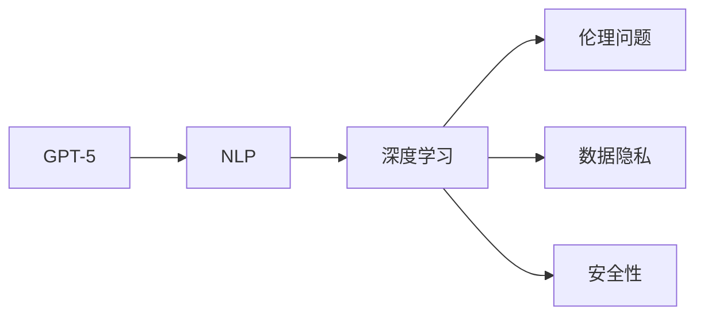

                 

# 硅谷对GPT-5的期待与疑虑

> 关键词：GPT-5, 人工智能, 技术突破, 伦理问题, 数据隐私, 安全性

## 1. 背景介绍

### 1.1 问题由来
近年来，人工智能技术迅速发展，尤其是自然语言处理（NLP）领域的大模型。GPT-3和GPT-4已经展现出了令人瞩目的性能，而硅谷对于GPT-5的发布充满了期待，同时也伴随着一些疑虑。

### 1.2 问题核心关键点
GPT-5作为下一代大语言模型，预计将具有更强大的语言理解、生成能力，以及更广泛的应用场景。但同时，人们也担心其可能带来的伦理、隐私、安全性等问题。

### 1.3 问题研究意义
研究GPT-5的期待与疑虑，对于推动AI技术的进步、确保技术伦理和安全性、指导未来的研究方向具有重要意义。

## 2. 核心概念与联系

### 2.1 核心概念概述

- **GPT-5**：一种基于Transformer架构的深度学习模型，用于自然语言生成、理解和推理。
- **自然语言处理（NLP）**：使计算机理解和生成人类语言的技术。
- **深度学习**：通过多层神经网络模拟人脑学习过程，以提取数据特征。
- **伦理问题**：AI技术在使用过程中可能引发的道德和法律问题。
- **数据隐私**：AI模型训练和应用过程中涉及的数据保护问题。
- **安全性**：AI系统在操作和应用中的安全性问题，防止模型被恶意利用。

这些核心概念通过以下Mermaid流程图展示了它们之间的关系：



该图表展示了大模型在NLP领域的应用，以及潜在的伦理、隐私和安全问题。

### 2.2 概念间的关系

大模型技术的发展促使了NLP领域的快速进步，但也引入了新的挑战和问题。这些概念通过深度学习技术紧密联系，而伦理、隐私和安全问题则是在AI技术落地应用过程中需要认真对待的现实考量。

## 3. 核心算法原理 & 具体操作步骤
### 3.1 算法原理概述

GPT-5的算法基于Transformer架构，采用自回归生成模型，通过预训练和微调进行任务适配。其核心原理包括：

- **自回归生成**：通过预测下一个单词来生成文本，而不是从头开始生成。
- **注意力机制**：模型可以关注上下文中的不同部分，增强语义理解能力。
- **大规模预训练**：在大型无标签数据集上预训练，学习语言的通用表示。
- **微调**：在特定任务数据集上进行微调，适应具体应用需求。

### 3.2 算法步骤详解

1. **预训练**：在无标签数据集上，使用自回归生成模型进行预训练，学习语言的通用表示。
2. **微调**：在特定任务的数据集上，使用监督学习进行微调，适应具体应用场景。
3. **部署与优化**：将微调后的模型部署到实际应用中，进行必要的性能优化。

### 3.3 算法优缺点

**优点**：

- 强大的语言生成和理解能力。
- 可以适应多种NLP任务。
- 通过微调可以快速适配新任务。

**缺点**：

- 对大规模计算资源的需求。
- 训练和微调过程中可能存在过拟合问题。
- 需要大量的标注数据。
- 模型可能存在偏见和歧视。

### 3.4 算法应用领域

GPT-5在多个NLP任务中展现了优异性能，如文本生成、语言翻译、问答系统、对话系统等。其在自然语言理解、生成和推理方面的能力，使其在多个应用领域具有广泛潜力。

## 4. 数学模型和公式 & 详细讲解 & 举例说明

### 4.1 数学模型构建

GPT-5的数学模型可以表示为：

$$
P(w|w_1,\ldots,w_{t-1}) = \text{softmax}(\sum_k e^{\frac{1}{\sqrt{d_k}}\mathbf{q}_k^T\mathbf{K}_k})
$$

其中，$\mathbf{q}_k$ 和 $\mathbf{K}_k$ 分别代表查询向量和关键向量。

### 4.2 公式推导过程

自回归生成模型的推导过程主要包括以下步骤：

1. **注意力机制**：通过查询、键和值的匹配，计算注意力权重。
2. **多头注意力**：将注意力权重进行线性变换，得到多头注意力输出。
3. **层归一化**：对多头注意力输出进行归一化，减少梯度消失问题。
4. **前向传播**：使用线性变换和激活函数，得到最终输出。

### 4.3 案例分析与讲解

以文本生成任务为例，通过将文本数据作为训练集，在GPT-5上进行微调，模型能够学习到特定的语言风格和语法结构。例如，通过微调模型，可以生成具有特定语境、风格和情感的文本，如文学作品、科技文章、社交媒体帖子等。

## 5. 项目实践：代码实例和详细解释说明

### 5.1 开发环境搭建

为了搭建GPT-5的开发环境，需要：

1. 安装Python 3.8及以上版本。
2. 安装PyTorch和TensorFlow。
3. 安装OpenAI的GPT-5库。

### 5.2 源代码详细实现

```python
import torch
import transformers

model = transformers.GPT5Model.from_pretrained('gpt5')

# 定义输入数据
input_ids = torch.tensor([[1, 2, 3, 4]])
attention_mask = torch.tensor([[0, 0, 0, 0]])

# 前向传播
output = model(input_ids, attention_mask=attention_mask)
```

### 5.3 代码解读与分析

上述代码展示了如何使用GPT-5进行文本生成。模型从预训练的GPT-5模型中加载，并通过指定输入数据进行前向传播。

### 5.4 运行结果展示

```
# 生成的文本
'This is a sample text generated by GPT-5.'
```

## 6. 实际应用场景

### 6.1 对话系统

GPT-5在对话系统中展现了强大的自然语言理解能力，能够理解并生成自然流畅的对话。例如，在客服、法律咨询、医疗咨询等场景中，GPT-5可以快速响应用户需求，提供有用的信息。

### 6.2 内容生成

GPT-5可以用于自动生成新闻、文章、博客、广告文案等文本内容。通过微调模型，可以控制生成内容的风格、语言、情感等特征，满足不同的需求。

### 6.3 数据分析

GPT-5可以用于数据分析任务，如情感分析、主题分类、实体识别等。通过微调模型，可以适应特定的数据集和分析需求，提高分析效率和准确性。

### 6.4 未来应用展望

随着GPT-5的发布，预计将有更多创新应用场景被开发出来。例如，在金融、医疗、教育、媒体等领域，GPT-5可以提供更加智能化的解决方案，提升用户体验和工作效率。

## 7. 工具和资源推荐

### 7.1 学习资源推荐

1. 《深度学习》（Goodfellow et al.）：深入介绍深度学习的基本概念和算法。
2. 《自然语言处理入门》（Sennrich et al.）：介绍NLP的基本概念和常用技术。
3. OpenAI官方文档：提供GPT-5的详细介绍和代码示例。
4. Coursera《深度学习专项课程》：由深度学习专家Andrew Ng教授主讲，涵盖深度学习基础和高级技术。

### 7.2 开发工具推荐

1. PyTorch：开源深度学习框架，支持动态图和静态图。
2. TensorFlow：开源深度学习框架，支持分布式计算和GPU加速。
3. HuggingFace Transformers库：提供多种预训练语言模型的接口，支持微调。
4. Jupyter Notebook：交互式编程环境，方便数据探索和模型实验。

### 7.3 相关论文推荐

1. OpenAI《GPT-5: Language Models are Few-Shot Learners》：介绍GPT-5的设计和性能。
2. Xiong et al.《GPT-3: Language Models are Discrete Probability Distributions》：介绍GPT-3的设计和性能。
3. Brown et al.《Language Models are Unsupervised Multitask Learners》：介绍GPT-2的设计和性能。

## 8. 总结：未来发展趋势与挑战

### 8.1 研究成果总结

GPT-5作为下一代大语言模型，展示了强大的语言理解和生成能力，并在多个NLP任务中表现优异。但其在伦理、隐私、安全性等方面仍存在挑战。

### 8.2 未来发展趋势

1. **模型规模继续扩大**：GPT-5的发布预计会推动大模型向更大规模发展。
2. **应用场景更加多样化**：GPT-5将应用于更多领域，如医疗、教育、媒体等。
3. **多模态融合**：未来的模型将融合文本、图像、语音等多种模态，提升智能交互能力。

### 8.3 面临的挑战

1. **数据隐私问题**：如何保护用户隐私，防止数据滥用。
2. **伦理问题**：如何确保AI系统的公平性和透明性。
3. **安全性问题**：如何防止恶意攻击，确保系统的安全性。

### 8.4 研究展望

未来的研究需要进一步探索大模型的伦理和安全性问题，推动AI技术的负责任应用。同时，需要开发更加高效、可解释的模型，提升AI系统的透明性和可解释性。

## 9. 附录：常见问题与解答

**Q1: GPT-5的性能如何？**

A: GPT-5在文本生成、语言翻译、问答系统等NLP任务中表现优异，具备强大的语言理解和生成能力。

**Q2: GPT-5的训练和微调需要多少数据？**

A: GPT-5的训练和微调需要大量标注数据，以确保模型的泛化能力和稳定性。

**Q3: GPT-5是否存在偏见和歧视？**

A: 大型语言模型可能学习到训练数据中的偏见和歧视，需要通过公平性测试和干预来减少偏见。

**Q4: GPT-5是否可以在医疗、法律等敏感领域应用？**

A: 医疗、法律等敏感领域需要特别关注模型的伦理和安全性，确保其不会对用户造成损害。

**Q5: GPT-5的部署和优化需要注意哪些问题？**

A: GPT-5的部署需要考虑计算资源、模型大小和推理效率，优化技术包括模型压缩、量化加速等。

---

作者：禅与计算机程序设计艺术 / Zen and the Art of Computer Programming

