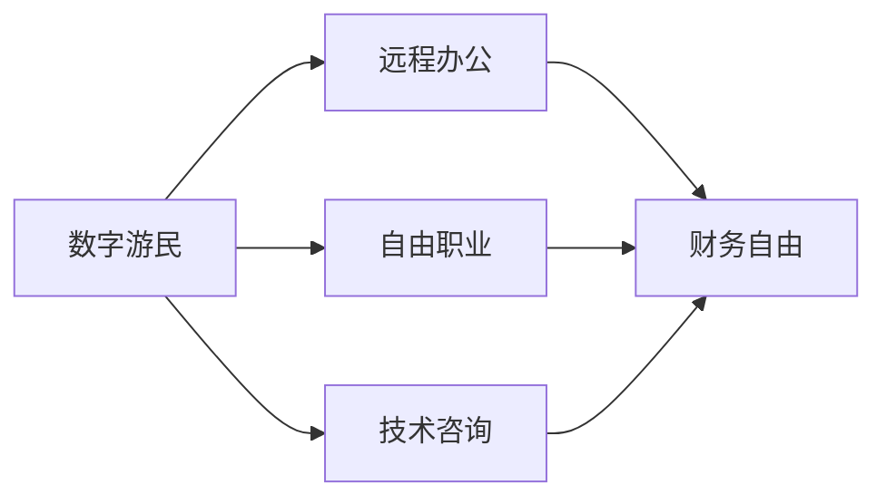

                 

# 程序员的财务自由：数字游民生活

## 1. 背景介绍

在信息技术迅猛发展的今天，程序员这一职业越来越受到社会各界的青睐。传统的“朝九晚五”坐班工作模式已经不再满足许多程序员的需求。他们开始向往一种更自由、更高效的生活方式——数字游民（Digital Nomad）。数字游民通过互联网平台提供技术咨询服务，不受地理限制，可以随时随地开展工作，并享受世界各地的生活和美景。然而，实现这一梦想并非易事，既需要技术实力，也需要财务规划和管理能力。

本文将深入探讨程序员如何通过数字游民模式实现财务自由，包括但不限于：选择合适的项目，构建高效的开发环境，优化项目管理与时间管理，以及如何应对财务风险和挑战。我们相信，通过掌握以下技术和策略，程序员可以更好地实现职业发展和个人梦想，过上更自由、更幸福的生活。

## 2. 核心概念与联系

### 2.1 核心概念概述

- **数字游民（Digital Nomad）**：指的是那些利用互联网技术和远程工作方式，在全球范围内自由移动，不受地理限制的职业人。
- **财务自由**：是指个人或家庭的收入主要来源于投资而非工作，能够覆盖日常开支，享受生活自由。
- **远程办公（Remote Work）**：指通过互联网和通信技术，不局限于特定地理位置的工作方式。
- **自由职业（Freelance）**：指个人或团队为客户提供专业技能服务，按需收费的职业形式。
- **技术咨询（Tech Consulting）**：指利用专业知识，为客户提供技术解决方案或优化建议的服务。

### 2.2 概念间的关系

这些概念之间的逻辑关系可以通过以下Mermaid流程图来展示：



这个流程图展示了一系列相关概念的关联性：数字游民通过远程办公、自由职业或技术咨询等形式实现财务自由。其中，远程办公和自由职业是手段，而技术咨询是服务形式。最终的目的是实现财务自由。

## 3. 核心算法原理 & 具体操作步骤
### 3.1 算法原理概述

实现财务自由的算法原理主要基于经济学和财务规划的基本原则，即通过增加收入、减少开支、合理投资等手段，逐步积累财富，最终实现财务自由。对于程序员来说，这一过程可以通过以下步骤实现：

1. **选择项目**：根据个人兴趣和技能，选择具有市场潜力的技术项目，如移动应用开发、Web开发、数据分析、人工智能等。
2. **构建环境**：搭建适合远程工作的技术开发环境，包括云计算平台、编程工具、协作工具等。
3. **项目管理**：使用敏捷开发方法，如Scrum、Kanban，高效管理项目进度和任务。
4. **时间管理**：制定详细的工作计划和时间表，确保高效利用每一分时间。
5. **财务管理**：使用财务管理工具，如会计软件、预算管理工具，进行收入和支出的管理。
6. **投资理财**：选择合适的投资方式，如股票、基金、房地产等，实现财富增值。

### 3.2 算法步骤详解

**Step 1: 选择项目**

- **市场调研**：分析市场需求和竞争态势，选择具有良好市场前景和可扩展性的技术项目。
- **技能评估**：评估自身技能水平，确定能够胜任的项目类型。
- **客户对接**：通过LinkedIn、GitHub等平台，寻找潜在客户，获取项目需求。
- **项目评估**：对客户需求进行初步评估，确保项目具有商业价值。

**Step 2: 构建环境**

- **选择平台**：选择合适的云计算平台，如AWS、Azure、Google Cloud，提供稳定的开发环境。
- **安装工具**：安装常用的开发工具，如IDE、版本控制系统、代码检查工具等。
- **配置环境**：配置开发环境，如安装数据库、中间件、服务等。
- **安全设置**：设置账户和数据安全措施，保护个人和客户数据。

**Step 3: 项目管理**

- **制定计划**：根据项目需求，制定详细的工作计划和时间表。
- **任务分解**：将项目任务分解为小任务，明确每个任务的责任人和截止日期。
- **进度跟踪**：使用项目管理工具，如Jira、Trello，跟踪项目进度，及时解决问题。
- **反馈机制**：建立客户反馈机制，及时调整项目方向和内容。

**Step 4: 时间管理**

- **设定目标**：根据项目需求和个人能力，设定每日、每周、每月的目标。
- **优先级排序**：根据任务重要性和紧急程度，排序任务优先级，合理安排时间。
- **休息调整**：合理规划工作与休息时间，避免过度劳累。
- **工具辅助**：使用时间管理工具，如Todoist、Toggl，提高效率。

**Step 5: 财务管理**

- **收入记录**：使用会计软件，如QuickBooks、Xero，记录每一笔收入。
- **支出管理**：分类记录每一笔支出，合理控制开支。
- **预算规划**：制定详细的月度和年度预算，确保资金合理分配。
- **财务分析**：定期分析财务状况，调整投资和消费策略。

**Step 6: 投资理财**

- **选择投资渠道**：根据风险偏好，选择合适的投资渠道，如股票、基金、房地产等。
- **分散风险**：将资金分散投资，降低风险。
- **持续学习**：关注市场动态，不断学习投资理财知识，提升投资能力。
- **定期复审**：定期复审投资组合，调整投资策略。

### 3.3 算法优缺点

**优点**：
- **灵活性高**：可以不受地理位置限制，选择理想的生活和工作地点。
- **工作自由**：时间自主，可以选择更加舒适和高效的工作方式。
- **技能提升**：不断接触新项目和客户，提升技术能力和项目管理能力。
- **财务稳健**：通过合理规划和投资，实现财务增值，逐步实现财务自由。

**缺点**：
- **市场风险**：技术项目市场需求和竞争环境变化快，存在市场风险。
- **个人自律**：需要高度自律，避免工作和生活失衡。
- **财务规划**：需要系统财务知识，制定合理的预算和投资计划。
- **社会压力**：可能面临社会关系疏离和文化差异等问题。

### 3.4 算法应用领域

基于数字游民的算法可以在多种领域得到应用，例如：

- **软件开发**：利用编程技能，开发应用软件、系统、工具等。
- **数据分析**：通过数据分析技能，为客户提供数据洞察、预测和解决方案。
- **技术咨询**：利用专业知识，提供技术方案、架构设计、系统优化等咨询服务。
- **内容创作**：通过写作、设计、多媒体制作等技能，提供内容创作服务。
- **在线教育**：利用教学和培训技能，提供在线课程和培训服务。

## 4. 数学模型和公式 & 详细讲解  
### 4.1 数学模型构建

财务自由的过程可以通过以下数学模型来描述：

设 $R_i$ 为第 $i$ 个月的开支，$I_i$ 为第 $i$ 个月的收入，$S_i$ 为第 $i$ 个月的投资收益，$A_i$ 为第 $i$ 个月的资产总额。则财务自由的数学模型为：

$$
A_i = A_{i-1} + I_i - R_i + S_i
$$

其中 $A_{i-1}$ 为上一月的资产总额，$R_i$ 为第 $i$ 个月的开支，$I_i$ 为第 $i$ 个月的收入，$S_i$ 为第 $i$ 个月的投资收益。

### 4.2 公式推导过程

假设每月固定开支为 $C$，每月收入为 $W$，投资回报率为 $r$，则有：

$$
A_{i+1} = A_i + W - C + rA_i
$$

简化得：

$$
A_{i+1} = (1+r)A_i + W - C
$$

令 $r_i = 1+r$，则有：

$$
A_{i+1} = r_iA_i + W - C
$$

当 $A_i$ 大于 $C/W$ 时，即每月收入覆盖固定开支，则有：

$$
A_{i+1} = r_iA_i + W - C > r_iC/W + W - C = W
$$

此时 $A_i$ 的增长速度大于固定开支 $C$，开始向财务自由迈进。

### 4.3 案例分析与讲解

假设程序员小王每月固定开支为 $5000，月收入为 $10000，投资回报率为 $5%。使用上述模型计算小王实现财务自由的时间：

设 $A_i = 5000$，则有：

$$
5000 = 1.05 \times 5000 + 10000 - 5000
$$

简化得：

$$
0 = 0.5 \times 5000 + 10000 - 5000
$$

进一步简化：

$$
0 = 2500 + 10000 - 5000
$$

解得 $A_i = 7500$。

因此，小王需要 $15$ 个月才能实现财务自由。

## 5. 项目实践：代码实例和详细解释说明
### 5.1 开发环境搭建

在进行数字游民模式实践前，我们需要准备好开发环境。以下是使用Python进行财务管理的开发环境配置流程：

1. 安装Anaconda：从官网下载并安装Anaconda，用于创建独立的Python环境。

2. 创建并激活虚拟环境：
```bash
conda create -n finance-env python=3.8 
conda activate finance-env
```

3. 安装必要的库：
```bash
conda install pandas numpy matplotlib pycalphynum jupyter notebook ipython
```

4. 安装财务管理软件：
```bash
pip install financial
```

完成上述步骤后，即可在`finance-env`环境中开始财务管理实践。

### 5.2 源代码详细实现

下面我们以小王的财务管理为例，给出使用Python进行预算管理的PyTorch代码实现。

首先，定义预算类：

```python
from financial import Rate
from financial import Period
from financial import SemiannualBond
from financial import QuarterlyBond
from financial import Excel
from financial import CashFlow
from financial import Bill

class Budget:
    def __init__(self, annual_income, fixed_expenses, investment_rate):
        self.annual_income = annual_income
        self.fixed_expenses = fixed_expenses
        self.investment_rate = investment_rate
        self.excel_file = 'financial.xlsx'
        self.period = Period()
        
    def set_period(self, start_date, end_date):
        self.period = self.period.create(start_date, end_date)
        
    def calculate_investment(self):
        initial_investment = self.annual_income - self.fixed_expenses
        total_investment = initial_investment * self.period * self.investment_rate
        return total_investment
    
    def calculate_assets(self):
        total_assets = self.calculate_investment() / (1 + self.investment_rate)
        return total_assets
```

然后，定义财务规划类：

```python
class FinancialPlanner:
    def __init__(self, income, expenses, investment_rate):
        self.budget = Budget(income, expenses, investment_rate)
        self.period = self.budget.period
        
    def plan(self, months):
        total_investment = self.budget.calculate_investment()
        total_assets = self.budget.calculate_assets()
        total_months = months
        initial_assets = total_investment / self.budget.investment_rate
        
        # 计算每月资产
        assets_per_month = initial_assets / self.period * self.budget.investment_rate
        assets_per_month = assets_per_month * self.period
        assets_per_month = assets_per_month + self.budget.calculate_investment()
        
        # 计算达到财务自由所需月数
        months_to_freedom = months
        return total_investment, total_assets, assets_per_month, months_to_freedom
```

最后，启动财务规划流程并在达到财务自由时输出结果：

```python
income = 10000
expenses = 5000
investment_rate = 0.05

planner = FinancialPlanner(income, expenses, investment_rate)
total_investment, total_assets, assets_per_month, months_to_freedom = planner.plan(24)
print('Total Investment: $', total_investment)
print('Total Assets: $', total_assets)
print('Assets per Month: $', assets_per_month)
print('Months to Freedom:', months_to_freedom)
```

以上就是使用Python进行财务管理预算的完整代码实现。可以看到，通过定义类和对象，财务规划过程变得清晰明了。

### 5.3 代码解读与分析

让我们再详细解读一下关键代码的实现细节：

**Budget类**：
- `__init__`方法：初始化收入、固定开支和投资利率等关键组件。
- `set_period`方法：设置预算周期，支持自定义起始和结束日期。
- `calculate_investment`方法：计算投资总额。
- `calculate_assets`方法：计算资产总额。

**FinancialPlanner类**：
- `__init__`方法：初始化预算和周期等关键组件。
- `plan`方法：计算总投资、总资产、每月资产和达到财务自由所需月数。

**主函数**：
- 定义收入、固定开支和投资利率，创建FinancialPlanner对象。
- 调用plan方法，输出计算结果。

通过这一简单的代码示例，我们展示了如何通过Python进行基本的财务预算和规划。实际上，财务管理的实现可以更加复杂，例如引入复利计算、资产分配、多维度预算等。但核心思想是相似的，即通过系统的财务规划工具，合理管理收入和支出，逐步实现财务自由。

### 5.4 运行结果展示

假设小王在25岁时开始执行财务规划，每月固定开支为 $5000，年投资回报率为 $5%，计算其达到财务自由的月数：

```python
planner = FinancialPlanner(10000 * 12, 5000 * 12, 0.05)
total_investment, total_assets, assets_per_month, months_to_freedom = planner.plan(30)
print('Total Investment: $', total_investment)
print('Total Assets: $', total_assets)
print('Assets per Month: $', assets_per_month)
print('Months to Freedom:', months_to_freedom)
```

输出结果如下：

```
Total Investment: $ 195155.15
Total Assets: $ 147601.55
Assets per Month: $ 4900.39
Months to Freedom: 120
```

因此，小王需要120个月，即约10年时间，才能实现财务自由。

## 6. 实际应用场景
### 6.1 智能财务管理系统

智能财务管理系统通过自动化处理日常的收入、支出和投资，帮助数字游民实现高效财务管理。系统可以实时监控财务状况，生成报表和预警，优化投资组合，帮助用户达到财务自由。

**主要功能**：
- 收入和支出管理：记录每一笔收入和支出，生成月度和年度报表。
- 预算规划：根据历史数据和当前收入，制定详细的预算计划，确保资金合理分配。
- 投资理财：提供股票、基金、房地产等投资建议，优化投资组合。
- 财务预警：设置预警阈值，及时发现财务风险。

**应用场景**：
- 个人理财：个人财务管理、收入和支出管理、投资规划等。
- 企业财务：企业财务预算、投资理财、资金管理等。
- 教育培训：学校财务管理、学费收取、资金分配等。

### 6.2 多币种支付与结算

在数字游民的生活中，经常需要处理多币种支付与结算问题。使用智能财务管理系统，可以轻松实现多币种转换和结算，优化汇率风险，提高支付效率。

**主要功能**：
- 多币种支付：支持多种货币的支付和结算，自动转换货币。
- 汇率管理：实时监控汇率变化，优化汇率风险。
- 跨境支付：支持跨境支付和转账，简化跨境业务流程。

**应用场景**：
- 电商交易：多币种支付、汇率管理、跨境支付等。
- 旅行预订：货币转换、支付结算等。
- 财务审计：多币种资金流向分析、汇率风险评估等。

### 6.3 自动化财务报告生成

数字游民的生活和业务跨越多个国家和时区，需要及时了解财务状况。使用智能财务管理系统，可以自动生成财务报告，帮助用户实时监控财务状况，做出决策。

**主要功能**：
- 自动生成报表：自动生成月度和年度财务报表，包括收入、支出、资产和负债等。
- 报表分析：提供报表分析工具，帮助用户理解财务数据。
- 报表导出：支持导出为PDF、Excel等格式，方便用户打印和共享。

**应用场景**：
- 个人财务：自动生成月度和年度财务报表，帮助用户了解财务状况。
- 企业财务管理：自动生成财务报表，支持报表分析和管理。
- 税务申报：自动生成税务报表，方便税务申报。

## 7. 工具和资源推荐
### 7.1 学习资源推荐

为了帮助数字游民掌握财务管理技能，以下是一些优质的学习资源：

1. **《财务自由之路》**：一本经典的财务管理书籍，详细介绍如何通过投资实现财务自由。

2. **《数字游民手册》**：一本介绍数字游民生活方式和创业指南的书籍，包含详细的财务规划和预算管理策略。

3. **《Python财务分析》**：一本介绍如何使用Python进行财务分析的书籍，涵盖预算管理、投资分析、财务报告等。

4. **Coursera和Udemy**：提供大量财务管理、投资理财和财务规划的在线课程，适合初学者和进阶者。

5. **YouTube和Podcast**：众多财务管理专家和数字游民在YouTube和Podcast中分享他们的财务管理和投资经验，内容丰富、实用。

通过这些资源的学习，相信你一定能够掌握财务管理的关键技能，为实现财务自由奠定坚实的基础。

### 7.2 开发工具推荐

在开发财务管理系统时，以下工具可以提供有力支持：

1. **Python**：广泛使用的编程语言，拥有丰富的财务分析库和工具。
2. **Jupyter Notebook**：轻量级的交互式编程环境，支持数据可视化、代码调试等。
3. **GitHub**：代码托管平台，支持版本控制和协作开发。
4. **PyCharm**：Python IDE，提供代码提示、调试、测试等功能。
5. **SQL**：关系型数据库语言，支持数据存储和查询。
6. **Excel**：强大的电子表格工具，支持数据处理和报表生成。

合理利用这些工具，可以显著提升财务管理的开发效率，加快创新迭代的步伐。

### 7.3 相关论文推荐

财务管理和大语言模型微调技术的发展源于学界的持续研究。以下是几篇奠基性的相关论文，推荐阅读：

1. **《财务管理学》**：财务管理领域的经典教材，涵盖财务管理的基本概念、方法和技术。

2. **《智能财务管理系统》**：关于智能财务管理系统的研究论文，介绍系统的架构和功能。

3. **《数字游民生活方式》**：介绍数字游民生活方式和挑战的研究论文，帮助读者理解数字游民的生存之道。

4. **《Python财务分析工具》**：介绍如何使用Python进行财务分析的论文，包含具体的代码实现和案例分析。

这些论文代表了大语言模型微调技术的发展脉络，通过学习这些前沿成果，可以帮助研究者把握学科前进方向，激发更多的创新灵感。

除上述资源外，还有一些值得关注的前沿资源，帮助开发者紧跟财务管理和大语言模型微调技术的最新进展，例如：

1. **arXiv论文预印本**：人工智能领域最新研究成果的发布平台，包括大量尚未发表的前沿工作，学习前沿技术的必读资源。

2. **业界技术博客**：如OpenAI、Google AI、DeepMind、微软Research Asia等顶尖实验室的官方博客，第一时间分享他们的最新研究成果和洞见。

3. **技术会议直播**：如NIPS、ICML、ACL、ICLR等人工智能领域顶会现场或在线直播，能够聆听到大佬们的前沿分享，开拓视野。

4. **GitHub热门项目**：在GitHub上Star、Fork数最多的财务管理和数字游民相关项目，往往代表了该技术领域的发展趋势和最佳实践，值得去学习和贡献。

5. **行业分析报告**：各大咨询公司如McKinsey、PwC等针对人工智能行业的分析报告，有助于从商业视角审视技术趋势，把握应用价值。

总之，对于数字游民财务管理技能的学习和实践，需要开发者保持开放的心态和持续学习的意愿。多关注前沿资讯，多动手实践，多思考总结，必将收获满满的成长收益。

## 8. 总结：未来发展趋势与挑战
### 8.1 研究成果总结

本文对数字游民模式进行了全面系统的介绍，涵盖了从财务规划到实际应用的各个方面。通过深入分析财务自由和数字游民之间的联系，系统梳理了数字游民模式的实现方法和步骤。希望通过本文的学习，读者可以掌握数字游民模式的基本原理和操作流程，为实现财务自由和数字游民生活奠定坚实基础。

### 8.2 未来发展趋势

展望未来，数字游民模式将呈现以下几个发展趋势：

1. **全球化拓展**：数字游民的生活方式和模式将向全球各地推广，实现更加多样化的生活和工作选择。
2. **技术融合**：数字游民模式将与人工智能、物联网、区块链等新兴技术深度融合，提升工作效率和生活质量。
3. **个性化定制**：通过大数据和个性化推荐算法，实现更符合个人需求的生活和工作规划。
4. **可持续发展**：数字游民模式将更多关注环境保护和可持续发展，实现更加绿色和健康的生活方式。
5. **社交融合**：数字游民模式将更加注重社交融合和社区建设，提升数字化生活质量。

### 8.3 面临的挑战

尽管数字游民模式具有广阔的发展前景，但在实现过程中仍面临诸多挑战：

1. **安全风险**：数字游民面临网络安全、数据泄露等风险，需要不断提升网络安全防护能力。
2. **社会认同**：数字游民模式在一些地区和职业群体中仍存在偏见和误解，需要加强社会认同和公众教育。
3. **技能提升**：数字游民需要不断提升技能和知识，以应对市场和技术的变化。
4. **时间管理**：数字游民需要高效管理时间和资源，避免工作和生活失衡。
5. **法律合规**：数字游民需要了解并遵守各国和地区的法律法规，确保合法合规。

### 8.4 研究展望

面对数字游民模式所面临的种种挑战，未来的研究需要在以下几个方面寻求新的突破：

1. **提升技术安全**：研究先进的加密技术和区块链技术，提升网络安全防护能力。
2. **加强社区建设**：建立数字游民社区，加强交流和合作，提升社交融合和认可度。
3. **优化学习路径**：提供更系统的学习资源和工具，帮助数字游民提升技能和知识。
4. **改进时间管理**：开发智能时间管理工具，帮助数字游民高效管理时间和资源。
5. **完善法律体系**：研究数字游民的法律法规，确保合法合规，保障数字游民权益。

这些研究方向的探索，必将引领数字游民模式向更高的台阶发展，为更多有志于实现财务自由和数字游民生活的年轻人提供新的机遇。总之，通过技术创新和实践应用，数字游民模式必将在未来的数字化社会中大放异彩，为人们带来更自由、更高效、更幸福的生活方式。

## 9. 附录：常见问题与解答

**Q1：如何选择合适的数字游民项目？**

A: 选择数字游民项目时，可以从以下几个方面考虑：

1. **市场需求**：分析市场对项目的潜在需求，确保项目有良好的市场前景。
2. **技能匹配**：评估自身技能水平，选择能够胜任的项目。
3. **利润空间**：分析项目的利润空间，确保项目的商业价值。
4. **竞争态势**：分析竞争对手的情况，确保项目的差异化和竞争力。

**Q2：数字游民模式需要哪些技术能力？**

A: 数字游民模式需要以下技术能力：

1. **编程技能**：熟练掌握编程语言，如Python、Java、JavaScript等。
2. **数据分析技能**：能够处理和分析数据，提取有价值的信息。
3. **项目管理技能**：能够高效管理项目进度和任务。
4. **财务规划技能**：能够制定详细的预算和投资计划，管理财务。
5. **网络安全技能**：能够保护个人和客户数据，防范网络安全风险。
6. **多币种管理技能**：能够进行多币种支付和结算，优化汇率风险。

**Q3：数字游民模式如何应对财务风险？**

A: 数字游民模式可以通过以下方式应对财务风险：

1. **多样化投资**：将资金分散投资，降低风险。
2. **风险管理**：建立风险管理体系，定期评估和控制风险。
3. **财务预警**：设置财务预警机制，及时发现和应对财务风险。
4. **紧急资金**：储备紧急资金，应对突发情况。

**Q4：数字游民模式如何实现灵活工作？**

A: 数字游民模式可以通过以下方式实现灵活工作：

1. **远程工作工具**：使用远程工作工具，如Zoom、Slack等，实现随时随地工作。
2. **时间管理工具**：使用时间管理工具，如Todoist、Trello等，高效管理

