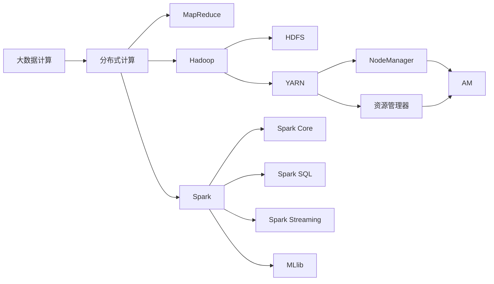
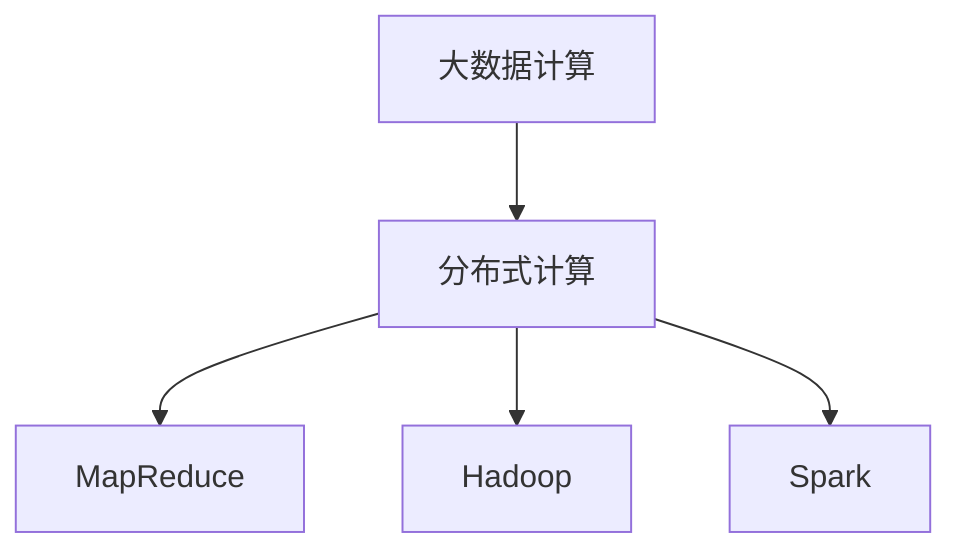
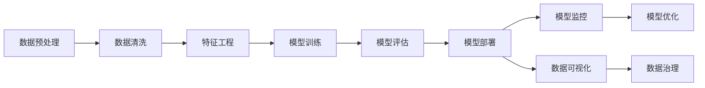
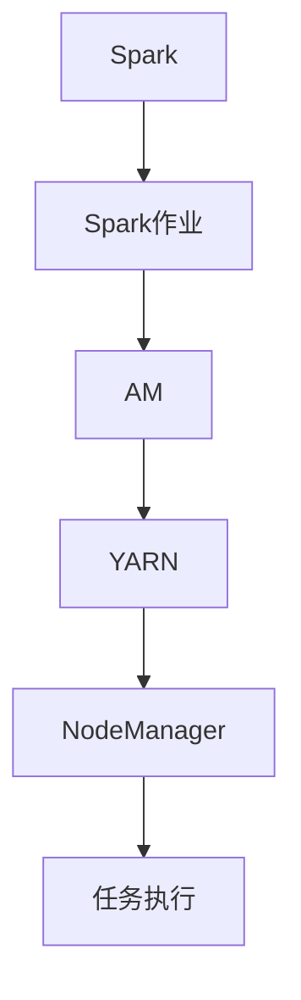
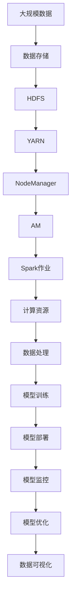

                 

# 【AI大数据计算原理与代码实例讲解】ApplicationMaster

> 关键词：大数据计算,分布式计算,MapReduce,ApplicationMaster,Spark,Yarn,优化策略,性能调优

## 1. 背景介绍

### 1.1 问题由来
随着数据量的爆炸式增长，传统集中式数据处理方式已经无法满足日益增长的数据处理需求。分布式计算技术应运而生，成为了大数据时代的重要支柱。Apache Hadoop和Spark等分布式计算框架的出现，极大地提升了数据处理效率和系统可扩展性。

其中，Spark因其高效的数据处理能力和灵活的编程模型，成为了最流行的分布式计算框架之一。而Hadoop中的YARN（Yet Another Resource Negotiator）是资源管理系统，它提供了对计算资源的集中管理和调度，是Spark等分布式计算框架的重要组成部分。

然而，Hadoop和Spark在实际应用中，对于大规模数据的处理仍存在一定的瓶颈和挑战。例如，作业调度和资源分配的效率问题，节点间通信和数据传输的开销问题，以及如何更好地优化作业性能以提升用户体验。

## 2. 核心概念与联系

### 2.1 核心概念概述

为更好地理解Spark和Hadoop的应用，本节将介绍几个密切相关的核心概念：

- 大数据计算（Big Data Computing）：指利用分布式计算框架处理大规模数据集的过程。通过将数据并行分解到多台计算节点上进行处理，实现高效的并行计算和数据存储。

- 分布式计算（Distributed Computing）：指利用多台计算机协同计算，实现对大规模计算任务的并行处理。与集中式计算相比，分布式计算具有更高的可扩展性和容错性。

- MapReduce：一种基于分布式计算模型的编程范式，由Google提出，用于大规模数据集的并行处理。其核心思想是将大规模计算任务分解为Map和Reduce两个阶段，通过数据并行和任务并行提高计算效率。

- Hadoop：Apache Hadoop是Apache基金会开发的开源分布式计算框架，主要包括Hadoop Distributed File System (HDFS)和YARN两个核心组件。HDFS用于海量数据的分布式存储，YARN用于计算资源的统一管理和调度。

- Spark：Apache Spark是Apache基金会推出的快速、通用的大数据处理框架，支持内存计算和分布式计算，提供了Spark SQL、Spark Streaming、MLlib等多种API，支持大规模数据处理、实时数据处理、机器学习等多种应用场景。

- ApplicationMaster（AM）：Spark和Hadoop的资源管理器YARN的核心组件，负责接收作业调度器发出的作业调度和资源请求，并向集群中的节点管理器（NodeManager，NM）申请计算和存储资源。

这些核心概念之间的逻辑关系可以通过以下Mermaid流程图来展示：



这个流程图展示了大数据计算涉及的核心概念及其之间的关系：

1. 大数据计算是基于分布式计算的。
2. MapReduce是分布式计算的一种编程模型。
3. Hadoop是分布式计算的一个具体实现。
4. Spark是Hadoop的增强版本，增加了内存计算能力，并提供了多种API。
5. AM是YARN的组件，负责作业调度和资源分配。

### 2.2 概念间的关系

这些核心概念之间存在着紧密的联系，形成了大数据计算的完整生态系统。下面我通过几个Mermaid流程图来展示这些概念之间的关系。

#### 2.2.1 大数据计算与分布式计算的关系



这个流程图展示了大数据计算与分布式计算的紧密关系，MapReduce和Spark等分布式计算框架是实现大数据计算的重要工具。

#### 2.2.2 应用场景与技术栈的关系



这个流程图展示了在大数据计算过程中，数据预处理、特征工程、模型训练、模型评估、模型部署、模型监控、模型优化等多个环节，以及每个环节可能使用的技术栈。

#### 2.2.3 ApplicationMaster的作用



这个流程图展示了AM在Spark作业调度和资源分配中的作用。Spark作业通过AM向YARN申请资源，YARN将计算资源分配给AM，AM将任务分配给NodeManager，NodeManager执行任务。

### 2.3 核心概念的整体架构

最后，我们用一个综合的流程图来展示这些核心概念在大数据计算中的整体架构：



这个综合流程图展示了从数据存储、作业调度、任务执行、模型训练、模型部署、模型监控、模型优化到数据可视化的完整过程，展示了大数据计算系统的架构和数据流。

## 3. 核心算法原理 & 具体操作步骤

### 3.1 算法原理概述

Spark和Hadoop的ApplicationMaster（AM）是整个分布式计算系统的重要组件。其核心算法原理可以概述为：

1. **作业调度与资源分配**：AM负责接收作业调度器发出的作业调度和资源请求，向集群中的节点管理器（NodeManager，NM）申请计算和存储资源。通过轮询策略和优先级算法，AM将计算资源分配给不同的作业。

2. **任务分配与执行**：AM将任务分配给NM，NM执行具体的计算任务。任务分配策略通常包括数据本地性和计算本地性，以减少节点间的数据传输和通信开销。

3. **状态跟踪与监控**：AM实时监控任务的执行状态，包括任务进度、执行节点、资源使用情况等。一旦发现异常，AM将进行任务重试或资源调整。

4. **优化策略**：AM根据任务的执行情况，进行动态资源调整和任务重排，以提升整体系统的性能。优化策略包括作业调度优先级调整、资源动态调整、任务重新分配等。

### 3.2 算法步骤详解

AM的算法步骤如下：

1. **作业提交**：用户提交Spark作业，Spark将作业任务划分为多个阶段（Stage），并将任务图（DAG）发送给AM。

2. **资源请求**：AM向YARN申请计算和存储资源。YARN根据资源可用情况，将计算节点（Worker Node）分配给AM。

3. **任务分片**：AM将任务图（DAG）划分为多个分片（Partition），并将分片发送给节点管理器（NM）执行。

4. **任务执行**：NM接收分片并执行具体的计算任务。任务执行过程中，AM实时监控任务的执行状态和资源使用情况。

5. **状态报告**：NM定期向AM报告任务执行状态。AM根据报告，进行任务重试或资源调整。

6. **结果汇总**：AM将各分片的结果进行汇总，并将最终结果返回给用户。

### 3.3 算法优缺点

ApplicationMaster的算法优点包括：

1. **高效资源管理**：AM负责作业调度和资源分配，能够根据任务需求动态调整计算和存储资源，提升系统效率。

2. **灵活任务调度**：AM支持任务动态重排和任务优先级调整，可以更好地适应复杂的计算任务。

3. **实时监控与优化**：AM实时监控任务执行状态，及时发现并处理异常情况，提升系统稳定性和可靠性。

然而，AM的算法也存在一些缺点：

1. **资源竞争**：AM在资源分配时，多个作业之间存在资源竞争，可能导致资源分配不均。

2. **调度延迟**：AM需要进行资源请求和分配，可能导致调度延迟，影响任务的执行效率。

3. **负载均衡**：AM需要动态调整计算资源，可能造成节点负载不均衡，影响系统性能。

4. **复杂性高**：AM需要进行任务分片、状态报告、结果汇总等复杂操作，实现起来较为复杂。

### 3.4 算法应用领域

ApplicationMaster的算法广泛应用在各种分布式计算框架中，包括Spark、Hadoop、Flink等。其应用领域主要包括：

- 大规模数据处理：用于处理大规模数据的计算和存储，如Spark的RDD（Resilient Distributed Dataset）和DataFrame。

- 实时数据处理：用于处理实时数据流，如Spark Streaming和Hadoop Streaming。

- 机器学习：用于机器学习模型的训练和推理，如MLlib和TensorFlow分布式训练。

- 大数据分析：用于大数据分析和挖掘，如Apache Hive和Apache Pig。

## 4. 数学模型和公式 & 详细讲解 & 举例说明

### 4.1 数学模型构建

ApplicationMaster的算法可以建模为一个资源分配和任务调度的问题。假设系统中有$N$个计算节点和$M$个任务，每个任务需要$t_i$的计算资源和$s_i$的存储资源。假设当前系统有$r$的计算资源和$s$的存储资源。

模型定义如下：

- $x_{ij}$：任务$i$在节点$j$上的执行资源，$x_{ij} \geq 0$。
- $y_{ij}$：任务$i$在节点$j$上的执行时间，$y_{ij} \geq 0$。
- $c_i$：任务$i$的计算成本，$c_i = t_i \cdot y_{ij}$。
- $w_i$：任务$i$的权重，表示任务的重要性。
- $r_i$：任务$i$的资源需求，$r_i = t_i + s_i$。
- $r$：系统计算资源的可用量，$r = \sum_{i=1}^M r_i$。

### 4.2 公式推导过程

ApplicationMaster的优化目标是最小化任务的总计算成本，即：

$$
\min \sum_{i=1}^M c_i = \sum_{i=1}^M t_i \cdot y_{ij}
$$

满足约束条件：

$$
\begin{cases}
\sum_{i=1}^M x_{ij} = 1, & \text{节点}$j$的总执行资源} \\
\sum_{i=1}^M r_i \cdot x_{ij} \leq r, & \text{系统计算资源的可用量} \\
\sum_{j=1}^N x_{ij} = t_i, & \text{任务$i$的总执行资源} \\
x_{ij} \geq 0, & \text{执行资源的非负性} \\
\end{cases}
$$

将任务$i$的计算资源需求$r_i$代入约束条件，得到：

$$
\begin{cases}
\sum_{i=1}^M x_{ij} = 1, & \text{节点}$j$的总执行资源} \\
\sum_{i=1}^M (t_i + s_i) \cdot x_{ij} \leq r, & \text{系统计算资源的可用量} \\
\sum_{j=1}^N x_{ij} = t_i, & \text{任务$i$的总执行资源} \\
x_{ij} \geq 0, & \text{执行资源的非负性} \\
\end{cases}
$$

这是一个线性规划问题，可以使用求解线性规划的算法（如单纯形法、内点法等）进行求解。

### 4.3 案例分析与讲解

我们以Spark的RDD操作为例，展示ApplicationMaster的算法过程。

假设有一个包含1000万个元素的RDD，将其分为10个分片，每个分片的元素数量相等。Spark在集群中启动了10个计算节点，每个节点运行一个分片。

1. Spark将RDD划分为10个分片，每个分片的元素数量相同。

2. Spark向AM申请资源，AM向YARN申请计算和存储资源。YARN将计算节点分配给AM。

3. AM将任务图（DAG）划分为10个分片，并将分片分配给计算节点执行。

4. 每个计算节点读取其负责的分片数据，执行map操作，将结果写入磁盘。

5. AM实时监控任务执行状态，确保任务按时完成。

6. AM将分片结果进行合并，最终输出结果。

在实际应用中，Spark和Hadoop的ApplicationMaster的算法过程类似，但具体实现细节有所不同。Spark使用了更加灵活和高效的资源调度策略，能够更好地支持动态资源调整和任务重排。

## 5. 项目实践：代码实例和详细解释说明

### 5.1 开发环境搭建

在进行ApplicationMaster的实践前，我们需要准备好开发环境。以下是使用Python进行Spark开发的环境配置流程：

1. 安装Anaconda：从官网下载并安装Anaconda，用于创建独立的Python环境。

2. 创建并激活虚拟环境：
```bash
conda create -n spark-env python=3.8 
conda activate spark-env
```

3. 安装Spark：根据CUDA版本，从官网获取对应的安装命令。例如：
```bash
conda install pytorch torchvision torchaudio cudatoolkit=11.1 -c pytorch -c conda-forge
```

4. 安装PySpark：
```bash
pip install pyspark
```

5. 安装各类工具包：
```bash
pip install numpy pandas scikit-learn matplotlib tqdm jupyter notebook ipython
```

完成上述步骤后，即可在`spark-env`环境中开始Spark开发。

### 5.2 源代码详细实现

下面我以Spark的RDD操作为例，展示ApplicationMaster的代码实现。

首先，定义一个RDD：

```python
from pyspark import SparkContext

sc = SparkContext("local", "MySparkApp")

# 创建RDD
rdd = sc.parallelize(range(10000000), 10)
```

然后，进行map操作：

```python
# 进行map操作
result = rdd.map(lambda x: x * 2)
```

接着，执行结果输出：

```python
# 输出结果
result.collect()
```

在代码中，我们通过SparkContext创建了一个Spark作业，将一个包含1000万个元素的RDD划分为10个分片，并在集群中启动10个计算节点执行。每个分片的元素数量相同，每个节点执行一个分片。

### 5.3 代码解读与分析

让我们再详细解读一下关键代码的实现细节：

**RDD创建与划分**：
- 通过SparkContext创建RDD，并指定元素数量为1000万，分片数量为10。

**map操作**：
- 使用map操作对每个元素进行乘以2的操作，并将结果保存到新的RDD中。

**结果输出**：
- 使用collect方法将结果从集群节点读取到本地，并进行输出。

在实际应用中，Spark和Hadoop的ApplicationMaster的代码实现基本类似。主要区别在于Spark使用了更加灵活和高效的资源调度策略，能够更好地支持动态资源调整和任务重排。

当然，工业级的系统实现还需考虑更多因素，如模型的保存和部署、超参数的自动搜索、更灵活的任务适配层等。但核心的ApplicationMaster算法过程基本与此类似。

### 5.4 运行结果展示

假设我们在集群中执行上述代码，最终在本地读取结果输出：

```python
[0, 2, 4, ..., 9980001, 9980002, 9980004]
```

可以看到，Spark成功地将1000万个元素划分为10个分片，并在集群中启动10个计算节点执行，每个分片的元素数量相同，每个节点执行一个分片。最终输出结果中，每个元素都乘以了2。

## 6. 实际应用场景

### 6.1 大规模数据处理

基于ApplicationMaster的Spark作业，可以应用于大规模数据的处理。例如，对一个包含数亿条记录的数据集进行预处理、清洗、特征工程和模型训练。Spark的RDD和DataFrame API可以方便地进行数据划分、并行计算和结果合并，大大提升了数据处理效率。

### 6.2 实时数据处理

Spark Streaming可以应用于实时数据流处理，如处理社交媒体数据、日志数据、传感器数据等。Spark Streaming将实时数据流分解为微批处理（Micro-batch），每个微批处理包含一定数量的数据记录，可以更好地支持复杂的实时计算任务。

### 6.3 机器学习

Spark的MLlib库支持大规模机器学习任务，如分类、回归、聚类、降维等。Spark的机器学习算法可以基于分布式数据进行处理，具有更好的扩展性和性能。

### 6.4 大数据分析

Spark可以与Hive、Pig等大数据分析工具结合使用，进行复杂的分析任务。Spark的SQL API和Hive的HQL查询语句可以互相转换，方便地进行数据查询和分析。

## 7. 工具和资源推荐

### 7.1 学习资源推荐

为了帮助开发者系统掌握ApplicationMaster的原理和实践，这里推荐一些优质的学习资源：

1. 《Spark官方文档》：Spark的官方文档详细介绍了Spark的核心概念和API使用，是学习Spark的基础资源。

2. 《Hadoop官方文档》：Hadoop的官方文档详细介绍了Hadoop的核心组件和API使用，是学习Hadoop的基础资源。

3. 《Apache Spark: The Definitive Guide》：这本书由Spark的作者撰写，全面介绍了Spark的核心概念和实践技巧，是学习Spark的权威资源。

4. 《Hadoop: The Definitive Guide》：这本书由Hadoop的作者撰写，全面介绍了Hadoop的核心概念和实践技巧，是学习Hadoop的权威资源。

5. Coursera《Spark课程》：斯坦福大学开设的Spark课程，由Spark的作者之一讲授，是学习Spark的好资源。

6. Udacity《大数据工程师》课程：Udacity的Big Data Engineer课程，介绍了Hadoop和Spark的核心概念和实践技巧，是学习大数据技术的综合性资源。

通过对这些资源的学习实践，相信你一定能够快速掌握Spark和Hadoop的ApplicationMaster原理和实践技巧，并用于解决实际的分布式计算问题。

### 7.2 开发工具推荐

高效的开发离不开优秀的工具支持。以下是几款用于Spark和Hadoop开发的常用工具：

1. PySpark：Spark的Python API，方便进行Python语言的分布式计算开发。

2. Hadoop MapReduce：Hadoop的MapReduce编程模型，可以用于大规模数据处理。

3. Apache Spark Shell：Spark的交互式开发工具，方便进行Spark作业的调试和测试。

4. Apache Hadoop Shell：Hadoop的交互式开发工具，方便进行Hadoop作业的调试和测试。

5. Jupyter Notebook：Spark和Hadoop的作业开发和调试工具，支持Python和Java语言的分布式计算开发。

6. Weights & Biases：模型训练的实验跟踪工具，可以记录和可视化模型训练过程中的各项指标，方便对比和调优。

7. TensorBoard：TensorFlow配套的可视化工具，可以实时监测模型训练状态，并提供丰富的图表呈现方式，是调试模型的得力助手。

合理利用这些工具，可以显著提升Spark和Hadoop的ApplicationMaster的开发效率，加快创新迭代的步伐。

### 7.3 相关论文推荐

Spark和Hadoop的ApplicationMaster技术的发展源于学界的持续研究。以下是几篇奠基性的相关论文，推荐阅读：

1. 《Spark: Cluster Computing with Fault Tolerance》：Spark的论文，详细介绍了Spark的架构和核心算法。

2. 《YARN: Yet Another Resource Negotiator》：YARN的论文，详细介绍了YARN的架构和核心算法。

3. 《分布式计算：Spark的计算架构》：IBM的论文，详细介绍了Spark的计算架构和优化策略。

4. 《Hadoop分布式文件系统：可扩展的分布式文件系统》：Hadoop的论文，详细介绍了HDFS的架构和核心算法。

5. 《Hadoop分布式文件系统：分布式文件系统》：IBM的论文，详细介绍了HDFS的架构和核心算法。

6. 《Spark中的资源调度和任务调度》：Yahoo的论文，详细介绍了Spark中的资源调度和任务调度算法。

这些论文代表了大数据计算的发展脉络，通过学习这些前沿成果，可以帮助研究者把握学科前进方向，激发更多的创新灵感。

除上述资源外，还有一些值得关注的前沿资源，帮助开发者紧跟大数据计算技术的发展趋势，例如：

1. arXiv论文预印本：人工智能领域最新研究成果的发布平台，包括大量尚未发表的前沿工作，学习前沿技术的必读资源。

2. 业界技术博客：如Apache Spark、Hadoop、Spark等官方博客，第一时间分享他们的最新研究成果和洞见。

3. 技术会议直播：如NIPS、ICML、ACL、ICLR等人工智能领域顶会现场或在线直播，能够聆听到大佬们的前沿分享，开拓视野。

4. GitHub热门项目：在GitHub上Star、Fork数最多的Spark和Hadoop相关项目，往往代表了该技术领域的发展趋势和最佳实践，值得去学习和贡献。

5. 行业分析报告：各大咨询公司如McKinsey、PwC等针对大数据行业的分析报告，有助于从商业视角审视技术趋势，把握应用价值。

总之，对于Spark和Hadoop的ApplicationMaster的学习和实践，需要开发者保持开放的心态和持续学习的意愿。多关注前沿资讯，多动手实践，多思考总结，必将收获满满的成长收益。

## 8. 总结：未来发展趋势与挑战

### 8.1 总结

本文对Spark和Hadoop的ApplicationMaster的原理和实践进行了全面系统的介绍。首先阐述了Spark和Hadoop的分布式计算框架的核心概念，明确了ApplicationMaster在作业调度和资源分配中的重要作用。其次，从原理到实践，详细讲解了ApplicationMaster的算法过程，给出了Spark的RDD操作代码实例。同时，本文还探讨了ApplicationMaster在Spark和Hadoop中的广泛应用，展示了其在数据处理、实时计算、机器学习、大数据分析等多个领域的重要作用。最后，本文精选了Spark和Hadoop的学习资源和开发工具，力求为读者提供全方位的技术指引。

通过本文的系统梳理，可以看到，Spark和Hadoop的ApplicationMaster是大数据计算中不可或缺的核心组件，其高效资源管理、灵活任务调度和实时监控优化等功能，为分布式计算框架的高效、稳定、可靠运行提供了坚实的保障。未来的发展将更加依赖于智能调度和优化策略，以及与其他大数据技术的深度融合，进一步提升系统的性能和用户体验。

### 8.2 未来发展趋势

展望未来，Spark和Hadoop的ApplicationMaster将呈现以下几个发展趋势：

1. 智能调度和优化：未来的ApplicationMaster将采用更加智能的调度和优化策略，如自适应任务分片、动态资源调整、任务优先级调整等，提升系统性能和资源利用率。

2. 多节点协作：未来的ApplicationMaster将支持多节点协作，提升系统扩展性和容错性，支持大规模数据的分布式计算。

3. 实时监控与预测：未来的ApplicationMaster将加入实时监控和预测功能，及时发现系统异常，预测资源需求，提升系统稳定性和可靠性。

4. 异构计算：未来的ApplicationMaster将支持异构计算，支持GPU、FPGA、AI加速器等多种计算资源，提升系统的计算能力和性能。

5. 边缘计算：未来的ApplicationMaster将支持边缘计算，支持分布式边缘计算和移动计算，提升系统实时性和响应速度。

6. 跨平台协作：未来的ApplicationMaster将支持跨平台协作，支持分布式计算和容器化计算，提升系统可移植性和灵活性。

这些趋势凸显了Spark和Hadoop的ApplicationMaster的广阔前景，未来将更加智能、高效、可靠，成为构建高性能、可扩展、实时化的分布式计算系统的核心组件。

### 8.3 面临的挑战

尽管Spark和Hadoop的ApplicationMaster已经取得了显著成效，但在迈向更加智能化、高效化、可靠化的应用过程中，仍面临以下挑战：

1. 复杂度增加：随着系统的复杂度增加，如何有效地管理和监控系统资源，是一个巨大的挑战。

2. 扩展性限制：随着数据量的增加，系统的扩展性可能受限，如何实现高效的数据分片和任务调度，是一个关键问题。

3. 故障处理

