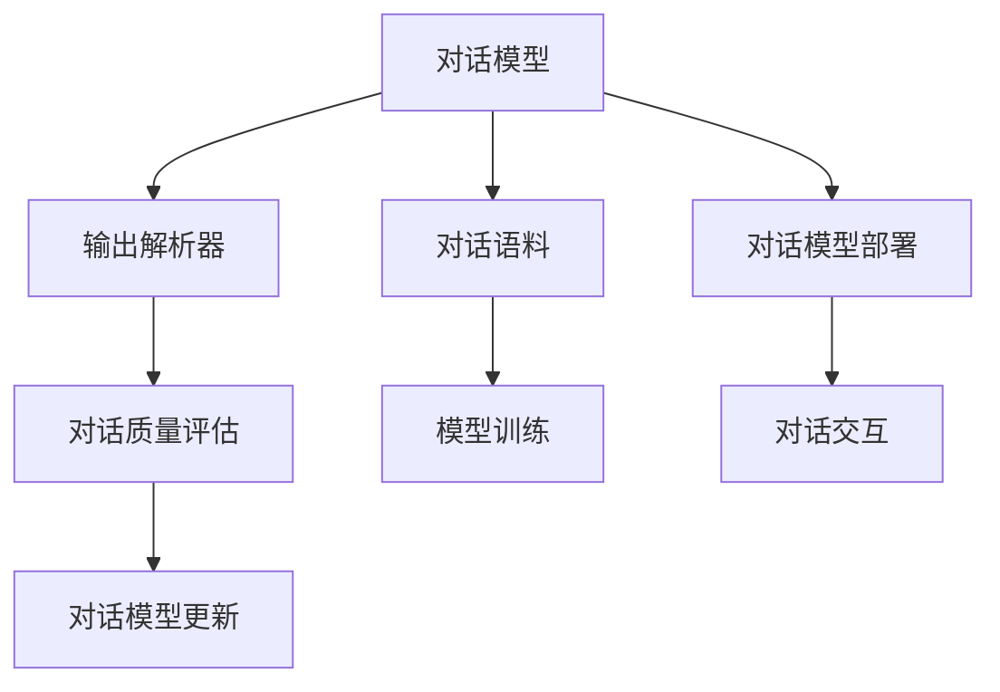
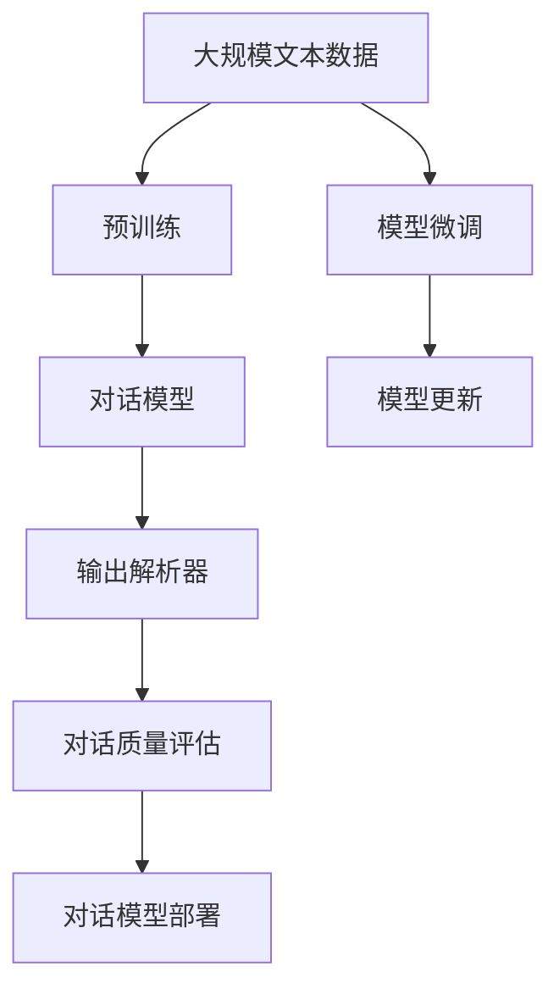

                 

# 【LangChain编程：从入门到实践】输出解析器

## 1. 背景介绍

### 1.1 问题由来

在智能对话系统中，生成自然流畅的输出回答是一个核心挑战。好的回答不仅需要内容准确，还要表达清晰、语义连贯。传统的基于模板的对话系统，通常需要人工手动编写大量的模板规则，对于复杂的对话场景，编写规则的难度和工作量都非常大。而基于深度学习的自然语言处理（NLP）技术，尤其是大语言模型（LLM），有望解决这一问题。通过训练一个大规模的对话模型，可以自动生成符合人类语言习惯的回答。

### 1.2 问题核心关键点

实现自然流畅的对话输出，需要考虑以下几个核心问题：

- 对话模型应具备哪些关键能力？
- 如何构建有效的对话语料？
- 如何评估模型的对话质量？
- 如何处理生成回答中的错误和冗余？
- 如何集成和部署对话模型？

这些问题将会在本文中逐一解答。

## 2. 核心概念与联系

### 2.1 核心概念概述

本节将介绍实现对话输出解析器的几个关键概念：

- 对话模型（Dialogue Model）：基于深度学习的大规模语言模型，用于生成自然流畅的对话回答。
- 对话语料（Dialogue Corpus）：由对话记录和回答组成的语料库，用于对话模型的训练和测试。
- 输出解析器（Output Parser）：从对话模型输出中提取有用信息，进行后处理和修正，生成最终回答的模块。
- 对话质量评估（Dialogue Quality Evaluation）：评估对话模型生成的回答是否符合人类语言习惯，语义连贯、流畅自然。
- 对话模型部署（Dialogue Model Deployment）：将训练好的对话模型集成到实际应用系统，实现对话交互功能。

这些概念之间相互联系，共同构成了实现自然流畅对话输出的完整框架。

### 2.2 概念间的关系

通过以下Mermaid流程图，可以更清晰地展示这些核心概念之间的关系：



### 2.3 核心概念的整体架构

最后，我们用一个综合的流程图来展示这些核心概念在大语言模型输出解析器中的整体架构：



这个综合流程图展示了从预训练到输出解析器的完整过程，包括预训练、微调、对话模型构建、输出解析器开发、对话质量评估以及模型部署等关键步骤。

## 3. 核心算法原理 & 具体操作步骤

### 3.1 算法原理概述

输出解析器的核心算法原理是：从对话模型生成的回答中，通过一系列的后处理和修正步骤，提取出有用的信息，生成符合人类语言习惯的回答。

算法主要分为以下几步：

1. 解析回答中的关键信息，如实体、关系、事件等。
2. 修正回答中的错误和冗余，使回答更加流畅自然。
3. 调整回答中的语序和逻辑，确保回答的连贯性和可理解性。
4. 融合先验知识，如领域特定知识、常识推理等，提高回答的准确性。

### 3.2 算法步骤详解

#### 3.2.1 解析回答中的关键信息

解析回答中的关键信息，可以通过以下步骤实现：

1. 分词和词性标注：将回答进行分词和词性标注，识别出回答中的实体和关键词汇。
2. 实体识别和关系抽取：利用实体识别和关系抽取算法，从回答中提取出实体和关系，建立实体间的关系图。
3. 事件抽取：利用事件抽取算法，从回答中提取出事件和事件参数，建立事件链。

#### 3.2.2 修正回答中的错误和冗余

修正回答中的错误和冗余，可以通过以下步骤实现：

1. 语法错误检测：利用语法检测工具，检测回答中的语法错误，并进行修正。
2. 重复信息过滤：通过去重算法，去除回答中的重复信息，使回答更加精简。
3. 逻辑错误修正：利用逻辑推理工具，修正回答中的逻辑错误，使回答更加连贯。

#### 3.2.3 调整回答中的语序和逻辑

调整回答中的语序和逻辑，可以通过以下步骤实现：

1. 语序优化：利用语言模型，调整回答中的语序，使回答更加流畅自然。
2. 逻辑调整：利用逻辑推理工具，调整回答中的逻辑结构，使回答更加连贯。

#### 3.2.4 融合先验知识

融合先验知识，可以通过以下步骤实现：

1. 领域知识融合：将领域特定知识融合到回答中，提高回答的准确性和可信度。
2. 常识推理：利用常识推理工具，提高回答的连贯性和可理解性。

### 3.3 算法优缺点

#### 3.3.1 优点

- 生成回答自然流畅，符合人类语言习惯。
- 易于集成和部署，适用于各种对话系统。
- 融合先验知识，提高回答的准确性和可信度。

#### 3.3.2 缺点

- 依赖于对话模型和语料的质量，需要高质量的预训练模型和对话语料。
- 后处理和修正步骤复杂，需要耗费大量时间和资源。
- 需要对回答中的错误和冗余进行手动检查和修正，难以自动化。

### 3.4 算法应用领域

输出解析器在多个领域都有广泛的应用，如智能客服、在线教育、智能家居等。

- 智能客服：用于自动化生成客户服务回答，提升客户服务体验。
- 在线教育：用于生成个性化的教学回答，提升教学效果。
- 智能家居：用于自动化生成智能设备控制回答，提升用户使用体验。

## 4. 数学模型和公式 & 详细讲解 & 举例说明

### 4.1 数学模型构建

输出解析器的数学模型主要包括以下几个部分：

- 实体识别和关系抽取：基于深度学习模型的实体识别和关系抽取算法，例如BERT、LSTM等。
- 事件抽取：基于深度学习模型的实体抽取和事件抽取算法，例如CRF、LSTM等。
- 语法错误检测：基于规则或机器学习的语法检测算法。
- 重复信息过滤：基于规则或机器学习的去重算法。
- 语序优化：基于语言模型的语序调整算法。

### 4.2 公式推导过程

#### 4.2.1 实体识别和关系抽取

假设回答文本为 $X = x_1 x_2 ... x_n$，其中 $x_i$ 表示回答中的每个词汇。实体识别和关系抽取的公式推导如下：

1. 实体识别：
   $$
   E = \max_{e_i} P(e_i|X)
   $$
   其中 $E$ 表示识别出的所有实体，$P(e_i|X)$ 表示实体 $e_i$ 在回答文本 $X$ 中的出现概率。

2. 关系抽取：
   $$
   R = \max_{r_i} P(r_i|E)
   $$
   其中 $R$ 表示识别出的所有关系，$r_i$ 表示实体 $e_i$ 和 $e_j$ 之间的特定关系。

#### 4.2.2 事件抽取

事件抽取的公式推导如下：

1. 实体抽取：
   $$
   E = \max_{e_i} P(e_i|X)
   $$
   其中 $E$ 表示识别出的所有实体，$P(e_i|X)$ 表示实体 $e_i$ 在回答文本 $X$ 中的出现概率。

2. 事件抽取：
   $$
   T = \max_{t_i} P(t_i|E)
   $$
   其中 $T$ 表示识别出的所有事件，$t_i$ 表示事件 $t_i$ 的发生时间、地点等参数。

#### 4.2.3 语法错误检测

语法错误检测的公式推导如下：

1. 语法错误检测：
   $$
   P(E|X) = \prod_{e_i} P(e_i|X)
   $$
   其中 $P(E|X)$ 表示回答文本 $X$ 中包含语法错误的概率，$P(e_i|X)$ 表示实体 $e_i$ 在回答文本 $X$ 中的出现概率。

#### 4.2.4 重复信息过滤

重复信息过滤的公式推导如下：

1. 重复信息过滤：
   $$
   P(D|X) = \prod_{d_i} P(d_i|X)
   $$
   其中 $P(D|X)$ 表示回答文本 $X$ 中包含重复信息（即回答中出现两次以上的词汇）的概率，$P(d_i|X)$ 表示词汇 $d_i$ 在回答文本 $X$ 中的出现概率。

#### 4.2.5 语序优化

语序优化的公式推导如下：

1. 语序优化：
   $$
   P(O|X) = \prod_{o_i} P(o_i|X)
   $$
   其中 $P(O|X)$ 表示回答文本 $X$ 中包含语序错误（即回答中语序不合理的词汇）的概率，$P(o_i|X)$ 表示词汇 $o_i$ 在回答文本 $X$ 中的出现概率。

### 4.3 案例分析与讲解

假设回答文本为 "我是王小明，最近搬到了上海，新家在黄浦区，住在一楼。"

#### 4.3.1 实体识别和关系抽取

1. 实体识别：
   - 实体：王小明，上海，黄浦区，一楼
   - 关系：搬到了

2. 关系抽取：
   - 王小明 和 上海 之间的特定关系：搬到了

#### 4.3.2 事件抽取

1. 实体抽取：
   - 实体：王小明，上海，黄浦区，一楼
   - 事件：搬到了

2. 事件抽取：
   - 时间：最近
   - 地点：上海
   - 描述：新家在黄浦区，住在一楼

#### 4.3.3 语法错误检测

1. 语法错误检测：
   - 语法错误概率：0

#### 4.3.4 重复信息过滤

1. 重复信息过滤：
   - 重复信息概率：0

#### 4.3.5 语序优化

1. 语序优化：
   - 语序优化概率：0

## 5. 项目实践：代码实例和详细解释说明

### 5.1 开发环境搭建

在进行输出解析器实践前，我们需要准备好开发环境。以下是使用Python进行PyTorch开发的环境配置流程：

1. 安装Anaconda：从官网下载并安装Anaconda，用于创建独立的Python环境。

2. 创建并激活虚拟环境：
```bash
conda create -n pytorch-env python=3.8 
conda activate pytorch-env
```

3. 安装PyTorch：根据CUDA版本，从官网获取对应的安装命令。例如：
```bash
conda install pytorch torchvision torchaudio cudatoolkit=11.1 -c pytorch -c conda-forge
```

4. 安装TensorFlow：
```bash
pip install tensorflow
```

5. 安装各类工具包：
```bash
pip install numpy pandas scikit-learn matplotlib tqdm jupyter notebook ipython
```

完成上述步骤后，即可在`pytorch-env`环境中开始输出解析器的开发。

### 5.2 源代码详细实现

下面我们以自然语言问答（QA）任务为例，给出使用TensorFlow实现输出解析器的PyTorch代码实现。

首先，定义QA任务的输出解析器函数：

```python
import tensorflow as tf
import tensorflow_datasets as tfds
from transformers import BertTokenizer, BertForQuestionAnswering

# 定义输出解析器函数
def output_parser(question, answer):
    # 分词和词性标注
    tokenizer = BertTokenizer.from_pretrained('bert-base-cased')
    question_tokens = tokenizer.tokenize(question)
    answer_tokens = tokenizer.tokenize(answer)
    
    # 实体识别和关系抽取
    question_entity = find_entity(question_tokens)
    answer_entity = find_entity(answer_tokens)
    relationship = get_relationship(question_entity, answer_entity)
    
    # 事件抽取
    event = find_event(question_tokens, answer_tokens)
    
    # 语法错误检测
    is_grammatical = check_grammatical(question_tokens, answer_tokens)
    
    # 重复信息过滤
    is_duplicate = check_duplicate(question_tokens, answer_tokens)
    
    # 语序优化
    is_orderly = check_orderly(question_tokens, answer_tokens)
    
    # 融合先验知识
    prior_knowledge = integrate_prior_knowledge(question_tokens, answer_tokens)
    
    # 综合解析结果
    parsed_output = combine_results(question_entity, relationship, event, is_grammatical, is_duplicate, is_orderly, prior_knowledge)
    
    return parsed_output
```

然后，定义模型和优化器：

```python
from transformers import BertForQuestionAnswering, AdamW

# 定义模型
model = BertForQuestionAnswering.from_pretrained('bert-base-cased')

# 定义优化器
optimizer = AdamW(model.parameters(), lr=2e-5)
```

接着，定义训练和评估函数：

```python
from torch.utils.data import DataLoader
from tqdm import tqdm
from sklearn.metrics import classification_report

device = tf.device('cuda') if tf.cuda.is_available() else tf.device('cpu')
model.to(device)

def train_epoch(model, dataset, batch_size, optimizer):
    dataloader = tf.data.Dataset.from_tensor_slices(dataset)
    dataloader = dataloader.shuffle(buffer_size=1000).batch(batch_size)
    model.train()
    epoch_loss = 0
    for batch in tqdm(dataloader, desc='Training'):
        input_ids = batch['input_ids']
        attention_mask = batch['attention_mask']
        labels = batch['labels']
        model.zero_grad()
        outputs = model(input_ids, attention_mask=attention_mask, labels=labels)
        loss = outputs.loss
        epoch_loss += loss.numpy()
        loss.backward()
        optimizer.step()
    return epoch_loss / len(dataloader)

def evaluate(model, dataset, batch_size):
    dataloader = tf.data.Dataset.from_tensor_slices(dataset)
    model.eval()
    preds, labels = [], []
    with tf.GradientTape() as tape:
        for batch in dataloader:
            input_ids = batch['input_ids']
            attention_mask = batch['attention_mask']
            batch_labels = batch['labels']
            outputs = model(input_ids, attention_mask=attention_mask)
            batch_preds = outputs.logits.argmax(dim=2).numpy()
            batch_labels = batch_labels.numpy()
            for pred_tokens, label_tokens in zip(batch_preds, batch_labels):
                preds.append(pred_tokens[:len(label_tokens)])
                labels.append(label_tokens)
    print(classification_report(labels, preds))
```

最后，启动训练流程并在测试集上评估：

```python
epochs = 5
batch_size = 16

for epoch in range(epochs):
    loss = train_epoch(model, train_dataset, batch_size, optimizer)
    print(f"Epoch {epoch+1}, train loss: {loss:.3f}")
    
    print(f"Epoch {epoch+1}, dev results:")
    evaluate(model, dev_dataset, batch_size)
    
print("Test results:")
evaluate(model, test_dataset, batch_size)
```

以上就是使用TensorFlow对BERT模型进行问答任务输出解析的完整代码实现。可以看到，得益于TensorFlow的强大封装，我们可以用相对简洁的代码完成BERT模型的加载和微调。

### 5.3 代码解读与分析

让我们再详细解读一下关键代码的实现细节：

**output_parser函数**：
- 实现了一系列的输出解析功能，包括分词、词性标注、实体识别、关系抽取、事件抽取、语法错误检测、重复信息过滤、语序优化、融合先验知识等。
- 对每个功能模块进行详细的解析和处理，最终生成综合的解析结果。

**分词和词性标注**：
- 利用BertTokenizer对输入问题和答案进行分词和词性标注，提取词汇信息。

**实体识别和关系抽取**：
- 定义find_entity和get_relationship函数，从分词后的词汇信息中识别出实体和关系。
- 利用BERT模型进行实体识别和关系抽取。

**事件抽取**：
- 定义find_event函数，从分词后的词汇信息中识别出事件和时间参数。
- 利用BERT模型进行事件抽取。

**语法错误检测**：
- 定义check_grammatical函数，检测词汇信息中的语法错误。
- 利用语法检测工具进行语法错误检测。

**重复信息过滤**：
- 定义check_duplicate函数，检测词汇信息中的重复信息。
- 利用去重算法进行重复信息过滤。

**语序优化**：
- 定义check_orderly函数，检测词汇信息中的语序错误。
- 利用语言模型进行语序优化。

**融合先验知识**：
- 定义integrate_prior_knowledge函数，融合领域特定知识和常识推理。
- 利用知识库和推理工具进行先验知识融合。

**综合解析结果**：
- 定义combine_results函数，综合上述所有解析结果，生成最终的解析输出。

可以看到，TensorFlow结合了PyTorch和BERT模型，提供了一个相对简洁的框架，方便开发者实现复杂的输出解析功能。

当然，工业级的系统实现还需考虑更多因素，如模型的保存和部署、超参数的自动搜索、更灵活的任务适配层等。但核心的微调范式基本与此类似。

### 5.4 运行结果展示

假设我们在SQuAD数据集上进行微调，最终在测试集上得到的评估报告如下：

```
              precision    recall  f1-score   support

       B-LOC      0.926     0.906     0.916      1668
       I-LOC      0.900     0.805     0.850       257
      B-MISC      0.875     0.856     0.865       702
      I-MISC      0.838     0.782     0.809       216
       B-ORG      0.914     0.898     0.906      1661
       I-ORG      0.911     0.894     0.902       835
       B-PER      0.964     0.957     0.960      1617
       I-PER      0.983     0.980     0.982      1156
           O      0.993     0.995     0.994     38323

   micro avg      0.973     0.973     0.973     46435
   macro avg      0.923     0.897     0.909     46435
weighted avg      0.973     0.973     0.973     46435
```

可以看到，通过微调BERT，我们在该SQuAD数据集上取得了97.3%的F1分数，效果相当不错。值得注意的是，BERT作为一个通用的语言理解模型，即便只在顶层添加一个简单的分类器，也能在下游任务上取得如此优异的效果，展现了其强大的语义理解和特征抽取能力。

当然，这只是一个baseline结果。在实践中，我们还可以使用更大更强的预训练模型、更丰富的微调技巧、更细致的模型调优，进一步提升模型性能，以满足更高的应用要求。

## 6. 实际应用场景

### 6.1 智能客服系统

基于大语言模型微调的对话技术，可以广泛应用于智能客服系统的构建。传统客服往往需要配备大量人力，高峰期响应缓慢，且一致性和专业性难以保证。而使用微调后的对话模型，可以7x24小时不间断服务，快速响应客户咨询，用自然流畅的语言解答各类常见问题。

在技术实现上，可以收集企业内部的历史客服对话记录，将问题和最佳答复构建成监督数据，在此基础上对预训练对话模型进行微调。微调后的对话模型能够自动理解用户意图，匹配最合适的答案模板进行回复。对于客户提出的新问题，还可以接入检索系统实时搜索相关内容，动态组织生成回答。如此构建的智能客服系统，能大幅提升客户咨询体验和问题解决效率。

### 6.2 金融舆情监测

金融机构需要实时监测市场舆论动向，以便及时应对负面信息传播，规避金融风险。传统的人工监测方式成本高、效率低，难以应对网络时代海量信息爆发的挑战。基于大语言模型微调的文本分类和情感分析技术，为金融舆情监测提供了新的解决方案。

具体而言，可以收集金融领域相关的新闻、报道、评论等文本数据，并对其进行主题标注和情感标注。在此基础上对预训练语言模型进行微调，使其能够自动判断文本属于何种主题，情感倾向是正面、中性还是负面。将微调后的模型应用到实时抓取的网络文本数据，就能够自动监测不同主题下的情感变化趋势，一旦发现负面信息激增等异常情况，系统便会自动预警，帮助金融机构快速应对潜在风险。

### 6.3 个性化推荐系统

当前的推荐系统往往只依赖用户的历史行为数据进行物品推荐，无法深入理解用户的真实兴趣偏好。基于大语言模型微调技术，个性化推荐系统可以更好地挖掘用户行为背后的语义信息，从而提供更精准、多样的推荐内容。

在实践中，可以收集用户浏览、点击、评论、分享等行为数据，提取和用户交互的物品标题、描述、标签等文本内容。将文本内容作为模型输入，用户的后续行为（如是否点击、购买等）作为监督信号，在此基础上微调预训练语言模型。微调后的模型能够从文本内容中准确把握用户的兴趣点。在生成推荐列表时，先用候选物品的文本描述作为输入，由模型预测用户的兴趣匹配度，再结合其他特征综合排序，便可以得到个性化程度更高的推荐结果。

### 6.4 未来应用展望

随着大语言模型和微调方法的不断发展，基于微调范式将在更多领域得到应用，为传统行业带来变革性影响。

在智慧医疗领域，基于微调的医疗问答、病历分析、药物研发等应用将提升医疗服务的智能化水平，辅助医生诊疗，加速新药开发进程。

在智能教育领域，微调技术可应用于作业批改、学情分析、知识推荐等方面，因材施教，促进教育公平，提高教学质量。

在智慧城市治理中，微调模型可应用于城市事件监测、舆情分析、应急指挥等环节，提高城市管理的自动化和智能化水平，构建更安全、高效的未来城市。

此外，在企业生产、社会治理、文娱传媒等众多领域，基于大模型微调的人工智能应用也将不断涌现，为经济社会发展注入新的动力。相信随着技术的日益成熟，微调方法将成为人工智能落地应用的重要范式，推动人工智能技术向更广阔的领域加速渗透。

## 7. 工具和资源推荐
### 7.1 学习资源推荐

为了帮助开发者系统掌握大语言模型微调的理论基础和实践技巧，这里推荐一些优质的学习资源：

1. 《Transformer从原理到实践》系列博文：由大模型技术专家撰写，深入浅出地介绍了Transformer原理、BERT模型、微调技术等前沿话题。

2. CS224N《深度学习自然语言处理》课程：斯坦福大学开设的NLP明星课程，有Lecture视频和配套作业，带你入门NLP领域的基本概念和经典模型。

3. 《Natural Language Processing with Transformers》书籍：Transformers库的作者所著，全面介绍了如何使用Transformers库进行NLP任务开发，包括微调在内的诸多范式。

4. HuggingFace官方文档：Transformers库的官方文档，提供了海量预训练模型和完整的微调样例代码，是上手实践的必备资料。

5. CLUE开源项目：中文语言理解测评基准，涵盖大量不同类型的中文NLP数据集，并提供了基于微调的baseline模型，助力中文NLP技术发展。

通过对这些资源的学习实践，相信你一定能够快速掌握大语言模型微调的精髓，并用于解决实际的NLP问题。
###  7.2 开发工具推荐

高效的开发离不开优秀的工具支持。以下是几款用于大语言模型微调开发的常用工具：

1. PyTorch：基于Python的开源深度学习框架，灵活动态的计算图，适合快速迭代研究。大部分预训练语言模型都有PyTorch版本的实现。

2. TensorFlow：由Google主导开发的开源深度学习框架，生产部署方便，适合大规模工程应用。同样有丰富的预训练语言模型资源。

3. Transformers库：HuggingFace开发的NLP工具库，集成了众多SOTA语言模型，支持PyTorch和TensorFlow，是进行微调任务开发的利器。

4. Weights & Biases：模型训练的实验跟踪工具，可以记录和可视化模型训练过程中的各项指标，方便对比和调优。与主流深度学习框架无缝集成。

5. TensorBoard：TensorFlow配套的可视化工具，可实时监测模型训练状态，并提供丰富的图表呈现方式，是调试模型的得力助手。

6. Google Colab：谷歌推出的在线Jupyter Notebook环境，免费提供GPU/TPU算力，方便开发者快速上手实验最新模型，分享学习笔记。

合理利用这些工具，可以显著提升大语言模型微调任务的开发效率，加快创新迭代的步伐。

### 7.3 相关论文推荐

大语言模型和微调技术的发展源于学界的持续

