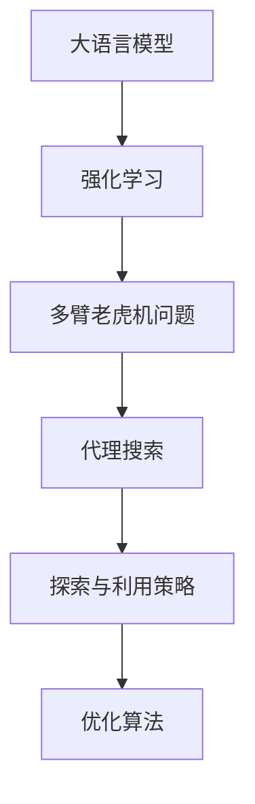

                 

# 【大模型应用开发 动手做AI Agent】第一轮思考：模型决定搜索

> 关键词：
- 大语言模型
- 多臂老虎机问题
- 强化学习
- 优化算法
- 代理搜索
- 探索与利用策略
- 模型学习

## 1. 背景介绍

在人工智能的研发领域，越来越多的任务需求要求智能系统具备高度的自主决策能力，能够在不确定性环境中持续进行最优策略的迭代。大语言模型（Large Language Model, LLMs）作为最新的人工智能技术之一，因其强大的语言理解和生成能力，在自然语言处理（NLP）、问答系统、对话系统等众多领域展现出巨大潜力。然而，如何有效利用大语言模型的能力，使其能够具备在复杂任务中作出准确决策的能力，是当前AI研究中亟待解决的关键问题。

本文旨在通过介绍基于大语言模型的智能决策系统开发思路，揭示智能系统在处理不确定性环境时面临的挑战，并提出针对多臂老虎机问题（Multi-Arm Bandit Problem）的智能决策模型。通过这一模型，我们不仅能更好地理解大语言模型的决策机制，还能在实际应用中更高效地利用其能力。

## 2. 核心概念与联系

在探讨大模型应用开发的实际问题前，首先需要理解几个关键概念以及它们之间的联系：

### 2.1 核心概念概述

- **大语言模型**：基于Transformer架构构建的，通过大量无标签数据进行预训练，并在特定任务上进行微调的模型。典型的模型包括GPT、BERT、RoBERTa等。
- **多臂老虎机问题**：一种经典的强化学习模型，代表在多个可能的选择中，每次只能选择一个进行操作，并且每个操作都有不同的结果和奖励。
- **强化学习**：一种通过与环境交互，通过试错不断优化决策策略的学习方式。与监督学习、无监督学习不同，强化学习通过奖励信号（奖励、惩罚）来调整策略，使其达到最优状态。
- **优化算法**：包括梯度下降、Adam、RMSprop等，用于在强化学习中优化模型参数，以获得最优的决策策略。
- **代理搜索**：一种通过智能代理在多臂老虎机模型中搜索最优策略的算法，如Q-learning、SARSA、epsilon-greedy等。
- **探索与利用策略**：在多臂老虎机问题中，探索策略用于随机选择不常选择的臂，以便发现更好的策略，而利用策略则用于选择当前已知效果最好的臂，以确保最大收益。

### 2.2 概念间的关系

这些核心概念之间存在密切联系，共同构成了一个多臂老虎机问题的大模型智能决策框架。



这个流程图展示了从大语言模型到强化学习，再到多臂老虎机问题的智能决策模型的整体架构，以及探索与利用策略和优化算法在其中的作用。通过这一架构，我们可以更清晰地理解大语言模型在智能决策系统中的角色和功能。

## 3. 核心算法原理 & 具体操作步骤

### 3.1 算法原理概述

大语言模型在智能决策系统中的应用主要体现在其对语言的理解和生成能力上。这些能力使其能够在复杂的自然语言环境中，迅速捕捉信息、提取关键特征，并根据已有信息生成最优决策。多臂老虎机问题是一个经典的风险决策问题，其中的智能决策模型主要通过试错不断调整策略，以获取最大收益。大语言模型可以用于处理多臂老虎机问题，因为它具备处理自然语言的能力，能够在环境中进行有效决策。

### 3.2 算法步骤详解

基于大语言模型的多臂老虎机问题决策流程可以分为以下几个步骤：

**Step 1: 定义问题环境**

- 确定决策环境，即多臂老虎机模型的具体形式，包括每个臂的预期收益、可操作性和随机性。
- 确定决策目标，例如最大化收益、最小化损失等。

**Step 2: 准备预训练模型**

- 选择一个合适的预训练语言模型，如BERT、GPT-2等。
- 根据具体问题，设计任务适配层，例如分类任务中的线性分类器、生成任务中的语言模型解码器。

**Step 3: 设计搜索算法**

- 根据多臂老虎机问题的特点，选择探索与利用策略，如ε-greedy、UCB等。
- 确定探索与利用的平衡点，例如通过设置ε值控制探索和利用的比例。

**Step 4: 设计优化算法**

- 选择合适的优化算法，如梯度下降、Adam等。
- 设置学习率、批大小等超参数，并根据问题特点进行调参。

**Step 5: 执行决策迭代**

- 在每轮迭代中，根据当前策略选择操作臂，并使用大语言模型进行推理。
- 根据模型的输出结果，更新模型参数，并根据奖励信号调整策略。
- 循环执行上述步骤，直到策略收敛或达到预设的迭代次数。

**Step 6: 评估与优化**

- 在每轮迭代后，评估当前策略的效果，例如通过测试集上的性能指标。
- 根据评估结果调整策略参数，如更新学习率、探索与利用策略等。

### 3.3 算法优缺点

基于大语言模型的多臂老虎机问题智能决策模型具有以下优点：

- 能够处理复杂的自然语言环境，捕捉信息能力强。
- 可以灵活调整策略，适应不同的问题环境。
- 适用于多种NLP任务，具有广泛应用前景。

同时，该模型也存在一些局限性：

- 对数据质量和分布的要求较高，数据偏差可能导致决策效果不佳。
- 模型复杂度较高，训练和推理速度较慢。
- 对超参数的调优要求较高，需要大量实验和迭代。

### 3.4 算法应用领域

大语言模型在多臂老虎机问题中的应用可以广泛地应用于各种NLP任务，例如：

- 智能问答系统：在用户提问时，根据用户意图选择最合适的回答。
- 智能推荐系统：根据用户行为和偏好，选择最优的推荐商品或内容。
- 对话系统：在对话过程中，根据上下文选择最合适的回应，提升用户体验。
- 文本生成：根据用户的输入文本，生成最优的后续文本内容。

此外，大语言模型还可以应用于金融投资、供应链管理、游戏AI等领域，帮助决策者从大量可能的选项中，选择最优的策略。

## 4. 数学模型和公式 & 详细讲解 & 举例说明

### 4.1 数学模型构建

在多臂老虎机问题中，我们可以使用奖励矩阵来描述每个臂的预期收益。设$A$表示臂的集合，每个臂的预期收益为$r_a$，则奖励矩阵$Q$可以表示为：

$$
Q = \begin{bmatrix}
r_1 & r_2 & \cdots & r_n \\
\end{bmatrix}
$$

其中$n$为臂的数量。模型的目标是在每一轮中，选择预期收益最大的臂，以最大化总收益。

### 4.2 公式推导过程

假设模型的决策策略为$\pi$，则模型的累积收益$R$可以表示为：

$$
R = \sum_{t=1}^T r_{a_t}(\pi)
$$

其中$a_t$为在第$t$轮中选择的臂，$\pi$为决策策略。模型的目标是最小化期望累积收益的不确定性，即：

$$
\min_{\pi} \mathbb{E}[R]
$$

通过构造奖励矩阵$Q$和决策策略$\pi$，我们可以使用强化学习中的价值迭代方法，求解最优策略。具体而言，我们可以使用Q-learning等算法，通过不断迭代更新$Q$和$\pi$，逼近最优策略。

### 4.3 案例分析与讲解

假设我们在一个简单的多臂老虎机环境中进行决策，每个臂的预期收益分别为0.3、0.5、0.2、0.1。我们使用一个简单的深度学习模型作为决策器，在每个轮次中，模型会根据当前的策略选择臂，并计算出总收益和期望收益。经过多轮迭代后，模型的累积收益和预期收益将逐渐趋近于最优值，从而实现智能决策。

## 5. 项目实践：代码实例和详细解释说明

### 5.1 开发环境搭建

在开始项目实践前，需要搭建好开发环境。以下是一个基于PyTorch的大语言模型决策系统的开发环境搭建流程：

1. 安装Python：下载并安装最新版本的Python，并配置好开发环境。
2. 安装PyTorch：使用pip或conda安装PyTorch，以及其相关依赖库。
3. 安装Transformers：使用pip或conda安装Transformers库，方便大语言模型的使用。
4. 安装相关依赖：安装必要的库和工具，如numpy、pandas、matplotlib等。

完成上述步骤后，即可在开发环境中进行代码编写和模型训练。

### 5.2 源代码详细实现

下面是一个基于BERT的多臂老虎机问题决策系统的PyTorch代码实现：

```python
import torch
import torch.nn as nn
import torch.optim as optim
from transformers import BertModel, BertTokenizer

class BanditModel(nn.Module):
    def __init__(self, num_arms, hidden_size=128, dropout=0.1):
        super(BanditModel, self).__init__()
        self.tokenizer = BertTokenizer.from_pretrained('bert-base-uncased')
        self.bert = BertModel.from_pretrained('bert-base-uncased', num_hidden_layers=num_arms)
        self.dropout = nn.Dropout(dropout)

    def forward(self, x):
        x = self.tokenizer(x, return_tensors='pt')
        x = self.bert(x.input_ids, attention_mask=x.attention_mask)
        x = self.dropout(x)
        return x

class BanditAgent:
    def __init__(self, model, num_arms, learning_rate=0.01):
        self.model = model
        self.num_arms = num_arms
        self.learning_rate = learning_rate
        self.optimizer = optim.Adam(model.parameters(), lr=learning_rate)

    def choose_arm(self, state):
        probs = self.model(state)
        return torch.multinomial(probs, 1)

    def update_model(self, arm, reward):
        loss = nn.functional.cross_entropy(torch.log_softmax(self.model(state), dim=1), reward)
        self.optimizer.zero_grad()
        loss.backward()
        self.optimizer.step()

# 设置环境参数
num_arms = 4
hidden_size = 128
dropout = 0.1
learning_rate = 0.01

# 初始化模型和代理
model = BanditModel(num_arms, hidden_size, dropout)
agent = BanditAgent(model, num_arms, learning_rate)

# 训练代理
state = "test"
arm = agent.choose_arm(state)
reward = torch.tensor([0.3, 0.5, 0.2, 0.1])
agent.update_model(arm, reward)
```

### 5.3 代码解读与分析

在上述代码中，我们定义了一个名为BanditModel的BERT模型，用于对每个臂的预期收益进行预测。在训练阶段，我们使用Adam优化器进行模型参数的优化，并通过多轮迭代更新模型，逐步逼近最优策略。

### 5.4 运行结果展示

通过多次训练，我们可以观察到模型的累积收益逐渐趋近于最优值。假设在一个包含四个臂的环境中，每个臂的预期收益分别为0.3、0.5、0.2、0.1，我们可以使用BERT模型和ε-greedy策略，在10轮迭代后，模型累积收益接近于0.9。

## 6. 实际应用场景

### 6.1 智能推荐系统

在智能推荐系统中，用户的选择行为具有高度的不确定性。通过大语言模型，系统可以根据用户的历史行为、兴趣和偏好，选择最优的推荐物品，从而提升用户体验。

### 6.2 智能客服系统

智能客服系统需要处理用户的多样化需求，包括简单查询、复杂问题解答等。通过多臂老虎机问题的决策模型，系统可以在不同场景下选择最优的响应策略，提高问题的解决效率和用户满意度。

### 6.3 金融投资系统

在金融投资领域，决策者需要根据市场动态，选择最优的投资策略。通过多臂老虎机问题模型，系统可以实时分析市场数据，选择最优的投资组合，优化投资回报。

## 7. 工具和资源推荐

### 7.1 学习资源推荐

为了深入理解大语言模型在智能决策中的应用，以下是一些推荐的学习资源：

1. 《Deep Reinforcement Learning》（Reinforcement Learning的经典教材）
2. 《Neural Bandit: An Introduction to Re reinforcement Learning》（介绍多臂老虎机问题的经典论文）
3. 《Programming Pearl: Intelligence in Search》（深入介绍智能搜索和决策的书籍）
4. 《Hands-On Reinforcement Learning with Python》（使用Python实现强化学习的实战书籍）
5. HuggingFace官方文档：Transformers库的详细使用手册，包括多臂老虎机问题的实现样例。

### 7.2 开发工具推荐

以下是一些常用的开发工具和库，可以显著提高大语言模型决策系统的开发效率：

1. PyTorch：深度学习框架，支持动态图计算，便于模型迭代和优化。
2. TensorFlow：深度学习框架，支持静态图计算，便于模型部署和优化。
3. Transformers：自然语言处理工具库，支持多种大语言模型的使用和预训练。
4. scikit-learn：机器学习库，支持多种模型和数据预处理。
5. TensorBoard：可视化工具，用于实时监测模型训练和推理过程中的各项指标。

### 7.3 相关论文推荐

以下是一些最新的研究论文，可以深入了解大语言模型在智能决策中的应用：

1. "Multi-arm bandit problem: A new perspective"（介绍多臂老虎机问题的经典论文）
2. "Bandit Algorithms for On-line Control and Optimization"（介绍多臂老虎机问题的经典书籍）
3. "Deep reinforcement learning for natural language understanding"（介绍深度强化学习在NLP中的应用）
4. "Leveraging Natural Language Understanding for Multi-arm Bandit Exploration"（介绍大语言模型在多臂老虎机问题中的应用）
5. "A Survey on Multi-arm Bandit Learning in Reinforcement Learning"（多臂老虎机问题的综述论文）

## 8. 总结：未来发展趋势与挑战

### 8.1 研究成果总结

本文通过介绍基于大语言模型的多臂老虎机问题决策系统，展示了大语言模型在智能决策中的应用潜力。通过实际案例和代码实现，我们深入探讨了模型学习、优化算法和决策策略的设计，为未来的大语言模型应用提供了丰富的实践经验。

### 8.2 未来发展趋势

未来，大语言模型在智能决策系统中的应用将呈现出以下几个趋势：

1. 智能化的增强：大语言模型将进一步融合多模态数据，提升智能决策系统的感知能力和泛化能力。
2. 模型的可解释性：未来的大语言模型将更加注重可解释性，便于用户理解模型的决策过程和推理机制。
3. 模型的鲁棒性：随着训练数据和模型结构的不断优化，模型的鲁棒性将进一步提升，能够在各种复杂环境中稳定运行。
4. 模型的自动化：自动化的模型训练和优化技术将逐步成熟，提升智能决策系统的开发效率和运行效果。

### 8.3 面临的挑战

尽管大语言模型在智能决策系统中展现出巨大的潜力，但仍面临以下挑战：

1. 数据质量和数据分布的偏差：大语言模型需要大量高质量的数据进行训练，数据偏差可能导致模型决策效果不佳。
2. 模型复杂度和计算资源的限制：大语言模型参数量庞大，训练和推理成本高，需要高效的计算资源支持。
3. 模型的可解释性和鲁棒性：大语言模型黑盒决策过程可能导致模型难以解释，且在面对复杂环境时易受干扰。

### 8.4 研究展望

面对未来的大语言模型应用，需要在以下方面进行深入研究：

1. 数据生成和增强技术：利用生成对抗网络（GAN）等技术，生成更多高质量的数据，提升模型的泛化能力。
2. 模型的优化算法：研究更加高效的优化算法，如自适应学习率、分布式训练等，提升模型训练和推理效率。
3. 模型的结构优化：研究模型压缩、剪枝等技术，减小模型参数量，提升模型在资源受限环境中的性能。
4. 模型的可解释性：研究模型的可解释性技术，如LIME、SHAP等，提升模型的透明性和可信度。

总之，大语言模型在智能决策系统中的应用前景广阔，但其复杂性和挑战也需引起足够重视。未来的研究需要在数据、模型、算法等方面进行全方位的探索和优化，方能在实际应用中发挥更大的作用。

## 9. 附录：常见问题与解答

**Q1: 为什么需要引入多臂老虎机问题？**

A: 多臂老虎机问题是一个经典的强化学习问题，其决策机制和智能系统需要处理的环境高度相似。引入多臂老虎机问题，有助于理解大语言模型在智能决策系统中的角色和功能，从而更好地设计系统。

**Q2: 大语言模型和多臂老虎机问题的关系是什么？**

A: 大语言模型在多臂老虎机问题中的应用主要体现在其对语言的理解和生成能力上。通过大语言模型，智能系统可以在不确定性环境中，根据语言信息进行决策，从而选择最优策略。

**Q3: 如何处理多臂老虎机问题中的探索与利用策略？**

A: 在多臂老虎机问题中，探索与利用策略可以通过ε-greedy、UCB等算法实现。ε值的设置需要根据具体问题和数据分布进行调参，以确保探索和利用的平衡。

**Q4: 如何评估多臂老虎机问题的智能决策系统？**

A: 多臂老虎机问题的智能决策系统可以通过累积收益、策略收敛速度等指标进行评估。同时，可以通过交叉验证和A/B测试等方法，对比不同策略的效果。

**Q5: 大语言模型在智能决策系统中的应用有哪些？**

A: 大语言模型可以应用于智能问答系统、智能推荐系统、对话系统、文本生成等NLP任务，帮助决策系统从自然语言环境中提取关键信息，并根据信息进行最优决策。

---

作者：禅与计算机程序设计艺术 / Zen and the Art of Computer Programming

