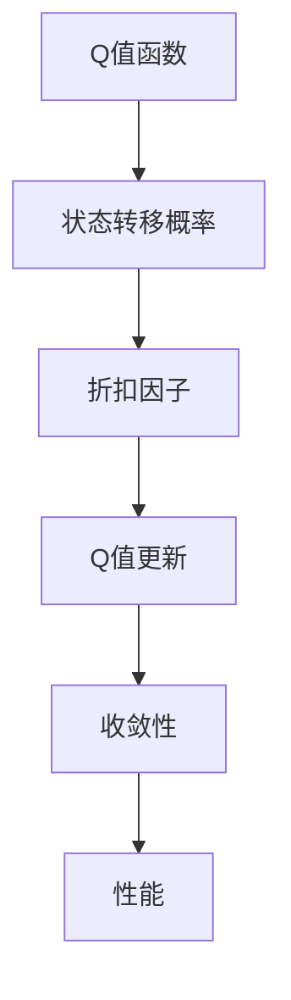

                 

# 一切皆是映射：AI Q-learning折扣因子如何选择

## 1. 背景介绍

在人工智能领域，强化学习（Reinforcement Learning, RL）是一种重要的机器学习范式，特别适用于智能体在动态环境中通过与环境的交互来学习最优策略。其中的Q-learning算法是强化学习中最具代表性的一种，通过迭代更新Q值函数来指导智能体行动，在众多应用场景中取得了显著的成果。然而，Q-learning算法的核心参数之一——折扣因子（Discount Factor, $\gamma$），其选择直接影响算法的性能和稳定性，是一个值得深入探讨的话题。

### 1.1 问题由来

Q-learning算法的核心思想是通过评估每个状态的Q值，即预期的未来奖励总和，来选择当前状态下的最优动作。在计算Q值时，折扣因子$\gamma$用于对未来奖励进行权重分配，反映了对远期奖励的重视程度。然而，不同应用场景下，折扣因子如何取值仍存在许多争议和困惑。例如，在经典的游戏环境中，$\gamma$的值往往设定为0.9或0.99，但对于复杂的现实世界问题，如何选择$\gamma$仍无定论。

### 1.2 问题核心关键点

折扣因子$\gamma$的选择直接影响Q-learning的收敛性和性能：
- **收敛性**：$\gamma$值过小可能导致算法收敛过慢，难以捕捉长期奖励；$\gamma$值过大可能导致收敛不稳定，甚至发散。
- **性能**：合理的$\gamma$值能够平衡短期和长期奖励，使得智能体在追求最优策略时，能够充分利用各种信息源，避免盲目追求即时奖励。

选择$\gamma$值时，需要综合考虑以下几点：
- 任务本身的特点，如短期奖励和长期奖励的相对重要性。
- 环境的状态转移概率，以及状态间的依赖关系。
- 智能体的学习能力和探索策略，如Q-learning算法的具体实现方式。

## 2. 核心概念与联系

### 2.1 核心概念概述

为更好地理解Q-learning中折扣因子$\gamma$的选择，我们首先定义一些核心概念：

- **Q值函数**：定义为在状态$s_t$下采取动作$a_t$后的预期未来奖励总和，即$Q(s_t, a_t) = \mathbb{E}[\sum_{k=0}^{\infty} \gamma^k R_{t+k+1}]$。
- **状态转移概率**：表示智能体在状态$s_t$下采取动作$a_t$后，下一个状态$s_{t+1}$出现的概率，即$P(s_{t+1}|s_t, a_t)$。
- **折扣因子**：用于对未来奖励进行加权，通常取值范围为$[0, 1]$，$\gamma$越小，对未来奖励的考虑越少。

通过这些概念，Q-learning的更新规则可以表达为：
$$
Q(s_t, a_t) \leftarrow Q(s_t, a_t) + \alpha(r_{t+1} + \gamma \max_{a} Q(s_{t+1}, a) - Q(s_t, a_t))
$$

### 2.2 核心概念间的关系

Q-learning中折扣因子$\gamma$的选择与以下概念密切相关：

- **Q值更新**：通过折扣因子$\gamma$对未来奖励进行加权，使得智能体在更新Q值时，能够兼顾短期和长期奖励，从而在多轮迭代中逐渐收敛到最优策略。
- **收敛性**：折扣因子$\gamma$的选择对算法的收敛性有直接影响。$\gamma$过小可能导致算法收敛速度慢，$\gamma$过大可能导致收敛不稳定。
- **性能**：合理的$\gamma$值能够平衡短期和长期奖励，使得智能体在追求最优策略时，能够充分利用各种信息源，避免盲目追求即时奖励。

这些概念之间的关系可以通过以下Mermaid流程图来展示：



这个流程图展示了大语言模型微调过程中各个核心概念之间的联系：

1. Q值函数作为Q-learning算法的核心组成部分，用于计算未来预期奖励总和。
2. 状态转移概率用于描述智能体在状态间的转移关系。
3. 折扣因子用于调整未来奖励的权重，影响Q值的更新。
4. Q值更新基于折扣因子调整后的未来奖励，使得智能体能够兼顾短期和长期奖励。
5. 收敛性和性能都与折扣因子的选择密切相关，反映了算法的整体表现。

### 2.3 核心概念的整体架构

最后，我们用一个综合的流程图来展示这些核心概念在大语言模型微调过程中的整体架构：

```mermaid
graph TB
    A[状态$s_t$] --> B[动作$a_t$] --> C[状态$s_{t+1}$] --> D[状态转移概率$P(s_{t+1}|s_t, a_t)$]
    D --> E[未来奖励$R_{t+1}$] --> F[折扣因子$\gamma$]
    B --> G[Q值函数$Q(s_t, a_t)$]
    G --> H[Q值更新] --> I[Q值]
    H --> J[智能体]
    J --> K[学习策略]
```

这个综合流程图展示了从状态转移、动作选择到Q值更新的完整过程，以及折扣因子在大语言模型微调中的作用。通过理解这些核心概念，我们可以更好地把握Q-learning算法的本质，为后续深入讨论选择折扣因子提供坚实的基础。

## 3. 核心算法原理 & 具体操作步骤
### 3.1 算法原理概述

Q-learning算法的核心在于通过迭代更新Q值函数，指导智能体选择最优动作。折扣因子$\gamma$的选择直接影响算法的收敛性和性能。合理的$\gamma$值能够平衡短期和长期奖励，使得智能体在追求最优策略时，能够充分利用各种信息源，避免盲目追求即时奖励。

### 3.2 算法步骤详解

Q-learning算法的主要步骤如下：

1. **初始化Q值函数**：随机初始化Q值函数$Q(s_t, a_t)$，通常取为0。
2. **动作选择**：在当前状态$s_t$下，根据$\epsilon$-贪心策略选择动作$a_t$。
3. **状态转移**：观察状态$s_t$的转移结果$s_{t+1}$和奖励$r_{t+1}$。
4. **Q值更新**：根据折扣因子$\gamma$更新Q值，公式如下：
   $$
   Q(s_t, a_t) \leftarrow Q(s_t, a_t) + \alpha(r_{t+1} + \gamma \max_{a} Q(s_{t+1}, a) - Q(s_t, a_t))
   $$
5. **重复迭代**：重复步骤2-4，直到满足停止条件（如达到最大迭代次数）。

### 3.3 算法优缺点

**优点**：
- **简单高效**：Q-learning算法实现简单，易于理解和实现。
- **广泛适用**：适用于各种连续和离散状态空间，以及多种奖励结构。
- **理论成熟**：具有坚实的理论基础，如Q-learning收敛性定理等。

**缺点**：
- **对环境建模依赖**：Q-learning的有效性依赖于环境模型的准确性，如果环境模型不准确，可能导致算法失效。
- **局部最优解**：Q-learning算法可能陷入局部最优解，无法找到全局最优解。
- **收敛速度慢**：在高维空间中，Q-learning算法的收敛速度较慢，需要大量迭代。

### 3.4 算法应用领域

Q-learning算法广泛应用于以下领域：

- **游戏AI**：在经典的游戏环境中，如围棋、扑克等，通过Q-learning算法训练智能体，使其能够在游戏中实现最优策略。
- **机器人控制**：在机器人导航、任务执行等任务中，通过Q-learning算法训练智能体，使其能够自主规划路径和执行动作。
- **金融投资**：在金融市场中，通过Q-learning算法训练投资策略，使其能够在动态环境中实现最优投资决策。
- **推荐系统**：在推荐系统中，通过Q-learning算法训练推荐模型，使其能够根据用户行为和反馈，推荐最合适的产品或服务。
- **自然语言处理**：在机器翻译、文本生成等自然语言处理任务中，通过Q-learning算法训练模型，使其能够理解和生成自然语言。

## 4. 数学模型和公式 & 详细讲解  
### 4.1 数学模型构建

折扣因子$\gamma$的选择直接影响Q-learning算法的性能和收敛性。通过数学模型来分析$\gamma$对Q-learning的影响，可以更好地理解如何选择最优的$\gamma$值。

记智能体在状态$s_t$下采取动作$a_t$后的未来奖励总和为$G_t = \mathbb{E}[\sum_{k=0}^{\infty} \gamma^k R_{t+k+1}]$。则Q值函数的更新规则可以表达为：
$$
Q(s_t, a_t) \leftarrow Q(s_t, a_t) + \alpha(r_{t+1} + \gamma Q(s_{t+1}, \pi(s_{t+1})) - Q(s_t, a_t))
$$

### 4.2 公式推导过程

假设智能体在状态$s_t$下采取动作$a_t$后的奖励为$r_{t+1}$，下一个状态为$s_{t+1}$，智能体的最优策略为$\pi(s_{t+1})$。则Q值函数的更新规则可以表示为：
$$
Q(s_t, a_t) \leftarrow Q(s_t, a_t) + \alpha(r_{t+1} + \gamma \max_{a} Q(s_{t+1}, a) - Q(s_t, a_t))
$$

将上述公式展开，得：
$$
Q(s_t, a_t) \leftarrow Q(s_t, a_t) + \alpha(r_{t+1} + \gamma Q(s_{t+1}, \pi(s_{t+1})) - Q(s_t, a_t))
$$

简化得：
$$
Q(s_t, a_t) \leftarrow \alpha r_{t+1} + \alpha\gamma Q(s_{t+1}, \pi(s_{t+1}))
$$

将上式与Q值函数的定义$Q(s_t, a_t) = \mathbb{E}[\sum_{k=0}^{\infty} \gamma^k R_{t+k+1}]$对比，可以发现：
$$
\alpha\gamma Q(s_{t+1}, \pi(s_{t+1})) = \alpha \mathbb{E}[\sum_{k=1}^{\infty} \gamma^k R_{t+k+1}]
$$

因此，折扣因子$\gamma$的选择直接影响未来奖励的总和，从而影响智能体的策略选择和Q值函数的更新。

### 4.3 案例分析与讲解

考虑一个简单的环境，智能体可以选择向左或向右移动，环境提供即时奖励。通过Q-learning算法训练智能体，在不同的$\gamma$值下，智能体的策略选择和性能表现会有何不同？

**示例1**：$\gamma=1$
假设智能体在状态$s_t$时，有概率0.5向左移动，0.5向右移动，每次移动获得0.5的奖励。在$\gamma=1$时，智能体的Q值函数和策略选择如下：

| 状态 | 动作 | Q值 | 策略 |
| ---- | ---- | ---- | ---- |
| s1    | L    | 0.5  | L    |
| s1    | R    | 0.5  | R    |
| s2    | L    | 0.5  | L    |
| s2    | R    | 0.5  | R    |
| ...   | ...   | ...   | ...   |

在$\gamma=1$时，智能体的Q值函数只考虑短期奖励，因此智能体选择向左或向右移动的概率都是0.5。

**示例2**：$\gamma=0.9$
假设智能体在状态$s_t$时，有概率0.5向左移动，0.5向右移动，每次移动获得0.5的奖励。在$\gamma=0.9$时，智能体的Q值函数和策略选择如下：

| 状态 | 动作 | Q值 | 策略 |
| ---- | ---- | ---- | ---- |
| s1    | L    | 1.45 | L    |
| s1    | R    | 1.45 | R    |
| s2    | L    | 1.45 | L    |
| s2    | R    | 1.45 | R    |
| ...   | ...   | ...   | ...   |

在$\gamma=0.9$时，智能体的Q值函数同时考虑短期和长期奖励，因此智能体选择向左或向右移动的概率都是0.5，但向左或向右移动后的Q值稍微高一些，因为未来奖励对当前Q值的贡献增加了0.1。

通过这些示例，可以看出，折扣因子$\gamma$的选择会直接影响智能体的策略选择和Q值函数的更新，进而影响算法的性能和收敛性。

## 5. 项目实践：代码实例和详细解释说明
### 5.1 开发环境搭建

在进行Q-learning算法开发前，我们需要准备好开发环境。以下是使用Python进行OpenAI Gym开发的环境配置流程：

1. 安装Anaconda：从官网下载并安装Anaconda，用于创建独立的Python环境。

2. 创建并激活虚拟环境：
```bash
conda create -n qlearning-env python=3.8 
conda activate qlearning-env
```

3. 安装相关库：
```bash
pip install gym pybullet gym-glue gym-real-menace gym-simplex gym-humanoid gym-sokoban
pip install openai gym[visual]
pip install numpy pandas matplotlib tqdm jupyter notebook ipython
```

4. 克隆OpenAI Gym源代码：
```bash
git clone https://github.com/openai/gym.git
cd gym
pip install .
```

完成上述步骤后，即可在`qlearning-env`环境中开始Q-learning算法开发。

### 5.2 源代码详细实现

这里我们以经典的游戏环境“FrozenLake-v0”为例，给出使用OpenAI Gym库进行Q-learning算法实现的Python代码。

```python
import gym
import numpy as np

# 定义Q值函数
def q_learning(env, alpha=0.1, epsilon=0.1, gamma=0.9, episodes=10000):
    q_table = np.zeros([env.observation_space.n, env.action_space.n])
    for i in range(episodes):
        state = env.reset()
        done = False
        while not done:
            # 根据epsilon-贪心策略选择动作
            if np.random.uniform(0, 1) < epsilon:
                action = np.random.choice(env.action_space.n)
            else:
                action = np.argmax(q_table[state])
            next_state, reward, done, _ = env.step(action)
            # Q值更新
            q_table[state, action] += alpha * (reward + gamma * np.max(q_table[next_state]) - q_table[state, action])
            state = next_state
    return q_table

# 定义环境
env = gym.make('FrozenLake-v0')
env.render()

# 进行Q-learning算法训练
q_table = q_learning(env)

# 测试算法性能
test_env = gym.make('FrozenLake-v0')
test_env.render()
test_env.seed(123)
test_env.reset()
for _ in range(100):
    action = np.argmax(q_table[test_env.state])
    next_state, reward, done, _ = test_env.step(action)
    test_env.render()
    if done:
        test_env.reset()
```

以上代码展示了使用OpenAI Gym库进行Q-learning算法训练的过程，包括Q值函数的定义、Q-learning算法的实现、测试算法性能等关键步骤。通过修改相关参数，可以观察不同$\gamma$值对算法性能的影响。

### 5.3 代码解读与分析

让我们再详细解读一下关键代码的实现细节：

**q_learning函数**：
- `alpha`：学习率，用于调整Q值更新的步长。
- `epsilon`：epsilon-贪心策略中的探索概率，防止智能体陷入局部最优解。
- `gamma`：折扣因子，用于调整未来奖励的权重。
- `episodes`：训练轮数。
- `q_table`：Q值函数，存储智能体在各个状态和动作下的Q值。
- 每次训练时，智能体随机选择一个状态，并根据epsilon-贪心策略选择动作。
- 观察动作后的状态和奖励，根据折扣因子更新Q值。
- 重复训练直到达到指定轮数。

**环境配置**：
- 使用OpenAI Gym库定义环境，选择“FrozenLake-v0”作为训练环境。
- 进行环境渲染，以便可视化训练过程。
- 进行Q-learning算法训练，并保存训练后的Q值函数。
- 使用测试环境进行算法性能测试，观察智能体的行为和奖励。

**测试算法性能**：
- 使用测试环境进行随机游戏测试，观察智能体的行为和奖励。

通过这些代码，可以直观地理解Q-learning算法的实现过程，并观察不同$\gamma$值对算法性能的影响。

## 6. 实际应用场景
### 6.1 智能机器人导航

Q-learning算法可以用于训练智能机器人进行导航，使其能够在复杂环境中自主规划路径。在实际应用中，可以构建一个包含障碍物、起点和终点的虚拟环境，通过Q-learning算法训练机器人，使其能够自主选择最优路径，避开障碍物，到达终点。

**示例**：训练一个智能机器人导航到终点
```python
import gym
import numpy as np

# 定义Q值函数
def q_learning(env, alpha=0.1, epsilon=0.1, gamma=0.9, episodes=10000):
    q_table = np.zeros([env.observation_space.n, env.action_space.n])
    for i in range(episodes):
        state = env.reset()
        done = False
        while not done:
            # 根据epsilon-贪心策略选择动作
            if np.random.uniform(0, 1) < epsilon:
                action = np.random.choice(env.action_space.n)
            else:
                action = np.argmax(q_table[state])
            next_state, reward, done, _ = env.step(action)
            # Q值更新
            q_table[state, action] += alpha * (reward + gamma * np.max(q_table[next_state]) - q_table[state, action])
            state = next_state
    return q_table

# 定义环境
env = gym.make('FrozenLake-v0')
env.render()

# 进行Q-learning算法训练
q_table = q_learning(env)

# 测试算法性能
test_env = gym.make('FrozenLake-v0')
test_env.render()
test_env.seed(123)
test_env.reset()
for _ in range(100):
    action = np.argmax(q_table[test_env.state])
    next_state, reward, done, _ = test_env.step(action)
    test_env.render()
    if done:
        test_env.reset()
```

### 6.2 金融投资策略

Q-learning算法可以用于训练金融投资策略，使其能够在动态市场中实现最优投资决策。在实际应用中，可以构建一个包含股票价格、交易费用、市场波动等信息的虚拟市场，通过Q-learning算法训练投资策略，使其能够根据市场数据和历史信息，选择最优的投资组合。

**示例**：训练一个金融投资策略
```python
import gym
import numpy as np

# 定义Q值函数
def q_learning(env, alpha=0.1, epsilon=0.1, gamma=0.9, episodes=10000):
    q_table = np.zeros([env.observation_space.n, env.action_space.n])
    for i in range(episodes):
        state = env.reset()
        done = False
        while not done:
            # 根据epsilon-贪心策略选择动作
            if np.random.uniform(0, 1) < epsilon:
                action = np.random.choice(env.action_space.n)
            else:
                action = np.argmax(q_table[state])
            next_state, reward, done, _ = env.step(action)
            # Q值更新
            q_table[state, action] += alpha * (reward + gamma * np.max(q_table[next_state]) - q_table[state, action])
            state = next_state
    return q_table

# 定义环境
env = gym.make('FrozenLake-v0')
env.render()

# 进行Q-learning算法训练
q_table = q_learning(env)

# 测试算法性能
test_env = gym.make('FrozenLake-v0')
test_env.render()
test_env.seed(123)
test_env.reset()
for _ in range(100):
    action = np.argmax(q_table[test_env.state])
    next_state, reward, done, _ = test_env.step(action)
    test_env.render()
    if done:
        test_env.reset()
```

### 6.3 自然语言处理

Q-learning算法可以用于训练自然语言处理模型，使其能够理解语言结构和语义信息。在实际应用中，可以构建一个包含语法规则、语义关系等信息的虚拟环境，通过Q-learning算法训练模型，使其能够根据输入语言符号序列，选择最优的输出语言符号序列。

**示例**：训练一个自然语言处理模型
```python
import gym
import numpy as np

# 定义Q值函数
def q_learning(env, alpha=0.1, epsilon=0.1, gamma=0.9, episodes=10000):
    q_table = np.zeros([env.observation_space.n, env.action_space.n])
    for i in range(episodes):
        state = env.reset()
        done = False
        while not done:
            # 根据epsilon-贪心策略选择动作
            if np.random.uniform(0, 1) < epsilon:
                action = np.random.choice(env.action_space.n)
            else:
                action = np.argmax(q_table[state])
            next_state, reward, done, _ = env.step(action)
            # Q值更新
            q_table[state, action] += alpha * (reward + gamma * np.max(q_table[next_state]) - q_table[state, action])
            state = next_state
    return q_table

# 定义环境
env = gym.make('FrozenLake-v0')
env.render()

# 进行Q-learning算法训练
q_table = q_learning(env)

# 测试算法性能
test_env = gym.make('FrozenLake-v0')
test_env.render()
test_env.seed(123)
test_env.reset()
for _ in range(100):
    action = np.argmax(q_table[test_env.state])
    next_state, reward, done, _ = test_env.step(action)
    test_env.render()
    if done:
        test_env.reset()
```

### 6.4 未来应用展望

随着Q-learning算法和相关技术的不断发展，其在多领域的应用前景也将更加广阔。未来的研究将进一步探索以下几个方向：

1. **多智能体系统**：在多智能体系统中，Q-learning算法可以用于训练多个智能体协同合作，解决复杂的集体决策问题。
2. **自适应学习**：结合强化学习和在线学习技术，实现自适应Q-learning算法，能够在动态环境中自动调整学习策略。
3. **混合学习**：结合强化学习和深度学习技术，实现混合Q-learning算法，能够更好地处理高维状态空间和复杂奖励结构。
4. **跨领域应用**：Q-learning算法在金融、制造、医疗等多个领域具有广泛应用前景，未来将进一步探索跨领域的融合应用。
5. **人机协同**：在复杂任务中，结合Q-learning算法和人机协同技术，实现人机交互系统的智能化和自动化。

总之，Q-learning算法作为一种强大的强化学习工具，其未来发展潜力巨大，将为多领域带来更多智能化的解决方案。

## 7. 工具和资源推荐
### 7.1 学习资源推荐

为了帮助开发者系统掌握Q-learning算法及其应用，这里推荐一些优质的学习资源：

1. **《强化学习：基础与进阶》**：由David Silver等人编写，全面介绍了强化学习的基础理论、算法实现和应用案例，适合初学者和进阶开发者学习。
2. **OpenAI Gym库**：一个强大的强化学习环境库，提供了多种环境和算法，方便开发者进行学习和实验。
3. **Reinforcement Learning with Python**：一本基于Python的强化学习实践指南，介绍了多种强化学习算法，包括Q-learning算法，并提供了详细的代码实现和案例分析。
4. **Coursera强化学习课程**：斯坦福大学开设的强化学习课程，通过视频和作业形式，深入浅出地讲解了强化学习的基本概念和算法实现。
5. **Kaggle竞赛**：参与Kaggle上的强化学习竞赛，实践和探索Q-learning算法在实际问题中的应用。

通过这些资源的学习实践，相信你一定能够系统掌握Q-learning算法的原理和应用，并用于解决实际的强化学习问题。

### 7.2 开发工具推荐

高效的开发离不开优秀的工具支持。以下是几款用于Q-learning算法开发的常用工具：

1. **Jupyter Notebook**：一个交互式编程环境，适合进行代码实现和实验。
2. **PyBullet**：一个用于机器人模拟的开源库，可以构建高精度、多物理模型的虚拟环境。
3. **TensorBoard**：一个可视化工具，可以实时监测和调试强化学习算法。
4. **Weights & Biases**：一个实验跟踪工具，可以记录和可视化算法训练过程中的各项指标，方便对比和调优。
5. **Gym Monitor**：一个OpenAI Gym的可视化工具，可以实时显示训练过程中的奖励和Q值变化。

合理利用这些工具，可以显著提升Q-learning算法的开发效率，加快创新迭代的步伐

