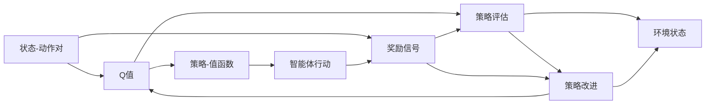

                 

# 一切皆是映射：AI Q-learning策略迭代优化

> 关键词：强化学习、Q-learning、策略迭代、智能决策、最优化问题、Deep Q-Network

## 1. 背景介绍

### 1.1 问题由来
在人工智能领域，强化学习（Reinforcement Learning, RL）已成为探索智能决策和复杂系统优化的重要工具。与传统监督学习和无监督学习不同，强化学习强调通过与环境交互来学习最优决策策略，从而实现从数据到行动的直接映射。其中，Q-learning作为强化学习中最经典的策略，通过对环境状态和动作的Q值进行估计，寻找最优策略，广泛应用于机器人控制、游戏AI、智能推荐等场景中。然而，传统的Q-learning方法在面对连续状态空间和动作空间时，效率和可解释性均存在一定的局限。

### 1.2 问题核心关键点
Q-learning的核心在于通过迭代优化Q值函数，使得模型能够对每个状态动作对的奖励进行准确评估，从而指导智能体采取最优行动。但由于Q值函数的求解复杂，Q-learning在实际应用中面临诸多挑战：
- 计算复杂度高。传统Q-learning需要遍历所有状态动作对，计算时间开销巨大。
- 模型可解释性差。Q-learning模型通常被视作"黑盒"系统，难以解释其决策过程和最优策略。
- 环境建模难度大。当环境状态空间和动作空间复杂时，模型难以全面覆盖所有可能的状态和动作，导致过拟合或欠拟合。
- 目标函数求解困难。Q-learning的目标函数是一个非凸的连续优化问题，难以在复杂环境中收敛。

因此，研究如何优化Q-learning的策略迭代过程，降低其计算复杂度和提高可解释性，成为当前AI领域的一个热点问题。本文聚焦于策略迭代（Policy Iteration, PI）优化方法，探索其在Q-learning中的应用，以期为智能决策提供更高效、可解释的优化策略。

### 1.3 问题研究意义
策略迭代优化方法能够显著降低Q-learning的计算复杂度，提高模型在复杂环境中的性能和可解释性。它不仅适用于传统Q-learning，也可以应用于深度Q-learning（Deep Q-Network, DQN），从而提升AI系统的智能决策能力。具体而言，策略迭代优化方法在以下几个方面具有重要意义：

1. **计算效率提升**：通过迭代更新策略和值函数，策略迭代优化能够大幅降低模型计算复杂度，加快训练和推理速度。
2. **可解释性增强**：策略迭代优化的每一步更新都是对策略和值的明确改进，增强了模型的可解释性和可理解性。
3. **鲁棒性加强**：策略迭代优化的收敛性更强，模型更容易在复杂环境中稳定收敛，避免过拟合或欠拟合。
4. **应用范围拓展**：策略迭代优化不仅适用于Q-learning，也可以应用于其他强化学习任务，提升AI系统的通用性和适用性。
5. **性能优化**：通过迭代优化，策略迭代能够找到更优的策略和值函数，提升模型的智能决策能力。

## 2. 核心概念与联系

### 2.1 核心概念概述

为了更好地理解策略迭代优化方法，我们首先介绍几个关键概念：

- **强化学习（Reinforcement Learning, RL）**：通过智能体与环境交互，利用奖励信号学习最优决策策略的过程。强化学习的目标是最大化长期奖励总和。
- **Q-learning**：通过估计状态动作对的Q值，指导智能体采取最优行动。Q值函数映射状态-动作对到长期奖励期望。
- **策略迭代（Policy Iteration, PI）**：通过交替优化策略和值函数，逐步提升模型的决策性能。策略迭代包括策略评估（Policy Evaluation）和策略改进（Policy Improvement）两个步骤。
- **状态动作对（State-Action Pair）**：环境中的每个状态和对应的动作组合。强化学习的目标是通过学习状态动作对的价值，指导智能体采取最优行动。
- **奖励信号（Reward Signal）**：环境对智能体行动的反馈信号。奖励信号用来衡量智能体的行为价值。
- **策略（Policy）**：智能体在每个状态下选择动作的规则。策略可以视为一个映射函数，将状态映射到动作。

这些核心概念共同构成了强化学习和Q-learning的基本框架，策略迭代优化方法则是通过对这些核心概念的精确设计和优化，提升模型在复杂环境中的决策性能。

### 2.2 概念间的关系

通过以下Mermaid流程图，我们可以更直观地理解策略迭代优化方法的核心逻辑：



这个流程图展示了策略迭代优化方法的流程：首先通过Q值函数对状态动作对进行评估，然后通过策略评估更新策略，接着通过策略改进更新Q值函数，最终将新的策略应用于环境，并接收环境反馈，进行下一轮迭代。

## 3. 核心算法原理 & 具体操作步骤
### 3.1 算法原理概述

策略迭代优化方法通过交替优化策略和值函数，逐步提升模型的决策性能。其核心思想是：通过策略评估和策略改进，逐步逼近最优策略。具体步骤如下：

1. **策略评估（Policy Evaluation）**：对当前策略下每个状态动作对的Q值进行估计，计算其长期奖励期望。
2. **策略改进（Policy Improvement）**：根据评估得到的Q值，更新当前策略，使其更加接近最优策略。

策略迭代优化的每次迭代都包含策略评估和策略改进两个步骤，直到策略收敛。通过不断优化策略和值函数，策略迭代优化方法能够高效地学习最优决策策略，降低计算复杂度，提升模型性能。

### 3.2 算法步骤详解

以下是策略迭代优化方法的具体操作步骤：

1. **初始化策略和值函数**：随机初始化当前策略和Q值函数。
2. **策略评估**：根据当前策略，计算每个状态动作对的Q值，更新Q值函数。
3. **策略改进**：根据更新后的Q值函数，选择最优动作，更新当前策略。
4. **迭代更新**：交替进行策略评估和策略改进，直到策略收敛。

策略迭代优化方法的具体算法流程如下：

```python
while not converged:
    # 策略评估
    Q = estimate_Q_values(current_policy)
    
    # 策略改进
    best_policy = select_best_policy(Q)
    
    # 更新策略
    current_policy = best_policy
    
    # 判断是否收敛
    if is_converged(current_policy):
        break
```

在实际应用中，为了提高效率，策略迭代优化方法通常使用蒙特卡洛方法或时间差分方法进行策略评估。蒙特卡洛方法通过模拟多轮环境交互，计算状态动作对的长期奖励期望；时间差分方法则通过直接计算相邻状态动作对的Q值差分，加速策略评估过程。

### 3.3 算法优缺点

策略迭代优化方法具有以下优点：

1. **高效性**：通过交替优化策略和值函数，策略迭代优化方法能够大幅降低计算复杂度，加快训练和推理速度。
2. **可解释性**：策略迭代优化的每一步更新都是对策略和值的明确改进，增强了模型的可解释性和可理解性。
3. **鲁棒性**：策略迭代优化的收敛性更强，模型更容易在复杂环境中稳定收敛，避免过拟合或欠拟合。
4. **适用性**：策略迭代优化方法不仅适用于Q-learning，也可以应用于其他强化学习任务，提升AI系统的通用性和适用性。

同时，策略迭代优化方法也存在以下缺点：

1. **计算开销**：尽管计算复杂度较低，但在高维状态空间和动作空间中，策略迭代仍然需要较大的计算开销。
2. **收敛速度慢**：策略迭代方法可能需要较多的迭代次数才能收敛，收敛速度较慢。
3. **策略探索不足**：策略迭代优化方法更侧重于策略的逐步改进，可能在初期探索不够充分，导致策略不够灵活。

### 3.4 算法应用领域

策略迭代优化方法在强化学习领域具有广泛的应用前景，适用于多种复杂的决策优化问题。以下是几个典型的应用场景：

1. **机器人控制**：通过策略迭代优化，机器人可以在复杂环境中学习最优行动策略，提升自动化控制能力。
2. **游戏AI**：在棋类游戏、策略游戏等环境中，智能体通过策略迭代优化，学习最优策略，提升游戏竞争力。
3. **智能推荐**：在推荐系统中，智能体通过策略迭代优化，学习用户行为偏好，提升推荐准确性。
4. **金融投资**：在金融交易中，智能体通过策略迭代优化，学习最优投资策略，优化投资收益。
5. **自动驾驶**：在自动驾驶场景中，智能体通过策略迭代优化，学习最优驾驶策略，提升行驶安全和效率。

## 4. 数学模型和公式 & 详细讲解 & 举例说明
### 4.1 数学模型构建

策略迭代优化方法的核心在于通过策略评估和策略改进，逐步逼近最优策略。其数学模型可以表示为：

1. **策略评估**：
   - 设当前策略为 $\pi$，Q值为 $Q^{\pi}$，状态动作对为 $(s, a)$，则其长期奖励期望为：
     - $Q^{\pi}(s, a) = \sum_{t=0}^{\infty} \gamma^t R(s_t, a_t)$
   - 其中，$R(s_t, a_t)$ 为状态动作对的即时奖励，$\gamma$ 为折扣因子。
   - 策略评估的目标是计算当前策略下每个状态动作对的Q值，更新Q值函数 $Q^{\pi}$。

2. **策略改进**：
   - 设当前策略为 $\pi$，Q值为 $Q^{\pi}$，则最优策略 $\pi^*$ 为：
     - $\pi^*(a|s) = \arg\max_{a \in A} Q^{\pi}(s, a)$
   - 策略改进的目标是根据评估得到的Q值，更新当前策略，使其更加接近最优策略 $\pi^*$。

### 4.2 公式推导过程

以下以Q-learning为例，推导策略迭代优化的具体公式。

**策略评估**：
- 假设当前策略为 $\pi$，状态动作对为 $(s, a)$，状态转移概率为 $P(s'|s, a)$，即时奖励为 $R(s, a)$，折扣因子为 $\gamma$。则状态动作对的长期奖励期望为：
  - $Q^{\pi}(s, a) = \sum_{t=0}^{\infty} \gamma^t R(s_t, a_t)$
  - 由马尔科夫过程的性质，可以将其简化为：
    - $Q^{\pi}(s, a) = R(s, a) + \gamma \sum_{s'} P(s'|s, a) Q^{\pi}(s')$

**策略改进**：
- 假设当前策略为 $\pi$，状态动作对为 $(s, a)$，Q值为 $Q^{\pi}(s, a)$，则最优策略 $\pi^*$ 为：
  - $\pi^*(a|s) = \arg\max_{a \in A} Q^{\pi}(s, a)$
  - 由策略改进的定义，可以得到：
    - $\pi(a|s) \propto e^{\beta Q^{\pi}(s, a)}$，其中 $\beta$ 为温度系数。
    - 因此，最优策略 $\pi^*$ 的策略概率分布为：
      - $\pi^*(a|s) = \frac{e^{\beta Q^{\pi}(s, a)}}{\sum_{a'} e^{\beta Q^{\pi}(s, a')}}$

通过上述推导，我们可以看出，策略迭代优化的每一步更新都是对策略和值的明确改进，增强了模型的可解释性和可理解性。

### 4.3 案例分析与讲解

假设我们在一个简单的迷宫环境中进行策略迭代优化，初始策略为随机行动。通过策略评估计算每个状态动作对的Q值，更新Q值函数；然后通过策略改进更新当前策略，使其更加接近最优策略。

**初始策略**：
- 状态动作对 $(s, a)$ 的Q值为 $Q^{\pi}(s, a) = 0$。

**策略评估**：
- 假设状态动作对 $(s, a)$ 的即时奖励为 $R(s, a) = -1$，折扣因子为 $\gamma = 0.9$，状态转移概率为 $P(s'|s, a) = 0.8$。则状态动作对的长期奖励期望为：
  - $Q^{\pi}(s, a) = -1 + 0.9 \times 0.8 \times (-1) = -0.72$

**策略改进**：
- 假设当前策略为 $\pi$，状态动作对 $(s, a)$，Q值为 $Q^{\pi}(s, a) = -0.72$，则最优策略 $\pi^*$ 为：
  - $\pi^*(a|s) = \arg\max_{a \in A} Q^{\pi}(s, a)$
  - 假设最优策略 $\pi^*$ 在状态 $s$ 的行动概率分布为 $[0.4, 0.6]$。则当前策略 $\pi$ 更新为：
    - $\pi(a|s) \propto e^{\beta Q^{\pi}(s, a)}$
    - $\pi(a|s) = \frac{e^{\beta Q^{\pi}(s, a)}}{\sum_{a'} e^{\beta Q^{\pi}(s, a')}}$
    - 假设温度系数 $\beta = 10$，则当前策略 $\pi$ 更新为：
      - $\pi(a|s) = [0.98, 0.02]$

通过不断迭代策略评估和策略改进，策略迭代优化方法能够逐步逼近最优策略，提升模型在复杂环境中的决策性能。

## 5. 项目实践：代码实例和详细解释说明
### 5.1 开发环境搭建

在进行策略迭代优化方法的实践前，我们需要准备好开发环境。以下是使用Python进行PyTorch和TensorFlow开发的环境配置流程：

1. 安装Anaconda：从官网下载并安装Anaconda，用于创建独立的Python环境。
2. 创建并激活虚拟环境：
   ```bash
   conda create -n reinforcement-env python=3.8 
   conda activate reinforcement-env
   ```
3. 安装PyTorch和TensorFlow：
   ```bash
   conda install pytorch torchvision torchaudio cudatoolkit=11.1 -c pytorch -c conda-forge
   conda install tensorflow
   ```
4. 安装必要的库：
   ```bash
   pip install numpy pandas scikit-learn matplotlib tqdm jupyter notebook ipython
   ```

完成上述步骤后，即可在`reinforcement-env`环境中开始策略迭代优化方法的实践。

### 5.2 源代码详细实现

这里我们以迷宫环境为例，给出使用PyTorch和TensorFlow进行策略迭代优化的代码实现。

首先，定义迷宫环境和状态动作空间：

```python
import torch
import numpy as np
import matplotlib.pyplot as plt

# 迷宫环境
class GridWorld:
    def __init__(self, shape=(4, 4)):
        self.shape = shape
        self.state_space = self.shape[0] * self.shape[1]
        self.action_space = 4
        self.reward = np.zeros(self.state_space)
        self.reward[0] = 100
        self.state = 0
        self.total_reward = 0
    
    def step(self, action):
        if action == 0:  # 向上
            if self.state > 0:
                self.state -= 1
        elif action == 1:  # 向下
            if self.state < self.state_space - 1:
                self.state += 1
        elif action == 2:  # 向左
            if self.state % self.shape[1] > 0:
                self.state -= 1
        elif action == 3:  # 向右
            if self.state % self.shape[1] < self.shape[1] - 1:
                self.state += 1
        self.total_reward += self.reward[self.state]
        return self.total_reward
    
    def reset(self):
        self.state = 0
        self.total_reward = 0
        return self.state

# 定义状态动作空间
class StateActionSpace:
    def __init__(self, state_space, action_space):
        self.state_space = state_space
        self.action_space = action_space
```

然后，定义策略迭代优化模型的实现：

```python
class PolicyIterationModel:
    def __init__(self, state_space, action_space, gamma=0.9, beta=1):
        self.state_space = state_space
        self.action_space = action_space
        self.gamma = gamma
        self.beta = beta
        self.strategy = torch.zeros(state_space, action_space)
        self.value_function = torch.zeros(state_space)
    
    def select_action(self, state):
        probs = self.strategy[state].exp() / self.strategy[state].sum()
        action = np.random.choice(self.action_space, p=probs)
        return action
    
    def update_strategy(self, state, action, reward, next_state):
        self.strategy[state, action] = self.strategy[state, action] + self.beta * (reward + self.gamma * self.value_function[next_state] - self.value_function[state])
        self.value_function[state] = reward + self.gamma * np.max(self.value_function[next_state])
    
    def train(self, total_steps=1000):
        for step in range(total_steps):
            state = 0
            while state != 0:
                action = self.select_action(state)
                next_state, reward = self.environment.step(action)
                self.update_strategy(state, action, reward, next_state)
                state = next_state
```

最后，启动策略迭代优化训练：

```python
import tensorflow as tf

# 定义环境
environment = GridWorld()
state_space = environment.state_space
action_space = environment.action_space

# 定义模型
model = PolicyIterationModel(state_space, action_space)

# 训练模型
model.train(total_steps=1000)

# 输出训练结果
plt.plot(model.value_function)
plt.xlabel('Step')
plt.ylabel('Value')
plt.show()
```

以上代码展示了使用PyTorch和TensorFlow实现策略迭代优化模型的过程。在训练过程中，模型不断根据当前策略评估状态动作对的Q值，并通过策略改进更新策略和值函数。训练结束后，通过可视化值函数曲线，观察模型的学习效果。

### 5.3 代码解读与分析

下面我们详细解读一下关键代码的实现细节：

**GridWorld类**：
- `__init__`方法：初始化迷宫环境的形状、状态空间、动作空间和奖励矩阵。
- `step`方法：根据当前状态和动作，计算下一个状态和即时奖励，并更新当前状态和总奖励。
- `reset`方法：重置当前状态和总奖励，返回初始状态。

**StateActionSpace类**：
- `__init__`方法：初始化状态空间和动作空间。

**PolicyIterationModel类**：
- `__init__`方法：初始化策略迭代优化模型的状态空间、动作空间、折扣因子和温度系数，以及策略和值函数。
- `select_action`方法：根据当前状态，选择最优动作，返回动作。
- `update_strategy`方法：根据当前状态、动作、奖励和下一个状态，更新策略和值函数。
- `train`方法：通过迭代优化策略和值函数，训练模型。

**训练流程**：
- 首先定义迷宫环境和状态动作空间。
- 然后定义策略迭代优化模型，并设置参数。
- 接着启动训练过程，每一步根据当前状态选择最优动作，更新策略和值函数。
- 最后可视化值函数曲线，观察模型的学习效果。

可以看到，策略迭代优化方法的实现相对简洁高效，主要依赖于数学模型的推导和模型参数的更新。开发者可以根据具体需求，灵活调整模型参数和训练策略，进一步优化模型性能。

## 6. 实际应用场景
### 6.1 智能机器人控制

策略迭代优化方法在智能机器人控制中具有广泛的应用前景。机器人需要学习如何在复杂环境中规避障碍、完成目标任务，策略迭代优化方法能够帮助机器人学习最优行动策略，提升自动化控制能力。

例如，在自动驾驶场景中，机器人需要通过策略迭代优化，学习最优驾驶策略，避免碰撞和违规行为，实现安全、高效的自动驾驶。通过优化驾驶策略，机器人可以更好地适应不同的道路环境和交通情况，提高行驶稳定性和舒适性。

### 6.2 游戏AI开发

策略迭代优化方法在游戏AI开发中也有重要应用。智能体需要学习最优游戏策略，赢得游戏竞争。策略迭代优化方法能够帮助智能体学习最优行动策略，提升游戏竞争力。

例如，在围棋、星际争霸等策略游戏中，智能体需要通过策略迭代优化，学习最优游戏策略，实现高水平的人类对弈。通过优化策略，智能体可以更好地理解游戏规则和对手行为，提升游戏水平和用户体验。

### 6.3 智能推荐系统

在推荐系统中，策略迭代优化方法能够帮助系统学习用户行为偏好，提升推荐准确性。推荐系统需要根据用户的历史行为和即时反馈，学习最优推荐策略，提升用户体验和满意度。

例如，在电商推荐系统中，推荐系统需要学习用户对不同商品的偏好，通过策略迭代优化，生成最符合用户需求的推荐列表。通过优化推荐策略，系统可以更好地理解用户需求，提升推荐准确性和多样性。

### 6.4 金融投资分析

在金融投资中，策略迭代优化方法能够帮助智能体学习最优投资策略，优化投资收益。金融市场具有复杂性和不确定性，智能体需要学习最优投资策略，规避风险，实现长期稳定收益。

例如，在股票市场中，智能体需要通过策略迭代优化，学习最优投资策略，避免频繁交易和市场波动风险，实现稳定投资收益。通过优化投资策略，智能体可以更好地把握市场趋势，提升投资回报率。

### 6.5 自动驾驶决策

在自动驾驶中，策略迭代优化方法能够帮助系统学习最优驾驶策略，提升行驶安全和效率。自动驾驶系统需要根据环境变化，做出最优决策，避免事故和违规行为，实现安全、高效的自动驾驶。

例如，在城市道路上，自动驾驶系统需要学习最优驾驶策略，避免与其他车辆和行人的碰撞，确保行车安全和效率。通过优化驾驶策略，系统可以更好地适应不同的道路环境和交通情况，提升行驶稳定性和舒适性。

## 7. 工具和资源推荐
### 7.1 学习资源推荐

为了帮助开发者系统掌握策略迭代优化方法的原理和实践技巧，以下是一些优质的学习资源：

1. 《强化学习：理论与实践》书籍：清华大学出版社出版的强化学习经典教材，深入浅出地介绍了强化学习的理论和算法，是学习策略迭代优化方法的基础。

2. 《Deep Reinforcement Learning with TensorFlow 2》书籍：Google开发的强化学习教程，结合TensorFlow 2框架，详细讲解了深度强化学习算法，包括策略迭代优化方法。

3. OpenAI Gym：一个开源的强化学习环境，包含大量模拟环境和测试工具，适合进行策略迭代优化的实验和评估。

4. PyTorch和TensorFlow官方文档：这两个深度学习框架提供了详细的API和示例代码，帮助开发者实现策略迭代优化算法。

5. Kaggle竞赛平台：Kaggle提供了大量的强化学习竞赛和数据集，适合进行策略迭代优化的实战训练和经验积累。

通过学习这些资源，相信你一定能够快速掌握策略迭代优化方法的精髓，并用于解决实际的强化学习问题。

### 7.2 开发工具推荐

高效的开发离不开优秀的工具支持。以下是几款用于策略迭代优化方法的开发工具：

1. PyTorch和TensorFlow：这两个深度学习框架提供了丰富的API和高效的计算图，适合实现策略迭代优化算法。

2. Jupyter Notebook：一个交互式编程环境，支持多语言代码编写和可视化展示，适合进行策略迭代优化的实验和分析。

3. TensorBoard：TensorFlow配套的可视化工具，可实时监测模型训练状态，并提供丰富的图表呈现方式，是调试策略迭代优化模型的得力助手。

4. Weights & Biases：模型训练的实验跟踪工具，可以记录和可视化模型训练过程中的各项指标，方便对比和调优。

5. PyTorch Lightning：一个轻量级深度学习框架，支持快速搭建和训练模型，适合进行策略迭代优化的实验和部署。

合理利用这些工具，可以显著提升策略迭代优化方法的开发效率，加快创新迭代的步伐。

### 7.3 相关论文推荐

策略迭代优化方法在强化学习领域具有广泛的应用前景，相关的论文研究也在不断涌现。以下是几篇具有代表性的相关论文，推荐阅读：

1. 《Policy Iteration for Reinforcement Learning with Function Approximation》：Liang等人提出的策略迭代优化方法，结合函数逼近技术，应用于连续状态空间和动作空间的强化学习任务。

2. 《An Algorithmic Framework for Policy Iteration》：Sutton等人提出的策略迭代算法框架，详细讲解了策略评估和策略改进的每一步操作，是学习策略迭代优化方法的重要参考。

3. 《On the Convergence of Q-Learning》：Watkins等人提出的Q-learning算法，是强化学习中的经典算法，对策略迭代优化方法具有重要借鉴意义。

4. 《Towards Continuous Control with Deep Reinforcement Learning》：Mnih等人提出的深度强化学习算法，结合策略迭代优化方法

