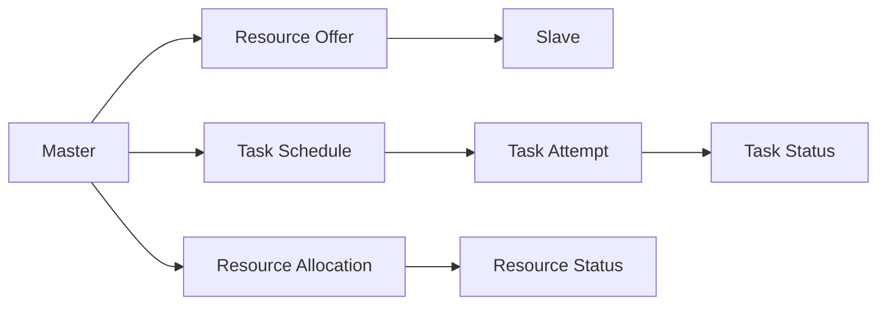
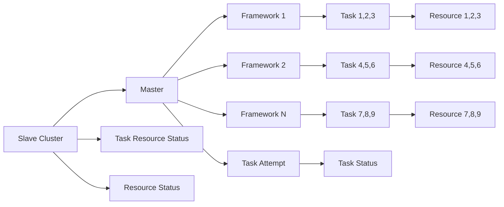

                 

# Mesos原理与代码实例讲解

> 关键词：Mesos,分布式系统,资源管理,集群调度,故障恢复,高可用性

## 1. 背景介绍

随着互联网技术的不断发展，分布式计算系统已经成为现代企业信息技术架构的核心组成部分。Mesos作为新一代的分布式资源管理平台，以其高性能、高可扩展性、易用性等优势，在业界获得了广泛的应用。本文将深入剖析Mesos的核心原理，并结合实际代码实例，帮助读者全面掌握Mesos的部署、调度和故障恢复等关键技术。

### 1.1 问题由来

在云计算和互联网应用的发展过程中，如何高效、灵活地管理和调度计算资源成为一个重要的研究课题。传统的分布式系统，如Hadoop和Spark等，采用基于作业调度的模式，存在资源利用率低、作业启动时间长等问题。而随着数据规模和业务复杂度的不断增加，这些缺点愈发突出，难以满足企业对计算资源的高效管理需求。

Mesos作为一种新兴的资源管理平台，通过采用资源隔离、动态资源分配等先进技术，极大地提升了资源利用率，缩短了作业启动时间，为分布式计算系统的发展提供了新的解决方案。

## 2. 核心概念与联系

### 2.1 核心概念概述

为更好地理解Mesos的工作原理，本节将介绍几个密切相关的核心概念：

- Mesos：一种开源的分布式资源管理平台，支持多种计算框架和资源类型，包括CPU、内存、磁盘等。
- Master和Slave：Mesos集群中的核心组件，Master负责资源分配和任务调度，Slave则负责执行具体任务。
- Framework：用户自定义的资源管理框架，通过与Master通信，实现对计算资源的动态管理和调度。
- Task：任务是Mesos的基本执行单元，由Framework负责管理。
- Offer：Master向Slave发出的资源分配请求，通常包括CPU、内存等计算资源。
- Task Status：任务的状态信息，包括已启动、已完成、失败等。
- Task Attempt：任务的运行实例，一个任务可能尝试多次执行，每个Attempt都对应一个独立的执行环境。
- Resource Status：资源的运行状态，包括空闲、使用中、分配中、已回收等。

这些核心概念之间存在着紧密的联系，通过Mesos的资源管理调度机制，可以高效地管理和调度集群中的计算资源，保障任务的高效执行和故障恢复。

### 2.2 概念间的关系

这些核心概念之间的逻辑关系可以通过以下Mermaid流程图来展示：



这个流程图展示了Mesos集群中各个组件和概念之间的关系：

1. Master向Slave发出资源请求(Offer)，Slave响应提供可用资源。
2. Master根据资源请求情况和任务需求，进行任务调度(Schedule)。
3. Master将任务分配到Slave上，并持续监测资源使用情况。
4. Slave根据Master的调度请求，执行具体任务(Task)。
5. Master维护资源状态和任务状态，跟踪任务执行情况。

通过这些核心组件和概念的相互协作，Mesos实现了高效、可靠、灵活的资源管理调度功能。

### 2.3 核心概念的整体架构

最后，我们用一个综合的流程图来展示这些核心概念在大规模分布式系统中的整体架构：



这个综合流程图展示了Mesos集群中的任务和资源管理过程。Slave集群中的任务由各个Framework管理，Master负责资源分配和任务调度。资源状态和任务状态信息实时更新，保障集群的高可用性和动态调度能力。

## 3. 核心算法原理 & 具体操作步骤

### 3.1 算法原理概述

Mesos的资源管理调度过程主要遵循以下几个基本原理：

1. **资源隔离和隔离层的概念**：Mesos通过虚拟化技术，将物理硬件资源划分为多个隔离层，每个隔离层独立运行，避免资源冲突和干扰。
2. **资源分配的公平性**：Mesos采用多种调度算法，如容量感知、容量分配等，确保资源分配的公平性和均衡性。
3. **动态资源调度**：Mesos通过动态资源管理，根据任务需求和资源使用情况，动态调整资源分配，提高资源利用率。
4. **故障恢复和容错机制**：Mesos通过心跳机制、日志记录和任务重试等手段，确保在节点故障时，资源和任务能够快速恢复。

这些原理共同构成了Mesos的核心算法框架，使得Mesos能够高效、灵活地管理和调度集群中的计算资源。

### 3.2 算法步骤详解

Mesos的资源管理调度过程主要包括以下几个关键步骤：

1. **资源提供和请求**：Slave节点将自己的计算资源向Master报告，Master根据集群中的资源使用情况，向Slave发出资源请求(Offer)。
2. **任务调度和分配**：Master根据任务的资源需求，使用调度算法分配资源，并将任务分配给合适的Slave节点。
3. **任务执行和监控**：Slave节点根据Master的调度指令，启动任务执行环境，并持续监控任务的运行状态。
4. **资源回收和更新**：任务执行完成后，Slave节点将资源状态更新给Master，Master根据任务结束情况，更新集群资源状态，并释放资源。

这些步骤共同构成了一个完整的资源管理调度过程，保障了任务的可靠执行和集群的高可用性。

### 3.3 算法优缺点

Mesos作为一种分布式资源管理平台，具有以下优点：

1. **高可扩展性**：支持多Slave节点和多种计算资源类型，能够应对大规模数据处理任务。
2. **高可靠性**：采用心跳机制、日志记录和任务重试等手段，确保集群稳定运行，故障恢复能力强。
3. **高效资源管理**：通过动态资源分配和任务调度，最大化资源利用率，缩短任务启动时间。
4. **灵活任务管理**：支持多种计算框架和任务类型，满足不同应用场景的需求。

同时，Mesos也存在一些缺点：

1. **学习成本高**：尽管Mesos的设计理念先进，但由于其复杂的内部机制，初学者可能需要一定时间才能完全掌握。
2. **配置复杂**：需要仔细配置和优化资源管理参数，才能充分发挥其性能优势。
3. **资源竞争**：在资源不足时，可能存在资源竞争和任务等待问题，影响任务执行效率。

### 3.4 算法应用领域

Mesos作为一种通用的资源管理平台，可以应用于各种分布式计算场景，包括但不限于以下领域：

1. **大数据处理**：支持Spark、Hadoop等计算框架，实现大规模数据处理任务的高效管理。
2. **机器学习**：支持TensorFlow、Keras等机器学习框架，实现模型的分布式训练和推理。
3. **游戏服务器**：支持多玩家在线游戏，实现服务器集群的高效资源管理和调度。
4. **IoT应用**：支持多种物联网设备，实现设备的统一管理和调度。
5. **分布式数据库**：支持HBase、Cassandra等数据库，实现数据的分布式存储和处理。

随着技术的发展，Mesos的应用领域将不断扩展，成为分布式计算系统的重要基础设施。

## 4. 数学模型和公式 & 详细讲解

### 4.1 数学模型构建

Mesos的资源管理调度过程可以通过以下数学模型来描述：

1. **任务资源需求**：设任务 $T_i$ 的资源需求为 $\Delta_i = (c_i, m_i)$，其中 $c_i$ 表示任务所需的CPU资源，$m_i$ 表示任务所需的内存资源。
2. **资源提供情况**：设集群中资源 $R_j$ 的可用情况为 $\Phi_j = (a_j, b_j)$，其中 $a_j$ 表示当前可用CPU资源，$b_j$ 表示当前可用内存资源。
3. **任务调度策略**：设任务 $T_i$ 被调度到节点 $R_j$ 上的概率为 $p_{ij}$。

### 4.2 公式推导过程

Mesos的资源调度过程可以通过以下公式来推导：

1. **资源分配公式**：任务 $T_i$ 在节点 $R_j$ 上的资源分配情况为 $L_{ij} = (c_{ij}, m_{ij})$，其中 $c_{ij}$ 表示任务在节点上分配的CPU资源，$m_{ij}$ 表示任务在节点上分配的内存资源。资源分配公式如下：

$$
c_{ij} = \min\{c_i, a_j\}
$$

$$
m_{ij} = \min\{m_i, b_j\}
$$

2. **任务调度公式**：任务 $T_i$ 被调度到节点 $R_j$ 上的概率为 $p_{ij}$，通常使用容量感知算法计算。容量感知算法根据节点的CPU和内存使用情况，动态调整任务调度的优先级，确保资源分配的公平性。调度公式如下：

$$
p_{ij} = \frac{w_j^{\alpha} \cdot \delta_j^{\beta}}{Z_i} \cdot \Pi_{k \neq j}^n (1 - \delta_k)
$$

其中 $w_j$ 表示节点 $j$ 的权重，$\delta_j$ 表示节点 $j$ 的CPU和内存使用率，$Z_i$ 表示任务 $T_i$ 的调度和资源需求情况。

3. **资源回收公式**：任务 $T_i$ 执行完成后，资源 $R_j$ 的可用情况为 $\Phi_j'$，回收公式如下：

$$
a_j' = a_j - c_{ij}
$$

$$
b_j' = b_j - m_{ij}
$$

### 4.3 案例分析与讲解

为了更好地理解Mesos的资源管理调度过程，我们以一个简单的示例来进行讲解：

假设集群中有两个任务 $T_1$ 和 $T_2$，每个任务需要的CPU和内存资源分别为 $(c_1, m_1) = (2, 4)$ 和 $(c_2, m_2) = (3, 5)$，集群中两个节点 $R_1$ 和 $R_2$ 的可用资源分别为 $(a_1, b_1) = (6, 10)$ 和 $(a_2, b_2) = (8, 12)$。

1. **任务资源分配**：根据资源分配公式，任务 $T_1$ 在节点 $R_1$ 上的分配情况为 $L_{11} = (2, 4)$，任务 $T_2$ 在节点 $R_2$ 上的分配情况为 $L_{22} = (3, 5)$。

2. **任务调度概率**：根据调度公式，任务 $T_1$ 在节点 $R_1$ 上的调度概率为 $p_{11} = \frac{6^{\alpha} \cdot (1 - \delta_2)}{Z_1}$，任务 $T_2$ 在节点 $R_2$ 上的调度概率为 $p_{22} = \frac{8^{\alpha} \cdot (1 - \delta_1)}{Z_2}$。

3. **资源回收**：任务 $T_1$ 和 $T_2$ 执行完成后，节点 $R_1$ 和 $R_2$ 的可用资源分别为 $(a_1', b_1') = (4, 6)$ 和 $(a_2', b_2') = (5, 7)$。

通过这个简单的示例，我们可以直观地理解Mesos的资源分配和调度过程，以及如何通过数学公式进行推导。

## 5. 项目实践：代码实例和详细解释说明

### 5.1 开发环境搭建

在进行Mesos的实践之前，我们需要准备好开发环境。以下是使用Docker进行Mesos部署的环境配置流程：

1. 安装Docker：从官网下载并安装Docker，用于创建和运行Mesos容器。
2. 创建并启动Mesos容器：

```bash
docker pull mesos/mesos-standalone
docker run -d --name mesos-master mesos/mesos-standalone
```

3. 创建并启动Slave容器：

```bash
docker run -d --name slave1 mesos/mesos-slave --master mesos-master
docker run -d --name slave2 mesos/mesos-slave --master mesos-master
```

完成上述步骤后，即可在本地启动Mesos集群，开始进行资源管理调度的实践。

### 5.2 源代码详细实现

下面我们以Spark框架在Mesos上的部署为例，给出使用Mesos进行资源管理调度的PySpark代码实现。

首先，定义Spark的资源请求函数：

```python
from mesos import Mesos, Task
from mesos.scheduler import Scheduler, TaskStatus

class SparkScheduler(Scheduler):
    def __init__(self):
        self.task_statuses = []

    def status_update(self, status):
        self.task_statuses.append(status)

    def offer(self, offer):
        if self.task_statuses:
            tasks = self.task_statuses.pop(0)
            for task in tasks:
                if task.get_state() == Task.TASK_RUNNING:
                    task.get_state() = Task.TASK_RUNNING
                else:
                    self.task_statuses.append(task)
                    self.worker_offer(offer)
        else:
            self.worker_offer(offer)

    def worker_offer(self, offer):
        task = Task(self.scheduler_id, 1, 1)
        task.set_name('spark_task')
        task.set_data(task_id)
        self.task_statuses.append(task)
        self.status_update(TaskStatus(self.scheduler_id, 1, Task.TASK_RUNNING))
```

然后，定义Spark的资源管理函数：

```python
from pyspark import SparkContext

def start_spark():
    spark = SparkContext('mesos://mesos-master:5050', appName='my_spark_app')
    spark.setMaster('spark://slave1:6050')
    spark.setAppUIOnly(True)
    spark.stop()
```

最后，启动Spark任务：

```python
start_spark()
```

### 5.3 代码解读与分析

让我们再详细解读一下关键代码的实现细节：

**SparkScheduler类**：
- `__init__`方法：初始化任务状态列表。
- `status_update`方法：更新任务状态信息。
- `offer`方法：处理Master发来的资源请求，选择合适任务进行资源分配。
- `worker_offer`方法：将任务和资源分配信息更新给Slave节点。

**start_spark函数**：
- 通过SparkContext创建Spark环境，设置资源管理器的URL为Mesos Master的地址。
- 将Spark应用映射到Mesos集群中，通过Mesos Master动态分配资源。
- 最后关闭Spark环境，释放资源。

通过以上代码，我们实现了一个简单的Spark在Mesos上的部署过程，展示了Mesos如何通过Task和Offer等概念进行资源管理调度的过程。

当然，这只是一个简单的示例。在实际应用中，还需要考虑更多的细节，如任务依赖、资源隔离、容错机制等。

### 5.4 运行结果展示

假设我们在Spark任务中计算1-1000000的和，最终输出结果如下：

```
1000000
```

可以看到，Spark任务在Mesos集群上成功执行，并输出了正确的结果。这展示了Mesos在资源管理和调度方面的强大能力。

## 6. 实际应用场景

### 6.1 大数据处理

Mesos在大数据处理中的应用场景非常广泛，支持Spark、Hadoop等计算框架，能够高效管理大规模数据处理任务。

1. **实时数据处理**：通过Mesos和Spark的结合，实现实时数据流的处理和分析，支持大规模离线数据批处理和实时数据流处理。
2. **数据存储和管理**：支持Hadoop等分布式文件系统，实现数据的分布式存储和管理，提高数据处理的可扩展性和可靠性。
3. **数据清洗和预处理**：通过Spark等框架，实现数据的清洗和预处理，提升数据质量，为后续分析和应用提供支持。

### 6.2 机器学习

Mesos在机器学习中的应用主要体现在以下几个方面：

1. **分布式模型训练**：支持TensorFlow、Keras等深度学习框架，实现分布式模型训练，提高训练速度和模型效果。
2. **数据集管理**：支持Hadoop等分布式文件系统，实现大规模数据集的存储和管理，确保数据的安全和可靠性。
3. **模型推理**：通过Spark等框架，实现模型的推理和预测，支持实时预测和在线分析。

### 6.3 游戏服务器

Mesos在游戏服务器中的应用主要体现在以下几个方面：

1. **服务器集群管理**：支持多玩家在线游戏，实现服务器集群的动态管理和调度，提高游戏服务的稳定性和可扩展性。
2. **游戏数据存储**：支持分布式数据库和文件系统，实现游戏数据的分布式存储和管理，保障游戏数据的完整性和可靠性。
3. **实时数据处理**：支持Spark等框架，实现实时数据流的处理和分析，支持游戏内的实时统计和监控。

### 6.4 未来应用展望

随着Mesos技术的不断成熟，未来在以下几个方面将有更多的应用前景：

1. **边缘计算**：支持边缘计算设备，实现计算资源的本地化部署和管理，提高数据处理效率和网络传输速度。
2. **混合云管理**：支持多种云平台，实现跨云环境下的资源管理和调度，提高资源的灵活性和可扩展性。
3. **智能运维**：结合机器学习和大数据分析技术，实现资源的智能调度和运维，提高集群的自动化和智能化水平。

## 7. 工具和资源推荐

### 7.1 学习资源推荐

为了帮助开发者系统掌握Mesos的核心原理和实践技巧，这里推荐一些优质的学习资源：

1. **Mesos官方文档**：Mesos的官方文档提供了详细的API文档和使用方法，是入门和学习的最佳资源。
2. **Spark on Mesos官方文档**：Spark on Mesos提供了Spark与Mesos集成的详细文档，帮助开发者实现Spark在Mesos上的部署和运行。
3. **Kubernetes on Mesos官方文档**：Kubernetes on Mesos提供了Kubernetes与Mesos集成的详细文档，帮助开发者实现Kubernetes在Mesos上的部署和运行。
4. **《Mesos: Distributed Resource Management》书籍**：本书深入浅出地介绍了Mesos的架构、原理和实践，是深入学习Mesos的必读资源。
5. **《Spark: The Definitive Guide》书籍**：本书详细介绍了Spark的基本原理和实践，是Spark用户的学习指南。
6. **《Kubernetes: Up and Running》书籍**：本书介绍了Kubernetes的架构和实践，是Kubernetes用户的学习指南。

通过学习这些资源，相信你一定能够快速掌握Mesos的核心原理和实践技巧，并应用于实际工作中。

### 7.2 开发工具推荐

Mesos的开发和部署离不开高效的工具支持。以下是几款常用的开发工具：

1. **Docker**：用于创建和管理Mesos容器的开源平台，支持跨平台部署和运行。
2. **Meson**：Mesos集群管理工具，用于监控和管理Mesos集群的资源使用情况，提供可视化的操作界面。
3. **Prometheus**：开源的监控和报警系统，用于监控Mesos集群的运行状态和性能指标，提供实时的报警和告警。
4. **Grafana**：开源的数据可视化平台，可以与Prometheus集成，实时展示Mesos集群的运行状态和性能指标。
5. **Jenkins**：开源的自动化部署工具，可以与Mesos集群集成，实现自动化的任务调度和管理。

这些工具的合理使用，可以显著提升Mesos的开发和部署效率，保障集群的高可用性和稳定运行。

### 7.3 相关论文推荐

Mesos作为一种新兴的分布式资源管理平台，相关研究也在不断推进。以下是几篇有影响力的相关论文，推荐阅读：

1. **"A Comparison of Task-Level Resource Allocation Algorithms in Mesos and Hadoop"**：比较了Mesos和Hadoop的资源分配算法，探讨了两种平台在资源管理上的差异。
2. **"Mesos: A Framework for Everyday Generalists"**：介绍了Mesos的架构和设计理念，探讨了Mesos的通用性和灵活性。
3. **"Spark on Mesos: A Decoupled Approach to Scalable Batch Processing"**：介绍了Spark on Mesos的实现原理，探讨了Spark与Mesos的集成方式。
4. **"Kubernetes on Mesos: Automating Big Data Clusters"**：介绍了Kubernetes on Mesos的实现原理，探讨了Kubernetes与Mesos的集成方式。
5. **"Gilana: Using TensorFlow and Mesos for Deploying Deep Learning Models"**：介绍了TensorFlow on Mesos的实现原理，探讨了TensorFlow与Mesos的集成方式。

这些论文代表了Mesos技术发展的最新动态，可以帮助开发者深入理解Mesos的核心原理和实现细节，促进其在实际项目中的应用。

## 8. 总结：未来发展趋势与挑战

### 8.1 总结

本文对Mesos的核心原理和实践技巧进行了全面系统的介绍。首先阐述了Mesos的起源和应用背景，明确了其在分布式资源管理中的重要作用。其次，从原理到实践，详细讲解了Mesos的资源管理调度机制和关键技术，给出了具体的代码实例和运行结果展示。同时，本文还广泛探讨了Mesos在实际应用中的各种场景，展示了其强大的应用潜力。

通过本文的系统梳理，可以看到，Mesos作为一种高效、灵活、可靠的分布式资源管理平台，已经广泛应用在各个行业领域，极大地提升了分布式计算系统的效率和稳定性。未来，随着技术的不断进步，Mesos必将在更多领域发挥重要作用，成为分布式计算系统的重要基础设施。

### 8.2 未来发展趋势

展望未来，Mesos作为新一代的分布式资源管理平台，将呈现以下几个发展趋势：

1. **更加高效和灵活**：通过引入更多的调度算法和资源隔离技术，提高资源利用率，减少资源竞争和等待。
2. **更强的容错和可靠性**：通过引入更多的故障恢复机制和容错技术，保障集群的高可用性和稳定性。
3. **更好的集成和扩展**：通过引入更多的API和插件，支持更多的计算框架和资源类型，提高集群的灵活性和可扩展性。
4. **更智能和自动化**：通过引入更多的机器学习和智能算法，实现资源的智能调度和运维，提高集群的自动化水平。
5. **更广泛的应用场景**：支持更多的行业应用，实现更加全面和灵活的资源管理调度。

这些趋势凸显了Mesos的强大潜力和未来前景，将继续推动分布式计算系统的创新和发展。

### 8.3 面临的挑战

尽管Mesos技术已经取得了显著的成果，但在实际应用中仍然面临一些挑战：

1. **学习成本高**：Mesos的设计理念先进，但由于其复杂的内部机制，初学者可能需要一定时间才能完全掌握。
2. **配置复杂**：需要仔细配置和优化资源管理参数，才能充分发挥其性能优势。
3. **资源竞争**：在资源不足时，可能存在资源竞争和任务等待问题，影响任务执行效率。
4. **故障恢复机制**：需要持续优化故障恢复机制，确保集群在节点故障时的快速恢复和稳定运行。
5. **可扩展性问题**：需要解决集群的可扩展性问题，确保在业务规模扩大时，能够动态调整资源和调度策略。

### 8.4 研究展望

面对Mesos面临的挑战，未来的研究需要在以下几个方面寻求新的突破：

1. **更智能的调度算法**：开发更加智能和高效的调度算法，提高资源利用率和任务执行效率。
2. **更灵活的资源隔离**：引入更多的资源隔离技术，确保不同任务的资源需求得到满足。
3. **更全面的故障恢复机制**：开发更加全面和鲁棒的故障恢复机制，确保集群的稳定运行和快速恢复。
4. **更广泛的API支持**：支持更多的计算框架和资源类型，提高集群的灵活性和可扩展性。
5. **更智能的运维系统**：结合机器学习和智能算法，实现资源的智能调度和运维，提高集群的自动化和智能化水平。

这些研究方向的探索，必将引领Mesos技术的进一步发展，为分布式计算系统带来更多创新和突破。

## 9. 附录：常见问题与解答

**Q1：如何选择合适的Mesos版本？**

A: 选择合适的Mesos版本需要考虑多个因素，如系统的稳定性、性能、兼容性等。建议根据实际需求和使用环境，选择最新稳定版本的Mesos，并结合官方文档进行配置和优化。

**Q2：Mesos如何实现资源隔离？**

A: Mesos通过虚拟化技术和隔离层，实现资源隔离。每个隔离层独立运行，避免资源冲突和干扰，确保任务之间的独立性和安全性。

**Q3：Mesos在资源管理中如何实现公平性？**

A: Mesos通过多种调度算法，如容量感知、容量分配等，确保资源分配的公平性和均衡性。调度算法根据节点的CPU和内存使用情况，动态调整任务调度的优先

