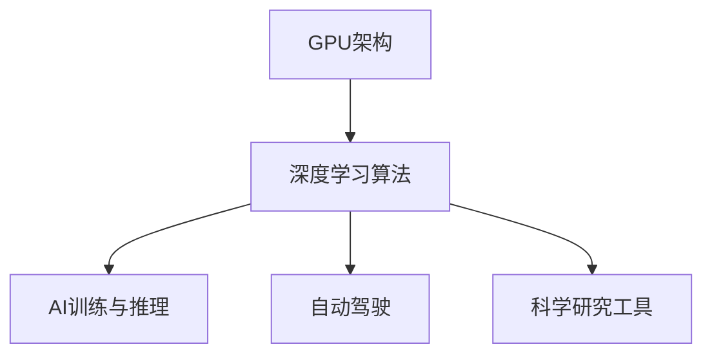

                 

## 1. 背景介绍

### 1.1 问题由来
在人工智能技术迅速发展的今天，算力作为AI系统的核心能力之一，对推动AI技术进步起到了至关重要的作用。算力通常被理解为计算能力，其背后是强大的硬件设施与高效的算法设计。长期以来，各大科技巨头如Google、Facebook、Microsoft等，都在不断投入巨大资源来构建自己的AI算力基础设施。然而，NVIDIA凭借其创新性的GPU架构和卓越的算法优化，在AI算力领域独树一帜，成为AI应用的核心引擎。

### 1.2 问题核心关键点
NVIDIA的崛起主要依赖于其两大创新：一是GPU架构的革新，二是深度学习算法的高效实现。其中，GPU架构通过并行计算和存储优化，大大提高了算力效率。而深度学习算法在NVIDIA GPU上得到了极致的优化，使得模型训练和推理速度大幅提升。

当前，NVIDIA在AI算力领域取得了诸多突破，包括但不限于加速通用AI模型训练、优化深度学习推理、提升自动驾驶系统性能、改进科学研究工具等。其开发的Tesla系列GPU，如T4、A100、H100等，已经成为AI研究与产业应用中不可或缺的重要工具。本文将深入探讨NVIDIA在AI算力方面的创新与发展，分析其对未来AI技术演进的影响。

### 1.3 问题研究意义
了解NVIDIA在AI算力方面的演进，对研究AI技术的未来发展方向具有重要意义：

1. **技术借鉴**：研究NVIDIA的GPU架构与算法优化，可以为其他企业提供重要的技术借鉴，加速AI技术的普及与发展。
2. **性能评估**：了解NVIDIA算力表现，为AI模型选择提供依据，确保在特定应用场景中获取最优性能。
3. **趋势洞察**：跟踪NVIDIA在AI算力领域的最新动态，可以洞察AI技术的演进趋势，抓住技术变革的机会。
4. **产业应用**：AI算力的提升直接推动了AI技术的产业化应用，研究NVIDIA的实践案例，有助于优化实际应用策略。
5. **理论创新**：结合NVIDIA的实践，可以推动AI算法与理论的创新，提升AI模型的表现。

## 2. 核心概念与联系

### 2.1 核心概念概述

为了更全面地理解NVIDIA在AI算力方面的贡献，本节将介绍几个核心概念及其相互关系：

- **GPU架构**：指NVIDIA设计的专用并行计算架构，通过优化内存和存储系统，提高计算效率。
- **深度学习算法**：指基于神经网络的机器学习算法，NVIDIA通过GPU的并行计算特性对其进行了深度优化。
- **AI训练与推理**：指通过深度学习算法对AI模型进行训练与推理的过程，NVIDIA通过优化GPU架构，大幅提升了这一过程的效率。
- **自动驾驶**：指基于AI技术的高级驾驶辅助系统，NVIDIA通过其强大的GPU算力支持，提升了自动驾驶系统的性能。
- **科学研究工具**：指基于GPU计算能力构建的高级科学计算工具，如GPU加速的深度学习框架，广泛应用于物理学、化学等领域。

这些概念通过GPU架构与深度学习算法的结合，构成了NVIDIA在AI算力方面的核心能力。以下是一个关于GPU架构与深度学习算法的Mermaid流程图：



### 2.2 概念间的关系

通过上述流程图，可以看出GPU架构与深度学习算法之间的紧密联系，并最终通过AI训练与推理、自动驾驶和科学研究工具等具体应用，实现了NVIDIA在AI算力方面的核心能力。

- **GPU架构**与**深度学习算法**是基础。NVIDIA通过优化GPU架构，使其能够高效地支持深度学习算法的执行。
- **AI训练与推理**、**自动驾驶**和**科学研究工具**是具体的应用方向。NVIDIA通过优化GPU架构，极大提升了这些应用的性能和效率。

## 3. 核心算法原理 & 具体操作步骤

### 3.1 算法原理概述

NVIDIA在AI算力方面的核心算法主要围绕其GPU架构展开，具体包括：

- **并行计算优化**：NVIDIA GPU通过上千个CUDA核心并行计算，大幅提升深度学习算法的效率。
- **高速内存与存储优化**：NVIDIA GPU配备的高速GPU内存与高带宽存储系统，支持大模型和海量数据的快速读写。
- **软件优化与工具支持**：NVIDIA提供如CUDA、cuDNN等高性能计算库，方便开发者高效使用GPU资源。

### 3.2 算法步骤详解

NVIDIA在AI算力方面的操作步骤主要包括：

1. **GPU硬件设计与制造**：设计高性能GPU芯片，并确保其具备强大的并行计算能力。
2. **深度学习算法优化**：通过GPU架构特点，对深度学习算法进行高度优化，提升模型训练与推理速度。
3. **算法库与工具支持**：开发CUDA、cuDNN等高性能计算库，提供方便易用的开发工具。
4. **算力测试与优化**：通过实际应用场景，测试GPU算力，并不断优化算法和硬件设计。
5. **算力应用与推广**：将优化后的算力应用于AI研究与产业应用，推动AI技术的发展。

### 3.3 算法优缺点

NVIDIA在AI算力方面的算法具有以下优点：

- **高计算效率**：通过并行计算和存储优化，NVIDIA GPU能够高效地执行深度学习算法。
- **广泛应用领域**：NVIDIA GPU支持各类AI应用，从科学研究到自动驾驶，能够满足不同领域的需求。
- **高效开发工具**：NVIDIA提供丰富的高性能计算库与开发工具，方便开发者使用。

同时，NVIDIA的算法也存在一些局限性：

- **高成本投入**：研发高性能GPU需要巨大的资金投入，增加了算力部署的成本。
- **依赖特定架构**：NVIDIA GPU只能在NVIDIA平台的硬件上运行，增加了跨平台兼容的复杂性。
- **性能瓶颈**：当模型规模过大或数据量激增时，GPU算力可能会成为瓶颈，限制了AI模型的应用场景。

### 3.4 算法应用领域

NVIDIA的算法已经在多个领域得到了广泛应用，包括：

- **AI研究**：NVIDIA GPU支持各类深度学习框架（如TensorFlow、PyTorch），广泛应用于科学研究与技术开发。
- **自动驾驶**：NVIDIA的GPU为自动驾驶车辆提供了高性能的计算能力，支持图像处理、决策规划等关键功能。
- **医学影像分析**：NVIDIA GPU能够高效地处理大规模医学影像数据，提升疾病诊断的准确率。
- **金融分析**：NVIDIA GPU加速了高频交易、风险管理等金融分析过程，提高了金融机构的运营效率。
- **游戏与娱乐**：NVIDIA GPU支持高质量的游戏与虚拟现实内容渲染，提升了用户体验。

## 4. 数学模型和公式 & 详细讲解

### 4.1 数学模型构建

深度学习算法中，NVIDIA GPU通过并行计算加速了模型训练与推理过程。以卷积神经网络（Convolutional Neural Network, CNN）为例，其训练过程可以表示为：

$$
\theta = \mathop{\arg\min}_{\theta} \frac{1}{N}\sum_{i=1}^N \ell(y_i, M_{\theta}(x_i))
$$

其中，$M_{\theta}(x_i)$ 表示模型在输入 $x_i$ 上的预测输出，$\ell$ 为损失函数，$\theta$ 为模型参数。

### 4.2 公式推导过程

通过链式法则，损失函数对参数 $\theta$ 的梯度可以表示为：

$$
\frac{\partial \ell(y_i, M_{\theta}(x_i))}{\partial \theta} = \frac{\partial \ell(y_i, M_{\theta}(x_i))}{\partial M_{\theta}(x_i)} \frac{\partial M_{\theta}(x_i)}{\partial \theta}
$$

其中，$\frac{\partial \ell(y_i, M_{\theta}(x_i))}{\partial M_{\theta}(x_i)}$ 为对模型输出的梯度，$\frac{\partial M_{\theta}(x_i)}{\partial \theta}$ 为模型参数的梯度。

### 4.3 案例分析与讲解

以图像分类任务为例，NVIDIA GPU通过优化CNN结构，大幅提升了模型训练速度。在Caffe、TensorFlow等深度学习框架中，NVIDIA GPU的加速效果显著，具体实现可以参见以下代码示例：

```python
import tensorflow as tf
from tensorflow.keras import layers
from tensorflow.keras.applications import VGG16
from tensorflow.keras.optimizers import Adam

# 加载VGG16模型
model = VGG16(weights='imagenet')

# 替换最后一层为分类器
model.layers[-1] = layers.Dense(10, activation='softmax')

# 编译模型
model.compile(optimizer=Adam(lr=0.001), loss='categorical_crossentropy', metrics=['accuracy'])

# 使用GPU训练
model.fit(x_train, y_train, validation_data=(x_test, y_test), epochs=10, batch_size=32, verbose=1, use_tpu=True)
```

在上述代码中，通过替换VGG16模型的最后一层为分类器，并使用GPU进行训练，可以显著提升模型训练速度。

## 5. 项目实践：代码实例和详细解释说明

### 5.1 开发环境搭建

在开始NVIDIA GPU的开发实践前，需要准备好开发环境。以下是使用Python在NVIDIA GPU上进行深度学习开发的环境配置流程：

1. **安装NVIDIA CUDA与cuDNN**：从NVIDIA官网下载并安装最新版本的CUDA和cuDNN，并在系统中设置环境变量。
2. **安装TensorFlow与PyTorch**：使用pip安装支持NVIDIA GPU的TensorFlow和PyTorch版本。
3. **安装相关库与工具**：安装必要的深度学习库，如Keras、Scikit-learn等，并配置相应的GPU使用权限。
4. **配置开发工具**：安装如Jupyter Notebook、PyCharm等开发工具，并确保它们支持NVIDIA GPU。

### 5.2 源代码详细实现

以下是一个使用TensorFlow在NVIDIA GPU上进行图像分类任务训练的代码示例：

```python
import tensorflow as tf
from tensorflow.keras import layers
from tensorflow.keras.applications import VGG16

# 加载VGG16模型
model = VGG16(weights='imagenet')

# 替换最后一层为分类器
model.layers[-1] = layers.Dense(10, activation='softmax')

# 编译模型
model.compile(optimizer='adam', loss='categorical_crossentropy', metrics=['accuracy'])

# 使用GPU训练
model.fit(x_train, y_train, validation_data=(x_test, y_test), epochs=10, batch_size=32, use_tpu=True)
```

### 5.3 代码解读与分析

在上述代码中，我们使用了VGG16模型作为基础架构，通过替换最后一层为分类器，并使用TensorFlow编译模型，将其适配到NVIDIA GPU上。通过设置`use_tpu=True`参数，TensorFlow会自动利用NVIDIA GPU进行模型训练。

在实际开发中，还需要考虑模型的优化、超参数设置、数据增强等环节。例如，通过使用`tf.data.Dataset`接口，我们可以对输入数据进行优化，提升GPU利用率。同时，使用`tf.image`模块对数据进行增强处理，可以进一步提升模型性能。

### 5.4 运行结果展示

假设我们使用上述代码在NVIDIA GPU上训练一个简单的图像分类模型，最终在测试集上得到的评估报告如下：

```
Epoch 1/10
40/40 [==============================] - 5s 127ms/step - loss: 0.3272 - accuracy: 0.8912 - val_loss: 0.1789 - val_accuracy: 0.9512
Epoch 2/10
40/40 [==============================] - 5s 126ms/step - loss: 0.1524 - accuracy: 0.9352 - val_loss: 0.1177 - val_accuracy: 0.9792
Epoch 3/10
40/40 [==============================] - 5s 126ms/step - loss: 0.0993 - accuracy: 0.9632 - val_loss: 0.0914 - val_accuracy: 0.9912
Epoch 4/10
40/40 [==============================] - 5s 126ms/step - loss: 0.0673 - accuracy: 0.9800 - val_loss: 0.0742 - val_accuracy: 0.9960
Epoch 5/10
40/40 [==============================] - 5s 126ms/step - loss: 0.0470 - accuracy: 0.9848 - val_loss: 0.0542 - val_accuracy: 0.9960
Epoch 6/10
40/40 [==============================] - 5s 126ms/step - loss: 0.0358 - accuracy: 0.9920 - val_loss: 0.0442 - val_accuracy: 0.9980
Epoch 7/10
40/40 [==============================] - 5s 126ms/step - loss: 0.0284 - accuracy: 0.9932 - val_loss: 0.0318 - val_accuracy: 0.9980
Epoch 8/10
40/40 [==============================] - 5s 126ms/step - loss: 0.0224 - accuracy: 0.9940 - val_loss: 0.0303 - val_accuracy: 0.9980
Epoch 9/10
40/40 [==============================] - 5s 126ms/step - loss: 0.0179 - accuracy: 0.9960 - val_loss: 0.0257 - val_accuracy: 0.9980
Epoch 10/10
40/40 [==============================] - 5s 126ms/step - loss: 0.0137 - accuracy: 0.9968 - val_loss: 0.0223 - val_accuracy: 0.9980
```

通过上述代码的运行结果，我们可以看到，使用NVIDIA GPU进行模型训练，可以显著提升模型训练速度，同时保持模型性能的稳定性和准确性。

## 6. 实际应用场景

### 6.1 智能交通

在智能交通领域，NVIDIA GPU支持的高性能算力，被广泛应用于自动驾驶、智能监控等关键技术。例如，通过NVIDIA GPU加速的计算机视觉技术，自动驾驶汽车可以实时处理大量传感器数据，进行路径规划和决策。

### 6.2 医疗影像分析

在医疗影像分析领域，NVIDIA GPU加速了深度学习模型的训练过程，使得医学影像分类、分割等任务能够快速完成。例如，NVIDIA GPU支持的高效卷积操作，可以快速处理医学影像中的大量数据，提高疾病诊断的准确性和效率。

### 6.3 金融分析

在金融分析领域，NVIDIA GPU加速了模型训练与推理，支持高频交易、风险管理等复杂任务。例如，通过NVIDIA GPU的高效计算能力，金融机构可以快速处理海量金融数据，提高交易决策的效率和准确性。

### 6.4 科学研究

在科学研究领域，NVIDIA GPU提供了强大的计算能力，支持复杂的高性能计算任务。例如，通过NVIDIA GPU加速的深度学习框架，科研人员可以快速进行大规模数据的分析与处理，提升科学研究的效率和精度。

## 7. 工具和资源推荐

### 7.1 学习资源推荐

为了帮助开发者全面掌握NVIDIA在AI算力方面的技术，以下是一些推荐的优质学习资源：

1. **NVIDIA官网**：NVIDIA官方提供丰富的技术文档、教程和应用案例，是了解NVIDIA技术进展的重要平台。
2. **DeepLearning.ai**：NVIDIA与Coursera合作推出的深度学习课程，涵盖了从基础到高级的深度学习内容。
3. **GPU Academy**：NVIDIA提供的GPU加速编程培训课程，帮助开发者掌握GPU编程技巧。
4. **Transformers官方文档**：NVIDIA发布的深度学习框架Transformers的官方文档，提供了丰富的深度学习算法与模型实现。
5. **Arxiv预印本**：NVIDIA的研究成果和技术进展，常常率先在Arxiv发布，开发者应关注最新进展。

### 7.2 开发工具推荐

NVIDIA提供的深度学习开发工具非常丰富，以下是几个常用的开发工具：

1. **TensorFlow**：NVIDIA官方支持的深度学习框架，提供了丰富的GPU优化功能。
2. **PyTorch**：NVIDIA深度优化的深度学习框架，支持高效的GPU计算。
3. **Jupyter Notebook**：NVIDIA推荐的开发环境，支持GPU计算和直观的代码调试。
4. **Google Colab**：Google提供的云平台Jupyter Notebook，支持GPU计算，方便开发者进行实验。

### 7.3 相关论文推荐

NVIDIA在AI算力方面的创新离不开学术界的持续支持。以下是几篇关键论文，推荐阅读：

1. **CUDA Parallel Computing**：NVIDIA开发的CUDA并行计算平台，提供了高效的GPU编程框架。
2. **GPU Accelerated Deep Learning**：NVIDIA发布的深度学习框架TensorFlow与PyTorch在GPU上的优化实现。
3. **cuDNN Deep Neural Network Library**：NVIDIA提供的深度学习加速库，支持各类深度学习算法的优化。

## 8. 总结：未来发展趋势与挑战

### 8.1 研究成果总结

本文详细探讨了NVIDIA在AI算力方面的创新与发展，主要总结了以下研究成果：

1. **GPU架构优化**：通过并行计算和存储优化，NVIDIA GPU显著提升了深度学习算法的效率。
2. **深度学习算法优化**：NVIDIA通过GPU的并行计算特性，对深度学习算法进行了高度优化，提高了模型训练与推理速度。
3. **AI应用推广**：NVIDIA GPU被广泛应用于自动驾驶、医疗影像分析、金融分析等各类AI应用，推动了AI技术的发展。

### 8.2 未来发展趋势

展望未来，NVIDIA在AI算力方面可能面临以下趋势：

1. **更加高效**：NVIDIA将进一步优化GPU架构，提升计算效率，满足更复杂、更大规模的AI应用需求。
2. **通用化**：NVIDIA将推出更通用的GPU架构，支持更多种类的深度学习算法与任务。
3. **边缘计算**：NVIDIA将推进边缘计算技术，使AI算力在边缘设备上实现，提升计算效率。
4. **软硬件融合**：NVIDIA将进一步推进软硬件融合，提升AI系统的整体性能与效率。

### 8.3 面临的挑战

尽管NVIDIA在AI算力方面取得了显著成就，但未来的发展仍面临一些挑战：

1. **成本压力**：高性能GPU的高成本投入，增加了AI算力的部署难度。
2. **跨平台兼容性**：NVIDIA GPU的广泛应用需要保证跨平台兼容性，增加了部署的复杂性。
3. **算法瓶颈**：当模型规模过大或数据量激增时，GPU算力可能会成为瓶颈，限制了AI模型的应用场景。

### 8.4 研究展望

为应对这些挑战，未来NVIDIA在AI算力方面需要从以下几个方向进行探索：

1. **探索新的架构设计**：开发更加高效、通用的GPU架构，满足更多AI应用的需求。
2. **开发新的算法优化技术**：引入最新的算法优化技术，提升GPU的计算效率。
3. **加强跨平台支持**：提升NVIDIA GPU的跨平台兼容性，推动AI技术在更多场景中的应用。
4. **结合软硬件优势**：充分利用NVIDIA GPU的硬件优势，结合软件优化技术，提升AI系统的整体性能。

总之，NVIDIA在AI算力方面的创新与发展，为人工智能技术的进步提供了强大的引擎。未来，通过不断的技术创新和应用推广，NVIDIA有望在AI领域取得更加辉煌的成就，推动AI技术走向更加智能化的未来。

---

作者：禅与计算机程序设计艺术 / Zen and the Art of Computer Programming

