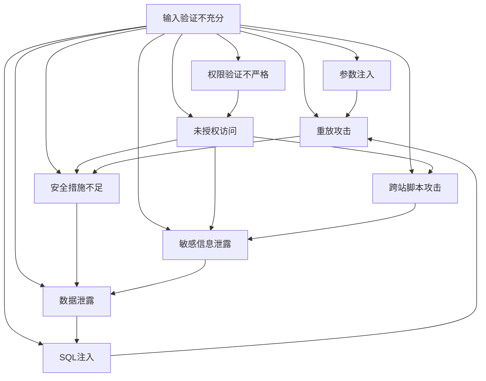

                 

# OWASP API 安全风险清单解读

> 关键词：
- API安全
- OWASP
- 安全风险
- 安全测试
- 安全策略

## 1. 背景介绍

随着Web应用的不断发展，API（应用程序编程接口）的重要性日益凸显。API不仅能够简化复杂系统的设计和开发，还可以促进不同系统间的交互和协作。然而，API的安全性问题也随之而来，成为Web安全中的重要议题。为此，全球知名的开源安全项目OWASP（Open Web Application Security Project）发布了《OWASP API Security Top 10: Risks》，旨在帮助开发者识别和应对API中的常见安全风险。本文将深入解读OWASP API安全风险清单，分析其核心原理和操作步骤，并提供相关的项目实践和未来展望。

## 2. 核心概念与联系

### 2.1 核心概念概述

为了更好地理解OWASP API安全风险清单，我们需要首先了解几个核心概念：

- **API**：应用程序编程接口，是不同系统间进行交互和数据交换的标准方式。
- **OWASP**：全球知名的开源安全项目，提供了一系列安全指南和工具，帮助开发者提升Web应用的安全性。
- **安全风险**：API在设计和实现过程中可能存在的安全漏洞和威胁。
- **安全测试**：通过模拟攻击者行为，识别和评估API中的安全风险。
- **安全策略**：为保护API免受攻击而采取的一系列预防措施。

这些概念共同构成了API安全的基本框架，帮助开发者在系统设计和开发过程中识别和防范潜在的安全风险。

### 2.2 核心概念的关系

OWASP API安全风险清单是一个系统化的安全指南，涵盖了API设计和实现中常见的十大安全风险。这些风险之间的关系可以通过以下Mermaid流程图来展示：



这个流程图展示了API安全风险清单中各风险之间的关系。例如，输入验证不充分可能导致参数注入，未授权访问等风险；权限验证不严格则可能导致未授权访问，跨站脚本攻击等风险；而安全措施不足可能进一步导致敏感信息泄露、数据泄露等风险。

## 3. 核心算法原理 & 具体操作步骤

### 3.1 算法原理概述

OWASP API安全风险清单的主要原理是识别和分类API设计和实现中常见的安全风险。清单将API的安全风险分为十大类，每类包含若干子风险，并提供了详细的防御措施和应对策略。以下是对十大风险的概述：

- **输入验证不充分**：输入验证不充分可能导致参数注入、SQL注入等风险。
- **权限验证不严格**：权限验证不严格可能导致未授权访问、身份验证绕过等风险。
- **安全措施不足**：安全措施不足可能导致敏感信息泄露、跨站脚本攻击等风险。
- **代码注入**：代码注入可能导致代码执行、命令注入等风险。
- **认证不足**：认证不足可能导致身份验证绕过、会话固定等风险。
- **会话管理不善**：会话管理不善可能导致会话劫持、会话固定等风险。
- **访问控制不严格**：访问控制不严格可能导致未经授权的数据访问、跨站请求伪造等风险。
- **数据泄露**：数据泄露可能导致敏感信息泄露、数据劫持等风险。
- **缺乏监控和日志记录**：缺乏监控和日志记录可能导致异常行为未被检测、攻击未被记录等风险。
- **API密钥安全问题**：API密钥安全问题可能导致密钥泄露、API滥用等风险。

### 3.2 算法步骤详解

以下是OWASP API安全风险清单的步骤详解：

1. **风险识别**：
   - 对API进行全面测试和分析，识别潜在的风险。
   - 参考OWASP API安全风险清单，对识别到的风险进行分类。

2. **风险评估**：
   - 对每个风险进行评估，确定其影响范围和严重程度。
   - 根据风险的严重程度，制定相应的防御措施和应对策略。

3. **风险处理**：
   - 根据风险评估结果，逐步实施相应的防御措施。
   - 对API进行持续监控和审计，确保防御措施的有效性。

### 3.3 算法优缺点

OWASP API安全风险清单具有以下优点：
- 系统化：清单提供了一个系统化的风险分类框架，帮助开发者全面识别和评估API中的安全风险。
- 可操作性：清单提供了详细的防御措施和应对策略，易于实施。
- 权威性：作为全球知名的开源安全项目，OWASP API安全风险清单具有高度的权威性和可信度。

同时，清单也存在一些缺点：
- 涵盖面有限：清单可能遗漏了一些新的、未知的安全风险。
- 复杂性：清单涵盖的风险较多，实施起来可能较为复杂。

### 3.4 算法应用领域

OWASP API安全风险清单适用于所有类型的API，包括RESTful API、SOAP API、GraphQL API等。无论是在企业内部的API开发，还是在公共API的设计和部署中，清单都是不可或缺的安全指南。

## 4. 数学模型和公式 & 详细讲解  
### 4.1 数学模型构建

为更好地理解OWASP API安全风险清单的数学模型，我们将以风险评估为例进行详细讲解。假设API风险的评估模型为：

$$
RiskScore = F(RiskID, Impact, Exploitability, Availability)
$$

其中：
- $RiskID$：风险ID，用于标识不同的安全风险。
- $Impact$：风险影响，表示风险发生后对系统的影响程度。
- $Exploitability$：风险可利用性，表示攻击者利用风险的难易程度。
- $Availability$：风险可用性，表示风险对系统的可用性影响。

### 4.2 公式推导过程

风险评估模型可以通过以下步骤推导：

1. **确定风险ID**：根据API的特性，确定可能存在的风险类型和风险ID。
2. **评估风险影响**：通过专家评估或历史数据，确定风险对系统的影响程度。
3. **评估风险可利用性**：分析攻击者利用风险的难易程度，包括技术难度、工具可用性等。
4. **评估风险可用性**：分析风险对系统可用性的影响，包括服务中断、数据丢失等。
5. **计算风险得分**：根据以上三个评估结果，使用加权平均或综合评估方法，计算风险得分。

### 4.3 案例分析与讲解

以“输入验证不充分”为例，分析其风险评估过程。

1. **风险ID**：确定输入验证不充分的风险ID。
2. **风险影响**：通过专家评估或历史数据，确定风险对系统的影响程度。例如，输入验证不充分可能导致参数注入，从而执行恶意代码，影响系统安全。
3. **风险可利用性**：分析攻击者利用风险的难易程度。例如，攻击者可以通过构造恶意输入，注入恶意代码，从而利用该风险。
4. **风险可用性**：分析风险对系统可用性的影响。例如，输入验证不充分可能导致系统异常，影响系统正常运行。
5. **风险得分**：根据以上三个评估结果，计算风险得分。例如，如果输入验证不充分的威胁对系统的影响极大，可利用性高，可用性影响较大，则其风险得分较高，需要优先处理。

## 5. 项目实践：代码实例和详细解释说明

### 5.1 开发环境搭建

在项目实践中，我们需要搭建一个包含API的开发环境。以下是一个基本的搭建流程：

1. **安装Python**：
   - 从官网下载并安装Python 3.x。
   - 配置环境变量，使系统能够识别Python解释器。

2. **安装Flask**：
   - 使用pip安装Flask框架，支持RESTful API开发。

3. **编写API代码**：
   - 使用Flask编写API接口，包括路由、请求处理、响应处理等。
   - 在代码中添加必要的安全措施，如输入验证、权限验证等。

### 5.2 源代码详细实现

以下是一个简单的API接口实现示例：

```python
from flask import Flask, request, jsonify

app = Flask(__name__)

@app.route('/api/data', methods=['GET'])
def get_data():
    # 输入验证
    if not request.args.get('name'):
        return jsonify({'error': 'Missing required parameter'}), 400
    
    # 权限验证
    if not check_permissions(request):
        return jsonify({'error': 'Unauthorized access'}), 401
    
    # 处理请求
    data = get_data_from_db(request.args.get('name'))
    if not data:
        return jsonify({'error': 'No data found'}), 404
    
    # 返回响应
    return jsonify(data), 200
```

### 5.3 代码解读与分析

在代码实现中，我们使用了Flask框架来创建RESTful API接口。以下是对代码的详细解读：

1. **输入验证**：使用`request.args.get()`方法获取请求参数，并进行必要的验证，确保输入数据符合预期。
2. **权限验证**：使用`check_permissions()`方法，检查请求者是否有访问API的权限。
3. **处理请求**：根据请求参数，从数据库中获取数据。
4. **返回响应**：使用`jsonify()`方法，将数据以JSON格式返回给客户端。

### 5.4 运行结果展示

在运行上述代码后，我们可以使用Postman等工具进行测试。例如，发送GET请求到`/api/data?name=John`，返回如下JSON响应：

```json
{
    "name": "John",
    "age": 30,
    "email": "john@example.com"
}
```

## 6. 实际应用场景

### 6.1 智能客服系统

智能客服系统是API安全的重要应用场景之一。通过API接口，智能客服系统能够实时响应用户的查询，并提供个性化的服务。然而，API接口的安全性问题，如输入验证不充分、权限验证不严格等，可能导致系统被攻击者利用，引发严重的安全风险。因此，在智能客服系统的设计和实现中，必须严格遵循OWASP API安全风险清单，确保API接口的安全性。

### 6.2 金融交易平台

金融交易平台是另一个重要的API应用场景。API接口的输入验证不充分、安全措施不足等问题，可能导致系统被攻击者利用，导致资金被盗用、交易记录篡改等风险。因此，在金融交易平台的设计和实现中，必须严格遵循OWASP API安全风险清单，确保API接口的安全性。

### 6.3 物流配送系统

物流配送系统通过API接口，实现了货物追踪、订单管理等功能。然而，API接口的安全性问题，如数据泄露、API密钥安全问题等，可能导致系统被攻击者利用，导致货物信息被盗取、订单篡改等风险。因此，在物流配送系统的设计和实现中，必须严格遵循OWASP API安全风险清单，确保API接口的安全性。

## 7. 工具和资源推荐

### 7.1 学习资源推荐

为了帮助开发者全面掌握API安全知识，以下是一些推荐的学习资源：

1. **OWASP官方文档**：OWASP官方文档提供了详细的API安全指南和工具，是学习API安全的基础。
2. **《API安全实战》**：该书由知名安全专家编写，涵盖了API安全的各个方面，包括风险评估、防御措施等。
3. **《Flask Web开发实战》**：该书介绍了如何使用Flask框架开发API接口，包括安全措施的实现。
4. **《Web应用安全指南》**：该书由OWASP编写，提供了全面的Web应用安全指南，包括API安全的最佳实践。

### 7.2 开发工具推荐

在API安全的项目实践中，以下工具可以帮助开发者提高开发效率和安全性：

1. **Postman**：一个功能强大的API测试工具，支持自动化测试、API文档生成等功能。
2. **Swagger**：一个API文档生成工具，能够自动生成API文档，便于开发者和用户使用。
3. **Kali Linux**：一个渗透测试工具，支持各种网络安全测试，包括API安全测试。
4. **OWASP ZAP**：一个开源的Web应用安全测试工具，支持各种安全测试，包括API安全测试。

### 7.3 相关论文推荐

以下是几篇关于API安全的经典论文，推荐阅读：

1. **“OWASP API Security Top 10: Risks”**：该论文详细介绍了API安全的十大风险，是API安全领域的经典之作。
2. **“API Security Testing and Validation in DevOps: Current State and Future Directions”**：该论文探讨了API安全测试和验证的最佳实践，为API安全的持续集成提供了方向。
3. **“Machine Learning in API Security”**：该论文探讨了机器学习在API安全中的应用，提供了新的思路和方法。

## 8. 总结：未来发展趋势与挑战

### 8.1 研究成果总结

本文详细解读了OWASP API安全风险清单，介绍了其核心原理、操作步骤和实际应用。通过分析API安全的十大风险，帮助开发者识别和防范潜在的安全风险，提高了API的安全性。

### 8.2 未来发展趋势

未来，API安全将面临以下发展趋势：

1. **自动化安全测试**：随着自动化测试技术的发展，API安全测试将更加高效和全面，能够自动发现潜在的安全漏洞。
2. **持续集成和部署**：持续集成和部署技术将帮助开发者在开发过程中持续测试和修复API安全问题，提高API的可靠性。
3. **机器学习应用**：机器学习技术将用于API安全领域，通过训练模型自动识别和修复安全问题，提高API的安全性。
4. **零信任架构**：零信任架构将成为API安全的最佳实践，确保API接口的安全性。

### 8.3 面临的挑战

尽管API安全技术已经取得了一定进展，但在实际应用中仍面临诸多挑战：

1. **复杂性**：API安全涉及多个层面，包括输入验证、权限验证、加密、监控等，实现起来较为复杂。
2. **动态性**：API接口的动态性可能导致安全措施难以全面覆盖，攻击者可能通过新的攻击手段绕过现有的安全措施。
3. **资源消耗**：API安全的实施可能会消耗大量资源，包括计算资源、存储资源等，需要优化资源使用。
4. **用户教育**：用户对API安全知识的缺乏，可能导致安全措施难以得到有效执行。

### 8.4 研究展望

为了应对API安全面临的挑战，未来的研究需要在以下几个方面寻求新的突破：

1. **自动化工具**：开发自动化API安全测试和修复工具，提高API安全的测试效率和修复速度。
2. **持续监控**：建立持续监控系统，实时检测和响应API接口的安全问题。
3. **多方协作**：加强多方协作，包括开发者、测试人员、安全专家等，共同提升API安全水平。
4. **开源共享**：推动API安全领域的开源共享，促进安全知识和技术的传播和应用。

## 9. 附录：常见问题与解答

**Q1：API接口如何进行输入验证？**

A: API接口的输入验证可以通过以下步骤实现：
1. 确定API接口的输入参数和数据类型。
2. 对输入数据进行格式验证，确保数据符合预期格式。
3. 对输入数据进行范围验证，确保数据在合理范围内。
4. 对输入数据进行业务逻辑验证，确保数据符合业务规则。

**Q2：API接口如何进行权限验证？**

A: API接口的权限验证可以通过以下步骤实现：
1. 确定API接口的权限模型，如基于角色的访问控制（RBAC）、基于资源的访问控制（ABAC）等。
2. 对用户身份进行验证，确保用户身份合法。
3. 对用户权限进行验证，确保用户具备访问API接口的权限。
4. 记录用户权限使用情况，便于审计和监控。

**Q3：API接口如何进行安全措施不足的防御？**

A: API接口的安全措施不足可以通过以下步骤进行防御：
1. 确定API接口的关键数据和敏感操作。
2. 对关键数据和敏感操作进行加密处理，确保数据传输和存储的安全性。
3. 对API接口进行访问控制，限制未经授权的访问。
4. 对API接口进行监控和日志记录，及时发现和响应异常行为。

**Q4：API接口如何进行API密钥的安全保护？**

A: API密钥的安全保护可以通过以下步骤实现：
1. 确定API密钥的生成和管理策略，确保密钥的安全性和唯一性。
2. 对API密钥进行加密处理，确保密钥在传输和存储过程中的安全性。
3. 对API密钥的使用进行审计和监控，及时发现和响应异常行为。
4. 定期更换API密钥，减少密钥泄露的风险。

---

作者：禅与计算机程序设计艺术 / Zen and the Art of Computer Programming

