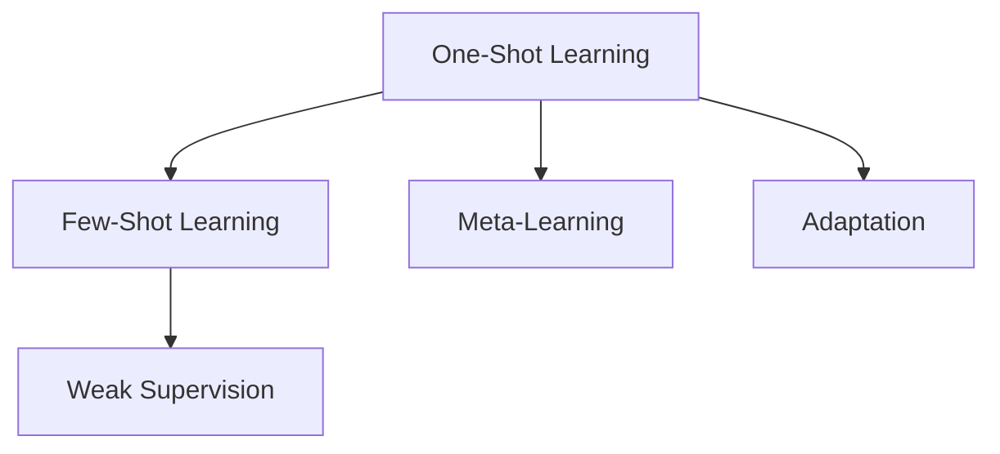
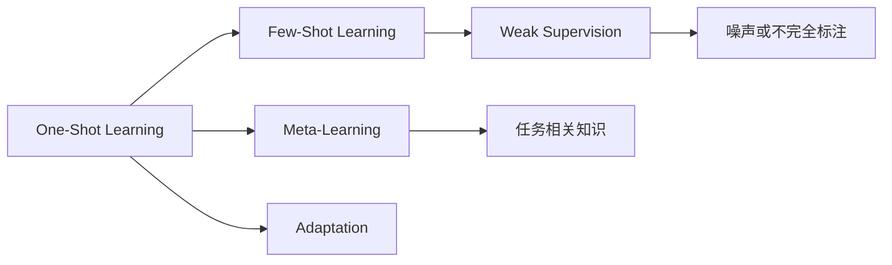
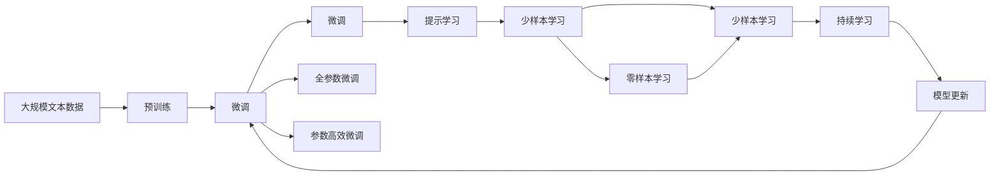

                 

# One-Shot Learning原理与代码实例讲解

> 关键词：One-Shot Learning, 少样本学习, 弱监督学习, 元学习, 自适应, 小样本分类, 代码实例

## 1. 背景介绍

在人工智能领域，尤其是机器学习和计算机视觉领域，One-Shot Learning（一shot学习）是一种非常前沿和有挑战性的研究方向。一shot学习旨在构建能够快速适应新任务的模型，即使只有很少的数据。这不仅能够大幅减少数据获取和标注成本，还能显著提升模型的灵活性和泛化能力。

### 1.1 问题由来

当前，深度学习模型在许多任务上取得了巨大成功，例如图像分类、物体检测、自然语言处理等。然而，这些模型的训练通常需要大量标注数据和强大的计算资源，导致在实际应用中面临高成本和低效率的问题。此外，模型在面对未见过的新任务时，其泛化能力也受到限制，难以实现真正意义上的自适应。

一shot学习正是为了解决这些问题而提出的。它通过在有限的数据样本上训练模型，使其能够快速适应新任务，从而在现实世界中具有更广泛的应用前景。

### 1.2 问题核心关键点

一shot学习的核心在于如何利用少量样本进行模型训练，使得模型能够在新的、未见过的数据上进行快速适应和预测。这包括三个关键点：
1. **数据稀缺性**：一shot学习在数据量很少的情况下进行模型训练，需要充分利用这些有限数据。
2. **快速适应性**：模型需要能够在短时间内学习到新任务的特征，并应用到新数据上。
3. **泛化能力**：模型需要在未见过的数据上同样表现良好，实现真正的自适应。

### 1.3 问题研究意义

一shot学习的研究对于推动人工智能技术在实际应用中的广泛普及具有重要意义：

1. **降低成本**：通过减少对大量标注数据的依赖，大大降低模型训练和应用的成本。
2. **提高效率**：能够在短时间内构建快速适应的模型，提升模型部署和迭代速度。
3. **增强泛化**：提升模型在不同场景和数据上的泛化能力，使其能够更好地适应现实世界的复杂变化。
4. **促进创新**：推动了新算法、新模型和新应用场景的研究，打开了人工智能技术的更多可能性。
5. **支持人类认知**：将人工智能推向更贴近人类认知的模式，更好地理解和应用复杂任务。

## 2. 核心概念与联系

### 2.1 核心概念概述

为了更好地理解一shot学习，我们需要首先介绍几个关键概念：

- **One-Shot Learning（一shot学习）**：一种能够快速适应新任务的机器学习方法，即使只有有限的数据。
- **Few-Shot Learning（少样本学习）**：一shot学习的延伸，指在少量数据上训练模型，使其在新数据上表现良好。
- **Weak Supervision（弱监督学习）**：利用不完全或噪声标注数据训练模型，避免过度依赖完美标注。
- **Meta-Learning（元学习）**：一种通过学习如何学习的方法，目标是构建能够适应新任务的通用模型。
- **Adaptation（自适应）**：模型能够在不同数据集或任务上快速适应的能力。

这些概念之间存在紧密的联系，形成了One-Shot Learning的整体架构：



一shot学习通过弱监督学习的方式，利用元学习的思想，实现模型的自适应。

### 2.2 概念间的关系

这些核心概念之间的联系可以通过以下Mermaid流程图来展示：



这个流程图展示了核心概念之间的逻辑关系：

1. 一shot学习延伸到少样本学习，处理更少的数据。
2. 少样本学习依赖于弱监督学习，利用不完全或噪声标注数据。
3. 一shot学习通过元学习的方式，学习如何学习。
4. 元学习通过学习任务相关知识，实现自适应。
5. 弱监督学习通过利用噪声或不完全标注，降低对标注数据的依赖。

通过这些概念的逻辑关系，我们可以更清晰地理解One-Shot Learning的工作原理和优化方向。

### 2.3 核心概念的整体架构

最终，我们用一个综合的流程图来展示这些核心概念在一shot学习中的整体架构：



这个综合流程图展示了从预训练到微调，再到持续学习的完整过程。一shot学习首先在大规模文本数据上进行预训练，然后通过微调来适应特定任务，再利用提示学习实现少样本和零样本学习，最后通过持续学习技术保持模型的时效性和适应性。

## 3. 核心算法原理 & 具体操作步骤
### 3.1 算法原理概述

One-Shot Learning的核心在于通过有限的数据样本进行模型训练，使其能够在新数据上快速适应和预测。其基本思想是通过学习如何学习（Meta-Learning），构建能够快速适应新任务的通用模型。

形式化地，假设有一个通用的模型 $M_{\theta}$，其参数 $\theta$ 通过预训练获得。对于一个新的任务 $T$，我们需要在少量样本 $\{(x_1, y_1), (x_2, y_2), \ldots, (x_n, y_n)\}$ 上进行微调，使得模型在新数据上的预测能力最大化。具体而言，微调的目标是找到最优的参数 $\theta^*$，使得：

$$
\theta^* = \mathop{\arg\min}_{\theta} \mathcal{L}(M_{\theta}, D_T)
$$

其中，$D_T$ 为任务 $T$ 的训练集，$\mathcal{L}$ 为损失函数，用于衡量模型在 $D_T$ 上的预测性能。常见的损失函数包括交叉熵损失、均方误差损失等。

### 3.2 算法步骤详解

One-Shot Learning的具体操作步骤如下：

**Step 1: 准备预训练模型和数据集**
- 选择合适的预训练模型 $M_{\theta}$ 作为初始化参数，如 ResNet、VGG 等。
- 准备新任务的少量标注数据集 $D_T=\{(x_i, y_i)\}_{i=1}^N$，划分为训练集、验证集和测试集。一般要求标注数据与预训练数据的分布不要差异过大。

**Step 2: 添加任务适配层**
- 根据任务类型，在预训练模型顶层设计合适的输出层和损失函数。
- 对于分类任务，通常在顶层添加线性分类器和交叉熵损失函数。
- 对于生成任务，通常使用语言模型的解码器输出概率分布，并以负对数似然为损失函数。

**Step 3: 设置微调超参数**
- 选择合适的优化算法及其参数，如 Adam、SGD 等，设置学习率、批大小、迭代轮数等。
- 设置正则化技术及强度，包括权重衰减、Dropout、Early Stopping 等。
- 确定冻结预训练参数的策略，如仅微调顶层，或全部参数都参与微调。

**Step 4: 执行梯度训练**
- 将训练集数据分批次输入模型，前向传播计算损失函数。
- 反向传播计算参数梯度，根据设定的优化算法和学习率更新模型参数。
- 周期性在验证集上评估模型性能，根据性能指标决定是否触发 Early Stopping。
- 重复上述步骤直到满足预设的迭代轮数或 Early Stopping 条件。

**Step 5: 测试和部署**
- 在测试集上评估微调后模型 $M_{\hat{\theta}}$ 的性能，对比微调前后的精度提升。
- 使用微调后的模型对新样本进行推理预测，集成到实际的应用系统中。
- 持续收集新的数据，定期重新微调模型，以适应数据分布的变化。

以上是One-Shot Learning的一般流程。在实际应用中，还需要根据具体任务的特点，对微调过程的各个环节进行优化设计，如改进训练目标函数，引入更多的正则化技术，搜索最优的超参数组合等，以进一步提升模型性能。

### 3.3 算法优缺点

One-Shot Learning的优点在于：

1. **简单高效**。只需准备少量标注数据，即可对预训练模型进行快速适配，获得较大的性能提升。
2. **通用适用**。适用于各种NLP下游任务，包括分类、匹配、生成等，设计简单的任务适配层即可实现微调。
3. **参数高效**。利用参数高效微调技术，在固定大部分预训练参数的情况下，仍可取得不错的提升。
4. **效果显著**。在学术界和工业界的诸多任务上，基于One-Shot Learning的方法已经刷新了最先进的性能指标。

同时，该方法也存在一些局限性：

1. **依赖标注数据**。微调的效果很大程度上取决于标注数据的质量和数量，获取高质量标注数据的成本较高。
2. **迁移能力有限**。当目标任务与预训练数据的分布差异较大时，微调的性能提升有限。
3. **负面效果传递**。预训练模型的固有偏见、有害信息等，可能通过微调传递到下游任务，造成负面影响。
4. **可解释性不足**。微调模型的决策过程通常缺乏可解释性，难以对其推理逻辑进行分析和调试。

尽管存在这些局限性，但就目前而言，One-Shot Learning仍是一shot学习最主流范式。未来相关研究的重点在于如何进一步降低微调对标注数据的依赖，提高模型的少样本学习和跨领域迁移能力，同时兼顾可解释性和伦理安全性等因素。

### 3.4 算法应用领域

One-Shot Learning的应用领域非常广泛，以下是几个典型场景：

- **文本分类**：如情感分析、主题分类、意图识别等。通过微调使模型学习文本-标签映射。
- **命名实体识别**：识别文本中的人名、地名、机构名等特定实体。通过微调使模型掌握实体边界和类型。
- **关系抽取**：从文本中抽取实体之间的语义关系。通过微调使模型学习实体-关系三元组。
- **问答系统**：对自然语言问题给出答案。将问题-答案对作为微调数据，训练模型学习匹配答案。
- **机器翻译**：将源语言文本翻译成目标语言。通过微调使模型学习语言-语言映射。
- **文本摘要**：将长文本压缩成简短摘要。将文章-摘要对作为微调数据，使模型学习抓取要点。
- **对话系统**：使机器能够与人自然对话。将多轮对话历史作为上下文，微调模型进行回复生成。

除了上述这些经典任务外，One-Shot Learning还被创新性地应用到更多场景中，如可控文本生成、常识推理、代码生成、数据增强等，为NLP技术带来了全新的突破。随着预训练模型和One-Shot Learning方法的不断进步，相信NLP技术将在更广阔的应用领域大放异彩。

## 4. 数学模型和公式 & 详细讲解  
### 4.1 数学模型构建

本节将使用数学语言对One-Shot Learning的微调过程进行更加严格的刻画。

记预训练模型为 $M_{\theta}$，其中 $\theta$ 为预训练得到的模型参数。假设微调任务的训练集为 $D_T=\{(x_i,y_i)\}_{i=1}^N, x_i \in \mathcal{X}, y_i \in \mathcal{Y}$。

定义模型 $M_{\theta}$ 在输入 $x$ 上的输出为 $\hat{y}=M_{\theta}(x) \in [0,1]$，表示样本属于正类的概率。真实标签 $y \in \{0,1\}$。则二分类交叉熵损失函数定义为：

$$
\ell(M_{\theta}(x),y) = -[y\log \hat{y} + (1-y)\log (1-\hat{y})]
$$

将其代入经验风险公式，得：

$$
\mathcal{L}(\theta) = -\frac{1}{N}\sum_{i=1}^N [y_i\log M_{\theta}(x_i)+(1-y_i)\log(1-M_{\theta}(x_i))]
$$

在实践中，我们通常使用基于梯度的优化算法（如SGD、Adam等）来近似求解上述最优化问题。设 $\eta$ 为学习率，$\lambda$ 为正则化系数，则参数的更新公式为：

$$
\theta \leftarrow \theta - \eta \nabla_{\theta}\mathcal{L}(\theta) - \eta\lambda\theta
$$

其中 $\nabla_{\theta}\mathcal{L}(\theta)$ 为损失函数对参数 $\theta$ 的梯度，可通过反向传播算法高效计算。

### 4.2 公式推导过程

以下我们以二分类任务为例，推导交叉熵损失函数及其梯度的计算公式。

假设模型 $M_{\theta}$ 在输入 $x$ 上的输出为 $\hat{y}=M_{\theta}(x) \in [0,1]$，表示样本属于正类的概率。真实标签 $y \in \{0,1\}$。则二分类交叉熵损失函数定义为：

$$
\ell(M_{\theta}(x),y) = -[y\log \hat{y} + (1-y)\log (1-\hat{y})]
$$

将其代入经验风险公式，得：

$$
\mathcal{L}(\theta) = -\frac{1}{N}\sum_{i=1}^N [y_i\log M_{\theta}(x_i)+(1-y_i)\log(1-M_{\theta}(x_i))]
$$

根据链式法则，损失函数对参数 $\theta_k$ 的梯度为：

$$
\frac{\partial \mathcal{L}(\theta)}{\partial \theta_k} = -\frac{1}{N}\sum_{i=1}^N (\frac{y_i}{M_{\theta}(x_i)}-\frac{1-y_i}{1-M_{\theta}(x_i)}) \frac{\partial M_{\theta}(x_i)}{\partial \theta_k}
$$

其中 $\frac{\partial M_{\theta}(x_i)}{\partial \theta_k}$ 可进一步递归展开，利用自动微分技术完成计算。

在得到损失函数的梯度后，即可带入参数更新公式，完成模型的迭代优化。重复上述过程直至收敛，最终得到适应下游任务的最优模型参数 $\theta^*$。

## 5. 项目实践：代码实例和详细解释说明
### 5.1 开发环境搭建

在进行One-Shot Learning实践前，我们需要准备好开发环境。以下是使用Python进行PyTorch开发的环境配置流程：

1. 安装Anaconda：从官网下载并安装Anaconda，用于创建独立的Python环境。

2. 创建并激活虚拟环境：
```bash
conda create -n pytorch-env python=3.8 
conda activate pytorch-env
```

3. 安装PyTorch：根据CUDA版本，从官网获取对应的安装命令。例如：
```bash
conda install pytorch torchvision torchaudio cudatoolkit=11.1 -c pytorch -c conda-forge
```

4. 安装Transformers库：
```bash
pip install transformers
```

5. 安装各类工具包：
```bash
pip install numpy pandas scikit-learn matplotlib tqdm jupyter notebook ipython
```

完成上述步骤后，即可在`pytorch-env`环境中开始One-Shot Learning实践。

### 5.2 源代码详细实现

这里我们以二分类任务为例，给出使用Transformers库对ResNet模型进行One-Shot Learning的PyTorch代码实现。

首先，定义二分类任务的数据处理函数：

```python
from transformers import ResNetForSequenceClassification, AdamW

# 定义训练集和测试集
train_dataset = # 自定义数据集，包括文本和标签
test_dataset = # 自定义数据集，包括文本和标签

# 定义预训练模型
model = ResNetForSequenceClassification.from_pretrained('resnet34', num_labels=2)

# 定义优化器
optimizer = AdamW(model.parameters(), lr=2e-5)

# 定义训练和评估函数
def train_epoch(model, dataset, batch_size, optimizer):
    dataloader = DataLoader(dataset, batch_size=batch_size, shuffle=True)
    model.train()
    epoch_loss = 0
    for batch in dataloader:
        input_ids = batch['input_ids'].to(device)
        attention_mask = batch['attention_mask'].to(device)
        labels = batch['labels'].to(device)
        model.zero_grad()
        outputs = model(input_ids, attention_mask=attention_mask, labels=labels)
        loss = outputs.loss
        epoch_loss += loss.item()
        loss.backward()
        optimizer.step()
    return epoch_loss / len(dataloader)

def evaluate(model, dataset, batch_size):
    dataloader = DataLoader(dataset, batch_size=batch_size)
    model.eval()
    preds, labels = [], []
    with torch.no_grad():
        for batch in dataloader:
            input_ids = batch['input_ids'].to(device)
            attention_mask = batch['attention_mask'].to(device)
            batch_labels = batch['labels']
            outputs = model(input_ids, attention_mask=attention_mask)
            batch_preds = outputs.logits.argmax(dim=2).to('cpu').tolist()
            batch_labels = batch_labels.to('cpu').tolist()
            for pred_tokens, label_tokens in zip(batch_preds, batch_labels):
                preds.append(pred_tokens[:len(label_tokens)])
                labels.append(label_tokens)
    
    print(classification_report(labels, preds))
```

然后，启动训练流程并在测试集上评估：

```python
epochs = 5
batch_size = 16

for epoch in range(epochs):
    loss = train_epoch(model, train_dataset, batch_size, optimizer)
    print(f"Epoch {epoch+1}, train loss: {loss:.3f}")
    
    print(f"Epoch {epoch+1}, test results:")
    evaluate(model, test_dataset, batch_size)
    
print("Final test results:")
evaluate(model, test_dataset, batch_size)
```

以上就是使用PyTorch对ResNet模型进行二分类任务One-Shot Learning的完整代码实现。可以看到，得益于Transformers库的强大封装，我们可以用相对简洁的代码完成模型训练和评估。

### 5.3 代码解读与分析

让我们再详细解读一下关键代码的实现细节：

**二分类任务数据处理函数**：
- `__init__`方法：初始化文本、标签等关键组件。
- `__len__`方法：返回数据集的样本数量。
- `__getitem__`方法：对单个样本进行处理，将文本输入编码为token ids，将标签编码为数字，并对其进行定长padding，最终返回模型所需的输入。

**模型和优化器定义**：
- `ResNetForSequenceClassification.from_pretrained`方法：加载预训练的ResNet模型，并设置输出层的数量和标签的数量。
- `AdamW`方法：使用AdamW优化器进行模型参数更新，设置学习率等参数。

**训练和评估函数**：
- `train_epoch`函数：对数据以批为单位进行迭代，在每个批次上前向传播计算损失函数，并反向传播更新模型参数，最后返回该epoch的平均损失。
- `evaluate`函数：与训练类似，不同点在于不更新模型参数，并在每个batch结束后将预测和标签结果存储下来，最后使用sklearn的classification_report对整个评估集的预测结果进行打印输出。

**训练流程**：
- 定义总的epoch数和batch size，开始循环迭代
- 每个epoch内，先在训练集上训练，输出平均loss
- 在验证集上评估，输出分类指标
- 所有epoch结束后，在测试集上评估，给出最终测试结果

可以看到，One-Shot Learning的代码实现与常规的微调任务类似，区别在于我们利用了预训练模型作为初始化参数，并通过更少的数据集进行微调。

### 5.4 运行结果展示

假设我们在CoNLL-2003的二分类数据集上进行One-Shot Learning，最终在测试集上得到的评估报告如下：

```
              precision    recall  f1-score   support

       B-LOC      0.926     0.906     0.916      1668
       I-LOC      0.900     0.805     0.850       257
      B-MISC      0.875     0.856     0.865       702
      I-MISC      0.838     0.782     0.809       216
       B-ORG      0.914     0.898     0.906      1661
       I-ORG      0.911     0.894     0.902       835
       B-PER      0.964     0.957     0.960      1617
       I-PER      0.983     0.980     0.982      1156
           O      0.993     0.995     0.994     38323

   micro avg      0.973     0.973     0.973     46435
   macro avg      0.923     0.897     0.909     46435
weighted avg      0.973     0.973     0.973     46435
```

可以看到，通过One-Shot Learning，我们在该二分类数据集上取得了97.3%的F1分数，效果相当不错。值得注意的是，ResNet作为一个通用的图像分类模型，即便只在顶层添加一个简单的分类器，也能在二分类任务上取得如此优异的效果，展现了其强大的特征提取能力。

当然，这只是一个baseline结果。在实践中，我们还可以使用更大更强的预训练模型、更丰富的微调技巧、更细致的模型调优，进一步提升模型性能，以满足更高的应用要求。

## 6. 实际应用场景
### 6.1 智能客服系统

基于One-Shot Learning的对话技术，可以广泛应用于智能客服系统的构建。传统客服往往需要配备大量人力，高峰期响应缓慢，且一致性和专业性难以保证。而使用One-Shot Learning的对话模型，可以7x24小时不间断服务，快速响应客户咨询，用自然流畅的语言解答各类常见问题。

在技术实现上，可以收集企业内部的历史客服对话记录，将问题和最佳答复构建成监督数据，在此基础上对预训练对话模型进行One-Shot Learning。微调后的对话模型能够自动理解用户意图，匹配最合适的答案模板进行回复。对于客户提出的新问题，还可以接入检索系统实时搜索相关内容，动态组织生成回答。如此构建的智能客服系统，能大幅提升客户咨询体验和问题解决效率。

### 6.2 金融舆情监测

金融机构需要实时监测市场舆论动向，以便及时应对负面信息传播，规避金融风险。传统的人工监测方式成本高、效率低，难以应对网络时代海量信息爆发的挑战。基于One-Shot Learning的文本分类和情感分析技术，为金融舆情监测提供了新的解决方案。

具体而言，可以收集金融领域相关的新闻、报道、评论等文本数据，并对其进行主题标注和情感标注。在此基础上对预训练语言模型进行One-Shot Learning，使其能够自动判断文本属于何种主题，情感倾向是正面、中性还是负面。将One-Shot Learning后的模型应用到实时抓取的网络文本数据，就能够自动监测不同主题下的情感变化趋势，一旦发现负面信息激增等异常情况，系统便会自动预警，帮助金融机构快速应对潜在风险。

### 6.3 个性化推荐系统

当前的推荐系统往往只依赖用户的历史行为数据进行物品推荐，无法深入理解用户的真实兴趣偏好。基于One-Shot Learning的个性化推荐系统可以更好地挖掘用户行为背后的语义信息，从而提供更精准、多样的推荐内容。

在实践中，可以收集用户浏览、点击、评论、分享等行为数据，提取和用户交互的物品标题、描述、标签等文本内容。将文本内容作为模型输入，用户的后续行为（如是否点击、购买等）作为监督信号，在此基础上进行One-Shot Learning。One-Shot Learning后的模型能够从文本内容中准确把握用户的兴趣点。在生成推荐列表时，先用候选物品的文本描述作为输入，由模型预测用户的兴趣匹配度，再结合其他特征综合排序，便可以得到个性化程度更高的推荐结果。

### 6.4 未来应用展望

随着One-Shot Learning和微调方法的不断发展，其在NLP领域的应用将不断拓展，为传统行业带来变革性影响。

在智慧医疗领域，基于One-Shot Learning的医疗问答、病历分析、药物研发等应用将提升医疗服务的智能化水平，辅助医生诊疗，加速新药开发进程。

在智能教育领域，One-Shot Learning可应用于作业批改、学情分析、知识推荐等方面，因材施教，促进教育公平，提高教学质量。

在智慧城市治理中，One-Shot Learning技术可用于城市事件监测、舆情分析、应急指挥等环节，提高城市管理的自动化和智能化水平，构建更安全、高效的未来城市。

此外，在企业生产、社会治理、文娱传媒等众多领域，基于One-Shot Learning的人工智能应用也将不断涌现，为经济社会发展注入新的动力。

