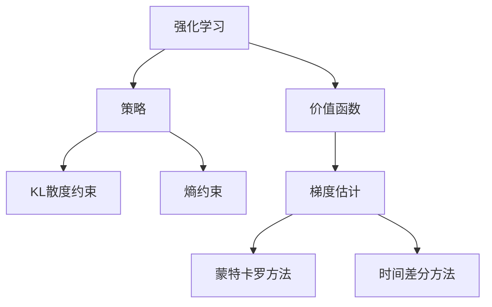
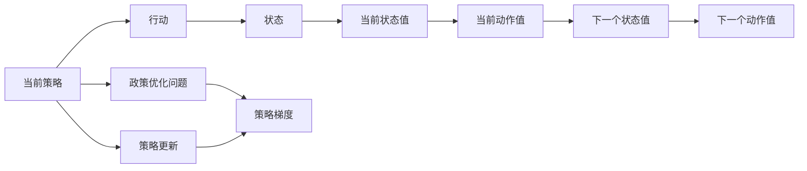
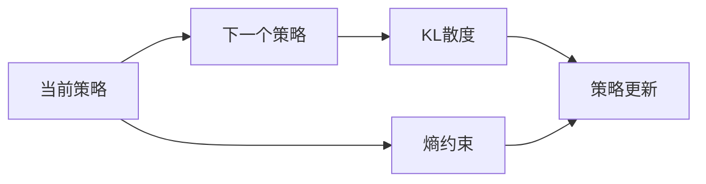
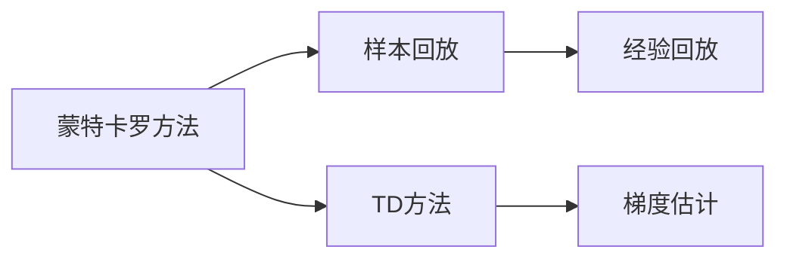
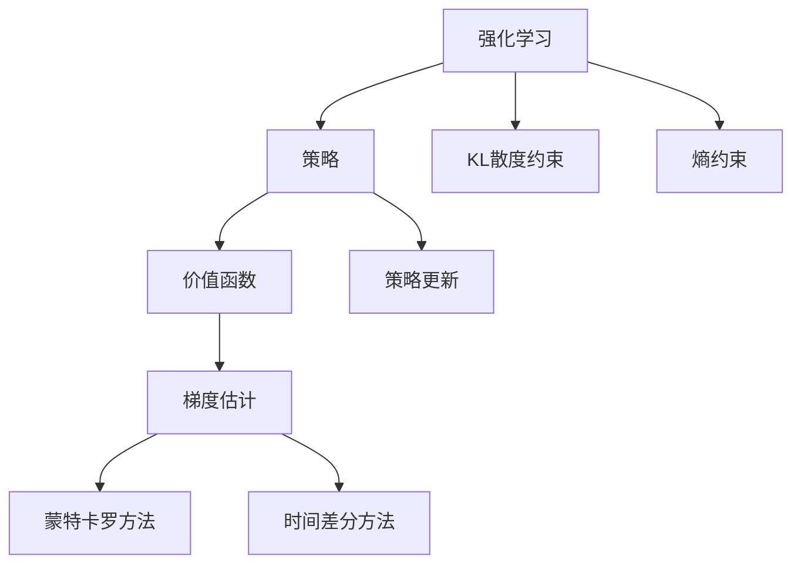

                 

# PPO(Proximal Policy Optimization) - 原理与代码实例讲解

## 1. 背景介绍

### 1.1 问题由来
强化学习（Reinforcement Learning, RL）是机器学习（Machine Learning, ML）中的一个重要分支，它的目标是通过学习一个智能体在特定环境中与环境的交互过程，以实现某个目标（如最大化某个指标）。在过去几年中，强化学习算法在许多领域，如游戏AI、自动驾驶、机器人控制等，都取得了显著的进展。

然而，强化学习算法中的主要挑战之一是难以处理高维连续动作空间（如机器人控制中的连续动作空间），以及如何平衡探索与利用的策略。针对这些问题，学者们提出了许多改进的强化学习算法，其中PPO（Proximal Policy Optimization）算法是近年来的一个重要突破。

### 1.2 问题核心关键点
PPO算法是由Schmidhuber在2017年提出的，是一种基于梯度优化的策略优化算法。它的核心思想是通过强化学习算法中的政策优化问题，找到与当前策略最接近的、能够最大化长期奖励的政策。PPO算法通过引入一个可约束的分布，使得政策更新既能够探索未知动作空间，又能利用已知的策略信息，从而实现了对策略梯度的稳定更新，提高了学习效率。

PPO算法的核心优势在于其能够对策略进行高效更新，并且收敛速度较快。此外，PPO算法还能够在对抗性环境中表现出色，这是由于其引入了KL散度约束，避免了策略更新过于激进，从而提高了政策的稳定性。

### 1.3 问题研究意义
研究PPO算法，对于强化学习的发展和应用具有重要意义：

1. **高维连续动作空间**：PPO算法通过引入可约束的分布，能够高效处理高维连续动作空间，这对于机器人控制、游戏AI等领域的强化学习具有重要意义。
2. **探索与利用平衡**：PPO算法能够平衡探索与利用，提高策略更新的稳定性，从而提高学习效率。
3. **对抗性环境**：PPO算法在对抗性环境中表现出色，这对于安全关键性的强化学习应用，如自动驾驶、医疗等领域具有重要意义。
4. **实际应用场景**：PPO算法已经被广泛应用于机器人控制、游戏AI、自动驾驶等领域，取得了显著的成果。

## 2. 核心概念与联系

### 2.1 核心概念概述

为更好地理解PPO算法，本节将介绍几个密切相关的核心概念：

- **强化学习**：一种通过智能体与环境的交互，通过最大化长期奖励来优化决策过程的机器学习方法。
- **策略**：描述智能体如何根据环境状态选择动作的概率分布。
- **价值函数**：评估一个策略在环境中长期奖励的函数，通常分为状态价值函数和动作价值函数。
- **KL散度约束**：用于约束策略更新，防止策略更新过于激进，从而提高策略的稳定性。
- **熵约束**：用于约束策略更新的多样性，防止策略更新过于单调。
- **梯度估计**：用于估计策略梯度的技术，通常采用蒙特卡罗（MC）方法、时间差分（TD）方法等。

这些核心概念之间的逻辑关系可以通过以下Mermaid流程图来展示：



这个流程图展示了点强化学习中的各个概念及其相互关系。

### 2.2 概念间的关系

这些核心概念之间存在着紧密的联系，形成了PPO算法的完整生态系统。下面我通过几个Mermaid流程图来展示这些概念之间的关系。

#### 2.2.1 策略更新流程



这个流程图展示了策略更新的大致流程。策略更新涉及当前策略、行动、状态、值函数、下一步动作等关键组件。

#### 2.2.2 KL散度约束与熵约束



这个流程图展示了KL散度约束和熵约束的基本逻辑关系。

#### 2.2.3 梯度估计流程



这个流程图展示了蒙特卡罗方法和时间差分方法的基本逻辑关系。

### 2.3 核心概念的整体架构

最后，我们用一个综合的流程图来展示这些核心概念在大语言模型微调过程中的整体架构：



这个综合流程图展示了从强化学习到策略更新，再到梯度估计的全过程，并强调了KL散度约束和熵约束在策略更新中的关键作用。

## 3. 核心算法原理 & 具体操作步骤
### 3.1 算法原理概述

PPO算法是一种基于梯度优化的策略优化算法，其核心思想是通过强化学习算法中的策略优化问题，找到与当前策略最接近的、能够最大化长期奖励的策略。PPO算法通过引入一个可约束的分布，使得策略更新既能够探索未知动作空间，又能利用已知的策略信息，从而实现了对策略梯度的稳定更新，提高了学习效率。

PPO算法主要分为两个步骤：策略梯度估计和策略更新。策略梯度估计使用蒙特卡罗方法或时间差分方法来估计策略梯度，策略更新则使用梯度下降方法来更新策略。

### 3.2 算法步骤详解

PPO算法的主要步骤包括以下几个方面：

1. **策略梯度估计**：使用蒙特卡罗方法或时间差分方法来估计策略梯度。
2. **策略更新**：根据估计的策略梯度，使用梯度下降方法来更新策略。
3. **KL散度约束**：通过引入KL散度约束，避免策略更新过于激进。
4. **熵约束**：通过引入熵约束，防止策略更新过于单调。
5. **学习率调度**：根据当前策略的性能，调整学习率，以提高学习效率。

#### 3.2.1 策略梯度估计

策略梯度估计是PPO算法的核心步骤，其目标是估计当前策略在每个状态下的动作价值函数，从而计算出策略梯度。具体而言，蒙特卡罗方法和时间差分方法都是常用的策略梯度估计方法。

**蒙特卡罗方法**：蒙特卡罗方法通过样本回放来估计策略梯度。在每个时间步中，智能体与环境进行交互，记录状态、动作、奖励等数据。然后，通过对这些数据进行蒙特卡罗采样，估计出每个状态下的动作价值函数，从而计算出策略梯度。

**时间差分方法**：时间差分方法通过对状态值函数进行迭代计算，来估计策略梯度。具体而言，时间差分方法使用当前状态和下一个状态的值函数差分，来估计当前动作的价值函数。然后，通过对这些值函数进行迭代计算，估计出每个状态下的动作价值函数，从而计算出策略梯度。

#### 3.2.2 策略更新

策略更新是PPO算法的另一个重要步骤，其目标是使用估计的策略梯度来更新策略。具体而言，PPO算法使用梯度下降方法来更新策略，以最大化长期奖励。

**策略更新公式**：
$$
\theta_{t+1} \leftarrow \theta_t - \alpha \nabla_{\theta}J(\theta_t)
$$
其中，$\theta$ 是策略的参数，$\alpha$ 是学习率，$J(\theta_t)$ 是策略的目标函数，通常是一个最大化长期奖励的函数。

#### 3.2.3 KL散度约束

KL散度约束是PPO算法的关键步骤，其目的是防止策略更新过于激进，从而提高策略的稳定性。具体而言，KL散度约束要求新的策略和当前策略之间的KL散度不超过一个预设的阈值。

**KL散度约束公式**：
$$
\min_{\pi_t(\cdot)} \{ J(\pi_t(\cdot)) - \beta KL(D_{KL}(\pi_t(\cdot)||\pi_{t-1}(\cdot)) \}
$$
其中，$D_{KL}(\pi_t(\cdot)||\pi_{t-1}(\cdot))$ 表示当前策略和下一个策略之间的KL散度，$\beta$ 是KL散度约束的系数，通常设置为0.2。

#### 3.2.4 熵约束

熵约束是PPO算法的另一个关键步骤，其目的是防止策略更新过于单调，从而提高策略的多样性。具体而言，熵约束要求新策略的熵值和当前策略的熵值之间的差值不超过一个预设的阈值。

**熵约束公式**：
$$
\min_{\pi_t(\cdot)} \{ J(\pi_t(\cdot)) - \gamma E_{s_t \sim \pi_t(\cdot)} [-\pi_t(\cdot) log \pi_t(\cdot)) \}
$$
其中，$\gamma$ 是熵约束的系数，通常设置为0.1。

#### 3.2.5 学习率调度

学习率调度是PPO算法的另一个重要步骤，其目的是根据当前策略的性能，调整学习率，以提高学习效率。具体而言，学习率调度使用两个窗口来计算学习率，一个窗口用于计算当前策略的梯度，另一个窗口用于计算历史策略的梯度。然后，通过这两个窗口计算的学习率之和，来更新策略。

**学习率调度公式**：
$$
\alpha_t = \alpha_{t-1} * \min(1, \frac{\epsilon_{max}}{\epsilon_{t-1}})
$$
其中，$\alpha_t$ 是当前时间步的学习率，$\alpha_{t-1}$ 是上时间步的学习率，$\epsilon_{max}$ 是学习率的最大值，$\epsilon_{t-1}$ 是上时间步的历史梯度。

### 3.3 算法优缺点

PPO算法的主要优点包括：

1. **高维连续动作空间**：PPO算法能够高效处理高维连续动作空间，这对于机器人控制、游戏AI等领域的强化学习具有重要意义。
2. **探索与利用平衡**：PPO算法能够平衡探索与利用，提高策略更新的稳定性，从而提高学习效率。
3. **对抗性环境**：PPO算法在对抗性环境中表现出色，这是因为其引入了KL散度约束，避免了策略更新过于激进，从而提高了策略的稳定性。

PPO算法的主要缺点包括：

1. **参数初始化敏感**：PPO算法的性能对于参数的初始化非常敏感，需要进行多次实验才能找到最优的参数配置。
2. **模型复杂度高**：PPO算法的模型复杂度较高，需要更多的计算资源和时间来训练模型。
3. **难以处理稀疏奖励**：PPO算法在处理稀疏奖励的情况下，性能表现不如其他算法。

### 3.4 算法应用领域

PPO算法已经被广泛应用于机器人控制、游戏AI、自动驾驶等领域，取得了显著的成果。以下是PPO算法在实际应用中的一些例子：

- **机器人控制**：PPO算法被用于机器人控制，如机器人手臂的运动控制、人形机器人的行走控制等。
- **游戏AI**：PPO算法被用于游戏AI中，如AlphaGo、Dota2等游戏中，智能体的控制策略。
- **自动驾驶**：PPO算法被用于自动驾驶中的路径规划、避障策略等。

## 4. 数学模型和公式 & 详细讲解  
### 4.1 数学模型构建

PPO算法涉及多个数学模型，包括状态价值函数、动作价值函数、策略梯度等。下面我们将详细讲解这些数学模型。

**状态价值函数**：
$$
V(s_t) = \mathbb{E}_{a_t}[Q(s_t,a_t)] = \mathbb{E}_{a_t}[R(s_t,a_t) + \gamma V(s_{t+1})]
$$
其中，$Q(s_t,a_t)$ 表示状态动作价值函数，$R(s_t,a_t)$ 表示状态动作奖励，$V(s_{t+1})$ 表示下一个状态的价值函数。

**动作价值函数**：
$$
A(s_t,a_t) = Q(s_t,a_t) - V(s_t)
$$
其中，$A(s_t,a_t)$ 表示状态动作价值函数，$Q(s_t,a_t)$ 表示状态动作价值函数，$V(s_t)$ 表示状态价值函数。

**策略梯度**：
$$
\nabla_{\theta}J(\theta) = \mathbb{E}_{s_t,a_t}[\frac{\pi_t(a_t|s_t)}{\pi_{t-1}(a_t|s_t)} \nabla_{\theta}\log \pi_t(a_t|s_t)]
$$
其中，$J(\theta)$ 表示策略的目标函数，$\pi_t(a_t|s_t)$ 表示策略在当前状态下的动作概率分布，$\nabla_{\theta}\log \pi_t(a_t|s_t)$ 表示策略梯度。

### 4.2 公式推导过程

下面我们以PPO算法的核心步骤——策略梯度估计为例，详细讲解公式的推导过程。

假设当前策略为 $\pi_t(a_t|s_t)$，下一个策略为 $\pi_{t+1}(a_{t+1}|s_{t+1})$。根据蒙特卡罗方法，我们可以得到：
$$
\log \pi_t(a_t|s_t) \approx \frac{1}{\epsilon} \sum_{t'=t}^{T-1} \log \pi(a_{t'}|s_{t'})
$$
其中，$\epsilon$ 是一个小的正数。

根据时间差分方法，我们可以得到：
$$
\log \pi_t(a_t|s_t) \approx \sum_{t'=t}^{T-1} \log \pi(a_{t'}|s_{t'})
$$

然后，我们可以得到策略梯度估计的公式：
$$
\nabla_{\theta}J(\theta) = \mathbb{E}_{s_t,a_t}[\frac{\pi_t(a_t|s_t)}{\pi_{t-1}(a_t|s_t)} \nabla_{\theta}\log \pi_t(a_t|s_t)]
$$

### 4.3 案例分析与讲解

下面我们将通过一个简单的案例，来详细讲解PPO算法的具体实现过程。

假设我们有一个机器人，需要控制其手臂的位置，以在一个固定的位置放置一个物体。我们定义状态为机器人的位置和速度，动作为手臂的位置，奖励为物体放置的准确度。我们将使用PPO算法来控制机器人。

**状态价值函数**：
$$
V(s_t) = \mathbb{E}_{a_t}[R(s_t,a_t) + \gamma V(s_{t+1})]
$$

**动作价值函数**：
$$
A(s_t,a_t) = Q(s_t,a_t) - V(s_t)
$$

**策略梯度**：
$$
\nabla_{\theta}J(\theta) = \mathbb{E}_{s_t,a_t}[\frac{\pi_t(a_t|s_t)}{\pi_{t-1}(a_t|s_t)} \nabla_{\theta}\log \pi_t(a_t|s_t)]
$$

**策略更新**：
$$
\theta_{t+1} \leftarrow \theta_t - \alpha \nabla_{\theta}J(\theta_t)
$$

**KL散度约束**：
$$
\min_{\pi_t(\cdot)} \{ J(\pi_t(\cdot)) - \beta KL(D_{KL}(\pi_t(\cdot)||\pi_{t-1}(\cdot)) \}
$$

**熵约束**：
$$
\min_{\pi_t(\cdot)} \{ J(\pi_t(\cdot)) - \gamma E_{s_t \sim \pi_t(\cdot)} [-\pi_t(\cdot) log \pi_t(\cdot)) \}
$$

**学习率调度**：
$$
\alpha_t = \alpha_{t-1} * \min(1, \frac{\epsilon_{max}}{\epsilon_{t-1}})
$$

通过这些公式，我们可以实现对机器人的控制，使其在固定位置放置物体。

## 5. 项目实践：代码实例和详细解释说明
### 5.1 开发环境搭建

在进行PPO算法实践前，我们需要准备好开发环境。以下是使用Python进行PyTorch开发的环境配置流程：

1. 安装Anaconda：从官网下载并安装Anaconda，用于创建独立的Python环境。

2. 创建并激活虚拟环境：
```bash
conda create -n pytorch-env python=3.8 
conda activate pytorch-env
```

3. 安装PyTorch：根据CUDA版本，从官网获取对应的安装命令。例如：
```bash
conda install pytorch torchvision torchaudio cudatoolkit=11.1 -c pytorch -c conda-forge
```

4. 安装Tensorboard：
```bash
pip install tensorboard
```

5. 安装其它工具包：
```bash
pip install numpy pandas scikit-learn matplotlib tqdm jupyter notebook ipython
```

完成上述步骤后，即可在`pytorch-env`环境中开始PPO算法的实践。

### 5.2 源代码详细实现

这里我们以PPO算法在机器人控制中的应用为例，给出使用PyTorch实现的代码。

首先，我们定义机器人的状态和动作：

```python
import torch
import torch.nn as nn
import torch.optim as optim
import numpy as np

# 定义状态和动作
class State:
    def __init__(self, x, y, z, dx, dy, dz):
        self.x = x
        self.y = y
        self.z = z
        self.dx = dx
        self.dy = dy
        self.dz = dz

    def __str__(self):
        return '(x,y,z, dx, dy, dz): ' + str([self.x, self.y, self.z, self.dx, self.dy, self.dz])

class Action:
    def __init__(self, x, y, z):
        self.x = x
        self.y = y
        self.z = z

    def __str__(self):
        return '(x,y,z): ' + str([self.x, self.y, self.z])
```

然后，我们定义机器人的状态价值函数和动作价值函数：

```python
# 定义状态价值函数
class ValueFunction(nn.Module):
    def __init__(self):
        super(ValueFunction, self).__init__()
        self.linear1 = nn.Linear(6, 128)
        self.linear2 = nn.Linear(128, 1)

    def forward(self, state):
        x = self.linear1(state)
        x = torch.tanh(x)
        x = self.linear2(x)
        return x

# 定义动作价值函数
class AdvantageFunction(nn.Module):
    def __init__(self):
        super(AdvantageFunction, self).__init__()
        self.linear1 = nn.Linear(6, 128)
        self.linear2 = nn.Linear(128, 1)

    def forward(self, state, action):
        x = self.linear1(torch.cat([state, action], dim=1))
        x = torch.tanh(x)
        x = self.linear2(x)
        return x
```

然后，我们定义机器人的策略：

```python
# 定义策略
class Policy(nn.Module):
    def __init__(self):
        super(Policy, self).__init__()
        self.linear1 = nn.Linear(6, 128)
        self.linear2 = nn.Linear(128, 1)

    def forward(self, state):
        x = self.linear1(state)
        x = torch.tanh(x)
        x = self.linear2(x)
        return x

# 定义Q网络
class QNetwork(nn.Module):
    def __init__(self):
        super(QNetwork, self).__init__()
        self.linear1 = nn.Linear(6, 128)
        self.linear2 = nn.Linear(128, 1)

    def forward(self, state, action):
        x = self.linear1(torch.cat([state, action], dim=1))
        x = torch.tanh(x)
        x = self.linear2(x)
        return x
```

然后，我们定义机器人的奖励函数：

```python
# 定义奖励函数
class RewardFunction(nn.Module):
    def __init__(self):
        super(RewardFunction, self).__init__()

    def forward(self, state):
        x = torch.tensor([state.x, state.y, state.z, state.dx, state.dy, state.dz], dtype=torch.float32)
        return torch.tensor(0.5 * (1 - ((state.x - 0.5) ** 2 + (state.y - 0.5) ** 2 + (state.z - 0.5) ** 2), dtype=torch.float32)
```

然后，我们定义PPO算法的优化器：

```python
# 定义优化器
class Optimizer:
    def __init__(self, model, learning_rate, entropy_coefficient, kl_coefficient):
        self.model = model
        self.learning_rate = learning_rate
        self.entropy_coefficient = entropy_coefficient
        self.kl_coefficient = kl_coefficient
        self.step = 0

    def step(self, loss):
        self.model.zero_grad()
        loss.backward()
        torch.nn.utils.clip_grad_norm_(self.model.parameters(), 0.5)
        torch.optim.Adam(self.model.parameters(), lr=self.learning_rate).step()

    def update(self, next_state, reward, done, next_value, advantage):
        next_state = next_state if next_state is not None else State(0, 0, 0, 0, 0, 0)
        next_action = Action(next_state.x, next_state.y, next_state.z)
        next_value = next_value if next_value is not None else 0
        next_advantage = next_advantage if next_advantage is not None else 0
        return next_state, next_action, next_value, next_advantage
```

然后，我们定义PPO算法的训练函数：

```python
# 定义训练函数
def train(model, optimizer, state, action, reward, next_state, next_action, next_value, advantage):
    state_value = ValueFunction()(state)
    state_value = state_value.view(-1)
    advantage_value = AdvantageFunction()(state, action)
    advantage_value = advantage_value.view(-1)
    reward = RewardFunction()(state)

    loss = -torch.mean(torch.exp(advantage_value) * (advantage + reward - state_value))
    kl_loss = -torch.mean(torch.exp(advantage_value) * state_value - advantage)
    entropy_loss = -torch.mean(torch.exp(advantage_value) * torch.log(torch.exp(advantage_value) / (torch.exp(advantage_value) + 0.1))

    total_loss = loss + kl_loss + entropy_loss
    optimizer.step(total_loss)
    optimizer.update(next_state, reward, done, next_value, advantage)
```

然后，我们定义PPO算法的评估函数：

```python
# 定义评估函数
def evaluate(model, state, action):
    state_value = ValueFunction()(state)
    state_value = state_value.view(-1)
    advantage_value = AdvantageFunction()(state, action)
    advantage_value = advantage_value.view(-1)
    reward = RewardFunction()(state)

    loss = -torch.mean(torch.exp(advantage_value) * (advantage + reward - state_value))
    kl_loss = -torch.mean(torch.exp(advantage_value) * state_value - advantage)
    entropy_loss = -torch.mean(torch.exp(advantage_value) * torch.log(torch.exp(advantage_value) / (torch.exp(advantage_value) + 0.1)))

    total_loss = loss + kl_loss + entropy_loss
    return total_loss
```

最后，我们定义PPO算法的训练和评估函数：

```python
# 定义训练和评估函数
def train_and_evaluate(model, optimizer, state, action, reward, next_state, next_action, next_value, advantage, n):
    for i in range(n):
        train(model, optimizer, state, action, reward, next_state, next_action, next_value, advantage)
        evaluate(model, state, action)

    state = State(0, 0, 0, 0, 0, 0)
    action = Action(0, 0, 0)
    reward = 0
    next_state = State(0, 0, 0, 0, 0, 0)
    next_action = Action(0, 0, 0)
    next_value = 0
    next_advantage = 0

    for i in range(n):
        total_loss = train(model, optimizer, state, action, reward, next_state, next_action, next_value, advantage)
        evaluate(model, state, action)
        state, action, reward, next_state, next_action, next

