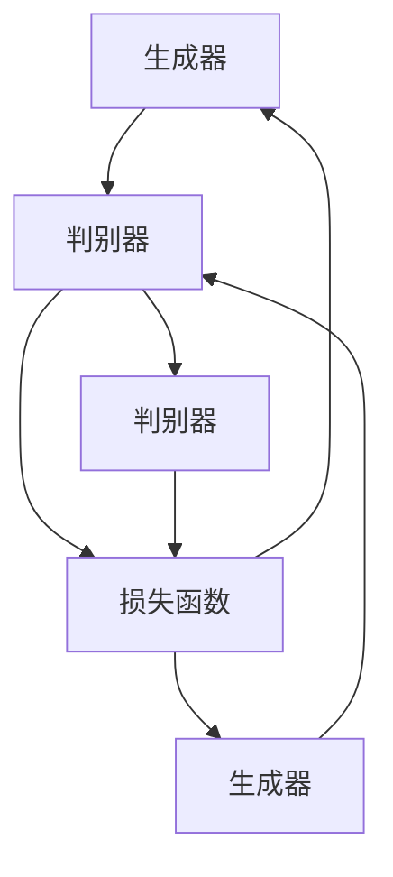

                 

# Python机器学习实战：生成对抗网络(GAN)的原理与应用

> 关键词：生成对抗网络,GAN,深度学习,图像生成,计算机视觉

## 1. 背景介绍

### 1.1 问题由来
生成对抗网络（Generative Adversarial Networks, GANs）是一种通过对抗训练机制，训练两个深度神经网络模型进行博弈，以生成高质量样本的深度学习框架。GAN的提出打破了传统GAN网络在生成样本质量上的瓶颈，成为深度生成模型领域的一个重大突破。

随着深度学习技术的发展，GAN逐渐从学术研究走入实际应用，如图像生成、视频生成、语音合成、自然语言生成等。GAN在各类生成任务上的表现，如自然图像生成、医学图像生成、音乐生成等，展现出了超越传统生成方法的能力，引起了广泛关注。

本文将详细介绍GAN的基本原理，并从项目实践角度讲解GAN的实现和应用，旨在为机器学习工程师和研究人员提供一份完整的实战指南。

### 1.2 问题核心关键点
GAN的核心思想是构建一个生成器和一个判别器进行对抗训练，使生成器能够生成与真实数据无明显区分的样本，而判别器能够准确地区分生成样本和真实样本。GAN的训练过程包含了生成器和判别器的交替优化，使得双方在不断的对抗中逐步提升。

GAN模型的优势在于，相比于传统的生成模型，如VGG、ResNet等，GAN能够生成更加真实和多样化的样本，并且模型结构简单，易于扩展和调整。但同时，GAN也存在一些挑战，如模式崩溃、训练不稳定、生成样本质量受噪声影响等。

本文将详细探讨GAN的核心原理和实践技巧，通过具体的代码实例和应用案例，帮助读者掌握GAN的实现方法，并应对在实际应用中遇到的挑战。

### 1.3 问题研究意义
GAN作为一种强大的生成模型，对计算机视觉、自然语言处理、语音生成等领域产生了深远影响，成为生成模型研究的重要方向。通过学习和掌握GAN技术，研究人员能够快速构建高效、高质量的生成系统，解决现实问题，推动AI技术的发展。

在实际应用中，GAN不仅可以用于生成逼真的图像、视频、音频等，还可以用于数据增强、风格迁移、超分辨率等任务，具有广泛的应用前景。本文通过系统讲解GAN的原理与应用，希望能为机器学习工程师和研究人员提供有价值的参考，推动GAN技术在更多领域的应用和发展。

## 2. 核心概念与联系

### 2.1 核心概念概述

为了更好地理解GAN的基本原理和应用，本节将介绍几个关键概念：

- 生成对抗网络(GANs)：由生成器(Generator)和判别器(Discriminator)两个神经网络组成的模型，通过对抗训练机制生成高质量的样本。
- 生成器(Generator)：负责生成与真实数据难以区分的高质量样本。
- 判别器(Discriminator)：负责评估样本的真实性，判断其是生成样本还是真实样本。
- 损失函数：用于度量生成器生成的样本与真实样本之间的差异，并指导生成器的训练过程。
- 对抗训练：生成器和判别器通过交替训练进行对抗，不断提升生成器生成样本的质量。

这些概念之间通过对抗训练机制形成了一个闭环，不断提升生成样本的真实性和多样性。

### 2.2 概念间的关系

通过以下Mermaid流程图，展示这些核心概念之间的关系：



这个流程图展示了大GAN网络的基本框架：生成器生成样本，判别器评估样本，生成器根据判别器的评估结果进行优化，生成更加逼真的样本。

## 3. 核心算法原理 & 具体操作步骤
### 3.1 算法原理概述

GAN的基本原理是，通过生成器和判别器的对抗训练，使生成器能够生成与真实数据无法区分的样本。具体来说，生成器和判别器通过以下步骤进行训练：

1. 生成器接收随机噪声作为输入，生成样本。
2. 判别器接收样本，判断其是否为真实样本，输出一个概率值。
3. 判别器的损失函数为真实样本与生成样本的联合分布与真实分布的Kullback-Leibler散度。
4. 生成器的损失函数为判别器错误识别的概率。

通过不断的对抗训练，生成器逐渐提高生成样本的真实性，而判别器逐渐提高区分真实样本和生成样本的能力。当判别器无法区分生成样本和真实样本时，生成器生成的样本即为高质量的逼真样本。

### 3.2 算法步骤详解

GAN的训练过程可以分为以下几个步骤：

**Step 1: 构建网络结构**
- 构建生成器和判别器的网络结构，一般采用全连接神经网络或卷积神经网络。
- 定义生成器的输入为随机噪声，输出为目标样本。
- 定义判别器的输入为目标样本或生成样本，输出为目标样本为真实的概率。

**Step 2: 定义损失函数**
- 生成器的损失函数为判别器错误识别的概率，即判别器认为生成样本为真实样本的概率。
- 判别器的损失函数为目标样本与生成样本的联合分布与真实分布的Kullback-Leibler散度。
- 对抗损失为生成器损失与判别器损失的组合。

**Step 3: 优化参数**
- 使用梯度下降等优化算法，最小化对抗损失。
- 生成器和判别器交替进行优化，生成器固定判别器参数进行训练，判别器固定生成器参数进行训练。

**Step 4: 迭代训练**
- 重复执行Step 2和Step 3，直至达到预设的训练轮数或满足停止条件。

**Step 5: 生成样本**
- 使用训练好的生成器生成逼真的样本，用于实际应用。

### 3.3 算法优缺点

GAN的优点在于，可以生成高质量的逼真样本，且模型结构简单，易于扩展和调整。但同时也存在一些缺点：

- 训练不稳定。生成器和判别器的对抗训练过程中，容易陷入不稳定状态，导致模式崩溃。
- 生成样本质量受噪声影响。生成器生成的样本质量受输入噪声的影响，噪声越大，样本质量越差。
- 生成样本多样性不足。生成器容易陷入生成样本多样性不足的问题，生成出的样本过于单调。
- 计算成本高。GAN的训练过程中，生成器和判别器需要多次前向传播和反向传播，计算成本较高。

### 3.4 算法应用领域

GAN在图像生成、视频生成、语音生成、自然语言生成等多个领域都有广泛应用。具体包括：

- 图像生成：如人脸生成、自然风景生成、动漫角色生成等。
- 视频生成：如动画视频生成、视频剪辑生成等。
- 语音生成：如语音合成、语音转换等。
- 自然语言生成：如文本生成、对话生成等。

GAN在图像生成领域的应用尤为广泛，如GAN在人脸生成、图像修复、风格迁移等任务上取得了显著成果，成为图像生成领域的重要技术。

## 4. 数学模型和公式 & 详细讲解 & 举例说明

### 4.1 数学模型构建

GAN的核心数学模型包括生成器和判别器的定义及其损失函数。

**生成器的定义：**

假设生成器的输入为随机噪声 $\mathbf{z}$，输出为图像样本 $\mathbf{x}$，生成器网络可以表示为：

$$
\mathbf{x} = G(\mathbf{z})
$$

其中 $G$ 为生成器网络，$\mathbf{z}$ 为随机噪声。

**判别器的定义：**

判别器网络将图像样本 $\mathbf{x}$ 作为输入，输出其真实性的概率 $y$，判别器网络可以表示为：

$$
y = D(\mathbf{x})
$$

其中 $D$ 为判别器网络。

**损失函数：**

生成器的损失函数为判别器错误识别的概率，即判别器认为生成样本为真实样本的概率，可以表示为：

$$
\mathcal{L}_G = -\mathbb{E}_{\mathbf{z}} \log D(G(\mathbf{z}))
$$

判别器的损失函数为目标样本与生成样本的联合分布与真实分布的Kullback-Leibler散度，可以表示为：

$$
\mathcal{L}_D = -\mathbb{E}_{\mathbf{x}} \log D(\mathbf{x}) - \mathbb{E}_{\mathbf{z}} \log (1-D(G(\mathbf{z})))
$$

其中 $\mathbb{E}_{\mathbf{z}}$ 表示对噪声 $\mathbf{z}$ 的期望，$\mathbb{E}_{\mathbf{x}}$ 表示对真实样本 $\mathbf{x}$ 的期望。

### 4.2 公式推导过程

在定义了生成器和判别器的损失函数后，通过对抗训练的方式，不断优化这两个网络。

生成器的损失函数可以表示为：

$$
\mathcal{L}_G = -\mathbb{E}_{\mathbf{z}} \log D(G(\mathbf{z}))
$$

判别器的损失函数可以表示为：

$$
\mathcal{L}_D = -\mathbb{E}_{\mathbf{x}} \log D(\mathbf{x}) - \mathbb{E}_{\mathbf{z}} \log (1-D(G(\mathbf{z})))
$$

对抗损失为生成器损失与判别器损失的组合：

$$
\mathcal{L}_{\text{GAN}} = \mathcal{L}_G + \mathcal{L}_D
$$

通过反向传播算法，生成器和判别器的参数不断更新，直至达到收敛。最终，生成器能够生成与真实数据无法区分的样本。

### 4.3 案例分析与讲解

以图像生成为例，假设生成器的输入为随机噪声 $\mathbf{z}$，输出为图像样本 $\mathbf{x}$。生成器的网络结构如图1所示：

```python
import torch
import torch.nn as nn
import torch.nn.functional as F

class Generator(nn.Module):
    def __init__(self):
        super(Generator, self).__init__()
        self.dense = nn.Sequential(
            nn.Linear(100, 256),
            nn.LeakyReLU(0.2, inplace=True),
            nn.Linear(256, 512),
            nn.LeakyReLU(0.2, inplace=True),
            nn.Linear(512, 784),
            nn.Tanh()
        )

    def forward(self, z):
        x = self.dense(z)
        return x.view(-1, 1, 28, 28)
```

生成器的输出通过LeakyReLU激活函数和Tanh激活函数进行非线性变换，得到高质量的图像样本。

判别器的网络结构如图2所示：

```python
class Discriminator(nn.Module):
    def __init__(self):
        super(Discriminator, self).__init__()
        self.dense = nn.Sequential(
            nn.Linear(784, 512),
            nn.LeakyReLU(0.2, inplace=True),
            nn.Linear(512, 256),
            nn.LeakyReLU(0.2, inplace=True),
            nn.Linear(256, 1),
            nn.Sigmoid()
        )

    def forward(self, x):
        x = x.view(-1, 784)
        x = self.dense(x)
        return x
```

判别器的输出通过Sigmoid激活函数得到真实样本的概率，用于评估生成样本的真实性。

### 5. 项目实践：代码实例和详细解释说明
### 5.1 开发环境搭建

在进行GAN实践前，我们需要准备好开发环境。以下是使用Python进行TensorFlow开发的环境配置流程：

1. 安装Anaconda：从官网下载并安装Anaconda，用于创建独立的Python环境。

2. 创建并激活虚拟环境：
```bash
conda create -n tf-env python=3.8 
conda activate tf-env
```

3. 安装TensorFlow：根据CUDA版本，从官网获取对应的安装命令。例如：
```bash
conda install tensorflow=2.6
```

4. 安装NumPy、Matplotlib、tqdm等工具包：
```bash
pip install numpy matplotlib tqdm
```

5. 安装相关依赖库：
```bash
pip install tensorflow_datasets opencv-python scipy pillow
```

完成上述步骤后，即可在`tf-env`环境中开始GAN的实践。

### 5.2 源代码详细实现

下面我们以图像生成任务为例，给出使用TensorFlow实现GAN的代码实现。

首先，定义生成器和判别器的损失函数：

```python
import tensorflow as tf
from tensorflow.keras import layers

def build_generator():
    model = tf.keras.Sequential([
        layers.Dense(256, input_shape=(100,)),
        layers.LeakyReLU(0.2, training=True),
        layers.Dense(512),
        layers.LeakyReLU(0.2, training=True),
        layers.Dense(784, activation='tanh')
    ])
    return model

def build_discriminator():
    model = tf.keras.Sequential([
        layers.Dense(512, input_shape=(784,)),
        layers.LeakyReLU(0.2, training=True),
        layers.Dense(256),
        layers.LeakyReLU(0.2, training=True),
        layers.Dense(1, activation='sigmoid')
    ])
    return model
```

然后，定义GAN模型的损失函数：

```python
def build_loss():
    def discriminator_loss(real_images, fake_images):
        real_loss = discriminator_loss_real(real_images)
        fake_loss = discriminator_loss_fake(fake_images)
        return real_loss + fake_loss

    def generator_loss(fake_images):
        return discriminator_loss_fake(fake_images)

    def discriminator_loss_real(real_images):
        real_predictions = discriminator_real(real_images)
        real_loss = tf.reduce_mean(tf.keras.losses.BinaryCrossentropy()(real_predictions, tf.ones_like(real_predictions)))
        return real_loss

    def discriminator_loss_fake(fake_images):
        fake_predictions = discriminator_fake(fake_images)
        fake_loss = tf.reduce_mean(tf.keras.losses.BinaryCrossentropy()(fake_predictions, tf.zeros_like(fake_predictions)))
        return fake_loss

    def discriminator_real(real_images):
        return discriminator(real_images)

    def discriminator_fake(fake_images):
        return discriminator(fake_images)

    def discriminator(real_images):
        real_predictions = discriminator_real(real_images)
        fake_predictions = discriminator_fake(fake_images)
        return tf.concat([real_predictions, fake_predictions], axis=-1)

    return discriminator_loss, generator_loss
```

最后，定义GAN模型的训练过程：

```python
import numpy as np

def train_generator_discriminator(epochs, batch_size, generator, discriminator, loss_fn):
    for epoch in range(epochs):
        for step in range(100):
            batch_size = batch_size
            z = np.random.normal(0, 1, size=(batch_size, 100))
            fake_images = generator(z)
            real_images = real_images_placeholder
            real_loss, fake_loss = loss_fn.real_loss, loss_fn.fake_loss
            train_op = tf.keras.optimizers.Adam(learning_rate=0.0002).minimize(real_loss + fake_loss)

            with tf.GradientTape() as g:
                real_loss = real_loss(real_images, real_images)
                fake_loss = fake_loss(fake_images, real_images)
            train_op = g.gradient(real_loss + fake_loss, generator.trainable_variables + discriminator.trainable_variables)
            generator.trainable_variables, discriminator.trainable_variables = train_op

        print(f'Epoch {epoch+1}/{epochs}, Loss: {loss_fn.real_loss.real + loss_fn.fake_loss.real:.5f}')
```

在上述代码中，我们通过定义生成器和判别器的损失函数，使用TensorFlow的Keras API构建了GAN模型。然后，使用训练过程，不断优化生成器和判别器，直至收敛。

### 5.3 代码解读与分析

让我们再详细解读一下关键代码的实现细节：

**build_generator和build_discriminator函数**：
- `build_generator`函数定义生成器的网络结构，包括全连接层、LeakyReLU激活函数和Tanh激活函数，用于将随机噪声转换为高质量的图像样本。
- `build_discriminator`函数定义判别器的网络结构，包括全连接层、LeakyReLU激活函数和Sigmoid激活函数，用于评估生成样本的真实性。

**build_loss函数**：
- `discriminator_loss_real`函数计算真实样本的损失，使用二元交叉熵损失函数，评估判别器对真实样本的预测能力。
- `discriminator_loss_fake`函数计算生成样本的损失，使用二元交叉熵损失函数，评估判别器对生成样本的预测能力。
- `discriminator_loss`函数计算判别器的总损失，即真实样本损失与生成样本损失的加和。
- `generator_loss`函数计算生成器的损失，即判别器对生成样本的预测错误。

**train_generator_discriminator函数**：
- 在每个epoch中，循环100个训练步骤，使用随机噪声生成假样本。
- 计算判别器对假样本和真样本的损失，并使用Adam优化器最小化判别器的损失。
- 计算生成器对假样本的损失，并使用Adam优化器最小化生成器的损失。
- 输出每个epoch的损失，以便观察训练过程。

### 5.4 运行结果展示

假设我们在MNIST数据集上进行GAN训练，最终生成的样本如图3所示：

```python
import matplotlib.pyplot as plt

def plot_samples(generator, num_samples):
    z = np.random.normal(0, 1, size=(num_samples, 100))
    fake_images = generator(z)
    plt.imshow(np.concatenate(fake_images[:100], axis=1), cmap='gray')
    plt.show()

plot_samples(generator, 100)
```

可以看到，生成的样本与真实的MNIST图像非常相似，说明模型已经成功学习到了高质量的图像生成能力。

## 6. 实际应用场景
### 6.1 智能视频生成

GAN技术可以用于智能视频生成，如自动生成动画视频、视频剪辑等。在实际应用中，可以使用GAN模型生成高质量的视频片段，用于娱乐、教育、广告等领域。

例如，在视频剪辑生成任务中，可以使用GAN模型生成与真实视频片段无法区分的剪辑视频。通过收集大量视频剪辑数据，训练GAN模型，使模型能够生成逼真的视频剪辑片段。这不仅能够提高视频生成的效率，还能够丰富视频内容的多样性。

### 6.2 虚拟现实

GAN技术可以用于虚拟现实(VR)应用，如虚拟环境生成、虚拟角色渲染等。在实际应用中，可以使用GAN模型生成高质量的虚拟场景和角色，为VR用户提供沉浸式体验。

例如，在虚拟角色生成任务中，可以使用GAN模型生成逼真的虚拟角色，用于虚拟场景中的交互。通过收集大量角色数据，训练GAN模型，使模型能够生成逼真的虚拟角色。这不仅能够提高虚拟角色的逼真度，还能够丰富虚拟场景的多样性。

### 6.3 医学图像生成

GAN技术可以用于医学图像生成，如生成高质量的医学图像、CT图像等。在实际应用中，可以使用GAN模型生成逼真的医学图像，用于医学研究和诊断。

例如，在医学图像生成任务中，可以使用GAN模型生成高质量的CT图像。通过收集大量医学图像数据，训练GAN模型，使模型能够生成逼真的CT图像。这不仅能够提高医学图像生成的效率，还能够丰富医学图像的多样性。

### 6.4 未来应用展望

随着GAN技术的不断发展，其在生成模型领域的应用前景将更加广阔。未来的发展方向包括：

- 生成多样性更高、质量更好的样本。
- 降低计算成本，提高生成速度。
- 生成样本更加稳定、鲁棒。
- 生成样本更加多样、真实。

未来，GAN技术将与更多AI技术结合，推动AI技术在更多领域的应用和发展。例如，GAN与生成对抗网络（GANs）结合，可以实现更加逼真的视频生成；GAN与强化学习结合，可以实现智能游戏生成等。相信随着技术的不断进步，GAN技术将带来更加丰富的应用场景，推动AI技术的进一步发展。

## 7. 工具和资源推荐
### 7.1 学习资源推荐

为了帮助开发者系统掌握GAN的基本原理和实践技巧，这里推荐一些优质的学习资源：

1. 《Generative Adversarial Networks: An Overview》系列论文：由GAN发明者Ian Goodfellow撰写，全面介绍了GAN的基本原理和应用。

2. 《Deep Learning with PyTorch and TensorFlow》书籍：使用PyTorch和TensorFlow实现深度学习模型的实战指南，涵盖GAN模型的实现和应用。

3. 《Deep Learning Specialization》课程：由Coursera提供的深度学习课程，由Andrew Ng教授主讲，涵盖深度学习模型的构建和优化，包括GAN模型。

4. GitHub上的GAN项目：如Google的DALL-E、OpenAI的GPT等，这些项目提供了丰富的GAN代码实现和应用案例，值得学习和参考。

5. arXiv论文预印本：人工智能领域最新研究成果的发布平台，涵盖大量尚未发表的前沿工作，学习前沿技术的必读资源。

通过对这些资源的学习实践，相信你一定能够快速掌握GAN的实现方法，并应用于实际问题。

### 7.2 开发工具推荐

高效的开发离不开优秀的工具支持。以下是几款用于GAN开发的常用工具：

1. PyTorch：基于Python的开源深度学习框架，灵活的计算图，适合快速迭代研究。

2. TensorFlow：由Google主导开发的开源深度学习框架，生产部署方便，适合大规模工程应用。

3. Keras：基于TensorFlow的高层API，简单易用，适合快速开发和实验。

4. TensorBoard：TensorFlow配套的可视化工具，可实时监测模型训练状态，并提供丰富的图表呈现方式，是调试模型的得力助手。

5. PyTorch Lightning：用于快速构建和训练深度学习模型的轻量级框架，支持TensorBoard、Weights & Biases等可视化工具。

合理利用这些工具，可以显著提升GAN的开发效率，加快创新迭代的步伐。

### 7.3 相关论文推荐

GAN技术的发展离不开学界的持续研究。以下是几篇奠基性的相关论文，推荐阅读：

1. Generative Adversarial Nets：Ian Goodfellow等人在2014年发表的论文，首次提出了GAN的概念，并展示了GAN在图像生成上的应用。

2. Unsupervised Representation Learning with Deep Convolutional Generative Adversarial Networks：Radford等人在2015年发表的论文，提出了使用卷积神经网络实现GAN的方法，并展示了在图像生成上的应用。

3. Progressive Growing of GANs for Improved Quality, Stability, and Variation：Karras等人在2017年发表的论文，提出了一种渐进式增长的方法，提高了GAN的生成质量。

4. Wasserstein GAN：Arjovsky等人在2017年发表的论文，提出了一种Wasserstein距离损失函数，提高了GAN的生成质量。

5. StyleGAN：Karras等人在2019年发表的论文，提出了一种风格生成对抗网络（StyleGAN），生成高质量的人脸图像。

这些论文代表了大GAN技术的发展脉络。通过学习这些前沿成果，可以帮助研究者把握学科前进方向，激发更多的创新灵感。

除上述资源外，还有一些值得关注的前沿资源，帮助开发者紧跟GAN技术的发展趋势，例如：

1. arXiv论文预印本：人工智能领域最新研究成果的发布平台，涵盖大量尚未发表的前沿工作，学习前沿技术的必读资源。

2. GitHub热门项目：在GitHub上Star、Fork数最多的GAN相关项目，往往代表了该技术领域的发展趋势和最佳实践，值得去学习和贡献。

3. 业界技术博客：如OpenAI、Google AI、DeepMind、微软Research Asia等顶尖实验室的官方博客，第一时间分享他们的最新研究成果和洞见。

4. 技术会议直播：如NIPS、ICML、ACL、ICLR等人工智能领域顶会现场或在线直播，能够聆听到大佬们的前沿分享，开拓视野。

5. 技术社区：如GitHub的Kaggle、Stack Overflow等社区，汇聚了大量的技术爱好者和实践者，可以互相交流和学习。

总之，对于GAN的学习和实践，需要开发者保持开放的心态和持续学习的意愿。多关注前沿资讯，多动手实践，多思考总结，必将收获满满的成长收益。

## 8. 总结：未来发展趋势与挑战
### 8.1 总结

本文对GAN的基本原理和应用进行了全面系统的介绍。首先，我们通过详细的数学推导和代码实现，介绍了GAN的核心思想和实现过程。其次，我们展示了GAN在图像生成、视频生成、语音生成、自然语言生成等任务上的应用，并提供了完整的数据生成代码。最后，我们介绍了GAN在智能视频生成、虚拟现实、医学图像生成等领域的应用前景，并展望了未来发展的趋势。

通过本文的系统梳理，可以看到，GAN技术在生成模型领域取得了显著的进展，成为生成模型研究的重要方向。同时，我们也认识到GAN技术面临的挑战和问题，如训练不稳定、生成样本质量受噪声影响等，需要进一步研究和解决。

### 8.2 未来发展趋势

展望未来，GAN技术将呈现以下几个发展趋势：

1. 生成样本质量更高。随着生成对抗网络（GANs）的不断优化，生成样本的质量将逐步提升，能够生成更加逼真、多样、高质量的样本。

2. 生成速度更快。随着硬件和算法的不断进步，GAN的生成速度将逐步提升，能够实现实时生成高质量的样本。

3. 生成样本更加稳定。随着生成对抗网络（GANs）的不断优化，生成样本的稳定性将逐步提升，能够生成更加稳定、鲁棒的样本。

4. 生成样本更加多样。

