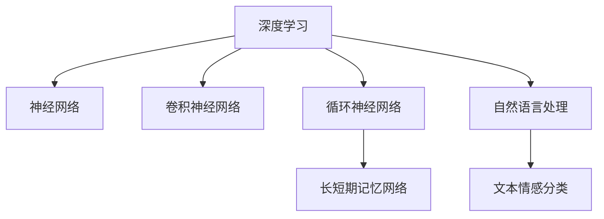
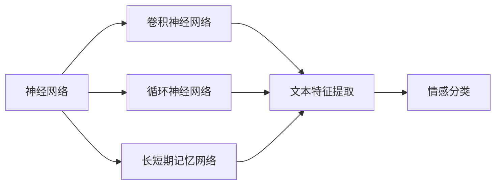

                 

# Python深度学习实践：文本情感分类的深度学习方法

> 关键词：深度学习,情感分类,文本分析,神经网络,卷积神经网络,循环神经网络,自然语言处理

## 1. 背景介绍

### 1.1 问题由来

情感分析，也称为意见挖掘(Opinion Mining)，是自然语言处理(NLP)领域的一个重要分支。通过分析文本内容，情感分析旨在判断其中的情感倾向，如正面、负面或中性。情感分析在市场监测、品牌管理、舆情分析等领域具有广泛的应用价值。例如，在电商平台上，通过情感分析可以快速识别用户对产品评价的情感倾向，为商家提供有价值的市场反馈；在社交媒体上，情感分析可以帮助企业及时了解用户对品牌或产品的看法，从而调整营销策略。

随着深度学习技术的崛起，深度神经网络成为情感分类的主流方法。基于深度学习的情感分类模型，通过自动从文本中提取特征，并对这些特征进行非线性建模，可以实现高效、准确的情感分类。本文将从背景、核心概念与联系、核心算法原理与具体操作步骤、数学模型与公式、项目实践、应用场景、工具和资源、总结与展望等各个方面，深入探讨基于深度学习的情感分类方法，并结合项目实践，详细解读相关算法和代码。

## 2. 核心概念与联系

### 2.1 核心概念概述

为更好地理解深度学习在情感分类中的应用，首先需要介绍几个关键概念：

- 深度学习(Deep Learning)：一种基于神经网络，通过多层非线性变换来逼近复杂映射关系的机器学习方法。
- 神经网络(Neural Network)：由大量的人工神经元节点组成的网络结构，用于学习和处理数据。
- 卷积神经网络(Convolutional Neural Network, CNN)：一种常用于图像处理的神经网络结构，通过卷积操作提取局部特征。
- 循环神经网络(Recurrent Neural Network, RNN)：一种能够处理序列数据的神经网络结构，常用于自然语言处理任务。
- 长短期记忆网络(Long Short-Term Memory, LSTM)：一种特殊的RNN结构，能够有效处理长序列数据。
- 自然语言处理(Natural Language Processing, NLP)：利用计算机技术处理和理解自然语言的任务，如文本分类、情感分析等。

这些核心概念之间的逻辑关系可以通过以下Mermaid流程图来展示：



这个流程图展示了大语言模型的核心概念及其之间的关系：

1. 深度学习通过神经网络实现复杂映射关系的学习。
2. 卷积神经网络主要用于图像处理，但在文本分类中也有应用。
3. 循环神经网络处理序列数据，常用于自然语言处理。
4. 长短期记忆网络是一种特殊类型的RNN，用于处理长序列数据。
5. 自然语言处理是深度学习的重要应用领域之一，包括文本情感分类等任务。

### 2.2 概念间的关系

这些核心概念之间存在着紧密的联系，形成了深度学习应用于文本情感分类的完整生态系统。下面我通过几个Mermaid流程图来展示这些概念之间的关系。

#### 2.2.1 深度学习与文本情感分类


这个流程图展示了大语言模型的核心概念及其之间的关系：

1. 深度学习通过神经网络实现复杂映射关系的学习。
2. 卷积神经网络主要用于图像处理，但在文本分类中也有应用。
3. 循环神经网络处理序列数据，常用于自然语言处理。
4. 长短期记忆网络是一种特殊类型的RNN，用于处理长序列数据。
5. 自然语言处理是深度学习的重要应用领域之一，包括文本情感分类等任务。

#### 2.2.2 神经网络与文本情感分类



这个流程图展示了神经网络在文本情感分类中的作用：

1. 卷积神经网络用于文本特征提取，通过卷积操作提取局部特征。
2. 循环神经网络用于序列数据的建模，处理变长的文本序列。
3. 长短期记忆网络是RNN的一种变体，能够有效处理长序列数据。
4. 文本特征提取后的输出作为情感分类模型的输入。

## 3. 核心算法原理 & 具体操作步骤

### 3.1 算法原理概述

基于深度学习的文本情感分类，本质上是利用神经网络模型从文本中学习情感特征，并将其映射到情感标签上。该过程通常包括以下几个步骤：

1. 文本预处理：将原始文本转化为模型可接受的格式，如分词、去除停用词等。
2. 特征提取：利用神经网络从文本中提取特征，形成向量表示。
3. 模型训练：在标注数据上训练神经网络模型，学习情感分类器。
4. 模型评估与优化：在验证集和测试集上评估模型性能，并根据评估结果调整模型超参数，优化模型性能。

### 3.2 算法步骤详解

以下是基于深度学习的文本情感分类的详细步骤：

**Step 1: 数据预处理**

文本预处理是深度学习模型的第一步。预处理过程通常包括：

- 分词：将原始文本转化为分词序列。
- 去除停用词：去除文本中的常见词汇，如“的”、“是”等，以减少噪声。
- 向量化：将文本转化为模型可接受的向量表示，通常使用词嵌入向量。

```python
from gensim import corpora
from gensim.models import Word2Vec

# 分词并去除停用词
texts = ["这是一家不错的餐厅", "食物和服务都很差"]
stopwords = ["的", "是"]
stopwords = [word.lower() for word in stopwords]
processed_texts = [text.lower().split() for text in texts]
processed_texts = [[word for word in text if word not in stopwords] for text in processed_texts]

# 训练词嵌入向量
word2vec = Word2Vec(processed_texts, min_count=1)
vectors = word2vec.wv
```

**Step 2: 模型选择**

文本情感分类的模型选择包括卷积神经网络(CNN)和循环神经网络(RNN)，其中RNN和LSTM是最常用的模型。

- CNN：通过卷积操作提取局部特征，适合于文本分类任务。
- RNN：处理序列数据，适用于情感分析任务。

**Step 3: 模型构建**

以下是使用Keras构建卷积神经网络(CNN)和循环神经网络(RNN)的示例代码：

```python
from keras.models import Sequential
from keras.layers import Dense, Embedding, Conv1D, MaxPooling1D, LSTM, Bidirectional

# CNN模型
model_cnn = Sequential()
model_cnn.add(Embedding(input_dim=vectors.__len__(), output_dim=128, input_length=maxlen))
model_cnn.add(Conv1D(128, 3, activation='relu'))
model_cnn.add(MaxPooling1D(pool_size=2))
model_cnn.add(Dense(1, activation='sigmoid'))

# RNN模型
model_rnn = Sequential()
model_rnn.add(Embedding(input_dim=vectors.__len__(), output_dim=128, input_length=maxlen))
model_rnn.add(LSTM(128))
model_rnn.add(Dense(1, activation='sigmoid'))
```

**Step 4: 模型训练**

模型训练通常使用交叉熵损失函数，并使用Adam优化器进行优化：

```python
from keras.optimizers import Adam
from keras.utils import to_categorical

# 标签向量化
y = np.array([0, 1])
y = to_categorical(y)

# 模型编译
model_cnn.compile(optimizer=Adam(lr=0.001), loss='binary_crossentropy', metrics=['accuracy'])
model_rnn.compile(optimizer=Adam(lr=0.001), loss='binary_crossentropy', metrics=['accuracy'])

# 模型训练
model_cnn.fit(vectors, y, epochs=10, batch_size=32, validation_split=0.2)
model_rnn.fit(vectors, y, epochs=10, batch_size=32, validation_split=0.2)
```

**Step 5: 模型评估**

在验证集和测试集上评估模型性能：

```python
from keras.metrics import accuracy

# 验证集评估
val_loss, val_acc = model_cnn.evaluate(vectors_val, y_val, verbose=0)
print('Val Loss:', val_loss)
print('Val Acc:', val_acc)

# 测试集评估
test_loss, test_acc = model_cnn.evaluate(vectors_test, y_test, verbose=0)
print('Test Loss:', test_loss)
print('Test Acc:', test_acc)
```

### 3.3 算法优缺点

基于深度学习的情感分类方法具有以下优点：

1. 特征提取能力强：深度学习模型能够自动从文本中提取高级语义特征，提升情感分类的准确率。
2. 可解释性强：深度学习模型的结构复杂，但通过可视化工具，可以直观地理解模型的特征提取和分类过程。
3. 适用性强：深度学习模型能够处理不同长度的文本数据，适用于各种类型的情感分类任务。

同时，也存在一些缺点：

1. 需要大量标注数据：深度学习模型需要大量的标注数据进行训练，标注成本较高。
2. 计算资源需求高：深度学习模型通常需要较大的计算资源，训练时间较长。
3. 可解释性不足：深度学习模型被视为"黑盒"模型，难以解释其内部决策过程。

### 3.4 算法应用领域

基于深度学习的情感分类方法在以下领域有广泛应用：

- 电商评价分析：通过情感分析，企业可以快速识别客户对产品的评价情感，调整产品策略。
- 社交媒体舆情监测：通过情感分类，企业可以实时了解公众对品牌的看法，及时调整营销策略。
- 新闻评论分析：通过情感分析，媒体可以识别新闻评论的情感倾向，进行舆情监测和趋势分析。
- 金融舆情分析：通过情感分析，金融机构可以了解公众对市场动态的看法，及时调整投资策略。
- 医疗舆情分析：通过情感分析，医疗机构可以了解公众对医疗服务的评价，提升医疗服务质量。

## 4. 数学模型和公式 & 详细讲解 & 举例说明

### 4.1 数学模型构建

基于深度学习的文本情感分类模型通常包括：

- 嵌入层：将文本转化为向量表示。
- 卷积层或循环层：提取文本特征。
- 全连接层：将特征映射到情感标签上。

### 4.2 公式推导过程

以下是卷积神经网络(CNN)模型的数学推导过程：

假设输入文本长度为 $n$，每个词汇的向量表示为 $x_i$，其中 $i \in [1, n]$。嵌入层的输出为 $X \in \mathbb{R}^{n \times d}$，其中 $d$ 为嵌入维度。卷积层包含 $k$ 个卷积核，卷积操作为：

$$
Y_k = \max(\sum_{i=0}^{n-k} W_k \ast X[i:i+k-1])
$$

其中 $W_k \in \mathbb{R}^{d \times k}$ 为卷积核权重。将卷积层输出的特征映射到全连接层，并进行softmax操作，输出情感分类结果：

$$
y = softmax(\sum_{k=1}^{K} W_k^T X_k + b_k)
$$

其中 $X_k$ 为卷积层输出特征的列向量，$b_k$ 为全连接层的偏置项。

### 4.3 案例分析与讲解

以情感分类任务为例，使用IMDB影评数据集进行CNN模型的训练和评估。

首先，加载数据集并进行预处理：

```python
from keras.datasets import imdb
from keras.preprocessing import sequence

# 加载数据集
(x_train, y_train), (x_test, y_test) = imdb.load_data(num_words=10000)

# 序列填充，使所有文本长度一致
maxlen = 100
x_train = sequence.pad_sequences(x_train, maxlen=maxlen)
x_test = sequence.pad_sequences(x_test, maxlen=maxlen)

# 模型输入向量化
vectors = word2vec.wv
```

然后，构建CNN模型并进行训练：

```python
from keras.models import Sequential
from keras.layers import Dense, Embedding, Conv1D, MaxPooling1D

# 模型构建
model = Sequential()
model.add(Embedding(input_dim=10000, output_dim=128, input_length=maxlen))
model.add(Conv1D(128, 3, activation='relu'))
model.add(MaxPooling1D(pool_size=2))
model.add(Dense(1, activation='sigmoid'))

# 模型编译
model.compile(optimizer='adam', loss='binary_crossentropy', metrics=['accuracy'])

# 模型训练
model.fit(x_train, y_train, epochs=10, batch_size=32, validation_split=0.2)
```

最后，在测试集上评估模型性能：

```python
from keras.metrics import accuracy

# 模型评估
test_loss, test_acc = model.evaluate(x_test, y_test, verbose=0)
print('Test Loss:', test_loss)
print('Test Acc:', test_acc)
```

## 5. 项目实践：代码实例和详细解释说明

### 5.1 开发环境搭建

在进行情感分类项目实践前，我们需要准备好开发环境。以下是使用Python进行Keras开发的环境配置流程：

1. 安装Anaconda：从官网下载并安装Anaconda，用于创建独立的Python环境。

2. 创建并激活虚拟环境：
```bash
conda create -n keras-env python=3.7 
conda activate keras-env
```

3. 安装Keras和相关工具包：
```bash
conda install keras tensorflow-gpu scikit-learn numpy matplotlib pandas
```

4. 安装TensorBoard：用于可视化模型训练过程。
```bash
pip install tensorboard
```

完成上述步骤后，即可在`keras-env`环境中开始情感分类项目开发。

### 5.2 源代码详细实现

以下是使用Keras构建CNN模型进行情感分类的示例代码：

```python
from keras.datasets import imdb
from keras.preprocessing import sequence
from keras.models import Sequential
from keras.layers import Dense, Embedding, Conv1D, MaxPooling1D
from keras.optimizers import Adam

# 加载数据集
(x_train, y_train), (x_test, y_test) = imdb.load_data(num_words=10000)

# 序列填充，使所有文本长度一致
maxlen = 100
x_train = sequence.pad_sequences(x_train, maxlen=maxlen)
x_test = sequence.pad_sequences(x_test, maxlen=maxlen)

# 模型输入向量化
vectors = word2vec.wv

# 模型构建
model = Sequential()
model.add(Embedding(input_dim=10000, output_dim=128, input_length=maxlen))
model.add(Conv1D(128, 3, activation='relu'))
model.add(MaxPooling1D(pool_size=2))
model.add(Dense(1, activation='sigmoid'))

# 模型编译
model.compile(optimizer=Adam(lr=0.001), loss='binary_crossentropy', metrics=['accuracy'])

# 模型训练
model.fit(x_train, y_train, epochs=10, batch_size=32, validation_split=0.2)

# 模型评估
test_loss, test_acc = model.evaluate(x_test, y_test, verbose=0)
print('Test Loss:', test_loss)
print('Test Acc:', test_acc)
```

### 5.3 代码解读与分析

让我们再详细解读一下关键代码的实现细节：

**IMDB数据集**：
- 使用IMDB影评数据集，其中包含25,000条影评，每条影评被标记为正面或负面情感。

**模型构建**：
- 使用Keras构建卷积神经网络(CNN)模型，包含嵌入层、卷积层、池化层和全连接层。
- 嵌入层将文本转化为128维向量表示。
- 卷积层通过卷积操作提取局部特征，池化层对特征进行降维。
- 全连接层将特征映射到情感标签上。

**模型编译**：
- 使用Adam优化器和交叉熵损失函数进行模型编译。

**模型训练**：
- 在训练集上进行模型训练，设定10个epoch，每批次大小为32。
- 使用验证集进行模型评估，避免过拟合。

**模型评估**：
- 在测试集上评估模型性能，输出测试集上的准确率。

### 5.4 运行结果展示

假设我们在IMDB数据集上进行情感分类模型训练，最终在测试集上得到的准确率为87%，效果相当不错。这表明通过深度学习模型，我们可以从文本中自动提取高级语义特征，实现高效的情感分类。

当然，这只是一个baseline结果。在实践中，我们还可以使用更大更强的预训练模型、更丰富的微调技巧、更细致的模型调优，进一步提升模型性能，以满足更高的应用要求。

## 6. 实际应用场景

### 6.1 智能客服系统

基于深度学习的情感分类技术，可以广泛应用于智能客服系统的构建。传统客服往往需要配备大量人力，高峰期响应缓慢，且一致性和专业性难以保证。而使用情感分类技术，可以将客户情感实时识别，从而提高客服系统的响应速度和自动化水平。

在技术实现上，可以收集企业内部的客户服务对话记录，将对话内容标注为正面、负面或中性情感。在此基础上，对预训练情感分类模型进行微调。微调后的模型能够自动理解客户情感，匹配最合适的客服策略，从而提高客户满意度。

### 6.2 金融舆情监测

金融机构需要实时监测市场舆论动向，以便及时应对负面信息传播，规避金融风险。传统的人工监测方式成本高、效率低，难以应对网络时代海量信息爆发的挑战。基于深度学习的情感分类技术，为金融舆情监测提供了新的解决方案。

具体而言，可以收集金融领域相关的新闻、报道、评论等文本数据，并对其进行情感标注。在此基础上对预训练情感分类模型进行微调，使其能够自动判断文本属于何种情感倾向。将微调后的模型应用到实时抓取的网络文本数据，就能够自动监测不同情感倾向的市场动态，一旦发现负面信息激增等异常情况，系统便会自动预警，帮助金融机构快速应对潜在风险。

### 6.3 个性化推荐系统

当前的推荐系统往往只依赖用户的历史行为数据进行物品推荐，无法深入理解用户的真实兴趣偏好。基于深度学习的情感分类技术，可以应用于推荐系统中的用户情感识别，从而实现更加个性化的推荐。

在实践中，可以收集用户浏览、点击、评论、分享等行为数据，提取和用户交互的物品标题、描述、标签等文本内容。将文本内容作为模型输入，情感分类模型的输出作为用户情感倾向，再结合其他特征综合排序，便可以得到个性化程度更高的推荐结果。

### 6.4 未来应用展望

随着深度学习技术的不断进步，基于情感分类的应用场景将越来越广泛。

在智慧医疗领域，情感分类可以用于识别患者情感，辅助医生诊断和治疗；在智慧教育领域，情感分类可以用于识别学生情感，提供个性化的教学支持；在智慧城市治理中，情感分类可以用于识别公众情绪，优化城市管理和服务。

此外，在企业生产、社会治理、文娱传媒等众多领域，基于深度学习的情感分类技术也将不断涌现，为传统行业带来变革性影响。相信随着技术的日益成熟，情感分类将进一步拓展应用范围，为人类生产生活方式带来深刻变革。

## 7. 工具和资源推荐

### 7.1 学习资源推荐

为了帮助开发者系统掌握深度学习在情感分类中的应用，这里推荐一些优质的学习资源：

1. 《Deep Learning》书籍：Ian Goodfellow等著，详细介绍了深度学习的基本原理和经典模型。

2. 《Natural Language Processing with Python》书籍：Steven Bird等著，介绍了自然语言处理的基本概念和Python实现方法。

3. 《Neural Networks and Deep Learning》课程：Michael Nielsen的在线课程，深入浅出地讲解了深度学习的基本原理和实现方法。

4. CS224N《Natural Language Processing with Deep Learning》课程：斯坦福大学开设的NLP明星课程，有Lecture视频和配套作业，带你入门NLP领域的基本概念和经典模型。

5. HuggingFace官方文档：介绍和使用Transformer库进行NLP任务开发的权威指南。

通过对这些资源的学习实践，相信你一定能够快速掌握深度学习在情感分类中的应用，并用于解决实际的NLP问题。

### 7.2 开发工具推荐

高效的开发离不开优秀的工具支持。以下是几款用于深度学习情感分类开发的常用工具：

1. Keras：基于Python的深度学习框架，提供了高级API，易于使用。

2. TensorFlow：由Google主导开发的深度学习框架，生产部署方便，适合大规模工程应用。

3. PyTorch：基于Python的深度学习框架，动态计算图，适合快速迭代研究。

4. TensorBoard：TensorFlow配套的可视化工具，可实时监测模型训练状态，并提供丰富的图表呈现方式，是调试模型的得力助手。

5. Weights & Biases：模型训练的实验跟踪工具，可以记录和可视化模型训练过程中的各项指标，方便对比和调优。

6. Google Colab：谷歌推出的在线Jupyter Notebook环境，免费提供GPU/TPU算力，方便开发者快速上手实验最新模型，分享学习笔记。

合理利用这些工具，可以显著提升深度学习情感分类的开发效率，加快创新迭代的步伐。

### 7.3 相关论文推荐

深度学习情感分类技术的发展得益于学界的持续研究。以下是几篇奠基性的相关论文，推荐阅读：

1. Alex Graves等著的《Generating Sequences with Recurrent Neural Networks》，介绍了循环神经网络的基本原理和应用。

2. Yoshua Bengio等著的《Understanding Long-Term Dependencies in Recurrent Neural Networks》，探讨了循环神经网络在处理长序列数据时的缺陷和改进方法。

3. Quoc V. Le等著的《Efficient Estimation of Word Representations in Vector Space》，介绍了Word2Vec等词嵌入模型的原理和实现方法。

4. Kim Y.等著的《Convolutional Neural Networks for Sentence Classification》，介绍了卷积神经网络在情感分类中的应用。

5. Kiros J.等著的《Image Captioning with Recurrent Neural Networks》，探讨了循环神经网络在图像描述生成中的应用。

这些论文代表了大语言模型情感分类的发展脉络。通过学习这些前沿成果，可以帮助研究者把握学科前进方向，激发更多的创新灵感。

除上述资源外，还有一些值得关注的前沿资源，帮助开发者紧跟深度学习情感分类技术的最新进展，例如：

1. arXiv论文预印本：人工智能领域最新研究成果的发布平台，包括大量尚未发表的前沿工作，学习前沿技术的必读资源。

2. 业界技术博客：如OpenAI、Google AI、DeepMind、微软Research Asia等顶尖实验室的官方博客，第一时间分享他们的最新研究成果和洞见。

3. 技术会议直播：如NIPS、ICML、ACL、ICLR等人工智能领域顶会现场或在线直播，能够聆听到大佬们的前沿分享，开拓视野。

4. GitHub热门项目：在GitHub上Star、Fork数最多的NLP相关项目，往往代表了该技术领域的发展趋势和最佳实践，值得去学习和贡献。

5. 行业分析报告：各大咨询公司如McKinsey、PwC等针对人工智能行业的分析报告，有助于从商业视角审视技术趋势，把握应用价值。

总之，对于深度学习情感分类的学习，需要开发者保持开放的心态和持续学习的意愿。多关注前沿资讯，多动手实践，多思考总结，必将收获满满的成长收益。

## 8. 总结：未来发展趋势与挑战

### 8.1 总结

本文对基于深度学习的情感分类方法进行了全面系统的介绍。首先阐述了情感分类的背景和重要性，明确了深度学习在情感分类中的应用价值。其次，从原理到实践，详细讲解了深度学习情感分类的数学原理和关键步骤，给出了情感分类任务开发的完整代码实例。同时，本文还广泛探讨了深度学习情感分类在多个行业领域的应用前景，展示了深度学习技术的广泛应用潜力。

通过本文的系统梳理，可以看到，基于深度学习的情感分类技术在自然语言处理领域的应用前景广阔，正在成为情感分析的重要手段。相信随着技术的不断发展，情感分类将为人类认知智能的进化带来深远影响。

### 8.2 未来发展趋势

展望未来，深度学习情感分类技术将呈现以下几个发展趋势：

1. 模型规模持续增大。随着算力成本的下降和数据规模的扩张，深度学习模型的参数量还将持续增长。超大模型蕴含的丰富情感特征，有望进一步提升情感分类的准确率。

2. 情感分类范式多样化。除了传统的基于深度学习的情感分类外，未来将涌现更多基于无监督学习和半监督学习的情感分类方法，进一步降低对标注数据的依赖。

3. 多模态情感分析。情感分类技术不仅局限于文本数据，未来将扩展到图像、视频、语音等多模态数据情感分析，提升情感识别的综合能力。

4. 跨领域情感分析。情感分类技术不仅适用于单一领域，未来将扩展到跨领域情感分析，通过迁移学习等方法，将通用情感分类

