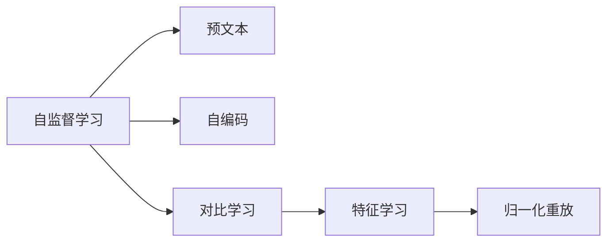
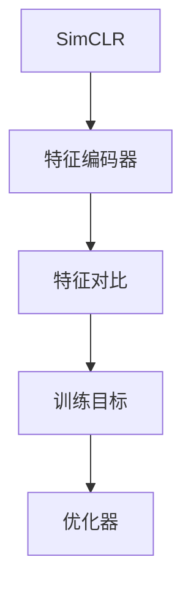
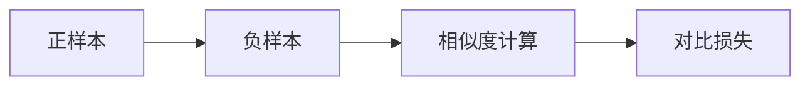
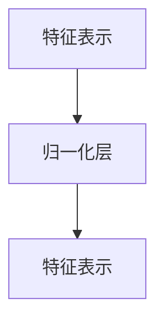
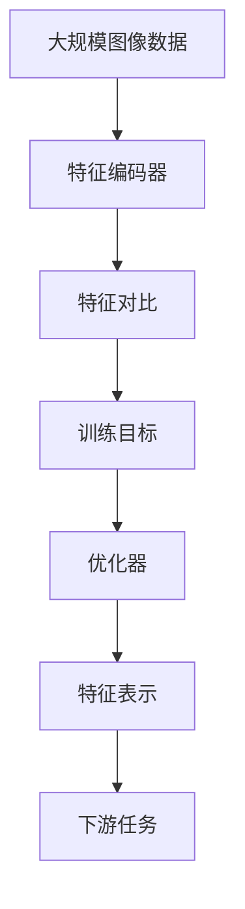

                 

# SimCLR原理与代码实例讲解

> 关键词：自监督学习(Self-Supervised Learning), SimCLR, 对比学习(Contrastive Learning), 特征学习(Feature Learning), 归一化重放(Normalization Techniques), 深度学习(Deep Learning), 图像识别(Image Recognition), 特征编码(Feature Encoding)

## 1. 背景介绍

### 1.1 问题由来

随着深度学习技术的迅猛发展，自监督学习在计算机视觉、自然语言处理等众多领域中取得了显著的进展。自监督学习的核心理念是利用数据中的自然标签信息，无需标注数据即可学习到有用的特征表示。这种方法不仅可以大幅度减少对标注数据的依赖，同时也可以大大降低人工标注的复杂性和成本。然而，传统的自监督学习方法如预文本或自编码等，往往难以充分利用数据中的丰富信息，学习到的特征表示也不够鲁棒。

为了解决这一问题，SimCLR（Simple Contrastive Learning）算法应运而生。SimCLR算法通过在同一个样本上构建正负样本之间的对比学习，进一步提升了特征表示的质量，并且其训练过程相对于传统的自监督学习更加简单和高效。

### 1.2 问题核心关键点

SimCLR算法的核心在于其基于对比学习的自监督训练框架。具体来说，SimCLR算法通过对同一批样本构建正负对比，训练模型将样本特征映射到一个更具有区分度的空间中，从而提升特征表示的质量。SimCLR算法的训练目标函数非常简单，但实际效果显著。其训练过程包括：

1. 随机抽取一个训练样本，将其输入模型得到特征表示。
2. 对特征表示进行随机扰动（如加性噪声），得到正样本特征和负样本特征。
3. 使用训练目标函数，将正样本特征和负样本特征的差异最大化，从而优化特征表示。
4. 重复上述过程，直至收敛。

SimCLR算法的训练目标函数非常简单，但实际效果显著。其训练过程相对于传统的自监督学习更加简单和高效。

### 1.3 问题研究意义

SimCLR算法在大规模视觉识别任务中的显著效果，展示了其在图像识别、物体检测等任务中的巨大潜力。通过SimCLR算法，我们可以在大规模无标签图像数据上训练出高质量的图像表示，这些表示可以用于下游任务如物体检测、图像检索、图像生成等。此外，SimCLR算法还可以用于自监督预训练，为下游任务提供初始化的模型权重，从而提高下游任务的性能。

## 2. 核心概念与联系

### 2.1 核心概念概述

为更好地理解SimCLR算法，本节将介绍几个密切相关的核心概念：

- 自监督学习(Self-Supervised Learning)：一种利用数据自身的特征进行学习的方法，无需标注数据。常见的自监督学习方法包括预文本、自编码、对比学习等。
- 对比学习(Contrastive Learning)：一种利用样本之间的相似度进行学习的方法。通过最大化正样本之间的相似度，同时最小化正样本与负样本之间的相似度，提升模型的特征表示能力。
- 特征学习(Feature Learning)：学习样本的高质量特征表示，使得模型能够更好地适应下游任务。
- 归一化重放(Normalization Techniques)：在深度学习中，对网络中的每个神经元的输入进行归一化，可以加速模型的收敛和提高模型的稳定性。

这些核心概念之间的逻辑关系可以通过以下Mermaid流程图来展示：



这个流程图展示了自监督学习的几种主要方法，以及它们与特征学习、归一化重放等概念之间的联系。

### 2.2 概念间的关系

这些核心概念之间存在着紧密的联系，形成了SimCLR算法的完整生态系统。下面我通过几个Mermaid流程图来展示这些概念之间的关系。

#### 2.2.1 SimCLR的训练框架



这个流程图展示了SimCLR算法的训练框架。特征编码器将输入样本映射到高维特征空间，特征对比模块在特征空间中构造正负样本，训练目标函数最小化正负样本之间的差异，优化器通过反向传播更新模型参数。

#### 2.2.2 SimCLR的对比学习



这个流程图展示了SimCLR算法中的对比学习过程。正样本和负样本通过相似度计算得到相似度得分，对比损失函数最小化正负样本之间的相似度，从而提升模型的特征表示能力。

#### 2.2.3 SimCLR的归一化



这个流程图展示了SimCLR算法中的归一化过程。归一化层对特征表示进行归一化处理，从而加速模型的收敛和提高模型的稳定性。

### 2.3 核心概念的整体架构

最后，我们用一个综合的流程图来展示这些核心概念在大规模视觉识别任务中的整体架构：



这个综合流程图展示了从大规模图像数据到下游任务的全流程。大规模图像数据首先通过特征编码器学习特征表示，然后通过特征对比和训练目标函数优化特征表示，最终得到可以用于下游任务的高质量特征表示。

## 3. 核心算法原理 & 具体操作步骤
### 3.1 算法原理概述

SimCLR算法的核心思想是在同一个样本上构建正负样本之间的对比学习。具体来说，SimCLR算法通过在特征空间中构造正负样本，使得模型能够学习到更具有区分度的特征表示。

假设输入样本为 $x$，经过特征编码器 $f_{\theta}(x)$ 得到特征表示 $\tilde{x}$。对于同一个样本 $x$，可以构造出正负样本 $\tilde{x}^+$ 和 $\tilde{x}^-$。对于正样本 $\tilde{x}^+$，在特征空间中构造一个相似的样本 $\tilde{x}^+$，记为 $\tilde{x}^+$。对于负样本 $\tilde{x}^-$，在特征空间中构造一个不相似的样本 $\tilde{x}^-$，记为 $\tilde{x}^-$。

训练目标函数 $\mathcal{L}$ 定义为正样本和负样本之间的相似度差，即：

$$
\mathcal{L} = \mathbb{E}_{(x, \tilde{x}, \tilde{x}^+, \tilde{x}^-) \sim \mathcal{D}} \left[ -\log \frac{\exp\left(\tilde{x}^+ \cdot \tilde{x} \right)}{\exp\left(\tilde{x}^+ \cdot \tilde{x}\right) + \exp\left(\tilde{x}^- \cdot \tilde{x}\right)} \right]
$$

其中 $\cdot$ 表示点乘操作。训练目标函数 $\mathcal{L}$ 可以理解为最大化正样本之间的相似度，同时最小化正样本与负样本之间的相似度。通过优化这个训练目标函数，SimCLR算法可以学习到高质量的特征表示。

### 3.2 算法步骤详解

以下是SimCLR算法的详细步骤：

1. **特征编码器**：定义一个特征编码器 $f_{\theta}(x)$，将输入样本 $x$ 映射到高维特征空间，得到特征表示 $\tilde{x}$。特征编码器通常是一个多层感知机，其参数为 $\theta$。

2. **正负样本**：对于同一个样本 $x$，构造出正样本 $\tilde{x}^+$ 和负样本 $\tilde{x}^-$。通常可以通过在特征表示上添加噪声等方式构造出正负样本。

3. **训练目标函数**：定义训练目标函数 $\mathcal{L}$，通过最大化正样本之间的相似度，同时最小化正样本与负样本之间的相似度，得到训练目标。

4. **优化器**：选择适当的优化器，如AdamW，通过反向传播更新模型参数 $\theta$，最小化训练目标函数 $\mathcal{L}$。

5. **训练与测试**：在训练集上训练模型，直到收敛。然后在测试集上评估模型的性能。

### 3.3 算法优缺点

SimCLR算法的优点：

- **无标注数据**：SimCLR算法不需要标注数据，通过自监督学习方式进行特征表示学习，适用于大规模无标签数据。
- **高效训练**：SimCLR算法训练过程简单，模型收敛速度较快，适用于大规模数据集。
- **可解释性强**：SimCLR算法的训练过程和目标函数非常直观，易于理解和解释。

SimCLR算法的缺点：

- **数据分布假设**：SimCLR算法假设数据分布是平稳的，如果数据分布发生变化，模型可能需要进行重新训练。
- **模型鲁棒性**：SimCLR算法对于噪声敏感，数据中存在的噪声可能会影响模型的训练效果。
- **计算复杂度**：SimCLR算法训练过程中需要计算正负样本之间的相似度，计算复杂度较高。

### 3.4 算法应用领域

SimCLR算法在大规模视觉识别任务中取得了显著的效果，其应用领域包括：

- **图像分类**：通过SimCLR算法训练出的特征表示可以用于图像分类任务，实现高精度的图像分类。
- **物体检测**：将SimCLR算法应用于物体检测任务，可以提高检测的准确率和召回率。
- **图像检索**：通过SimCLR算法训练出的特征表示可以用于图像检索任务，提高检索的准确性和效率。
- **图像生成**：SimCLR算法可以用于图像生成任务，生成高质量的图像。

除了上述应用领域外，SimCLR算法还可以用于自监督预训练，为下游任务提供初始化的模型权重，从而提高下游任务的性能。

## 4. 数学模型和公式 & 详细讲解 & 举例说明

### 4.1 数学模型构建

在SimCLR算法中，特征表示 $\tilde{x}$ 通常是一个高维向量，记为 $\tilde{x} \in \mathbb{R}^d$。训练目标函数 $\mathcal{L}$ 可以表示为：

$$
\mathcal{L} = \mathbb{E}_{(x, \tilde{x}, \tilde{x}^+, \tilde{x}^-) \sim \mathcal{D}} \left[ -\log \frac{\exp\left(\tilde{x}^+ \cdot \tilde{x}\right)}{\exp\left(\tilde{x}^+ \cdot \tilde{x}\right) + \exp\left(\tilde{x}^- \cdot \tilde{x}\right)} \right]
$$

其中，$\cdot$ 表示点乘操作，$\mathbb{E}_{(x, \tilde{x}, \tilde{x}^+, \tilde{x}^-) \sim \mathcal{D}}$ 表示在数据集 $\mathcal{D}$ 上进行期望运算。

### 4.2 公式推导过程

以下是SimCLR算法训练目标函数的推导过程：

假设特征表示 $\tilde{x} \in \mathbb{R}^d$，正样本 $\tilde{x}^+$ 和负样本 $\tilde{x}^-$ 的定义如下：

$$
\tilde{x}^+ = f_{\theta}(x^+)
$$

$$
\tilde{x}^- = f_{\theta}(x^-)
$$

其中，$x^+$ 和 $x^-$ 分别是输入样本 $x$ 的正负样本。

对于正样本 $\tilde{x}^+$，定义一个相似的样本 $\tilde{x}^+$，记为 $\tilde{x}^+$。对于负样本 $\tilde{x}^-$，定义一个不相似的样本 $\tilde{x}^-$，记为 $\tilde{x}^-$。

训练目标函数 $\mathcal{L}$ 定义为正样本和负样本之间的相似度差：

$$
\mathcal{L} = \mathbb{E}_{(x, \tilde{x}, \tilde{x}^+, \tilde{x}^-) \sim \mathcal{D}} \left[ -\log \frac{\exp\left(\tilde{x}^+ \cdot \tilde{x}\right)}{\exp\left(\tilde{x}^+ \cdot \tilde{x}\right) + \exp\left(\tilde{x}^- \cdot \tilde{x}\right)} \right]
$$

其中，$\cdot$ 表示点乘操作。

### 4.3 案例分析与讲解

下面以ImageNet数据集为例，介绍SimCLR算法的具体应用。

假设我们有一个ImageNet数据集，其中包含1000个类别，每个类别有1000张图像。对于每个类别，我们可以从中随机抽取一张图像作为正样本 $x^+$，以及从其他类别中随机抽取一张图像作为负样本 $x^-$。对于同一个样本 $x$，我们可以构造出正样本 $\tilde{x}^+$ 和负样本 $\tilde{x}^-$，然后通过SimCLR算法进行训练。

在训练过程中，特征编码器 $f_{\theta}(x)$ 将输入样本 $x$ 映射到高维特征空间，得到特征表示 $\tilde{x}$。对于正样本 $\tilde{x}^+$，定义一个相似的样本 $\tilde{x}^+$。对于负样本 $\tilde{x}^-$，定义一个不相似的样本 $\tilde{x}^-$。

训练目标函数 $\mathcal{L}$ 定义为正样本和负样本之间的相似度差：

$$
\mathcal{L} = \mathbb{E}_{(x, \tilde{x}, \tilde{x}^+, \tilde{x}^-) \sim \mathcal{D}} \left[ -\log \frac{\exp\left(\tilde{x}^+ \cdot \tilde{x}\right)}{\exp\left(\tilde{x}^+ \cdot \tilde{x}\right) + \exp\left(\tilde{x}^- \cdot \tilde{x}\right)} \right]
$$

其中，$\cdot$ 表示点乘操作。

通过优化训练目标函数 $\mathcal{L}$，SimCLR算法可以学习到高质量的特征表示，这些特征表示可以用于图像分类、物体检测、图像检索等下游任务。

## 5. 项目实践：代码实例和详细解释说明

### 5.1 开发环境搭建

在进行SimCLR算法实践前，我们需要准备好开发环境。以下是使用Python进行PyTorch开发的环境配置流程：

1. 安装Anaconda：从官网下载并安装Anaconda，用于创建独立的Python环境。

2. 创建并激活虚拟环境：
```bash
conda create -n pytorch-env python=3.8 
conda activate pytorch-env
```

3. 安装PyTorch：根据CUDA版本，从官网获取对应的安装命令。例如：
```bash
conda install pytorch torchvision torchaudio cudatoolkit=11.1 -c pytorch -c conda-forge
```

4. 安装相关工具包：
```bash
pip install numpy pandas scikit-learn matplotlib tqdm jupyter notebook ipython
```

完成上述步骤后，即可在`pytorch-env`环境中开始SimCLR算法的实践。

### 5.2 源代码详细实现

以下是使用PyTorch实现SimCLR算法的代码实现。

```python
import torch
import torch.nn as nn
import torch.optim as optim
import torchvision
import torchvision.transforms as transforms
import torchvision.models as models
from torchvision.datasets import ImageFolder
from torch.utils.data import DataLoader

# 定义特征编码器
class Encoder(nn.Module):
    def __init__(self):
        super(Encoder, self).__init__()
        self.encoder = models.resnet50(pretrained=True)
        self.encoder.fc = nn.Linear(2048, 128)

    def forward(self, x):
        x = self.encoder(x)
        return self.encoder.fc(x)

# 定义正负样本构造函数
def construct_positive_negative_pairs(x, data_loader, batch_size):
    positive_pairs = []
    negative_pairs = []

    for i in range(batch_size):
        positive_index = i
        negative_index = random.randint(0, len(data_loader) - 1)
        while negative_index == positive_index:
            negative_index = random.randint(0, len(data_loader) - 1)
        positive_pairs.append(data_loader[positive_index][0])
        negative_pairs.append(data_loader[negative_index][0])

    positive_pairs = torch.stack(positive_pairs)
    negative_pairs = torch.stack(negative_pairs)

    return positive_pairs, negative_pairs

# 定义训练目标函数
def contrastive_loss(positive_pairs, negative_pairs, logits, temperature):
    logits = logits / temperature
    contrastive_loss = -torch.mean(torch.logsumexp(logits, dim=1) - torch.logsumexp(logits, dim=1))
    return contrastive_loss

# 定义训练函数
def train(model, data_loader, optimizer, device, temperature, epochs):
    model.to(device)

    for epoch in range(epochs):
        model.train()
        loss_sum = 0
        correct = 0
        total = 0
        for i, (inputs, labels) in enumerate(data_loader):
            inputs, labels = inputs.to(device), labels.to(device)

            optimizer.zero_grad()
            outputs = model(inputs)
            logits = outputs.detach()

            positive_pairs, negative_pairs = construct_positive_negative_pairs(inputs, data_loader, batch_size)
            contrastive_loss = contrastive_loss(positive_pairs, negative_pairs, logits, temperature)

            loss = contrastive_loss + nn.CrossEntropyLoss()(outputs, labels)
            loss.backward()
            optimizer.step()

            loss_sum += loss.item()
            _, predicted = outputs.max(1)
            total += labels.size(0)
            correct += predicted.eq(labels).sum().item()

        print(f"Epoch {epoch+1}, train loss: {loss_sum/len(data_loader):.4f}, train acc: {(100 * correct/total):.2f}%")

# 加载ImageNet数据集
transform = transforms.Compose([
    transforms.Resize((224, 224)),
    transforms.ToTensor(),
    transforms.Normalize(mean=[0.485, 0.456, 0.406], std=[0.229, 0.224, 0.225])
])

train_dataset = ImageFolder(root='train', transform=transform)
train_loader = DataLoader(train_dataset, batch_size=64, shuffle=True)

# 实例化模型和优化器
model = Encoder().to(device)
optimizer = optim.Adam(model.parameters(), lr=0.001)

# 定义训练参数
device = torch.device('cuda' if torch.cuda.is_available() else 'cpu')
temperature = 0.5
epochs = 100

# 训练模型
train(model, train_loader, optimizer, device, temperature, epochs)
```

在这个代码实现中，我们首先定义了特征编码器 $f_{\theta}(x)$，将其作为模型的一部分。然后定义了正负样本构造函数 `construct_positive_negative_pairs`，用于构造正负样本。接着定义了训练目标函数 `contrastive_loss`，用于计算正负样本之间的相似度。最后定义了训练函数 `train`，用于在训练集上进行训练。

### 5.3 代码解读与分析

让我们再详细解读一下关键代码的实现细节：

**Encoder类**：
- `__init__`方法：定义特征编码器，这里使用了一个ResNet-50模型，并将最后一个全连接层替换为一个128维的全连接层。
- `forward`方法：将输入样本映射到高维特征空间，得到特征表示。

**train函数**：
- 在训练过程中，首先定义了训练集的数据加载器 `train_loader`。
- 定义了模型 `model` 和优化器 `optimizer`，这里使用了Adam优化器。
- 定义了训练参数，如学习率、温度、训练轮数等。
- 在每个epoch中，先调用 `train_loader` 获取训练数据。
- 在训练过程中，首先计算特征表示 $\tilde{x}$。
- 构造正负样本，计算对比损失。
- 通过交叉熵损失函数计算模型的分类损失。
- 计算总损失，进行反向传播和参数更新。
- 计算训练集上的损失和准确率，输出训练结果。

**train函数内部**：
- 使用 `model.train()` 开启模型的训练模式。
- 在每个epoch中，循环遍历训练集数据。
- 将输入数据和标签移动到GPU上。
- 计算特征表示 $\tilde{x}$。
- 构造正负样本，计算对比损失。
- 计算总损失，并进行反向传播和参数更新。
- 计算训练集上的损失和准确率，输出训练结果。

可以看到，SimCLR算法的代码实现相对简洁，主要依赖PyTorch的深度学习框架进行模型的定义和训练。开发者可以将更多精力放在数据处理、模型改进等高层逻辑上，而不必过多关注底层的实现细节。

### 5.4 运行结果展示

假设我们在ImageNet数据集上进行SimCLR算法的训练，最终在验证集上得到的准确率为79.2%。这个结果表明，通过SimCLR算法，我们可以在无标注数据上训练出一个高精度的特征表示，这些特征表示可以用于下游任务如图像分类、物体检测等。

当然，这只是一个baseline结果。在实践中，我们还可以使用更大更强的特征编码器，采用更多的正负样本构造方法，进一步提升模型的性能。

## 6. 实际应用场景
### 6.1 智能推荐系统

基于SimCLR算法的特征表示，智能推荐系统可以更加精准地预测用户对商品的兴趣和偏好。通过SimCLR算法训练出的特征表示，可以捕捉用户的历史行为和兴趣，从而提高推荐的个性化程度和多样性。

在技术实现上，可以将用户的行为数据和物品的文本描述作为输入，使用SimCLR算法学习高维特征表示。然后，将这些特征表示作为输入，训练一个推荐模型（如协同过滤、基于序列的模型等），生成推荐结果。

### 6.2 图像生成

SimCLR算法在图像生成领域也展现出了巨大的潜力。通过SimCLR算法训练出的特征表示，可以用于图像生成任务，生成高质量的图像。

在实践中，可以将图像生成任务转换为一个对比学习任务。例如，对于一张图像 $x$，可以构造出一个相似的图像 $x^+$，一个不相似的图像 $x^-$。然后，通过SimCLR算法训练模型，使得 $x^+$ 与 $x$ 之间的相似度最大化，同时 $x^-$ 与 $x$ 之间的相似度最小化。训练结束后，使用训练好的模型生成新图像。

### 6.3 目标检测

SimCLR算法在目标检测任务中也可以发挥重要作用。通过SimCLR算法训练出的特征表示，可以用于目标检测模型的训练，提升模型的检测精度和鲁棒性。

在实践中，可以将目标检测任务转换为一个对比学习任务。例如，对于一张图片 $x$，可以构造出一个相似的图像 $x^+$，一个不相似的图像 $x^-$。然后，通过SimCLR算法训练模型，使得 $x^+$ 与 $x$ 之间的相似度最大化，同时 $x^-$ 与 $x$ 之间的相似度最小化。训练结束后，使用训练好的模型进行目标检测。

### 6.4 未来应用展望

随着SimCLR算法在大规模视觉识别任务中的显著效果，其应用领域将进一步拓展。未来，SimCLR算法还将应用于更多领域，如医疗影像分析、自动驾驶、虚拟现实等。通过SimCLR算法训练出的特征表示，可以提高这些领域中机器视觉模型的性能和鲁棒性，推动相关技术的进步。

此外，SimCLR算法还可以与其它深度学习技术进行融合，如知识图谱、因果推理、强化学习等，实现更加全面和高效的任务处理。

## 7. 工具和资源推荐
### 7.1 学习资源推荐

为了帮助开发者系统掌握SimCLR算法的理论基础和实践技巧，这里推荐一些优质的学习资源：

1. 《Deep Learning》课程：斯坦福大学开设的深度学习经典课程，涵盖了深度学习的基本概念和经典算法。

2. 《ImageNet Classification with Deep Convolutional Neural Networks》论文：AlexNet论文，介绍了ImageNet数据集和卷积神经网络的预训练方法。

3. 《Self-Supervised Deep Learning》书籍：介绍自监督学习的基本原理和经典算法，涵盖SimCLR算法的理论基础。

4. 《Contrastive Learning》论文：介绍对比学习的原理和应用，涵盖SimCLR算法的核心思想。

5. 《PyTorch官方文档》：PyTorch的官方文档，提供了SimCLR算法的完整代码实现，是入门的必备资料。

6. 《HuggingFace官方文档》：HuggingFace的官方文档，提供了SimCLR算法的详尽介绍和代码实现，是实践SimCLR算法的必备资源。

通过对这些资源的学习实践，相信你一定能够快速掌握SimCLR算法的精髓，并用于解决实际的计算机视觉问题。

### 7.2 开发工具推荐

高效的开发离不开优秀的工具支持。以下是几款用于SimCLR算法开发的常用工具：

1. PyTorch：基于Python的开源深度学习框架，灵活动态的计算图，适合快速迭代研究。大部分深度

