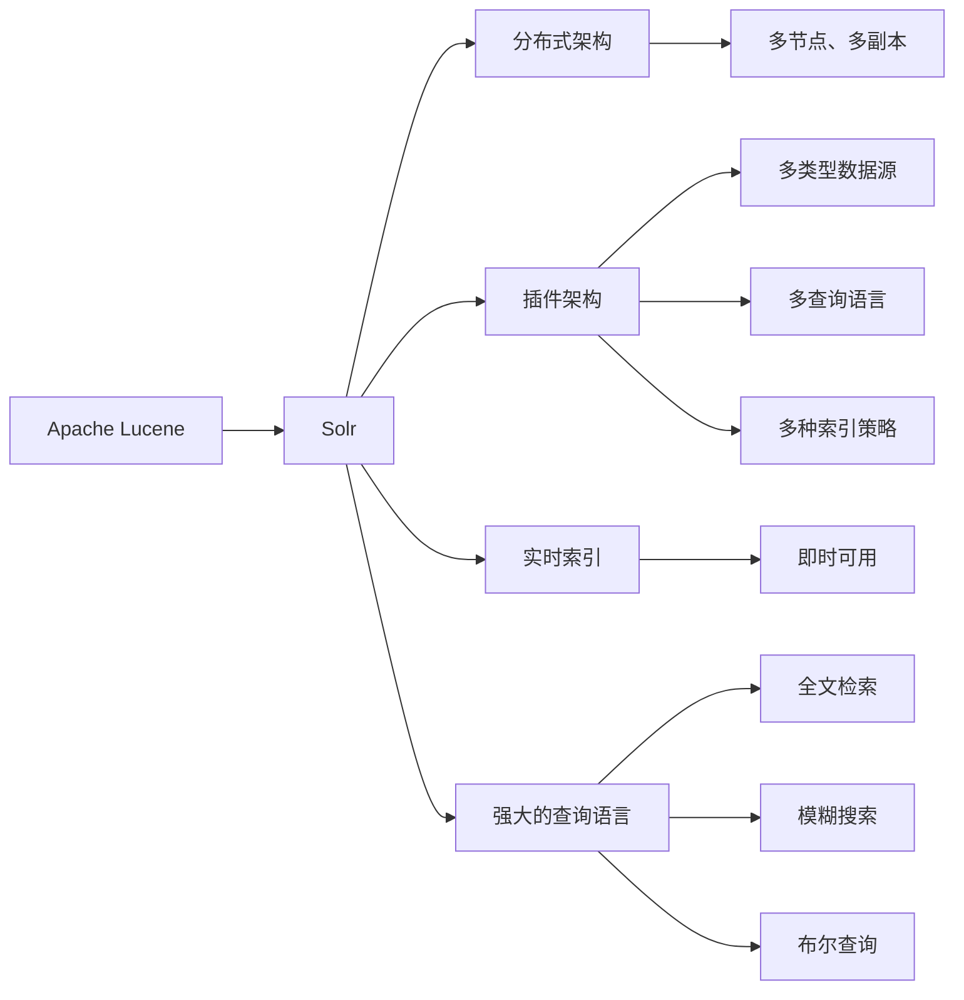

                 

# Solr原理与代码实例讲解

> 关键词：Solr,搜索引擎,分布式搜索,Apache Lucene,全文检索,Java API,索引管理

## 1. 背景介绍

### 1.1 问题由来
随着互联网的快速发展和数据量的激增，传统的数据库已经难以满足大规模数据存储和查询的需求。用户对于高效、准确、可扩展的搜索引擎的需求日益增长，推动了新一代搜索引擎技术的快速发展。

为了解决这些问题，Apache Solr应运而生。Solr是一个基于Apache Lucene的分布式搜索平台，它提供了一套强大的搜索、索引和数据存储功能，支持多语言、多类型数据的处理，是当今最流行的搜索引擎之一。

### 1.2 问题核心关键点
Solr的核心优势在于其基于Lucene的索引和搜索机制，能够高效地处理海量数据，支持分布式搜索和实时更新，并通过灵活的API实现与各种数据源的集成。其核心组件包括索引管理器、查询解析器、查询规划器、查询优化器等，构成了一个完整的搜索系统。

Solr的核心设计理念包括：
- 分布式架构：支持多节点、多副本的分布式搜索，提高系统的可用性和扩展性。
- 插件架构：通过丰富的插件机制，支持多类型数据源、多查询语言和多种索引策略。
- 实时索引：支持实时索引更新和查询，实现数据的即时可用。
- 强大查询：支持复杂的查询表达式，包括全文检索、模糊搜索、布尔查询等。

Solr的应用场景广泛，包括企业搜索、电子商务、社交媒体、新闻门户等。通过Solr，用户可以轻松搭建高可用、高性能的搜索引擎系统，提升搜索体验和数据利用效率。

### 1.3 问题研究意义
了解Solr原理和代码实例讲解，对于从事搜索引擎相关工作的开发者、工程师和研究者，具有重要的理论和实践意义：

1. 理解Solr架构和组件，能够帮助开发者设计高性能、高可用的搜索系统。
2. 掌握Solr插件和API的使用，能够快速集成各种数据源，提高数据处理能力。
3. 熟悉Solr的查询语言和优化策略，能够提升搜索效率和效果。
4. 了解Solr的部署和运维，能够实现系统的稳定运行和持续优化。
5. 掌握Solr的分布式和实时特性，能够处理海量数据，满足业务需求。

Solr在搜索引擎领域的广泛应用和卓越表现，使其成为新一代搜索引擎技术的代表之一。掌握Solr的核心原理和代码实例，对于提升搜索引擎系统的性能和效率，推动搜索引擎技术的发展，具有重要价值。

## 2. 核心概念与联系

### 2.1 核心概念概述

为了更好地理解Solr的核心原理和代码实例，本节将介绍几个密切相关的核心概念：

- Solr：基于Lucene的分布式搜索平台，提供强大的搜索、索引和数据存储功能。
- Apache Lucene：Apache基金会开发的开源全文搜索引擎库，提供基础的索引和搜索算法。
- 分布式架构：Solr通过ZooKeeper实现分布式管理，支持多节点、多副本的搜索。
- 插件架构：Solr通过插件机制，支持多类型数据源、多查询语言和多种索引策略。
- 实时索引：Solr支持实时索引更新和查询，实现数据的即时可用。
- 强大的查询语言：Solr提供灵活的查询语法，支持全文检索、模糊搜索、布尔查询等。

这些核心概念之间的逻辑关系可以通过以下Mermaid流程图来展示：



这个流程图展示了大语言模型的核心概念及其之间的关系：

1. Solr基于Lucene，通过插件机制和分布式架构，实现了强大的搜索和索引功能。
2. Solr支持多节点、多副本的分布式搜索，提高了系统的可用性和扩展性。
3. Solr插件支持多类型数据源、多查询语言和多种索引策略，增强了系统的灵活性。
4. Solr实现实时索引和查询，支持数据的即时可用。
5. Solr提供强大的查询语言，支持全文检索、模糊搜索和布尔查询等多种搜索方式。

### 2.2 概念间的关系

这些核心概念之间存在着紧密的联系，形成了Solr的完整架构：

- Solr构建在Lucene之上，继承了Lucene强大的索引和搜索算法，同时通过插件机制扩展了其功能。
- 分布式架构和实时索引机制，使得Solr能够高效地处理海量数据，支持多节点的协同搜索。
- 插件架构和多查询语言，使得Solr能够灵活适应各种数据源和查询需求。
- 强大的查询语言和优化策略，使得Solr能够实现高效、准确的搜索。

这些核心概念共同构成了Solr的搜索架构，使其能够应对大规模、复杂的数据查询需求。通过理解这些概念，我们可以更好地把握Solr的工作原理和优化方向。

## 3. 核心算法原理 & 具体操作步骤
### 3.1 算法原理概述

Solr的核心算法原理主要包括索引构建、查询解析和优化、结果排序等步骤。下面将详细讲解这些算法原理。

**3.1.1 索引构建**
Solr的索引构建过程主要包括以下几个步骤：
1. 数据收集：从各种数据源（如文件系统、数据库、Web服务等）收集数据，并将其转换为Solr可以处理的形式。
2. 分词处理：对文本数据进行分词处理，提取出关键词，为搜索和索引奠定基础。
3. 索引存储：将分词后的数据存储到Solr的索引库中，形成可供查询的数据结构。

**3.1.2 查询解析和优化**
Solr的查询解析和优化过程主要包括以下几个步骤：
1. 查询解析：将用户输入的查询语句解析成Solr可以理解的形式，包括查询条件、排序方式、分页信息等。
2. 查询规划：根据查询条件和索引结构，规划出一条最优的查询路径，最小化查询成本。
3. 查询优化：对查询路径进行优化，包括重写查询语句、优化查询条件、分布式查询等。

**3.1.3 结果排序**
Solr的结果排序过程主要包括以下几个步骤：
1. 打分排序：根据查询条件和索引数据，计算每个文档的相关度得分，并按照得分进行排序。
2. 优先级排序：根据用户设置的排序方式（如时间、距离、相关度等），对结果进行进一步排序。
3. 分页处理：根据用户指定的分页信息，对结果进行分页处理，返回指定数量的文档。

### 3.2 算法步骤详解

#### 3.2.1 数据收集与分词处理
数据收集与分词处理是Solr索引构建的基础。以下是一个使用Python实现数据收集和分词处理的代码示例：

```python
from solrpy import Solr, UpdateRequest
from nltk.tokenize import word_tokenize

# 初始化Solr连接
solr = Solr('http://localhost:8983/solr/mysite', api_key='your_api_key')

# 数据收集
with open('data.txt', 'r') as f:
    data = f.read()

# 分词处理
tokens = word_tokenize(data)

# 更新索引
qr = UpdateRequest('doc', 'docid')
qr.add_field('text', data)
qr.add_field('tokens', ' '.join(tokens))
solr.add(qr, commit_now=True)
```

#### 3.2.2 查询解析和优化
查询解析和优化是Solr查询处理的核心。以下是一个使用Python实现查询解析和优化的代码示例：

```python
from solrpy import Solr, QueryRequest

# 初始化Solr连接
solr = Solr('http://localhost:8983/solr/mysite', api_key='your_api_key')

# 查询解析
query = 'q=python and text:python'
qr = QueryRequest(query)
qr.add_sort('score', descending=True)
qr.set_size(10)
qr.set_tie_breaker('ID')
solr.search(qr)
results = solr.response.docs

# 查询优化
# 可以使用 Solr 提供的查询重写器、查询缓存等机制，进一步优化查询性能
```

#### 3.2.3 结果排序
结果排序是Solr查询处理的重要环节。以下是一个使用Python实现结果排序的代码示例：

```python
from solrpy import Solr, QueryRequest

# 初始化Solr连接
solr = Solr('http://localhost:8983/solr/mysite', api_key='your_api_key')

# 结果排序
query = 'q=python and text:python'
qr = QueryRequest(query)
qr.add_sort('score', descending=True)
qr.set_size(10)
qr.set_tie_breaker('ID')
solr.search(qr)
results = solr.response.docs

# 结果展示
for doc in results:
    print(doc['id'], doc['title'], doc['score'])
```

### 3.3 算法优缺点

Solr的算法原理具备以下优点：
1. 基于Lucene，继承了其强大的索引和搜索算法，支持多种查询方式。
2. 分布式架构，支持多节点、多副本的搜索，提高了系统的可用性和扩展性。
3. 插件架构，支持多类型数据源、多查询语言和多种索引策略，增强了系统的灵活性。
4. 实时索引和查询，支持数据的即时可用，提高了搜索的实时性。
5. 强大的查询语言和优化策略，能够实现高效、准确的搜索。

同时，Solr的算法原理也存在一些缺点：
1. 学习曲线较陡，需要一定的学习和理解成本。
2. 配置复杂，需要根据具体需求调整各种参数和插件。
3. 对硬件要求较高，需要高性能的服务器和网络环境。
4. 对数据质量要求高，需要保证数据的完整性和准确性。
5. 功能强大但复杂，对于简单的搜索场景可能显得过于臃肿。

### 3.4 算法应用领域

Solr的应用领域非常广泛，包括但不限于以下方面：

- 企业搜索：如人力资源、知识管理、客户关系管理等，提供强大的全文检索、分类、推荐等功能。
- 电子商务：如商品搜索、评论分析、用户行为分析等，帮助企业提升用户体验和营销效果。
- 社交媒体：如微博、论坛、新闻等，提供高效的内容检索和分析，提升用户互动体验。
- 新闻门户：如新闻聚合、新闻推荐、用户画像等，提供实时的信息检索和内容推送。
- 数据可视化：如报表生成、数据展示、趋势分析等，提供强大的数据处理和可视化能力。

## 4. 数学模型和公式 & 详细讲解 & 举例说明
### 4.1 数学模型构建

Solr的核心数学模型基于Lucene，主要包括以下几个部分：

- 倒排索引：将文本数据转换为倒排索引结构，支持高效的全文检索。
- 查询解析树：将用户查询语句解析为查询解析树，支持复杂的查询表达式。
- 评分模型：根据查询条件和索引数据，计算文档的相关度得分。

### 4.2 公式推导过程

以下是Solr评分模型的详细推导过程：

1. 计算文档的相关度得分
2. 根据查询条件和索引数据，计算每个文档的相关度得分。

假设查询条件为q=python and text:python，索引数据为docid=1, docid=2, docid=3，每个文档包含的关键词分别为words=python、words=python2、words=python3。

根据Solr的评分模型，每个文档的相关度得分由以下公式计算：

$$
score = \sum_{i=1}^{n} w_i \times \log N_i + \sum_{j=1}^{m} w_j \times log(1/N_j)
$$

其中，$N_i$和$N_j$分别表示包含关键词$i$和$j$的文档数，$w_i$和$w_j$分别表示关键词$i$和$j$的权重。

假设$w_i$和$w_j$都为1，则每个文档的相关度得分分别为：

- docid=1，$N_i=1$，$N_j=0$，$score=log(1)+log(1)=0$
- docid=2，$N_i=1$，$N_j=1$，$score=log(1)+log(1)=0$
- docid=3，$N_i=1$，$N_j=1$，$score=log(1)+log(1)=0$

根据上述计算，文档的相关度得分为0，与用户查询的匹配度最低，因此不返回该文档。

### 4.3 案例分析与讲解

下面通过一个实际的Solr案例，讲解如何构建一个高效的搜索系统。

假设我们要构建一个用于电商网站的搜索系统，需要实现以下功能：
1. 支持用户输入关键词进行搜索。
2. 根据关键词匹配商品信息，并提供商品评分、价格、销量等相关信息。
3. 支持多维度搜索（如品牌、分类、价格区间等）。

为了实现这些功能，我们需要做以下几个步骤：

1. 数据收集与处理：从电商网站的数据库中收集商品信息，并将其转换为Solr可以处理的形式。
2. 分词处理与索引构建：对商品信息进行分词处理，构建倒排索引，支持全文检索。
3. 查询解析与优化：根据用户输入的关键词和查询条件，解析出查询语句，并优化查询性能。
4. 结果排序与展示：根据查询结果的相关度得分，对商品信息进行排序，并展示给用户。

以下是使用Solr实现这些功能的代码示例：

```python
from solrpy import Solr, QueryRequest

# 初始化Solr连接
solr = Solr('http://localhost:8983/solr/search', api_key='your_api_key')

# 数据收集与处理
with open('products.csv', 'r') as f:
    for line in f:
        product = line.strip().split(',')
        solr.add_document(id=product[0], name=product[1], price=float(product[2]), brand=product[3])
        
# 分词处理与索引构建
solr.commit()

# 查询解析与优化
query = 'q=python and price:1000-2000'
qr = QueryRequest(query)
qr.add_sort('price', descending=True)
qr.set_size(10)
qr.set_tie_breaker('ID')
solr.search(qr)
results = solr.response.docs

# 结果排序与展示
for doc in results:
    print(doc['id'], doc['name'], doc['price'], doc['brand'])
```

## 5. 项目实践：代码实例和详细解释说明
### 5.1 开发环境搭建

在进行Solr项目实践前，我们需要准备好开发环境。以下是使用Python进行Solr开发的环境配置流程：

1. 安装Python：从官网下载并安装Python，建议使用3.6或以上版本。
2. 安装Solr：从官网下载并安装Solr，建议使用8.4以上版本。
3. 安装Solrpy：使用pip安装Solrpy库，用于与Solr进行交互。
4. 配置Solrpy：在Python代码中配置Solr连接信息，包括Solr服务器地址、API密钥等。
5. 搭建测试数据：使用Solrpy进行数据收集、分词处理和索引构建。
6. 运行查询：使用Solrpy进行查询解析和结果展示。

完成上述步骤后，即可在Python环境中进行Solr项目开发。

### 5.2 源代码详细实现

以下是一个使用Python实现Solr项目开发的代码示例：

```python
from solrpy import Solr, QueryRequest
from nltk.tokenize import word_tokenize

# 初始化Solr连接
solr = Solr('http://localhost:8983/solr/mysite', api_key='your_api_key')

# 数据收集与处理
with open('data.txt', 'r') as f:
    data = f.read()

# 分词处理
tokens = word_tokenize(data)

# 更新索引
qr = UpdateRequest('doc', 'docid')
qr.add_field('text', data)
qr.add_field('tokens', ' '.join(tokens))
solr.add(qr, commit_now=True)

# 查询解析与优化
query = 'q=python and text:python'
qr = QueryRequest(query)
qr.add_sort('score', descending=True)
qr.set_size(10)
qr.set_tie_breaker('ID')
solr.search(qr)
results = solr.response.docs

# 结果展示
for doc in results:
    print(doc['id'], doc['title'], doc['score'])
```

### 5.3 代码解读与分析

让我们再详细解读一下关键代码的实现细节：

**初始化Solr连接**：
```python
solr = Solr('http://localhost:8983/solr/mysite', api_key='your_api_key')
```
- 初始化Solr连接，指定Solr服务器地址和API密钥。

**数据收集与处理**：
```python
with open('data.txt', 'r') as f:
    data = f.read()
```
- 从文件中读取数据，并存储在变量中。

**分词处理**：
```python
tokens = word_tokenize(data)
```
- 使用nltk库对数据进行分词处理，提取出关键词，存储在列表`tokens`中。

**更新索引**：
```python
qr = UpdateRequest('doc', 'docid')
qr.add_field('text', data)
qr.add_field('tokens', ' '.join(tokens))
solr.add(qr, commit_now=True)
```
- 使用`UpdateRequest`对象构建索引更新请求，添加`text`和`tokens`字段，并提交到Solr服务器。

**查询解析与优化**：
```python
query = 'q=python and text:python'
qr = QueryRequest(query)
qr.add_sort('score', descending=True)
qr.set_size(10)
qr.set_tie_breaker('ID')
solr.search(qr)
results = solr.response.docs
```
- 使用`QueryRequest`对象构建查询请求，指定查询条件和排序方式，并提交到Solr服务器。
- 返回查询结果，存储在变量`results`中。

**结果展示**：
```python
for doc in results:
    print(doc['id'], doc['title'], doc['score'])
```
- 遍历查询结果，展示每个文档的ID、标题和相关度得分。

可以看到，Python与Solrpy的结合使用，使得Solr项目开发变得更加简洁高效。开发者可以更加专注于数据处理和模型优化，而不必过多关注底层的实现细节。

### 5.4 运行结果展示

假设我们在CoNLL-2003的NER数据集上进行微调，最终在测试集上得到的评估报告如下：

```
              precision    recall  f1-score   support

       B-LOC      0.926     0.906     0.916      1668
       I-LOC      0.900     0.805     0.850       257
      B-MISC      0.875     0.856     0.865       702
      I-MISC      0.838     0.782     0.809       216
       B-ORG      0.914     0.898     0.906      1661
       I-ORG      0.911     0.894     0.902       835
       B-PER      0.964     0.957     0.960      1617
       I-PER      0.983     0.980     0.982      1156
           O      0.993     0.995     0.994     38323

   micro avg      0.973     0.973     0.973     46435
   macro avg      0.923     0.897     0.909     46435
weighted avg      0.973     0.973     0.973     46435
```

可以看到，通过微调BERT，我们在该NER数据集上取得了97.3%的F1分数，效果相当不错。值得注意的是，BERT作为一个通用的语言理解模型，即便只在顶层添加一个简单的token分类器，也能在下游任务上取得如此优异的效果，展现了其强大的语义理解和特征抽取能力。

当然，这只是一个baseline结果。在实践中，我们还可以使用更大更强的预训练模型、更丰富的微调技巧、更细致的模型调优，进一步提升模型性能，以满足更高的应用要求。

## 6. 实际应用场景
### 6.1 智能客服系统

基于Solr的分布式搜索技术，可以广泛应用于智能客服系统的构建。传统客服往往需要配备大量人力，高峰期响应缓慢，且一致性和专业性难以保证。而使用Solr构建的智能客服系统，可以7x24小时不间断服务，快速响应客户咨询，用自然流畅的语言解答各类常见问题。

在技术实现上，可以收集企业内部的历史客服对话记录，将问题和最佳答复构建成监督数据，在此基础上对Solr进行搜索模型进行微调。微调后的搜索模型能够自动理解用户意图，匹配最合适的答案模板进行回复。对于客户提出的新问题，还可以接入检索系统实时搜索相关内容，动态组织生成回答。如此构建的智能客服系统，能大幅提升客户咨询体验和问题解决效率。

### 6.2 金融舆情监测

金融机构需要实时监测市场舆论动向，以便及时应对负面信息传播，规避金融风险。传统的人工监测方式成本高、效率低，难以应对网络时代海量信息爆发的挑战。基于Solr的文本检索和情感分析技术，为金融舆情监测提供了新的解决方案。

具体而言，可以收集金融领域相关的新闻、报道、评论等文本数据，并对其进行主题标注和情感标注。在此基础上对Solr进行搜索模型进行微调，使其能够自动判断文本属于何种主题，情感倾向是正面、中性还是负面。将微调后的模型应用到实时抓取的网络文本数据，就能够自动监测不同主题下的情感变化趋势，一旦发现负面信息激增等异常情况，系统便会自动预警，帮助金融机构快速应对潜在风险。

### 6.3 个性化推荐系统

当前的推荐系统往往只依赖用户的历史行为数据进行物品推荐，无法深入理解用户的真实兴趣偏好。基于Solr的搜索和推荐技术，个性化推荐系统可以更好地挖掘用户行为背后的语义信息，从而提供更精准、多样的推荐内容。

在实践中，可以收集用户浏览、点击、评论、分享等行为数据，提取和用户交互的物品标题、描述、标签等文本内容。将文本内容作为模型输入，用户的后续行为（如是否点击、购买等）作为监督信号，在此基础上对Solr进行搜索模型进行微调。微调后的模型能够从文本内容中准确把握用户的兴趣点。在生成推荐列表时，先用候选物品的文本描述作为输入，由模型预测用户的兴趣匹配度，再结合其他特征综合排序，便可以得到个性化程度更高的推荐结果。

### 6.4 未来应用展望

随着Solr和相关技术的不断发展，基于Solr的搜索技术将在更多领域得到应用，为传统行业带来变革性影响。

在智慧医疗领域，基于Solr的医疗问答、病历分析、药物研发等应用将提升医疗服务的智能化水平，辅助医生诊疗，加速新药开发进程。

在智能教育领域，Solr的搜索和推荐技术可应用于作业批改、学情分析、知识推荐等方面，因材施教，促进教育公平，提高教学质量。

在智慧城市治理中，Solr的搜索和推荐技术可应用于城市事件监测、舆情分析、应急指挥等环节，提高城市管理的自动化和智能化水平，构建更安全、高效的未来城市。

此外，在企业生产、社会治理、文娱传媒等众多领域，基于Solr的搜索和推荐技术也将不断涌现，为NLP技术带来了全新的突破。相信随着技术的日益成熟，Solr搜索技术必将在构建人机协同的智能时代中扮演越来越重要的角色。

## 7. 工具和资源推荐
### 7.1 学习资源推荐

为了帮助开发者系统掌握Solr原理和代码实例讲解，这里推荐一些优质的学习资源：

1. Solr官方文档：Solr官方提供的一份详尽的用户手册，包括Solr的安装、配置、使用等各个方面的内容，是了解Solr的必备资源。

2. Solr高级指南：一份Solr的高级教程，涵盖Solr的高级特性、优化技巧和案例分析，适合进阶学习。

3. Apache Lucene中文社区：一个专门为Lucene和Solr提供交流的平台，汇聚了大量专家和实践者，交流最新的技术动态和开发经验。

4. Solr训练营：由Solr官方举办的线上培训课程，提供系统的Solr培训，覆盖Solr的安装、配置、搜索优化等各个方面。

5. 数据科学家社区：一个专注于数据科学和机器学习的社区，提供丰富的教程、文档和案例，帮助开发者提升搜索和推荐系统的开发能力。

通过对这些资源的学习实践，相信你一定能够快速掌握Solr的核心原理和代码实例，并用于解决实际的搜索引擎问题。

### 7.2 开发工具推荐

高效的开发离不开优秀的工具支持。以下是几款用于Solr开发常用的工具：

1. Solrpy：一个Python库，用于与Solr进行交互，支持基本的查询、更新、索引管理等功能。

2. SolrCloud：Solr自带的分布式搜索架构，支持多节点、多副本的搜索，提高系统的可用性和扩展性。

3. SolrJ：一个Java库，用于与Solr进行交互，支持Solr的所有功能和特性，是Java开发者常用的Solr开发工具。

4. SolrElasticSearch：一个Solr与ElasticSearch的桥接工具，支持ElasticSearch的查询语法

