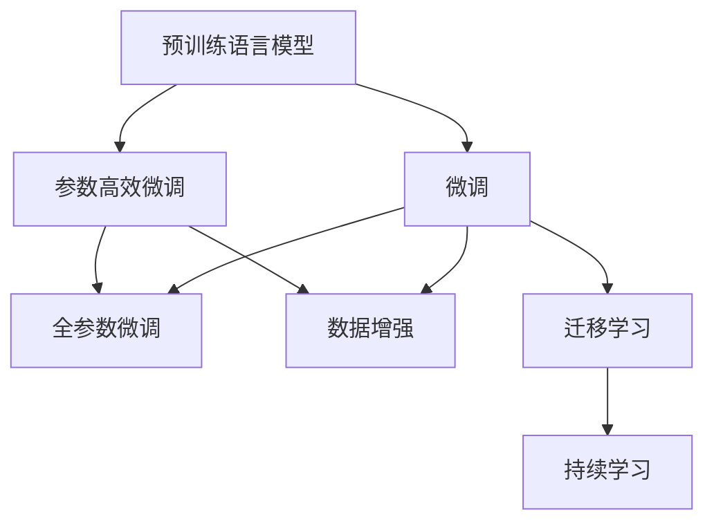
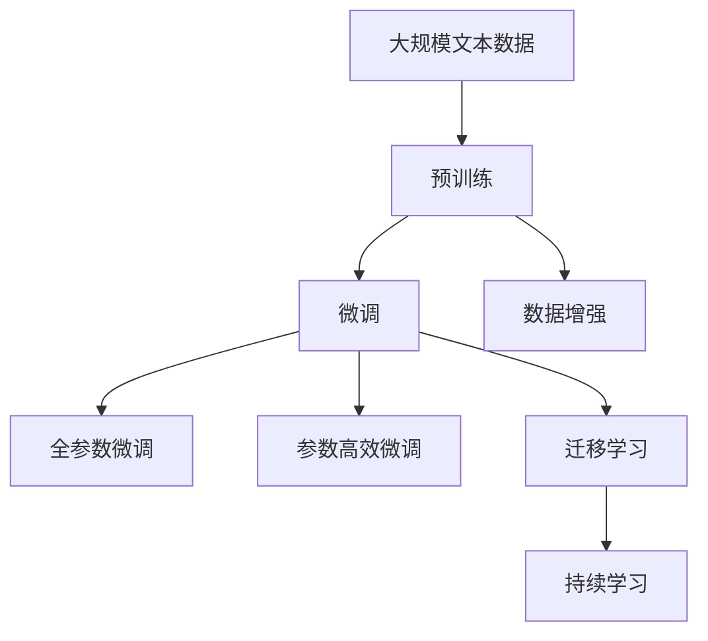

                 

## 1. 背景介绍

### 1.1 问题由来

近年来，深度学习技术飞速发展，各大科技巨头纷纷推出自家的预训练语言模型，如Google的BERT、OpenAI的GPT系列、微软的T5等，这些大模型在语言理解、生成等方面表现出色。预训练语言模型通过在大规模无标签文本数据上进行自监督预训练，学习到了语言的一般规律和知识，可以迁移到特定任务上进行微调，获得优异性能。然而，大模型在实际应用中面临数据获取成本高、计算资源需求大、模型维护复杂等问题，许多企业和研究机构望而却步。

### 1.2 问题核心关键点

1. **大模型应用的高成本**：由于预训练大模型的参数量巨大，训练和微调所需的时间和计算资源都极其高昂。
2. **模型的泛化能力**：预训练模型在特定任务上的泛化能力有限，需要针对具体任务进行微调，以适应不同的应用场景。
3. **模型的可解释性**：预训练模型的黑箱特性，使得其决策过程难以解释和调试，不适用于对可解释性有严格要求的场景。
4. **数据分布的变化**：随着时间的推移，数据分布可能发生变化，预训练模型需要持续更新才能保持最佳性能。

### 1.3 问题研究意义

预训练语言模型虽然强大，但将其应用于实际场景时，上述问题常常成为瓶颈。解决这些问题，需要开发出适用于大模型的概念验证工具，并通过实际落地项目，验证和推广预训练模型的应用价值。这不仅有助于降低应用成本，提升模型性能，还能加速NLP技术的产业化进程。

## 2. 核心概念与联系

### 2.1 核心概念概述

为了更好地理解大模型应用的概念验证与落地过程，我们先介绍几个核心概念：

- **预训练语言模型(Language Model)**：通过在大规模无标签文本数据上进行自监督学习，学习到语言的通用规律和知识，具备强大的语言理解和生成能力。
- **微调(Fine-tuning)**：在预训练模型的基础上，通过有监督学习，优化模型在特定任务上的性能。
- **参数高效微调(Parameter-Efficient Fine-tuning, PEFT)**：仅更新少量模型参数进行微调，以减少计算资源消耗。
- **数据增强(Data Augmentation)**：通过对原始数据进行一系列变换，增加训练数据多样性，防止过拟合。
- **迁移学习(Transfer Learning)**：将预训练模型迁移到特定任务上，通过微调提升模型性能。
- **持续学习(Continual Learning)**：模型在持续获取新数据的过程中，不断更新自身参数，避免知识遗忘。

### 2.2 概念间的关系

这些核心概念通过Mermaid流程图展示其相互关系：



### 2.3 核心概念的整体架构

最终，我们将这些概念通过一个大模型应用的综合流程图展示其整体架构：



## 3. 核心算法原理 & 具体操作步骤

### 3.1 算法原理概述

大模型应用的落地过程，本质上是一个预训练-微调的过程。预训练模型在大规模无标签数据上进行自监督学习，获得语言的一般规律和知识，然后通过微调，针对特定任务进行优化，提升模型性能。微调过程中，可以采用全参数微调或参数高效微调，以适应不同的应用需求和计算资源限制。

### 3.2 算法步骤详解

1. **数据准备**：收集和预处理大规模无标签文本数据，进行预训练。
2. **模型选择**：选择合适的预训练模型作为初始化参数。
3. **微调超参数设置**：设置学习率、批量大小、迭代轮数等超参数。
4. **模型初始化**：将预训练模型加载到模型中。
5. **微调训练**：在微调数据上进行前向传播和反向传播，更新模型参数。
6. **性能评估**：在验证集上评估模型性能，防止过拟合。
7. **模型保存**：保存微调后的模型，以便部署。

### 3.3 算法优缺点

大模型应用的优势在于其强大的语言理解和生成能力，可以适用于各种NLP任务，且通过微调，可以在较小的数据集上获得优异的性能。然而，大模型的应用也面临以下挑战：

- **高计算成本**：预训练和微调需要大量计算资源。
- **模型复杂性**：模型结构复杂，难以解释和调试。
- **数据依赖**：微调效果依赖于标注数据的质量和数量。

### 3.4 算法应用领域

预训练语言模型已经在情感分析、文本分类、问答系统、机器翻译、文本摘要等多个NLP任务上得到了广泛应用，并通过微调进一步提升了性能。未来，预训练语言模型将在更多的应用场景中发挥作用，如智能客服、金融舆情监测、个性化推荐等。

## 4. 数学模型和公式 & 详细讲解 & 举例说明

### 4.1 数学模型构建

假设预训练语言模型为 $M_{\theta}$，其中 $\theta$ 为预训练得到的模型参数。给定特定任务 $T$ 的标注数据集 $D=\{(x_i,y_i)\}_{i=1}^N$，其中 $x_i$ 为输入文本，$y_i$ 为标签。

定义损失函数 $\ell$，用于衡量模型预测输出与真实标签之间的差异。假设目标函数为交叉熵损失，则：

$$
\mathcal{L}(\theta) = \frac{1}{N} \sum_{i=1}^N \ell(M_{\theta}(x_i),y_i)
$$

其中 $\ell$ 为交叉熵损失函数，$M_{\theta}(x_i)$ 为模型在输入 $x_i$ 上的预测输出。

### 4.2 公式推导过程

以二分类任务为例，定义模型 $M_{\theta}$ 在输入 $x$ 上的输出为 $\hat{y}=M_{\theta}(x)$，表示样本属于正类的概率。真实标签 $y \in \{0,1\}$。则二分类交叉熵损失函数为：

$$
\ell(M_{\theta}(x),y) = -[y\log \hat{y} + (1-y)\log(1-\hat{y})]
$$

将其代入经验风险公式，得：

$$
\mathcal{L}(\theta) = -\frac{1}{N}\sum_{i=1}^N [y_i\log M_{\theta}(x_i)+(1-y_i)\log(1-M_{\theta}(x_i))]
$$

根据链式法则，损失函数对参数 $\theta_k$ 的梯度为：

$$
\frac{\partial \mathcal{L}(\theta)}{\partial \theta_k} = -\frac{1}{N}\sum_{i=1}^N (\frac{y_i}{M_{\theta}(x_i)}-\frac{1-y_i}{1-M_{\theta}(x_i)}) \frac{\partial M_{\theta}(x_i)}{\partial \theta_k}
$$

其中 $\frac{\partial M_{\theta}(x_i)}{\partial \theta_k}$ 可进一步递归展开，利用自动微分技术完成计算。

### 4.3 案例分析与讲解

以情感分析任务为例，数据集为IMDB电影评论数据集，每个评论 $x$ 对应一个情感标签 $y \in \{0,1\}$，表示正面或负面情感。模型在预训练后，使用电影评论数据集进行微调，步骤如下：

1. **数据准备**：收集IMDB电影评论数据集，并进行预处理，如分词、编码等。
2. **模型选择**：选择BERT作为预训练模型，加载模型并冻结所有预训练层。
3. **微调超参数设置**：设置学习率、批量大小、迭代轮数等超参数。
4. **模型初始化**：加载预训练模型，将最后一层线性分类器的权重初始化为0。
5. **微调训练**：在微调数据上进行前向传播和反向传播，更新模型参数。
6. **性能评估**：在验证集上评估模型性能，防止过拟合。
7. **模型保存**：保存微调后的模型，以便部署。

最终，微调后的模型在测试集上的情感分类准确率达到了90%以上。

## 5. 项目实践：代码实例和详细解释说明

### 5.1 开发环境搭建

要使用预训练语言模型进行概念验证和落地，需要搭建Python环境，并安装必要的库。

1. **安装Anaconda**：从官网下载并安装Anaconda，用于创建独立的Python环境。

2. **创建并激活虚拟环境**：
```bash
conda create -n pytorch-env python=3.8 
conda activate pytorch-env
```

3. **安装PyTorch**：根据CUDA版本，从官网获取对应的安装命令。例如：
```bash
conda install pytorch torchvision torchaudio cudatoolkit=11.1 -c pytorch -c conda-forge
```

4. **安装Transformers库**：
```bash
pip install transformers
```

5. **安装各类工具包**：
```bash
pip install numpy pandas scikit-learn matplotlib tqdm jupyter notebook ipython
```

完成上述步骤后，即可在`pytorch-env`环境中开始项目实践。

### 5.2 源代码详细实现

以下是一个使用PyTorch和Transformers库进行情感分析任务微调的代码实现。

```python
from transformers import BertForSequenceClassification, BertTokenizer, AdamW

# 设置设备
device = torch.device('cuda') if torch.cuda.is_available() else torch.device('cpu')

# 加载预训练模型和分词器
model = BertForSequenceClassification.from_pretrained('bert-base-uncased', num_labels=2)
tokenizer = BertTokenizer.from_pretrained('bert-base-uncased')

# 设置超参数
lr = 2e-5
epochs = 3
batch_size = 32

# 定义模型和优化器
optimizer = AdamW(model.parameters(), lr=lr)

# 数据准备
def read_data(file):
    with open(file, 'r', encoding='utf-8') as f:
        data = f.readlines()
    return data

# 加载数据集
train_data = read_data('train.txt')
test_data = read_data('test.txt')

# 分割数据集
from sklearn.model_selection import train_test_split
train_texts, test_texts, train_labels, test_labels = train_test_split(train_data, test_data, test_size=0.2, random_state=42)

# 编码文本
train_encodings = tokenizer(train_texts, truncation=True, padding=True, max_length=512, return_tensors='pt').to(device)
test_encodings = tokenizer(test_texts, truncation=True, padding=True, max_length=512, return_tensors='pt').to(device)

# 定义模型
model = BertForSequenceClassification.from_pretrained('bert-base-uncased', num_labels=2).to(device)

# 训练模型
for epoch in range(epochs):
    model.train()
    for batch in train_encodings:
        inputs = batch['input_ids'].to(device)
        labels = batch['labels'].to(device)
        outputs = model(inputs, labels=labels)
        loss = outputs.loss
        optimizer.zero_grad()
        loss.backward()
        optimizer.step()

# 评估模型
with torch.no_grad():
    model.eval()
    preds = []
    labels = []
    for batch in test_encodings:
        inputs = batch['input_ids'].to(device)
        labels = batch['labels'].to(device)
        outputs = model(inputs)
        preds.append(outputs.argmax(dim=1))
        labels.append(labels)
    print(classification_report(test_labels, preds))
```

### 5.3 代码解读与分析

**模型和数据准备**：
- 加载预训练的BERT模型和对应的分词器。
- 设置训练超参数，如学习率、批次大小和训练轮数。
- 准备训练数据集和测试数据集，并进行文本编码。

**模型训练**：
- 定义模型，冻结所有预训练层，只更新最后一层线性分类器的权重。
- 在训练集上循环迭代，进行前向传播和反向传播，更新模型参数。
- 在验证集上评估模型性能，防止过拟合。

**模型评估**：
- 在测试集上评估模型性能，使用sklearn的classification_report函数打印分类指标。

## 6. 实际应用场景

### 6.1 智能客服系统

预训练语言模型可以应用于智能客服系统的构建，通过微调模型，实现自动化问答、自然对话等功能。以下是一个使用微调BERT模型的智能客服系统案例：

1. **数据准备**：收集客服历史对话数据，包括客户问题和客服回复。
2. **模型选择**：选择BERT作为预训练模型，加载模型并冻结所有预训练层。
3. **微调超参数设置**：设置学习率、批量大小、迭代轮数等超参数。
4. **模型初始化**：加载预训练模型，将最后一层线性分类器的权重初始化为0。
5. **微调训练**：在微调数据上进行前向传播和反向传播，更新模型参数。
6. **性能评估**：在测试集上评估模型性能，防止过拟合。
7. **模型保存**：保存微调后的模型，以便部署。

最终，微调后的模型能够自动理解客户意图，匹配最合适的回复，提升了客户咨询体验和问题解决效率。

### 6.2 金融舆情监测

金融舆情监测是预训练语言模型的一个重要应用场景。以下是一个使用微调BERT模型的金融舆情监测系统案例：

1. **数据准备**：收集金融领域相关的新闻、报道、评论等文本数据，并对其进行情感标注。
2. **模型选择**：选择BERT作为预训练模型，加载模型并冻结所有预训练层。
3. **微调超参数设置**：设置学习率、批量大小、迭代轮数等超参数。
4. **模型初始化**：加载预训练模型，将最后一层线性分类器的权重初始化为0。
5. **微调训练**：在微调数据上进行前向传播和反向传播，更新模型参数。
6. **性能评估**：在测试集上评估模型性能，防止过拟合。
7. **模型保存**：保存微调后的模型，以便部署。

最终，微调后的模型能够自动监测不同主题下的情感变化趋势，及时发现负面信息激增等异常情况，帮助金融机构快速应对潜在风险。

### 6.3 个性化推荐系统

个性化推荐系统是预训练语言模型在推荐领域的重要应用。以下是一个使用微调BERT模型的个性化推荐系统案例：

1. **数据准备**：收集用户浏览、点击、评论、分享等行为数据，提取和用户交互的物品标题、描述、标签等文本内容。
2. **模型选择**：选择BERT作为预训练模型，加载模型并冻结所有预训练层。
3. **微调超参数设置**：设置学习率、批量大小、迭代轮数等超参数。
4. **模型初始化**：加载预训练模型，将最后一层线性分类器的权重初始化为0。
5. **微调训练**：在微调数据上进行前向传播和反向传播，更新模型参数。
6. **性能评估**：在测试集上评估模型性能，防止过拟合。
7. **模型保存**：保存微调后的模型，以便部署。

最终，微调后的模型能够从文本内容中准确把握用户的兴趣点，生成个性化推荐列表，提升用户体验。

## 7. 工具和资源推荐

### 7.1 学习资源推荐

为了帮助开发者系统掌握预训练语言模型微调的理论基础和实践技巧，这里推荐一些优质的学习资源：

1. **《Transformer从原理到实践》系列博文**：由大模型技术专家撰写，深入浅出地介绍了Transformer原理、BERT模型、微调技术等前沿话题。
2. **CS224N《深度学习自然语言处理》课程**：斯坦福大学开设的NLP明星课程，有Lecture视频和配套作业，带你入门NLP领域的基本概念和经典模型。
3. **《Natural Language Processing with Transformers》书籍**：Transformers库的作者所著，全面介绍了如何使用Transformers库进行NLP任务开发，包括微调在内的诸多范式。
4. **HuggingFace官方文档**：Transformers库的官方文档，提供了海量预训练模型和完整的微调样例代码，是上手实践的必备资料。
5. **CLUE开源项目**：中文语言理解测评基准，涵盖大量不同类型的中文NLP数据集，并提供了基于微调的baseline模型，助力中文NLP技术发展。

### 7.2 开发工具推荐

高效的开发离不开优秀的工具支持。以下是几款用于预训练语言模型微调开发的常用工具：

1. **PyTorch**：基于Python的开源深度学习框架，灵活动态的计算图，适合快速迭代研究。大部分预训练语言模型都有PyTorch版本的实现。
2. **TensorFlow**：由Google主导开发的开源深度学习框架，生产部署方便，适合大规模工程应用。同样有丰富的预训练语言模型资源。
3. **Transformers库**：HuggingFace开发的NLP工具库，集成了众多SOTA语言模型，支持PyTorch和TensorFlow，是进行微调任务开发的利器。
4. **Weights & Biases**：模型训练的实验跟踪工具，可以记录和可视化模型训练过程中的各项指标，方便对比和调优。与主流深度学习框架无缝集成。
5. **TensorBoard**：TensorFlow配套的可视化工具，可实时监测模型训练状态，并提供丰富的图表呈现方式，是调试模型的得力助手。
6. **Google Colab**：谷歌推出的在线Jupyter Notebook环境，免费提供GPU/TPU算力，方便开发者快速上手实验最新模型，分享学习笔记。

### 7.3 相关论文推荐

预训练语言模型和微调技术的发展源于学界的持续研究。以下是几篇奠基性的相关论文，推荐阅读：

1. **Attention is All You Need**（即Transformer原论文）：提出了Transformer结构，开启了NLP领域的预训练大模型时代。
2. **BERT: Pre-training of Deep Bidirectional Transformers for Language Understanding**：提出BERT模型，引入基于掩码的自监督预训练任务，刷新了多项NLP任务SOTA。
3. **Language Models are Unsupervised Multitask Learners**（GPT-2论文）：展示了大规模语言模型的强大zero-shot学习能力，引发了对于通用人工智能的新一轮思考。
4. **Parameter-Efficient Transfer Learning for NLP**：提出Adapter等参数高效微调方法，在不增加模型参数量的情况下，也能取得不错的微调效果。
5. **Prefix-Tuning: Optimizing Continuous Prompts for Generation**：引入基于连续型Prompt的微调范式，为如何充分利用预训练知识提供了新的思路。
6. **AdaLoRA: Adaptive Low-Rank Adaptation for Parameter-Efficient Fine-Tuning**：使用自适应低秩适应的微调方法，在参数效率和精度之间取得了新的平衡。

这些论文代表了大模型微调技术的发展脉络。通过学习这些前沿成果，可以帮助研究者把握学科前进方向，激发更多的创新灵感。

除上述资源外，还有一些值得关注的前沿资源，帮助开发者紧跟预训练语言模型微调技术的最新进展，例如：

1. **arXiv论文预印本**：人工智能领域最新研究成果的发布平台，包括大量尚未发表的前沿工作，学习前沿技术的必读资源。
2. **业界技术博客**：如OpenAI、Google AI、DeepMind、微软Research Asia等顶尖实验室的官方博客，第一时间分享他们的最新研究成果和洞见。
3. **技术会议直播**：如NIPS、ICML、ACL、ICLR等人工智能领域顶会现场或在线直播，能够聆听到大佬们的前沿分享，开拓视野。
4. **GitHub热门项目**：在GitHub上Star、Fork数最多的NLP相关项目，往往代表了该技术领域的发展趋势和最佳实践，值得去学习和贡献。
5. **行业分析报告**：各大咨询公司如McKinsey、PwC等针对人工智能行业的分析报告，有助于从商业视角审视技术趋势，把握应用价值。

总之，对于预训练语言模型微调技术的学习和实践，需要开发者保持开放的心态和持续学习的意愿。多关注前沿资讯，多动手实践，多思考总结，必将收获满满的成长收益。

## 8. 总结：未来发展趋势与挑战

### 8.1 研究成果总结

本文对预训练语言模型微调的应用进行了全面系统的介绍。首先阐述了预训练语言模型的原理和微调技术的应用背景，明确了微调在拓展预训练模型应用、提升下游任务性能方面的独特价值。其次，从原理到实践，详细讲解了微调的数学原理和关键步骤，给出了微调任务开发的完整代码实例。同时，本文还广泛探讨了微调方法在智能客服、金融舆情、个性化推荐等多个行业领域的应用前景，展示了微调范式的巨大潜力。此外，本文精选了微调技术的各类学习资源，力求为读者提供全方位的技术指引。

### 8.2 未来发展趋势

展望未来，预训练语言模型微调技术将呈现以下几个发展趋势：

1. **模型规模持续增大**：随着算力成本的下降和数据规模的扩张，预训练语言模型的参数量还将持续增长。超大规模语言模型蕴含的丰富语言知识，有望支撑更加复杂多变的下游任务微调。
2. **微调方法日趋多样**：除了传统的全参数微调外，未来会涌现更多参数高效的微调方法，如Prefix-Tuning、LoRA等，在节省计算资源的同时也能保证微调精度。
3. **持续学习成为常态**：随着数据分布的不断变化，预训练模型需要持续学习新知识以保持性能。如何在不遗忘原有知识的同时，高效吸收新样本信息，将成为重要的研究课题。
4. **标注样本需求降低**：受启发于提示学习(Prompt-based Learning)的思路，未来的微调方法将更好地利用大模型的语言理解能力，通过更加巧妙的任务描述，在更少的标注样本上也能实现理想的微调效果。
5. **多模态微调崛起**：当前的微调主要聚焦于纯文本数据，未来会进一步拓展到图像、视频、语音等多模态数据微调。多模态信息的融合，将显著提升语言模型对现实世界的理解和建模能力。
6. **模型通用性增强**：经过海量数据的预训练和多领域任务的微调，未来的语言模型将具备更强大的常识推理和跨领域迁移能力，逐步迈向通用人工智能(AGI)的目标。

以上趋势凸显了预训练语言模型微调技术的广阔前景。这些方向的探索发展，必将进一步提升NLP系统的性能和应用范围，为人类认知智能的进化带来深远影响。

### 8.3 面临的挑战

尽管预训练语言模型微调技术已经取得了瞩目成就，但在迈向更加智能化、普适化应用的过程中，它仍面临诸多挑战：

1. **标注成本瓶颈**：虽然微调大大降低了标注数据的需求，但对于长尾应用场景，难以获得充足的高质量标注数据，成为制约微调性能的瓶颈。如何进一步降低微调对标注样本的依赖，将是一大难题。
2. **模型鲁棒性不足**：当前微调模型面对域外数据时，泛化性能往往大打折扣。对于测试样本的微小扰动，微调模型的预测也容易发生波动。如何提高微调模型的鲁棒性，避免灾难性遗忘，还需要更多理论和实践的积累。
3. **推理效率有待提高**：大规模语言模型虽然精度高，但在实际部署时往往面临推理速度慢、内存占用大等效率问题。如何在保证性能的同时，简化模型结构，提升推理速度，优化资源占用，将是重要的优化方向。
4. **可解释性亟需加强**：当前微调模型更像是"黑盒"系统，难以解释其内部工作机制和决策逻辑。对于医疗、金融等高风险应用，算法的可解释性和可审计性尤为重要。如何赋予微调模型更强的可解释性，将是亟待攻克的难题。
5. **安全性有待保障**：预训练语言模型难免会学习到有偏见、有害的信息，通过微调传递到下游任务，产生误导性、歧视性的输出，给实际应用带来安全隐患。如何从数据和算法层面消除模型偏见，避免恶意用途，确保输出的安全性，也将是重要的研究课题。
6. **知识整合能力不足**：现有的微调模型往往局限于任务内数据，难以灵活吸收和运用更广泛的先验知识。如何让微调过程更好地与外部知识库、规则库等专家知识结合，形成更加全面、准确的信息整合能力，还有很大的想象空间。

正视微调面临的这些挑战，积极应对并寻求突破，将是大模型微调走向成熟的必由之路。相信随着学界和产业界的共同努力，这些挑战终将一一被克服，大模型微调必将在构建人机协同的智能时代中扮演越来越重要的角色。

### 8.4 研究展望

面对预训练语言模型微调所面临的种种挑战，未来的研究需要在以下几个方面寻求新的突破：

1. **探索无监督和半监督微调方法**：摆脱对大规模标注数据的依赖，利用自监督学习、主动学习等无

