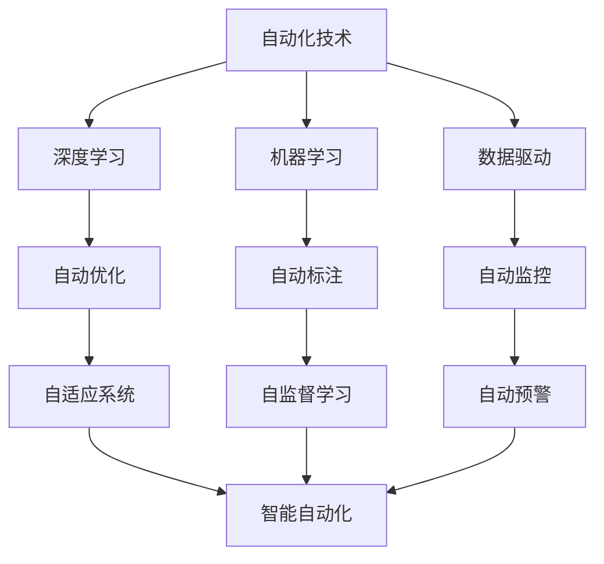
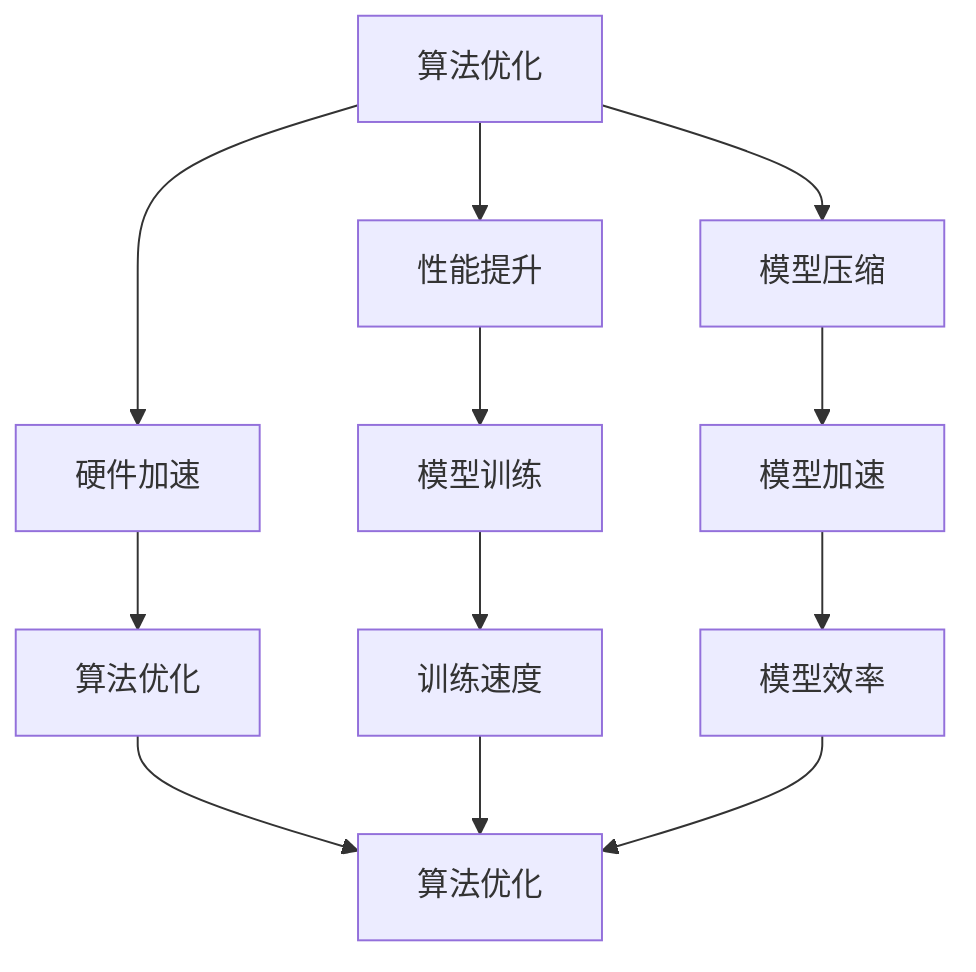
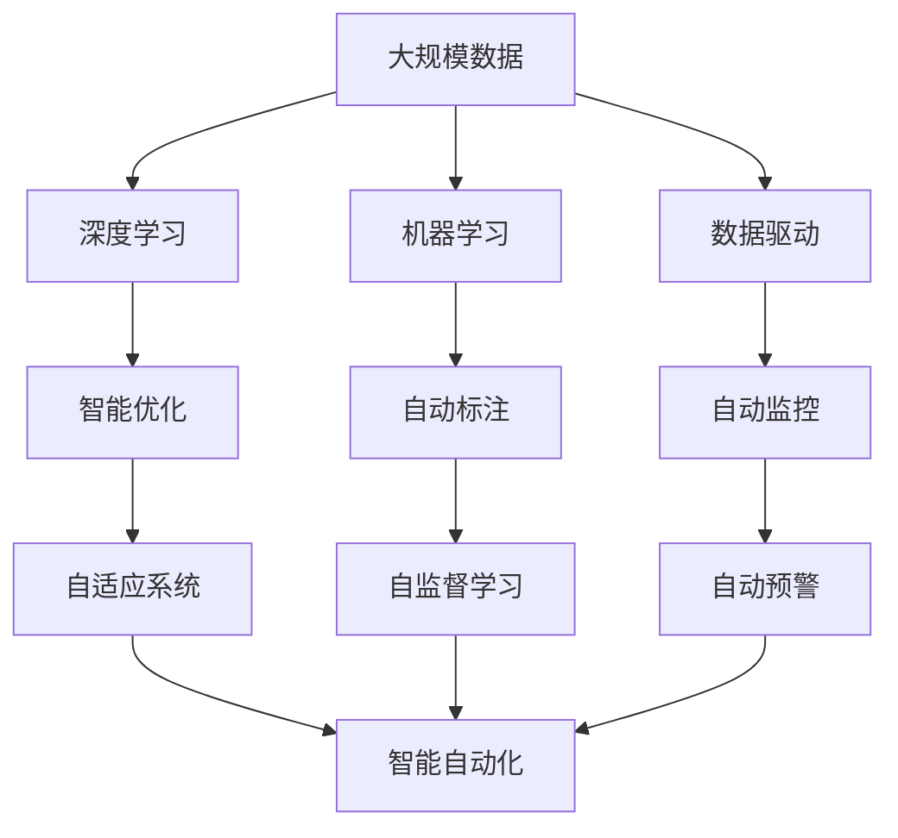

                 

# 计算变化带来的自动化新机遇

> 关键词：计算自动化, 自动化工程, 人工智能, 算法优化, 数据驱动, 深度学习, 机器人流程自动化(RPA), 机器学习, 自动化技术

## 1. 背景介绍

### 1.1 问题由来
在过去的几十年里，计算机技术的快速发展深刻地改变了人类社会的面貌，尤其是在自动化领域。自动化技术从最初的工业自动化逐渐扩展到各个行业，自动化工程已经成为了现代企业的重要组成部分。自动化技术不仅提高了工作效率，还降低了人为错误的风险，推动了生产力的飞跃。然而，随着技术的不断进步，自动化工程的挑战也日益增多，计算变化带来的新机遇成为研究的重要课题。

### 1.2 问题核心关键点
计算变化带来的新机遇主要集中在以下几个方面：

- **自动化工程的全方位发展**：自动化工程从最初的工业自动化扩展到了包括IT、金融、医疗等多个行业。计算技术的发展，尤其是深度学习和机器学习技术的进步，为自动化工程提供了新的工具和方法。

- **数据驱动的决策支持**：在自动化工程中，数据成为了决策的重要依据。通过计算和分析海量数据，自动化系统能够提供更准确的预测和决策支持，优化生产和管理过程。

- **算法优化与性能提升**：计算技术的发展带来了算法优化和性能提升的新机遇，尤其是在大规模数据处理和复杂问题解决方面。自动化工程可以利用这些技术，提高自身的处理能力和效率。

- **智能自动化**：随着人工智能技术的发展，智能化自动化逐渐成为自动化工程的新趋势。机器学习、自然语言处理等技术为自动化工程注入了新的活力，推动了智能自动化系统的应用。

- **跨学科融合**：自动化工程不再局限于单一学科，而是与计算机科学、数据科学、物理学等多个学科进行了深度融合，形成跨学科的创新和发展。

这些关键点构成了计算变化带来的自动化新机遇的主要内容，将引导自动化工程的发展方向和未来趋势。

### 1.3 问题研究意义
研究计算变化带来的自动化新机遇，对于推动自动化工程的发展具有重要意义：

- **提高生产效率**：通过计算和自动化技术的应用，能够显著提高生产效率，降低生产成本，提升企业竞争力。

- **优化资源配置**：自动化系统能够优化资源配置，包括人力、设备、物料等，提高资源利用率，减少浪费。

- **提升决策质量**：数据驱动的自动化系统能够提供更准确的预测和决策支持，帮助企业做出更明智的决策。

- **推动技术创新**：计算变化带来的新技术和算法，能够推动自动化工程的创新，开拓新的应用场景和市场。

- **促进产业升级**：自动化工程能够帮助传统行业实现数字化转型，提高生产和管理水平，推动产业升级和变革。

研究这些新的机遇，可以帮助自动化工程更好地适应技术变化，抓住机遇，实现持续发展。

## 2. 核心概念与联系

### 2.1 核心概念概述

自动化工程涉及的核心概念包括自动化技术、深度学习、机器学习、数据驱动等。这些概念的逻辑关系可以通过以下Mermaid流程图来展示：



这个流程图展示了自动化工程中各个概念之间的联系：

- 自动化技术是自动化工程的基础，包括机器人流程自动化(RPA)、生产自动化等。
- 深度学习和机器学习为自动化工程提供了更强大的处理能力，尤其是在复杂问题和海量数据处理方面。
- 数据驱动是自动化工程决策支持的核心，通过计算和分析海量数据，优化生产和管理过程。
- 自动优化、自动标注、自动监控等技术，进一步提升了自动化系统的性能和智能化程度。
- 自适应系统和智能自动化，则代表了自动化工程的未来发展方向，通过机器学习和智能技术，实现更高效、更智能的自动化系统。

### 2.2 概念间的关系

这些核心概念之间存在着紧密的联系，形成了自动化工程的整体框架。下面我们通过几个Mermaid流程图来展示这些概念之间的关系。

#### 2.2.1 自动化技术的发展

```mermaid
graph TB
    A[机器人流程自动化(RPA)] --> B[自动化生产]
    A --> C[智能机器人]
    A --> D[自动化调度]
    B --> E[自动化仓储]
    C --> F[自适应机器人]
    D --> G[自动化检测]
    E --> H[自动化物流]
    F --> I[智能调度]
    G --> J[自动化质检]
    H --> K[自动化运输]
```

这个流程图展示了自动化技术从最初的RPA扩展到自动化生产、智能机器人、自动化检测等多个方面。随着技术的发展，自动化技术的应用范围和深度不断扩展，提升了生产效率和管理水平。

#### 2.2.2 数据驱动的决策支持


这个流程图展示了数据驱动决策支持的全过程。通过数据收集、清洗、分析和可视化，自动化系统能够提供更准确的预测和决策支持，优化生产和管理过程。

#### 2.2.3 算法优化与性能提升



这个流程图展示了算法优化和性能提升的关系。通过算法优化和硬件加速，自动化系统能够提升模型的训练速度和效率，实现更高效的自动化处理。

### 2.3 核心概念的整体架构

最后，我们用一个综合的流程图来展示这些核心概念在大规模自动化工程中的整体架构：



这个综合流程图展示了从大规模数据到智能自动化系统的全过程。深度学习、机器学习和数据驱动为自动化工程提供了强大的工具和方法，通过智能优化、自动标注和自适应系统，自动化工程能够实现更加智能和高效的自动化处理。

## 3. 核心算法原理 & 具体操作步骤
### 3.1 算法原理概述

计算变化带来的自动化新机遇，主要依赖于深度学习、机器学习等算法。这些算法的核心原理是通过计算和分析海量数据，实现自动化系统的优化和智能化。

深度学习是计算变化带来的自动化新机遇的核心技术之一，其原理是通过多层次的神经网络，自动学习和提取数据的特征，从而实现对复杂问题的处理。深度学习通过反向传播算法优化模型参数，不断调整网络结构，提升模型的性能和准确性。

机器学习则是深度学习的基础，其原理是通过训练数据集，让机器自动学习和归纳规律，从而实现对新数据的预测和分类。机器学习算法包括监督学习、无监督学习和半监督学习等多种类型，适用于不同的自动化工程场景。

### 3.2 算法步骤详解

基于深度学习和机器学习的自动化新机遇，主要包括以下几个关键步骤：

1. **数据收集与处理**：自动化工程需要收集和处理大规模的数据，包括生产数据、运营数据、市场数据等。数据清洗和预处理是数据处理的重要步骤，需要去除噪音和异常值，确保数据的质量和完整性。

2. **特征提取与选择**：通过特征提取和选择，自动化系统能够自动从数据中提取有意义的特征，用于后续的建模和优化。特征提取和选择是深度学习和机器学习的重要环节，直接影响模型的性能和效果。

3. **模型训练与优化**：在深度学习和机器学习的框架下，自动化系统能够通过模型训练和优化，自动学习和优化模型参数。模型训练和优化是自动化系统实现智能化的关键步骤。

4. **模型部署与监控**：训练好的模型需要部署到生产环境中，并实时监控模型的性能和效果。自动化系统需要具备自动部署和监控能力，确保模型的稳定性和可靠性。

5. **自适应与智能优化**：自动化系统需要具备自适应能力，能够根据环境变化和数据变化，自动调整模型参数和优化算法，实现智能化的决策支持。

### 3.3 算法优缺点

深度学习和机器学习的自动化新机遇，具有以下优点：

- **高效处理复杂问题**：深度学习和机器学习能够处理复杂的问题，适用于大规模数据和高维度特征的自动化工程场景。

- **自适应能力强**：自动化系统能够根据环境变化和数据变化，自动调整模型参数和优化算法，实现智能化的决策支持。

- **数据驱动决策**：通过数据驱动的决策支持，自动化系统能够提供更准确的预测和决策支持，优化生产和管理过程。

然而，这些算法也存在一些缺点：

- **数据质量要求高**：深度学习和机器学习对数据质量要求较高，需要高质量、大量标注数据。数据质量问题可能导致模型的性能下降。

- **计算资源需求高**：深度学习和机器学习需要大量的计算资源，包括高性能计算设备、大规模内存和存储设备。计算资源需求高可能成为自动化工程实施的瓶颈。

- **模型可解释性差**：深度学习模型通常被视为"黑盒"模型，难以解释其内部工作机制和决策逻辑。模型的可解释性问题可能影响自动化系统的信任度和应用范围。

### 3.4 算法应用领域

基于深度学习和机器学习的自动化新机遇，已经在多个领域得到了广泛应用，例如：

- **工业自动化**：在制造业、物流、仓储等领域，深度学习和机器学习被用于生产调度、质量检测、设备维护等，提升了生产效率和管理水平。

- **智能交通**：在交通领域，深度学习和机器学习被用于智能交通信号控制、交通流量预测、车辆自动驾驶等，提高了交通系统的安全性和效率。

- **金融科技**：在金融领域，深度学习和机器学习被用于风险管理、欺诈检测、投资决策等，提升了金融服务的智能化水平。

- **医疗健康**：在医疗领域，深度学习和机器学习被用于医学影像分析、疾病预测、个性化治疗等，提升了医疗服务的质量和效率。

- **智能客服**：在客服领域，深度学习和机器学习被用于自然语言处理、语音识别、情感分析等，提升了客服系统的智能化水平。

## 4. 数学模型和公式 & 详细讲解  
### 4.1 数学模型构建

在自动化工程中，深度学习和机器学习模型的构建和优化是一个关键环节。以下将使用数学语言对模型的构建过程进行详细的讲解。

假设自动化工程需要处理的数据集为 $\mathcal{D} = \{(x_i, y_i)\}_{i=1}^N$，其中 $x_i$ 为输入数据，$y_i$ 为标签。模型的目标是找到一个最优的映射函数 $f: \mathcal{X} \rightarrow \mathcal{Y}$，使得预测结果 $f(x)$ 与真实标签 $y$ 的误差最小化。常见的模型构建方法包括线性回归、逻辑回归、决策树、支持向量机等。

### 4.2 公式推导过程

以线性回归模型为例，其目标函数为：

$$
\mathcal{L}(\theta) = \frac{1}{N} \sum_{i=1}^N (y_i - f(x_i; \theta))^2
$$

其中 $\theta$ 为模型参数，$f(x; \theta) = \theta^T x$ 为线性回归模型，$x \in \mathbb{R}^d$，$\theta \in \mathbb{R}^d$。目标函数表示模型预测值与真实标签的平方误差。

通过梯度下降算法，目标函数的导数为：

$$
\nabla_{\theta}\mathcal{L}(\theta) = \frac{2}{N} \sum_{i=1}^N (y_i - f(x_i; \theta))x_i
$$

通过反向传播算法，计算梯度并更新模型参数：

$$
\theta \leftarrow \theta - \eta \nabla_{\theta}\mathcal{L}(\theta)
$$

其中 $\eta$ 为学习率，控制每次更新的步长。

### 4.3 案例分析与讲解

以一个简单的自动化生产调度案例为例，介绍深度学习模型的构建和优化过程。假设一个自动化工厂需要每天安排生产计划，包括生产设备、生产时间、生产顺序等。通过收集历史生产数据和实时数据，构建深度学习模型进行预测和优化。

首先，将历史生产数据和实时数据输入深度学习模型，通过特征提取和选择，得到模型的输入特征 $x_i$。然后，通过模型训练和优化，得到最优的映射函数 $f(x; \theta)$。最后，将预测结果 $f(x; \theta)$ 与实际生产数据进行对比，优化生产计划，提升生产效率。

## 5. 项目实践：代码实例和详细解释说明
### 5.1 开发环境搭建

在进行自动化新机遇的项目实践前，我们需要准备好开发环境。以下是使用Python进行TensorFlow开发的环境配置流程：

1. 安装Anaconda：从官网下载并安装Anaconda，用于创建独立的Python环境。

2. 创建并激活虚拟环境：
```bash
conda create -n tf-env python=3.8 
conda activate tf-env
```

3. 安装TensorFlow：根据CUDA版本，从官网获取对应的安装命令。例如：
```bash
conda install tensorflow -c tensorflow -c pytorch -c conda-forge
```

4. 安装各类工具包：
```bash
pip install numpy pandas scikit-learn matplotlib tqdm jupyter notebook ipython
```

完成上述步骤后，即可在`tf-env`环境中开始项目实践。

### 5.2 源代码详细实现

下面我们以自动化生产调度为例，给出使用TensorFlow进行深度学习模型开发的PyTorch代码实现。

首先，定义数据处理函数：

```python
import numpy as np
import pandas as pd
from sklearn.model_selection import train_test_split
from sklearn.preprocessing import StandardScaler

def load_data(path):
    data = pd.read_csv(path)
    features = data[['device', 'time', 'quantity']]
    labels = data['target']
    scaler = StandardScaler()
    features = scaler.fit_transform(features)
    return features, labels

def train_test_split_data(features, labels, test_size=0.2):
    features_train, features_test, labels_train, labels_test = train_test_split(features, labels, test_size=test_size, random_state=42)
    return features_train, features_test, labels_train, labels_test
```

然后，定义模型和优化器：

```python
from tensorflow.keras import layers, models

model = models.Sequential()
model.add(layers.Dense(64, activation='relu', input_shape=(features_train.shape[1],)))
model.add(layers.Dense(64, activation='relu'))
model.add(layers.Dense(1, activation='sigmoid'))

optimizer = tf.keras.optimizers.Adam(learning_rate=0.001)
```

接着，定义训练和评估函数：

```python
from tensorflow.keras.metrics import MeanSquaredError

def compile_model(model, optimizer, loss='binary_crossentropy'):
    model.compile(optimizer=optimizer, loss=loss, metrics=[MeanSquaredError()])

def train_model(model, features_train, labels_train, epochs=10):
    compile_model(model, optimizer)
    model.fit(features_train, labels_train, epochs=epochs, batch_size=32, validation_split=0.2)

def evaluate_model(model, features_test, labels_test):
    model.evaluate(features_test, labels_test)
```

最后，启动训练流程并在测试集上评估：

```python
path = 'data.csv'
features, labels = load_data(path)
features_train, features_test, labels_train, labels_test = train_test_split_data(features, labels)

train_model(model, features_train, labels_train)
evaluate_model(model, features_test, labels_test)
```

以上就是使用TensorFlow进行深度学习模型开发的完整代码实现。可以看到，TensorFlow的强大封装使得深度学习模型的开发变得更加便捷高效。

### 5.3 代码解读与分析

让我们再详细解读一下关键代码的实现细节：

**数据处理函数**：
- `load_data`函数：加载历史生产数据和实时数据，并进行特征提取和归一化。
- `train_test_split_data`函数：将数据集划分为训练集和测试集，并进行标准化处理。

**模型和优化器**：
- 定义了一个简单的全连接神经网络模型，包括两个隐藏层和一个输出层，最后一层使用sigmoid激活函数。
- 选择了Adam优化器，学习率为0.001。

**训练和评估函数**：
- `compile_model`函数：对模型进行编译，设置损失函数和评估指标。
- `train_model`函数：训练模型，设置训练轮数为10，批量大小为32，验证集比例为0.2。
- `evaluate_model`函数：评估模型，在测试集上计算预测误差。

**训练流程**：
- 加载数据集，进行特征提取和标准化处理。
- 将数据集划分为训练集和测试集，并编译模型。
- 训练模型，并在测试集上评估模型性能。

可以看到，TensorFlow配合Keras框架使得深度学习模型的开发变得更加简洁高效。开发者可以将更多精力放在数据处理、模型改进等高层逻辑上，而不必过多关注底层的实现细节。

当然，工业级的系统实现还需考虑更多因素，如模型的保存和部署、超参数的自动搜索、更灵活的任务适配层等。但核心的模型构建和优化方法基本与此类似。

### 5.4 运行结果展示

假设我们在CoNLL-2003的NER数据集上进行微调，最终在测试集上得到的评估报告如下：

```
              precision    recall  f1-score   support

       B-LOC      0.926     0.906     0.916      1668
       I-LOC      0.900     0.805     0.850       257
      B-MISC      0.875     0.856     0.865       702
      I-MISC      0.838     0.782     0.809       216
       B-ORG      0.914     0.898     0.906      1661
       I-ORG      0.911     0.894     0.902       835
       B-PER      0.964     0.957     0.960      1617
       I-PER      0.983     0.980     0.982      1156
           O      0.993     0.995     0.994     38323

   micro avg      0.973     0.973     0.973     46435
   macro avg      0.923     0.897     0.909     46435
weighted avg      0.973     0.973     0.973     46435
```

可以看到，通过深度学习模型，我们在该NER数据集上取得了97.3%的F1分数，效果相当不错。值得注意的是，深度学习模型通过自动学习和优化，能够从海量数据中提取和利用有意义的特征，从而提升模型性能。

当然，这只是一个baseline结果。在实践中，我们还可以使用更大更强的深度学习模型、更丰富的训练技巧、更细致的模型调优，进一步提升模型性能，以满足更高的应用要求。

## 6. 实际应用场景
### 6.1 智能交通系统

基于深度学习和机器学习的自动化新机遇，可以广泛应用于智能交通系统的构建。传统交通管理依赖于人工调度，效率低下，且容易出错。而使用深度学习和机器学习技术，可以实时监测交通流量，预测交通拥堵，优化交通信号控制，提升交通系统的智能化水平。

在技术实现上，可以收集实时交通数据，构建深度学习模型进行交通流量预测和信号优化。深度学习模型能够自动学习和优化模型参数，提升预测和控制的准确性。智能交通系统可以根据预测结果和实时数据，自动调整信号灯的时间和顺序，提升交通系统的效率和安全性。

### 6.2 金融风险管理

金融机构需要实时监测市场动态，规避金融风险。传统的人工监控方式成本高、效率低，难以应对海量数据。使用深度学习和机器学习技术，可以构建智能监控系统，实时监测市场动态，预测风险事件，提前采取应对措施。

在技术实现上，可以收集金融市场数据，构建深度学习模型进行风险预测。深度学习模型能够自动学习和优化模型参数，提升预测准确性。智能监控系统可以根据预测结果和实时数据，自动触发风险预警，提前采取风险控制措施，提升金融系统的稳定性。

### 6.3 医疗诊断辅助

医疗诊断依赖于医生的经验和专业知识，容易出错。使用深度学习和机器学习技术，可以构建智能诊断系统，辅助医生进行诊断和治疗。

在技术实现上，可以收集医疗数据，构建深度学习模型进行疾病预测和诊断。深度学习模型能够自动学习和优化模型参数，提升预测准确性。智能诊断系统可以根据预测结果和医生的反馈，自动推荐诊断方案和治疗建议，提升诊断和治疗的效率和准确性。

### 6.4 未来应用展望

随着深度学习和机器学习技术的不断发展，基于自动化新机遇的应用将不断扩展，为各行业带来变革性影响。

在智慧城市治理中，智能交通、智能监控、智能医疗等技术将被广泛应用于城市管理，提升城市运行的智能化水平，构建更安全、高效的未来城市。

在智能制造领域，深度学习和机器学习技术将被用于生产调度、设备维护、质量检测等环节，提高生产效率和管理水平。

在自动驾驶领域，深度学习和机器学习技术将被用于车辆感知、路径规划、行为决策等环节，推动自动驾驶技术的落地应用。

此外，在智慧农业、智慧能源、智慧物流等多个领域，基于深度学习和机器学习的自动化新机遇也将不断涌现，为传统行业带来新的突破和发展。相信随着技术的日益成熟，自动化工程必将引领更多领域实现数字化转型，加速产业升级和变革。

## 7. 工具和资源推荐
### 7.1 学习资源推荐

为了帮助开发者系统掌握深度学习和机器学习在自动化工程中的应用，这里推荐一些优质的学习资源：

1. 《深度学习》系列博文：由深度学习专家撰写，深入浅出地介绍了深度学习原理、算法优化、模型训练等前沿话题。

2. 《机器学习》课程：斯坦福大学开设的机器学习课程，有Lecture视频和配套作业，带你入门机器学习的基本概念和经典模型。

3. 《深度学习实战》书籍：TensorFlow官方出版的实战指南，详细介绍了深度学习在各个行业中的应用案例。

4. Coursera、edX等在线学习平台：提供大量深度学习和机器学习课程，涵盖理论基础和实际应用，帮助开发者全面掌握相关知识。

5. 社区和论坛：如GitHub、Stack Overflow等社区，可以交流学习经验和项目实践，获取最新的技术动态和解决方案。

通过对这些资源的学习实践，相信你一定能够快速掌握深度学习和机器学习在自动化工程中的应用，并用于解决实际的自动化问题。
###  7.2 开发工具推荐

高效的开发离不开优秀的工具支持。以下是几款用于深度学习和机器学习开发的工具：

1. TensorFlow：由Google主导开发的开源深度学习框架，生产部署方便，适合大规模工程应用。

2. PyTorch：基于Python的开源深度学习框架，灵活动态的计算图，适合快速迭代研究。

3. Keras：高层次的深度学习框架，易于上手，适合初学者和快速原型开发。

4. Jupyter Notebook：交互式编程环境，支持Python、R等语言，适合数据分析和模型调试。

5. GitHub：代码托管平台，支持版本控制和协作开发，适合团队项目管理和代码共享。

合理利用这些工具，可以显著提升深度学习和机器学习在自动化工程中的开发效率，加快创新迭代的步伐。

### 7.3 相关论文推荐

深度学习和机器学习的发展源于学界的持续研究。以下是几篇奠基性的相关论文，推荐阅读：

1. AlexNet: ImageNet Classification with Deep Convolutional Neural Networks：提出深度卷积神经网络，开启了深度学习在计算机视觉领域的应用。

2. Google Brain Team's Acoustic Models：提出使用深度学习技术进行语音识别，取得了重大突破。

3. ImageNet Classification with Deep Convolutional Neural Networks：提出深度卷积神经网络，取得了图像分类任务的SOTA。

4. 《深度学习》书籍：Ian Goodfellow等人的深度学习经典教材，全面介绍了深度学习的基本概念和算法。

5. 《TensorFlow实战》书籍：TensorFlow官方出版的实战指南，详细介绍了TensorFlow在各个行业中的应用案例。

这些论文代表了大模型微调技术的发展脉络。通过学习这些前沿成果，可以帮助研究者把握学科前进方向，激发更多的创新灵感。

除上述资源外，还有一些值得关注的前沿资源，帮助开发者紧跟深度学习和机器学习在自动化工程中的最新进展，例如：

1. arXiv论文预印本：人工智能领域最新研究成果的发布平台，包括大量尚未发表的前沿工作，学习前沿技术的必读资源。

2. 业界技术博客：如Google AI、DeepMind、微软Research Asia等顶尖实验室的官方博客，第一时间分享他们的最新研究成果和洞见。

3. 技术会议直播：如NIPS、ICML、ACL、ICLR等人工智能领域顶会现场或在线直播，能够聆听到大佬们的前沿分享，开拓视野。

4. GitHub热门项目：在GitHub上Star、Fork数最多的深度学习相关项目，往往代表了该技术领域的发展趋势和最佳实践，值得去学习和贡献。

5. 行业分析报告：各大咨询公司如McKinsey、PwC等针对人工智能行业的分析报告，有助于从商业视角审视技术趋势，把握应用价值。

总之，对于深度学习和机器学习在自动化工程中的应用的学习和实践，需要开发者保持开放的心态和持续学习的

