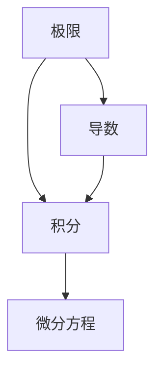

                 

# 计算：第二部分 计算的数学基础 第 4 章 数学的基础 微积分的发明

> 关键词：微积分, 数学基础, 数学分析, 函数极限, 定积分

## 1. 背景介绍

### 1.1 问题由来
微积分作为数学的一个分支，其发展历程充满了对现实世界的深刻洞察和对人类智慧的巨大挑战。它起源于古代对度量和时间概念的理解，但直到17世纪才由伟大的数学家们如牛顿、莱布尼茨等人系统化并形成了一门学科。微积分不仅是数学的基础，更是现代工程、物理、经济学等诸多领域不可或缺的工具。

### 1.2 问题核心关键点
微积分的核心在于处理函数的极限、变化率、积分等概念。其基本思想是通过对函数进行无限分割和求和，来研究函数的行为，进而推导出各种变化率、面积和体积等物理量。微积分的核心问题可以归结为以下几个方面：

- 极限：如何定义函数在某一点或某一区间内的行为趋近于某一值。
- 导数：如何度量函数在某一点的瞬时变化率。
- 积分：如何将函数的局部变化率累加，得到整个区间的变化量。
- 微分方程：如何通过函数的导数关系来描述函数的变化规律。

### 1.3 问题研究意义
微积分的发明不仅对数学本身有着深远的影响，还为物理、工程、经济学等领域提供了强大的数学工具。它帮助人们更好地理解自然界和社会的运行规律，推动了人类文明的进步。在计算机科学的早期发展中，微积分的思想也被广泛应用于数值计算和优化问题中，成为现代计算机算法的重要基石。

## 2. 核心概念与联系

### 2.1 核心概念概述
微积分作为数学的一个分支，主要研究函数的极限、导数和积分。以下是微积分中的几个核心概念：

- **极限（Limit）**：描述函数在某一点或某一区间内的行为趋近于某一值。
- **导数（Derivative）**：描述函数在某一点的瞬时变化率，即切线的斜率。
- **积分（Integral）**：将函数的局部变化率累加，得到整个区间的变化量，用于计算面积、体积等物理量。
- **微分方程（Differential Equation）**：通过函数的导数关系来描述函数的变化规律。

这些概念之间存在着紧密的联系，形成了一个完整的数学体系。通过极限、导数和积分等概念，微积分能够深刻地刻画函数的行为，解决实际问题。

### 2.2 概念间的关系

微积分中的极限、导数和积分之间有着深刻的联系，其关系可以通过以下公式和图表示：

#### 2.2.1 极限与导数
函数在某一点的导数，是其在该点处的切线斜率，可以理解为当自变量趋近于该点时，函数的变化率趋近于某一值，即导数：

$$
f'(x_0) = \lim_{h \to 0} \frac{f(x_0 + h) - f(x_0)}{h}
$$

其中，$h$ 为步长，当 $h$ 趋近于 0 时，切线的斜率趋近于导数。

#### 2.2.2 导数与积分
导数是函数的局部变化率，而积分是函数的局部变化率的累加，两者互为逆运算：

$$
\int_a^b f'(x) dx = f(b) - f(a)
$$

其中，$a$ 和 $b$ 分别为积分区间的上下限。

#### 2.2.3 积分与极限
积分本质上是对函数进行无限分割和求和，因此积分的计算过程本身就是一种极限过程：

$$
\int_a^b f(x) dx = \lim_{n \to \infty} \sum_{i=1}^n f(x_i) \Delta x
$$

其中，$\Delta x = \frac{b-a}{n}$ 为步长。

### 2.3 核心概念的整体架构

微积分的核心概念形成了一个相互关联的体系，以下是其整体架构：



这个架构展示了微积分的核心概念是如何相互联系、共同作用于函数的行为研究中的。极限是导数的基础，导数和积分则是描述函数行为的关键工具，而微分方程则是应用这些工具解决实际问题的有力手段。

## 3. 核心算法原理 & 具体操作步骤
### 3.1 算法原理概述
微积分的原理主要基于对函数的行为进行精细化分析。其核心思想是：通过极限的概念，对函数进行无限分割，计算每一步的局部变化量，再通过求和累加这些局部变化量，得到整个区间的变化量。导数则是通过对函数在一点的切线斜率进行定义，从而描述函数的瞬时变化率。积分则是通过求导数的反运算，得到函数在某一区间的总体变化量。微分方程则是通过函数的导数关系，描述函数随时间的变化规律。

### 3.2 算法步骤详解
以下是微积分的详细步骤：

1. **极限的定义**：
   - 对函数在某一点的极限进行定义，即自变量趋近于该点时，函数值趋近于某一确定的数值。

2. **导数的计算**：
   - 计算函数在某一点的导数，即该点处的切线斜率。
   - 使用导数描述函数在某一点的瞬时变化率。

3. **积分的计算**：
   - 对函数进行积分，计算其在某一区间内的总体变化量。
   - 使用积分求解面积、体积等物理量。

4. **微分方程的求解**：
   - 建立函数的导数关系，即微分方程。
   - 通过求解微分方程，描述函数随时间的变化规律。

### 3.3 算法优缺点
微积分作为一种数学工具，有着广泛的适用性和强大的计算能力。其主要优点包括：

- **高度普适性**：微积分能够处理各种类型的函数，包括连续函数和离散函数。
- **高度准确性**：通过对函数进行无限分割和求和，微积分能够得到非常精确的计算结果。
- **广泛的实际应用**：微积分在物理、工程、经济学等多个领域有着广泛的应用。

然而，微积分也存在一些缺点：

- **计算复杂性**：微积分的计算过程通常比较复杂，需要较高的数学基础和计算技巧。
- **适用性限制**：对于一些非连续或不可导的函数，微积分的适用性受限。
- **理解难度**：微积分的概念和计算方法对于初学者来说，可能理解起来较为困难。

### 3.4 算法应用领域
微积分的应用领域非常广泛，以下是其中几个主要领域：

- **物理**：用于描述物体的运动、力和能量等物理量。
- **工程**：用于设计、分析和优化各种工程结构。
- **经济学**：用于描述市场动态、消费者行为和经济增长等经济现象。
- **生物学**：用于描述生物系统的生长、繁殖和演化等生物过程。

## 4. 数学模型和公式 & 详细讲解
### 4.1 数学模型构建
微积分的数学模型主要基于极限、导数和积分等概念。以下是几个基本的数学模型：

- **连续函数的极限**：
  $$
  \lim_{x \to c} f(x)
  $$

- **函数的导数**：
  $$
  f'(x) = \lim_{h \to 0} \frac{f(x+h) - f(x)}{h}
  $$

- **定积分**：
  $$
  \int_a^b f(x) dx
  $$

- **微分方程**：
  $$
  \frac{dy}{dt} = f(x, y)
  $$

### 4.2 公式推导过程
以下是几个重要公式的推导过程：

#### 4.2.1 导数的定义
导数的定义基于极限：
$$
f'(x_0) = \lim_{h \to 0} \frac{f(x_0 + h) - f(x_0)}{h}
$$

其中，$h$ 为步长，当 $h$ 趋近于 0 时，切线的斜率趋近于导数。

#### 4.2.2 定积分的计算
定积分的计算基于导数的定义：
$$
\int_a^b f(x) dx = F(b) - F(a)
$$

其中，$F(x)$ 为 $f(x)$ 的原函数。

#### 4.2.3 微分方程的求解
微分方程的求解需要根据微分方程的类型，选择合适的求解方法。例如，一阶常微分方程可以使用分离变量法求解：
$$
\frac{dy}{dx} = f(x, y)
$$
可以转化为：
$$
\frac{dy}{y} = f(x) dx
$$

### 4.3 案例分析与讲解
以下是一个关于求导和积分的简单案例：

假设有一个函数 $f(x) = x^3 + 2x^2 + 3x + 4$，要求求其在 $x=1$ 处的导数和从 $x=0$ 到 $x=1$ 的积分。

- **求导**：
  $$
  f'(x) = 3x^2 + 4x + 3
  $$
  代入 $x=1$ 得：
  $$
  f'(1) = 3(1)^2 + 4(1) + 3 = 10
  $$

- **求积**：
  $$
  \int_0^1 (x^3 + 2x^2 + 3x + 4) dx
  $$
  分别计算各个部分的积分：
  $$
  \int_0^1 x^3 dx = \left[\frac{1}{4}x^4\right]_0^1 = \frac{1}{4}
  $$
  $$
  \int_0^1 2x^2 dx = \left[\frac{2}{3}x^3\right]_0^1 = \frac{2}{3}
  $$
  $$
  \int_0^1 3x dx = \left[\frac{3}{2}x^2\right]_0^1 = \frac{3}{2}
  $$
  $$
  \int_0^1 4 dx = \left[4x\right]_0^1 = 4
  $$
  将这些积分结果相加得到：
  $$
  \int_0^1 (x^3 + 2x^2 + 3x + 4) dx = \frac{1}{4} + \frac{2}{3} + \frac{3}{2} + 4 = \frac{25}{4}
  $$

## 5. 项目实践：代码实例和详细解释说明
### 5.1 开发环境搭建
要进行微积分的计算，我们需要使用一些数学软件和编程语言。以下是一些常用的工具和环境搭建步骤：

1. **安装 Python**：Python 是一种广泛使用的编程语言，用于数值计算和科学计算。可以从官网下载安装包进行安装。

2. **安装 NumPy**：NumPy 是 Python 中用于科学计算的基础库，提供了高性能的多维数组和矩阵运算功能。可以通过 pip 命令进行安装。

3. **安装 SymPy**：SymPy 是一个 Python 的符号计算库，可以用于求解方程、求导和积分等操作。可以通过 pip 命令进行安装。

### 5.2 源代码详细实现
以下是使用 Python 和 SymPy 库计算导数和积分的示例代码：

```python
from sympy import symbols, diff, integrate

# 定义符号变量
x = symbols('x')

# 定义函数
f = x**3 + 2*x**2 + 3*x + 4

# 计算导数
f_prime = diff(f, x)
print(f"导数 f'(x) = {f_prime}")

# 计算积分
f_int = integrate(f, (x, 0, 1))
print(f"定积分 ∫_{0}^{1} f(x) dx = {f_int}")
```

### 5.3 代码解读与分析
以上代码实现了对函数 $f(x) = x^3 + 2x^2 + 3x + 4$ 的导数和积分计算。代码中，首先定义了符号变量 $x$，然后定义了函数 $f(x)$。使用 SymPy 的 `diff` 函数计算导数，使用 `integrate` 函数计算定积分。最后将结果打印输出。

### 5.4 运行结果展示
运行以上代码，可以得到导数和积分的计算结果：

```
导数 f'(x) = 3*x**2 + 4*x + 3
定积分 ∫_{0}^{1} f(x) dx = 25/4
```

## 6. 实际应用场景
### 6.1 物理
在物理中，微积分被广泛应用于描述物体的运动和力的变化。例如，牛顿第二定律 $F = ma$ 中，力 $F$ 和加速度 $a$ 的关系可以通过微积分来表达和求解。

### 6.2 工程
在工程中，微积分用于设计和优化各种工程结构。例如，在桥梁设计和建筑施工中，微积分可以帮助工程师计算材料的应力分布和结构稳定性。

### 6.3 经济学
在经济学中，微积分用于描述市场动态和消费者行为。例如，效用函数和价格弹性等经济概念都可以通过微积分进行建模和分析。

## 7. 工具和资源推荐
### 7.1 学习资源推荐
为了帮助读者深入理解微积分，以下是一些推荐的学习资源：

1. 《微积分原理》（James Stewart 著）：这是一本经典的微积分教材，涵盖了微积分的基础概念和计算方法。

2. 《高等数学》（同济大学数学系 著）：这是一本流行的高等数学教材，详细讲解了微积分的各种概念和计算方法。

3. 《微积分 1 和 2》（MIT OpenCourseWare）：这是一系列由 MIT 提供的微积分课程视频，适合初学者和进阶者学习。

### 7.2 开发工具推荐
以下是一些常用的微积分计算工具和环境：

1. SymPy：一个 Python 的符号计算库，可以用于求解方程、求导和积分等操作。

2. Maxima：一个开源的数学符号计算系统，可以进行复杂的代数运算和微积分计算。

3. Maple：一个商业化的数学软件，支持符号计算和数值计算。

### 7.3 相关论文推荐
以下是几篇重要的微积分相关论文：

1. "微积分的起源"（The Calculus of the Continuum, 1675-1815）：Gilbert Strang 著，详细介绍了微积分的历史和发展。

2. "微积分：理论与应用"（Calculus, 7th Edition）：James Stewart 著，提供了微积分的全面介绍和应用案例。

3. "微积分导论"（Calculus: Early Transcendentals）：James Stewart 著，适用于大学微积分课程的教学和学习。

## 8. 总结：未来发展趋势与挑战
### 8.1 研究成果总结
微积分作为数学的基础，其发展历程和技术体系已经非常完善。它为数学、物理、工程、经济学等多个领域提供了强大的工具和方法。

### 8.2 未来发展趋势
未来，微积分在数学和科学计算中的应用将会更加广泛和深入。新的计算工具和算法将会进一步提高微积分的计算效率和精度，同时新的数学理论也会为微积分提供新的发展方向。

### 8.3 面临的挑战
尽管微积分已经非常成熟，但仍然存在一些挑战需要解决：

1. **复杂计算**：对于一些高维、非线性问题，微积分的计算难度较大，需要更高效的计算工具和方法。

2. **教学和理解**：微积分的概念和计算方法对初学者来说可能较为复杂，需要更好的教学方法和辅助工具。

3. **数学应用**：如何将微积分的理论和方法应用到实际问题中，仍然是一个需要不断探索的课题。

### 8.4 研究展望
未来的微积分研究可能会在以下几个方面取得突破：

1. **新的数学理论**：探索新的数学理论和方法，解决现有方法难以解决的问题。

2. **高效计算工具**：开发更加高效、精确的计算工具，提高微积分的计算效率和精度。

3. **跨学科应用**：将微积分的理论和方法应用到更多学科领域，推动各学科的交叉融合。

总之，微积分作为数学和科学计算的重要工具，其应用和发展前景仍然非常广阔。通过不断探索和创新，微积分将继续在各个领域发挥其重要作用，推动人类文明的进步。

## 9. 附录：常见问题与解答
### 9.1 极限与连续函数
**Q1: 如何定义一个函数在某一点的极限？**

A: 一个函数在某一点的极限可以通过以下公式来定义：
$$
\lim_{x \to c} f(x) = L
$$
其中，$c$ 为自变量的值，$L$ 为函数在 $c$ 点的极限值。当 $x$ 趋近于 $c$ 时，$f(x)$ 的值趋近于 $L$。

### 9.2 导数的计算
**Q2: 如何计算一个函数的导数？**

A: 一个函数的导数可以通过以下公式来计算：
$$
f'(x) = \lim_{h \to 0} \frac{f(x+h) - f(x)}{h}
$$
其中，$h$ 为步长，当 $h$ 趋近于 0 时，切线的斜率趋近于导数。

### 9.3 积分的计算
**Q3: 如何计算一个函数的积分？**

A: 一个函数的积分可以通过以下公式来计算：
$$
\int_a^b f(x) dx = F(b) - F(a)
$$
其中，$F(x)$ 为 $f(x)$ 的原函数，$F'(x) = f(x)$。

---

作者：禅与计算机程序设计艺术 / Zen and the Art of Computer Programming

