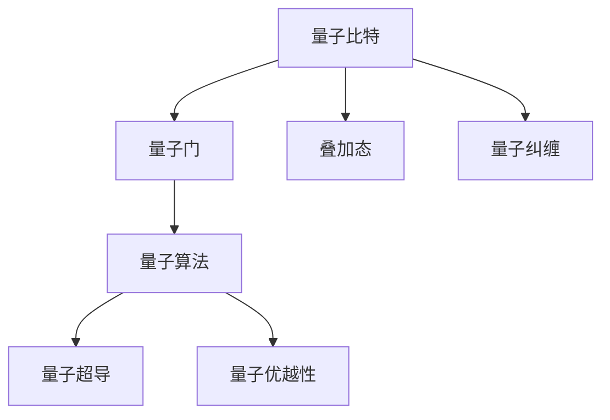
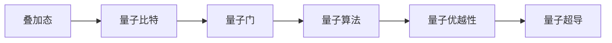
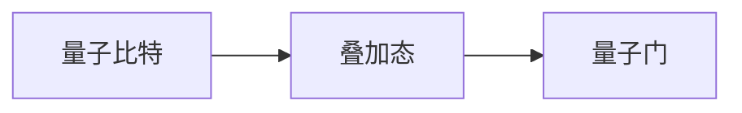
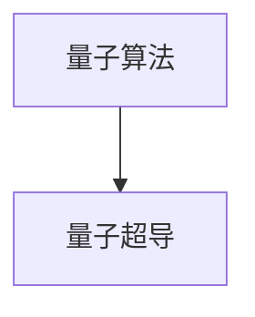
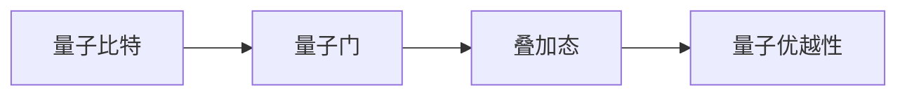
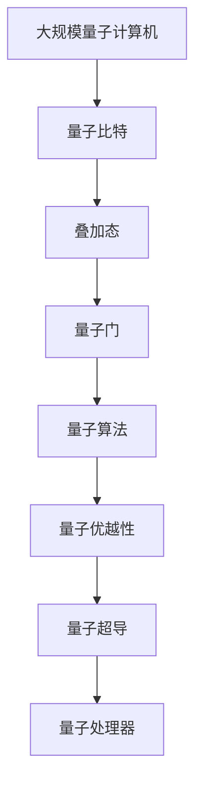

                 

# 计算：第四部分 计算的极限 第 10 章 量子计算 量子计算的启蒙

> 关键词：量子计算, 量子比特, 量子门, 叠加态, 量子纠缠, 量子算法, 量子超导, 量子优越性

## 1. 背景介绍

### 1.1 问题由来

量子计算是近年来计算机科学领域最为引人注目的研究方向之一。它的提出基于量子力学的一些基本原理，旨在构建一种全新的计算模型，以解决某些传统计算机无法有效处理的问题。量子计算的优势在于其计算能力的指数级增长，对于某些特定的应用，如化学模拟、优化问题、密码破解等，具有显著的优势。

### 1.2 问题核心关键点

量子计算的核心在于利用量子力学的叠加态和量子纠缠等特性，通过量子比特（qubit）和量子门（quantum gate）来实现对问题的并行计算和高效的计算复杂度。目前，量子计算的研究主要集中在以下几个方面：

- **量子比特**：量子计算的基本单位，具有状态叠加和量子纠缠的特性。
- **量子门**：量子计算中基本的操作单元，通过对量子比特进行操作，实现计算。
- **叠加态和量子纠缠**：量子计算中最重要的特性，使得量子计算机能够进行高效的计算。
- **量子算法**：专门设计用于量子计算的算法，如Shor算法和Grover算法。
- **量子超导**：实现量子比特稳定的关键技术，如超导量子比特和量子处理器。
- **量子优越性**：指量子计算机在某些特定问题上相对于传统计算机的性能优势。

这些核心概念共同构成了量子计算的基本框架，为后续深入讨论奠定了基础。

## 2. 核心概念与联系

### 2.1 核心概念概述

量子计算的基本概念和经典计算有着显著的区别，以下是几个关键概念的概述：

- **量子比特（qubit）**：量子计算的基本单位，与经典计算的比特不同，qubit可以同时处于0和1的叠加态。
- **量子门（quantum gate）**：量子计算中的基本操作，通过量子门对qubit进行操作，实现量子计算。
- **叠加态（superposition）**：量子比特的一种状态，qubit可以同时处于0和1的叠加态，从而实现并行计算。
- **量子纠缠（quantum entanglement）**：量子比特之间的一种特殊关联，使得它们的任何测量结果都是相互关联的。
- **量子算法（quantum algorithm）**：专门设计用于量子计算的算法，如Shor算法和Grover算法。
- **量子超导（quantum superconducting）**：实现量子比特稳定的关键技术，如超导量子比特和量子处理器。
- **量子优越性（quantum supremacy）**：指量子计算机在某些特定问题上相对于传统计算机的性能优势。

这些核心概念之间的逻辑关系可以通过以下Mermaid流程图来展示：



这个流程图展示了大量子计算的基本组件及其关系：

1. 量子比特通过量子门进行操作，实现计算。
2. 量子比特可以处于叠加态，实现并行计算。
3. 量子比特之间可以存在量子纠缠，使得它们之间存在特殊的关联。
4. 量子算法专门设计用于量子计算，包括Shor算法和Grover算法。
5. 量子超导是实现量子比特稳定的关键技术。
6. 量子优越性是指量子计算机在某些特定问题上相对于传统计算机的性能优势。

### 2.2 概念间的关系

这些核心概念之间存在着紧密的联系，形成了量子计算的完整生态系统。下面我们通过几个Mermaid流程图来展示这些概念之间的关系。

#### 2.2.1 量子计算的基本原理



这个流程图展示了量子计算的基本原理，即叠加态、量子比特、量子门、量子算法和量子优越性之间的关系。量子比特通过叠加态和量子门进行操作，实现并行计算，进而设计出高效的算法，并在量子超导技术支持下实现量子优越性。

#### 2.2.2 量子比特和量子门的连接



这个流程图展示了量子比特和量子门的连接关系。量子比特通过叠加态实现并行计算，而量子门则对这些并行计算的叠加态进行操作，实现量子计算。

#### 2.2.3 量子算法和量子超导的关系



这个流程图展示了量子算法和量子超导的关系。量子算法设计用于量子计算，而量子超导技术则实现量子比特的稳定，从而支持量子算法的实现。

#### 2.2.4 量子优越性和量子比特的关系



这个流程图展示了量子优越性和量子比特的关系。量子比特通过量子门和叠加态进行操作，实现高效计算，从而支持量子优越性的实现。

### 2.3 核心概念的整体架构

最后，我们用一个综合的流程图来展示这些核心概念在大量子计算中的整体架构：



这个综合流程图展示了从大规模量子计算机到量子优越性的完整过程。量子比特通过叠加态和量子门进行操作，实现高效的计算。通过量子算法设计出的算法，并在量子超导技术支持下，实现量子优越性。

## 3. 核心算法原理 & 具体操作步骤
### 3.1 算法原理概述

量子计算的基本算法，如Shor算法和Grover算法，利用了量子叠加态和量子纠缠的特性，实现了经典计算中难以处理的算法。以下简要概述这些算法的基本原理：

- **Shor算法**：用于分解大质数的量子算法，具有指数级的加速效果。
- **Grover算法**：用于无序数据库搜索的量子算法，能够在$O(\sqrt{N})$的时间内完成$O(N)$的经典计算任务。

这些算法的核心在于利用量子叠加态和量子纠缠的特性，实现并行计算和高效的计算复杂度。

### 3.2 算法步骤详解

以下是Shor算法的基本步骤：

1. 将待分解的数$n$转化为量子比特形式，并使用量子门将其转化为叠加态。
2. 通过多次应用Ri量子门，将叠加态演化为周期性函数。
3. 利用量子傅里叶变换（QFT），将周期性函数的叠加态转化为经典可读的周期性函数。
4. 对周期性函数进行测量，获取质因数分解的结果。

Grover算法的步骤如下：

1. 将数据库中的所有数据项转换为量子比特形式，并使用量子门将其转化为叠加态。
2. 利用Grover迭代，对叠加态进行操作，逐步逼近目标数据项。
3. 通过量子傅里叶变换（QFT），将叠加态转化为经典可读的形式。
4. 测量量子态，得到目标数据项的索引。

### 3.3 算法优缺点

量子计算的主要优点包括：

- 并行计算能力：利用叠加态和量子纠缠的特性，实现指数级的并行计算。
- 高效计算复杂度：某些特定问题的计算复杂度，如质因数分解和数据库搜索，能够在量子计算中得到显著提升。
- 潜在的革命性突破：量子计算有望在某些特定问题上实现经典计算无法实现的突破，如化学模拟和优化问题。

然而，量子计算也存在一些缺点：

- 实现难度高：量子计算需要极低的温度和高度稳定的环境，实现难度较大。
- 错误率高：量子计算的错误率较高，需要复杂的纠错机制。
- 应用范围有限：虽然在某些特定问题上具有优势，但大多数问题仍然需要经典计算的支持。

### 3.4 算法应用领域

量子计算的应用领域广泛，以下列举几个主要应用领域：

- **化学模拟**：量子计算机能够高效模拟量子系统的行为，有助于理解复杂的化学反应。
- **密码破解**：Shor算法能够在多项式时间内破解经典计算下的安全加密算法。
- **优化问题**：量子计算能够高效求解多项式优化问题，有助于解决各种复杂优化问题。
- **人工智能**：量子计算有望加速机器学习和深度学习的训练过程。
- **金融分析**：量子计算能够高效处理海量金融数据，帮助金融机构的决策制定。
- **生物信息学**：量子计算能够高效处理生物数据，加速生物学研究。

## 4. 数学模型和公式 & 详细讲解  
### 4.1 数学模型构建

量子计算的数学模型基于量子力学的基本原理，包括叠加态、量子纠缠和量子门等概念。以下用数学语言对量子计算的基本模型进行阐述：

- **量子比特（qubit）**：定义为$|0\rangle$和$|1\rangle$的叠加态，即$|0\rangle=\frac{1}{\sqrt{2}}(|0\rangle+|1\rangle)$。
- **量子门（quantum gate）**：定义为线性算符$U$，对量子比特进行操作，即$|\psi\rangle \rightarrow U|\psi\rangle$。
- **叠加态（superposition）**：定义为$|\psi\rangle=\alpha|0\rangle+\beta|1\rangle$，其中$\alpha$和$\beta$为复数，满足$|\alpha|^2+|\beta|^2=1$。
- **量子纠缠（quantum entanglement）**：定义为两个量子比特之间的状态$|\psi\rangle=|0\rangle\otimes|0\rangle$或$|\psi\rangle=|1\rangle\otimes|1\rangle$，即两个量子比特的状态无法独立测量。

### 4.2 公式推导过程

以下是Shor算法中量子傅里叶变换（QFT）的公式推导：

$$
F^{\times n} |k\rangle = \frac{1}{\sqrt{2^n}} \sum_{j=0}^{2^n-1} e^{-2\pi i \frac{kj}{2^n}} |j\rangle
$$

其中$F^{\times n}$为量子傅里叶变换，$|k\rangle$为叠加态，$e^{-2\pi i \frac{kj}{2^n}}$为相位因子，$|j\rangle$为量子比特的状态。

### 4.3 案例分析与讲解

以Shor算法为例，以下分析其在质因数分解中的应用：

1. 将待分解的数$n$转化为量子比特形式，并使用量子门将其转化为叠加态。
2. 通过多次应用Ri量子门，将叠加态演化为周期性函数。
3. 利用量子傅里叶变换（QFT），将周期性函数的叠加态转化为经典可读的周期性函数。
4. 对周期性函数进行测量，获取质因数分解的结果。

## 5. 项目实践：代码实例和详细解释说明
### 5.1 开发环境搭建

在进行量子计算的实践前，我们需要准备好开发环境。以下是使用Python进行Qiskit开发的环境配置流程：

1. 安装Anaconda：从官网下载并安装Anaconda，用于创建独立的Python环境。

2. 创建并激活虚拟环境：
```bash
conda create -n qiskit-env python=3.8 
conda activate qiskit-env
```

3. 安装Qiskit：
```bash
pip install qiskit
```

4. 安装各类工具包：
```bash
pip install numpy pandas scikit-learn matplotlib tqdm jupyter notebook ipython
```

完成上述步骤后，即可在`qiskit-env`环境中开始量子计算的实践。

### 5.2 源代码详细实现

以下是使用Qiskit进行Shor算法的代码实现：

```python
from qiskit import QuantumCircuit, execute, Aer
from qiskit.circuit import QuantumRegister, ClassicalRegister
from qiskit.visualization import plot_histogram, plot_bloch_multivector
from math import sqrt, pow

# 定义量子比特数量和质数n
n = 6
p = 15

# 创建量子比特和经典比特
qr = QuantumRegister(n, 'q')
cr = ClassicalRegister(n, 'c')

# 创建量子电路
circuit = QuantumCircuit(qr, cr)

# 初始化量子比特
circuit.initialize(1/sqrt(2), 0)
circuit.barrier()

# 应用Ri量子门
for i in range(n):
    circuit.rz(pow(2, -i, p), i)
circuit.barrier()

# 量子傅里叶变换
circuit.h(range(n))
circuit.barrier()

# 测量
circuit.measure(qr, cr)

# 输出量子态
circuit.draw()

# 运行量子电路
backend = Aer.get_backend('qasm_simulator')
result = execute(circuit, backend, shots=1024).result()
counts = result.get_counts(circuit)

# 输出测量结果
print(counts)
```

### 5.3 代码解读与分析

让我们再详细解读一下关键代码的实现细节：

**定义量子比特和经典比特**：
- `QuantumRegister`和`ClassicalRegister`分别用于定义量子比特和经典比特。
- `n`为量子比特数量，`p`为待分解的质数。

**创建量子电路**：
- `QuantumCircuit`用于创建量子电路。
- `qr`和`cr`分别为量子比特和经典比特的列表。

**初始化量子比特**：
- `initialize`方法用于初始化量子比特。

**应用Ri量子门**：
- `rz`方法用于应用量子旋转门。

**量子傅里叶变换**：
- `h`方法用于应用Hadamard门，实现量子傅里叶变换。

**测量**：
- `measure`方法用于对量子比特进行测量，并将结果存储到经典比特中。

**运行量子电路**：
- `execute`方法用于运行量子电路。
- `shots`参数指定运行次数。

**输出量子态和测量结果**：
- `draw`方法用于输出量子电路的可视化图。
- `get_counts`方法用于获取测量结果的统计。

## 6. 实际应用场景
### 6.1 智能合约

量子计算在智能合约中的应用主要在于提高合同执行的安全性和效率。通过量子计算，智能合约能够在分布式系统中高效执行，并确保合同的安全性和透明性。

在实践中，可以构建基于量子计算的智能合约平台，通过量子密钥分发和量子哈希技术，确保合同执行的安全性。量子计算还可以加速合同的验证和执行过程，提高合同执行的效率。

### 6.2 金融服务

量子计算在金融服务中的应用主要在于提高金融数据分析的效率和准确性。通过量子计算，金融机构能够高效处理海量金融数据，加速金融产品的开发和定价。

在实践中，可以构建基于量子计算的金融数据分析平台，通过量子算法加速数据处理和分析过程，提高金融模型的精度和效率。量子计算还可以用于风险管理和金融预测，帮助金融机构制定更科学的决策策略。

### 6.3 医疗诊断

量子计算在医疗诊断中的应用主要在于提高医疗数据分析的效率和准确性。通过量子计算，医疗机构能够高效处理海量医疗数据，加速疾病诊断和治疗方案的制定。

在实践中，可以构建基于量子计算的医疗数据分析平台，通过量子算法加速数据处理和分析过程，提高医疗模型的精度和效率。量子计算还可以用于药物设计和基因编辑，帮助医疗机构开发更有效的治疗方案。

### 6.4 未来应用展望

随着量子计算技术的不断进步，未来量子计算的应用领域将更加广泛，将为各个行业带来革命性的变化。

在智慧城市中，量子计算能够高效处理海量城市数据，提升城市管理的智能化水平，构建更安全、高效的未来城市。

在智能制造中，量子计算能够高效处理生产数据，优化生产流程，提高生产效率和产品质量。

在网络安全中，量子计算能够高效破解经典加密算法，提升网络安全性，保障数据隐私。

总之，量子计算作为一项前沿技术，其应用前景广阔，将深刻影响各行各业的发展。

## 7. 工具和资源推荐
### 7.1 学习资源推荐

为了帮助开发者系统掌握量子计算的理论基础和实践技巧，这里推荐一些优质的学习资源：

1. 《量子计算导论》（Quantum Computation and Quantum Information）：由David J. C. MacKinnon等撰写，全面介绍了量子计算的基本原理和应用。
2. 《量子计算原理》（Quantum Computation: Algorithms and Experiments）：由Alan Turing奖得主Peter Shor撰写，深入浅出地介绍了量子计算的基本原理和应用。
3. 《量子计算》（Quantum Computation and Quantum Information）：由Michael A. Nielsen和Isaac L. Chuang撰写，详细介绍了量子计算的理论基础和应用。
4. 《量子计算导论》（Quantum Computation and Quantum Information）：由Michael A. Nielsen和Isaac L. Chuang撰写，全面介绍了量子计算的基本原理和应用。
5. 《量子计算》（Quantum Computation）：由Scott Aaronson撰写，深入浅出地介绍了量子计算的基本原理和应用。

通过对这些资源的学习实践，相信你一定能够快速掌握量子计算的精髓，并用于解决实际的NLP问题。

### 7.2 开发工具推荐

高效的开发离不开优秀的工具支持。以下是几款用于量子计算开发的常用工具：

1. Qiskit：由IBM开发的量子计算框架，提供丰富的量子计算库和接口，适用于初学者和专业开发者。
2. Cirq：由Google开发的量子计算框架，提供易用的API和图形界面，适用于初学者和专业开发者。
3. TensorFlow Quantum：由Google开发的量子计算库，集成于TensorFlow中，适用于深度学习和量子计算的结合。
4. Microsoft Quantum Development Kit：由Microsoft开发的量子计算开发平台，提供丰富的量子计算库和接口，适用于Microsoft Azure平台。
5. IBM Quantum Experience：IBM提供的量子计算开发平台，提供实机和模拟器，适用于研究和应用开发。

合理利用这些工具，可以显著提升量子计算的开发效率，加快创新迭代的步伐。

### 7.3 相关论文推荐

量子计算的研究源于学界的持续研究。以下是几篇奠基性的相关论文，推荐阅读：

1. Quantum Error Correction（量子纠错）：由G. K. Brennen等撰写，介绍了量子纠错的基本原理和实现方法。
2. Quantum Computation by Adiabatic Evolution（量子计算的绝热演化）：由F. Gaitan等撰写，介绍了绝热演化的量子计算方法。
3. Quantum Computation of Discrete Logarithms（量子计算离散对数问题）：由A. M. Steane等撰写，介绍了利用量子算法解决离散对数问题的基本原理。
4. Quantum Algorithms for Database Search and Sorting（量子算法数据库搜索和排序）：由R. Cleve等撰写，介绍了量子算法在数据库搜索和排序中的应用。
5. Quantum Algorithms for Non-Abelian Computation（量子算法非阿贝尔计算）：由J. Kempe等撰写，介绍了利用量子算法进行非阿贝尔计算的基本原理。

这些论文代表了大量子计算的研究进展，通过学习这些前沿成果，可以帮助研究者把握学科前进方向，激发更多的创新灵感。

除上述资源外，还有一些值得关注的前沿资源，帮助开发者紧跟大模型微调技术的最新进展，例如：

1. arXiv论文预印本：人工智能领域最新研究成果的发布平台，包括大量尚未发表的前沿工作，学习前沿技术的必读资源。

2. 业界技术博客：如IBM Research、Google AI、Microsoft Research、DeepMind等顶尖实验室的官方博客，第一时间分享他们的最新研究成果和洞见。

3. 技术会议直播：如Quantum Conference、IC Quantum Computing Conference等人工智能领域顶会现场或在线直播，能够聆听到大佬们的前沿分享，开拓视野。

4. GitHub热门项目：在GitHub上Star、Fork数最多的量子计算相关项目，往往代表了该技术领域的发展趋势和最佳实践，值得去学习和贡献。

5. 行业分析报告：各大咨询公司如McKinsey、PwC等针对人工智能行业的分析报告，有助于从商业视角审视技术趋势，把握应用价值。

总之，对于量子计算的研究和学习，需要开发者保持开放的心态和持续学习的意愿。多关注前沿资讯，多动手实践，多思考总结，必将收获满满的成长收益。

## 8. 总结：未来发展趋势与挑战

### 8.1 总结

本文对大量子计算的基本原理和应用进行了全面系统的介绍。首先阐述了量子计算的基本概念和应用领域，明确了量子计算在提高计算能力、加速特定问题解决等方面的独特价值。其次，从原理到实践，详细讲解了Shor算法和Grover算法的基本步骤和实现方法，给出了量子计算的代码实例。同时，本文还探讨了量子计算在智能合约、金融服务、医疗诊断等多个行业领域的应用前景，展示了量子计算的广阔前景。最后，本文精选了量子计算的学习资源，力求为读者提供全方位的技术指引。

通过本文的系统梳理，可以看到，大量子计算作为一项前沿技术，正在为各个行业带来革命性的变化。其计算能力的指数级增长，使其在某些特定问题上具有显著的优势，能够为科学研究、工业生产、社会治理等领域带来颠覆性的影响。

### 8.2 未来发展趋势

展望未来，大量子计算将呈现以下几个发展趋势：

1. 量子比特数量持续增大。随着量子芯片技术的不断进步，量子比特的数量将持续增大，量子计算的计算能力将进一步提升。
2. 量子纠错技术不断进步。随着量子纠错技术的发展，量子计算的错误率将逐渐降低，量子计算的稳定性将得到改善。
3. 量子计算的应用范围不断扩大。随着量子计算技术的不断成熟，其应用领域将不断扩大，涵盖更多实际问题。
4. 量子计算的产业化加速。随着量子计算技术的不断成熟，其商业化应用也将加速，成为未来计算机的重要组成部分。

### 8.3 面临的挑战

尽管大量子计算已经取得了一定的进展，但在迈向更加智能化、普适化应用的过程中，仍面临诸多挑战：

1. 实现难度高。量子计算需要极低的温度和高度稳定的环境，实现难度较大。
2. 错误率高。量子计算的错误率较高，需要复杂的纠错机制。
3. 应用范围有限。尽管在某些特定问题上具有优势，但大多数问题仍然需要经典计算的支持。
4. 可扩展性差。现有的量子计算系统可扩展性较差，无法满足大规模计算的需求。
5. 安全性问题。量子计算可能破解经典加密算法，对数据安全带来威胁。

### 8.4 研究展望

面对大量子计算所面临的挑战，未来的研究需要在以下几个方面寻求新的突破：

1. 探索无监督和半监督量子计算方法。摆脱对大规模经典计算的支持，利用量子计算的天然特性，实现更加高效的量子计算。
2. 研究参数高效和计算高效的量子计算方法。开发更加参数高效和计算高效的量子计算方法，提高量子计算的效率。
3. 引入更多先验知识。将符号化的先验知识，如知识图谱、逻辑规则等，与量子计算相结合，提高量子计算的普适性和鲁棒性。
4. 结合因果分析和博弈论工具。将因果分析方法引入量子计算，识别出量子计算的脆弱点，提高系统的稳定性。

这些研究方向的探索，必将引领大量子计算技术迈向更高的台阶，为构建安全、可靠、可解释、可控的智能系统铺平道路。面向未来，大量子计算技术还需要与其他人工智能技术进行更深入的融合，如知识表示、因果推理、强化学习等，多路径协同发力，共同推动人工智能技术的进步。只有勇于创新、敢于突破，才能不断拓展量子计算的边界，让智能技术更好地造福人类社会。

## 9. 附录：常见问题与解答

**Q1：量子计算是否真的比经典计算更快？**

A: 量子计算在处理某些特定问题时，能够实现指数级加速，但在大多数问题上仍然需要经典计算的支持。目前，量子计算在处理质因数分解、数据库搜索等特定问题上，已展现出显著的性能优势。

**Q2：量子计算的应用前景如何？**

A: 量子计算具有广泛的应用前景，如智能合约、金融服务、医疗诊断、化学模拟等领域。其计算能力的指数级增长，使其在某些特定问题上具有显著的优势。

**Q3：量子计算的错误率如何控制？**

A: 量子计算的错误率较高，需要复杂的纠错机制。量子纠错技术的发展是量子计算实用化的关键。

**Q4：量子计算的安全性如何保障？**

A: 量子计算可能破解经典加密算法，对数据安全带来威胁。因此，研究量子安全的加密算法是保障量子计算安全性的重要方向。

**Q5：量子计算的实现难度如何？**

A: 量子计算需要极低的温度和高度稳定的环境，实现难度较大。目前，量子计算系统还处于发展

