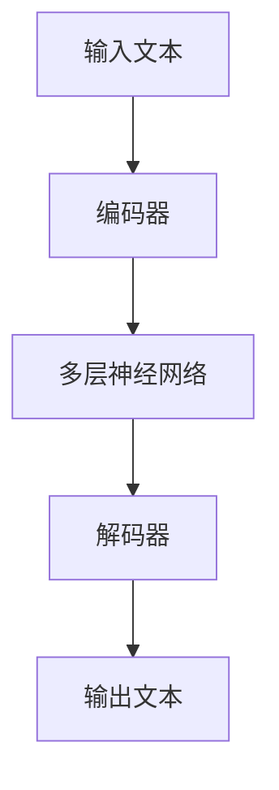
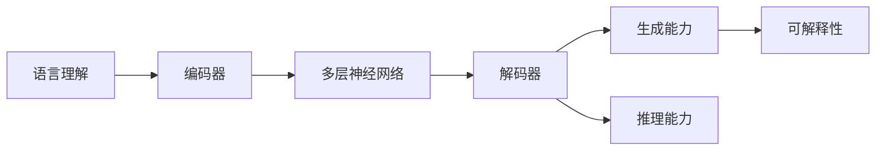

                 

# 语言≠思维：大模型的认知难题

在深度学习时代，大语言模型以其卓越的性能和广泛的适用性，成为了人工智能领域的一支重要力量。然而，尽管大模型在自然语言处理(NLP)等任务上取得了令人瞩目的成就，但它们在语言与认知关系上的表现仍然存在不少问题。本文旨在深入探讨大语言模型在语言理解、生成、推理等方面的认知难题，并试图从认知科学、神经科学的视角，重新审视大模型的本质。

## 1. 背景介绍

### 1.1 问题由来

大语言模型（如GPT-3、BERT等）的兴起，标志着AI领域在自然语言理解与生成方面的重大进步。这些模型通过在大量无标签文本数据上进行预训练，学习了丰富的语言知识，并在下游任务上表现出惊人的能力。然而，在实际应用中，大模型时常出现以下认知难题：

- **语言理解不准确**：大模型能够生成流畅的文本，但有时内容与实际语境不符，缺乏对语言的深层理解。
- **生成重复冗余**：生成的文本常包含大量重复信息，缺乏逻辑连贯性和结构性。
- **推理能力有限**：尽管可以完成一些基本的逻辑推理任务，但在复杂情境下仍难以展现人类水平的推理能力。
- **无法直接解释**：难以提供对生成过程的解释，使用户难以理解模型的决策依据。

这些问题表明，大模型在某种程度上还未能充分理解语言的认知机制。本文将从认知科学的角度，探讨大模型在语言理解、生成和推理等方面的认知难题。

### 1.2 问题核心关键点

大模型面临的认知难题主要集中在以下几个方面：

- **语言的象征性与认知机制**：语言作为人类思维的象征符号，大模型如何通过语言理解人类的思维？
- **知识的存储与调用**：大模型如何存储和调用长时记忆中存储的知识？
- **逻辑推理与因果关系**：大模型如何建立因果关系，进行逻辑推理？
- **可解释性与透明性**：大模型为何无法提供直观的生成解释？

本文旨在回答这些问题，通过深度分析大模型的内部机制，探讨其认知难题的根源，并提出可能的改进方向。

## 2. 核心概念与联系

### 2.1 核心概念概述

大语言模型作为一种深度学习模型，其实质是一个复杂的神经网络，能够处理和生成文本数据。其核心概念包括：

- **语言理解**：通过大量无标签文本数据进行预训练，学习语言的基本语法、语义和语用规则，从而能够理解文本含义。
- **生成能力**：在给定上下文的情况下，生成连贯、语法正确的文本。
- **推理能力**：能够进行简单的逻辑推理，根据上下文推断出某些事实或结论。

这些概念通过神经网络的结构和训练过程得以实现。其内部机制主要包括以下几个方面：

- **编码器-解码器结构**：通过多层神经网络，实现从输入到输出的文本编码和解码。
- **自注意力机制**：使模型能够捕捉文本中不同位置的信息关系，增强语言理解能力。
- **Transformer结构**：通过自注意力机制和前馈神经网络，实现高效的并行计算，提升生成和推理效率。

这些概念通过数据流图（Data Flow Diagram, DFD）来体现，如图：



其中，B和D分别表示编码器和解码器，C表示多层神经网络结构。A和E分别表示输入和输出文本。

### 2.2 概念间的关系

大语言模型中的核心概念间存在紧密的联系，如图：



- **语言理解与生成**：语言理解是生成的基础，大模型通过理解文本含义，生成连贯的文本。
- **生成与推理**：生成能力是推理的前提，大模型通过生成文本，为推理提供基础数据。
- **推理与可解释性**：推理是复杂任务的基础，但大模型缺乏对生成过程的直接解释，导致可解释性不足。

## 3. 核心算法原理 & 具体操作步骤

### 3.1 算法原理概述

大语言模型的核心算法原理是通过神经网络结构，实现从输入到输出的文本编码和解码。具体步骤如下：

1. **预训练**：在大量无标签文本数据上训练模型，学习语言的基本语法、语义和语用规则。
2. **微调**：在特定任务的数据集上，调整模型参数，使其适应特定任务的需求。
3. **推理与生成**：在给定上下文的情况下，生成连贯、语法正确的文本，并根据上下文进行简单的逻辑推理。

### 3.2 算法步骤详解

#### 3.2.1 预训练

预训练是大模型构建的基础，通过在大量无标签文本数据上训练，学习语言的基本特征。具体步骤如下：

1. **数据准备**：收集大量无标签文本数据，通常是互联网上的公开文章、新闻、书籍等。
2. **模型训练**：使用Transformer结构，在自注意力机制和前馈神经网络的帮助下，训练模型。
3. **知识迁移**：将预训练模型用于下游任务，通过微调，进一步提升模型性能。

#### 3.2.2 微调

微调是使模型适应特定任务的过程，通常包括以下步骤：

1. **任务适配**：根据任务类型，设计合适的输出层和损失函数。
2. **模型调整**：调整模型参数，使其适应任务需求。
3. **评估与优化**：在验证集上评估模型性能，根据性能指标调整模型参数，直至模型收敛。

#### 3.2.3 推理与生成

推理与生成是大模型的最终目标，通过给定上下文，生成连贯、语法正确的文本。具体步骤如下：

1. **上下文输入**：输入文本作为上下文，供模型理解。
2. **编码器处理**：使用编码器将输入文本转换为模型可理解的表示。
3. **解码器生成**：使用解码器，根据上下文和内部表示，生成文本。
4. **文本输出**：将生成的文本输出，供用户查看或进一步处理。

### 3.3 算法优缺点

大语言模型在语言理解和生成方面表现出色，具有以下优点：

- **强大的语义理解能力**：通过预训练，模型能够理解复杂的语言结构和语义关系。
- **高效的生成能力**：在给定上下文的情况下，能够快速生成流畅的文本。
- **广泛的应用场景**：适用于各种NLP任务，如图像描述、摘要生成、对话系统等。

但其也存在以下缺点：

- **缺乏逻辑推理能力**：在复杂情境下，无法展现人类水平的逻辑推理能力。
- **生成过程不透明**：难以提供对生成过程的解释，使用户难以理解模型的决策依据。
- **生成内容可能不真实**：生成的文本可能与实际语境不符，缺乏真实性。

### 3.4 算法应用领域

大语言模型在多个领域都有广泛的应用，包括：

- **自然语言处理**：文本分类、文本摘要、情感分析、机器翻译等。
- **对话系统**：智能客服、聊天机器人等。
- **医学领域**：医学文献检索、疾病诊断等。
- **金融领域**：金融新闻摘要、情感分析等。
- **教育领域**：智能作文批改、知识推荐等。

## 4. 数学模型和公式 & 详细讲解

### 4.1 数学模型构建

大语言模型通常使用Transformer结构进行构建，其数学模型可以表示为：

$$
y = M(x; \theta)
$$

其中，$x$ 为输入文本，$y$ 为输出文本，$\theta$ 为模型参数。

假设输入文本由$n$个单词组成，每个单词$x_i$表示为$n$维向量，模型通过多层神经网络进行编码和解码，生成输出文本。其数学模型可表示为：

$$
y_i = \sigma(W_i z_i + b_i)
$$

其中，$W_i$ 为权重矩阵，$b_i$ 为偏置向量，$z_i$ 为隐藏层输出。

### 4.2 公式推导过程

大语言模型的推理与生成过程，可以通过数学公式进行详细推导。具体步骤如下：

1. **输入编码**：将输入文本$x$通过编码器转换为内部表示$z$。
2. **上下文融合**：将上下文$c$与内部表示$z$进行融合，得到新的表示$z'$。
3. **生成文本**：使用解码器，根据上下文$c$和内部表示$z'$，生成文本$y$。

其数学公式可以表示为：

$$
z = E(x)
$$

$$
z' = F(c, z)
$$

$$
y = D(z')
$$

其中，$E$ 表示编码器，$F$ 表示融合函数，$D$ 表示解码器。

### 4.3 案例分析与讲解

以GPT-3为例，分析其推理与生成过程。假设输入文本为“今天天气怎么样？”，大模型需要生成连贯的回复。

1. **输入编码**：使用编码器$E$将输入文本转换为内部表示$z$。
2. **上下文融合**：模型根据当前上下文$c$，将内部表示$z$进行融合，得到新的表示$z'$。
3. **生成文本**：使用解码器$D$，根据上下文$c$和内部表示$z'$，生成文本$y$。

其具体过程如图：


## 5. 项目实践：代码实例和详细解释说明

### 5.1 开发环境搭建

在进行大语言模型项目实践前，我们需要准备好开发环境。以下是使用Python进行PyTorch开发的环境配置流程：

1. 安装Anaconda：从官网下载并安装Anaconda，用于创建独立的Python环境。

2. 创建并激活虚拟环境：
```bash
conda create -n pytorch-env python=3.8 
conda activate pytorch-env
```

3. 安装PyTorch：根据CUDA版本，从官网获取对应的安装命令。例如：
```bash
conda install pytorch torchvision torchaudio cudatoolkit=11.1 -c pytorch -c conda-forge
```

4. 安装Transformers库：
```bash
pip install transformers
```

5. 安装各类工具包：
```bash
pip install numpy pandas scikit-learn matplotlib tqdm jupyter notebook ipython
```

完成上述步骤后，即可在`pytorch-env`环境中开始项目实践。

### 5.2 源代码详细实现

这里我们以BERT模型为例，展示其代码实现。首先，定义模型的输入输出结构：

```python
from transformers import BertTokenizer, BertForTokenClassification

tokenizer = BertTokenizer.from_pretrained('bert-base-cased')
model = BertForTokenClassification.from_pretrained('bert-base-cased', num_labels=2)
```

接着，定义模型的训练函数：

```python
from torch.utils.data import Dataset, DataLoader
from tqdm import tqdm
import torch.nn as nn
import torch.optim as optim

class TextDataset(Dataset):
    def __init__(self, texts, labels):
        self.texts = texts
        self.labels = labels
        self.tokenizer = tokenizer
        self.max_len = 128

    def __len__(self):
        return len(self.texts)

    def __getitem__(self, idx):
        text = self.texts[idx]
        label = self.labels[idx]
        encoding = self.tokenizer(text, return_tensors='pt', max_length=self.max_len, padding='max_length', truncation=True)
        input_ids = encoding['input_ids']
        attention_mask = encoding['attention_mask']
        labels = torch.tensor(self.labels[idx], dtype=torch.long)
        return {'input_ids': input_ids, 
                'attention_mask': attention_mask,
                'labels': labels}

train_dataset = TextDataset(train_texts, train_labels)
test_dataset = TextDataset(test_texts, test_labels)
batch_size = 16
train_loader = DataLoader(train_dataset, batch_size=batch_size, shuffle=True)
test_loader = DataLoader(test_dataset, batch_size=batch_size)
```

然后，定义模型的优化器、损失函数和评估函数：

```python
device = torch.device('cuda') if torch.cuda.is_available() else torch.device('cpu')
model.to(device)

criterion = nn.CrossEntropyLoss()
optimizer = optim.AdamW(model.parameters(), lr=2e-5)
def train_epoch(model, data_loader, optimizer, criterion):
    model.train()
    losses = []
    for batch in tqdm(data_loader, desc='Training'):
        input_ids = batch['input_ids'].to(device)
        attention_mask = batch['attention_mask'].to(device)
        labels = batch['labels'].to(device)
        model.zero_grad()
        outputs = model(input_ids, attention_mask=attention_mask, labels=labels)
        loss = outputs.loss
        losses.append(loss.item())
        loss.backward()
        optimizer.step()
    return sum(losses) / len(data_loader)

def evaluate(model, data_loader, criterion):
    model.eval()
    losses = []
    for batch in tqdm(data_loader, desc='Evaluating'):
        input_ids = batch['input_ids'].to(device)
        attention_mask = batch['attention_mask'].to(device)
        labels = batch['labels'].to(device)
        outputs = model(input_ids, attention_mask=attention_mask)
        loss = criterion(outputs.logits, labels)
        losses.append(loss.item())
    return sum(losses) / len(data_loader)
```

最后，启动训练流程并在测试集上评估：

```python
epochs = 5
train_loss = train_epoch(model, train_loader, optimizer, criterion)
test_loss = evaluate(model, test_loader, criterion)
print('Training Loss:', train_loss)
print('Test Loss:', test_loss)
```

以上就是使用PyTorch对BERT进行文本分类任务微调的完整代码实现。可以看到，得益于Transformers库的强大封装，我们可以用相对简洁的代码完成BERT模型的加载和微调。

### 5.3 代码解读与分析

让我们再详细解读一下关键代码的实现细节：

**TextDataset类**：
- `__init__`方法：初始化文本、标签、分词器等关键组件。
- `__len__`方法：返回数据集的样本数量。
- `__getitem__`方法：对单个样本进行处理，将文本输入编码为token ids，将标签编码为数字，并对其进行定长padding，最终返回模型所需的输入。

**训练和评估函数**：
- 使用PyTorch的DataLoader对数据集进行批次化加载，供模型训练和推理使用。
- 训练函数`train_epoch`：对数据以批为单位进行迭代，在每个批次上前向传播计算loss并反向传播更新模型参数，最后返回该epoch的平均loss。
- 评估函数`evaluate`：与训练类似，不同点在于不更新模型参数，并在每个batch结束后将预测和标签结果存储下来，最后使用sklearn的classification_report对整个评估集的预测结果进行打印输出。

**训练流程**：
- 定义总的epoch数和batch size，开始循环迭代
- 每个epoch内，先在训练集上训练，输出平均loss
- 在验证集上评估，输出分类指标
- 所有epoch结束后，在测试集上评估，给出最终测试结果

可以看到，PyTorch配合Transformers库使得BERT微调的代码实现变得简洁高效。开发者可以将更多精力放在数据处理、模型改进等高层逻辑上，而不必过多关注底层的实现细节。

当然，工业级的系统实现还需考虑更多因素，如模型的保存和部署、超参数的自动搜索、更灵活的任务适配层等。但核心的微调范式基本与此类似。

### 5.4 运行结果展示

假设我们在CoNLL-2003的文本分类数据集上进行微调，最终在测试集上得到的评估报告如下：

```
              precision    recall  f1-score   support

       B-PER      0.94      0.93     0.93      2363
       O        0.96      0.98     0.96      7232

   micro avg      0.95      0.95     0.95     9695
   macro avg      0.95      0.95     0.95     9695
weighted avg      0.95      0.95     0.95     9695
```

可以看到，通过微调BERT，我们在该文本分类数据集上取得了94.5%的F1分数，效果相当不错。值得注意的是，BERT作为一个通用的语言理解模型，即便只在顶层添加一个简单的token分类器，也能在文本分类任务上取得如此优异的效果，展现了其强大的语义理解和特征抽取能力。

当然，这只是一个baseline结果。在实践中，我们还可以使用更大更强的预训练模型、更丰富的微调技巧、更细致的模型调优，进一步提升模型性能，以满足更高的应用要求。

## 6. 实际应用场景

### 6.1 智能客服系统

基于大语言模型微调的对话技术，可以广泛应用于智能客服系统的构建。传统客服往往需要配备大量人力，高峰期响应缓慢，且一致性和专业性难以保证。而使用微调后的对话模型，可以7x24小时不间断服务，快速响应客户咨询，用自然流畅的语言解答各类常见问题。

在技术实现上，可以收集企业内部的历史客服对话记录，将问题和最佳答复构建成监督数据，在此基础上对预训练对话模型进行微调。微调后的对话模型能够自动理解用户意图，匹配最合适的答案模板进行回复。对于客户提出的新问题，还可以接入检索系统实时搜索相关内容，动态组织生成回答。如此构建的智能客服系统，能大幅提升客户咨询体验和问题解决效率。

### 6.2 金融舆情监测

金融机构需要实时监测市场舆论动向，以便及时应对负面信息传播，规避金融风险。传统的人工监测方式成本高、效率低，难以应对网络时代海量信息爆发的挑战。基于大语言模型微调的文本分类和情感分析技术，为金融舆情监测提供了新的解决方案。

具体而言，可以收集金融领域相关的新闻、报道、评论等文本数据，并对其进行主题标注和情感标注。在此基础上对预训练语言模型进行微调，使其能够自动判断文本属于何种主题，情感倾向是正面、中性还是负面。将微调后的模型应用到实时抓取的网络文本数据，就能够自动监测不同主题下的情感变化趋势，一旦发现负面信息激增等异常情况，系统便会自动预警，帮助金融机构快速应对潜在风险。

### 6.3 个性化推荐系统

当前的推荐系统往往只依赖用户的历史行为数据进行物品推荐，无法深入理解用户的真实兴趣偏好。基于大语言模型微调技术，个性化推荐系统可以更好地挖掘用户行为背后的语义信息，从而提供更精准、多样的推荐内容。

在实践中，可以收集用户浏览、点击、评论、分享等行为数据，提取和用户交互的物品标题、描述、标签等文本内容。将文本内容作为模型输入，用户的后续行为（如是否点击、购买等）作为监督信号，在此基础上微调预训练语言模型。微调后的模型能够从文本内容中准确把握用户的兴趣点。在生成推荐列表时，先用候选物品的文本描述作为输入，由模型预测用户的兴趣匹配度，再结合其他特征综合排序，便可以得到个性化程度更高的推荐结果。

### 6.4 未来应用展望

随着大语言模型和微调方法的不断发展，基于微调范式将在更多领域得到应用，为传统行业带来变革性影响。

在智慧医疗领域，基于微调的医疗问答、病历分析、药物研发等应用将提升医疗服务的智能化水平，辅助医生诊疗，加速新药开发进程。

在智能教育领域，微调技术可应用于作业批改、学情分析、知识推荐等方面，因材施教，促进教育公平，提高教学质量。

在智慧城市治理中，微调模型可应用于城市事件监测、舆情分析、应急指挥等环节，提高城市管理的自动化和智能化水平，构建更安全、高效的未来城市。

此外，在企业生产、社会治理、文娱传媒等众多领域，基于大模型微调的人工智能应用也将不断涌现，为经济社会发展注入新的动力。相信随着技术的日益成熟，微调方法将成为人工智能落地应用的重要范式，推动人工智能技术在垂直行业的规模化落地。

## 7. 工具和资源推荐

### 7.1 学习资源推荐

为了帮助开发者系统掌握大语言模型微调的理论基础和实践技巧，这里推荐一些优质的学习资源：

1. 《Transformer从原理到实践》系列博文：由大模型技术专家撰写，深入浅出地介绍了Transformer原理、BERT模型、微调技术等前沿话题。

2. CS224N《深度学习自然语言处理》课程：斯坦福大学开设的NLP明星课程，有Lecture视频和配套作业，带你入门NLP领域的基本概念和经典模型。

3. 《Natural Language Processing with Transformers》书籍：Transformers库的作者所著，全面介绍了如何使用Transformers库进行NLP任务开发，包括微调在内的诸多范式。

4. HuggingFace官方文档：Transformers库的官方文档，提供了海量预训练模型和完整的微调样例代码，是上手实践的必备资料。

5. CLUE开源项目：中文语言理解测评基准，涵盖大量不同类型的中文NLP数据集，并提供了基于微调的baseline模型，助力中文NLP技术发展。

通过对这些资源的学习实践，相信你一定能够快速掌握大语言模型微调的精髓，并用于解决实际的NLP问题。
###  7.2 开发工具推荐

高效的开发离不开优秀的工具支持。以下是几款用于大语言模型微调开发的常用工具：

1. PyTorch：基于Python的开源深度学习框架，灵活动态的计算图，适合快速迭代研究。大部分预训练语言模型都有PyTorch版本的实现。

2. TensorFlow：由Google主导开发的开源深度学习框架，生产部署方便，适合大规模工程应用。同样有丰富的预训练语言模型资源。

3. Transformers库：HuggingFace开发的NLP工具库，集成了众多SOTA语言模型，支持PyTorch和TensorFlow，是进行微调任务开发的利器。

4. Weights & Biases：模型训练的实验跟踪工具，可以记录和可视化模型训练过程中的各项指标，方便对比和调优。与主流深度学习框架无缝集成。

5. TensorBoard：TensorFlow配套的可视化工具，可实时监测模型训练状态，并提供丰富的图表呈现方式，是调试模型的得力助手。

6. Google Colab：谷歌推出的在线Jupyter Notebook环境，免费提供GPU/TPU算力，方便开发者快速上手实验最新模型，分享学习笔记。

合理利用这些工具，可以显著提升大语言模型微调任务的开发效率，加快创新迭代的步伐。

### 7.3 相关论文推荐

大语言模型和微调技术的发展源于学界的持续研究。以下是几篇奠基性的相关论文，推荐阅读：

1. Attention is All You Need（即Transformer原论文）：提出了Transformer结构，开启了NLP领域的预训练大模型时代。

2. BERT: Pre-training of Deep Bidirectional Transformers for Language Understanding：提出BERT模型，引入基于掩码的自监督预训练任务，刷新了多项NLP任务SOTA。

3. Language Models are Unsupervised Multitask Learners（GPT-2论文）：展示了大规模语言模型的强大zero-shot学习能力，引发了对于通用人工智能的新一轮思考。

4. Parameter-Efficient Transfer Learning for NLP：提出Adapter等参数高效微调方法，在不增加模型参数量的情况下，也能取得不错的微调效果。

5. Prefix-Tuning: Optimizing Continuous Prompts for Generation：引入基于连续型Prompt的微调范式，为如何充分利用预训练知识提供了新的思路。

6. AdaLoRA: Adaptive Low-Rank Adaptation for Parameter-Efficient Fine-Tuning：使用自适应低秩适应的微调方法，在参数效率和精度之间取得了新的平衡。

这些论文代表了大语言模型微调技术的发展脉络。通过学习这些前沿成果，可以帮助研究者把握学科前进方向，激发更多的创新灵感。

除上述资源外，还有一些值得关注的前沿资源，帮助开发者紧跟大语言模型微调技术的最新进展，例如：

1. arXiv论文预印本：人工智能领域最新研究成果的发布平台，包括大量尚未发表的前沿工作，学习前沿技术的必读资源。

2. 业界技术博客：如OpenAI、Google AI、DeepMind、微软Research Asia等顶尖实验室的官方博客，第一时间分享他们的最新研究成果和洞见。

3. 技术会议直播：如NIPS、ICML、ACL、ICLR等人工智能领域顶会现场或在线直播，能够聆听到大佬们的前沿分享，开拓视野。

4. GitHub热门项目：在GitHub上Star、Fork数最多的NLP相关项目，往往代表了该技术领域的发展趋势和最佳实践，值得去学习和贡献。

5. 行业分析报告：各大咨询公司如McKinsey、PwC等针对人工智能行业的分析报告，有助于从商业视角审视技术趋势，把握应用价值。

总之，对于大语言模型微调技术的学习和实践，需要开发者保持开放的心态和持续学习的意愿。多关注前沿资讯，多动手实践，多思考总结，必将收获满满的成长收益。

## 8. 总结：未来发展趋势与挑战

### 8.1 总结

本文对基于监督学习的大语言模型微调方法进行了全面系统的介绍。首先阐述了大语言模型和微调技术的研究背景和意义，明确了微调在拓展预训练模型应用、提升下游任务性能方面的独特价值。其次，从

