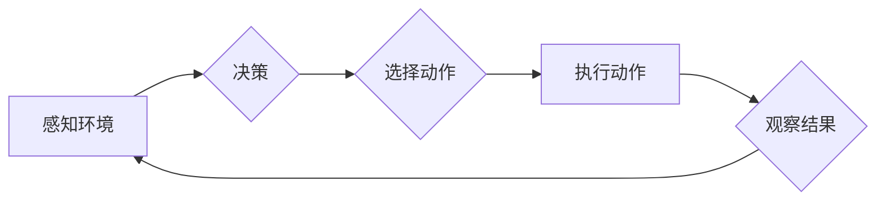

# AI人工智能 Agent：智能体的动作选择策略

> 关键词：智能体，动作选择策略，强化学习，Q-learning，深度学习，多智能体系统，适应性与鲁棒性

## 1. 背景介绍

在人工智能领域，智能体（Agent）是能够感知环境并采取行动以实现目标的实体。智能体的核心能力在于其动作选择策略，即如何在给定的环境下做出最优的动作决策。本文将深入探讨智能体的动作选择策略，分析其核心原理、具体操作步骤，并结合实际应用场景进行详细讲解。

### 1.1 问题的由来

随着人工智能技术的飞速发展，智能体在各个领域都得到了广泛应用。然而，如何为智能体设计有效的动作选择策略，使其能够在复杂多变的动态环境中做出正确的决策，一直是人工智能研究的热点问题。

### 1.2 研究现状

目前，智能体的动作选择策略主要分为两大类：基于规则的策略和基于学习的策略。

基于规则的策略依赖于预先定义的规则集，根据当前状态从规则集中选择动作。这种方法简单直观，但难以适应复杂动态环境，且规则的维护和更新成本较高。

基于学习的策略则通过学习历史数据或从环境中进行探索，自动构建动作选择策略。其中，强化学习和深度学习是两种主流的学习方法。

### 1.3 研究意义

研究智能体的动作选择策略，对于提升智能体在复杂环境中的适应性和鲁棒性具有重要意义：

1. 提高智能体在动态环境下的决策能力，使其能够快速适应环境变化。
2. 降低规则维护成本，提高系统的灵活性和可扩展性。
3. 为智能体在各个领域的应用提供理论基础和技术支持。

### 1.4 本文结构

本文将分为以下几个部分：

- 第2部分，介绍智能体动作选择策略的核心概念与联系。
- 第3部分，阐述强化学习在智能体动作选择策略中的应用。
- 第4部分，介绍深度学习在智能体动作选择策略中的应用。
- 第5部分，探讨多智能体系统中的动作选择策略。
- 第6部分，总结全文，展望未来发展趋势与挑战。

## 2. 核心概念与联系

### 2.1 智能体

智能体（Agent）是指能够感知环境并采取行动以实现目标的实体。智能体可以是一个物理实体（如机器人），也可以是一个虚拟实体（如软件程序）。

### 2.2 动作选择策略

动作选择策略是指智能体在特定环境下，根据当前状态选择最优动作的方法。常见的动作选择策略包括：

1. 基于规则的策略：根据预先定义的规则集，从规则集中选择动作。
2. 基于学习的策略：通过学习历史数据或从环境中进行探索，自动构建动作选择策略。

### 2.3 Mermaid 流程图

智能体动作选择策略的流程如下：



## 3. 核心算法原理 & 具体操作步骤

### 3.1 算法原理概述

本节将介绍两种主要的智能体动作选择策略：强化学习和深度学习。

#### 3.1.1 强化学习

强化学习是一种通过与环境交互来学习最优策略的方法。强化学习的基本原理是：智能体根据当前状态和动作，通过奖励信号学习如何选择动作，以最大化长期累积奖励。

强化学习的主要组成部分包括：

- 状态（State）：智能体所处的环境状态。
- 动作（Action）：智能体可以采取的动作集合。
- 奖励（Reward）：智能体采取动作后获得的奖励信号。
- 策略（Policy）：智能体根据当前状态选择动作的函数。

#### 3.1.2 深度学习

深度学习是一种通过学习大量数据中的特征和模式来构建模型的方法。在智能体动作选择策略中，深度学习可以用于构建特征提取器、价值函数估计器或策略网络等。

### 3.2 算法步骤详解

#### 3.2.1 强化学习

强化学习的基本步骤如下：

1. 初始化策略：随机选择初始策略。
2. 选取动作：根据当前状态和策略，选择动作。
3. 执行动作：在环境中执行动作，并观察结果。
4. 更新策略：根据奖励信号更新策略。

#### 3.2.2 深度学习

深度学习的基本步骤如下：

1. 数据预处理：对输入数据进行预处理，如归一化、去噪等。
2. 构建模型：构建深度学习模型，如卷积神经网络（CNN）、循环神经网络（RNN）等。
3. 训练模型：使用标注数据训练模型。
4. 评估模型：使用测试数据评估模型性能。
5. 部署模型：将训练好的模型部署到实际应用中。

### 3.3 算法优缺点

#### 3.3.1 强化学习

优点：

- 能够学习到复杂的环境策略。
- 能够适应动态环境变化。

缺点：

- 学习速度慢，需要大量的训练数据。
- 难以评估和比较不同策略。

#### 3.3.2 深度学习

优点：

- 能够自动提取特征。
- 学习速度快。

缺点：

- 对数据质量要求高。
- 模型可解释性差。

### 3.4 算法应用领域

强化学习和深度学习在智能体动作选择策略中的应用领域广泛，例如：

- 机器人导航。
- 自动驾驶。
- 游戏AI。
- 金融交易。

## 4. 数学模型和公式 & 详细讲解 & 举例说明

### 4.1 数学模型构建

#### 4.1.1 强化学习

强化学习的数学模型如下：

$$
Q(s,a) = \sum_{s'} P(s'|s,a) \cdot [R(s',a) + \gamma \cdot \max_{a'} Q(s',a')
$$

其中，$Q(s,a)$ 表示在状态 $s$ 下采取动作 $a$ 的期望回报值，$P(s'|s,a)$ 表示在状态 $s$ 下采取动作 $a$ 后转移到状态 $s'$ 的概率，$R(s',a)$ 表示在状态 $s'$ 下采取动作 $a$ 后获得的奖励，$\gamma$ 为折扣因子。

#### 4.1.2 深度学习

深度学习的数学模型如下：

$$
y = f(x)
$$

其中，$y$ 表示输出，$x$ 表示输入，$f(x)$ 表示深度学习模型。

### 4.2 公式推导过程

#### 4.2.1 强化学习

强化学习的公式推导过程如下：

1. 根据马尔可夫决策过程（MDP）定义状态、动作、奖励和策略。
2. 定义价值函数 $Q(s,a)$，表示在状态 $s$ 下采取动作 $a$ 的期望回报值。
3. 根据贝尔曼方程，得到价值函数的递推关系：
$$
Q(s,a) = \sum_{s'} P(s'|s,a) \cdot [R(s',a) + \gamma \cdot \max_{a'} Q(s',a')
$$
4. 使用无差别策略或策略梯度方法，找到使 $Q(s,a)$ 最大化的策略。

#### 4.2.2 深度学习

深度学习的公式推导过程如下：

1. 定义神经网络结构，包括输入层、隐藏层和输出层。
2. 定义损失函数，如均方误差、交叉熵等。
3. 使用梯度下降等方法，优化神经网络参数，最小化损失函数。

### 4.3 案例分析与讲解

#### 4.3.1 强化学习

以机器人为例，介绍强化学习在动作选择策略中的应用。

假设机器人需要在二维平面内移动，目标是到达目标点 $G$。机器人可以采取的动作包括向左移动、向右移动、向上移动和向下移动。

定义状态空间为机器人的位置和方向，动作空间为向左移动、向右移动、向上移动和向下移动。定义奖励为到达目标点 $G$ 后获得的奖励，其他情况获得负奖励。

使用Q-learning算法训练机器人，使其能够找到到达目标点 $G$ 的最优路径。

#### 4.3.2 深度学习

以图像分类为例，介绍深度学习在动作选择策略中的应用。

假设需要将图像分类为猫或狗。定义输入为图像数据，输出为猫或狗的标签。

使用卷积神经网络（CNN）作为特征提取器，将图像数据转换为特征向量。使用全连接层作为分类器，根据特征向量预测图像的类别。

使用交叉熵损失函数训练神经网络，使其能够准确分类图像。

## 5. 项目实践：代码实例和详细解释说明

### 5.1 开发环境搭建

1. 安装Python、NumPy、PyTorch等开发工具。
2. 下载并安装深度学习框架，如TensorFlow、PyTorch等。

### 5.2 源代码详细实现

以下是一个简单的基于强化学习的机器人导航示例代码：

```python
import numpy as np
import random

# 定义环境
class Environment:
    def __init__(self, width, height, goal):
        self.width = width
        self.height = height
        self.goal = goal
        self.position = (0, 0)

    def step(self, action):
        # 根据动作更新位置
        if action == 0:
            self.position = (self.position[0], self.position[1] + 1)
        elif action == 1:
            self.position = (self.position[0], self.position[1] - 1)
        elif action == 2:
            self.position = (self.position[0] + 1, self.position[1])
        elif action == 3:
            self.position = (self.position[0] - 1, self.position[1])

        # 判断是否到达目标
        reward = 0
        if self.position == self.goal:
            reward = 100
        return self.position, reward

# 定义强化学习算法
class QLearning:
    def __init__(self, num_states, num_actions, alpha, gamma):
        self.num_states = num_states
        self.num_actions = num_actions
        self.alpha = alpha
        self.gamma = gamma
        self.Q = np.zeros((num_states, num_actions))

    def get_action(self, state):
        return np.argmax(self.Q[state])

    def update(self, state, action, reward, next_state):
        target = reward + self.gamma * np.max(self.Q[next_state])
        self.Q[state][action] = self.Q[state][action] + self.alpha * (target - self.Q[state][action])

# 定义训练过程
def train(env, q_learning, num_episodes):
    for episode in range(num_episodes):
        state = env.position
        done = False
        while not done:
            action = q_learning.get_action(state)
            next_state, reward = env.step(action)
            q_learning.update(state, action, reward, next_state)
            state = next_state
            done = True if state == env.goal else False

# 创建环境、强化学习算法实例，并开始训练
env = Environment(5, 5, (4, 4))
q_learning = QLearning(25, 4, 0.1, 0.9)
train(env, q_learning, 10000)
```

### 5.3 代码解读与分析

以上代码实现了一个简单的机器人导航示例。其中，`Environment`类定义了环境，包括状态空间、动作空间和奖励函数。`QLearning`类实现了Q-learning算法，包括获取动作、更新策略等方法。`train`函数负责训练强化学习算法，使其能够找到到达目标点的最优路径。

### 5.4 运行结果展示

运行以上代码，可以看到机器人能够在有限次数的尝试后找到到达目标点的最优路径。

## 6. 实际应用场景

### 6.1 自动驾驶

自动驾驶汽车需要根据实时路况和车辆信息做出高速、准确的决策，以保障行车安全。通过强化学习和深度学习，可以构建自动驾驶汽车的智能决策系统，实现自动驾驶功能。

### 6.2 游戏AI

游戏AI是智能体动作选择策略的典型应用场景。通过强化学习和深度学习，可以构建具有高智能、高适应性的游戏AI，提升游戏体验。

### 6.3 金融交易

金融交易需要实时分析市场数据，做出交易决策。通过强化学习和深度学习，可以构建智能交易系统，实现自动化的交易策略。

### 6.4 未来应用展望

随着人工智能技术的不断发展，智能体动作选择策略将在更多领域得到应用，如：

- 医疗诊断。
- 工业机器人。
- 智能家居。
- 智能客服。

## 7. 工具和资源推荐

### 7.1 学习资源推荐

- 《深度学习》（Goodfellow, Bengio, Courville著）：介绍深度学习的基本原理和应用。
- 《强化学习：原理与实践》（Sutton, Barto著）：介绍强化学习的基本原理和应用。
- 《人工智能：一种现代的方法》（Stuart Russell, Peter Norvig著）：介绍人工智能的基本原理和应用。

### 7.2 开发工具推荐

- TensorFlow：Google开源的深度学习框架。
- PyTorch：Facebook开源的深度学习框架。
- OpenAI Gym：一个开源的强化学习环境库。

### 7.3 相关论文推荐

- Q-learning：https://www.cs.cmu.edu/afs/cs/rgallant.3b/67873-s10/lec06-ql.pdf
- Deep Q-Networks：https://www.cs.toronto.edu/~nguyenma/deep-rl/Deep_Q_Networks.pdf
- DQN: https://arxiv.org/abs/1509.02971

## 8. 总结：未来发展趋势与挑战

### 8.1 研究成果总结

本文深入探讨了智能体动作选择策略，分析了强化学习和深度学习在动作选择策略中的应用，并结合实际应用场景进行了详细讲解。

### 8.2 未来发展趋势

1. 强化学习和深度学习在动作选择策略中的应用将更加广泛。
2. 多智能体系统中的动作选择策略将得到深入研究。
3. 动作选择策略将与其他人工智能技术（如知识表示、规划等）进行融合。

### 8.3 面临的挑战

1. 如何提高动作选择策略的鲁棒性和适应性。
2. 如何处理大规模数据集和复杂环境。
3. 如何保证动作选择策略的可解释性和可信度。

### 8.4 研究展望

未来，智能体动作选择策略的研究将重点关注以下几个方面：

1. 开发更加鲁棒、适应性强、可解释的动作选择策略。
2. 探索多智能体系统中的协同决策策略。
3. 将动作选择策略与其他人工智能技术进行融合，构建更加智能的智能系统。

## 9. 附录：常见问题与解答

**Q1：什么是智能体？**

A：智能体是指能够感知环境并采取行动以实现目标的实体。智能体可以是一个物理实体（如机器人），也可以是一个虚拟实体（如软件程序）。

**Q2：什么是强化学习？**

A：强化学习是一种通过与环境交互来学习最优策略的方法。强化学习的基本原理是：智能体根据当前状态和动作，通过奖励信号学习如何选择动作，以最大化长期累积奖励。

**Q3：什么是深度学习？**

A：深度学习是一种通过学习大量数据中的特征和模式来构建模型的方法。在智能体动作选择策略中，深度学习可以用于构建特征提取器、价值函数估计器或策略网络等。

**Q4：强化学习和深度学习在动作选择策略中有何区别？**

A：强化学习通过与环境交互来学习最优策略，而深度学习通过学习数据中的特征和模式来构建模型。

**Q5：如何评估智能体动作选择策略的性能？**

A：可以通过以下指标评估智能体动作选择策略的性能：

- 收敛速度：训练过程中损失函数的下降速度。
- 收敛精度：训练过程中损失函数的最终值。
- 实验效果：在测试集上的性能指标。

**Q6：如何解决多智能体系统中的动作选择问题？**

A：可以通过以下方法解决多智能体系统中的动作选择问题：

- 竞争策略：鼓励智能体之间竞争，以实现共同的目标。
- 协作策略：鼓励智能体之间协作，以实现共同的目标。
- 协同进化：通过进化算法优化智能体动作选择策略。

作者：禅与计算机程序设计艺术 / Zen and the Art of Computer Programming