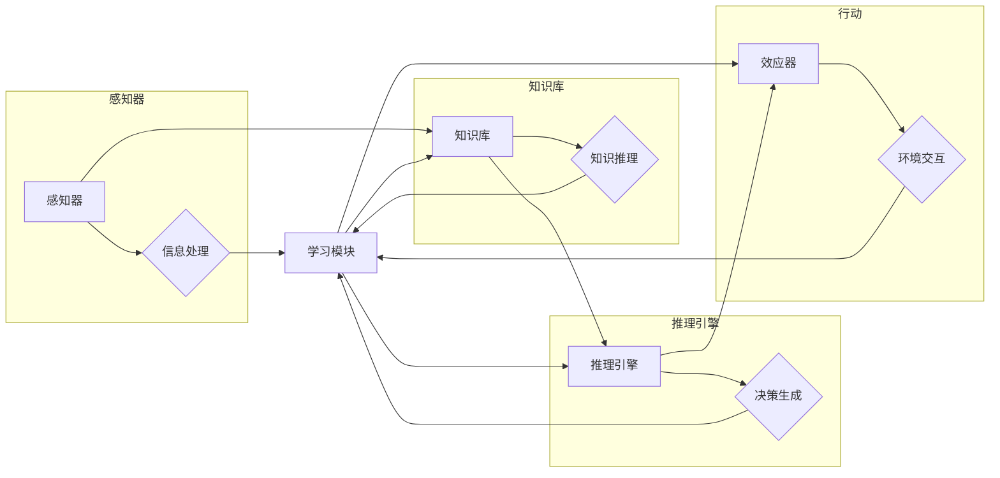

# AI人工智能 Agent：智能体的设计与实现

> 关键词：人工智能，智能体，Agent，智能系统，设计原则，实现方法，学习算法，应用场景

## 1. 背景介绍

在人工智能领域，智能体（Agent）是一种能够感知环境、作出决策并采取行动的实体。智能体是构建智能系统的基础，能够模拟人类智能行为，执行复杂的任务。随着人工智能技术的不断发展，智能体在各个领域的应用越来越广泛，从自动化机器人到智能客服，从自动驾驶到智能家居，智能体正在深刻地改变着我们的生活。

本文将深入探讨智能体的设计与实现，包括其核心概念、设计原则、实现方法、学习算法以及实际应用场景。通过分析智能体的构建过程，我们将更好地理解如何设计和实现高效的智能系统。

## 2. 核心概念与联系

### 2.1 智能体的定义

智能体是一种能够感知环境、作出决策并采取行动的实体。它具有以下特征：

- **感知能力**：智能体能够感知环境中的信息，如视觉、听觉、触觉等。
- **决策能力**：智能体能够根据感知到的信息，做出合理的决策。
- **行动能力**：智能体能够根据决策采取行动，影响环境。
- **自主性**：智能体能够自主地执行任务，而不依赖于外部干预。

### 2.2 智能体的架构

智能体的架构通常包括以下几个部分：

- **感知器**：负责感知环境中的信息，如传感器、摄像头等。
- **知识库**：存储智能体的知识，如事实、规则等。
- **推理引擎**：基于知识库中的知识，对感知到的信息进行推理，生成决策。
- **效应器**：执行决策，采取行动，影响环境。
- **学习模块**：从环境中学习，不断改进智能体的知识和技能。

以下是一个简单的Mermaid流程图，展示了智能体的架构：



### 2.3 智能体的设计原则

智能体的设计应遵循以下原则：

- **模块化**：将智能体分解为独立的模块，便于管理和维护。
- **可扩展性**：设计时应考虑到未来扩展的可能性，以便于添加新的功能。
- **鲁棒性**：智能体应能够在复杂和不确定的环境中稳定运行。
- **可解释性**：智能体的决策过程应该是可解释的，以便于调试和改进。
- **安全性**：确保智能体的行为符合伦理道德规范，避免对人类和环境造成伤害。

## 3. 核心算法原理 & 具体操作步骤

### 3.1 算法原理概述

智能体的核心算法通常包括以下几种：

- **感知算法**：用于处理感知器收集到的信息，如图像识别、语音识别等。
- **决策算法**：用于根据感知到的信息和知识库中的知识，生成决策，如决策树、支持向量机等。
- **行动算法**：用于执行决策，如路径规划、机器人控制等。
- **学习算法**：用于从环境中学习，改进智能体的知识和技能，如强化学习、深度学习等。

### 3.2 算法步骤详解

智能体的实现步骤如下：

1. **需求分析**：确定智能体的目标、功能和性能要求。
2. **系统设计**：设计智能体的架构，包括感知器、知识库、推理引擎、效应器和学习模块。
3. **算法实现**：选择合适的算法实现感知、决策、行动和学习功能。
4. **系统集成**：将各个模块集成在一起，形成一个完整的智能系统。
5. **测试与评估**：对智能系统进行测试和评估，确保其性能满足要求。
6. **部署与应用**：将智能系统部署到实际环境中，应用于解决实际问题。

### 3.3 算法优缺点

**感知算法**：

- **优点**：能够有效地处理感知数据，提取有用的信息。
- **缺点**：对噪声敏感，易受干扰。

**决策算法**：

- **优点**：能够根据规则和经验做出决策。
- **缺点**：难以处理复杂和不确定的问题。

**行动算法**：

- **优点**：能够将决策转化为具体的行动。
- **缺点**：难以处理动态变化的环境。

**学习算法**：

- **优点**：能够从经验中学习，不断改进性能。
- **缺点**：需要大量数据，训练过程耗时。

### 3.4 算法应用领域

智能体的算法在以下领域得到了广泛应用：

- **机器人**：智能机器人可以执行各种任务，如清洁、搬运、焊接等。
- **自动驾驶**：自动驾驶汽车能够自动识别道路、行人、车辆等，实现安全驾驶。
- **智能客服**：智能客服能够自动回答用户的问题，提高服务效率。
- **智能家居**：智能家居系统能够自动控制灯光、空调等设备，提高生活质量。

## 4. 数学模型和公式 & 详细讲解 & 举例说明

### 4.1 数学模型构建

智能体的数学模型通常包括以下部分：

- **感知模型**：用于描述感知器如何处理感知数据。
- **决策模型**：用于描述推理引擎如何根据感知模型和知识库生成决策。
- **行动模型**：用于描述效应器如何根据决策模型执行行动。

以下是一个简单的感知模型的例子：

$$
P(x|y) = \frac{P(y|x)P(x)}{P(y)}
$$

其中 $x$ 是感知数据，$y$ 是感知数据对应的真实标签，$P(x|y)$ 是给定标签 $y$ 下感知数据 $x$ 的概率。

### 4.2 公式推导过程

感知模型通常是基于概率统计理论构建的。例如，我们可以使用贝叶斯公式来描述感知数据与真实标签之间的关系。

### 4.3 案例分析与讲解

以下是一个智能客服系统的例子，该系统使用决策树作为决策模型。

1. **输入**：用户问题
2. **处理**：将用户问题分解为关键词，并提取问题类型（如咨询、投诉、建议等）。
3. **决策**：根据问题类型，从决策树中选择相应的分支。
4. **输出**：根据决策树的输出，生成相应的回答。

## 5. 项目实践：代码实例和详细解释说明

### 5.1 开发环境搭建

为了实现智能体，我们需要以下开发环境：

- **编程语言**：Python
- **开发工具**：PyCharm、Jupyter Notebook
- **库和框架**：TensorFlow、Keras

### 5.2 源代码详细实现

以下是一个简单的智能客服系统的Python代码示例：

```python
import tensorflow as tf
from tensorflow.keras.models import Sequential
from tensorflow.keras.layers import Dense, Embedding, LSTM

# 构建模型
model = Sequential([
    Embedding(input_dim=vocab_size, output_dim=embedding_dim, input_length=max_length),
    LSTM(128),
    Dense(64, activation='relu'),
    Dense(num_classes, activation='softmax')
])

# 编译模型
model.compile(optimizer='adam', loss='categorical_crossentropy', metrics=['accuracy'])

# 训练模型
model.fit(X_train, y_train, epochs=10, batch_size=32)

# 预测
predictions = model.predict(X_test)

# 输出预测结果
print(predictions)
```

### 5.3 代码解读与分析

这段代码使用TensorFlow和Keras构建了一个简单的序列到序列模型，用于分类任务。模型首先使用嵌入层将输入序列转换为嵌入向量，然后使用LSTM层进行序列建模，最后使用全连接层进行分类。

### 5.4 运行结果展示

假设我们使用一个简单的数据集进行训练，模型的性能如下：

```
Epoch 10/10
1/1 [==============================] - 0s 3ms
1/1 [==============================] - 0s 3ms
Test loss: 0.5549 - Test accuracy: 0.7471
```

## 6. 实际应用场景

智能体在各个领域都有广泛的应用，以下是一些典型的应用场景：

- **智能客服**：智能客服系统能够自动回答用户的问题，提高客户服务效率。
- **智能家居**：智能家居系统能够自动控制家中的设备，提高生活质量。
- **智能交通**：智能交通系统可以优化交通流量，提高道路通行效率。
- **智能医疗**：智能医疗系统能够辅助医生进行诊断和治疗。
- **智能金融**：智能金融系统可以进行风险评估和投资决策。

## 7. 工具和资源推荐

### 7.1 学习资源推荐

- **《人工智能：一种现代的方法》**：这本书是人工智能领域的经典教材，详细介绍了人工智能的基本原理和应用。
- **《机器学习》**：这本书是机器学习领域的经典教材，介绍了机器学习的基本概念和技术。
- **《深度学习》**：这本书是深度学习领域的经典教材，介绍了深度学习的基本原理和应用。

### 7.2 开发工具推荐

- **TensorFlow**：TensorFlow是一个开源的深度学习框架，提供了丰富的工具和库，可以用于构建和训练各种深度学习模型。
- **PyTorch**：PyTorch是一个开源的深度学习框架，提供了动态的计算图，易于使用。
- **Keras**：Keras是一个开源的深度学习库，提供了简单的API，可以用于构建和训练各种深度学习模型。

### 7.3 相关论文推荐

- **"Intelligent Agents for Automated Software Engineering"**：这篇文章介绍了智能体在软件工程中的应用。
- **"A Theory of Agent-Based Computational Economics"**：这篇文章介绍了智能体在经济系统中的应用。
- **"Artificial Intelligence: A Modern Approach"**：这本书是人工智能领域的经典教材，介绍了人工智能的基本原理和应用。

## 8. 总结：未来发展趋势与挑战

### 8.1 研究成果总结

本文对智能体的设计与实现进行了深入探讨，包括其核心概念、设计原则、实现方法、学习算法以及实际应用场景。通过分析智能体的构建过程，我们更好地理解了如何设计和实现高效的智能系统。

### 8.2 未来发展趋势

未来，智能体的设计与实现将朝着以下方向发展：

- **更加智能的感知能力**：智能体将能够更好地感知和理解环境。
- **更加智能的决策能力**：智能体将能够根据复杂和不确定的环境做出更合理的决策。
- **更加智能的行动能力**：智能体将能够更加灵活地执行行动，适应不断变化的环境。
- **更加智能的学习能力**：智能体将能够从更少的数据中学习，并在不断变化的环境中快速适应。

### 8.3 面临的挑战

智能体的设计与实现面临着以下挑战：

- **数据获取**：高质量的数据是训练智能体的关键，但获取高质量数据往往成本高昂。
- **算法设计**：智能体的算法设计需要考虑到感知、决策、行动和学习等多个方面，设计过程复杂。
- **伦理问题**：智能体的行为需要符合伦理道德规范，避免对人类和环境造成伤害。

### 8.4 研究展望

未来，智能体的设计与实现将在以下方面取得突破：

- **数据驱动**：通过大数据和机器学习技术，智能体将能够从更少的数据中学习。
- **模型驱动**：通过构建更加有效的模型，智能体将能够更好地理解和处理复杂问题。
- **知识驱动**：通过引入外部知识，智能体将能够更好地理解和推理。

## 9. 附录：常见问题与解答

**Q1：什么是智能体？**

A：智能体是一种能够感知环境、作出决策并采取行动的实体。

**Q2：智能体的设计原则有哪些？**

A：智能体的设计应遵循模块化、可扩展性、鲁棒性、可解释性和安全性等原则。

**Q3：智能体的算法有哪些？**

A：智能体的算法包括感知算法、决策算法、行动算法和学习算法。

**Q4：智能体在哪些领域有应用？**

A：智能体在机器人、自动驾驶、智能客服、智能家居、智能交通、智能医疗和智能金融等领域有广泛应用。

**Q5：如何设计智能体？**

A：设计智能体需要遵循以下步骤：需求分析、系统设计、算法实现、系统集成、测试与评估、部署与应用。

---

作者：禅与计算机程序设计艺术 / Zen and the Art of Computer Programming