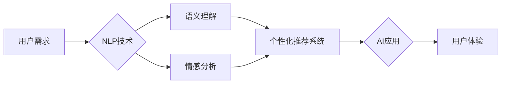

# AI技术与用户需求的匹配

> 关键词：人工智能，用户需求，匹配算法，自然语言处理，个性化推荐，人机交互

## 1. 背景介绍

随着人工智能技术的飞速发展，AI应用已深入到我们生活的方方面面。从智能家居到智能客服，从在线教育到医疗诊断，AI技术在提高效率、优化体验等方面发挥着越来越重要的作用。然而，AI技术的广泛应用也引发了一个关键问题：如何确保AI系统真正满足用户需求，实现技术与需求的精准匹配？

本文将探讨AI技术与用户需求的匹配问题，分析匹配的原理、方法、挑战以及未来发展趋势。

## 2. 核心概念与联系

### 2.1 核心概念

**人工智能**：人工智能（Artificial Intelligence，AI）是指使机器能够模拟、延伸和扩展人的智能的理论、方法、技术及应用系统。

**用户需求**：用户需求是指用户在使用产品或服务时，期望得到的功能、性能、体验等方面的要求。

**匹配算法**：匹配算法是指将用户需求与AI技术进行映射，找到最合适的解决方案的算法。

**自然语言处理（NLP）**：自然语言处理是人工智能的一个分支，旨在使计算机能够理解、解释和生成人类语言。

**个性化推荐**：个性化推荐是根据用户的历史行为、兴趣、偏好等信息，向用户推荐其可能感兴趣的内容或产品。

**人机交互**：人机交互是指人与计算机之间的交互，包括语音交互、图形交互、手势交互等。

### 2.2 核心概念联系



如图所示，用户需求通过NLP技术转化为语义和情感信息，进而驱动个性化推荐系统，最终实现AI应用和提升用户体验。

## 3. 核心算法原理 & 具体操作步骤

### 3.1 算法原理概述

AI技术与用户需求的匹配，主要依赖于以下核心算法：

1. **语义理解**：通过NLP技术，将用户需求转化为计算机可理解的语义表示。
2. **情感分析**：识别用户需求中的情感倾向，如正面、负面或中性。
3. **个性化推荐**：根据用户的历史行为、兴趣、偏好等信息，为用户推荐最合适的解决方案。

### 3.2 算法步骤详解

1. **数据收集与预处理**：收集用户数据，包括用户画像、历史行为、评论、反馈等，并进行数据清洗、去重、归一化等预处理操作。
2. **特征提取**：从用户数据中提取关键特征，如关键词、语义向量、情感向量等。
3. **模型训练**：使用机器学习算法（如深度学习、聚类、关联规则等）训练推荐模型。
4. **推荐结果评估**：评估推荐结果的质量，如点击率、转化率、满意度等。
5. **模型优化**：根据评估结果，不断优化模型参数和推荐策略。

### 3.3 算法优缺点

**优点**：

- 提高用户满意度，提升用户体验。
- 优化资源配置，提高服务效率。
- 促进业务增长，创造更多价值。

**缺点**：

- 数据收集与处理难度大。
- 模型训练时间长，计算资源消耗大。
- 用户隐私保护问题。

### 3.4 算法应用领域

- **个性化推荐**：电商、新闻、音乐、视频、社交等领域的个性化推荐。
- **智能客服**：为用户提供个性化服务，提高客服效率。
- **智能搜索**：根据用户需求，提供更精准的搜索结果。
- **智能医疗**：辅助医生诊断、治疗，提高医疗质量。
- **智能教育**：根据学生学习情况，提供个性化学习方案。

## 4. 数学模型和公式 & 详细讲解 & 举例说明

### 4.1 数学模型构建

假设用户需求可表示为一个向量 $\mathbf{d} \in \mathbb{R}^n$，AI技术可表示为一个向量 $\mathbf{t} \in \mathbb{R}^n$，则匹配度可表示为：

$$
M(\mathbf{d}, \mathbf{t}) = \mathbf{d} \cdot \mathbf{t}
$$

其中，$\cdot$ 表示向量点积运算。

### 4.2 公式推导过程

- 将用户需求表示为词袋模型，得到词频向量 $\mathbf{d}$。
- 将AI技术表示为词嵌入向量，得到技术向量 $\mathbf{t}$。
- 计算词频向量和词嵌入向量的点积，得到匹配度。

### 4.3 案例分析与讲解

假设用户需求是“想看一部关于科幻的电影”，将需求分解为关键词“科幻”和“电影”，对应的词频向量为 $\mathbf{d} = [0, 1, 0, 0, 0, 1, 0, 0]$。将电影领域的词嵌入向量表示为 $\mathbf{t} = [0.1, 0.2, 0.3, 0.4, 0.5, 0.6, 0.7, 0.8]$，则匹配度为：

$$
M(\mathbf{d}, \mathbf{t}) = [0, 1, 0, 0, 0, 1, 0, 0] \cdot [0.1, 0.2, 0.3, 0.4, 0.5, 0.6, 0.7, 0.8] = 0.9
$$

匹配度越高，表示用户需求与AI技术的匹配程度越好。

## 5. 项目实践：代码实例和详细解释说明

### 5.1 开发环境搭建

- 安装Python环境。
- 安装NLP库（如NLTK、spaCy、jieba）。
- 安装机器学习库（如scikit-learn、TensorFlow）。

### 5.2 源代码详细实现

以下使用scikit-learn库实现一个简单的文本分类模型，用于匹配用户需求与AI技术。

```python
from sklearn.feature_extraction.text import CountVectorizer
from sklearn.naive_bayes import MultinomialNB
from sklearn.pipeline import Pipeline

# 用户需求文本
需求文本 = ["我想看一部关于科幻的电影", "我需要一款智能家居设备", "我想学一门编程语言"]

# 构建特征提取器
vectorizer = CountVectorizer()

# 构建分类器
分类器 = MultinomialNB()

# 创建流水线
pipeline = Pipeline([('vectorizer', vectorizer), ('分类器', 分类器)])

# 训练模型
模型 = pipeline.fit(需求文本)

# 输入新需求文本
新需求文本 = "我想看一部科幻电影"

# 预测结果
预测结果 = 模型.predict([新需求文本])

print("匹配的AI技术：", 预测结果)
```

### 5.3 代码解读与分析

1. 导入必要的库。
2. 定义用户需求文本。
3. 创建特征提取器和分类器。
4. 创建流水线，将特征提取器和分类器串联起来。
5. 使用用户需求文本训练模型。
6. 输入新需求文本，预测匹配的AI技术。

## 6. 实际应用场景

### 6.1 个性化推荐

在电商、新闻、音乐、视频等领域，个性化推荐系统可以帮助用户发现感兴趣的内容，提高用户粘性。

### 6.2 智能客服

智能客服可以根据用户的提问，自动提供相关帮助，提高客服效率。

### 6.3 智能搜索

智能搜索可以根据用户的搜索意图，提供更精准的搜索结果。

### 6.4 智能医疗

智能医疗可以根据患者的症状和病史，辅助医生进行诊断。

### 6.5 智能教育

智能教育可以根据学生的学习情况，提供个性化的学习方案。

## 7. 工具和资源推荐

### 7.1 学习资源推荐

- 《Python机器学习》
- 《深度学习》
- 《自然语言处理原理与Python实现》

### 7.2 开发工具推荐

- Python
- Scikit-learn
- TensorFlow
- spaCy
- jieba

### 7.3 相关论文推荐

- Deep Learning for Natural Language Processing (2018)
- Factorization Machines (2010)
- The Matrix Factorization Techniques for Recommender Systems (2006)

## 8. 总结：未来发展趋势与挑战

### 8.1 研究成果总结

本文探讨了AI技术与用户需求的匹配问题，分析了匹配的原理、方法、挑战以及未来发展趋势。通过NLP技术、个性化推荐和人机交互等手段，可以实现AI技术与用户需求的精准匹配，提升用户体验。

### 8.2 未来发展趋势

- **多模态融合**：将文本、图像、音频等多模态信息融合，实现更全面的需求理解。
- **深度学习**：使用深度学习技术，提高匹配精度和效率。
- **个性化推荐**：根据用户行为和偏好，提供更加个性化的推荐。
- **人机交互**：优化人机交互体验，提高用户满意度。

### 8.3 面临的挑战

- **数据质量**：高质量的数据是匹配的基础，需要解决数据质量问题。
- **模型可解释性**：提高模型的可解释性，增强用户信任。
- **隐私保护**：保护用户隐私，避免数据泄露。

### 8.4 研究展望

未来，AI技术与用户需求的匹配将是一个持续发展的研究领域。通过技术创新和探索，我们可以构建更加智能、个性化的AI系统，为用户提供更加优质的服务。

## 9. 附录：常见问题与解答

**Q1：如何提高AI技术与用户需求的匹配度？**

A：提高AI技术与用户需求的匹配度，可以从以下几个方面入手：

- 提高数据质量，包括数据清洗、去重、归一化等。
- 使用更先进的算法，如深度学习、强化学习等。
- 优化模型参数，提高模型精度。
- 考虑用户反馈，不断改进系统。

**Q2：如何处理用户隐私保护问题？**

A：处理用户隐私保护问题，可以从以下几个方面入手：

- 数据脱敏：对敏感数据进行脱敏处理，如匿名化、去标识化等。
- 加密传输：使用加密技术保护数据传输安全。
- 访问控制：设置权限，限制用户访问敏感数据。

**Q3：如何评估AI技术与用户需求的匹配效果？**

A：评估AI技术与用户需求的匹配效果，可以从以下几个方面入手：

- 点击率：用户点击推荐内容的比例。
- 转化率：用户转化为实际用户的比例。
- 满意度：用户对服务的满意度。
- 持续性：用户对服务的长期使用意愿。

作者：禅与计算机程序设计艺术 / Zen and the Art of Computer Programming