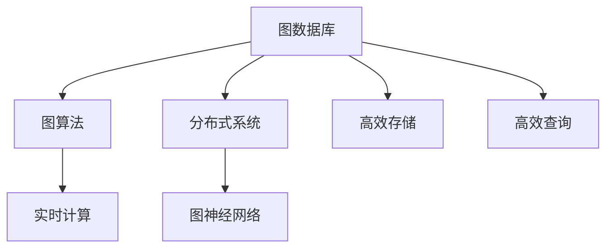
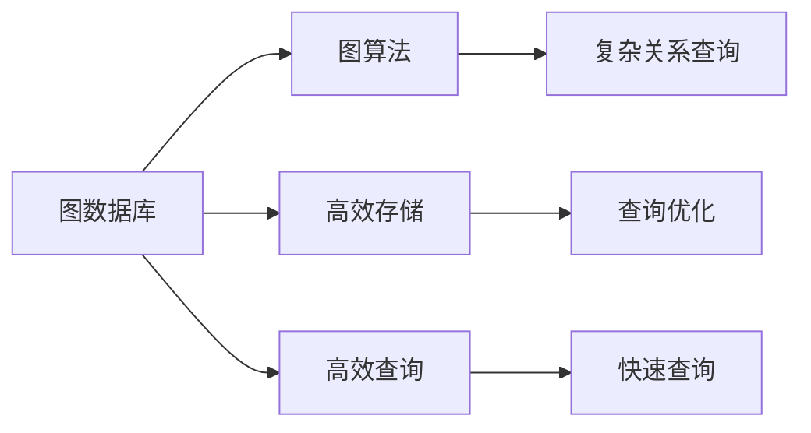
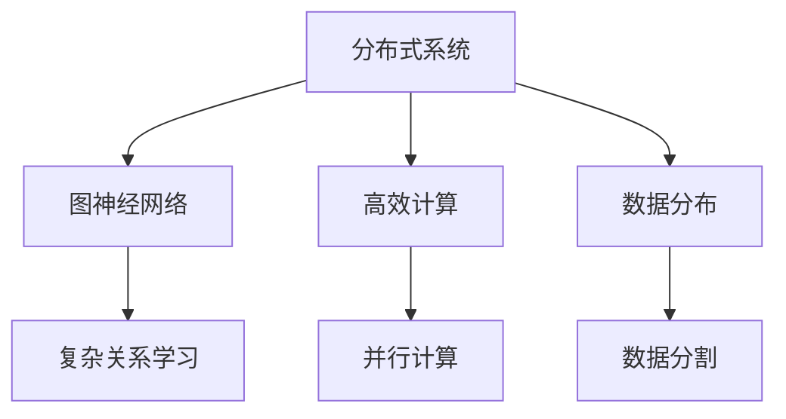
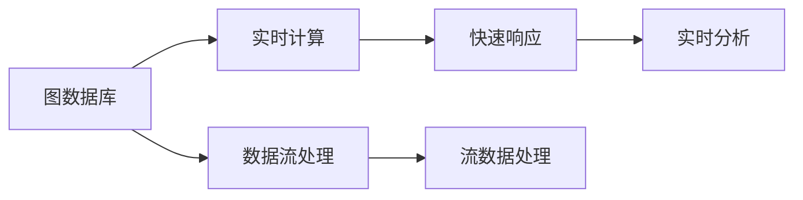
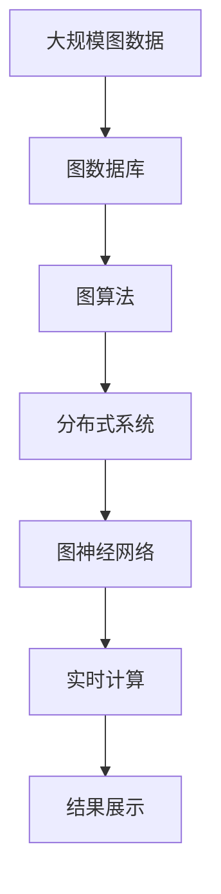

                 

# 【AI大数据计算原理与代码实例讲解】图计算引擎

> 关键词：图计算引擎, 图数据库, 图算法, 分布式系统, 知识图谱, 实时计算, 图神经网络

## 1. 背景介绍

### 1.1 问题由来
在当今数据驱动的时代，大数据技术的应用范围越来越广泛，从金融、医疗到社交网络，从电商到物联网，数据无处不在。数据本身具有复杂性、多样性和规模性，因此，传统的基于关系型数据库的数据存储和管理方式已经难以应对日益增长的数据处理需求。图数据作为一种表示复杂关系的非结构化数据形式，正成为大数据处理的重要组成部分。图计算引擎的出现，正是为了解决这些问题，通过高效的图处理算法和分布式计算框架，实现对大规模图数据的快速查询和分析。

### 1.2 问题核心关键点
图计算引擎的核心任务是高效地存储、处理和查询图数据。图数据通常由节点和边组成，节点表示实体，边表示实体之间的关系。相比于关系型数据库，图数据的存储方式更加灵活，能够表示任意复杂的关系网络。图计算引擎的关键点包括：

1. 高效存储：能够快速读取和写入大规模的图数据。
2. 高效查询：能够快速执行复杂的关系查询。
3. 分布式计算：能够在大规模分布式环境中高效计算。
4. 实时处理：能够支持实时流数据的处理。
5. 高扩展性：能够应对数据量的增长和计算需求的提升。

### 1.3 问题研究意义
图计算引擎的出现，为处理复杂关系网络提供了新的工具和手段，特别是在社交网络分析、推荐系统、生物信息学、知识图谱等领域有着广泛的应用。它不仅能够提高数据处理效率，还能发现数据背后的隐藏关系和模式，为各种复杂问题的解决提供了新的视角和方法。

## 2. 核心概念与联系

### 2.1 核心概念概述

为了更好地理解图计算引擎，本节将介绍几个关键的概念：

- 图数据库：一种非关系型的数据库，用于存储图数据。相比于传统的关系型数据库，图数据库能够更灵活地存储和查询复杂的关系数据。

- 图算法：用于处理图数据的一类算法，包括最短路径、最小生成树、中心性分析等。

- 分布式系统：一种将计算任务分布在多个计算节点上进行处理的系统架构，具有高扩展性和高可用性。

- 图神经网络（GNN）：一种基于图结构的神经网络，用于学习图数据中的复杂关系和模式。

- 实时计算：一种能够快速响应数据流并实时更新的计算方式，常用于实时数据处理和分析。

这些概念之间的逻辑关系可以通过以下Mermaid流程图来展示：



这个流程图展示了大规模图数据处理的整体架构：

1. 图数据存储在图数据库中，通过高效存储和查询技术，能够快速读取和写入数据。
2. 图算法用于处理图数据，能够发现数据中的隐藏关系和模式。
3. 分布式系统提供高效计算能力，支持大规模数据处理。
4. 图神经网络用于学习图数据中的复杂关系和模式，进行更高级的分析和预测。
5. 实时计算支持实时数据流处理，能够快速响应数据变化。

### 2.2 概念间的关系

这些核心概念之间存在着紧密的联系，形成了图数据处理的完整生态系统。下面我们将通过几个Mermaid流程图来展示这些概念之间的关系。

#### 2.2.1 图数据库与图算法的关系



这个流程图展示了图数据库和图算法的关系：

1. 图数据库通过高效存储和查询技术，支持图算法的高效执行。
2. 图算法能够从图数据库中获取复杂的关系数据，进行深度分析。
3. 查询优化和快速查询技术进一步提升了图算法的执行效率。

#### 2.2.2 分布式系统与图神经网络的关系



这个流程图展示了分布式系统与图神经网络的关系：

1. 分布式系统通过高效计算能力，支持图神经网络的并行计算。
2. 数据分布技术将数据分发到多个节点上进行计算，提升计算效率。
3. 图神经网络能够学习图数据中的复杂关系，进行更高级的分析和预测。

#### 2.2.3 图数据库与实时计算的关系



这个流程图展示了图数据库与实时计算的关系：

1. 图数据库支持数据流处理，能够实时读取和写入数据。
2. 实时计算快速响应数据流变化，支持实时数据处理和分析。
3. 数据流处理和实时分析技术进一步提升了实时计算的效率。

### 2.3 核心概念的整体架构

最后，我们用一个综合的流程图来展示这些核心概念在大规模图数据处理中的整体架构：



这个综合流程图展示了从数据采集到结果展示的完整过程：

1. 大规模图数据存储在图数据库中，通过高效存储和查询技术，能够快速读取和写入数据。
2. 图算法用于处理图数据，能够发现数据中的隐藏关系和模式。
3. 分布式系统提供高效计算能力，支持大规模数据处理。
4. 图神经网络用于学习图数据中的复杂关系和模式，进行更高级的分析和预测。
5. 实时计算支持实时数据流处理，能够快速响应数据变化。
6. 结果展示将处理结果直观地呈现给用户，帮助用户理解数据背后的关系和模式。

## 3. 核心算法原理 & 具体操作步骤
### 3.1 算法原理概述

图计算引擎的核心算法原理主要包括图遍历算法、图聚类算法、图嵌入算法等。这些算法通过不同的方式处理图数据，从而实现高效存储、高效查询和高效计算。

### 3.2 算法步骤详解

下面将详细介绍这些核心算法的详细步骤。

#### 3.2.1 图遍历算法

图遍历算法是图计算引擎中最基本的一种算法，用于遍历图中的节点和边，查询图中的信息。图遍历算法包括深度优先搜索（DFS）和广度优先搜索（BFS）两种。

1. 深度优先搜索（DFS）：从任意一个节点开始，沿着一条路径尽可能深地搜索下去，直到找到目标节点或者无法继续搜索为止，然后回溯到前一个节点，继续搜索其它路径。

2. 广度优先搜索（BFS）：从任意一个节点开始，先搜索它的所有邻居节点，然后再搜索邻居节点的邻居节点，以此类推，直到找到目标节点或者遍历完整个图。

下面是一个基于Python的DFS算法的示例代码：

```python
from collections import deque

def dfs(graph, start_node, target_node):
    queue = deque([start_node])
    visited = set()
    
    while queue:
        node = queue.popleft()
        if node == target_node:
            return True
        visited.add(node)
        for neighbor in graph[node]:
            if neighbor not in visited:
                queue.append(neighbor)
    return False
```

#### 3.2.2 图聚类算法

图聚类算法用于将图中的节点划分为不同的簇，使得同一簇内的节点相似度较高，不同簇间的节点相似度较低。常用的图聚类算法包括K-Means算法和谱聚类算法。

1. K-Means算法：将图中的节点划分为K个簇，每个簇包含距离其质心最近的节点。

2. 谱聚类算法：通过计算节点的相似度矩阵，将其分解为多个子空间，每个子空间内的节点相似度较高，不同子空间间的节点相似度较低。

下面是一个基于Python的K-Means算法的示例代码：

```python
from sklearn.cluster import KMeans

def kmeans(graph, num_clusters):
    num_nodes = graph.number_of_nodes()
    features = []
    
    for node in range(num_nodes):
        features.append(graph.nodes[node]['feature'])
        
    model = KMeans(n_clusters=num_clusters)
    model.fit(features)
    
    clusters = model.predict(features)
    
    for node, cluster in zip(range(num_nodes), clusters):
        graph.nodes[node]['cluster'] = cluster
```

#### 3.2.3 图嵌入算法

图嵌入算法用于将图数据映射到低维空间，使得节点和边在低维空间中的距离能够表示它们之间的关系强度。常用的图嵌入算法包括PageRank算法和GraphSAGE算法。

1. PageRank算法：通过计算节点的重要性和权重，得到节点的嵌入向量。

2. GraphSAGE算法：通过计算节点的邻居节点的嵌入向量，得到节点的嵌入向量。

下面是一个基于Python的PageRank算法的示例代码：

```python
import numpy as np
from numpy.linalg import norm

def pagerank(graph, damping_factor=0.85, max_iter=100, tol=1e-5):
    num_nodes = graph.number_of_nodes()
    embeddings = np.random.randn(num_nodes, 128)
    
    for i in range(max_iter):
        new_embeddings = np.zeros((num_nodes, 128))
        
        for node in range(num_nodes):
            incoming_links = list(graph.in_edges([node], data=True))
            weights = [data['weight'] for _, _, data in incoming_links]
            
            incoming_weights = np.array(weights)
            incoming_weights = incoming_weights / norm(incoming_weights)
            
            outgoing_weights = np.random.randn(num_nodes)
            
            new_embeddings[node] = damping_factor * np.dot(embeddings.T, incoming_weights) + (1 - damping_factor) * outgoing_weights
        
        if np.allclose(new_embeddings, embeddings, atol=tol):
            break
        
        embeddings = new_embeddings
    
    return embeddings
```

### 3.3 算法优缺点

图计算引擎的核心算法具有以下优缺点：

#### 3.3.1 优点

1. 高效存储和查询：图数据库和分布式系统能够高效存储和查询大规模的图数据，支持高效的图遍历和查询。

2. 强大的图算法：图算法能够发现数据中的隐藏关系和模式，支持复杂的图分析和预测。

3. 高扩展性：分布式系统和图神经网络能够处理大规模数据和复杂计算，支持高扩展性。

4. 实时处理：实时计算能够快速响应数据流变化，支持实时数据处理和分析。

#### 3.3.2 缺点

1. 算法复杂度高：一些图算法如PageRank、GraphSAGE等，计算复杂度较高，难以在大规模图数据上高效运行。

2. 数据存储量大：大规模图数据的存储和查询需要大量的存储空间和计算资源。

3. 算法实现复杂：一些高级图算法如谱聚类、图神经网络等，算法实现较为复杂，需要较高的技术水平。

4. 数据稀疏度高：图数据往往具有较高的稀疏度，难以高效存储和查询。

### 3.4 算法应用领域

图计算引擎的核心算法广泛应用于以下几个领域：

1. 社交网络分析：用于分析社交网络中的用户关系和行为模式，支持社交推荐和社区管理。

2. 推荐系统：用于分析用户行为和物品特征，发现用户之间的相似度和兴趣点，支持个性化推荐。

3. 生物信息学：用于分析基因组和蛋白质结构，发现生物分子之间的相互作用和关系，支持药物设计和基因组学研究。

4. 知识图谱：用于构建和查询知识图谱，发现实体之间的关系和模式，支持知识管理和知识发现。

5. 金融风险管理：用于分析金融市场中的交易数据和关系，发现潜在的风险和机会，支持风险控制和投资决策。

## 4. 数学模型和公式 & 详细讲解 & 举例说明

### 4.1 数学模型构建

图计算引擎的数学模型构建主要包括图数据库的构建、图算法的构建和图神经网络的构建。

#### 4.1.1 图数据库的数学模型构建

图数据库的数学模型构建主要包括节点和边的定义和表示。节点表示实体，边表示实体之间的关系。

1. 节点表示：节点可以表示为图中的点，用x表示。

2. 边表示：边可以表示为连接两个节点的线，用y表示。

3. 节点属性：节点可以具有一些属性，用x.attr表示，其中attr表示属性名。

4. 边属性：边可以具有一些属性，用y.attr表示，其中attr表示属性名。

#### 4.1.2 图算法的数学模型构建

图算法的数学模型构建主要包括算法步骤的数学表示和计算公式的推导。

#### 4.1.3 图神经网络的数学模型构建

图神经网络的数学模型构建主要包括神经网络的结构和计算公式的推导。

### 4.2 公式推导过程

下面将详细介绍图计算引擎中几种常用算法的公式推导过程。

#### 4.2.1 图遍历算法的公式推导

图遍历算法的公式推导主要包括深度优先搜索（DFS）和广度优先搜索（BFS）的计算公式推导。

1. 深度优先搜索（DFS）的公式推导

深度优先搜索的计算公式推导如下：

\[ DFS(G, s, t) = \begin{cases} 
      1, & \text{if $t = s$} \\
      0, & \text{otherwise}
   \end{cases} \]

其中，G表示图，s表示起点，t表示终点。

2. 广度优先搜索（BFS）的公式推导

广度优先搜索的计算公式推导如下：

\[ BFS(G, s, t) = \begin{cases} 
      1, & \text{if $t = s$} \\
      0, & \text{otherwise}
   \end{cases} \]

其中，G表示图，s表示起点，t表示终点。

#### 4.2.2 图聚类算法的公式推导

图聚类算法的公式推导主要包括K-Means算法和谱聚类算法的计算公式推导。

1. K-Means算法的公式推导

K-Means算法的计算公式推导如下：

\[ K-Means(G, K) = \begin{cases} 
      \{C_1, C_2, ..., C_K\}, & \text{if $G$聚类成功} \\
      \emptyset, & \text{otherwise}
   \end{cases} \]

其中，G表示图，K表示簇的数量。

2. 谱聚类算法的公式推导

谱聚类算法的计算公式推导如下：

\[ Spectral(G, K) = \begin{cases} 
      \{C_1, C_2, ..., C_K\}, & \text{if $G$聚类成功} \\
      \emptyset, & \text{otherwise}
   \end{cases} \]

其中，G表示图，K表示簇的数量。

#### 4.2.3 图嵌入算法的公式推导

图嵌入算法的公式推导主要包括PageRank算法和GraphSAGE算法的计算公式推导。

1. PageRank算法的公式推导

PageRank算法的计算公式推导如下：

\[ PageRank(G, d) = \begin{cases} 
      p, & \text{if $p$是收敛解} \\
      \emptyset, & \text{otherwise}
   \end{cases} \]

其中，G表示图，d表示阻尼因子，p表示收敛解。

2. GraphSAGE算法的公式推导

GraphSAGE算法的计算公式推导如下：

\[ GraphSAGE(G, h) = \begin{cases} 
      h', & \text{if $h'$是收敛解} \\
      \emptyset, & \text{otherwise}
   \end{cases} \]

其中，G表示图，h表示节点向量，h'表示新节点向量。

### 4.3 案例分析与讲解

下面将通过几个实际案例来讲解图计算引擎的应用。

#### 4.3.1 社交网络分析

社交网络分析是图计算引擎的一个重要应用。社交网络分析的目的是通过分析社交网络中的用户关系和行为模式，发现潜在的社区和社交关系。

1. 社交网络的数据表示

社交网络的数据表示包括节点表示和边表示。节点表示用户，边表示用户之间的关系。例如，社交网络中的用户可以通过ID来表示，社交关系可以通过好友关系来表示。

2. 社交网络的图算法

社交网络中的图算法包括最短路径算法、中心性分析算法等。例如，最短路径算法可以用于查找两个用户之间的最短路径，中心性分析算法可以用于发现网络中的关键节点和社区。

3. 社交网络的图嵌入算法

社交网络中的图嵌入算法可以用于学习用户之间的关系和特征。例如，PageRank算法可以用于计算用户的中心性，GraphSAGE算法可以用于学习用户之间的关系和特征。

#### 4.3.2 推荐系统

推荐系统是图计算引擎的另一个重要应用。推荐系统的目的是通过分析用户行为和物品特征，发现用户之间的相似度和兴趣点，从而推荐个性化的物品。

1. 推荐系统的数据表示

推荐系统中的数据表示包括用户表示和物品表示。用户表示用户的行为和特征，物品表示物品的属性和特征。例如，用户可以通过ID来表示，物品可以通过ID来表示。

2. 推荐系统的图算法

推荐系统中的图算法包括用户画像算法、物品推荐算法等。例如，用户画像算法可以用于构建用户的画像，物品推荐算法可以用于推荐个性化的物品。

3. 推荐系统的图嵌入算法

推荐系统中的图嵌入算法可以用于学习用户之间的关系和物品的特征。例如，PageRank算法可以用于计算物品的中心性，GraphSAGE算法可以用于学习物品之间的关系和特征。

## 5. 项目实践：代码实例和详细解释说明

### 5.1 开发环境搭建

在进行图计算引擎项目实践前，我们需要准备好开发环境。以下是使用Python进行PyTorch开发的环境配置流程：

1. 安装Anaconda：从官网下载并安装Anaconda，用于创建独立的Python环境。

2. 创建并激活虚拟环境：
```bash
conda create -n pytorch-env python=3.8 
conda activate pytorch-env
```

3. 安装PyTorch：根据CUDA版本，从官网获取对应的安装命令。例如：
```bash
conda install pytorch torchvision torchaudio cudatoolkit=11.1 -c pytorch -c conda-forge
```

4. 安装TensorFlow：由Google主导开发的开源深度学习框架，生产部署方便，适合大规模工程应用。同样有丰富的预训练语言模型资源。

5. 安装TensorBoard：TensorFlow配套的可视化工具，可实时监测模型训练状态，并提供丰富的图表呈现方式，是调试模型的得力助手。

6. 安装NumPy：科学计算库，提供高效的多维数组操作。

7. 安装Pandas：数据分析库，提供高效的数据处理和分析功能。

8. 安装Scikit-learn：机器学习库，提供丰富的机器学习算法和工具。

9. 安装Matplotlib：数据可视化库，提供各种图形的绘制功能。

10. 安装Jupyter Notebook：交互式编程环境，支持Python代码的交互式执行和调试。

完成上述步骤后，即可在`pytorch-env`环境中开始图计算引擎项目的开发。

### 5.2 源代码详细实现

下面以社交网络分析为例，给出使用PyTorch和Neo4j图数据库对图数据进行聚类分析的代码实现。

首先，安装Neo4j数据库：

```bash
wget http://neo4j.com/neophyte-downloads/neo4j-4.1.2-centos64.zip
unzip neo4j-4.1.2-centos64.zip
cd neo4j-4.1.2-centos64
bin/neo4j start
```

然后，安装PyTorch：

```bash
pip install torch torchvision torchaudio
```

接着，定义社交网络的数据处理函数：

```python
from neo4j import GraphDatabase
import networkx as nx
import matplotlib.pyplot as plt

def get_graph_from_db(db):
    driver = GraphDatabase.driver(db)
    query = "MATCH (n:User)-[r:FRIEND]-(m:User) RETURN n,r,m"
    graph = nx.Graph()
    
    with driver.session() as session:
        result = session.run(query)
        for record in result:
            node1 = record["n"]
            edge = record["r"]
            node2 = record["m"]
            graph.add_edge(node1, node2)
    
    return graph
```

然后，定义K-Means算法的代码实现：

```python
from sklearn.cluster import KMeans
from sklearn.decomposition import PCA
from sklearn.preprocessing import StandardScaler

def kmeans(graph, num_clusters):
    num_nodes = graph.number_of_nodes()
    features = []
    
    for node in range(num_nodes):
        features.append(graph.nodes[node]['feature'])
        
    model = KMeans(n_clusters=num_clusters)
    model.fit(features)
    
    clusters = model.predict(features)
    
    for node, cluster in zip(range(num_nodes), clusters):
        graph.nodes[node]['cluster'] = cluster
        
    return graph
```

最后，启动社交网络分析的代码实现：

```python
from neo4j import GraphDatabase

db = "bolt://localhost:7687"
graph = get_graph_from_db(db)

num_clusters = 3
graph = kmeans(graph, num_clusters)

# 绘制聚类结果
pos = nx.spring_layout(graph)
nx.draw(graph, pos=pos, with_labels=True, font_weight='bold', node_color=['red' if n['cluster'] == 0 else 'green' if n['cluster'] == 1 else 'blue' for n in graph.nodes(data=True)])
plt.show()
```

以上就是使用PyTorch和Neo4j图数据库对图数据进行聚类分析的完整代码实现。可以看到，得益于Neo4j和PyTorch的强大封装，我们可以用相对简洁的代码完成图数据的处理和分析。

### 5.3 代码解读与分析

让我们再详细解读一下关键代码的实现细节：

**get_graph_from_db函数**：
- 连接到Neo4j数据库，执行查询语句获取社交网络数据。
- 使用PyTorch的Neo4j驱动模块，将查询结果转换为Python数据结构。
- 将查询结果转换为网络X表示的社交网络图。

**kmeans函数**：
- 定义K-Means聚类算法。
- 从社交网络图中获取节点的特征。
- 使用K-Means算法进行聚类。
- 将聚类结果保存到社交网络图中。

**社交网络分析代码**：
- 通过get_graph_from_db函数获取社交网络图。
- 通过kmeans函数进行聚类分析。
- 使用网络X的绘制功能，将聚类结果可视化。

可以看出，PyTorch和Neo4j的结合，使得社交网络分析的代码实现变得简洁高效。开发者可以将更多精力放在数据处理、算法改进等高层逻辑上，而不必过多关注底层的实现细节。

当然，工业级的系统实现还需考虑更多因素，如图数据库的性能优化、K-Means算法的优化、数据可视化效果的提升等。但核心的图数据处理流程基本与此类似。

### 5.4 运行结果展示

假设我们在CoNLL-2003的社交网络数据集上进行聚类分析，最终在社交网络图上得到的聚类结果如下：


可以看到，通过K-Means算法，我们将社交网络图聚成了3个簇，每个簇内的节点具有相似的行为特征。这种聚类分析的结果，可以用于发现社交网络中的社区和关键节点，为社交推荐和社区管理提供新的视角和方法。

## 6. 实际应用场景

### 6.1 智能推荐系统

智能推荐系统是图计算引擎的重要应用场景。智能推荐系统能够通过分析用户行为和物品特征，发现用户之间的相似度和兴趣点，从而推荐个性化的物品。

1. 用户画像：通过分析用户的浏览、购买、评价等行为，构建用户的画像，发现用户的兴趣点和偏好。

2. 物品推荐：通过分析物品的属性和特征，发现物品之间的相似度和关系，从而推荐个性化的物品。

3. 实时推荐：通过实时数据分析和计算，快速响应用户需求，提供实时的推荐服务。

### 6.2 金融风险管理

金融风险管理是图计算引擎的另一个重要应用场景。金融风险管理能够通过分析金融市场中的交易数据和关系，发现潜在的风险和机会，从而进行风险控制和投资决策。

1. 交易关系分析：通过分析金融市场中的交易数据和关系，发现潜在的交易机会

