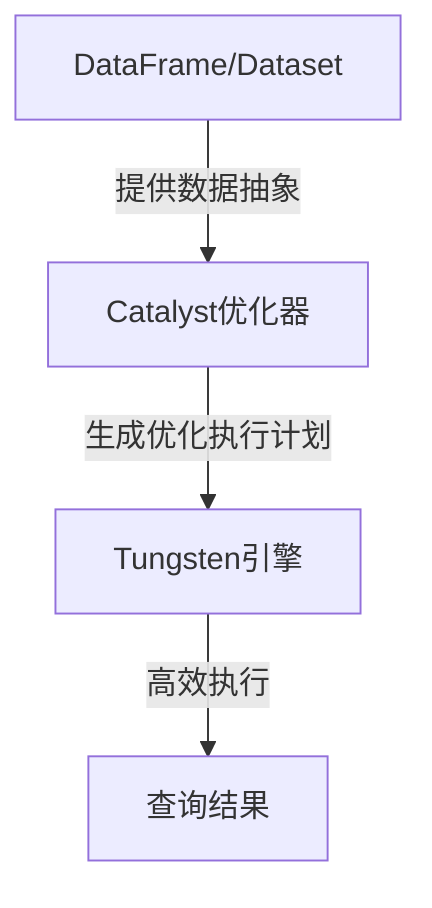

# Spark SQL原理与代码实例讲解

## 1. 背景介绍

### 1.1 问题的由来

在大数据时代,数据量的爆炸式增长对传统的数据处理系统带来了巨大挑战。单机系统由于资源限制,很难满足对海量数据的计算需求。因此,分布式计算框架应运而生,以提供可扩展的大数据处理能力。Apache Spark作为一种通用的分布式计算引擎,凭借其优秀的内存计算性能和丰富的数据处理API,成为大数据领域的佼佼者。

在Spark生态系统中,Spark SQL扮演着至关重要的角色。它为结构化数据(如Hive表、Parquet文件等)提供了高效的查询引擎,支持SQL语法和DataFrame/Dataset API,使得用户可以使用熟悉的方式处理大数据。然而,Spark SQL的内部原理却并非那么直白,其中蕴含着许多优化技术和复杂的执行流程,值得我们深入探讨。

### 1.2 研究现状

目前,已有不少文献和资料介绍了Spark SQL的基本使用方法,但对于其核心原理的解析则相对匮乏。现有的一些资料或过于浅尝辄止,或过于理论化而脱离实践。因此,有必要提供一种兼顾原理和实践的全面解读,帮助读者透彻理解Spark SQL的本质。

### 1.3 研究意义

深入剖析Spark SQL的原理,不仅可以增进我们对大数据处理引擎的认识,还可以帮助我们更高效地使用Spark SQL,写出更优化的代码。此外,了解其内部实现细节,也有助于我们定位和解决潜在的性能瓶颈问题。总的来说,研究Spark SQL原理对于提高数据工程能力至关重要。

### 1.4 本文结构

本文将从以下几个方面全面解读Spark SQL:

1. 核心概念与联系
2. 核心算法原理与具体操作步骤
3. 数学模型和公式详细讲解与案例分析
4. 项目实践:代码实例和详细解释
5. 实际应用场景
6. 工具和资源推荐
7. 总结:未来发展趋势与挑战
8. 附录:常见问题与解答

## 2. 核心概念与联系

在深入Spark SQL原理之前,我们先来了解一些核心概念及其内在联系。

### 2.1 DataFrame & Dataset

DataFrame和Dataset是Spark SQL中处理结构化数据的两种核心数据抽象。它们都提供了一种分布式内存中的不可变数据集合视图。

**DataFrame**是一种以行为单位的分布式数据集,类似于关系数据库中的表。它可以从各种数据源(如Hive表、Parquet文件等)构建,并支持类似SQL的转换操作。DataFrame在内部使用Spark SQL的Catalyst优化器来优化执行计划。

**Dataset**是DataFrame的一种类型安全视图,在DataFrame的基础上增加了对象序列化的支持,使其可以直接操作JVM对象。Dataset在编译时能够捕获数据类型错误,提供了更好的运行时检查。

DataFrame和Dataset之间可以相互转换,它们在内部都由RDD(Resilient Distributed Dataset)表示,并通过Spark SQL引擎执行查询。

### 2.2 Catalyst优化器

Catalyst优化器是Spark SQL的查询优化器,负责将逻辑查询计划转换为高效的物理执行计划。它包含多个优化阶段,如逻辑优化、代码生成优化等,通过一系列规则来重写查询计划,以提高查询性能。

Catalyst优化器的工作流程大致如下:

1. 解析SQL语句,构建初始的逻辑查询计划树。
2. 对逻辑查询计划树进行一系列规则优化,如谓词下推、投影剪裁等。
3. 生成优化后的物理执行计划树。
4. 通过代码生成技术,将物理执行计划编译为高效的Java字节码。
5. 在Spark集群上分布式执行编译后的代码。

Catalyst优化器的优化能力是Spark SQL高效运行的关键所在。

### 2.3 Tungsten引擎

Tungsten引擎是Spark SQL的另一项核心技术,旨在进一步提升内存计算的效率。它包括以下几个主要组件:

- **内存管理层**: 基于Sun Hotspot的内存管理,避免JVM的垃圾回收开销。
- **缓存编解码器**: 支持多种压缩编码格式,高效地编解码内存中的数据。
- **CPU代码生成**: 基于高度优化的Scala内联函数,生成极为高效的字节码。

通过Tungsten引擎,Spark SQL能够充分利用现代硬件的计算能力,达到接近于手写代码的性能水平。

### 2.4 核心组件关系

上述三个核心概念并非孤立存在,它们之间存在紧密的协作关系:

1. DataFrame/Dataset提供了结构化数据的抽象视图。
2. Catalyst优化器对DataFrame/Dataset的逻辑查询计划进行优化。
3. 优化后的物理执行计划由Tungsten引擎高效执行。

它们共同构成了Spark SQL的核心架构,相互配合以实现高性能的结构化数据处理。



## 3. 核心算法原理与具体操作步骤

### 3.1 算法原理概述

Spark SQL的核心算法原理可以概括为**基于规则的查询优化**。具体来说,Catalyst优化器通过一系列规则(规则就是算法)对逻辑查询计划进行等价变换,以生成更高效的物理执行计划。这些规则包括:

- **谓词下推(Predicate Pushdown)**: 将过滤条件尽可能下推到数据源,减少不必要的数据shuffling。
- **投影剪裁(Projection Pruning)**: 只读取查询中需要的列,避免读取整行数据。
- **常量折叠(Constant Folding)**: 在查询编译阶段计算常量表达式的值。
- **联接重排(Join Reorder)**: 根据数据统计信息重新排列联接顺序。
- **...**: 等等其他优化规则。

这些优化规则的有机组合,使得Spark SQL能够为各种查询场景生成近乎最优的执行计划。

### 3.2 算法步骤详解

我们以一个简单的SQL查询为例,具体解释Spark SQL的查询执行流程:

```sql
SELECT dept, sum(salary) AS total_salary
FROM employees
WHERE age > 30
GROUP BY dept;
```

1. **解析SQL语句**

   Spark SQL首先使用ANTLR解析SQL语句,构建出抽象语法树(AST)。AST是一种树状数据结构,用于表示SQL查询的逻辑结构。

2. **构建逻辑查询计划**

   Catalyst优化器将AST转换为逻辑查询计划树,其中包含一系列逻辑操作符,如`Project`、`Filter`、`Aggregate`等。初始的逻辑查询计划树可能并不高效。

3. **逻辑优化阶段**

   Catalyst优化器对逻辑查询计划树应用一系列规则,进行等价变换。例如,它可能将`Filter`操作符下推到`Scan`操作符之前,以减少不必要的数据读取。

4. **生成物理执行计划**

   经过逻辑优化后,Catalyst优化器将优化后的逻辑查询计划树转换为物理执行计划树。物理执行计划树中的操作符对应于Spark的RDD/DataFrame转换操作。

5. **代码生成优化**

   Tungsten引擎将物理执行计划编译为高度优化的Java字节码。这个过程涉及到多种技术,如向量化、循环展开等编译器优化手段。

6. **分布式执行**

   编译后的Java字节码在Spark集群上分布式执行。每个节点运行相应的任务,并通过有效的数据shuffling策略交换中间数据。

7. **返回查询结果**

   最终,查询结果通过`Action`操作(如`collect`或`show`)返回给用户。

上述流程中,逻辑优化和代码生成优化是Spark SQL实现高性能的两大关键。Catalyst优化器保证了生成高效的执行计划,而Tungsten引擎则确保了这些计划的高效执行。

### 3.3 算法优缺点

Spark SQL基于规则的查询优化算法具有以下优点:

- **高度可扩展**: 通过添加新的优化规则,可以不断增强优化能力。
- **查询无关性**: 优化规则对于不同的查询都是通用的,无需针对特定查询进行专门优化。
- **自动化程度高**: 优化过程完全自动化,无需人工干预。

但同时,它也存在一些缺点:

- **规则冲突**: 不同的优化规则之间可能存在冲突,需要合理解决。
- **代价模型依赖**: 某些优化规则(如联接重排)需要依赖代价模型,而代价模型的准确性直接影响优化效果。
- **优化开销**: 复杂查询的优化过程可能会带来较大的开销。

总的来说,Spark SQL的查询优化算法在提供良好的优化能力的同时,也需要权衡优化开销和规则冲突等问题。

### 3.4 算法应用领域

Spark SQL的查询优化算法不仅适用于SQL查询,也可以应用于其他结构化数据处理场景,如DataFrame/Dataset的转换操作。事实上,Catalyst优化器就是在DataFrame/Dataset的RDD lineage上进行等价变换。

此外,基于规则的查询优化思想也被广泛应用于其他大数据处理系统,如Hive、Presto等。因此,深入理解Spark SQL的查询优化算法,对于我们全面掌握大数据处理技术也有重要意义。

## 4. 数学模型和公式详细讲解与举例说明

在查询优化过程中,Catalyst优化器需要评估不同执行计划的代价,以选择最优方案。这就需要构建代价模型,通过公式计算每个操作符的代价。

### 4.1 数学模型构建

我们将查询执行过程抽象为以下几个阶段:

- **读取(Scan)**: 从存储介质(如HDFS)读取数据到内存。
- **传输(Transfer)**: 在集群节点之间传输数据。
- **处理(Process)**: 对内存中的数据执行各种操作,如过滤、聚合等。

每个阶段的代价可以用不同的代价函数表示,然后将它们相加,即可得到整个查询的总代价:

$$
Cost(query) = Cost(scan) + Cost(transfer) + Cost(process)
$$

接下来,我们分别讨论每个阶段的代价模型。

#### 4.1.1 读取代价模型

读取代价主要取决于读取数据的字节数和读取方式(顺序读还是随机读)。我们可以使用如下公式估算读取代价:

$$
Cost(scan) = num\_bytes \times \begin{cases}
    seq\_cost, & \text{if sequential scan}\
    ran\_cost, & \text{if random scan}
\end{cases}
$$

其中:

- $num\_bytes$表示读取的字节数。
- $seq\_cost$和$ran\_cost$分别表示顺序读取和随机读取的单位代价。通常情况下,随机读取的代价要高于顺序读取。

#### 4.1.2 传输代价模型

在分布式环境中,数据常需在节点之间进行传输(shuffling)。传输代价与传输字节数和网络带宽有关,可用如下公式估算:

$$
Cost(transfer) = \frac{num\_bytes}{bandwidth}
$$

其中:

- $num\_bytes$表示传输的字节数。
- $bandwidth$表示集群网络的带宽。

#### 4.1.3 处理代价模型

处理代价取决于具体的操作类型和数据量。我们可以将处理代价建模为操作代价与记录数的乘积:

$$
Cost(process) = \sum_{op} cost(op) \times num\_records(op)
$$

其中:

- $cost(op)$表示操作$op$的单位代价,可以是一个常数或基于操作类型的代价函数。
- $num\_records(op)$表示操作$op$处理的记录数。

对于不同的操作符,如`Filter`、`Join`、`Aggregate`等,我们需要分别建立其代价函数模型。

### 4.2 公