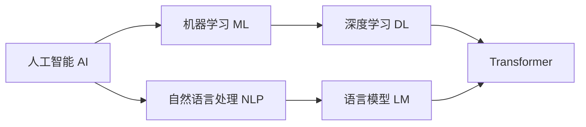

# 【大模型应用开发 动手做AI Agent】说说OpenAI这家公司

## 1. 背景介绍

### 1.1 问题的由来

人工智能(Artificial Intelligence, AI)是计算机科学领域最令人兴奋和充满挑战的分支之一。近年来,随着深度学习等技术的突破和计算能力的提升,AI取得了长足的进步。而在AI领域,OpenAI无疑是当之无愧的佼佼者。它不仅推动了AI技术的发展,更引领了AI应用的潮流。

### 1.2 研究现状

当前,AI技术正处于快速发展阶段,尤其是以Transformer为代表的大语言模型(Large Language Model, LLM)取得了突破性进展。以GPT系列模型为代表的生成式预训练模型展现了惊人的自然语言理解和生成能力。而OpenAI正是这一领域的先驱和引领者。

### 1.3 研究意义

深入了解OpenAI的发展历程、技术路线和应用实践,对于从业者把握AI技术发展脉络,洞察未来趋势,具有重要意义。同时,OpenAI在AI Agent、AI安全等方面的探索,为相关研究提供了宝贵的经验和启示。

### 1.4 本文结构

本文将围绕OpenAI展开论述,内容涵盖OpenAI的发展历程、核心技术、代表性模型、应用实践等方面。通过系统梳理OpenAI的发展脉络,深入剖析其技术内核,展望其未来图景,为读者提供一个全面认识OpenAI的视角。

## 2. 核心概念与联系

在讨论OpenAI之前,有必要先明确几个核心概念:

- 人工智能(Artificial Intelligence, AI):让机器具备类似人类智能的技术,包括感知、推理、决策等能力。
- 机器学习(Machine Learning, ML):让机器通过数据学习获得知识和能力的方法,是实现AI的主要途径。
- 深度学习(Deep Learning, DL):基于神经网络的机器学习方法,善于处理复杂非结构化数据如图像、文本等。
- 自然语言处理(Natural Language Processing, NLP):让机器理解、生成自然语言的技术,是AI的重要分支。
- 语言模型(Language Model, LM):以概率的方式刻画语言规律的模型,是NLP的核心技术之一。
- Transformer:一种基于自注意力机制的神经网络结构,广泛应用于NLP任务。

这些概念环环相扣,共同构成了当前AI发展的技术基础。OpenAI正是立足于此,不断推动AI技术的创新和突破。



## 3. 核心算法原理 & 具体操作步骤

### 3.1 算法原理概述

OpenAI的核心算法主要基于Transformer结构。Transformer采用了自注意力(Self-Attention)机制,让模型能够更好地捕捉输入序列中不同位置之间的依赖关系。同时,Transformer采用了编码器-解码器(Encoder-Decoder)架构,编码器负责对输入进行特征提取,解码器负责根据编码结果生成输出。

### 3.2 算法步骤详解

以GPT系列模型为例,其训练过程可以概括为以下步骤:

1. 数据准备:收集大规模无标注文本语料,进行清洗、分词等预处理。
2. 模型构建:根据Transformer结构搭建神经网络模型,设定模型参数如层数、隐藏层维度等。
3. 预训练:以自回归的方式在大规模语料上训练模型,让模型学习语言的统计规律和知识。
4. 微调:在下游任务的标注数据上微调预训练模型,使其适应具体任务。
5. 推理:利用微调后的模型对新样本进行推理,生成相应输出。

### 3.3 算法优缺点

Transformer及其衍生模型具有以下优点:
- 并行性好,训练速度快。
- 捕捉长距离依赖的能力强。
- 通过预训练可以学习到丰富的语言知识。
- 可以灵活适应不同的下游任务。

但同时也存在一些局限:
- 模型参数量大,对算力要求高。
- 对长文本的建模能力有限。
- 在一些推理任务上可能出现幻觉。
- 难以保证生成内容的可控性。

### 3.4 算法应用领域

基于Transformer的语言模型已经在NLP的各个任务上取得了瞩目成绩,如机器翻译、文本分类、问答系统、对话生成等。OpenAI则进一步将其拓展到了更广阔的应用空间,如代码生成、图像理解、数据分析等。

## 4. 数学模型和公式 & 详细讲解 & 举例说明

### 4.1 数学模型构建

Transformer的核心是自注意力机制。对于输入序列 $X=(x_1,\cdots,x_n)$,自注意力的计算过程可以表示为:

$$
\begin{aligned}
Q &= XW_Q \\
K &= XW_K \\
V &= XW_V \\
\text{Attention}(Q,K,V) &= \text{softmax}(\frac{QK^T}{\sqrt{d_k}})V
\end{aligned}
$$

其中,$Q$,$K$,$V$ 分别是查询(Query)、键(Key)、值(Value),由输入 $X$ 分别乘以权重矩阵 $W_Q$, $W_K$, $W_V$ 得到。$\sqrt{d_k}$ 是缩放因子,用于归一化点积结果。

### 4.2 公式推导过程

Softmax函数用于将点积结果转化为注意力权重:

$$
\text{softmax}(x_i) = \frac{\exp(x_i)}{\sum_j \exp(x_j)}
$$

直观地,自注意力可以理解为一个查询(Query)通过与所有键(Key)计算相似度,得到一个权重分布,然后用该权重对值(Value)进行加权求和。这使得模型能够聚焦于输入序列中与当前位置最相关的部分。

### 4.3 案例分析与讲解

以一个英语-法语的机器翻译任务为例。假设输入为英语句子"I love machine learning",对应的法语翻译为"J'aime l'apprentissage automatique"。在Transformer的编码器中,自注意力允许"learning"这个词去关注与其相关的"machine",从而更好地理解"machine learning"这个短语。而在解码器中,自注意力使得翻译过程中的每个词都能够依赖于之前生成的所有词,从而使翻译更加流畅。

### 4.4 常见问题解答

Q: Transformer相比RNN/LSTM有何优势?
A: Transformer通过自注意力机制实现了并行计算,训练速度更快;同时其捕捉长距离依赖的能力更强,在许多任务上取得了更好的效果。

Q: Self-Attention中的Q,K,V分别代表什么?
A: Q(Query)可以理解为查询向量,K(Key)可以理解为键向量,V(Value)可以理解为值向量。每个位置的Query去与所有位置的Key计算相似度,得到权重分布,然后对Value进行加权求和。

## 5. 项目实践：代码实例和详细解释说明

### 5.1 开发环境搭建

以PyTorch为例,首先需要安装PyTorch及相关依赖:

```bash
pip install torch torchvision torchaudio
```

然后安装transformers库,它提供了许多预训练的Transformer模型:

```bash
pip install transformers
```

### 5.2 源代码详细实现

以下代码展示了如何使用GPT-2模型进行文本生成:

```python
from transformers import GPT2LMHeadModel, GPT2Tokenizer

# 加载预训练的GPT-2模型和分词器
model = GPT2LMHeadModel.from_pretrained('gpt2')
tokenizer = GPT2Tokenizer.from_pretrained('gpt2')

# 设定生成参数
input_text = "Artificial intelligence is"
max_length = 50
num_return_sequences = 3

# 对输入文本进行编码
input_ids = tokenizer.encode(input_text, return_tensors='pt')

# 生成文本
output = model.generate(
    input_ids,
    max_length=max_length,
    num_return_sequences=num_return_sequences,
    no_repeat_ngram_size=2,
    early_stopping=True
)

# 解码并打印生成的文本
for i in range(num_return_sequences):
    print(f"Generated text {i+1}: {tokenizer.decode(output[i], skip_special_tokens=True)}")
```

### 5.3 代码解读与分析

1. 首先加载预训练的GPT-2模型和对应的分词器。
2. 设定生成参数,包括输入文本、最大长度、生成序列数等。
3. 使用分词器对输入文本进行编码,转化为模型可接受的输入格式。
4. 调用模型的generate方法生成文本,可以通过设置参数控制生成策略,如避免重复、提前停止等。
5. 最后使用分词器解码生成的序列,并打印出来。

### 5.4 运行结果展示

运行上述代码,可能得到如下输出:

```
Generated text 1: Artificial intelligence is a rapidly growing field that has the potential to revolutionize many aspects of our lives. From self-driving cars to intelligent virtual assistants, AI is already starting to transform the way we live and work.

Generated text 2: Artificial intelligence is becoming increasingly important in today's world. It has the potential to solve many of the challenges we face, from climate change to healthcare. However, there are also concerns about the impact of AI on jobs and privacy.

Generated text 3: Artificial intelligence is not just a buzzword anymore - it's a reality that is changing the world as we know it. With the rapid advancements in machine learning and deep learning, AI systems are becoming more sophisticated and capable of performing complex tasks that were once thought to be the exclusive domain of humans.
```

可以看到,GPT-2能够根据给定的输入生成流畅、连贯的文本,展现了大语言模型强大的文本生成能力。

## 6. 实际应用场景

OpenAI的技术在许多领域都有广阔的应用前景,例如:

- 智能写作:通过AI自动生成文章、新闻、小说等,提高内容创作效率。
- 代码生成:根据自然语言描述自动生成代码,降低编程门槛。
- 智能客服:通过AI驱动的聊天机器人提供全天候客户服务。
- 知识问答:利用海量知识构建问答系统,提供智能知识服务。
- 数据分析:用AI处理和分析海量数据,挖掘隐藏价值。

### 6.4 未来应用展望

未来,随着AI技术的不断发展,有望在更多领域实现突破和应用,如:

- 药物发现:利用AI加速新药研发,缩短药物上市周期。
- 智能教育:开发个性化的智能教学系统,提供因材施教。
- 自动驾驶:研发更安全、智能的自动驾驶系统,推动智能交通发展。
- 智慧城市:利用AI优化城市管理,提升城市运行效率。

## 7. 工具和资源推荐

### 7.1 学习资源推荐
- 《深度学习》(花书):深度学习领域的经典教材,系统全面地介绍了神经网络的原理和实现。
- 吴恩达的深度学习课程:Coursera上的入门课程,包含视频讲解和编程作业。
- 《Attention is All You Need》:Transformer的原始论文,奠定了其在NLP领域的基础地位。

### 7.2 开发工具推荐
- PyTorch:动态建图的深度学习框架,灵活易用。
- TensorFlow:静态建图的深度学习框架,产业级应用广泛。
- Hugging Face Transformers:基于PyTorch和TensorFlow的自然语言处理库,集成了众多SOTA模型。

### 7.3 相关论文推荐
- 《Language Models are Few-Shot Learners》(GPT-3):OpenAI提出的大规模语言模型,展示了少样本学习的能力。
- 《Language Models are Unsupervised Multitask Learners》(GPT-2):证明了语言模型可以在无监督的情况下完成多种NLP任务。
- 《BERT: Pre-training of Deep Bidirectional Transformers for Language Understanding》:基于Transformer的双向语言表征模型,在多个NLP任务上取得SOTA效果。

### 7.4 其他资源推荐
- OpenAI官网:包含OpenAI的研究成果、博