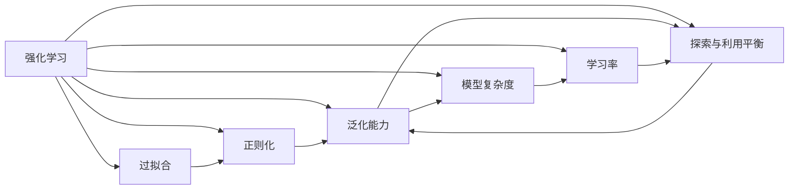
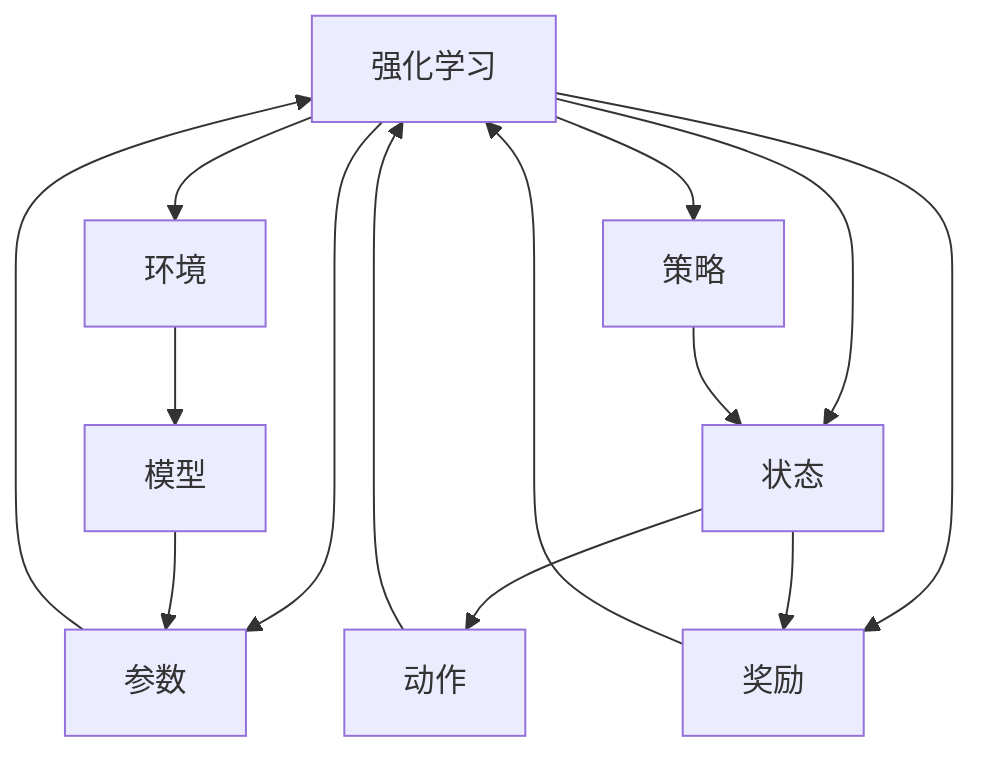
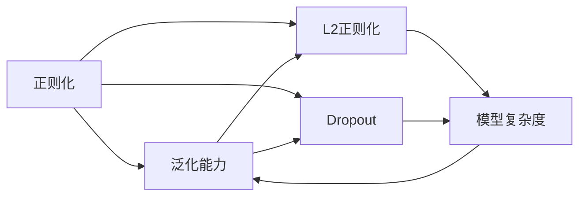
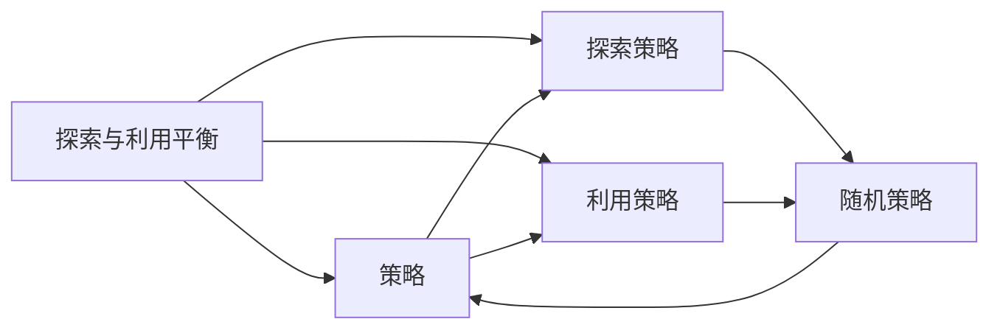
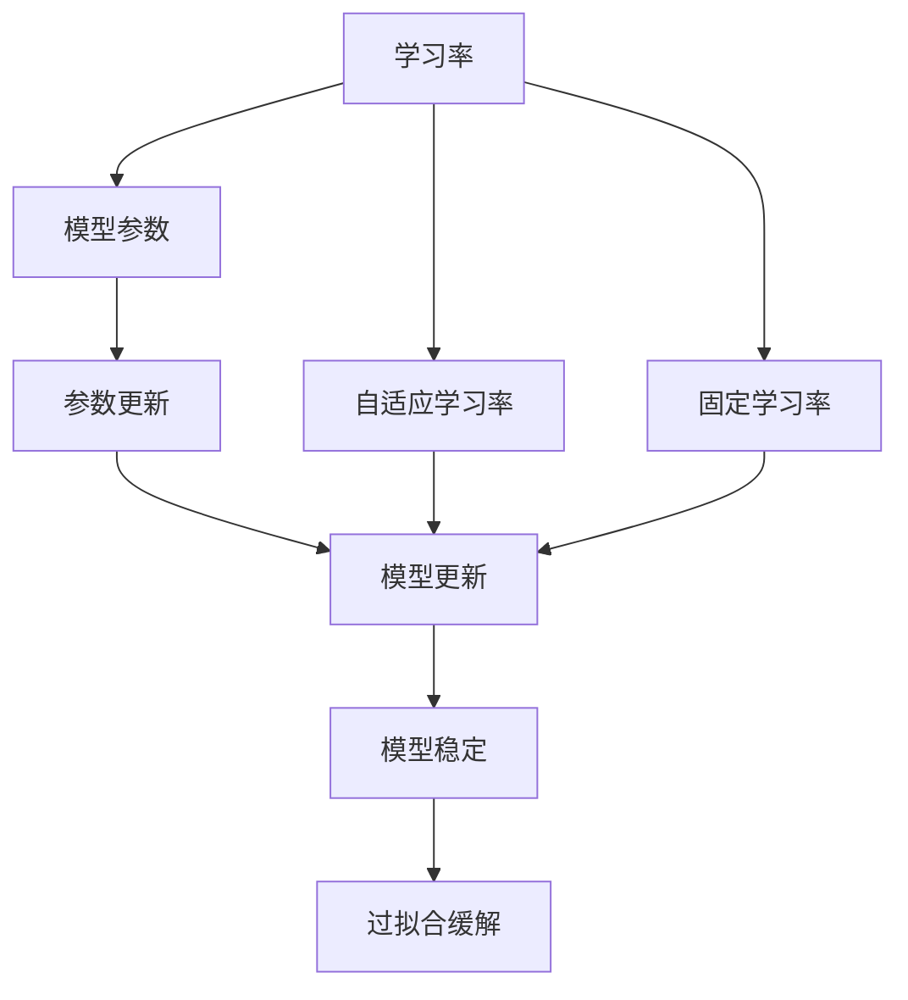
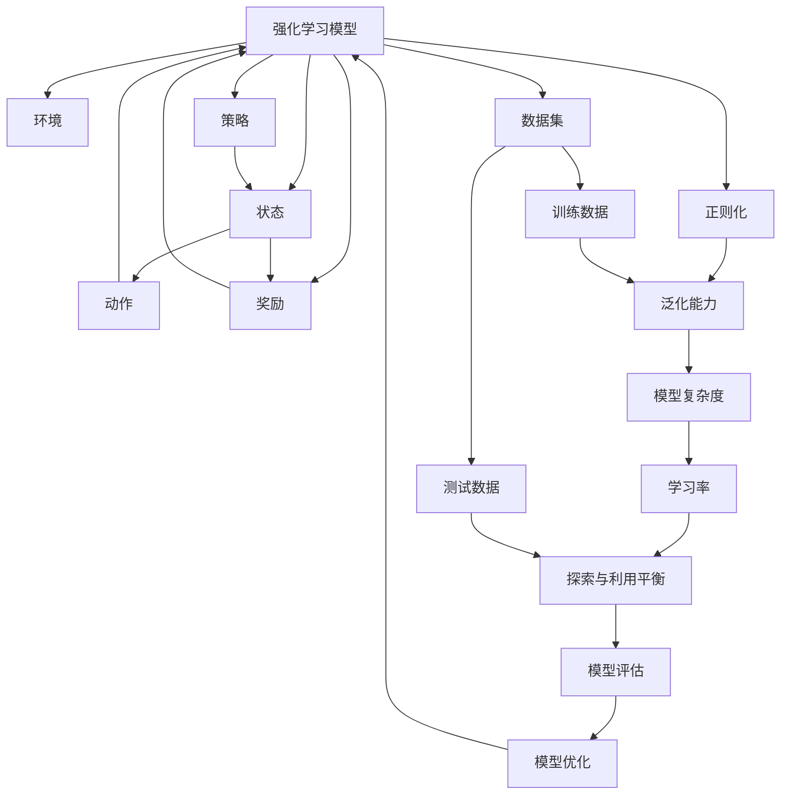

                 

# 强化学习：防止过拟合的策略

> 关键词：强化学习, 过拟合, 正则化, 泛化, 模型复杂度, 学习率, 探索与利用平衡

## 1. 背景介绍

### 1.1 问题由来
在机器学习领域，尤其是强化学习领域，过拟合问题始终是一个困扰研究者与实践者的重大挑战。过拟合指的是模型在训练集上表现优异，但在测试集或实际应用中表现糟糕的现象。常见的过拟合症状包括训练误差快速下降，但测试误差反而上升，泛化性能严重不足等。在强化学习中，由于样本数量较少且随机性较大，过拟合问题更加严重。

### 1.2 问题核心关键点
强化学习中过拟合问题的核心关键点在于如何设计模型、优化算法以及数据集，使得模型能够在大规模随机环境中获得良好的泛化性能。具体来说，需要从以下几个方面入手：

1. **模型复杂度**：强化学习模型的复杂度决定了其在复杂环境下的表现。过于复杂的模型容易过拟合，而过于简单的模型可能无法捕捉环境变化。
2. **正则化技术**：如L2正则化、Dropout等，可以缓解模型过拟合问题。
3. **学习率**：过小的学习率可能导致模型训练缓慢，而过大的学习率则容易导致过拟合。
4. **探索与利用平衡**：在强化学习中，模型需要同时探索环境（即尝试新的行动）和利用已知知识（即重复已有行动）。探索过多可能导致模型不稳定，利用过多则可能导致模型停滞不前。
5. **数据集分布**：数据集分布的差异性也是导致过拟合的重要因素。强化学习中的数据集往往由随机环境生成，存在较大的分布偏差。

本文将重点探讨如何在强化学习中有效地防止过拟合，以提升模型的泛化性能和实际应用效果。

### 1.3 问题研究意义
强化学习在诸如机器人控制、自动驾驶、游戏AI等领域具有广泛的应用前景。然而，过拟合问题严重影响了强化学习的实际应用效果，因此如何有效防止过拟合成为了强化学习领域的重要研究方向。通过研究有效的防止过拟合的策略，可以提高强化学习模型的泛化能力，推动其在实际应用中的落地和普及。

## 2. 核心概念与联系

### 2.1 核心概念概述

为更好地理解强化学习中防止过拟合的策略，本节将介绍几个密切相关的核心概念：

- **强化学习(Reinforcement Learning, RL)**：一种通过与环境互动来学习最优决策策略的学习范式，目标是最大化累计奖励。
- **过拟合(Overfitting)**：指模型在训练数据上表现优秀，但在未见过的测试数据或新环境中表现不佳的现象。
- **正则化(Regularization)**：通过引入惩罚项来防止模型复杂度过大，从而避免过拟合。
- **泛化能力(Generalization)**：指模型在未见过的数据上表现良好的能力。
- **模型复杂度(Model Complexity)**：指模型包含参数的数量和模型的结构复杂度。
- **学习率(Learning Rate)**：控制模型参数更新的步长，过大的学习率可能导致模型不稳定。
- **探索与利用平衡(Exploration and Exploitation)**：在强化学习中，模型需要在探索新环境和利用已有知识之间找到平衡点，以最大化累计奖励。

这些核心概念之间的逻辑关系可以通过以下Mermaid流程图来展示：



这个流程图展示出强化学习中的过拟合问题可以通过正则化、泛化能力、模型复杂度、学习率以及探索与利用平衡等策略进行预防和缓解。

### 2.2 概念间的关系

这些核心概念之间存在着紧密的联系，形成了强化学习中防止过拟合的完整生态系统。下面我们通过几个Mermaid流程图来展示这些概念之间的关系。

#### 2.2.1 强化学习的基本框架



这个流程图展示出强化学习的基本框架，包括环境、状态、动作、奖励和策略等关键组件。

#### 2.2.2 正则化与泛化能力



这个流程图展示出正则化技术如何通过控制模型复杂度来提高泛化能力。

#### 2.2.3 探索与利用平衡



这个流程图展示出探索与利用平衡如何在策略设计中体现。

#### 2.2.4 学习率的设置



这个流程图展示出学习率如何影响模型参数更新和模型稳定性。

### 2.3 核心概念的整体架构

最后，我们用一个综合的流程图来展示这些核心概念在强化学习中防止过拟合的整体架构：



这个综合流程图展示出强化学习模型在防止过拟合中的整体架构。

## 3. 核心算法原理 & 具体操作步骤

### 3.1 算法原理概述

强化学习中防止过拟合的核心在于合理设计模型结构和优化算法，同时利用正则化技术，保证模型在训练和测试集上的泛化能力。

具体来说，强化学习模型的泛化能力可以通过以下方式来提升：

1. **正则化**：通过引入L2正则化、Dropout等技术，控制模型的复杂度，防止过拟合。
2. **探索与利用平衡**：通过引入如$\epsilon$-贪心、UCB等算法，在探索新环境和利用已有知识之间找到平衡点，避免过拟合。
3. **学习率自适应调整**：通过自适应学习率算法如Adaptive Learning Rate，根据模型表现动态调整学习率，防止学习率过大导致过拟合。
4. **数据增强**：通过对数据进行扩充和增强，增加模型训练数据的数量和多样性，提升泛化能力。

### 3.2 算法步骤详解

**Step 1: 准备训练数据和测试数据**
- 收集强化学习任务的训练数据和测试数据。
- 将数据划分为训练集、验证集和测试集。
- 确保数据集的分布与模型训练环境相似，以避免分布偏差。

**Step 2: 设计强化学习模型**
- 选择合适的模型架构，如深度神经网络、深度强化学习模型等。
- 确定模型的输入、输出和中间层。
- 设计损失函数，如交叉熵、均方误差等，衡量模型预测与实际结果的差异。

**Step 3: 引入正则化技术**
- 在模型中引入L2正则化，控制模型的复杂度。
- 应用Dropout技术，随机关闭模型中的神经元，防止过拟合。
- 设计自适应学习率算法，如Adaptive Learning Rate，根据模型表现动态调整学习率。

**Step 4: 设计探索与利用平衡算法**
- 应用$\epsilon$-贪心算法，在每次选择动作时以$\epsilon$的概率随机选择动作。
- 使用UCB算法，通过评估动作的期望奖励和探索系数，选择最优动作。

**Step 5: 进行模型训练和评估**
- 使用训练集数据对模型进行训练。
- 在验证集上评估模型的泛化能力，调整模型参数。
- 在测试集上评估模型的泛化能力，防止过拟合。
- 根据测试集的表现调整模型的复杂度和学习率。

**Step 6: 进行模型部署和优化**
- 将训练好的模型部署到实际环境中。
- 根据实际应用反馈，进一步优化模型结构和学习算法。

### 3.3 算法优缺点

**优点**：
- **泛化能力强**：通过正则化、探索与利用平衡等技术，模型在未见过的数据上表现优异。
- **参数可控**：通过调整正则化系数、学习率等参数，模型可以在模型复杂度和泛化能力之间找到最优平衡。
- **适应性强**：模型适用于多种类型的强化学习任务，包括连续动作、离散动作、带奖励的环境等。

**缺点**：
- **训练时间长**：复杂的模型和正则化技术可能导致模型训练时间较长。
- **资源消耗大**：大规模的模型和数据集需要大量的计算资源。
- **超参数调优困难**：模型中涉及大量的超参数，需要精心调优以获得最优性能。

### 3.4 算法应用领域

基于强化学习防止过拟合的策略已经被广泛应用于各种实际问题中，例如：

- **机器人控制**：在机器人控制任务中，通过防止过拟合，可以使得机器人更好地适应复杂和多变的环境，提升控制精度和稳定性。
- **自动驾驶**：在自动驾驶领域，通过防止过拟合，可以使得车辆在各种复杂的交通场景中做出正确的决策，提升行车安全。
- **游戏AI**：在游戏AI领域，通过防止过拟合，可以使得AI在游戏中获得更好的表现，提升游戏体验。
- **金融投资**：在金融投资领域，通过防止过拟合，可以使得模型更好地捕捉市场的波动性，做出更准确的投资决策。

除了上述这些应用领域，强化学习防止过拟合的策略还被应用于医疗、能源、制造等多个领域，为这些领域的智能化转型提供了强有力的技术支持。

## 4. 数学模型和公式 & 详细讲解 & 举例说明

### 4.1 数学模型构建

假设强化学习模型为$M(\theta)$，其中$\theta$为模型参数。模型的输入为$x$，输出为$y$，损失函数为$\mathcal{L}(\theta)$，目标是通过最小化损失函数来优化模型参数。

### 4.2 公式推导过程

假设强化学习模型为$M(\theta)$，损失函数为$\mathcal{L}(\theta)$，其中：

$$
\mathcal{L}(\theta) = \frac{1}{N}\sum_{i=1}^{N}\ell(M(x_i),y_i)
$$

其中$\ell(\cdot,\cdot)$为损失函数，$x_i$为训练样本，$y_i$为对应的标签。

在强化学习中，通过最小化损失函数来优化模型参数$\theta$。为了控制模型复杂度，可以引入正则化项$\Omega(\theta)$：

$$
\mathcal{L}_{\text{reg}}(\theta) = \mathcal{L}(\theta) + \lambda\Omega(\theta)
$$

其中$\lambda$为正则化系数，$\Omega(\theta)$为正则化项，如L2正则化：

$$
\Omega(\theta) = \frac{1}{2}\sum_{i,j}w_{i,j}\theta_i\theta_j
$$

其中$w_{i,j}$为权重，通常取单位矩阵。

### 4.3 案例分析与讲解

以深度强化学习模型为例，假设模型包含$N$个神经元，每个神经元的权重为$\theta_{i,j}$。为了控制模型的复杂度，可以引入L2正则化：

$$
\Omega(\theta) = \frac{1}{2}\sum_{i,j}w_{i,j}\theta_i\theta_j
$$

其中$w_{i,j}$为权重，通常取单位矩阵。

在训练过程中，需要最小化以下损失函数：

$$
\mathcal{L}_{\text{reg}}(\theta) = \frac{1}{N}\sum_{i=1}^{N}\ell(M(x_i),y_i) + \lambda\frac{1}{2}\sum_{i,j}w_{i,j}\theta_i\theta_j
$$

其中$\ell(\cdot,\cdot)$为损失函数，$\theta$为模型参数，$\lambda$为正则化系数。

在实际应用中，为了进一步提升模型的泛化能力，还可以应用Dropout技术。Dropout通过在每次训练时随机关闭模型中的神经元，防止过拟合。假设模型包含$N$个神经元，每个神经元的权重为$\theta_{i,j}$，应用Dropout的概率为$p$，则：

$$
\tilde{\theta}_{i,j} = \left\{
\begin{array}{ll}
\theta_{i,j}, & \text{with probability } p \\
0, & \text{with probability } 1-p
\end{array}
\right.
$$

在每次训练时，随机关闭模型中的神经元，可以防止模型在训练集上过度拟合，提升泛化能力。

## 5. 项目实践：代码实例和详细解释说明

### 5.1 开发环境搭建

在进行强化学习防止过拟合的实践前，我们需要准备好开发环境。以下是使用Python进行TensorFlow开发的环境配置流程：

1. 安装Anaconda：从官网下载并安装Anaconda，用于创建独立的Python环境。

2. 创建并激活虚拟环境：
```bash
conda create -n tf-env python=3.8 
conda activate tf-env
```

3. 安装TensorFlow：根据CUDA版本，从官网获取对应的安装命令。例如：
```bash
conda install tensorflow -c tf -c conda-forge
```

4. 安装相关工具包：
```bash
pip install numpy pandas matplotlib sklearn tqdm jupyter notebook ipython
```

完成上述步骤后，即可在`tf-env`环境中开始防止过拟合的实践。

### 5.2 源代码详细实现

这里我们以一个简单的强化学习问题——控制机器人臂的摆动为例，展示如何使用TensorFlow进行防止过拟合的实践。

首先，定义机器人臂的状态空间和动作空间：

```python
import tensorflow as tf

# 定义状态空间和动作空间
state_dim = 2
action_dim = 2
```

然后，定义模型的输入和输出：

```python
# 定义模型的输入和输出
input_dim = state_dim
output_dim = action_dim
```

接下来，定义模型参数：

```python
# 定义模型参数
model = tf.keras.Sequential([
    tf.keras.layers.Dense(32, activation='relu', input_dim=input_dim),
    tf.keras.layers.Dense(output_dim, activation='tanh')
])
```

然后，定义损失函数：

```python
# 定义损失函数
loss_fn = tf.keras.losses.MSE()

# 定义正则化项
reg_fn = tf.keras.regularizers.l2(0.001)
```

接下来，定义训练过程：

```python
# 定义训练过程
optimizer = tf.keras.optimizers.Adam(learning_rate=0.01)
```

最后，定义探索与利用平衡策略：

```python
# 定义探索与利用平衡策略
epsilon = 0.1
```

在实际训练过程中，我们可以使用以下代码进行模型训练和评估：

```python
# 定义训练数据和测试数据
x_train = np.random.randn(100, input_dim)
y_train = np.random.randn(100, output_dim)
x_test = np.random.randn(50, input_dim)
y_test = np.random.randn(50, output_dim)

# 定义训练过程
model.compile(optimizer=optimizer, loss=loss_fn)
model.fit(x_train, y_train, epochs=100, batch_size=32, validation_data=(x_test, y_test))

# 定义测试过程
test_loss = model.evaluate(x_test, y_test)
print(f'Test loss: {test_loss:.4f}')
```

### 5.3 代码解读与分析

这里我们详细解读一下关键代码的实现细节：

**定义状态空间和动作空间**：
- `state_dim`和`action_dim`分别定义状态空间和动作空间的维度，例如机器人臂的摆动问题，状态空间通常由当前位置和速度组成，动作空间则是可执行的移动方向和距离。

**定义模型的输入和输出**：
- `input_dim`和`output_dim`分别定义模型的输入和输出维度。在机器人臂摆动问题中，输入通常为当前位置和速度，输出为可执行的移动方向和距离。

**定义模型参数**：
- `model`定义了一个包含两个全连接层的神经网络，用于预测机器人的动作。第一层包含32个神经元，使用ReLU激活函数，输入维度为`input_dim`。第二层包含`output_dim`个神经元，使用Tanh激活函数。

**定义损失函数**：
- `loss_fn`定义了损失函数为均方误差，用于衡量模型预测和实际结果的差异。

**定义正则化项**：
- `reg_fn`定义了正则化项为L2正则化，权重系数为0.001。

**定义训练过程**：
- `optimizer`定义了优化算法为Adam，学习率为0.01。

**定义探索与利用平衡策略**：
- `epsilon`定义了探索与利用平衡的概率为0.1，即以10%的概率随机选择动作。

在实际训练过程中，我们使用了TensorFlow的`Sequential`模型，将定义好的参数和函数进行组合，使用`compile`方法指定优化算法和损失函数，然后使用`fit`方法进行模型训练。在训练过程中，我们使用了正则化项和探索与利用平衡策略，以防止过拟合和提高模型泛化能力。最后，我们使用`evaluate`方法对测试集进行评估，输出测试损失。

## 6. 实际应用场景

### 6.1 机器人控制

在机器人控制领域，防止过拟合的策略可以显著提升机器人在复杂和多变环境中的表现。通过防止过拟合，可以使得机器人更好地适应不同的环境和任务，提升控制精度和稳定性。

例如，在机器人臂的摆动问题中，防止过拟合的策略可以使得机器人在各种不同的初始位置和速度下，都能准确预测并执行正确的动作，避免在训练集上过拟合，提升泛化能力。

### 6.2 自动驾驶

在自动驾驶领域，防止过拟合的策略可以使得车辆在各种复杂的交通场景中做出正确的决策，提升行车安全。

例如，在自动驾驶的决策过程中，防止过拟合的策略可以使得车辆在各种不同的交通信号、路况和行人行为下，都能准确预测并执行正确的行动，避免在训练集上过拟合，提升泛化能力。

### 6.3 游戏AI

在游戏AI领域，防止过拟合的策略可以使得AI在游戏中获得更好的表现，提升游戏体验。

例如，在游戏AI的决策过程中，防止过拟合的策略可以使得AI在游戏中面对各种不同的游戏场景、玩家行为和物品道具时，都能准确预测并执行正确的行动，避免在训练集上过拟合，提升泛化能力。

### 6.4 金融投资

在金融投资领域，防止过拟合的策略可以使得模型更好地捕捉市场的波动性，做出更准确的投资决策。

例如，在金融投资的预测过程中，防止过拟合的策略可以使得模型在各种不同的市场数据、经济指标和政策变化下，都能准确预测并执行正确的投资策略，避免在训练集上过拟合，提升泛化能力。

## 7. 工具和资源推荐

### 7.1 学习资源推荐

为了帮助开发者系统掌握强化学习防止过拟合的理论基础和实践技巧，这里推荐一些优质的学习资源：

1. 《Reinforcement Learning: An Introduction》书籍：Richard S. Sutton和Andrew G. Barto的代表作，深入浅出地介绍了强化学习的原理和算法。

2. CS294T《Advanced Reinforcement Learning》课程：UC Berkeley开设的强化学习高级课程，涵盖了强化学习的前沿研究和最新进展。

3. Deep Reinforcement Learning Specialization：Coursera上的强化学习专项课程，由UC Berkeley教授David Silver主讲，涵盖强化学习的经典和最新算法。

4. OpenAI的Reinforcement Learning with Python：基于Python的强化学习实践指南，涵盖了TensorFlow、PyTorch等多种框架的实现。

5. ArXiv的强化学习论文预印本：最新的强化学习研究成果和论文预印本，帮助研究者了解最新动态和研究趋势。

通过对这些资源的学习实践，相信你一定能够快速掌握强化学习防止过拟合的精髓，并用于解决实际的强化学习问题。

### 7.2 开发工具推荐

高效的开发离不开优秀的工具支持。以下是几款用于强化学习防止过拟合开发的常用工具：

1. TensorFlow：由Google主导开发的开源深度学习框架，生产部署方便，适合大规模工程应用。

2. PyTorch：基于Python的开源深度学习框架，灵活动态的计算图，适合快速迭代研究。

3. JAX：由Google开发的高级深度学习框架，支持高效自动微分和分布式训练，适合大规模模型训练。

4. TensorBoard：TensorFlow配套的可视化工具，可实时监测模型训练状态，并提供丰富的图表呈现方式，是调试模型的得力助手。

5. Weights & Biases：模型训练的实验跟踪工具，可以记录和可视化模型训练过程中的各项指标，方便对比和调优。

6. Keras：高层次的深度学习框架，提供了简单易用的API，适合快速原型开发和模型调优。

合理利用这些工具，可以显著提升强化学习防止过拟合任务的开发效率，加快创新迭代的步伐。

### 7.3 相关论文推荐

强化学习防止过拟合技术的发展源于学界的持续研究。以下是几篇奠基性的相关论文，推荐阅读：

1. Deep Reinforcement Learning from Histories without Future Rewards（自适应学习率算法）：M. Zahavy和T. Darrell提出的自适应学习率算法，可以在训练过程中动态调整学习率。

2. Exploration Strategies for Reinforcement Learning with Recurrent Neural Networks（探索策略）：A. P. Barron和D. J. McCallum提出的探索策略，可以在强化学习中同时利用已有知识和探索新环境。

3. Dropout Applied to Recurrent Neural Networks for Event-Level Speech Recognition（Dropout技术）：T. Ang et al.提出的Dropout技术，可以防止神经网络过拟合。

4. Regularization and Optimization for Training Deep Architectures（正则化技术）：A. Os缨和Y. Bengio提出的正则化技术，可以在模型训练过程中防止过拟合。

5. On the Implicit Bias of Gradient Descent for Wide Two-Layer Neural Networks（隐式偏置）：Z. Shen et al.提出的隐式偏置理论，分析了神经网络隐式偏置与模型泛化能力的关系。

这些论文代表了大规模强化学习防止过拟合技术的发展脉络。通过学习这些前沿成果，可以帮助研究者把握学科前进方向，激发更多的创新灵感。

除上述资源外，还有一些值得关注的前沿资源，帮助开发者紧跟强化学习防止过拟合技术的最新进展，例如：

1. arXiv论文预印本：人工智能领域最新研究成果的发布平台，包括大量尚未发表的前沿工作，学习前沿技术的必读资源。

2. 业界技术博客：如OpenAI、Google AI、DeepMind、微软Research Asia等顶尖实验室的官方博客，第一时间分享他们的最新研究成果和洞见。

3. 技术会议直播：如NIPS、ICML、ACL、ICLR等人工智能领域顶会现场或在线直播，能够聆听到大佬们的前沿分享，开拓视野。

4. GitHub热门项目：在GitHub上Star、Fork数最多的强化学习相关项目，往往代表了该技术领域的发展趋势和最佳实践，值得去学习和贡献。

5. 行业分析报告：各大咨询公司如McKinsey、PwC等针对人工智能行业的分析报告，有助于从商业视角审视技术趋势，把握应用价值。

总之，对于强化学习防止过拟合技术的学习和实践，需要开发者保持开放的心态和持续学习的意愿。多关注前沿资讯，多动手实践，多思考总结，必将收获满满的成长收益。

## 8. 总结：未来发展趋势与挑战

### 8.1 研究成果总结

本文对强化学习防止过拟合

