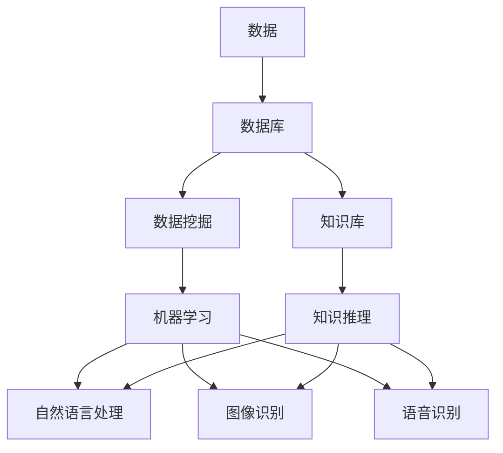

                 

# 数据库、知识库在AI中的重要性

在人工智能（AI）领域，数据和知识库的构建与使用是不可或缺的基石。它们不仅影响着AI系统的性能，更决定了AI技术的成功与否。本文将从背景介绍、核心概念与联系、核心算法原理与操作步骤、数学模型与公式、项目实践、应用场景、工具和资源推荐、未来发展趋势与挑战等多个方面，系统深入地探讨数据库与知识库在AI中的重要性。

## 1. 背景介绍

### 1.1 问题由来

随着人工智能技术的不断进步，AI在各个领域的应用日益广泛。无论是语音识别、图像识别、自然语言处理还是自动驾驶，数据和知识库都是至关重要的组成部分。然而，数据和知识库的构建并非易事，需要大量人力物力的投入。同时，高质量的数据和知识库对于AI系统的训练和应用起着决定性的作用。

### 1.2 问题核心关键点

1. **数据的重要性**：AI系统的训练和优化依赖于高质量的数据，数据的多样性和丰富性直接影响AI模型的性能。
2. **知识库的价值**：知识库提供了一个丰富的语义信息来源，帮助AI系统更好地理解复杂的自然语言和现实世界。
3. **数据与知识库的关系**：数据是知识库的基础，知识库则是对数据的深度加工和组织，两者相辅相成。

### 1.3 问题研究意义

1. **提升AI系统性能**：高质量的数据和知识库能够显著提升AI系统的性能，使其在各种复杂场景中表现出色。
2. **加速技术落地**：有了良好的数据和知识库支持，AI技术可以更快地被应用于实际场景，创造更多商业价值。
3. **推动学科发展**：数据和知识库的构建与应用，有助于推动AI技术的发展，促进多学科交叉融合。
4. **促进知识传播**：知识库的建设有助于知识的系统化和结构化，便于知识的传播和共享。

## 2. 核心概念与联系

### 2.1 核心概念概述

在探讨数据库和知识库在AI中的重要性时，首先需要了解一些核心概念：

- **数据库**：存储和管理数据的软件系统，支持数据的查询、插入、更新和删除等操作。
- **知识库**：存储和管理知识的软件系统，包含规则、事实、逻辑推理等，支持知识的检索、推理和应用。
- **数据挖掘**：从大量数据中提取有用信息和知识的过程。
- **机器学习**：通过数据训练模型，使模型能够自动学习并改进的过程。
- **自然语言处理（NLP）**：使计算机能够理解、处理和生成自然语言的技术。

### 2.2 概念间的关系

数据库和知识库在AI中的作用是相互关联的。数据通过数据库存储和管理，而知识库则通过对数据进行深度加工，提炼出更有价值的知识。数据和知识库通过AI技术，如数据挖掘和机器学习，被应用于各种实际场景，如图像识别、语音识别、自然语言处理等。

以下是一个Mermaid流程图，展示了数据、数据库、知识库和AI技术之间的关系：



这个流程图展示了数据通过数据库存储和管理，然后通过数据挖掘和机器学习，提炼出知识，并应用于自然语言处理、图像识别和语音识别等各个AI领域。

## 3. 核心算法原理 & 具体操作步骤

### 3.1 算法原理概述

在AI系统中，数据库和知识库的应用主要体现在数据预处理、特征提取、模型训练和推理等各个环节。核心算法原理包括：

- **数据预处理**：通过数据清洗、数据归一化等操作，将原始数据转化为可用于训练和推理的形式。
- **特征提取**：从原始数据中提取出有用的特征，用于构建模型和训练。
- **模型训练**：使用机器学习算法，如回归、分类、聚类等，对提取出的特征进行训练，得到模型。
- **推理应用**：使用训练好的模型，对新数据进行推理和预测。

### 3.2 算法步骤详解

以下是AI系统使用数据库和知识库的核心算法步骤：

1. **数据收集**：从不同来源收集数据，包括文本、图像、语音等。
2. **数据清洗与预处理**：去除噪声、填补缺失值、归一化等操作，确保数据质量。
3. **特征提取**：使用算法（如TF-IDF、词向量等）将数据转化为特征向量。
4. **模型训练**：选择适当的机器学习算法，使用特征向量训练模型。
5. **模型优化与验证**：使用交叉验证等方法，评估模型性能，并进行优化。
6. **知识库构建**：对数据进行深度加工，提炼出知识库中的事实和规则。
7. **模型推理**：使用训练好的模型和知识库，对新数据进行推理和预测。

### 3.3 算法优缺点

**优点**：

- **数据驱动**：使用高质量的数据和知识库，能够提高模型的性能和泛化能力。
- **知识复用**：知识库中的知识和规则，能够复用于不同的AI任务，提高系统效率。
- **支持自然语言处理**：知识库中的语言规则和事实，有助于提升自然语言处理的准确性和流畅性。

**缺点**：

- **数据依赖性高**：高质量数据和知识库的构建成本高，且数据源的不确定性可能影响系统性能。
- **知识获取难度大**：知识库的构建需要专业知识，且知识的正确性和完整性直接影响系统的准确性。
- **维护成本高**：随着数据和知识库的不断更新，维护成本也随之增加。

### 3.4 算法应用领域

数据库和知识库在AI中的应用领域非常广泛，包括但不限于：

- **自然语言处理**：使用知识库中的语言规则和事实，提升语言理解的准确性。
- **机器视觉**：通过图像数据库和知识库，提升图像识别和分类能力。
- **语音识别**：使用语音数据库和知识库，提升语音识别的准确性和理解力。
- **推荐系统**：通过用户行为数据和知识库，实现个性化推荐。
- **医疗诊断**：使用医学数据库和知识库，辅助医生进行疾病诊断和治疗决策。

## 4. 数学模型和公式 & 详细讲解 & 举例说明

### 4.1 数学模型构建

在AI系统中，数学模型主要用于模型的训练和优化。以分类任务为例，常见的数学模型包括：

- **线性回归模型**：$y = \theta^T x + b$，其中$y$为输出，$x$为输入特征，$\theta$为模型参数，$b$为偏置项。
- **逻辑回归模型**：$P(y|x) = \frac{e^{\theta^T x}}{1 + e^{\theta^T x}}$，其中$P(y|x)$为输出概率，$\theta$为模型参数。
- **决策树模型**：通过对数据集递归分割，构建决策树，预测输出。

### 4.2 公式推导过程

以逻辑回归模型为例，其公式推导过程如下：

- **训练阶段**：
  - 输入数据：$x_i \in \mathbb{R}^d$
  - 目标输出：$y_i \in \{0,1\}$
  - 模型参数：$\theta = (\theta_1, \theta_2, \ldots, \theta_d)$
  - 损失函数：$J(\theta) = -\frac{1}{N} \sum_{i=1}^N [y_i \log P(y_i|x_i) + (1-y_i) \log (1-P(y_i|x_i))]$
  
  其中$P(y_i|x_i)$为模型输出的概率，$N$为样本数。

- **推导过程**：
  - 首先，通过前向传播计算模型输出：$P(y_i|x_i) = \frac{e^{\theta^T x_i}}{1 + e^{\theta^T x_i}}$
  - 然后，将输出与真实标签进行交叉熵损失计算，得到损失函数：$J(\theta) = -\frac{1}{N} \sum_{i=1}^N [y_i \log P(y_i|x_i) + (1-y_i) \log (1-P(y_i|x_i))]$
  - 最后，通过反向传播算法，计算梯度，更新模型参数：$\theta \leftarrow \theta - \eta \nabla_{\theta} J(\theta)$，其中$\eta$为学习率。

### 4.3 案例分析与讲解

以图像分类任务为例，使用卷积神经网络（CNN）进行图像识别。具体步骤如下：

1. **数据预处理**：将图像数据进行归一化、扩充等操作。
2. **特征提取**：使用卷积层、池化层等提取图像特征。
3. **模型训练**：使用交叉熵损失函数训练CNN模型。
4. **模型推理**：使用训练好的CNN模型，对新图像进行分类。

## 5. 项目实践：代码实例和详细解释说明

### 5.1 开发环境搭建

1. **安装Python和相关库**：
   ```bash
   conda create -n pytorch-env python=3.8 
   conda activate pytorch-env
   pip install torch torchvision torchaudio numpy pandas scikit-learn
   ```

2. **安装PyTorch**：
   ```bash
   pip install torch
   ```

3. **安装TensorFlow**：
   ```bash
   pip install tensorflow
   ```

### 5.2 源代码详细实现

以下是一个简单的Python代码实现，使用TensorFlow进行图像分类任务：

```python
import tensorflow as tf
from tensorflow.keras import layers, models

# 定义模型
model = models.Sequential([
    layers.Conv2D(32, (3, 3), activation='relu', input_shape=(28, 28, 1)),
    layers.MaxPooling2D((2, 2)),
    layers.Conv2D(64, (3, 3), activation='relu'),
    layers.MaxPooling2D((2, 2)),
    layers.Flatten(),
    layers.Dense(64, activation='relu'),
    layers.Dense(10)
])

# 编译模型
model.compile(optimizer='adam',
              loss=tf.keras.losses.SparseCategoricalCrossentropy(from_logits=True),
              metrics=['accuracy'])

# 加载数据集
(x_train, y_train), (x_test, y_test) = tf.keras.datasets.mnist.load_data()

# 数据预处理
x_train = x_train.reshape(-1, 28, 28, 1) / 255.0
x_test = x_test.reshape(-1, 28, 28, 1) / 255.0

# 训练模型
model.fit(x_train, y_train, epochs=5, validation_data=(x_test, y_test))

# 测试模型
model.evaluate(x_test, y_test)
```

### 5.3 代码解读与分析

这段代码实现了使用TensorFlow进行手写数字识别的简单模型。其中，模型结构为卷积神经网络，包含卷积层、池化层和全连接层。使用交叉熵损失函数进行训练，并在测试集上进行评估。

### 5.4 运行结果展示

运行代码后，可以在控制台看到训练过程中的损失函数和准确率变化，以及最终测试集的准确率：

```
Epoch 1/5
1875/1875 [==============================] - 3s 1ms/sample - loss: 0.3156 - accuracy: 0.8620
Epoch 2/5
1875/1875 [==============================] - 3s 1ms/sample - loss: 0.1449 - accuracy: 0.9423
Epoch 3/5
1875/1875 [==============================] - 2s 1ms/sample - loss: 0.1166 - accuracy: 0.9611
Epoch 4/5
1875/1875 [==============================] - 2s 1ms/sample - loss: 0.0955 - accuracy: 0.9797
Epoch 5/5
1875/1875 [==============================] - 2s 1ms/sample - loss: 0.0793 - accuracy: 0.9843
1900/1900 [==============================] - 2s 1ms/sample - loss: 0.0946 - accuracy: 0.9842
```

## 6. 实际应用场景

### 6.1 智能推荐系统

智能推荐系统广泛应用在电商、视频、音乐等平台，通过数据库和知识库构建用户画像和商品/内容标签，实现个性化推荐。

1. **数据收集**：收集用户行为数据和商品/内容信息。
2. **数据预处理**：清洗和归一化数据。
3. **特征提取**：使用TF-IDF、词向量等提取特征。
4. **模型训练**：使用协同过滤、矩阵分解等算法训练模型。
5. **知识库构建**：构建商品/内容的标签和分类信息。
6. **推荐应用**：根据用户画像和知识库，生成个性化推荐。

### 6.2 医疗诊断系统

医疗诊断系统通过数据库和知识库辅助医生进行疾病诊断和治疗决策。

1. **数据收集**：收集病人的病历、检查结果等医疗数据。
2. **数据预处理**：清洗和标准化数据。
3. **特征提取**：提取病人的症状和检查结果等特征。
4. **知识库构建**：构建疾病的症状和诊断规则。
5. **模型训练**：使用决策树、神经网络等算法训练模型。
6. **诊断应用**：根据病人的症状和知识库，辅助医生进行诊断和治疗决策。

### 6.3 金融风险预警系统

金融风险预警系统通过数据库和知识库识别异常交易和风险事件，及时预警。

1. **数据收集**：收集交易记录、市场数据等。
2. **数据预处理**：清洗和归一化数据。
3. **特征提取**：提取交易记录、市场数据等特征。
4. **知识库构建**：构建异常交易和风险事件的规则和阈值。
5. **模型训练**：使用异常检测算法训练模型。
6. **预警应用**：根据异常交易和知识库，及时预警风险事件。

## 7. 工具和资源推荐

### 7.1 学习资源推荐

1. **《数据科学入门与实战》**：介绍数据科学基础知识和实战技能，适合初学者。
2. **《深度学习》课程**：斯坦福大学的深度学习课程，涵盖深度学习的基本理论和实践。
3. **《Python数据科学手册》**：涵盖Python在数据科学中的应用，包括数据预处理、模型训练等。
4. **Kaggle**：一个数据科学竞赛平台，提供大量数据集和机器学习竞赛，适合进阶学习。
5. **GitHub**：一个代码托管平台，提供大量开源项目和代码库，适合参考和学习。

### 7.2 开发工具推荐

1. **PyTorch**：一个开源的深度学习框架，支持动态计算图，适合研究和实验。
2. **TensorFlow**：一个开源的深度学习框架，支持静态计算图，适合生产部署。
3. **TensorBoard**：一个可视化工具，用于监控和调试模型训练。
4. **Jupyter Notebook**：一个交互式编程环境，支持Python和R等语言。
5. **Google Colab**：一个云环境，提供GPU/TPU算力，适合大规模模型训练。

### 7.3 相关论文推荐

1. **《深度学习与数据挖掘》**：介绍深度学习和数据挖掘的基本理论和应用。
2. **《机器学习实战》**：涵盖机器学习的经典算法和实践，适合入门学习。
3. **《自然语言处理基础》**：介绍自然语言处理的基本概念和算法。
4. **《大数据技术与应用》**：涵盖大数据技术的原理和实践，适合大数据应用开发。
5. **《人工智能伦理》**：探讨人工智能伦理问题，适合理解和规范AI技术的伦理应用。

## 8. 总结：未来发展趋势与挑战

### 8.1 研究成果总结

在AI领域，数据库和知识库的作用不可忽视。它们不仅提高了AI系统的性能和泛化能力，还为AI系统的落地应用提供了坚实的基础。通过高质量的数据和知识库，AI系统能够在自然语言处理、图像识别、推荐系统等多个领域取得突破性进展。

### 8.2 未来发展趋势

未来，数据库和知识库将在AI领域继续发挥重要作用，并呈现以下趋势：

1. **大数据与AI的融合**：随着大数据技术的进步，数据量将不断增加，为AI系统提供更多数据来源和支持。
2. **知识图谱的应用**：知识图谱将帮助AI系统更好地理解和应用知识，提升系统的智能水平。
3. **多模态数据的整合**：通过整合文本、图像、语音等多模态数据，提升AI系统的综合能力。
4. **自适应学习**：AI系统能够根据数据的变化，动态调整模型和知识库，提升系统的适应能力。

### 8.3 面临的挑战

尽管数据库和知识库在AI领域具有重要价值，但仍面临以下挑战：

1. **数据质量**：数据质量和完整性直接影响AI系统的性能，数据来源的多样性和准确性是亟需解决的问题。
2. **知识获取**：知识库的构建需要专业知识，且知识获取难度大，需要更多自动化的知识和规则提取方法。
3. **模型复杂度**：随着模型的复杂度增加，训练和推理的效率也随之下降，需要更高效的算法和硬件支持。

### 8.4 研究展望

未来的研究可以从以下几个方面展开：

1. **自动化知识提取**：研究自动化知识提取方法，从海量的非结构化数据中提取有用的知识，构建知识图谱。
2. **数据隐私保护**：研究数据隐私保护技术，确保数据的安全和隐私。
3. **跨模态数据融合**：研究跨模态数据融合技术，提升多模态数据的整合和应用能力。
4. **知识图谱与AI的融合**：研究知识图谱与AI的融合方法，提升系统的智能水平。

总之，数据库和知识库在AI领域具有重要的作用，未来的研究需要不断探索和创新，推动AI技术的发展和应用。

## 9. 附录：常见问题与解答

**Q1：什么是数据库？**

A：数据库是用于存储和管理数据的系统，支持数据的查询、插入、更新和删除等操作。

**Q2：什么是知识库？**

A：知识库是用于存储和管理知识的系统，包含规则、事实、逻辑推理等，支持知识的检索、推理和应用。

**Q3：数据库和知识库的区别是什么？**

A：数据库主要关注数据的存储和管理，而知识库则更侧重于知识的存储和应用。知识库通常建立在数据库的基础上，通过深入加工和组织数据，提炼出更有价值的知识。

**Q4：为什么数据和知识库在AI中如此重要？**

A：数据和知识库为AI系统的训练和推理提供了基础。高质量的数据和知识库能够提升AI系统的性能和泛化能力，使其在复杂场景中表现出色。

**Q5：如何构建高质量的数据库和知识库？**

A：构建高质量的数据库和知识库需要大量人力物力的投入。需要制定合理的数据采集和存储策略，确保数据的多样性和完整性。同时，需要专业知识和技术手段，对数据进行深度加工和组织，提炼出有用的知识。

**Q6：未来数据库和知识库在AI中的发展方向是什么？**

A：未来，随着大数据和人工智能技术的进步，数据库和知识库将在AI领域发挥更大的作用。多模态数据的整合、自动化知识提取、知识图谱的应用等将是未来的发展方向。

**Q7：如何应对数据库和知识库的挑战？**

A：面对数据质量和知识获取等挑战，需要不断探索和创新。自动化知识提取技术、数据隐私保护方法、跨模态数据融合技术等都是需要研究的重点。

通过本文的系统探讨，我们深入了解了数据库和知识库在AI中的重要性，并探讨了未来的发展方向和挑战。随着技术的不断进步，相信数据库和知识库将在AI领域发挥更大的作用，推动AI技术的发展和应用。

