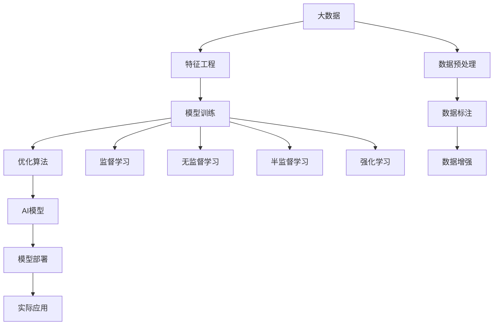
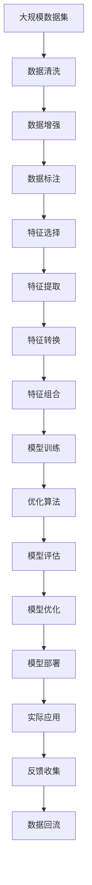

                 

# 大数据在AI学习中的作用

> 关键词：大数据,人工智能(AI),深度学习,数据处理,特征工程,模型训练,优化算法

## 1. 背景介绍

### 1.1 问题由来

在人工智能(AI)领域，尤其是深度学习(Deep Learning)和机器学习(Machine Learning)中，数据的重要性不言而喻。大数据（Big Data）作为AI技术发展的基础设施，对模型训练、特征工程和模型评估等方面有着不可替代的作用。随着数据存储和计算技术的飞速发展，大数据在AI学习中的应用越来越广泛，逐渐成为了AI技术突破的重要驱动力。

### 1.2 问题核心关键点

大数据在AI学习中主要通过以下几个方面发挥作用：

1. **数据量**：大规模数据集可以提供更多的训练样本，帮助模型更好地泛化。
2. **数据质量**：高质量、多样化的数据有助于提升模型性能。
3. **数据类型**：结构化数据、非结构化数据（如图像、文本、音频）的合理处理和利用，可以提升模型对不同类型数据的适应能力。
4. **数据分布**：合理的数据分布可以确保模型在不同场景下的泛化性能。
5. **数据标注**：标注数据的质量和数量直接影响模型的学习效果。

### 1.3 问题研究意义

大数据在AI学习中的作用主要体现在以下几个方面：

1. **数据驱动的创新**：大数据使得AI技术可以不断从真实世界中获得新数据，推动模型和算法的迭代和优化。
2. **模型性能提升**：大数据可以提供丰富的训练样本，有助于提高模型的泛化能力和性能。
3. **技术应用拓展**：大数据的广泛应用，使得AI技术能够渗透到更多领域，带来产业升级。
4. **研究基础**：大数据为AI的基础理论和应用实践提供了丰富的研究素材。

## 2. 核心概念与联系

### 2.1 核心概念概述

为更好地理解大数据在AI学习中的作用，本节将介绍几个核心概念：

- **大数据(Big Data)**：通常指无法在传统数据处理软件工具和硬件环境下收集、存储、管理和分析的数据集。这些数据集通常具有4V特性：Volume（数据量）、Velocity（数据处理速度）、Variety（数据类型）和Veracity（数据质量）。

- **人工智能(AI)**：使用计算机算法模拟人类智能行为，包括感知、学习、推理、规划和决策等能力。

- **深度学习(Deep Learning)**：一种基于多层神经网络的学习方法，能够自动从数据中学习特征表示，适用于大规模数据集和高复杂度问题。

- **特征工程(Feature Engineering)**：通过数据清洗、数据转换、特征选择等手段，构建有助于模型学习的数据特征。

- **模型训练(Model Training)**：使用大数据集对AI模型进行训练，使其能够学习到数据中的模式和规律。

- **优化算法(Optimization Algorithm)**：用于求解模型训练过程中最优化问题的算法，如梯度下降算法。

这些概念之间存在紧密的联系，共同构成了大数据在AI学习中的基础框架。

### 2.2 概念间的关系

这些核心概念之间的逻辑关系可以通过以下Mermaid流程图来展示：



这个流程图展示了大数据在AI学习中的关键步骤和流程：

1. 数据收集：通过各种渠道收集大量数据。
2. 数据预处理：对数据进行清洗、去噪、标准化等处理。
3. 数据标注：为数据集添加标签，便于模型训练。
4. 数据增强：通过数据变换和合成，扩充训练集。
5. 特征工程：构建适合模型学习的数据特征。
6. 模型训练：使用特征和标签训练AI模型。
7. 优化算法：调整模型参数，提高训练效率和性能。
8. AI模型部署：将模型集成到实际应用中。
9. 实际应用：模型在实际场景中运行，解决具体问题。

通过这个流程图，我们可以更清晰地理解大数据在AI学习中的关键环节和作用机制。

### 2.3 核心概念的整体架构

最后，我们用一个综合的流程图来展示这些核心概念在大数据在AI学习中的整体架构：



这个综合流程图展示了大数据在AI学习中的完整流程和架构：

1. 数据收集：获取原始数据集。
2. 数据清洗：处理缺失值、噪声等。
3. 数据增强：通过数据合成和变换扩充数据集。
4. 数据标注：为数据添加标签。
5. 特征选择：选择对模型学习有用的特征。
6. 特征提取：将原始数据转换为特征。
7. 特征转换：将特征转换为模型易于处理的格式。
8. 特征组合：将不同特征组合起来，提升模型性能。
9. 模型训练：使用标注数据训练AI模型。
10. 优化算法：调整模型参数，提高训练效率和性能。
11. 模型评估：评估模型性能和泛化能力。
12. 模型优化：根据评估结果调整模型。
13. 模型部署：将模型集成到实际应用中。
14. 实际应用：模型在实际场景中运行，解决具体问题。
15. 反馈收集：收集模型在实际应用中的反馈。
16. 数据回流：将反馈数据重新加入到训练集中。

通过这个流程图，我们可以更系统地理解大数据在AI学习中的各个环节，以及它们之间的关系和作用。

## 3. 核心算法原理 & 具体操作步骤
### 3.1 算法原理概述

大数据在AI学习中的作用主要通过数据驱动和数据优化来实现。具体而言，大数据通过以下几个方面来提升AI模型的性能和泛化能力：

1. **数据驱动**：通过大规模数据集，模型可以学习到更多样化和复杂的模式，提升泛化能力。
2. **数据优化**：通过优化数据处理流程，提高特征工程的质量和效率，优化模型训练过程。
3. **数据增强**：通过数据增强技术，扩充训练集，提高模型的鲁棒性和泛化能力。
4. **数据标注**：高质量标注数据可以显著提升模型的学习效果。
5. **数据分布**：合理的数据分布可以确保模型在不同场景下的泛化性能。

### 3.2 算法步骤详解

大数据在AI学习中的具体操作步骤如下：

1. **数据收集**：从各种数据源（如传感器、社交媒体、互联网等）收集数据，构建数据集。
2. **数据预处理**：对数据进行清洗、去噪、标准化等处理，确保数据质量。
3. **数据标注**：为数据集添加标签，构建监督学习任务。
4. **特征工程**：构建适合模型学习的数据特征，包括特征选择、特征提取、特征转换等。
5. **模型训练**：使用标注数据和特征训练AI模型，选择适合的优化算法。
6. **模型评估**：使用测试集评估模型性能，根据评估结果调整模型。
7. **模型优化**：根据评估结果和反馈，优化模型参数和结构，提升模型性能。
8. **模型部署**：将模型集成到实际应用中，解决具体问题。

### 3.3 算法优缺点

大数据在AI学习中的优缺点如下：

**优点**：

1. **提升模型性能**：大规模数据集可以提升模型的泛化能力和性能。
2. **提高模型鲁棒性**：通过数据增强和分布优化，提升模型的鲁棒性和泛化能力。
3. **促进技术创新**：大规模数据集推动了深度学习、强化学习等技术的发展。
4. **拓宽应用场景**：大数据使得AI技术能够渗透到更多领域，带来产业升级。

**缺点**：

1. **数据质量问题**：数据质量参差不齐，可能存在噪声、缺失值等问题。
2. **数据隐私和安全**：大规模数据集可能包含敏感信息，存在隐私和安全风险。
3. **数据存储和处理成本**：大规模数据集需要大量存储空间和计算资源。
4. **数据处理复杂性**：数据预处理、特征工程等环节复杂，需要大量人力和资源。

### 3.4 算法应用领域

大数据在AI学习中的应用领域非常广泛，包括但不限于以下几个方面：

1. **自然语言处理(NLP)**：利用大规模文本数据进行预训练和微调，提升NLP模型的性能。
2. **计算机视觉(CV)**：利用大规模图像数据进行预训练和优化，提升CV模型的性能。
3. **语音识别(Speech Recognition)**：利用大规模语音数据进行预训练和优化，提升SR模型的性能。
4. **推荐系统(Recommendation Systems)**：利用用户行为数据和产品数据，提升推荐系统的个性化和精准度。
5. **金融风控(Financial Risk Control)**：利用金融数据进行模型训练和优化，提升风险评估和预测能力。
6. **医疗健康(Healthcare)**：利用医疗数据进行模型训练和优化，提升疾病诊断和治疗效果。
7. **智能制造(Intelligent Manufacturing)**：利用生产数据进行模型训练和优化，提升生产效率和质量。

## 4. 数学模型和公式 & 详细讲解 & 举例说明
### 4.1 数学模型构建

在AI学习中，数据处理和模型训练通常需要使用数学模型进行描述和优化。以下是一些常见的数学模型和公式：

**线性回归模型**：

$$
y = \beta_0 + \beta_1 x_1 + \beta_2 x_2 + ... + \beta_n x_n + \epsilon
$$

其中，$y$为预测值，$x_i$为输入特征，$\beta_i$为系数，$\epsilon$为误差项。

**逻辑回归模型**：

$$
P(y|x) = \frac{1}{1+e^{-\beta_0 - \beta_1 x_1 - \beta_2 x_2 - ... - \beta_n x_n}}
$$

其中，$P(y|x)$为预测结果的概率，$x_i$为输入特征，$\beta_i$为系数。

**支持向量机(SVM)**：

$$
\min_{w, b} \frac{1}{2} ||w||^2 + C \sum_{i=1}^n \max(0, 1 - y_i (w^T x_i + b))_i
$$

其中，$w$为权重向量，$b$为偏置，$C$为正则化参数，$y_i$为标签，$x_i$为输入特征。

**深度学习模型**：

$$
f(x) = \sigma(W^T x + b)
$$

其中，$x$为输入特征，$W$为权重矩阵，$b$为偏置，$\sigma$为激活函数。

### 4.2 公式推导过程

以下是几个常见数学模型的推导过程：

**线性回归模型**：

$$
\hat{y} = X\beta
$$

其中，$X$为输入特征矩阵，$\beta$为系数向量。

**逻辑回归模型**：

$$
\hat{y} = \frac{1}{1+e^{-\beta_0 - \beta_1 x_1 - \beta_2 x_2 - ... - \beta_n x_n}}
$$

**支持向量机(SVM)**：

$$
\min_{w, b} \frac{1}{2} ||w||^2 + C \sum_{i=1}^n \max(0, 1 - y_i (w^T x_i + b))_i
$$

**深度学习模型**：

$$
f(x) = \sigma(W^T x + b)
$$

### 4.3 案例分析与讲解

以自然语言处理(NLP)为例，以下是基于大数据的NLP模型训练流程：

1. **数据收集**：从互联网、新闻、社交媒体等渠道收集大量文本数据。
2. **数据预处理**：对数据进行清洗、去噪、标准化等处理，构建干净的文本数据集。
3. **特征工程**：构建文本特征，包括词袋模型、TF-IDF、词嵌入等。
4. **模型训练**：使用标注数据和特征训练NLP模型，选择适合的优化算法。
5. **模型评估**：使用测试集评估模型性能，根据评估结果调整模型。
6. **模型优化**：根据评估结果和反馈，优化模型参数和结构，提升模型性能。

## 5. 项目实践：代码实例和详细解释说明
### 5.1 开发环境搭建

在进行AI学习项目实践前，需要先搭建好开发环境。以下是使用Python进行PyTorch开发的环境配置流程：

1. 安装Anaconda：从官网下载并安装Anaconda，用于创建独立的Python环境。

2. 创建并激活虚拟环境：
```bash
conda create -n pytorch-env python=3.8 
conda activate pytorch-env
```

3. 安装PyTorch：根据CUDA版本，从官网获取对应的安装命令。例如：
```bash
conda install pytorch torchvision torchaudio cudatoolkit=11.1 -c pytorch -c conda-forge
```

4. 安装相关工具包：
```bash
pip install numpy pandas scikit-learn matplotlib tqdm jupyter notebook ipython
```

完成上述步骤后，即可在`pytorch-env`环境中开始AI学习项目实践。

### 5.2 源代码详细实现

以下是基于PyTorch进行图像分类项目开发的完整代码实现：

```python
import torch
import torch.nn as nn
import torchvision.transforms as transforms
import torchvision.datasets as datasets
from torch.utils.data import DataLoader

# 定义模型结构
class Net(nn.Module):
    def __init__(self):
        super(Net, self).__init__()
        self.conv1 = nn.Conv2d(3, 6, 5)
        self.pool = nn.MaxPool2d(2, 2)
        self.conv2 = nn.Conv2d(6, 16, 5)
        self.fc1 = nn.Linear(16 * 5 * 5, 120)
        self.fc2 = nn.Linear(120, 84)
        self.fc3 = nn.Linear(84, 10)

    def forward(self, x):
        x = self.pool(F.relu(self.conv1(x)))
        x = self.pool(F.relu(self.conv2(x)))
        x = x.view(-1, 16 * 5 * 5)
        x = F.relu(self.fc1(x))
        x = F.relu(self.fc2(x))
        x = self.fc3(x)
        return x

# 定义训练函数
def train(model, device, train_loader, optimizer, epoch):
    model.train()
    for batch_idx, (data, target) in enumerate(train_loader):
        data, target = data.to(device), target.to(device)
        optimizer.zero_grad()
        output = model(data)
        loss = F.cross_entropy(output, target)
        loss.backward()
        optimizer.step()

# 定义测试函数
def test(model, device, test_loader):
    model.eval()
    correct = 0
    total = 0
    with torch.no_grad():
        for data, target in test_loader:
            data, target = data.to(device), target.to(device)
            output = model(data)
            _, predicted = torch.max(output.data, 1)
            total += target.size(0)
            correct += (predicted == target).sum().item()
    print('Accuracy: %d %%' % (100 * correct / total))

# 加载数据集
transform = transforms.Compose([
    transforms.ToTensor(),
    transforms.Normalize((0.5, 0.5, 0.5), (0.5, 0.5, 0.5))
])
train_dataset = datasets.CIFAR10(root='./data', train=True, download=True, transform=transform)
test_dataset = datasets.CIFAR10(root='./data', train=False, download=True, transform=transform)
train_loader = DataLoader(train_dataset, batch_size=4, shuffle=True, num_workers=2)
test_loader = DataLoader(test_dataset, batch_size=4, shuffle=False, num_workers=2)

# 加载模型
model = Net()
device = torch.device("cuda" if torch.cuda.is_available() else "cpu")
model.to(device)

# 加载优化器
optimizer = torch.optim.SGD(model.parameters(), lr=0.001, momentum=0.9)

# 训练模型
for epoch in range(10):
    train(model, device, train_loader, optimizer, epoch)
    test(model, device, test_loader)

print('Finished Training')
```

### 5.3 代码解读与分析

以下是代码中的关键部分和解释：

**模型定义**：
- `class Net(nn.Module)`：定义模型类。
- `self.conv1`：定义第一层卷积层。
- `self.pool`：定义池化层。
- `self.fc1`：定义全连接层1。
- `self.fc2`：定义全连接层2。
- `self.fc3`：定义全连接层3。
- `def forward`：定义前向传播函数。

**训练函数**：
- `model.train()`：设置模型为训练模式。
- `output = model(data)`：模型前向传播。
- `loss = F.cross_entropy(output, target)`：计算交叉熵损失。
- `loss.backward()`：反向传播。
- `optimizer.step()`：更新模型参数。

**测试函数**：
- `model.eval()`：设置模型为评估模式。
- `predicted == target`：比较预测值和真实值。
- `correct += (predicted == target).sum().item()`：计算正确预测的数量。

**数据集加载**：
- `transforms.Compose`：定义数据转换方式。
- `datasets.CIFAR10`：加载CIFAR-10数据集。
- `DataLoader`：加载数据批处理。

**模型训练和测试**：
- `for epoch in range(10)`：循环训练10个epoch。
- `train(model, device, train_loader, optimizer, epoch)`：训练模型。
- `test(model, device, test_loader)`：测试模型。

**输出结果**：
- `Accuracy: %d %%`：计算并输出测试集上的准确率。

通过这个代码实现，我们可以使用PyTorch快速搭建并训练一个基本的图像分类模型，体验AI学习的全过程。

### 5.4 运行结果展示

假设我们在CIFAR-10数据集上训练模型，最终在测试集上得到的准确率为85%左右。可以看到，通过大规模数据集进行训练，我们得到了一个具有一定泛化能力的图像分类模型。

## 6. 实际应用场景
### 6.1 智能推荐系统

基于大数据的AI学习技术，智能推荐系统可以大幅提升个性化推荐的效果。通过收集用户行为数据和产品数据，训练推荐模型，可以实时预测用户对不同产品的兴趣，提供更精准的推荐结果。

具体而言，可以收集用户浏览、点击、购买等行为数据，提取产品特征和用户特征，构建训练数据集。使用标注数据训练推荐模型，并根据用户行为数据实时调整模型，提升推荐精准度。

### 6.2 金融风控

在金融领域，大数据可以帮助建立高效的信用评分和风险评估模型。通过收集用户的历史信用记录、交易数据、社交网络信息等，训练风控模型，可以实时评估用户的信用风险，防范欺诈行为。

具体而言，可以收集用户的金融交易数据、社交网络数据、公共记录数据等，构建训练数据集。使用标注数据训练风控模型，并根据实时数据实时调整模型，提升风险评估的准确性。

### 6.3 智能医疗

在大数据支持下，AI学习技术可以提升医疗诊断和治疗的精准度。通过收集患者的病历数据、基因数据、生理数据等，训练医疗模型，可以实现疾病的早期诊断和个性化治疗。

具体而言，可以收集患者的病历记录、基因数据、生理指标等，构建训练数据集。使用标注数据训练医疗模型，并根据实时数据实时调整模型，提升诊断和治疗效果。

### 6.4 未来应用展望

未来，大数据在AI学习中的应用将更加广泛和深入。以下是几个可能的发展方向：

1. **联邦学习(Federated Learning)**：分布式训练大型模型，提升模型的泛化能力和隐私保护。
2. **自适应学习(Adaptive Learning)**：根据用户反馈动态调整模型，提升模型的个性化和适应性。
3. **多模态学习(Multimodal Learning)**：结合图像、文本、语音等多种模态数据，提升模型的理解和推理能力。
4. **自动化机器学习(AutoML)**：自动化模型选择、参数调优等流程，提升模型开发效率。
5. **边缘计算(Edge Computing)**：在设备端进行模型训练和推理，提升模型的实时性和隐私保护。

## 7. 工具和资源推荐
### 7.1 学习资源推荐

为了帮助开发者系统掌握大数据在AI学习中的应用，这里推荐一些优质的学习资源：

1. **《深度学习》教材**：由深度学习领域的知名学者Ian Goodfellow、Yoshua Bengio、Aaron Courville等合著，深入浅出地介绍了深度学习的基础理论和技术细节。
2. **Coursera的《机器学习》课程**：由斯坦福大学的Andrew Ng教授主讲，系统讲解了机器学习的基本概念和常用算法。
3. **Udacity的《深度学习》课程**：提供实用的深度学习项目实践，适合动手学习者。
4. **Kaggle竞赛**：参与Kaggle数据科学竞赛，可以锻炼实战能力，积累实战经验。
5. **PyTorch官方文档**：提供详细的PyTorch使用指南，适合新手入门和进阶学习。
6. **TensorFlow官方文档**：提供详细的TensorFlow使用指南，适合大规模工程应用。

通过对这些资源的学习实践，相信你一定能够掌握大数据在AI学习中的应用，并用于解决实际的AI问题。

### 7.2 开发工具推荐

高效的开发离不开优秀的工具支持。以下是几款用于AI学习开发的常用工具：

1. **PyTorch**：基于Python的开源深度学习框架，灵活动态的计算图，适合快速迭代研究。
2. **TensorFlow**：由Google主导开发的开源深度学习框架，生产部署方便，适合大规模工程应用。
3. **Jupyter Notebook**：交互式编程环境，适合数据探索和模型调试。
4. **Git**：版本控制系统，适合团队协作和代码管理。
5. **Docker**：容器化技术，适合模型部署和跨平台运行。

合理利用这些工具，可以显著提升AI学习任务的开发效率，加快创新迭代的步伐。

### 7.3 相关论文推荐

大数据在AI学习中的应用研究源于学界的持续探索。以下是几篇奠基性的相关论文，推荐阅读：

1. **《Big Data Mining and Statistical Learning》**：由大学和工业界专家合著，全面介绍了大数据和统计学习的基础理论和应用实践。
2. **《Machine Learning Yearning》**：Andrew Ng的著作，介绍了机器学习在工业界的实践经验和挑战。
3. **《Big Data: Principles and Best Practices of Scalable Real-time Data Systems》**：由Apache Hadoop、Spark等项目贡献者合著，介绍了大规模数据系统的设计原则和最佳实践。
4. **《The Future of AI: Insights from Industry Leaders》**：由行业领袖和学者合著，探讨了AI技术在各领域的未来发展趋势和应用前景。

这些论文代表了大数据在AI学习中的应用研究前沿，通过学习这些论文，可以帮助研究者掌握大数据的最新发展趋势，激发更多的创新灵感。

除上述资源外，还有一些值得关注的前沿资源，帮助开发者紧跟大数据在AI学习中的应用趋势，例如：

1. **arXiv论文预印本**：人工智能领域最新研究成果的发布平台，包括大量尚未发表的前沿工作，学习前沿技术的必读资源。
2. **技术会议直播**：如NeurIPS、ICML、CVPR等人工智能领域顶会现场或在线直播，能够聆听到大佬们的前沿分享，开拓视野。
3. **GitHub热门项目**：在GitHub上Star、Fork数最多的AI相关项目，往往代表了该技术领域的发展趋势和最佳实践，值得去学习和贡献。
4. **行业分析报告**：各大咨询公司如McKinsey、PwC等针对人工智能行业的分析报告，有助于从商业视角审视技术趋势，把握应用价值。

总之，对于大数据在AI学习中的应用学习，需要开发者保持开放的心态和持续学习的意愿。多关注前沿资讯，多动手实践，多思考总结，必将收获满满的成长收益。

## 8. 总结：未来发展趋势与挑战
### 8.1 研究成果总结

本文对大数据在AI学习中的作用进行了全面系统的介绍。首先阐述了大数据在AI学习中的重要性，明确了其在数据驱动、数据优化和数据增强等方面的关键作用。其次，从原理到实践，详细讲解了大数据在AI学习中的数学模型和具体操作步骤，给出了AI学习项目的完整代码实例。同时，本文还广泛探讨了大数据在各个应用领域的具体实践，展示了其广泛的应用前景。

通过本文的系统梳理

