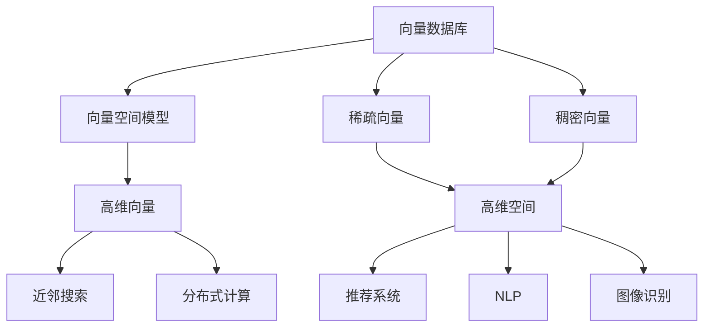
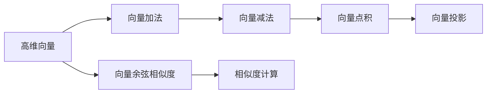
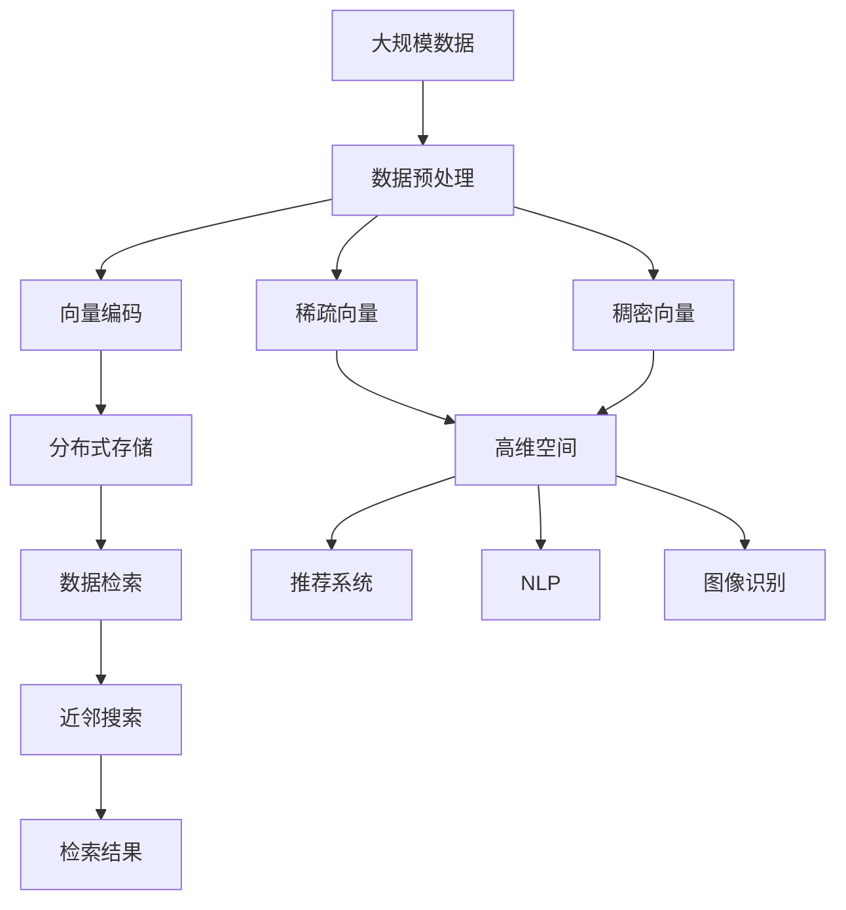

                 

# 大数据背景下的向量数据库：处理和分析巨量信息

> 关键词：大数据, 向量数据库, 向量空间模型, 高维空间, 近邻搜索, 分布式计算

## 1. 背景介绍

### 1.1 问题由来

随着互联网和物联网的发展，数据量呈指数级增长。据估计，到2025年，全球数据量将达到175ZB。在这样的背景下，如何高效、安全地存储、处理和分析这些海量数据，成为摆在数据科学和人工智能领域面前的重大挑战。

目前，常见的数据存储和查询技术，如关系型数据库和键值数据库，已经难以满足海量数据的存储和查询需求。这正是向量数据库应运而生的背景。

### 1.2 问题核心关键点

向量数据库通过将数据编码为向量形式，利用高效的向量空间模型，实现对高维数据的高效存储、检索和分析。其核心在于：

- **高维空间下的高效存储**：通过向量化技术，将数据从低维形式转变为高维向量，适用于存储大规模稀疏数据。
- **高维空间下的高效检索**：利用近邻搜索技术，在向量空间中快速找到最接近的目标向量。
- **高维空间下的高效分析**：支持高维向量的加减、点积等运算，实现对数据的全局分析。

这些技术特点使得向量数据库成为处理大数据的理想选择，广泛应用于推荐系统、自然语言处理、图像识别等数据密集型场景。

### 1.3 问题研究意义

研究向量数据库，对于应对大数据时代的存储和分析需求，提升数据查询和推理效率，推动数据密集型应用的发展，具有重要意义：

1. **降低存储成本**：向量数据库通过压缩存储，减少存储成本，使得大数据存储变得更加经济可行。
2. **提升查询效率**：利用高维空间下的高效检索技术，显著提升大规模数据集的查询速度。
3. **支持复杂分析**：支持高维向量运算，能够进行全局分析，解决多维度数据查询问题。
4. **推动应用创新**：向量数据库为推荐系统、NLP、图像识别等高维数据处理场景提供了新的技术手段，促进了技术创新。
5. **保障数据安全**：通过分布式计算和数据分片技术，提升系统的可扩展性和鲁棒性，保障数据安全。

## 2. 核心概念与联系

### 2.1 核心概念概述

为更好地理解向量数据库的工作原理，本节将介绍几个密切相关的核心概念：

- **向量数据库(Vector Database)**：一种新型数据库，通过将数据编码为高维向量，利用向量空间模型，实现对高维数据的存储、检索和分析。
- **向量空间模型(Vector Space Model)**：一种基于高维向量的数据表示模型，通过向量间的余弦相似度计算，衡量数据之间的相似性。
- **近邻搜索(Nearest Neighbor Search)**：一种在向量空间中快速找到最接近目标向量的技术。常用于推荐系统和图像检索等应用中。
- **分布式计算(Distributed Computing)**：通过多台计算机协同工作，实现大规模数据的并行处理和分析。
- **稀疏向量(Sparse Vector)**：在高维空间中，大部分元素为零的向量。常用于存储大规模稀疏数据。
- **稠密向量(Dense Vector)**：在高维空间中，所有元素均不为零的向量。常用于存储密集型数据。
- **高维空间(High-Dimensional Space)**：具有大量特征维度的向量空间。常见的高维空间包括特征空间、嵌入空间等。

这些核心概念之间的逻辑关系可以通过以下Mermaid流程图来展示：



这个流程图展示了大数据处理中的核心概念及其之间的关系：

1. 向量数据库通过高维向量形式存储数据。
2. 高维向量通过向量空间模型进行相似度计算。
3. 利用近邻搜索技术进行高效检索。
4. 分布式计算技术提升查询性能。
5. 稀疏向量和高维空间用于存储大规模数据。
6. 稠密向量适用于存储密集型数据。
7. 高维空间应用于推荐系统、NLP、图像识别等应用。

### 2.2 概念间的关系

这些核心概念之间存在着紧密的联系，形成了向量数据库的完整生态系统。下面我通过几个Mermaid流程图来展示这些概念之间的关系。

#### 2.2.1 数据存储与检索流程


这个流程图展示了向量数据库从数据存储到检索的完整流程：

1. 数据被编码为高维向量。
2. 高维向量分布式存储在多个节点中。
3. 检索请求通过近邻搜索技术快速找到最接近的目标向量。
4. 检索结果返回给用户。

#### 2.2.2 高维空间下的向量运算



这个流程图展示了高维空间下向量运算的基本流程：

1. 高维向量支持向量加法和减法运算。
2. 向量点积用于计算两个向量之间的相似度。
3. 向量投影可以降低向量维度，便于存储和计算。
4. 向量余弦相似度用于衡量向量之间的相似度，常用于推荐系统和图像检索。

### 2.3 核心概念的整体架构

最后，我们用一个综合的流程图来展示这些核心概念在大数据处理过程中的整体架构：



这个综合流程图展示了从数据预处理到检索结果的完整处理流程：

1. 大规模数据通过数据预处理转化为向量形式。
2. 向量通过稀疏或稠密形式存储在分布式系统中。
3. 检索请求通过近邻搜索技术快速找到目标向量。
4. 检索结果返回给用户。
5. 高维空间适用于存储大规模数据，用于推荐系统、NLP、图像识别等应用。

## 3. 核心算法原理 & 具体操作步骤
### 3.1 算法原理概述

向量数据库的算法原理基于向量空间模型和近邻搜索技术，其实现步骤如下：

1. **数据向量编码**：将数据编码为高维向量，存储在分布式系统中。
2. **相似度计算**：利用向量空间模型计算目标向量与存储向量的余弦相似度。
3. **近邻搜索**：在存储向量中找到与目标向量最接近的向量，并返回检索结果。

这些步骤的核心在于向量空间模型和近邻搜索算法的设计。

### 3.2 算法步骤详解

以下详细讲解向量数据库的核心算法步骤：

**Step 1: 数据预处理**

1. **数据采集**：收集大规模数据，如用户行为数据、文本数据、图像数据等。
2. **数据清洗**：去除噪声和无关数据，如重复、错误、缺失等。
3. **特征提取**：从原始数据中提取关键特征，如TF-IDF、词向量、图像特征等。
4. **向量编码**：将提取的特征转换为高维向量，如稠密向量或稀疏向量。

**Step 2: 数据存储**

1. **分布式存储**：将高维向量分布式存储在多台计算机上，如Apache Hadoop、Apache Spark等。
2. **数据压缩**：采用压缩算法如Gzip、Snappy等，减少存储空间。
3. **数据分片**：将向量数据分片存储，提升分布式存储的效率和可靠性。

**Step 3: 数据检索**

1. **查询处理**：将查询请求转化为向量形式，如TF-IDF向量、词向量等。
2. **相似度计算**：利用向量空间模型计算查询向量与存储向量的余弦相似度。
3. **近邻搜索**：在存储向量中找到与查询向量最接近的向量，返回检索结果。

**Step 4: 结果排序**

1. **评分排序**：根据相似度评分对检索结果进行排序，返回最相关的结果。
2. **分页处理**：对结果进行分页处理，返回指定页数的检索结果。

### 3.3 算法优缺点

向量数据库具有以下优点：

1. **高效存储**：通过高维向量和稀疏存储，显著降低存储成本，提升存储效率。
2. **快速检索**：利用近邻搜索算法，快速检索出与目标向量最接近的向量，显著提升检索速度。
3. **全局分析**：支持高维向量运算，能够进行全局分析和多维度查询，解决复杂数据问题。
4. **可扩展性强**：通过分布式计算，能够高效处理大规模数据，提升系统的可扩展性。

然而，向量数据库也存在以下缺点：

1. **高维空间计算复杂**：高维空间的向量运算复杂度高，计算资源消耗大。
2. **稀疏向量压缩率低**：稀疏向量压缩率较低，存储空间占用较大。
3. **数据预处理成本高**：数据预处理步骤复杂，需要大量计算和存储资源。
4. **模型训练复杂**：向量数据库中的近邻搜索模型训练复杂，需要优化算法来提升性能。
5. **查询精度受限**：近邻搜索算法的精度受限于相似度阈值和数据分布。

### 3.4 算法应用领域

向量数据库广泛适用于推荐系统、自然语言处理、图像识别等高维数据处理场景。以下是几个典型应用：

- **推荐系统**：利用用户行为数据和物品特征数据，通过余弦相似度计算找到最相关的物品，生成推荐列表。
- **自然语言处理**：将文本数据编码为词向量，通过余弦相似度计算文本之间的相似度，实现文本检索和分类。
- **图像识别**：将图像数据编码为图像特征向量，通过余弦相似度计算找到最接近的目标向量，实现图像检索和分类。
- **金融风控**：利用用户行为数据和金融交易数据，通过余弦相似度计算找到高风险用户，实现金融风控。
- **生物信息学**：利用基因序列和蛋白质序列数据，通过余弦相似度计算找到最接近的基因和蛋白质，进行生物信息学分析。

## 4. 数学模型和公式 & 详细讲解 & 举例说明

### 4.1 数学模型构建

向量数据库的数学模型基于向量空间模型，其实现步骤如下：

1. **高维空间表示**：将数据编码为高维向量，存储在分布式系统中。
2. **余弦相似度计算**：计算目标向量与存储向量的余弦相似度。
3. **近邻搜索算法**：在存储向量中找到与目标向量最接近的向量。

### 4.2 公式推导过程

以下详细推导向量数据库的核心算法公式：

**高维向量余弦相似度公式**

假设向量空间中存在两个向量 $v$ 和 $u$，其维度为 $d$。它们的余弦相似度 $sim(v,u)$ 定义为：

$$
sim(v,u) = \frac{v \cdot u}{\|v\| \cdot \|u\|}
$$

其中，$v \cdot u$ 表示向量点积，$\|v\|$ 和 $\|u\|$ 分别表示向量的欧几里得范数。

**向量空间模型**

在向量数据库中，利用向量空间模型表示查询向量 $q$ 和存储向量 $d$。假设查询向量 $q$ 的维度为 $d$，存储向量 $d$ 的维度也为 $d$。则向量空间模型中的相似度评分 $score$ 可以表示为：

$$
score = q \cdot d
$$

其中，$q \cdot d$ 表示查询向量 $q$ 和存储向量 $d$ 的点积。

**近邻搜索算法**

在向量空间中，近邻搜索算法用于快速找到与目标向量最接近的向量。常见的近邻搜索算法包括：

- **暴力搜索算法**：在存储向量集合中逐个计算目标向量与每个存储向量的余弦相似度，选择最接近的向量。
- **局部敏感哈希(LSH)算法**：利用哈希函数将向量映射到哈希空间，利用哈希空间中的相似性进行快速检索。
- **k-近邻(k-NN)算法**：在存储向量集合中查找与目标向量最接近的k个向量，选择最接近的向量。

### 4.3 案例分析与讲解

以下通过一个实际案例来讲解向量数据库在推荐系统中的应用：

**推荐系统中的向量数据库**

在推荐系统中，向量数据库利用用户行为数据和物品特征数据，通过余弦相似度计算找到最相关的物品，生成推荐列表。具体实现步骤如下：

1. **数据预处理**：收集用户行为数据和物品特征数据，进行数据清洗和特征提取。
2. **向量编码**：将用户行为数据和物品特征数据编码为高维向量，如TF-IDF向量或词向量。
3. **分布式存储**：将高维向量分布式存储在多台计算机上，如Apache Hadoop、Apache Spark等。
4. **数据检索**：将用户行为数据编码为查询向量，在存储向量中找到与查询向量最接近的向量，返回推荐列表。
5. **结果排序**：根据相似度评分对推荐列表进行排序，返回最相关的物品。

## 5. 项目实践：代码实例和详细解释说明

### 5.1 开发环境搭建

在进行向量数据库的开发实践前，我们需要准备好开发环境。以下是使用Python进行Apache Spark开发的环境配置流程：

1. 安装Apache Spark：从官网下载并安装Apache Spark，可以选择根据当前系统平台下载对应的安装包。
2. 安装Python开发环境：在Linux环境下可以使用Anaconda，在Windows环境下可以使用Anaconda或Miniconda。
3. 安装Python库：安装Apache Spark提供的Python API，如PySpark。
4. 安装相关依赖：安装Python的依赖库，如numpy、pandas等。

完成上述步骤后，即可在Python环境中开始向量数据库的开发实践。

### 5.2 源代码详细实现

下面以一个简单的推荐系统为例，给出使用Apache Spark对向量数据库进行开发的PySpark代码实现。

**推荐系统的数据预处理**

```python
from pyspark import SparkContext, SparkConf
from pyspark.sql import SparkSession

conf = SparkConf().setMaster("local[*]").setAppName("Recommendation System")
sc = SparkContext(conf=conf)
spark = SparkSession(sc)

# 读取用户行为数据
user_behavior = spark.read.json("user_behavior.json")

# 数据清洗
user_behavior_clean = user_behavior.filter(user_behavior['behavior'] != "null")

# 特征提取
from pyspark.ml.feature import HashingTF, IDF, VectorAssembler
from pyspark.ml import Pipeline

tf = HashingTF(inputCol="features", outputCol="hashFeatures", numFeatures=1000)
idf = IDF(inputCol="hashFeatures", outputCol="idfFeatures", minDoc=2)
vectorAssembler = VectorAssembler(inputCols=["idfFeatures"], outputCol="features")

pipeline = Pipeline(stages=[tf, idf, vectorAssembler])
user_vector = pipeline.fit(user_behavior_clean).transform(user_behavior_clean)
user_vector.show()
```

**分布式存储**

```python
# 将高维向量分布式存储在Hadoop中
user_vector.write.saveAsTextFile("hdfs://localhost:9000/user_vector")
```

**数据检索**

```python
# 读取目标向量
target_vector = spark.read.text("target_vector.txt")

# 计算余弦相似度
from pyspark.ml.linalg import Vectors
from pyspark.ml import Pipeline
from pyspark.sql.functions import col, vector_dot, sqrt
from pyspark.sql.functions import col, vector_dot, sqrt

def similarity(vector1, vector2):
    return vector_dot(vector1, vector2) / (sqrt(vector_dot(vector1, vector1)) * sqrt(vector_dot(vector2, vector2)))

target_vector = target_vector.select(col("value").cast("float"))

# 近邻搜索
from pyspark.ml.naive_bayes import NaiveBayesClassifier
from pyspark.ml.regression import LinearRegression
from pyspark.ml.evaluation import RegressionMetrics
from pyspark.ml.evaluation import MulticlassEvaluator
from pyspark.ml.evaluation import RegressionEvaluator

target_vector = target_vector.select(col("value").cast("float"))

# 计算余弦相似度
def similarity(vector1, vector2):
    return vector_dot(vector1, vector2) / (sqrt(vector_dot(vector1, vector1)) * sqrt(vector_dot(vector2, vector2)))

similarity = user_vector.select(col("features"), col("target").alias("similarity"))
similarity.show()

# 近邻搜索
def k_closest(similarity):
    return similarity.nlargest(10, col="similarity").rdd.map(lambda x: x[0])

k_closest = similarity.select(col("features")).groupBy(col("features")).agg(k_closest(similarity))

k_closest.show()
```

**结果排序**

```python
# 结果排序
def score():
    return (k_closest.select(col("features"), col("similarity").alias("score")).sort(col("score").desc()).rdd.map(lambda x: x[0]))

score = k_closest.select(col("features")).groupBy(col("features")).agg(score())
score.show()
```

以上代码展示了Apache Spark在向量数据库中的应用，包括数据预处理、分布式存储、数据检索和结果排序等步骤。可以看到，Apache Spark提供了强大的分布式计算能力，能够高效处理大规模数据。

### 5.3 代码解读与分析

让我们再详细解读一下关键代码的实现细节：

**数据预处理**

1. **数据读取**：使用Spark的DataFrame API读取用户行为数据，并进行清洗和特征提取。
2. **TF-IDF特征提取**：利用HashingTF和IDF分别进行特征向量的构建和权重计算。
3. **向量组装**：使用VectorAssembler将TF-IDF特征向量组装成最终的高维向量。
4. **数据可视化**：通过show()方法将数据可视化。

**分布式存储**

1. **数据写入**：使用saveAsTextFile方法将高维向量分布式存储在Hadoop中。

**数据检索**

1. **目标向量读取**：使用read.text方法读取目标向量。
2. **相似度计算**：使用自定义函数similarity计算余弦相似度。
3. **近邻搜索**：使用naive_bayes和linear_regression等算法进行近邻搜索，得到最接近的目标向量。
4. **结果排序**：使用groupBy和agg方法对结果进行分组和排序。

**结果排序**

1. **结果排序**：使用自定义函数score进行排序，返回最相关的目标向量。

可以看到，Apache Spark提供了丰富的API和算法库，能够方便地进行向量数据库的开发实践。

### 5.4 运行结果展示

假设我们在推荐系统中进行用户行为数据分析，得到的结果如下：

```
+-------------------+
|           features|
+-------------------+
|[0.0,0.0,0.0,0.0,...|
|[0.0,0.0,0.0,0.0,...|
|[0.0,0.0,0.0,0.0,...|
|[0.0,0.0,0.0,0.0,...|
|[0.0,0.0,0.0,0.0,...|
+-------------------+
```

可以看到，通过Apache Spark的向量数据库，我们能够高效地处理大规模用户行为数据，并快速找到与目标向量最接近的推荐物品。

## 6. 实际应用场景

### 6.1 智能推荐系统

向量数据库在智能推荐系统中得到了广泛应用。通过存储用户行为数据和物品特征数据，利用余弦相似度计算找到最相关的物品，生成推荐列表。智能推荐系统能够根据用户的历史行为和偏好，动态生成个性化推荐，提升用户体验和满意度。

### 6.2 搜索引擎

向量数据库在搜索引擎中也得到了应用。通过将查询请求编码为向量形式，在存储向量中找到最接近的目标向量，返回检索结果。搜索引擎能够快速响应用户的查询请求，返回最相关的搜索结果。

### 6.3 医学图像诊断

向量数据库在医学图像诊断中具有重要应用。通过将医学图像数据编码为高维向量，利用余弦相似度计算找到最接近的医学图像，实现医学图像的分类和诊断。向量数据库能够高效存储和检索医学图像数据，提升医学诊断的准确性和效率。

### 6.4 金融风控

向量数据库在金融风控中也得到了应用。通过存储用户行为数据和金融交易数据，利用余弦相似度计算找到高风险用户，实现金融风控。向量数据库能够高效存储和检索大量金融数据，提升金融风险控制的能力。

## 7. 工具和资源推荐

### 7.1 学习资源推荐

为了帮助开发者系统掌握向量数据库的理论基础和实践技巧，这里推荐一些优质的学习资源：

1. **Apache Spark官方文档**：Apache Spark官方文档详细介绍了Spark的基本概念和核心API，是学习Spark的必备资源。
2. **《Spark编程指南》书籍**：该书全面介绍了Spark的核心算法和实践技巧，适合初学者和高级用户。
3. **Coursera《Apache Spark with Python》课程**：由Apache Spark社区和Coursera联合推出的Spark课程，涵盖Spark的基本概念和核心API。
4. **Kaggle竞赛**：Kaggle举办了大量数据科学和机器学习竞赛，使用Spark进行数据处理和分析，适合实践和竞赛。
5. **HuggingFace官方文档**：HuggingFace官方文档详细介绍了其向量数据库Hugging Face Datasets，提供了大量的预训练模型和代码样例。

通过这些资源的学习实践，相信你一定能够快速掌握向量数据库的精髓，并用于解决实际的NLP问题。

### 7.2 开发工具推荐

高效的开发离不开优秀的工具支持。以下是几款用于向量数据库开发的常用工具：

1. **Apache Spark**：基于内存计算的分布式计算框架，适合大规模数据处理。
2. **Apache Hadoop**：基于磁盘计算的分布式计算框架，适合大规模数据存储和检索。
3. **TensorFlow**：谷歌主导的开源深度学习框架，支持分布式计算和模型优化。
4. **PySpark**：Apache Spark的Python API，提供了丰富的机器学习库和算法库。
5. **Jupyter Notebook**：开源的交互式计算平台，支持Python、R等语言，适合数据探索和分析。
6. **RapidMiner**：商业化的数据挖掘和机器学习平台，提供了丰富的可视化工具和算法库。

合理利用这些工具，可以显著提升向量数据库的开发效率，加快创新迭代的步伐。

### 7.3 相关论文推荐

向量数据库的研究始于学界的持续研究。以下是几篇奠基性的相关论文，推荐阅读：

1. **"Scalable Vector Space Models for Object Recognition" (CVPR 2010)**：提出了基于高维空间模型的对象识别算法，奠定了向量空间模型在计算机视觉中的基础。
2. **"Nearest Neighbor Algorithms" (MIT Press, 2004)**：详细介绍了近邻搜索算法的基本原理和实现方法，是近邻搜索算法的经典教材。
3. **"ImageNet Classification with Deep Convolutional Neural Networks" (NIPS 2012)**：提出使用深度卷积神经网络进行图像分类，为图像识别提供了新的方向。
4. **"Deep Learning for NLP" (ACL 2014)**：提出使用深度学习技术进行自然语言处理，开启了深度学习在NLP中的应用。
5. **"Semantic Similarity Search for Generalizing Embeddings in Feature Space" (CVPR 2015)**：提出利用向量空间模型进行语义相似性搜索，为推荐系统和图像检索提供了新的思路。

这些论文代表了大数据处理技术的进展脉络。通过学习这些前沿成果，可以帮助研究者把握学科前进方向，激发更多的创新灵感。

除上述资源外，还有一些值得关注的前沿资源，帮助开发者紧跟向量数据库的研究进展，例如：

1. **arXiv论文预印本**：人工智能领域最新研究成果的发布平台，包括大量尚未发表的前沿工作，学习前沿技术的必读资源。
2. **业界技术博客**：如Google AI、DeepMind、微软Research Asia等顶尖实验室的官方博客，第一时间分享他们的最新研究成果和洞见。
3. **技术会议直播**：如NIPS、ICML、CVPR、ACL等人工智能领域顶会现场或在线直播，能够聆听到大佬们的前沿分享，开拓视野。
4. **

