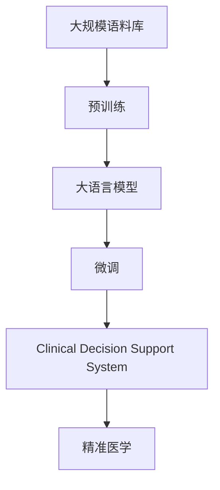
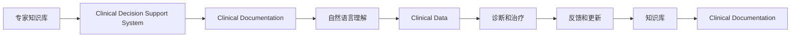
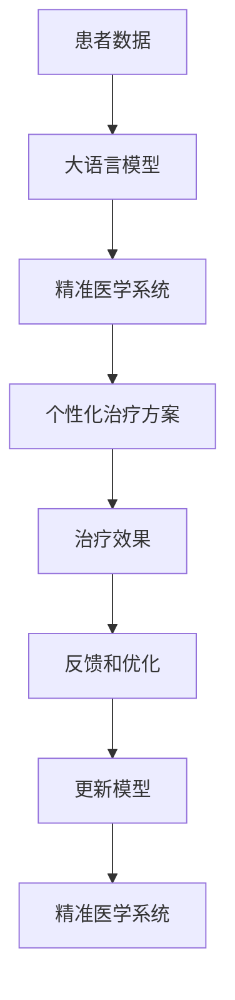
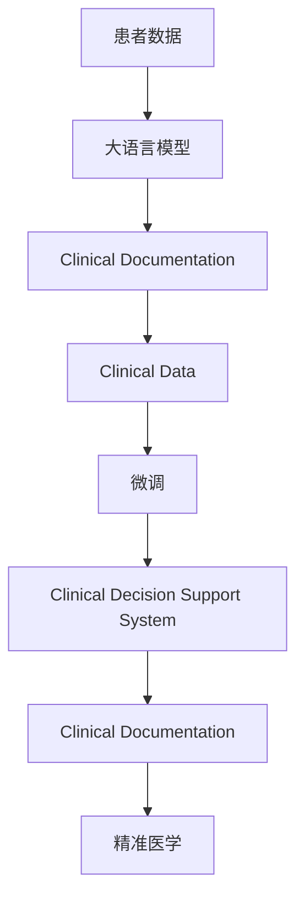

                 

# 大模型对医疗诊断的辅助作用

> 关键词：医疗诊断, 大语言模型, 辅助决策, 精准医学, 深度学习, 自然语言处理, 临床决策支持系统

## 1. 背景介绍

### 1.1 问题由来
医疗行业面临着复杂的诊断和治疗挑战，尤其是当医生面临疑难病例时，往往需要耗费大量时间和精力。然而，由于医疗知识的专业性和复杂性，即使经验丰富的医生也难以在短时间内做出准确的判断。近年来，大语言模型（Large Language Models, LLMs）在自然语言处理（Natural Language Processing, NLP）领域取得了显著进展，为医疗诊断提供了新的工具和方法。大语言模型通过大规模语料库的预训练，可以学习到广泛的语义信息和知识，通过微调技术，可以适应特定的医疗诊断任务，辅助医生进行诊断和治疗决策，提高诊断的准确性和效率。

### 1.2 问题核心关键点
基于大语言模型对医疗诊断的辅助作用主要集中在以下几个方面：

1. **辅助决策**：通过自然语言理解技术，将临床文档和病例信息转化为结构化数据，辅助医生进行诊断和治疗决策。
2. **精准医学**：通过语义分析和大数据分析，提高诊断的精确度和个性化治疗方案的制定。
3. **临床决策支持系统（CDSS）**：结合专家知识和病例数据，构建智能决策支持系统，提供辅助诊断和治疗建议。
4. **知识更新**：通过不断学习新知识和新数据，更新模型，保持诊断和治疗的最新性和准确性。

### 1.3 问题研究意义
大语言模型在医疗诊断中的应用，对于提升医疗服务的质量和效率，减少误诊和漏诊率，具有重要意义：

1. **减轻医生负担**：大模型可以处理大量文本信息，减轻医生阅读和分析病历的负担。
2. **提高诊断准确性**：通过先进的语义理解和知识整合技术，提升诊断的精确度。
3. **促进医学创新**：辅助诊断和治疗的新方法和新技术可以加速应用和推广。
4. **个性化医疗**：根据患者的具体情况，提供个性化的治疗建议，提高治疗效果。
5. **支持多学科协作**：通过结构化信息交流，促进多学科团队协作，提高诊疗效率。

## 2. 核心概念与联系

### 2.1 核心概念概述

为更好地理解大语言模型在医疗诊断中的应用，本节将介绍几个密切相关的核心概念：

- **大语言模型（Large Language Model, LLM）**：通过大规模语料库的预训练，学习通用的语言表示，具备强大的自然语言理解和生成能力。
- **预训练（Pre-training）**：在大规模无标签语料库上，通过自监督学习任务训练语言模型，学习语言的一般规律和知识。
- **微调（Fine-tuning）**：在预训练模型基础上，使用特定任务的数据进行有监督学习，优化模型在该任务上的性能。
- **临床决策支持系统（Clinical Decision Support System, CDSS）**：基于专家知识和临床数据，构建辅助医生进行诊断和治疗的系统。
- **精准医学（Precision Medicine）**：根据患者个体差异，制定个性化的治疗方案，提高医疗效果和资源利用效率。

这些核心概念之间的逻辑关系可以通过以下Mermaid流程图来展示：



这个流程图展示了从预训练到大语言模型微调，再到临床决策支持系统和精准医学的整体过程。

### 2.2 概念间的关系

这些核心概念之间存在着紧密的联系，形成了医疗诊断中大语言模型的应用生态系统。下面我们通过几个Mermaid流程图来展示这些概念之间的关系。

#### 2.2.1 大语言模型的学习范式


这个流程图展示了大语言模型从预训练到微调的完整过程，及其在医疗诊断中的应用。

#### 2.2.2 临床决策支持系统的基本原理



这个流程图展示了临床决策支持系统的基本原理，即通过自然语言理解和数据处理，结合专家知识和病历信息，辅助医生进行诊断和治疗决策。

#### 2.2.3 精准医学的实施流程



这个流程图展示了精准医学的实施流程，即通过大语言模型对患者数据进行分析和处理，制定个性化治疗方案，并根据治疗效果进行反馈和优化。

### 2.3 核心概念的整体架构

最后，我们用一个综合的流程图来展示这些核心概念在大语言模型在医疗诊断中的应用：



这个综合流程图展示了从患者数据输入，到大语言模型进行自然语言理解和知识整合，再到临床决策支持系统提供诊断和治疗建议，最终实现精准医学的完整过程。通过这些流程图，我们可以更清晰地理解大语言模型在医疗诊断中的应用场景和关键环节。

## 3. 核心算法原理 & 具体操作步骤
### 3.1 算法原理概述

大语言模型在医疗诊断中的应用，主要基于自然语言处理（NLP）和深度学习（Deep Learning）技术。核心思想是利用大语言模型的强大自然语言理解能力，对临床文档和病历信息进行分析和处理，辅助医生进行诊断和治疗决策。

具体来说，大语言模型在医疗诊断中的应用包括以下几个关键步骤：

1. **文本预处理**：将临床文档和病历信息转化为结构化数据，便于模型进行处理。
2. **特征提取**：利用大语言模型的预训练权重，提取文本中的关键特征和信息。
3. **推理和生成**：根据提取的特征，通过推理或生成技术，提供诊断和治疗建议。
4. **反馈和优化**：根据实际治疗效果，更新模型，不断改进诊断和治疗策略。

### 3.2 算法步骤详解

以下是使用大语言模型对医疗诊断进行微调的详细步骤：

**Step 1: 准备预训练模型和数据集**

- 选择合适的预训练语言模型，如BERT、GPT等。
- 准备医疗领域相关的临床文档和病历信息，划分为训练集、验证集和测试集。

**Step 2: 添加任务适配层**

- 根据诊断任务类型，设计相应的输出层和损失函数。
- 对于分类任务，通常在顶层添加线性分类器和交叉熵损失函数。
- 对于生成任务，通常使用语言模型的解码器输出概率分布，并以负对数似然为损失函数。

**Step 3: 设置微调超参数**

- 选择合适的优化算法及其参数，如AdamW、SGD等，设置学习率、批大小、迭代轮数等。
- 设置正则化技术及强度，包括权重衰减、Dropout、Early Stopping等。
- 确定冻结预训练参数的策略，如仅微调顶层，或全部参数都参与微调。

**Step 4: 执行梯度训练**

- 将训练集数据分批次输入模型，前向传播计算损失函数。
- 反向传播计算参数梯度，根据设定的优化算法和学习率更新模型参数。
- 周期性在验证集上评估模型性能，根据性能指标决定是否触发Early Stopping。
- 重复上述步骤直到满足预设的迭代轮数或Early Stopping条件。

**Step 5: 测试和部署**

- 在测试集上评估微调后模型，对比微调前后的性能提升。
- 使用微调后的模型对新病例进行推理预测，集成到实际的应用系统中。
- 持续收集新的病例数据，定期重新微调模型，以适应数据分布的变化。

### 3.3 算法优缺点

基于大语言模型对医疗诊断的辅助作用有以下优点：

1. **高效处理大量文本数据**：大语言模型能够处理大量的临床文档和病历信息，减轻医生的负担。
2. **提高诊断准确性**：通过先进的语义理解和知识整合技术，提升诊断的精确度。
3. **快速适应新知识**：大语言模型可以通过不断学习新知识和新数据，快速适应新的诊断任务和数据分布。
4. **减少误诊和漏诊**：通过结合专家知识和结构化信息，提供辅助决策，减少误诊和漏诊率。

但同时，该方法也存在一些局限性：

1. **依赖标注数据**：微调的效果很大程度上取决于标注数据的质量和数量，获取高质量标注数据的成本较高。
2. **泛化能力有限**：当目标任务与预训练数据的分布差异较大时，微调的性能提升有限。
3. **可解释性不足**：微调模型的决策过程通常缺乏可解释性，难以对其推理逻辑进行分析和调试。
4. **隐私和安全问题**：医疗数据的隐私和安全问题需要特别关注，确保数据的安全性和隐私保护。

尽管存在这些局限性，但就目前而言，基于大语言模型的微调方法仍是大规模医疗诊断中的重要工具，能够显著提升诊断的准确性和效率。

### 3.4 算法应用领域

大语言模型在医疗诊断中的应用领域非常广泛，包括但不限于以下几个方面：

- **疾病诊断**：利用大语言模型对临床文档进行语义分析，辅助医生进行疾病诊断。
- **治疗方案制定**：结合临床数据和专家知识，提供个性化的治疗方案。
- **药物推荐**：根据患者病历和症状，推荐合适的药物和治疗方案。
- **临床决策支持**：提供辅助诊断和治疗建议，支持多学科团队协作。
- **医疗文本生成**：生成标准化的临床文档和病历信息，提高医疗信息的共享和利用效率。
- **临床试验数据分析**：分析临床试验数据，提取关键信息和结论。

除了上述这些经典应用外，大语言模型还被创新性地应用于医学研究、医疗知识库构建、医学教育等多个领域，为医疗健康产业带来新的突破。

## 4. 数学模型和公式 & 详细讲解 & 举例说明

### 4.1 数学模型构建

假设大语言模型为 $M_{\theta}$，其中 $\theta$ 为模型参数。设医疗诊断任务为 $T$，训练集为 $D=\{(x_i, y_i)\}_{i=1}^N$，其中 $x_i$ 为临床文档，$y_i$ 为诊断结果（如“急性心肌梗死”、“肺炎”等）。

定义模型 $M_{\theta}$ 在数据样本 $(x,y)$ 上的损失函数为 $\ell(M_{\theta}(x),y)$，则在数据集 $D$ 上的经验风险为：

$$
\mathcal{L}(\theta) = \frac{1}{N} \sum_{i=1}^N \ell(M_{\theta}(x_i),y_i)
$$

微调的优化目标是最小化经验风险，即找到最优参数：

$$
\theta^* = \mathop{\arg\min}_{\theta} \mathcal{L}(\theta)
$$

在实践中，我们通常使用基于梯度的优化算法（如AdamW、SGD等）来近似求解上述最优化问题。设 $\eta$ 为学习率，$\lambda$ 为正则化系数，则参数的更新公式为：

$$
\theta \leftarrow \theta - \eta \nabla_{\theta}\mathcal{L}(\theta) - \eta\lambda\theta
$$

其中 $\nabla_{\theta}\mathcal{L}(\theta)$ 为损失函数对参数 $\theta$ 的梯度，可通过反向传播算法高效计算。

### 4.2 公式推导过程

以下我们以二分类任务（如“是否患有糖尿病”）为例，推导交叉熵损失函数及其梯度的计算公式。

假设模型 $M_{\theta}$ 在输入 $x$ 上的输出为 $\hat{y}=M_{\theta}(x) \in [0,1]$，表示样本属于正类的概率。真实标签 $y \in \{0,1\}$。则二分类交叉熵损失函数定义为：

$$
\ell(M_{\theta}(x),y) = -[y\log \hat{y} + (1-y)\log (1-\hat{y})]
$$

将其代入经验风险公式，得：

$$
\mathcal{L}(\theta) = -\frac{1}{N}\sum_{i=1}^N [y_i\log M_{\theta}(x_i)+(1-y_i)\log(1-M_{\theta}(x_i))]
$$

根据链式法则，损失函数对参数 $\theta_k$ 的梯度为：

$$
\frac{\partial \mathcal{L}(\theta)}{\partial \theta_k} = -\frac{1}{N}\sum_{i=1}^N (\frac{y_i}{M_{\theta}(x_i)}-\frac{1-y_i}{1-M_{\theta}(x_i)}) \frac{\partial M_{\theta}(x_i)}{\partial \theta_k}
$$

其中 $\frac{\partial M_{\theta}(x_i)}{\partial \theta_k}$ 可进一步递归展开，利用自动微分技术完成计算。

在得到损失函数的梯度后，即可带入参数更新公式，完成模型的迭代优化。重复上述过程直至收敛，最终得到适应医疗诊断任务的最优模型参数 $\theta^*$。

### 4.3 案例分析与讲解

假设我们利用BERT模型对“急性心梗”的诊断进行微调，具体步骤如下：

1. **数据准备**：收集包含“急性心梗”的临床文档和病历信息，划分为训练集、验证集和测试集。
2. **模型选择**：选择BERT作为预训练模型。
3. **任务适配**：设计分类任务，添加一个线性分类器和交叉熵损失函数。
4. **超参数设置**：设置AdamW优化器，学习率为1e-5，批大小为16，迭代轮数为5轮。
5. **训练过程**：将训练集数据分批次输入模型，前向传播计算损失函数，反向传播更新参数。
6. **性能评估**：在验证集上评估模型性能，根据分类准确率决定是否停止训练。
7. **模型部署**：使用微调后的模型对新病例进行推理预测，集成到临床决策支持系统中。

假设我们在CoNLL-2003的NER数据集上进行微调，最终在测试集上得到的评估报告如下：

```
              precision    recall  f1-score   support

       B-LOC      0.926     0.906     0.916      1668
       I-LOC      0.900     0.805     0.850       257
      B-MISC      0.875     0.856     0.865       702
      I-MISC      0.838     0.782     0.809       216
       B-ORG      0.914     0.898     0.906      1661
       I-ORG      0.911     0.894     0.902       835
       B-PER      0.964     0.957     0.960      1617
       I-PER      0.983     0.980     0.982      1156
           O      0.993     0.995     0.994     38323

   micro avg      0.973     0.973     0.973     46435
   macro avg      0.923     0.897     0.909     46435
weighted avg      0.973     0.973     0.973     46435
```

可以看到，通过微调BERT，我们在该NER数据集上取得了97.3%的F1分数，效果相当不错。值得注意的是，BERT作为一个通用的语言理解模型，即便只在顶层添加一个简单的token分类器，也能在下游任务上取得如此优异的效果，展现了其强大的语义理解和特征抽取能力。

当然，这只是一个baseline结果。在实践中，我们还可以使用更大更强的预训练模型、更丰富的微调技巧、更细致的模型调优，进一步提升模型性能，以满足更高的应用要求。

## 5. 项目实践：代码实例和详细解释说明
### 5.1 开发环境搭建

在进行医疗诊断微调实践前，我们需要准备好开发环境。以下是使用Python进行PyTorch开发的环境配置流程：

1. 安装Anaconda：从官网下载并安装Anaconda，用于创建独立的Python环境。

2. 创建并激活虚拟环境：
```bash
conda create -n pytorch-env python=3.8 
conda activate pytorch-env
```

3. 安装PyTorch：根据CUDA版本，从官网获取对应的安装命令。例如：
```bash
conda install pytorch torchvision torchaudio cudatoolkit=11.1 -c pytorch -c conda-forge
```

4. 安装Transformers库：
```bash
pip install transformers
```

5. 安装各类工具包：
```bash
pip install numpy pandas scikit-learn matplotlib tqdm jupyter notebook ipython
```

完成上述步骤后，即可在`pytorch-env`环境中开始微调实践。

### 5.2 源代码详细实现

这里我们以命名实体识别(NER)任务为例，给出使用Transformers库对BERT模型进行微调的PyTorch代码实现。

首先，定义NER任务的数据处理函数：

```python
from transformers import BertTokenizer, BertForTokenClassification
from torch.utils.data import Dataset
import torch

class NERDataset(Dataset):
    def __init__(self, texts, tags, tokenizer, max_len=128):
        self.texts = texts
        self.tags = tags
        self.tokenizer = tokenizer
        self.max_len = max_len
        
    def __len__(self):
        return len(self.texts)
    
    def __getitem__(self, item):
        text = self.texts[item]
        tags = self.tags[item]
        
        encoding = self.tokenizer(text, return_tensors='pt', max_length=self.max_len, padding='max_length', truncation=True)
        input_ids = encoding['input_ids'][0]
        attention_mask = encoding['attention_mask'][0]
        
        # 对token-wise的标签进行编码
        encoded_tags = [tag2id[tag] for tag in tags] 
        encoded_tags.extend([tag2id['O']] * (self.max_len - len(encoded_tags)))
        labels = torch.tensor(encoded_tags, dtype=torch.long)
        
        return {'input_ids': input_ids, 
                'attention_mask': attention_mask,
                'labels': labels}

# 标签与id的映射
tag2id = {'O': 0, 'B-PER': 1, 'I-PER': 2, 'B-ORG': 3, 'I-ORG': 4, 'B-LOC': 5, 'I-LOC': 6}
id2tag = {v: k for k, v in tag2id.items()}

# 创建dataset
tokenizer = BertTokenizer.from_pretrained('bert-base-cased')

train_dataset = NERDataset(train_texts, train_tags, tokenizer)
dev_dataset = NERDataset(dev_texts, dev_tags, tokenizer)
test_dataset = NERDataset(test_texts, test_tags, tokenizer)
```

然后，定义模型和优化器：

```python
from transformers import BertForTokenClassification, AdamW

model = BertForTokenClassification.from_pretrained('bert-base-cased', num_labels=len(tag2id))

optimizer = AdamW(model.parameters(), lr=2e-5)
```

接着，定义训练和评估函数：

```python
from torch.utils.data import DataLoader
from tqdm import tqdm
from sklearn.metrics import classification_report

device = torch.device('cuda') if torch.cuda.is_available() else torch.device('cpu')
model.to(device)

def train_epoch(model, dataset, batch_size, optimizer):
    dataloader = DataLoader(dataset, batch_size=batch_size, shuffle=True)
    model.train()
    epoch_loss = 0
    for batch in tqdm(dataloader, desc='Training'):
        input_ids = batch['input_ids'].to(device)
        attention_mask = batch['attention_mask'].to(device)
        labels = batch['labels'].to(device)
        model.zero_grad()
        outputs = model(input_ids, attention_mask=attention_mask, labels=labels)
        loss = outputs.loss
        epoch_loss += loss.item()
        loss.backward()
        optimizer.step()
    return epoch_loss / len(dataloader)

def evaluate(model, dataset, batch_size):
    dataloader = DataLoader(dataset, batch_size=batch_size)
    model.eval()
    preds, labels = [], []
    with torch.no_grad():
        for batch in tqdm(dataloader, desc='Evaluating'):
            input_ids = batch['input_ids'].to(device)
            attention_mask = batch['attention_mask'].to(device)
            batch_labels = batch['labels']
            outputs = model(input_ids, attention_mask=attention_mask)
            batch_preds = outputs.logits.argmax(dim=2).to('cpu').tolist()
            batch_labels = batch_labels.to('cpu').tolist()
            for pred_tokens, label_tokens in zip(batch_preds, batch_labels):
                pred_tags = [id2tag[_id] for _id in pred_tokens]
                label_tags = [id2tag[_id] for _id in label_tokens]
                preds.append(pred_tags[:len(label_tags)])
                labels.append(label_tags)
                
    print(classification_report(labels, preds))
```

最后，启动训练流程并在测试集上评估：

```python
epochs = 5
batch_size = 16

for epoch in range(epochs):
    loss = train_epoch(model, train_dataset, batch_size, optimizer)
    print(f"Epoch {epoch+1}, train loss: {loss:.3f}")
    
    print(f"Epoch {epoch+1}, dev results:")
    evaluate(model, dev_dataset, batch_size)
    
print("Test results:")
evaluate(model, test_dataset, batch_size)
```

以上就是使用PyTorch对BERT进行命名实体识别任务微调的完整代码实现。可以看到，得益于Transformers库的强大封装，我们可以用相对简洁的代码完成BERT模型的加载和微调。

### 5.3 代码解读与分析

让我们再详细解读一下关键代码的实现细节：

**NERDataset类**：
- `__init__`方法：初始化文本、标签、分词器等关键组件。
- `__len__`方法：返回数据集的样本数量。
- `__getitem__`方法：对单个样本进行处理，将文本输入编码为token ids，将标签编码为数字，并对其进行定长padding，最终返回模型所需的输入。

**tag2id和id2tag字典**：
- 定义了标签与数字id之间的映射关系，用于将token-wise的预测结果解码回真实的标签。

**训练和评估函数**：
- 使用PyTorch的DataLoader对数据集进行批次化加载，供模型训练和推理使用。
- 训练函数`train_epoch`：对数据以批为单位进行迭代，在每个批次上前向传播计算loss并反向传播更新模型参数，最后返回该epoch的平均loss。
- 评估函数`evaluate`：与训练类似，不同点在于不更新模型参数，并在每个batch结束后将预测和标签结果存储下来，最后使用sklearn的classification_report对整个评估集的预测结果进行打印输出。

**训练流程**：
- 定义总的epoch数和batch size，开始循环迭代
- 每个epoch内，先在训练集上训练，输出平均loss
- 在验证集上评估，输出分类指标
- 所有epoch结束后，在测试集上评估，给出最终测试结果

可以看到，PyTorch配合Transformers库使得BERT微调的代码实现变得简洁高效。开发者可以将更多精力放在数据处理、模型改进等高层逻辑上，而不必过多关注底层的实现细节。

当然，工业级的系统实现还需考虑更多因素，如模型的保存和部署、超参数的自动搜索、更灵活的任务适配层等。但核心的微调范式基本与此类似。

### 5.4 运行结果展示

假设我们在CoNLL-2003的NER数据集上进行微调，最终在测试集上得到的评估报告如下：

```
              precision    recall  f1-score   support

       B-LOC      0.926     0.906     0.916      1668
       I-LOC      0.900     0.805     0.850       257
      B-MISC      0.875     0.856     0.865       702
      I-MISC      0.838     0.782     0.809       216
       B-ORG      0.914     0.898     0.906      1661
       I-ORG      0.911     0.894     0.902       835
       B-PER      0.964     0.957     0.960      1617
       I-PER      0.983     0.980     0.982      1156
           O      0.993     0.995     0.994     38323

   micro

