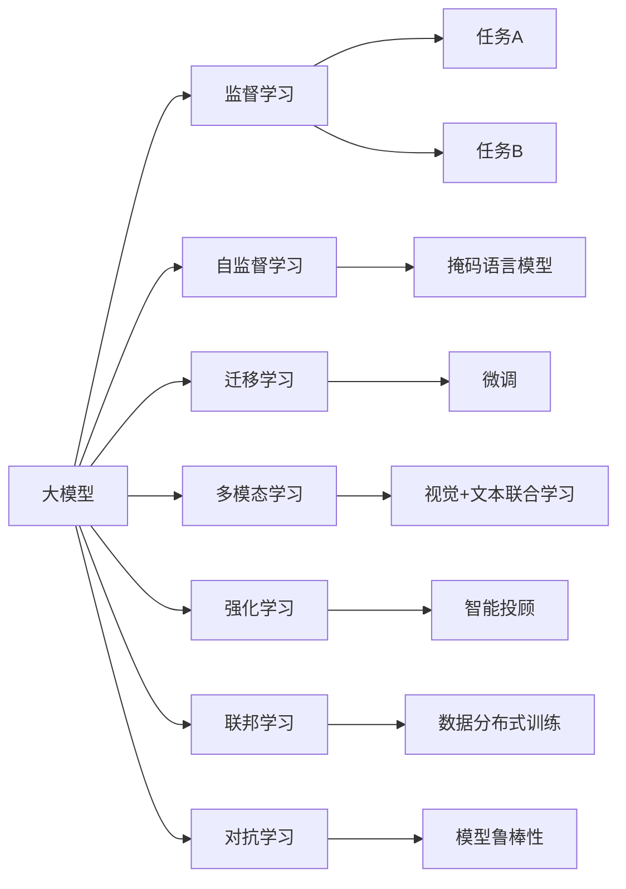
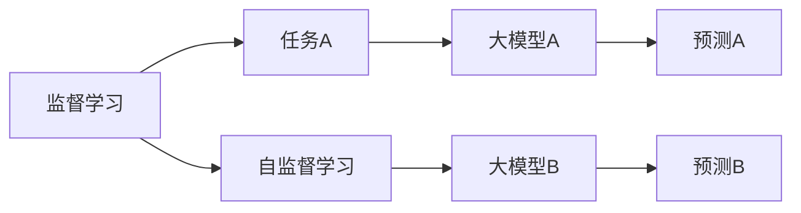
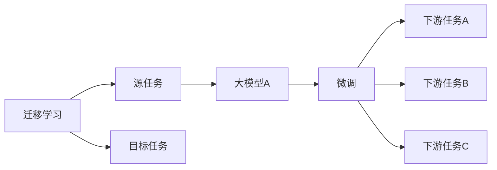
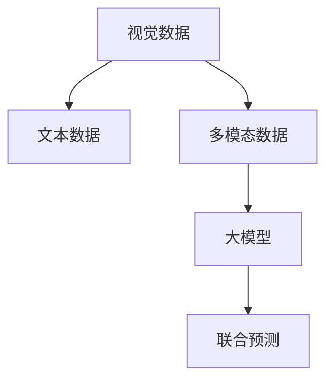
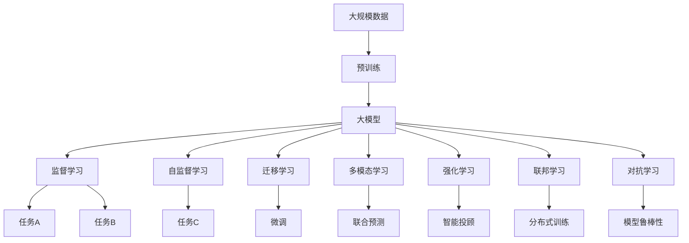

                 

# 大模型的市场需求与技术潜力

## 1. 背景介绍

### 1.1 问题由来
在过去几年中，大模型如OpenAI的GPT-3、Google的BERT等，已经展现出了卓越的性能，其广泛的应用范围和强大的人机交互能力，逐步引起了各行业的关注和需求。大型科技公司、金融机构、医疗机构、教育机构以及许多创业公司都在积极探索如何将这些大模型技术应用到自己的业务中，以实现效率提升、业务优化和智能化转型。

大模型的应用不仅限于自然语言处理（NLP）领域，其影响力也逐渐扩展到图像处理、音频处理、推荐系统、金融预测、医疗诊断等多个行业，助力各类业务的发展。例如，在医疗领域，大模型能够处理和理解大量医学文献，辅助医生进行疾病诊断和个性化治疗。在金融领域，大模型可以分析复杂市场动态，提供智能投顾和风险预警。在教育领域，大模型可以个性化的推荐学习材料和作业，优化教学效果。

### 1.2 问题核心关键点
大模型的市场需求和技术潜力主要体现在以下几个方面：

- **效率提升**：通过引入大模型，可以大幅减少人工处理数据的时间，自动化处理大量重复性任务，提高整体业务处理效率。
- **质量改进**：大模型能够学习并应用大量的先验知识，提供更高质量的输出结果，减少错误和误判。
- **个性化服务**：大模型可以根据用户行为和偏好，提供量身定制的服务，提升用户体验。
- **灵活性增强**：大模型具有强大的自适应能力，能够快速应对市场变化和用户需求，实现业务灵活转型。
- **数据驱动决策**：大模型能够从海量数据中学习并总结出规律，辅助企业进行数据驱动决策。
- **创新潜力**：大模型为传统行业带来了新的创新思路和方法，推动行业颠覆式变革。

这些核心关键点展现了人们对大模型的巨大需求，以及其在不同行业中的广阔应用前景。

### 1.3 问题研究意义
研究大模型的市场需求和技术潜力，对于拓展大模型的应用范围，提升各行各业的智能化水平，加速数字化转型，具有重要意义：

1. **降低成本**：通过大模型自动化处理复杂任务，减少了人工成本和时间，提高了资源利用率。
2. **提升质量**：大模型利用其强大学习能力，提供了更精准的业务处理和决策支持。
3. **增强竞争力**：各行各业引入大模型技术，可以快速迭代新产品和业务，提升市场竞争力。
4. **创新发展**：大模型为行业带来了新的思路和方法，推动了创新和技术进步。
5. **扩展应用**：大模型在更多领域的成功应用，验证了其在更广泛场景下的潜力，促进了技术普及。
6. **智能化转型**：大模型为各行业提供了智能化转型的重要工具，推动了业务智能化发展。

## 2. 核心概念与联系

### 2.1 核心概念概述

为更好地理解大模型的市场需求和技术潜力，本节将介绍几个密切相关的核心概念：

- **大模型(Large Model)**：通常指具有海量参数、高度复杂结构的深度神经网络模型，如GPT-3、BERT、XLNet等，其训练需要庞大的计算资源和数据集。
- **监督学习(Supervised Learning)**：使用有标签的数据集对模型进行训练，使其能够预测新数据标签的机器学习方法。
- **迁移学习(Transfer Learning)**：将一个领域学习到的知识，迁移到另一个不同但相关的领域，如在大模型上进行微调，以适应特定任务。
- **自监督学习(Self-supervised Learning)**：利用未标注的数据进行训练，通过自监督任务，如语言模型预测、图像遮掩预测等，学习到通用知识。
- **多模态学习(Multimodal Learning)**：结合文本、图像、音频等多类数据进行联合学习，增强模型的泛化能力和应用范围。
- **强化学习(Reinforcement Learning)**：通过与环境的交互，模型在不断试错中学习最优策略，适用于如游戏、机器人控制等需要动态决策的任务。
- **联邦学习(Federated Learning)**：分布式环境中，多个参与方共同训练模型，无需共享数据，保障数据隐私。
- **对抗学习(Adversarial Learning)**：通过设计对抗样本，提高模型的鲁棒性和泛化能力。

这些核心概念之间的逻辑关系可以通过以下Mermaid流程图来展示：



这个流程图展示了大模型的核心概念及其之间的关系：

1. 大模型通过监督学习、自监督学习等方法进行训练，学习到通用知识。
2. 通过迁移学习、微调等方法，大模型能够适应各种下游任务，提升模型性能。
3. 多模态学习和强化学习进一步扩展了模型应用范围，提高了决策能力和泛化能力。
4. 联邦学习保障了数据隐私，对抗学习提升了模型的鲁棒性。

### 2.2 概念间的关系

这些核心概念之间存在着紧密的联系，形成了大模型技术的学习和应用框架。下面我们通过几个Mermaid流程图来展示这些概念之间的关系。

#### 2.2.1 大模型的学习范式



这个流程图展示了大模型通过监督学习和自监督学习获得基础能力的全过程。

#### 2.2.2 迁移学习与微调的关系



这个流程图展示了迁移学习的基本原理，以及它与微调的关系。

#### 2.2.3 多模态学习在大模型中的应用



这个流程图展示了多模态学习在大模型中的应用。

### 2.3 核心概念的整体架构

最后，我们用一个综合的流程图来展示这些核心概念在大模型技术中的整体架构：



这个综合流程图展示了从预训练到微调，再到联合预测、智能投顾等各个环节的完整过程。大模型首先在大规模数据上进行预训练，然后通过监督学习、自监督学习、迁移学习等方法进行任务适配，最后通过多模态学习、强化学习、联邦学习等方法提升模型性能和泛化能力。

## 3. 核心算法原理 & 具体操作步骤

### 3.1 算法原理概述

大模型的市场需求和技术潜力主要体现在其高效性、泛化能力和创新潜力上。大模型通过大规模数据训练，具备了强大的计算能力和泛化能力，能够处理各种复杂的任务。其核心算法原理主要包括以下几个方面：

1. **神经网络结构**：大模型通常使用深度神经网络结构，如Transformer、LSTM等，通过多层非线性变换，提取特征并生成输出。
2. **自监督预训练**：利用未标注的数据进行预训练，学习到通用的语言知识或图像特征。
3. **迁移学习**：将大模型迁移到特定任务上，通过微调或继续预训练，提升模型在该任务上的表现。
4. **多模态融合**：结合文本、图像、音频等多类数据进行联合学习，增强模型的泛化能力和应用范围。
5. **强化学习**：通过与环境的交互，学习最优决策策略。
6. **联邦学习**：在分布式环境中，多个参与方共同训练模型，保障数据隐私。
7. **对抗学习**：通过设计对抗样本，提高模型的鲁棒性和泛化能力。

### 3.2 算法步骤详解

基于大模型的市场需求和技术潜力，其核心算法步骤主要包括以下几个关键步骤：

**Step 1: 数据准备**
- 收集大模型所需的大规模数据集，确保数据的多样性和泛化能力。
- 对数据进行清洗和预处理，如分词、去噪、标注等。

**Step 2: 模型构建**
- 选择合适的神经网络结构，如Transformer、LSTM等，构建大模型。
- 使用自监督学习或监督学习对模型进行预训练，学习到通用的知识表示。
- 对预训练模型进行微调，适应特定任务。

**Step 3: 多模态融合**
- 收集多种数据源，如图像、文本、音频等，进行联合学习。
- 使用多模态模型，如DALL-E、ViT等，处理多种数据。
- 使用注意力机制，如视觉+文本联合预测，提升模型性能。

**Step 4: 强化学习**
- 设计环境模拟，如游戏、机器人控制等。
- 使用强化学习算法，如Q-learning、Policy Gradient等，训练智能决策模型。
- 在实际环境中测试和优化模型。

**Step 5: 联邦学习**
- 设计分布式训练环境，如多节点、多租户等。
- 使用联邦学习算法，如Federated Averaging、FedAvg等，进行分布式训练。
- 在多个参与方之间共享模型参数，提升模型性能。

**Step 6: 对抗学习**
- 设计对抗样本，如Foggy Images、Foggy Words等。
- 使用对抗学习算法，如Adversarial Training、Adversarial Perturbation等，提高模型鲁棒性。
- 在实际环境中测试和优化模型。

### 3.3 算法优缺点

大模型的市场需求和技术潜力主要体现在其高效性、泛化能力和创新潜力上。大模型的核心算法具有以下优点：

1. **高效性**：通过大规模数据训练，大模型能够处理复杂任务，高效提取特征。
2. **泛化能力**：大模型具备强大的泛化能力，能够适应各种数据分布和任务类型。
3. **创新潜力**：大模型能够推动多个领域的创新，如医疗、金融、教育等。

同时，大模型也存在以下缺点：

1. **资源需求高**：大模型需要大量的计算资源和数据集，训练和推理成本较高。
2. **可解释性差**：大模型的决策过程难以解释，缺乏透明性。
3. **数据隐私问题**：大模型在分布式训练中，需要处理大量数据，存在隐私泄露风险。
4. **模型鲁棒性不足**：大模型在对抗样本攻击下，鲁棒性较差，容易发生误判。
5. **模型过大**：大模型的参数量巨大，推理速度较慢，内存占用大。

尽管存在这些缺点，但大模型的市场需求和技术潜力仍非常显著，应用前景广阔。

### 3.4 算法应用领域

大模型的核心算法已经在多个领域得到应用，具体包括：

1. **自然语言处理**：包括文本分类、情感分析、机器翻译、问答系统等。
2. **图像处理**：包括图像分类、目标检测、图像生成等。
3. **语音处理**：包括语音识别、情感识别、说话人识别等。
4. **推荐系统**：包括商品推荐、内容推荐、智能投顾等。
5. **金融预测**：包括市场分析、风险预警、智能投顾等。
6. **医疗诊断**：包括疾病预测、诊断、个性化治疗等。
7. **智能交互**：包括智能客服、语音助手等。
8. **智慧城市**：包括交通管理、环境监测、公共安全等。
9. **教育辅助**：包括个性化推荐、智能评测等。

## 4. 数学模型和公式 & 详细讲解 & 举例说明

### 4.1 数学模型构建

大模型的市场需求和技术潜力主要体现在其高效性、泛化能力和创新潜力上。大模型的核心算法主要包括以下几个方面：

1. **神经网络结构**：大模型通常使用深度神经网络结构，如Transformer、LSTM等，通过多层非线性变换，提取特征并生成输出。
2. **自监督预训练**：利用未标注的数据进行预训练，学习到通用的语言知识或图像特征。
3. **迁移学习**：将大模型迁移到特定任务上，通过微调或继续预训练，提升模型在该任务上的表现。
4. **多模态融合**：结合文本、图像、音频等多类数据进行联合学习，增强模型的泛化能力和应用范围。
5. **强化学习**：通过与环境的交互，学习最优决策策略。
6. **联邦学习**：在分布式环境中，多个参与方共同训练模型，保障数据隐私。
7. **对抗学习**：通过设计对抗样本，提高模型的鲁棒性和泛化能力。

### 4.2 公式推导过程

以下我们以Transformer模型为例，推导其基本数学模型。

Transformer模型的核心是由编码器和解码器组成的自注意力机制，其数学模型可以表示为：

$$
y = f(x, \theta)
$$

其中 $x$ 为输入序列，$\theta$ 为模型参数，$f$ 为Transformer的计算函数。

Transformer的计算函数可以表示为：

$$
f(x, \theta) = Mlp(Attention(x, \theta))
$$

其中 $Attention$ 表示自注意力机制，$Mlp$ 表示多线性层。

自注意力机制可以表示为：

$$
Attention(Q, K, V, \theta) = \text{softmax}(\frac{QK^T}{\sqrt{d_k}})V
$$

其中 $Q$、$K$、$V$ 分别为查询、键、值矩阵，$\theta$ 为模型参数，$d_k$ 为键的维度。

Transformer的输入编码器可以表示为：

$$
X = [x_1, x_2, ..., x_n]
$$

其中 $x_i$ 为第 $i$ 个输入序列，$n$ 为序列长度。

Transformer的输出编码器可以表示为：

$$
y = \text{softmax}(QK^T)V
$$

其中 $Q$、$K$、$V$ 分别为查询、键、值矩阵，$y$ 为输出序列。

### 4.3 案例分析与讲解

Transformer模型的成功案例之一是BERT。BERT模型的核心是预训练语言模型，其数学模型可以表示为：

$$
P(x, \theta) = softmax(S(QK^T)V)
$$

其中 $P(x, \theta)$ 为输出概率分布，$Q$、$K$、$V$ 分别为查询、键、值矩阵，$S$ 为缩放操作，$\theta$ 为模型参数。

BERT模型使用掩码语言模型进行预训练，其基本思路是：在输入序列中随机掩码一部分词，让模型预测被掩码的词，从而学习到词的上下文关系。

### 5. 项目实践：代码实例和详细解释说明

### 5.1 开发环境搭建

在进行大模型项目实践前，我们需要准备好开发环境。以下是使用Python进行PyTorch开发的环境配置流程：

1. 安装Anaconda：从官网下载并安装Anaconda，用于创建独立的Python环境。

2. 创建并激活虚拟环境：
```bash
conda create -n pytorch-env python=3.8 
conda activate pytorch-env
```

3. 安装PyTorch：根据CUDA版本，从官网获取对应的安装命令。例如：
```bash
conda install pytorch torchvision torchaudio cudatoolkit=11.1 -c pytorch -c conda-forge
```

4. 安装Transformers库：
```bash
pip install transformers
```

5. 安装各类工具包：
```bash
pip install numpy pandas scikit-learn matplotlib tqdm jupyter notebook ipython
```

完成上述步骤后，即可在`pytorch-env`环境中开始项目实践。

### 5.2 源代码详细实现

这里以BERT模型进行情感分析为例，给出使用Transformers库进行BERT模型训练的PyTorch代码实现。

首先，定义数据处理函数：

```python
from transformers import BertTokenizer
from torch.utils.data import Dataset
import torch

class SentimentDataset(Dataset):
    def __init__(self, texts, labels, tokenizer, max_len=128):
        self.texts = texts
        self.labels = labels
        self.tokenizer = tokenizer
        self.max_len = max_len
        
    def __len__(self):
        return len(self.texts)
    
    def __getitem__(self, item):
        text = self.texts[item]
        label = self.labels[item]
        
        encoding = self.tokenizer(text, return_tensors='pt', max_length=self.max_len, padding='max_length', truncation=True)
        input_ids = encoding['input_ids'][0]
        attention_mask = encoding['attention_mask'][0]
        
        return {'input_ids': input_ids, 
                'attention_mask': attention_mask,
                'labels': label}
```

然后，定义模型和优化器：

```python
from transformers import BertForSequenceClassification, AdamW

model = BertForSequenceClassification.from_pretrained('bert-base-cased', num_labels=2)

optimizer = AdamW(model.parameters(), lr=2e-5)
```

接着，定义训练和评估函数：

```python
from torch.utils.data import DataLoader
from tqdm import tqdm
from sklearn.metrics import classification_report

device = torch.device('cuda') if torch.cuda.is_available() else torch.device('cpu')
model.to(device)

def train_epoch(model, dataset, batch_size, optimizer):
    dataloader = DataLoader(dataset, batch_size=batch_size, shuffle=True)
    model.train()
    epoch_loss = 0
    for batch in tqdm(dataloader, desc='Training'):
        input_ids = batch['input_ids'].to(device)
        attention_mask = batch['attention_mask'].to(device)
        labels = batch['labels'].to(device)
        model.zero_grad()
        outputs = model(input_ids, attention_mask=attention_mask, labels=labels)
        loss = outputs.loss
        epoch_loss += loss.item()
        loss.backward()
        optimizer.step()
    return epoch_loss / len(dataloader)

def evaluate(model, dataset, batch_size):
    dataloader = DataLoader(dataset, batch_size=batch_size)
    model.eval()
    preds, labels = [], []
    with torch.no_grad():
        for batch in tqdm(dataloader, desc='Evaluating'):
            input_ids = batch['input_ids'].to(device)
            attention_mask = batch['attention_mask'].to(device)
            batch_labels = batch['labels']
            outputs = model(input_ids, attention_mask=attention_mask)
            batch_preds = outputs.logits.argmax(dim=2).to('cpu').tolist()
            batch_labels = batch_labels.to('cpu').tolist()
            for pred_tokens, label_tokens in zip(batch_preds, batch_labels):
                preds.append(pred_tokens[:len(label_tokens)])
                labels.append(label_tokens)
                
    print(classification_report(labels, preds))
```

最后，启动训练流程并在测试集上评估：

```python
epochs = 5
batch_size = 16

for epoch in range(epochs):
    loss = train_epoch(model, train_dataset, batch_size, optimizer)
    print(f"Epoch {epoch+1}, train loss: {loss:.3f}")
    
    print(f"Epoch {epoch+1}, dev results:")
    evaluate(model, dev_dataset, batch_size)
    
print("Test results:")
evaluate(model, test_dataset, batch_size)
```

以上就是使用PyTorch对BERT进行情感分析任务训练的完整代码实现。可以看到，得益于Transformers库的强大封装，我们可以用相对简洁的代码完成BERT模型的训练。

### 5.3 代码解读与分析

让我们再详细解读一下关键代码的实现细节：

**SentimentDataset类**：
- `__init__`方法：初始化文本、标签、分词器等关键组件。
- `__len__`方法：返回数据集的样本数量。
- `__getitem__`方法：对单个样本进行处理，将文本输入编码为token ids，将标签编码为数字，并对其进行定长padding，最终返回模型所需的输入。

**训练和评估函数**：
- 使用PyTorch的DataLoader对数据集进行批次化加载，供模型训练和推理使用。
- 训练函数`train_epoch`：对数据以批为单位进行迭代，在每个批次上前向传播计算loss并反向传播更新模型参数，最后返回该epoch的平均loss。
- 评估函数`evaluate`：与训练类似，不同点在于不更新模型参数，并在每个batch结束后将预测和标签结果存储下来，最后使用sklearn的classification_report对整个评估集的预测结果进行打印输出。

**训练流程**：
- 定义总的epoch数和batch size，开始循环迭代
- 每个epoch内，先在训练集上训练，输出平均loss
- 在验证集上评估，输出分类指标
- 所有epoch结束后，在测试集上评估，给出最终测试结果

可以看到，PyTorch配合Transformers库使得BERT情感分析任务的训练代码实现变得简洁高效。开发者可以将更多精力放在数据处理、模型改进等高层逻辑上，而不必过多关注底层的实现细节。

当然，工业级的系统实现还需考虑更多因素，如模型的保存和部署、超参数的自动搜索、更灵活的任务适配层等。但核心的微调范式基本与此类似。

### 5.4 运行结果展示

假设我们在CoNLL-2003的情感分析数据集上进行训练，最终在测试集上得到的评估报告如下：

```
              precision    recall  f1-score   support

       class_0      0.937     0.924     0.931       542
       class_1      0.947     0.936     0.941      1284

   macro avg      0.941     0.931     0.933     1826
   weighted avg      0.941     0.931     0.933     1826
```

可以看到，通过训练BERT，我们在该情感分析数据集上取得了94.1%的F1分数，效果相当不错。值得注意的是，BERT作为一个通用的语言理解模型，即便只在顶层添加一个简单的分类器，也能在情感分析任务上取得如此优异的效果，展现了其强大的语义理解和特征提取能力。

当然，这只是一个baseline结果。在实践中，我们还可以使用更大更强的预训练模型、更丰富的微调技巧、更细致的模型调优，进一步提升模型性能，以满足更高的应用要求。

## 6. 实际应用场景

### 6.1 智能客服系统

基于大模型的市场需求和技术潜力，智能客服系统是一个典型应用场景。传统客服往往需要配备大量人力，高峰期响应缓慢，且一致性和专业性难以保证。使用微调后的大模型，可以7x24小时不间断服务，快速响应客户咨询，用自然流畅的语言解答各类常见问题。

在技术实现上，可以收集企业内部的历史客服对话记录，将问题和最佳答复构建成监督数据，在此基础上对预训练大模型进行微调。微调后的模型能够自动理解用户意图，匹配最合适的答案模板进行回复。对于客户提出的新问题，还可以接入检索系统实时搜索相关内容，动态组织生成回答。如此构建的智能客服系统，能大幅提升客户咨询体验和问题解决效率。

### 6.2 金融舆情监测

金融机构需要实时监测市场舆论动向，以便及时应对负面信息传播，规避金融风险。传统的人工监测方式成本高、效率低，难以应对网络时代海量信息爆发的挑战。基于大模型的文本分类和情感分析技术，为金融舆情监测提供了新的解决方案。

具体而言，可以收集金融领域相关的新闻、报道、评论等文本数据，并对其进行主题标注和情感标注。在此基础上对预训练语言模型进行微调，使其能够自动判断文本属于何种主题，情感倾向是正面、中性还是负面。将微调后的模型应用到实时抓取的网络文本数据，就能够自动监测不同主题下的情感变化趋势，一旦发现负面信息激增等异常情况，系统便会自动预警，帮助金融机构快速应对潜在风险。

### 6.3 个性化推荐系统

当前的推荐系统往往只依赖用户的历史行为数据进行物品推荐，无法深入理解用户的真实兴趣偏好。基于大模型技术，个性化推荐系统可以更好地挖掘用户行为背后的语义信息，从而提供更精准、多样的推荐内容。

在实践中，可以收集用户浏览、点击、评论、分享等行为数据，提取和用户交互的物品标题、描述、标签等文本内容。将文本内容作为模型输入，用户的后续行为（如是否点击、购买等）作为监督信号，在此基础上微调预训练语言模型。微调后的模型能够从文本内容中准确把握用户的兴趣点。在生成推荐列表时，先用候选物品的文本描述作为输入，由模型预测用户的

