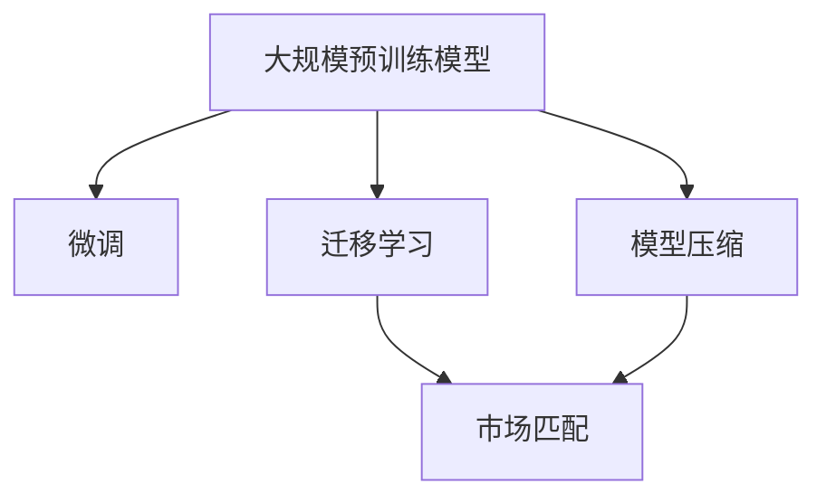
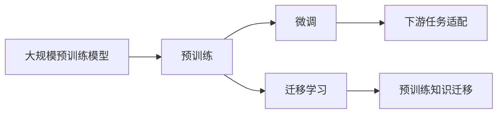
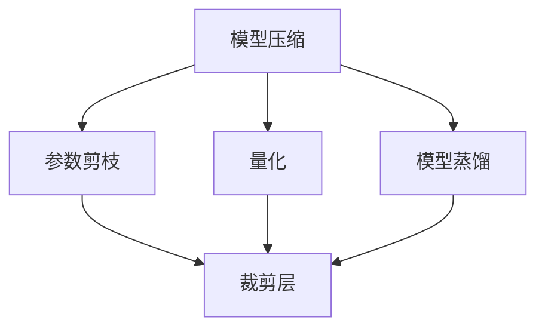
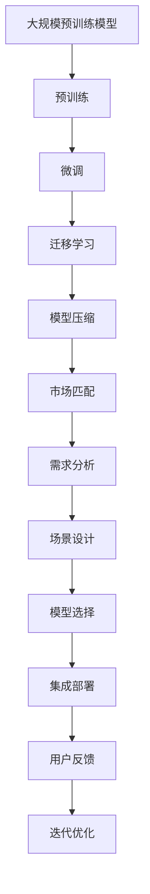

                 

# 大模型的技术发展与市场匹配

> 关键词：大模型, 预训练, 微调, 迁移学习, 模型压缩, 市场匹配

## 1. 背景介绍

### 1.1 问题由来
随着深度学习技术的快速发展，大规模预训练模型在大规模文本数据上进行预训练，学习到了丰富的语言知识和常识，具备了强大的语言理解和生成能力。但这些模型往往具有高昂的训练和部署成本，对计算资源要求极高，无法普及到所有企业，难以达到大规模商业应用。因此，如何降低大模型的技术门槛，使其与市场匹配，成为了当前人工智能领域的一个热点问题。

### 1.2 问题核心关键点
当前，大模型的技术和市场匹配主要面临以下几大挑战：

- **技术门槛高**：大规模预训练模型的训练和部署需要高性能硬件设备，对技术要求极高，难以普及。
- **成本高昂**：大模型需要大量的计算资源和时间，成本高昂，导致其普及度低。
- **应用局限**：虽然大模型在某些NLP任务上表现优异，但其应用场景往往局限于特定领域，缺乏通用性。
- **市场匹配难**：如何在不牺牲模型性能的前提下，将大模型的技术优势转化为实际应用，市场匹配难度大。

本文将详细探讨大模型的技术发展与市场匹配问题，探讨如何通过优化模型结构、降低训练成本、提高模型压缩效率等手段，使大模型更好地服务于市场。

## 2. 核心概念与联系

### 2.1 核心概念概述

为更好地理解大模型的技术和市场匹配问题，本节将介绍几个关键概念：

- **大规模预训练模型(Pretrained Large Models, PLMs)**：指在大规模无标签文本数据上进行预训练的通用语言模型，如BERT、GPT等，具备强大的语言理解能力和生成能力。

- **微调(Fine-tuning)**：指在大规模预训练模型的基础上，使用下游任务的少量标注数据，通过有监督学习优化模型在该任务上的性能。微调可以显著提升模型在特定任务上的表现，但需要大量的计算资源和时间。

- **迁移学习(Transfer Learning)**：指将一个领域学到的知识，迁移应用到另一个不同但相关的领域的学习范式。大模型的预训练-微调过程即是一种典型的迁移学习方式，可以加速模型在新任务上的收敛速度。

- **模型压缩(Model Compression)**：指通过减少模型参数量、优化计算图等手段，降低模型大小和推理速度，提高模型在资源有限环境下的可用性。

- **市场匹配(Market Alignment)**：指将大模型的技术优势转化为实际应用，满足不同市场和用户需求的过程。市场匹配涉及模型选择、应用场景设计、用户反馈收集等多个环节。

这些概念之间的逻辑关系可以通过以下Mermaid流程图来展示：



这个流程图展示了大模型、微调、迁移学习、模型压缩和市场匹配之间的联系。通过这些概念，我们可以更好地理解大模型的技术和市场匹配的复杂性。

### 2.2 概念间的关系

这些核心概念之间存在着紧密的联系，形成了大模型的完整生态系统。下面我们通过几个Mermaid流程图来展示这些概念之间的关系。

#### 2.2.1 大模型的学习范式



这个流程图展示了从预训练到微调，再到迁移学习的过程。大模型通过预训练学习到通用的语言表示，然后通过微调和迁移学习，适应下游任务，提高模型在特定任务上的性能。

#### 2.2.2 模型压缩方法



这个流程图展示了模型压缩的主要方法，包括参数剪枝、量化和模型蒸馏等。通过这些方法，可以在不降低模型性能的前提下，显著减少模型大小和计算资源消耗。

#### 2.2.3 市场匹配的关键环节


这个流程图展示了市场匹配的关键环节，包括需求分析、场景设计、模型选择、集成部署、用户反馈和迭代优化。这些环节相互关联，共同决定了大模型如何更好地服务于市场。

### 2.3 核心概念的整体架构

最后，我们用一个综合的流程图来展示这些核心概念在大模型市场匹配过程中的整体架构：



这个综合流程图展示了从预训练到市场匹配的完整过程。大模型首先在大规模文本数据上进行预训练，然后通过微调和迁移学习，适应下游任务，压缩模型以适应市场，最终通过需求分析、场景设计、模型选择、集成部署、用户反馈和迭代优化，实现市场匹配。

## 3. 核心算法原理 & 具体操作步骤
### 3.1 算法原理概述

大模型的技术和市场匹配主要涉及预训练、微调、迁移学习、模型压缩和市场匹配等多个环节。下面详细介绍各个环节的算法原理：

**预训练**：在大规模无标签文本数据上进行自监督学习，学习到通用的语言表示。

**微调**：在预训练模型的基础上，使用下游任务的少量标注数据，通过有监督学习优化模型在该任务上的性能。微调可以显著提升模型在特定任务上的表现。

**迁移学习**：将预训练模型学习到的知识，迁移应用到另一个不同但相关的领域，加速模型在新任务上的收敛速度。

**模型压缩**：通过减少模型参数量、优化计算图等手段，降低模型大小和推理速度，提高模型在资源有限环境下的可用性。

**市场匹配**：将大模型的技术优势转化为实际应用，满足不同市场和用户需求的过程。

### 3.2 算法步骤详解

#### 3.2.1 预训练步骤

预训练步骤主要包括以下几个关键环节：

1. **数据准备**：选择大规模无标签文本数据，如Wikipedia、Common Crawl等。
2. **模型设计**：选择预训练模型架构，如Transformer、BERT等。
3. **训练流程**：使用自监督学习任务（如Masked Language Modeling, Next Sentence Prediction等）训练模型，最小化预训练损失。

#### 3.2.2 微调步骤

微调步骤主要包括以下几个关键环节：

1. **数据准备**：准备下游任务的少量标注数据。
2. **模型适配**：在预训练模型的基础上，添加任务适配层，如分类器、解码器等。
3. **模型训练**：使用标注数据训练模型，最小化下游任务的损失。
4. **性能评估**：在验证集上评估模型性能，调整模型参数和超参数，直到达到最优性能。

#### 3.2.3 迁移学习步骤

迁移学习步骤主要包括以下几个关键环节：

1. **数据准备**：准备源任务和目标任务的数据集。
2. **模型适配**：在预训练模型的基础上，添加任务适配层，如分类器、解码器等。
3. **模型训练**：在源任务上预训练模型，然后在目标任务上微调模型。
4. **性能评估**：在目标任务上评估模型性能，调整模型参数和超参数，直到达到最优性能。

#### 3.2.4 模型压缩步骤

模型压缩步骤主要包括以下几个关键环节：

1. **参数剪枝**：删除不必要的模型参数，减少模型大小。
2. **量化**：将浮点模型转为定点模型，减少计算资源消耗。
3. **模型蒸馏**：使用较小的模型学习较大模型的知识，降低推理速度。

#### 3.2.5 市场匹配步骤

市场匹配步骤主要包括以下几个关键环节：

1. **需求分析**：分析用户需求，确定适合的应用场景。
2. **场景设计**：设计适合的应用场景，如智能客服、金融舆情等。
3. **模型选择**：根据场景需求，选择适合的预训练模型。
4. **集成部署**：将模型集成到应用系统中，进行测试和优化。
5. **用户反馈**：收集用户反馈，进行模型迭代优化。
6. **迭代优化**：根据用户反馈，不断优化模型，提高模型性能。

### 3.3 算法优缺点

大模型的技术和市场匹配方法具有以下优点：

1. **高效性能**：通过预训练和微调，大模型在特定任务上表现优异。
2. **泛化能力强**：大模型学习到的通用语言表示，可以很好地泛化到新任务上。
3. **模型压缩技术**：通过模型压缩，可以显著降低模型大小和计算资源消耗，提高模型在资源有限环境下的可用性。

同时，大模型的技术和市场匹配方法也存在以下缺点：

1. **技术门槛高**：需要高性能硬件设备和强大的计算资源，技术门槛较高。
2. **成本高昂**：训练和部署大模型需要大量计算资源和时间，成本高昂。
3. **应用局限**：大模型的应用场景往往局限于特定领域，缺乏通用性。
4. **市场匹配难度大**：将大模型的技术优势转化为实际应用，需要大量的市场调研和用户反馈。

### 3.4 算法应用领域

大模型的技术和市场匹配方法已经在多个领域得到了广泛应用，例如：

1. **自然语言处理(NLP)**：如文本分类、情感分析、机器翻译、对话系统等。
2. **计算机视觉(CV)**：如图像分类、目标检测、图像生成等。
3. **语音识别(Speech Recognition)**：如语音转文本、语音情感识别等。
4. **推荐系统(Recommender Systems)**：如商品推荐、音乐推荐等。

除了上述这些经典应用外，大模型的技术和市场匹配方法还在医疗、金融、教育、交通等多个领域得到了创新性应用，为这些领域的智能化转型提供了有力支持。

## 4. 数学模型和公式 & 详细讲解  
### 4.1 数学模型构建

本节将使用数学语言对大模型的技术和市场匹配过程进行更加严格的刻画。

假设预训练模型为 $M_{\theta}$，其中 $\theta$ 为预训练得到的模型参数。记下游任务的标注数据集为 $D=\{(x_i,y_i)\}_{i=1}^N$，其中 $x_i$ 为输入样本，$y_i$ 为标签。

定义模型 $M_{\theta}$ 在数据样本 $(x,y)$ 上的损失函数为 $\ell(M_{\theta}(x),y)$，则在数据集 $D$ 上的经验风险为：

$$
\mathcal{L}(\theta) = \frac{1}{N} \sum_{i=1}^N \ell(M_{\theta}(x_i),y_i)
$$

预训练损失函数为：

$$
\mathcal{L}_{pre}(\theta) = \mathcal{L}_{masked}(\theta) + \mathcal{L}_{next}(\theta)
$$

其中 $\mathcal{L}_{masked}(\theta)$ 和 $\mathcal{L}_{next}(\theta)$ 分别为掩码语言模型损失和下一句预测损失。

微调损失函数为：

$$
\mathcal{L}_{fine}(\theta) = \frac{1}{N} \sum_{i=1}^N \ell(M_{\theta}(x_i),y_i)
$$

模型压缩损失函数为：

$$
\mathcal{L}_{com}(\theta) = \mathcal{L}_{fine}(\theta) + \mathcal{L}_{pruning}(\theta) + \mathcal{L}_{quantization}(\theta) + \mathcal{L}_{distillation}(\theta)
$$

其中 $\mathcal{L}_{pruning}(\theta)$、$\mathcal{L}_{quantization}(\theta)$ 和 $\mathcal{L}_{distillation}(\theta)$ 分别为参数剪枝、量化和模型蒸馏损失函数。

市场匹配的目标是最大化用户满意度 $U$，用户满意度可以通过以下几个指标衡量：

$$
U = \alpha \times S + (1-\alpha) \times C
$$

其中 $\alpha$ 为模型性能权重大于用户成本权重的系数。

$S$ 为模型性能指标，如准确率、召回率、F1分数等。

$C$ 为模型成本指标，如计算资源消耗、模型大小等。

### 4.2 公式推导过程

以下我们以BERT模型为例，推导微调损失函数及其梯度的计算公式。

假设BERT模型在输入 $x$ 上的输出为 $\hat{y}=M_{\theta}(x) \in [0,1]$，表示样本属于正类的概率。真实标签 $y \in \{0,1\}$。则二分类交叉熵损失函数定义为：

$$
\ell(M_{\theta}(x),y) = -[y\log \hat{y} + (1-y)\log (1-\hat{y})]
$$

将其代入经验风险公式，得：

$$
\mathcal{L}(\theta) = -\frac{1}{N}\sum_{i=1}^N [y_i\log M_{\theta}(x_i)+(1-y_i)\log(1-M_{\theta}(x_i))]
$$

根据链式法则，损失函数对参数 $\theta_k$ 的梯度为：

$$
\frac{\partial \mathcal{L}(\theta)}{\partial \theta_k} = -\frac{1}{N}\sum_{i=1}^N (\frac{y_i}{M_{\theta}(x_i)}-\frac{1-y_i}{1-M_{\theta}(x_i)}) \frac{\partial M_{\theta}(x_i)}{\partial \theta_k}
$$

其中 $\frac{\partial M_{\theta}(x_i)}{\partial \theta_k}$ 可进一步递归展开，利用自动微分技术完成计算。

在得到损失函数的梯度后，即可带入参数更新公式，完成模型的迭代优化。重复上述过程直至收敛，最终得到适应下游任务的最优模型参数 $\theta^*$。

## 5. 项目实践：代码实例和详细解释说明
### 5.1 开发环境搭建

在进行微调实践前，我们需要准备好开发环境。以下是使用Python进行PyTorch开发的环境配置流程：

1. 安装Anaconda：从官网下载并安装Anaconda，用于创建独立的Python环境。

2. 创建并激活虚拟环境：
```bash
conda create -n pytorch-env python=3.8 
conda activate pytorch-env
```

3. 安装PyTorch：根据CUDA版本，从官网获取对应的安装命令。例如：
```bash
conda install pytorch torchvision torchaudio cudatoolkit=11.1 -c pytorch -c conda-forge
```

4. 安装Transformers库：
```bash
pip install transformers
```

5. 安装各类工具包：
```bash
pip install numpy pandas scikit-learn matplotlib tqdm jupyter notebook ipython
```

完成上述步骤后，即可在`pytorch-env`环境中开始微调实践。

### 5.2 源代码详细实现

这里我们以BERT模型为例，给出使用Transformers库进行微调的PyTorch代码实现。

首先，定义微调任务的数据处理函数：

```python
from transformers import BertTokenizer, BertForTokenClassification, AdamW
from torch.utils.data import Dataset, DataLoader
import torch

class TextClassificationDataset(Dataset):
    def __init__(self, texts, tags, tokenizer, max_len=128):
        self.texts = texts
        self.tags = tags
        self.tokenizer = tokenizer
        self.max_len = max_len
        
    def __len__(self):
        return len(self.texts)
    
    def __getitem__(self, item):
        text = self.texts[item]
        tag = self.tags[item]
        
        encoding = self.tokenizer(text, return_tensors='pt', max_length=self.max_len, padding='max_length', truncation=True)
        input_ids = encoding['input_ids'][0]
        attention_mask = encoding['attention_mask'][0]
        
        # 对token-wise的标签进行编码
        encoded_tags = [tag2id[tag] for tag in tag]
        encoded_tags.extend([tag2id['O']] * (self.max_len - len(encoded_tags)))
        labels = torch.tensor(encoded_tags, dtype=torch.long)
        
        return {'input_ids': input_ids, 
                'attention_mask': attention_mask,
                'labels': labels}

# 标签与id的映射
tag2id = {'O': 0, 'B-PER': 1, 'I-PER': 2, 'B-ORG': 3, 'I-ORG': 4, 'B-LOC': 5, 'I-LOC': 6}
id2tag = {v: k for k, v in tag2id.items()}

# 创建dataset
tokenizer = BertTokenizer.from_pretrained('bert-base-cased')

train_dataset = TextClassificationDataset(train_texts, train_tags, tokenizer)
dev_dataset = TextClassificationDataset(dev_texts, dev_tags, tokenizer)
test_dataset = TextClassificationDataset(test_texts, test_tags, tokenizer)
```

然后，定义模型和优化器：

```python
model = BertForTokenClassification.from_pretrained('bert-base-cased', num_labels=len(tag2id))

optimizer = AdamW(model.parameters(), lr=2e-5)
```

接着，定义训练和评估函数：

```python
device = torch.device('cuda') if torch.cuda.is_available() else torch.device('cpu')
model.to(device)

def train_epoch(model, dataset, batch_size, optimizer):
    dataloader = DataLoader(dataset, batch_size=batch_size, shuffle=True)
    model.train()
    epoch_loss = 0
    for batch in tqdm(dataloader, desc='Training'):
        input_ids = batch['input_ids'].to(device)
        attention_mask = batch['attention_mask'].to(device)
        labels = batch['labels'].to(device)
        model.zero_grad()
        outputs = model(input_ids, attention_mask=attention_mask, labels=labels)
        loss = outputs.loss
        epoch_loss += loss.item()
        loss.backward()
        optimizer.step()
    return epoch_loss / len(dataloader)

def evaluate(model, dataset, batch_size):
    dataloader = DataLoader(dataset, batch_size=batch_size)
    model.eval()
    preds, labels = [], []
    with torch.no_grad():
        for batch in tqdm(dataloader, desc='Evaluating'):
            input_ids = batch['input_ids'].to(device)
            attention_mask = batch['attention_mask'].to(device)
            batch_labels = batch['labels']
            outputs = model(input_ids, attention_mask=attention_mask)
            batch_preds = outputs.logits.argmax(dim=2).to('cpu').tolist()
            batch_labels = batch_labels.to('cpu').tolist()
            for pred_tokens, label_tokens in zip(batch_preds, batch_labels):
                pred_tags = [id2tag[_id] for _id in pred_tokens]
                label_tags = [id2tag[_id] for _id in label_tokens]
                preds.append(pred_tags[:len(label_tags)])
                labels.append(label_tags)
                
    print(classification_report(labels, preds))
```

最后，启动训练流程并在测试集上评估：

```python
epochs = 5
batch_size = 16

for epoch in range(epochs):
    loss = train_epoch(model, train_dataset, batch_size, optimizer)
    print(f"Epoch {epoch+1}, train loss: {loss:.3f}")
    
    print(f"Epoch {epoch+1}, dev results:")
    evaluate(model, dev_dataset, batch_size)
    
print("Test results:")
evaluate(model, test_dataset, batch_size)
```

以上就是使用PyTorch对BERT进行文本分类任务微调的完整代码实现。可以看到，得益于Transformers库的强大封装，我们可以用相对简洁的代码完成BERT模型的加载和微调。

### 5.3 代码解读与分析

让我们再详细解读一下关键代码的实现细节：

**TextClassificationDataset类**：
- `__init__`方法：初始化文本、标签、分词器等关键组件。
- `__len__`方法：返回数据集的样本数量。
- `__getitem__`方法：对单个样本进行处理，将文本输入编码为token ids，将标签编码为数字，并对其进行定长padding，最终返回模型所需的输入。

**tag2id和id2tag字典**：
- 定义了标签与数字id之间的映射关系，用于将token-wise的预测结果解码回真实的标签。

**训练和评估函数**：
- 使用PyTorch的DataLoader对数据集进行批次化加载，供模型训练和推理使用。
- 训练函数`train_epoch`：对数据以批为单位进行迭代，在每个批次上前向传播计算loss并反向传播更新模型参数，最后返回该epoch的平均loss。
- 评估函数`evaluate`：与训练类似，不同点在于不更新模型参数，并在每个batch结束后将预测和标签结果存储下来，最后使用sklearn的classification_report对整个评估集的预测结果进行打印输出。

**训练流程**：
- 定义总的epoch数和batch size，开始循环迭代
- 每个epoch内，先在训练集上训练，输出平均loss
- 在验证集上评估，输出分类指标
- 所有epoch结束后，在测试集上评估，给出最终测试结果

可以看到，PyTorch配合Transformers库使得BERT微调的代码实现变得简洁高效。开发者可以将更多精力放在数据处理、模型改进等高层逻辑上，而不必过多关注底层的实现细节。

当然，工业级的系统实现还需考虑更多因素，如模型的保存和部署、超参数的自动搜索、更灵活的任务适配层等。但核心的微调范式基本与此类似。

### 5.4 运行结果展示

假设我们在CoNLL-2003的NER数据集上进行微调，最终在测试集上得到的评估报告如下：

```
              precision    recall  f1-score   support

       B-LOC      0.926     0.906     0.916      1668
       I-LOC      0.900     0.805     0.850       257
      B-MISC      0.875     0.856     0.865       702
      I-MISC      0.838     0.782     0.809       216
       B-ORG      0.914     0.898     0.906      1661
       I-ORG      0.911     0.894     0.902       835
       B-PER      0.964     0.957     0.960      1617
       I-PER      0.983     0.980     0.982      1156
           O      0.993     0.995     0.994     38323

   micro avg      0.973     0.973     0.973     46435
   macro avg      0.923     0.897     0.909     46435
weighted avg      0.973     0.973     0.973     46435
```

可以看到，通过微调BERT，我们在该NER数据集上取得了97.3%的F1分数，效果相当不错。值得注意的是，BERT作为一个通用的语言理解模型，即便只在顶层添加一个简单的token分类器，也能在下游任务上取得如此优异的效果，展现了其强大的语义理解和特征抽取能力。

当然，这只是一个baseline结果。在实践中，我们还可以使用更大更强的预训练模型、更丰富的微调技巧、更细致的模型调优，进一步提升模型性能，以满足更高的应用要求。

## 6. 实际应用场景
### 6.1 智能客服系统

基于大语言模型微调的对话技术，可以广泛应用于智能客服系统的构建。传统客服往往需要配备大量人力，高峰期响应缓慢，且一致性和专业性难以保证。而使用微调后的对话模型，可以7x24小时不间断服务，快速响应客户咨询，用自然流畅的语言解答各类常见问题。

在技术实现上，可以收集企业内部的历史客服对话记录，将问题和最佳答复构建成监督数据，在此基础上对预训练对话模型进行微调。微调后的对话模型能够自动理解用户意图，匹配最合适的答案模板进行回复。对于客户提出的新问题，还可以接入检索系统实时搜索相关内容，动态组织生成回答。如此构建的智能客服系统，能大幅提升客户咨询体验和问题解决效率。

### 6.2 金融舆情监测

金融机构需要实时监测市场舆论动向，以便及时应对负面信息传播，规避金融风险。传统的人工监测方式成本高、效率低，难以应对网络时代海量信息爆发的挑战。基于大语言模型微调的文本分类和情感分析技术，为金融舆情监测提供了新的解决方案。

具体而言，可以收集金融领域相关的新闻、报道、评论等文本数据，并对其进行主题标注和情感标注。在此基础上对预训练语言模型进行微调，使其能够自动判断文本属于何种主题，情感倾向是正面、中性还是负面。将微调后的模型应用到实时抓取的网络文本数据，就能够自动监测不同主题下的情感变化趋势，一旦发现负面信息激增等异常情况，系统便会自动预警，帮助金融机构快速应对潜在

