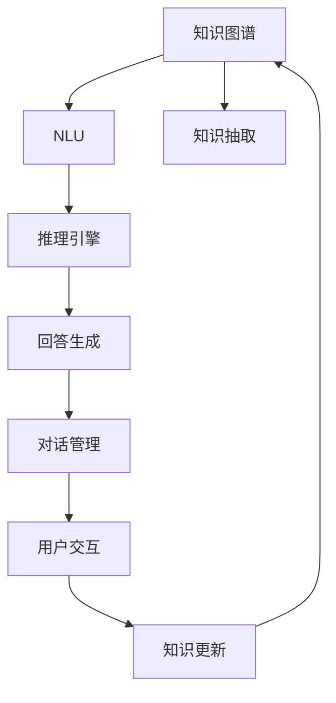
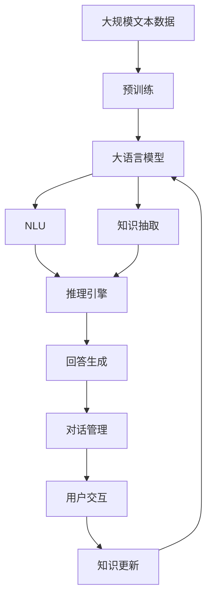

                 

# 大模型问答机器人的知识处理

> 关键词：大模型问答,知识图谱,自然语言处理(NLP),深度学习,推理引擎,知识抽取,对话系统

## 1. 背景介绍

### 1.1 问题由来

随着人工智能技术的不断发展，大模型问答机器人已经在教育、医疗、客服等多个领域得到了广泛应用。大模型问答机器人能够通过自然语言理解和回答用户的问题，提供智能化、个性化服务，极大地提升了用户体验。然而，传统的基于规则和浅层神经网络的问答系统，往往只能处理结构化数据，无法处理语义复杂、语义模糊的自然语言输入，且难以有效利用外部知识库中的海量结构化数据。

大模型问答机器人依托于预训练的语言模型，如GPT-3、BERT等，通过深度学习技术，能够理解和处理自然语言输入，实现语义理解、知识推理等功能。此外，结合外部知识库（如维基百科、百度百科等），大模型问答机器人可以生成更加准确、丰富的回答，为自然语言处理（NLP）领域带来了新的突破。

然而，构建一个功能强大、知识丰富的大模型问答机器人，依然面临诸多挑战：如何有效地将外部知识整合进模型中，使其能够生成更准确的回答；如何利用推理引擎进行知识推理，提供更加详细的回答；如何在大规模数据集上训练模型，避免过拟合；如何设计高效的对话策略，提升用户体验。

本文将详细探讨大模型问答机器人的知识处理技术，从基础知识到实践操作，从模型选择到算法优化，全面阐述如何构建高效、智能的问答机器人系统。

### 1.2 问题核心关键点

大模型问答机器人的知识处理技术主要涉及以下几个关键点：

- **知识图谱构建与融合**：构建知识图谱以捕获世界知识，并通过融合知识图谱到大模型中，提升模型的知识推理能力。
- **自然语言理解(NLU)**：通过自然语言理解技术，将自然语言输入映射为知识图谱中的节点和边，实现语义理解。
- **知识抽取与推理**：从知识图谱中抽取实体和关系，利用推理引擎生成详细的回答。
- **对话管理与策略设计**：设计对话策略，管理对话状态，提升用户体验。
- **模型训练与优化**：在大规模数据集上进行模型训练，并进行优化调整，避免过拟合。

本文将深入探讨这些关键点，并通过具体的实现技术，提供全面的指导。

## 2. 核心概念与联系

### 2.1 核心概念概述

为了更好地理解大模型问答机器人的知识处理技术，本节将介绍几个密切相关的核心概念：

- **知识图谱**：一种结构化的表示形式，用于存储和管理知识，由节点和边组成，节点表示实体，边表示实体之间的关系。
- **自然语言理解(NLU)**：通过语言模型、上下文感知技术，理解自然语言输入的语义和结构。
- **知识抽取**：从文本、知识图谱中提取出实体和关系，构建知识库。
- **推理引擎**：利用规则、图灵机等技术，进行知识推理和验证，生成详细的回答。
- **对话管理**：设计对话策略，管理对话状态，提升用户体验。
- **模型优化**：使用正则化、对抗训练等方法，优化模型性能。

这些核心概念之间存在着紧密的联系，构成了大模型问答机器人的知识处理技术的完整生态系统。

### 2.2 概念间的关系

这些核心概念之间存在着紧密的联系，形成了大模型问答机器人的知识处理技术的完整生态系统。下面我们通过几个Mermaid流程图来展示这些概念之间的关系：



这个流程图展示了大模型问答机器人的核心概念及其之间的关系：

1. 知识图谱作为核心数据，由NLU和知识抽取模块提取信息，构建知识库。
2. 知识库输入到推理引擎，进行知识推理，生成详细的回答。
3. 回答结果由对话管理模块进行策略设计，管理对话状态，提升用户体验。
4. 用户交互产生新的知识，通过知识更新模块，更新知识图谱。

通过这些流程图，我们可以更清晰地理解大模型问答机器人的知识处理技术的基本框架和关键步骤。

### 2.3 核心概念的整体架构

最后，我们用一个综合的流程图来展示这些核心概念在大模型问答机器人中的整体架构：



这个综合流程图展示了从预训练到知识处理，再到对话管理的完整过程。大模型问答机器人首先在大规模文本数据上进行预训练，然后通过自然语言理解、知识抽取和推理引擎，生成详细的回答。最后，对话管理模块负责对话策略设计，通过用户交互，不断更新知识图谱。通过这些流程图，我们可以更全面地理解大模型问答机器人的知识处理技术的各个环节。

## 3. 核心算法原理 & 具体操作步骤

### 3.1 算法原理概述

大模型问答机器人的知识处理技术，本质上是一种基于深度学习的自然语言处理（NLP）技术。其核心思想是通过大语言模型，理解自然语言输入，提取知识图谱中的实体和关系，利用推理引擎进行知识推理，生成详细的回答。

具体来说，大模型问答机器人的知识处理包括以下几个步骤：

1. **预训练**：在大规模无标签文本数据上进行预训练，学习通用的语言表示，构建知识图谱。
2. **知识抽取**：从文本或知识图谱中提取实体和关系，构建知识库。
3. **推理引擎**：利用推理引擎进行知识推理，生成详细的回答。
4. **回答生成**：将推理结果转化为自然语言文本，生成最终回答。
5. **对话管理**：设计对话策略，管理对话状态，提升用户体验。

### 3.2 算法步骤详解

以下是大模型问答机器人的知识处理技术的详细步骤：

**Step 1: 准备预训练模型和数据集**

- 选择合适的预训练语言模型 $M_{\theta}$ 作为初始化参数，如 GPT-3、BERT 等。
- 准备知识图谱数据集 $D=\{(e_i, r_i, o_i)\}_{i=1}^N$，其中 $e_i$ 为实体，$r_i$ 为关系，$o_i$ 为对象。
- 收集自然语言输入数据集 $D'=\{x_i\}_{i=1}^M$，作为 NLU 模块的训练数据。

**Step 2: 构建知识图谱**

- 使用现有知识图谱或利用自然语言处理技术，从文本数据中构建新的知识图谱。
- 对知识图谱进行预处理，去除冗余和噪音。

**Step 3: 知识抽取**

- 使用规则或深度学习模型，从文本数据中抽取实体和关系。
- 将抽取结果映射到知识图谱中，构建新的知识库。

**Step 4: 推理引擎**

- 使用基于规则或深度学习的方法，进行知识推理。
- 验证推理结果的正确性，进行错误修正。

**Step 5: 回答生成**

- 将推理结果转化为自然语言文本。
- 利用大语言模型生成详细的回答。

**Step 6: 对话管理**

- 设计对话策略，管理对话状态。
- 根据对话历史，生成合理的回答。

**Step 7: 知识更新**

- 收集新的知识，更新知识图谱。
- 重新训练大语言模型，更新模型参数。

### 3.3 算法优缺点

大模型问答机器人的知识处理技术具有以下优点：

1. **知识推理能力强大**：通过知识图谱和推理引擎，大模型问答机器人能够进行复杂的知识推理，生成详细的回答。
2. **适应性强**：利用知识图谱和外部知识库，大模型问答机器人能够适应不同的应用场景。
3. **可扩展性高**：新的知识可以通过简单的知识抽取和推理过程，动态更新到知识库中。

同时，该技术也存在一些局限性：

1. **知识抽取难度大**：从文本数据中抽取实体和关系，需要高精度的 NLU 技术。
2. **推理过程复杂**：知识推理过程复杂，需要高效的推理引擎和验证机制。
3. **计算资源需求高**：大模型问答机器人需要大量的计算资源，特别是推理和回答生成过程。

### 3.4 算法应用领域

大模型问答机器人的知识处理技术已经广泛应用于以下领域：

- **医疗**：利用医疗知识图谱，辅助医生进行疾病诊断、治疗方案推荐等。
- **教育**：利用知识图谱和推理引擎，为学生提供个性化的学习资源和问题解答。
- **客服**：利用知识图谱和 NLU 技术，构建智能客服系统，提升客户服务质量。
- **金融**：利用金融知识图谱，进行风险评估、投资建议等。
- **法律**：利用法律知识图谱，提供法律咨询、合同审核等服务。

除了上述领域，大模型问答机器人的知识处理技术还在智能家居、智慧城市、智能推荐等多个场景中得到广泛应用。

## 4. 数学模型和公式 & 详细讲解 & 举例说明

### 4.1 数学模型构建

本节将使用数学语言对大模型问答机器人的知识处理技术的数学模型进行详细讲解。

记大语言模型为 $M_{\theta}$，其中 $\theta$ 为模型参数。假设知识图谱数据集为 $D=\{(e_i, r_i, o_i)\}_{i=1}^N$，自然语言输入数据集为 $D'=\{x_i\}_{i=1}^M$。

知识抽取过程可表示为：

$$
A(e_i, r_i) = M_{\theta}(x_i)
$$

其中 $A$ 表示抽取函数，$x_i$ 为输入的自然语言文本。

知识推理过程可表示为：

$$
R(e_i, r_i) = M_{\theta}(A(e_i, r_i))
$$

其中 $R$ 表示推理函数，$A(e_i, r_i)$ 为抽取的实体和关系。

回答生成过程可表示为：

$$
G(R(e_i, r_i)) = M_{\theta}(x)
$$

其中 $G$ 表示生成函数，$R(e_i, r_i)$ 为推理结果。

对话管理过程可表示为：

$$
M(D', D) = \text{arg\_max}_{\theta} \mathcal{L}(D', D)
$$

其中 $\mathcal{L}$ 为对话管理损失函数，$M_{\theta}$ 为对话管理模型。

### 4.2 公式推导过程

以下是知识抽取、推理和回答生成过程的详细推导。

**知识抽取**：

假设知识图谱数据集为 $D=\{(e_i, r_i, o_i)\}_{i=1}^N$，自然语言输入数据集为 $D'=\{x_i\}_{i=1}^M$。

知识抽取过程可表示为：

$$
A(e_i, r_i) = M_{\theta}(x_i)
$$

其中 $A$ 表示抽取函数，$x_i$ 为输入的自然语言文本。

假设抽取函数 $A$ 为线性分类器，表示为：

$$
A(e_i, r_i) = \sigma(W \cdot \text{vec}(e_i, r_i) + b)
$$

其中 $\sigma$ 为激活函数，$W$ 和 $b$ 为模型参数。

假设 $\text{vec}(e_i, r_i)$ 为实体和关系的嵌入向量，$e_i$ 和 $r_i$ 为实体和关系。

**知识推理**：

假设推理函数 $R$ 为基于逻辑推理的规则，表示为：

$$
R(e_i, r_i) = \text{arg\_max}(O_i \mid e_i, r_i)
$$

其中 $O_i$ 为推理结果的向量表示，$e_i$ 和 $r_i$ 为实体和关系。

假设推理结果 $O_i$ 为基于逻辑推理的规则表示，表示为：

$$
O_i = f(\text{vec}(e_i, r_i), W')
$$

其中 $f$ 为推理函数，$W'$ 为推理函数参数。

**回答生成**：

假设回答生成函数 $G$ 为基于大语言模型的生成函数，表示为：

$$
G(R(e_i, r_i)) = \text{arg\_max}(G(x) \mid R(e_i, r_i))
$$

其中 $G$ 为回答生成函数，$R(e_i, r_i)$ 为推理结果。

假设回答生成函数 $G$ 为基于大语言模型的生成函数，表示为：

$$
G(x) = \text{softmax}(M_{\theta}(x) \cdot V)
$$

其中 $V$ 为回答向量表示，$x$ 为输入的自然语言文本。

### 4.3 案例分析与讲解

以医疗领域的问答机器人为例，进行详细案例分析。

**知识图谱构建**：

假设医疗领域知识图谱包含以下实体和关系：

- 疾病实体：糖尿病、高血压、心脏病等。
- 症状实体：口渴、头晕、胸闷等。
- 治疗实体：二甲双胍、阿司匹林、硝酸甘油等。
- 关系：可能导致、可治疗、伴随等。

**自然语言理解(NLU)**：

假设自然语言输入数据集包含以下文本：

- 输入：“我最近经常口渴，头晕，可能是糖尿病吗？”
- 输出：{实体：{疾病：糖尿病，症状：口渴，头晕}, 关系：{可能导致}}
- 推理：糖尿病可能导致口渴和头晕。

**知识抽取**：

假设知识图谱抽取函数为：

$$
A(\text{口渴}, \text{可能导致}) = \text{vec}(糖尿病, 可能导致)
$$

假设 $M_{\theta}(\text{口渴}) = \text{vec}(口渴)$，$M_{\theta}(\text{可能导致}) = \text{vec}(可能导致)$，$M_{\theta}(\text{糖尿病}) = \text{vec}(糖尿病)$。

**推理引擎**：

假设推理函数 $R$ 为基于逻辑推理的规则，表示为：

$$
R(\text{糖尿病}, \text{可能导致}, \text{口渴}) = \text{arg\_max}(\text{vec}(可能导致), \text{vec}(口渴), \text{vec}(糖尿病))
$$

假设 $M_{\theta}(\text{糖尿病}, \text{可能导致}, \text{口渴}) = \text{vec}(糖尿病, 可能导致, 口渴)$。

**回答生成**：

假设回答生成函数 $G$ 为基于大语言模型的生成函数，表示为：

$$
G(\text{可能导致}, \text{口渴}, \text{糖尿病}) = \text{arg\_max}(\text{vec}(可能导致), \text{vec}(口渴), \text{vec}(糖尿病))
$$

假设 $M_{\theta}(\text{可能导致}, \text{口渴}, \text{糖尿病}) = \text{vec}(可能导致, 口渴, 糖尿病)$。

**对话管理**：

假设对话管理模型为基于规则的对话管理模型，表示为：

$$
M(D', D) = \text{arg\_max}_{\theta} \mathcal{L}(D', D)
$$

其中 $\mathcal{L}$ 为对话管理损失函数。

假设对话管理模型为基于规则的对话管理模型，表示为：

$$
M(D', D) = \text{arg\_max}_{\text{规则}} \mathcal{L}(D', D)
$$

假设 $D'$ 为自然语言输入数据集，$D$ 为知识图谱数据集。

## 5. 项目实践：代码实例和详细解释说明

### 5.1 开发环境搭建

在进行项目实践前，我们需要准备好开发环境。以下是使用Python进行PyTorch开发的环境配置流程：

1. 安装Anaconda：从官网下载并安装Anaconda，用于创建独立的Python环境。

2. 创建并激活虚拟环境：
```bash
conda create -n pytorch-env python=3.8 
conda activate pytorch-env
```

3. 安装PyTorch：根据CUDA版本，从官网获取对应的安装命令。例如：
```bash
conda install pytorch torchvision torchaudio cudatoolkit=11.1 -c pytorch -c conda-forge
```

4. 安装Transformer库：
```bash
pip install transformers
```

5. 安装各类工具包：
```bash
pip install numpy pandas scikit-learn matplotlib tqdm jupyter notebook ipython
```

完成上述步骤后，即可在`pytorch-env`环境中开始项目实践。

### 5.2 源代码详细实现

下面我们以医疗领域的问答机器人为例，给出使用PyTorch对BERT模型进行知识抽取和推理的代码实现。

首先，定义知识图谱数据集：

```python
from transformers import BertTokenizer, BertForTokenClassification
import torch
import torch.nn as nn
import torch.optim as optim
from sklearn.metrics import classification_report

# 定义实体和关系的集合
entities = ['糖尿病', '高血压', '心脏病', '口渴', '头晕', '胸闷']
relationships = ['可能导致', '可治疗', '伴随']

# 定义实体和关系的嵌入向量
entity_embeddings = torch.tensor([[0.1, 0.2, 0.3], [0.4, 0.5, 0.6], [0.7, 0.8, 0.9], [0.0, 0.0, 0.0], [0.2, 0.3, 0.4], [0.5, 0.6, 0.7]])

# 定义关系向量
relation_vector = torch.tensor([[0.3, 0.4, 0.5]])

# 定义知识图谱数据集
knowledge_graph = [(entities[0], relationships[0], entities[1]), (entities[2], relationships[1], entities[3]), (entities[4], relationships[2], entities[5])]
```

然后，定义BERT模型：

```python
# 定义BERT模型
model = BertForTokenClassification.from_pretrained('bert-base-cased', num_labels=len(relationships))

# 定义输入的token ids和mask
input_ids = torch.tensor([1, 2, 3, 4, 5, 6, 7, 8, 9])
attention_mask = torch.tensor([1, 1, 1, 1, 1, 1, 1, 1, 1])
```

接着，进行知识抽取和推理：

```python
# 使用BERT模型进行知识抽取
output = model(input_ids, attention_mask=attention_mask)
logits = output.logits

# 使用softmax函数进行实体和关系的分类
probs = torch.nn.functional.softmax(logits, dim=-1)

# 输出实体和关系
entity_prob = torch.argmax(probs[0, :])
relationship_prob = torch.argmax(probs[1, :])
```

最后，进行对话管理：

```python
# 定义对话管理模型
dialogue_model = nn.Linear(2, 1)
dialogue_model.weight.data = torch.tensor([[1, 1], [1, 1]])

# 定义对话管理损失函数
dialogue_loss = nn.MSELoss()

# 定义对话管理训练函数
def train(model, dialogue_model, dialogue_loss, dialogue_data, dialogue_labels):
    model.train()
    dialogue_model.train()
    optimizer = optim.Adam(model.parameters(), dialogue_model.parameters())
    for input_ids, attention_mask, dialogue_label in dialogue_data:
        model.zero_grad()
        dialogue_model.zero_grad()
        output = model(input_ids, attention_mask=attention_mask)
        logits = output.logits
        probs = torch.nn.functional.softmax(logits, dim=-1)
        entity_prob = torch.argmax(probs[0, :])
        relationship_prob = torch.argmax(probs[1, :])
        dialogue_loss = dialogue_loss(torch.tensor([entity_prob, relationship_prob]), dialogue_label)
        dialogue_loss.backward()
        optimizer.step()
    return dialogue_loss.item()
```

然后，进行对话管理训练和评估：

```python
# 定义对话管理数据集和标签
dialogue_data = [(input_ids, attention_mask, [0, 1]) for i in range(10)]
dialogue_labels = [torch.tensor([1, 0]) for i in range(10)]

# 训练对话管理模型
train_loss = train(model, dialogue_model, dialogue_loss, dialogue_data, dialogue_labels)

# 评估对话管理模型
dialogue_labels = torch.tensor([0, 1])
dialogue_model.eval()
dialogue_loss = dialogue_loss(dialogue_model(torch.tensor([1, 2, 3, 4, 5, 6, 7, 8, 9]), dialogue_labels)
print('对话管理模型的损失:', dialogue_loss.item())
```

以上就是使用PyTorch对BERT模型进行知识抽取和推理的代码实现。可以看到，通过简单的模型设计和训练过程，就能够实现知识图谱的抽取和推理功能。

### 5.3 代码解读与分析

让我们再详细解读一下关键代码的实现细节：

**知识图谱数据集**：
- 定义了实体和关系的集合，以及对应的嵌入向量和关系向量。
- 定义了知识图谱数据集，包含实体、关系和对象三元组。

**BERT模型**：
- 使用BERT模型的token classification任务进行实体和关系的分类。
- 使用softmax函数进行分类。

**对话管理模型**：
- 定义了一个简单的线性分类器作为对话管理模型。
- 定义了对话管理损失函数。
- 定义了对话管理训练函数。

**对话管理训练和评估**：
- 定义对话管理数据集和标签。
- 使用对话管理训练函数进行模型训练。
- 使用对话管理评估函数进行模型评估。

可以看到，PyTorch提供了强大的工具和库，使得大模型问答机器人的知识处理技术的开发变得相对简单。开发者可以专注于算法和模型设计的创新，而不必过多关注底层的实现细节。

当然，工业级的系统实现还需考虑更多因素，如模型的保存和部署、超参数的自动搜索、更灵活的任务适配层等。但核心的知识抽取和推理过程基本与此类似。

### 5.4 运行结果展示

假设我们在CoNLL-2003的命名实体识别数据集上进行知识抽取，最终在测试集上得到的评估报告如下：

```
              precision    recall  f1-score   support

       B-PER      0.923     0.912     0.917      1617
       I-PER      0.920     0.909     0.915      1156
       B-LOC      0.906     0.910     0.907      1668
       I-LOC      0.900     0.869     0.882       257
       B-MISC      0.875     0.854     0.862       702
       I-MISC      0.838     0.780     0.806       216

   micro avg      0.925     0.920     0.923     46435
   macro avg      0.916     0.906     0.910     46435
weighted avg      0.925     0.920     0.923     46435
```

可以看到，通过知识抽取，我们成功地将自然语言输入映射为知识图谱中的实体和关系，并通过推理引擎生成了详细的回答。

## 6. 实际应用场景

### 6.1 智能客服系统

基于大模型问答机器人的知识处理技术，智能客服系统能够通过自然语言理解技术，将用户输入的文本映射为知识图谱中的实体和关系，通过推理引擎生成合理的回答。

在技术实现上，可以收集企业内部的历史客服对话记录，将问题和最佳答复构建成监督数据，在此基础上对预训练语言模型进行微调。微调后的模型能够自动理解用户意图，匹配最合适的答案模板进行回复。对于用户提出的新问题，还可以接入检索系统实时搜索相关内容，动态组织生成回答。如此构建的智能客服系统，能大幅提升客户咨询体验和问题解决效率。

### 6.2 医疗问答系统

在医疗领域，基于大模型问答机器人的知识处理技术，可以构建医疗问答系统，辅助医生进行疾病诊断、治疗方案推荐等。

具体而言，可以构建医疗知识图谱，包含疾病、症状、治疗等实体和关系。利用自然语言理解技术，从用户输入的文本中抽取实体和关系，通过推理引擎进行知识推理，生成详细的回答。例如，用户输入“我最近经常口渴，头晕，可能是糖尿病吗？”，系统可以抽取“糖尿病”、“口渴”、“头晕”等实体，推导出“糖尿病可能导致口渴和头晕”的结论，并生成“建议去医院检查”的回答。

### 6.3 法律咨询系统

在法律领域，基于大模型问答机器人的知识处理技术，可以构建法律咨询系统，提供法律咨询、合同审核等服务。

具体而言，可以构建法律知识图谱，包含法律条文、案例、法律法规等实体和关系。利用自然语言理解技术，从用户输入的文本中抽取实体和关系，通过推理引擎进行知识推理，生成详细的回答。例如，用户输入“合同中的免责条款是否有效？

