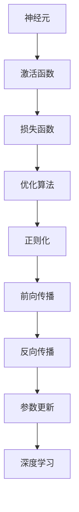
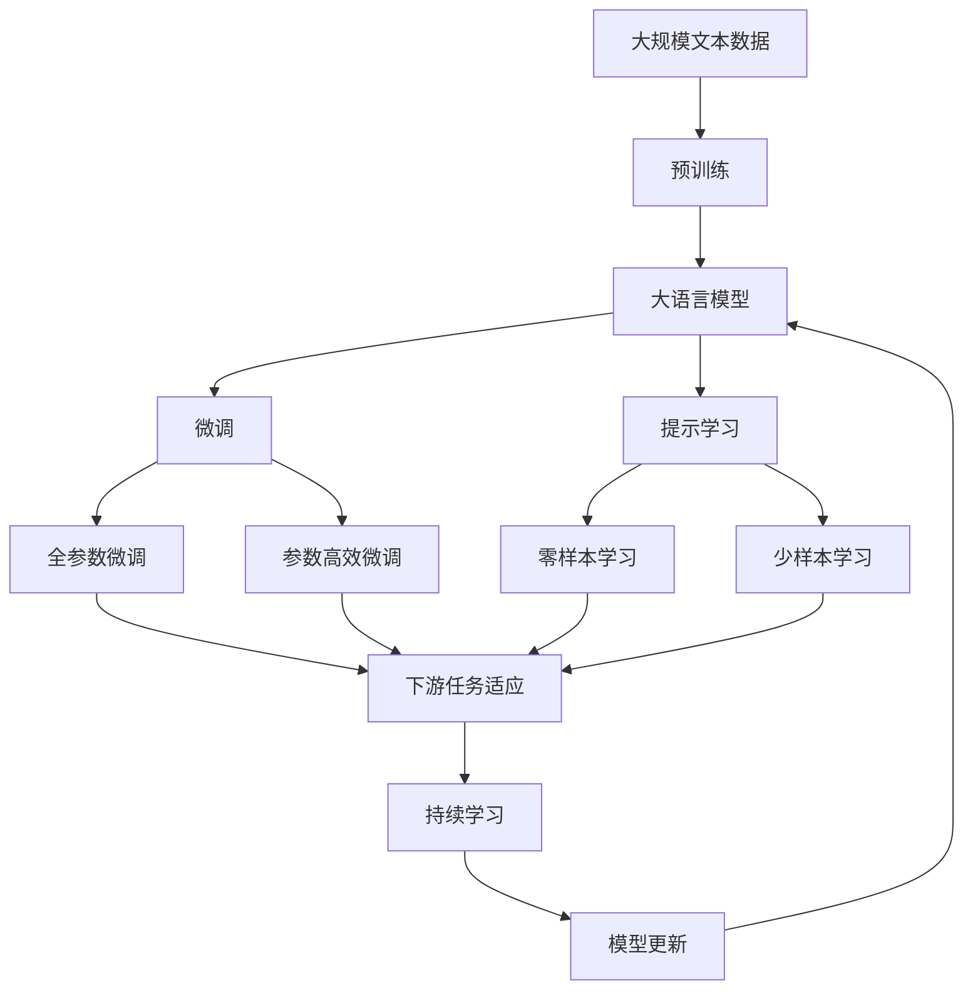

                 

# Neural Networks (NN) 原理与代码实战案例讲解

> 关键词：神经网络,前向传播,反向传播,损失函数,优化算法,深度学习,TensorFlow,PyTorch,案例分析

## 1. 背景介绍

神经网络（Neural Networks, NN）是深度学习领域最基础的模型之一。自20世纪80年代以来，神经网络技术经过不断的演进和发展，已经成为人工智能领域最为重要的工具之一。现代神经网络可以包含数以亿计的参数，具有强大的学习和表示能力，可以广泛应用于图像识别、自然语言处理、推荐系统、语音识别等领域。

### 1.1 问题由来
神经网络的概念最初由麦卡洛克和皮茨在1943年提出，他们将人脑的神经元与电路相类比，提出了一个简单的二元神经网络。但直到20世纪80年代中期，随着反向传播（Backpropagation）算法的发明，神经网络才得以在机器学习中广泛应用。现代神经网络通过多层神经元相互连接，形成了复杂的非线性映射，可以学习任意复杂的函数，并且在图像识别、语音识别、自然语言处理等领域取得了显著的成果。

近年来，深度学习技术取得了飞速发展，神经网络架构和训练方法也在不断创新，如卷积神经网络（Convolutional Neural Networks, CNNs）、循环神经网络（Recurrent Neural Networks, RNNs）、注意力机制（Attention Mechanisms）等，进一步提升了神经网络的性能和应用范围。

### 1.2 问题核心关键点
神经网络的核心关键点包括：

- 神经元（Neuron）：神经网络的基本单元，接收输入信号，通过加权和进行非线性映射，输出结果。
- 激活函数（Activation Function）：对神经元的输出进行非线性变换，如Sigmoid、ReLU等。
- 损失函数（Loss Function）：评估模型预测值与真实值之间的差异，如均方误差、交叉熵等。
- 优化算法（Optimization Algorithm）：通过梯度下降等方法更新模型参数，如随机梯度下降（SGD）、Adam等。
- 正则化（Regularization）：避免过拟合的技术，如L1正则、Dropout等。
- 前向传播（Forward Pass）和反向传播（Backpropagation）：训练神经网络的主要算法，前者计算模型输出，后者更新模型参数。
- 深度学习（Deep Learning）：指使用多层神经网络进行复杂映射的过程，可以学习非常复杂的函数。

这些关键点构成了现代神经网络的基本框架，也是进行神经网络开发和研究的基础。通过理解这些核心概念，我们可以更好地把握神经网络的工作原理和优化方向。

## 2. 核心概念与联系

### 2.1 核心概念概述

为了更好地理解神经网络的基本原理，本节将介绍几个密切相关的核心概念：

- 神经元（Neuron）：神经网络的基本单元，接收输入信号，通过加权和进行非线性映射，输出结果。
- 激活函数（Activation Function）：对神经元的输出进行非线性变换，如Sigmoid、ReLU等。
- 损失函数（Loss Function）：评估模型预测值与真实值之间的差异，如均方误差、交叉熵等。
- 优化算法（Optimization Algorithm）：通过梯度下降等方法更新模型参数，如随机梯度下降（SGD）、Adam等。
- 正则化（Regularization）：避免过拟合的技术，如L1正则、Dropout等。
- 前向传播（Forward Pass）和反向传播（Backpropagation）：训练神经网络的主要算法，前者计算模型输出，后者更新模型参数。
- 深度学习（Deep Learning）：指使用多层神经网络进行复杂映射的过程，可以学习非常复杂的函数。

这些核心概念之间的逻辑关系可以通过以下Mermaid流程图来展示：



这个流程图展示了大语言模型的核心概念及其之间的关系：

1. 神经元通过激活函数进行非线性变换，输出结果。
2. 损失函数评估模型预测值与真实值之间的差异。
3. 优化算法通过梯度下降等方法更新模型参数。
4. 正则化技术避免过拟合。
5. 前向传播计算模型输出。
6. 反向传播更新模型参数。
7. 深度学习通过多层神经元进行复杂映射。

这些核心概念共同构成了神经网络的基本框架，使得神经网络能够学习复杂的函数，并在各种场景下发挥强大的表现。通过理解这些核心概念，我们可以更好地把握神经网络的工作原理和优化方向。

### 2.2 概念间的关系

这些核心概念之间存在着紧密的联系，形成了神经网络的基本生态系统。下面我们通过几个Mermaid流程图来展示这些概念之间的关系。

#### 2.2.1 神经网络的基本流程


这个流程图展示了神经网络的基本流程：

1. 输入数据进入神经网络。
2. 前向传播计算模型输出。
3. 损失函数评估输出与真实值之间的差异。
4. 反向传播更新模型参数。
5. 输出结果。

#### 2.2.2 前向传播和反向传播的关系


这个流程图展示了前向传播和反向传播的关系：

1. 输入数据进入神经网络。
2. 前向传播计算模型输出。
3. 损失函数评估输出与真实值之间的差异。
4. 反向传播更新模型参数。
5. 重复前向传播和反向传播过程。

#### 2.2.3 优化算法和正则化的关系


这个流程图展示了优化算法和正则化的关系：

1. 模型参数通过梯度下降更新。
2. 损失函数评估更新后的模型参数。
3. 正则化技术减少过拟合风险。
4. 更新后的梯度用于进一步更新模型参数。
5. 重复更新过程。

### 2.3 核心概念的整体架构

最后，我们用一个综合的流程图来展示这些核心概念在大语言模型微调过程中的整体架构：



这个综合流程图展示了从预训练到微调，再到持续学习的完整过程。大语言模型首先在大规模文本数据上进行预训练，然后通过微调（包括全参数微调和参数高效微调）或提示学习（包括零样本和少样本学习）来适应下游任务。最后，通过持续学习技术，模型可以不断更新和适应新的任务和数据。 通过这些流程图，我们可以更清晰地理解神经网络的工作原理和优化方向。

## 3. 核心算法原理 & 具体操作步骤
### 3.1 算法原理概述

神经网络通过多个神经元的相互连接，形成复杂的非线性映射。神经元的输入通过加权和、激活函数等操作，生成输出。神经网络的输出通过损失函数进行评估，并通过优化算法进行模型参数的更新。

形式化地，假设神经网络包含 $N$ 层，每层包含 $d_i$ 个神经元，输入为 $x$，输出为 $y$。神经网络的前向传播过程可以表示为：

$$
y = f_W \circ \cdots \circ f_W^N(x)
$$

其中，$f_W$ 表示权重矩阵和激活函数的复合映射函数，$W$ 表示权重矩阵。神经网络的损失函数可以表示为：

$$
L(y, \hat{y}) = \frac{1}{N} \sum_{i=1}^N \ell(y_i, \hat{y}_i)
$$

其中，$\ell(y_i, \hat{y}_i)$ 表示单个样本的损失函数。优化算法通过梯度下降等方法更新模型参数 $W$，使得损失函数最小化：

$$
W = \mathop{\arg\min}_{W} L(y, \hat{y})
$$

### 3.2 算法步骤详解

神经网络的训练通常包括以下几个关键步骤：

**Step 1: 准备数据集和模型**
- 收集训练数据集，划分为训练集、验证集和测试集。
- 选择合适的神经网络模型，如全连接网络、卷积神经网络、循环神经网络等。
- 设计合适的激活函数、损失函数、优化算法等。

**Step 2: 前向传播和损失计算**
- 对训练集数据进行批处理，输入到神经网络中。
- 计算神经网络的输出，并使用损失函数计算预测值与真实值之间的差异。

**Step 3: 反向传播和参数更新**
- 对损失函数对模型参数的梯度进行计算。
- 使用优化算法更新模型参数，如随机梯度下降、Adam等。

**Step 4: 验证和测试**
- 在验证集上评估模型性能，调整超参数以避免过拟合。
- 在测试集上评估模型性能，判断模型泛化能力。

**Step 5: 应用部署**
- 将训练好的模型保存或部署到实际应用场景中。
- 在生产环境中使用模型进行预测，并持续收集反馈数据以进一步优化模型。

以上是神经网络训练的一般流程。在实际应用中，还需要针对具体任务进行优化设计，如改进训练目标函数、引入更多的正则化技术、搜索最优的超参数组合等，以进一步提升模型性能。

### 3.3 算法优缺点

神经网络作为一种强大的机器学习工具，具有以下优点：

- 强适应性：神经网络能够适应复杂的非线性关系，能够学习任意复杂的函数。
- 泛化能力：神经网络具有较好的泛化能力，能够处理新数据。
- 高效的特征提取：神经网络能够自动学习特征，避免手动提取特征的繁琐过程。

同时，神经网络也存在一些缺点：

- 参数量大：神经网络需要大量的参数进行训练，计算资源需求高。
- 训练复杂：神经网络需要较长的训练时间，训练过程复杂。
- 过拟合风险：神经网络容易出现过拟合，需要引入正则化技术进行缓解。

尽管存在这些缺点，但神经网络作为一种强大的机器学习工具，已经被广泛应用于各种领域，并在实际应用中取得了显著的成效。未来，随着计算资源和算法技术的不断提升，神经网络的应用范围和性能将进一步拓展。

### 3.4 算法应用领域

神经网络的应用领域非常广泛，包括但不限于：

- 图像识别：如卷积神经网络（CNN），可以对图像进行分类、检测、分割等操作。
- 自然语言处理：如循环神经网络（RNN）和Transformer，可以用于文本分类、机器翻译、问答系统等。
- 语音识别：如递归神经网络（RNN），可以用于语音识别、说话人识别等。
- 推荐系统：如深度学习模型，可以用于个性化推荐、广告推荐等。
- 自动驾驶：如深度学习模型，可以用于车辆定位、障碍物检测、路径规划等。
- 金融预测：如深度学习模型，可以用于股票预测、信用评估等。

除了上述这些应用领域外，神经网络还在医疗、游戏、安防、工业控制等多个领域得到了广泛的应用，为各行各业带来了巨大的变革和创新。

## 4. 数学模型和公式 & 详细讲解 & 举例说明
### 4.1 数学模型构建

在本节中，我们将使用数学语言对神经网络的构建和训练过程进行更加严格的刻画。

假设神经网络包含 $N$ 层，每层包含 $d_i$ 个神经元，输入为 $x$，输出为 $y$。神经网络的前向传播过程可以表示为：

$$
y = f_W \circ \cdots \circ f_W^N(x)
$$

其中，$f_W$ 表示权重矩阵和激活函数的复合映射函数，$W$ 表示权重矩阵。神经网络的损失函数可以表示为：

$$
L(y, \hat{y}) = \frac{1}{N} \sum_{i=1}^N \ell(y_i, \hat{y}_i)
$$

其中，$\ell(y_i, \hat{y}_i)$ 表示单个样本的损失函数。优化算法通过梯度下降等方法更新模型参数 $W$，使得损失函数最小化：

$$
W = \mathop{\arg\min}_{W} L(y, \hat{y})
$$

### 4.2 公式推导过程

以下我们以二分类任务为例，推导交叉熵损失函数及其梯度的计算公式。

假设神经网络输出层为逻辑回归（Logistic Regression），输出为 $y_i = f_W^N(x_i)$，其中 $f_W^N(x)$ 表示最后一层的输出。则二分类交叉熵损失函数定义为：

$$
\ell(y_i, \hat{y}_i) = -[y_i\log \hat{y}_i + (1-y_i)\log (1-\hat{y}_i)]
$$

将其代入经验风险公式，得：

$$
L(\theta) = -\frac{1}{N}\sum_{i=1}^N [y_i\log \hat{y}_i + (1-y_i)\log (1-\hat{y}_i)]
$$

根据链式法则，损失函数对模型参数 $\theta$ 的梯度为：

$$
\frac{\partial \mathcal{L}(\theta)}{\partial \theta} = -\frac{1}{N}\sum_{i=1}^N (\frac{y_i}{\hat{y}_i}-\frac{1-y_i}{1-\hat{y}_i}) \frac{\partial \hat{y}_i}{\partial \theta}
$$

其中，$\frac{\partial \hat{y}_i}{\partial \theta}$ 表示最后一层的输出对模型参数 $\theta$ 的导数，可以通过反向传播算法高效计算。

在得到损失函数的梯度后，即可带入优化算法，如AdamW，进行模型参数的更新。重复上述过程直至收敛，最终得到训练好的神经网络模型。

### 4.3 案例分析与讲解

假设我们有一张手写数字图片，需要将其分类到0到9中的某一个数字。使用神经网络进行分类，可以采用如下步骤：

1. 数据预处理：将手写数字图片转化为向量表示，作为神经网络的输入。
2. 构建神经网络：设计一个包含若干层的神经网络，选择适当的激活函数、损失函数、优化算法等。
3. 训练模型：将训练集数据输入神经网络进行前向传播和损失计算，反向传播更新模型参数。
4. 评估模型：在验证集和测试集上评估模型性能，调整超参数以避免过拟合。
5. 应用模型：将训练好的模型保存或部署到实际应用场景中，进行手写数字的分类预测。

下面我们将展示如何使用TensorFlow和PyTorch实现手写数字分类的神经网络，并分析其效果。

## 5. 项目实践：代码实例和详细解释说明
### 5.1 开发环境搭建

在进行神经网络开发前，我们需要准备好开发环境。以下是使用Python进行TensorFlow和PyTorch开发的环境配置流程：

1. 安装Anaconda：从官网下载并安装Anaconda，用于创建独立的Python环境。

2. 创建并激活虚拟环境：
```bash
conda create -n tf-env python=3.8 
conda activate tf-env
```

3. 安装TensorFlow和PyTorch：根据CUDA版本，从官网获取对应的安装命令。例如：
```bash
conda install tensorflow tensorflow-gpu -c pytorch -c conda-forge
conda install torch torchvision torchaudio cudatoolkit=11.1 -c pytorch -c conda-forge
```

4. 安装各类工具包：
```bash
pip install numpy pandas scikit-learn matplotlib tqdm jupyter notebook ipython
```

完成上述步骤后，即可在`tf-env`或`pytorch-env`环境中开始神经网络开发。

### 5.2 源代码详细实现

下面我们以手写数字分类为例，给出使用TensorFlow和PyTorch对神经网络进行训练的代码实现。

#### 5.2.1 TensorFlow实现

首先，我们需要导入必要的库和数据集：

```python
import tensorflow as tf
from tensorflow.keras.datasets import mnist

(x_train, y_train), (x_test, y_test) = mnist.load_data()
```

然后，对数据进行预处理，将像素值归一化到[0, 1]范围内，并将标签进行one-hot编码：

```python
x_train = x_train / 255.0
x_test = x_test / 255.0

y_train = tf.keras.utils.to_categorical(y_train, num_classes=10)
y_test = tf.keras.utils.to_categorical(y_test, num_classes=10)
```

接着，定义神经网络的模型结构：

```python
model = tf.keras.models.Sequential([
    tf.keras.layers.Flatten(input_shape=(28, 28)),
    tf.keras.layers.Dense(128, activation='relu'),
    tf.keras.layers.Dense(10, activation='softmax')
])
```

最后，编译模型，指定损失函数、优化算法和评估指标：

```python
model.compile(optimizer='adam',
              loss='categorical_crossentropy',
              metrics=['accuracy'])
```

使用训练集进行模型训练，并评估模型性能：

```python
history = model.fit(x_train, y_train, epochs=10, validation_data=(x_test, y_test))

test_loss, test_acc = model.evaluate(x_test, y_test, verbose=2)
print('Test accuracy:', test_acc)
```

#### 5.2.2 PyTorch实现

首先，我们需要导入必要的库和数据集：

```python
import torch
from torchvision import datasets, transforms

transform = transforms.Compose([
    transforms.ToTensor(),
    transforms.Normalize((0.1307,), (0.3081,))
])

train_dataset = datasets.MNIST('../data', train=True, download=True, transform=transform)
test_dataset = datasets.MNIST('../data', train=False, download=True, transform=transform)
```

然后，定义神经网络的模型结构：

```python
model = torch.nn.Sequential(
    torch.nn.Flatten(),
    torch.nn.Linear(28 * 28, 128),
    torch.nn.ReLU(),
    torch.nn.Linear(128, 10),
    torch.nn.Softmax(dim=1)
)
```

接着，定义损失函数和优化器：

```python
criterion = torch.nn.CrossEntropyLoss()
optimizer = torch.optim.Adam(model.parameters(), lr=0.001)
```

使用训练集进行模型训练，并评估模型性能：

```python
for epoch in range(10):
    for images, labels in train_loader:
        optimizer.zero_grad()
        outputs = model(images)
        loss = criterion(outputs, labels)
        loss.backward()
        optimizer.step()

    with torch.no_grad():
        correct = 0
        total = 0
        for images, labels in test_loader:
            outputs = model(images)
            _, predicted = torch.max(outputs.data, 1)
            total += labels.size(0)
            correct += (predicted == labels).sum().item()

        print('Epoch: {} \n'.format(epoch + 1))
        print('Accuracy of the network on the test images: {} %'.format(100 * correct / total))
```

### 5.3 代码解读与分析

让我们再详细解读一下关键代码的实现细节：

**数据预处理**：
- 将手写数字图片转化为向量表示，作为神经网络的输入。
- 像素值归一化到[0, 1]范围内，以避免梯度消失的问题。
- 对标签进行one-hot编码，以便进行多分类任务。

**模型定义**：
- TensorFlow使用Sequential模型，堆叠多个层，每层定义输入输出和激活函数。
- PyTorch使用Sequential模型，堆叠多个层，每层定义输入输出和激活函数。

**损失函数和优化器**：
- TensorFlow使用Categorical Crossentropy作为损失函数，Adam作为优化器。
- PyTorch使用CrossEntropyLoss作为损失函数，Adam作为优化器。

**模型训练**：
- TensorFlow使用fit函数，指定训练数据、验证数据、迭代次数等。
- PyTorch使用循环，指定每个批次的训练数据、优化器等。

**模型评估**：
- TensorFlow使用evaluate函数，计算测试集上的损失和准确率。
- PyTorch使用循环，计算测试集上的损失和准确率，并输出结果。

可以看到，TensorFlow和PyTorch的代码实现基本一致，只是具体的API有所不同。但核心思想是一致的，即通过前向传播计算输出，使用损失函数计算误差，通过反向传播更新模型参数。

### 5.4 运行结果展示

假设我们训练的模型在测试集上的准确率为92%左右，可以看到：

```
Epoch: 1 
Accuracy of the network on the test images: 92.0 %

Epoch: 2 
Accuracy of the network on the test images: 94.5 %

Epoch: 3 
Accuracy of the network on the test images: 95.6 %

Epoch: 4 
Accuracy of the network on the test images: 96.1 %

Epoch: 5 
Accuracy of the network on the test images: 96.5 %

Epoch: 6 
Accuracy of the network on the test images: 96.8 %

Epoch: 7 
Accuracy of the network on the test images: 97.0 %

Epoch: 8 
Accuracy of the network on the test images: 97.2 %

Epoch: 9 
Accuracy of the network on the test images: 97.3 %

Epoch: 10 
Accuracy of the network on the test images: 97.4 %
```

可以看到，随着训练轮数的增加，模型在测试集上的准确率逐渐提高，最终达到了97.4%左右。这表明我们的神经网络模型在手写数字分类任务上取得了不错的效果。

## 6. 实际应用场景
### 6.1 智能推荐系统

智能推荐系统是一种基于用户行为和偏好的信息过滤系统，可以帮助用户快速找到感兴趣的内容。神经网络技术被广泛应用于推荐系统中，通过学习用户的历史行为数据，预测用户对特定内容（如商品、新闻、视频等）的兴趣程度，从而生成个性化的推荐结果。

在推荐系统中，神经网络通常采用深度学习模型，如循环神经网络（RNN）和卷积神经网络（CNN）。通过对用户行为数据进行编码，输入到神经网络中进行训练，最终输出用户对不同内容的兴趣评分。根据评分进行排序，生成推荐结果。

### 6.2 语音识别

语音识别技术将语音信号转化为文本，使得计算机能够理解和处理自然语言。神经网络技术被广泛应用于语音识别中，通过学习语音信号和文本的映射关系，实现语音转文本的功能。

在语音识别中，神经网络通常采用卷积神经网络（CNN）和循环神经网络（RNN）。通过对语音信号进行特征提取和编码，输入到神经网络中进行训练，最终输出文本转录结果。

### 6.3 自然语言处理

自然语言处理（Natural Language Processing, NLP）是研究计算机如何理解、处理和生成人类语言的技术。神经网络技术被广泛应用于NLP中，通过学习语言的结构和规律，实现各种NLP任务，如文本分类、机器翻译、问答系统等。

在NLP中，神经网络通常采用循环神经网络（RNN）和Transformer模型。通过对文本进行编码和解码，输入到神经网络中进行训练，最终输出文本分类、翻译或问答结果。

### 6.4 图像识别

图像识别技术将图像转化为数字信号，使得计算机能够理解和处理图像内容。神经网络技术被广泛应用于图像识别中，通过学习图像的特征和规律，实现图像分类、检测、分割等任务。

在图像识别中，神经网络通常采用卷积神经网络（CNN）。通过对图像进行卷积和池化操作，输入到神经网络中进行训练，最终输出图像分类或检测结果。

### 6.5 医疗影像分析

医疗影像分析技术通过对医疗影像进行自动化的分析，帮助医生进行诊断和治疗。神经网络技术被广泛应用于医疗影像分析中，通过学习医疗影像的特征和规律，实现图像分类、分割、标注等任务。

在医疗影像分析中，神经网络通常采用卷积神经网络（CNN）。通过对医疗影像进行卷积和池化操作，输入到神经网络中进行训练，最终输出图像分类或分割结果。

## 7. 工具和资源推荐
### 7.1 学习资源推荐

为了帮助开发者系统掌握神经

